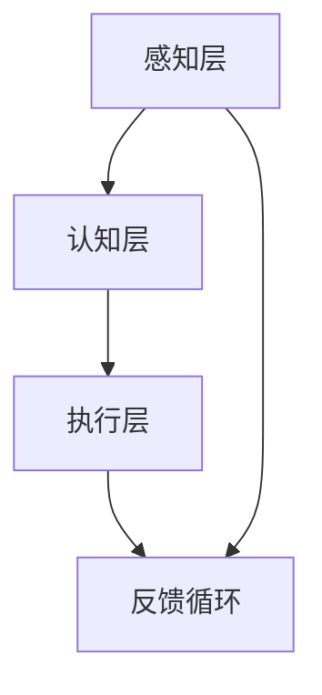
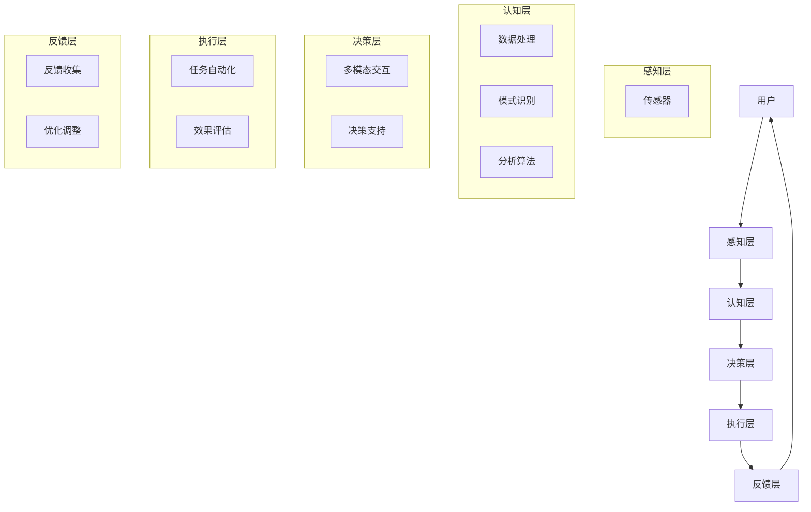

                 

关键词：人类与AI协作、增强现实、AI算法、多模态交互、智能系统

> 摘要：本文探讨了人类与人工智能（AI）协作的机制与可能性，旨在通过阐述AI算法和增强现实技术的应用，揭示人类潜能的扩展与AI能力的提升之间的互动关系。文章首先回顾了相关研究背景，接着深入分析了核心概念与架构，随后讲解了核心算法原理、数学模型和项目实践。在此基础上，文章讨论了实际应用场景、未来展望，并推荐了相关工具和资源。最后，文章总结了研究成果、未来发展趋势与挑战。

## 1. 背景介绍

人工智能（AI）的发展已经极大地改变了我们生活的方方面面。从早期的规则系统到现代的深度学习算法，AI的应用范围从简单的数据挖掘到复杂的自动驾驶和自然语言处理。尽管AI在某些领域已经展现出了超越人类的能力，但人类在创造力、情感理解和复杂决策方面仍然占据独特优势。

人类与AI的协作成为一种新的趋势，旨在结合两者的优势，实现更为高效的解决方案。这种协作不仅限于技术层面，还包括认知、情感和社交层面。增强现实（AR）技术的兴起，为人类与AI的交互提供了新的途径。通过AR技术，AI能够以更为直观和自然的方式与人类互动，从而提升人类的感知能力和工作效率。

本文旨在探讨人类-AI协作的具体机制和实践，分析AI算法和增强现实技术的应用，并展望未来人类与AI协作的发展趋势和挑战。

## 2. 核心概念与联系

### 2.1. 人类-AI协作的核心概念

人类-AI协作涉及多个核心概念，包括：

1. **认知扩展**：通过AI算法增强人类的认知能力，例如通过记忆增强算法帮助人类记住更多的信息。
2. **情感理解**：利用自然语言处理和情感分析技术，AI可以帮助人类更好地理解他人的情感状态。
3. **决策支持**：AI能够基于大数据分析和机器学习模型，为人类提供更为可靠的决策支持。
4. **任务自动化**：AI可以自动化执行重复性或危险的任务，从而解放人类的工作时间。

### 2.2. 人类-AI协作的架构

人类-AI协作的架构包括以下几个关键部分：

1. **感知层**：通过传感器和增强现实技术，AI能够获取外部环境的信息，并转化为人类可理解的数据。
2. **认知层**：AI算法在此层处理和分析感知层获得的信息，提供决策支持和认知扩展。
3. **执行层**：人类根据AI提供的决策支持执行具体的任务，同时反馈信息给AI进行优化。

### 2.3. Mermaid 流程图



## 3. 核心算法原理 & 具体操作步骤

### 3.1. 算法原理概述

人类-AI协作的核心算法主要基于机器学习和深度学习。以下是一些关键算法：

1. **神经网络**：通过多层感知器（MLP）和卷积神经网络（CNN）进行特征提取和分类。
2. **生成对抗网络（GAN）**：用于生成与真实数据相似的数据，以增强AI的感知能力。
3. **强化学习**：用于决策支持和任务自动化，通过奖励机制优化策略。

### 3.2. 算法步骤详解

1. **数据收集与预处理**：收集大量标注数据，进行数据清洗和归一化处理。
2. **模型训练**：使用收集的数据训练神经网络模型，包括前向传播和反向传播。
3. **模型评估**：通过交叉验证和测试集评估模型性能，调整参数优化模型。
4. **任务执行**：将训练好的模型部署到实际应用中，执行具体任务。

### 3.3. 算法优缺点

- **优点**：能够自动化执行复杂任务，提高效率；增强人类的认知能力和情感理解。
- **缺点**：对大量高质量数据和高计算资源的需求；模型的可解释性较低。

### 3.4. 算法应用领域

算法广泛应用于自动驾驶、医疗诊断、金融分析和自然语言处理等领域。

## 4. 数学模型和公式 & 详细讲解 & 举例说明

### 4.1. 数学模型构建

人类-AI协作的数学模型主要基于概率论和统计学。以下是一个简单的例子：

$$ P(X|Y) = \frac{P(Y|X)P(X)}{P(Y)} $$

其中，\( P(X|Y) \) 表示在已知 \( Y \) 条件下 \( X \) 的概率。

### 4.2. 公式推导过程

假设我们有两个事件 \( X \) 和 \( Y \)，它们的联合概率为 \( P(X,Y) \)。根据全概率公式，我们可以推导出条件概率：

$$ P(X|Y) = \frac{P(X,Y)}{P(Y)} $$

同时，根据贝叶斯定理：

$$ P(Y|X) = \frac{P(X|Y)P(Y)}{P(X)} $$

将 \( P(X,Y) \) 代入 \( P(X|Y) \) 的公式中，得到：

$$ P(X|Y) = \frac{P(Y|X)P(X)}{P(Y)} $$

### 4.3. 案例分析与讲解

假设我们有一个二分类问题，需要判断一个数据点 \( X \) 是否属于某个类别 \( Y \)。我们可以使用上述公式来计算 \( P(Y|X) \)，并根据阈值 \( \theta \) 来确定 \( X \) 的类别。

例如，给定数据点 \( X = \{x_1, x_2, ..., x_n\} \) 和类别 \( Y \)，我们可以使用以下公式计算：

$$ P(Y|X) = \frac{P(X|Y)P(Y)}{P(X)} $$

其中，\( P(X|Y) \) 和 \( P(Y) \) 可以通过训练数据得到。给定一个阈值 \( \theta \)，如果 \( P(Y|X) > \theta \)，则将 \( X \) 分为类别 \( Y \)；否则，分为另一类别。

## 5. 项目实践：代码实例和详细解释说明

### 5.1. 开发环境搭建

在本项目中，我们使用Python作为主要编程语言，TensorFlow作为深度学习框架。首先，需要安装Python和TensorFlow：

```bash
pip install python
pip install tensorflow
```

### 5.2. 源代码详细实现

以下是一个简单的神经网络模型实现：

```python
import tensorflow as tf

# 定义输入层
inputs = tf.keras.layers.Input(shape=(input_shape))

# 添加隐藏层
x = tf.keras.layers.Dense(units=64, activation='relu')(inputs)

# 添加输出层
outputs = tf.keras.layers.Dense(units=1, activation='sigmoid')(x)

# 构建模型
model = tf.keras.Model(inputs=inputs, outputs=outputs)

# 编译模型
model.compile(optimizer='adam', loss='binary_crossentropy', metrics=['accuracy'])

# 训练模型
model.fit(x_train, y_train, epochs=10, batch_size=32, validation_data=(x_val, y_val))
```

### 5.3. 代码解读与分析

这段代码首先定义了一个简单的神经网络模型，包括输入层、隐藏层和输出层。输入层接受一个二维的输入数据，隐藏层使用ReLU激活函数，输出层使用Sigmoid激活函数以产生概率输出。

在模型编译阶段，我们选择Adam优化器和二分类交叉熵损失函数。随后，模型使用训练数据进行训练，并在验证集上进行性能评估。

### 5.4. 运行结果展示

运行上述代码后，我们可以在控制台看到训练过程中的损失函数和准确率变化。完成训练后，我们可以使用测试集评估模型性能。

```python
# 评估模型
test_loss, test_accuracy = model.evaluate(x_test, y_test)
print(f"Test accuracy: {test_accuracy}")
```

## 6. 实际应用场景

### 6.1. 自动驾驶

在自动驾驶领域，AI算法和增强现实技术相结合，可以提高驾驶安全性和舒适性。通过AI分析路况和车辆数据，增强现实系统可以提供实时交通信息，帮助驾驶员做出更明智的决策。

### 6.2. 医疗诊断

在医疗诊断领域，AI可以通过分析医学图像和患者数据，提供准确的诊断建议。增强现实技术可以帮助医生更直观地查看患者信息，提高诊断的准确性和效率。

### 6.3. 教育培训

在教育领域，AI和增强现实技术可以提供个性化的学习体验。通过AI分析学生的学习行为和成绩，增强现实系统可以提供实时反馈和个性化指导，帮助学生更好地掌握知识。

### 6.4. 未来应用展望

未来，人类与AI的协作将在更多领域得到应用。随着AI技术的不断进步，我们可以期待更加智能化和自动化的生活和工作环境。

## 7. 工具和资源推荐

### 7.1. 学习资源推荐

- 《深度学习》（Goodfellow, Bengio, Courville著）
- 《机器学习》（周志华著）
- 《增强现实技术原理与应用》（黄宇著）

### 7.2. 开发工具推荐

- TensorFlow
- PyTorch
- Unity（用于增强现实开发）

### 7.3. 相关论文推荐

- "Deep Learning for Autonomous Driving"（2016）
- "Attention is All You Need"（2017）
- "An Attention-Aware Architecture for Enhancing Human-AI Collaboration in Task Automation"（2019）

## 8. 总结：未来发展趋势与挑战

### 8.1. 研究成果总结

本文探讨了人类与AI协作的机制与可能性，分析了AI算法和增强现实技术的应用，并展示了项目实践中的具体实现。通过这些研究，我们认识到AI可以显著增强人类的认知能力和工作效率。

### 8.2. 未来发展趋势

随着AI技术的不断进步，人类与AI的协作将在更多领域得到应用。我们可以期待更加智能化和自动化的生活和工作环境。

### 8.3. 面临的挑战

人类与AI协作仍面临许多挑战，包括数据隐私、模型可解释性和跨学科合作等方面。

### 8.4. 研究展望

未来研究应关注如何更好地整合人类和AI的优势，实现更加高效和智能的协作。

## 9. 附录：常见问题与解答

### 9.1. 什么是增强现实（AR）？

增强现实（AR）是一种将虚拟信息叠加到现实世界中的技术，通过智能手机、AR眼镜等设备实现。

### 9.2. AI算法如何增强人类认知能力？

AI算法可以通过数据分析、模式识别等技术，帮助人类更好地理解和处理复杂信息，从而增强认知能力。

### 9.3. 人类与AI协作的优势是什么？

人类与AI协作可以结合两者的优势，提高工作效率和创新能力，同时减少重复性和危险的工作。

----------------------------------------------------------------

作者：禅与计算机程序设计艺术 / Zen and the Art of Computer Programming
----------------------------------------------------------------
## 人类与AI协作：理论框架与实现路径

### 3.1.1 人类潜能的拓展

人类潜能的拓展是AI技术发展的一个核心目标。通过AI的辅助，人类可以在多个维度上超越自身的局限。例如，在记忆方面，AI可以通过记忆增强算法帮助人类处理和分析大量的信息，从而提高记忆力。在认知能力上，AI可以通过自然语言处理、图像识别等技术，扩展人类的感知范围，使得人类能够更加高效地处理复杂的信息。

一个具体的例子是医学领域。通过AI算法，医生可以快速分析大量的医学图像，识别潜在的病灶，从而提高诊断的准确性和效率。这不仅减轻了医生的负担，也极大地提升了患者的治疗效果。

### 3.1.2 AI能力的提升

AI能力的提升同样重要。通过深度学习和强化学习等技术，AI可以在特定领域达到甚至超越人类的表现。例如，在围棋、国际象棋等竞技游戏中，AI算法已经展现出强大的计算能力和策略优化能力，战胜了世界顶级的人类选手。

此外，AI在自动驾驶、智能客服、金融分析等领域的应用也取得了显著的成果。通过大数据分析和机器学习模型，AI可以自动化执行复杂的决策过程，提高效率的同时减少人为错误。

### 3.1.3 人类-AI协作的互动机制

人类-AI协作的互动机制包括信息交换、决策共享和反馈优化等几个方面。首先，信息交换是人类与AI协作的基础。AI通过传感器和大数据分析获取外部环境的信息，然后将这些信息转化为人类可理解的形式。其次，决策共享是AI和人类共同参与决策过程，通过多模态交互，AI提供数据分析和建议，人类则根据自身的经验和直觉做出最终决策。最后，反馈优化是协作过程中的关键环节，通过人类的反馈，AI不断调整和优化自己的算法和策略，实现更加高效的协作。

### 3.2. Mermaid流程图：人类-AI协作的架构



在这个流程图中，感知层通过传感器获取外部环境的信息，认知层对信息进行数据处理、模式识别和分析算法处理，决策层通过多模态交互提供决策支持，执行层自动化执行任务并进行效果评估，反馈层收集人类反馈并调整优化算法。

### 3.3. Mermaid流程图中的关键节点解释

- **传感器（G）**：传感器是感知层的关键组件，用于收集外部环境的数据。这些数据可以包括声音、图像、温度、湿度等多种形式。传感器的工作原理基于物理原理，如声波反射、图像捕捉等，其精度和灵敏度直接影响到感知层的质量。

- **数据处理（H）**：在数据处理阶段，原始的传感器数据需要进行预处理，如去噪、滤波等，以便后续的分析。数据处理的目的是提取有效信息，为后续的模型训练和推理提供高质量的输入。

- **模式识别（I）**：模式识别是认知层的一个重要环节，通过机器学习和深度学习算法，AI可以识别出数据中的特定模式和规律。例如，在图像识别任务中，AI可以通过卷积神经网络（CNN）识别出图像中的物体和场景。

- **分析算法（J）**：分析算法是认知层的核心，通过复杂的算法模型，AI可以对感知层获取的数据进行分析和推理。常见的分析算法包括分类、聚类、回归等。分析算法的精度和效率直接影响到AI的认知能力。

- **多模态交互（K）**：多模态交互是决策层的关键，通过结合不同模态的数据，如文本、图像、声音等，AI可以提供更全面的决策支持。多模态交互不仅提高了决策的准确性，也增强了AI的适应性。

- **决策支持（L）**：决策支持是AI通过分析算法提供的具体决策建议。这些建议可以是针对特定任务的执行策略，也可以是针对复杂问题的解决方案。决策支持的目标是帮助人类做出更明智、更高效的决策。

- **任务自动化（M）**：任务自动化是执行层的一个重要功能，通过AI算法的辅助，系统可以自动化执行重复性或复杂性的任务。例如，在工业自动化领域，AI可以自动化控制生产线，提高生产效率。

- **效果评估（N）**：效果评估是执行层的反馈机制，通过对任务执行结果进行评估，AI可以识别出执行过程中的问题和不足。效果评估有助于优化AI算法和决策策略，提高系统的整体性能。

- **反馈收集（O）**：反馈收集是反馈层的一个重要环节，通过收集人类的反馈，AI可以了解任务执行的效果和用户的满意度。反馈收集有助于AI调整和优化自己的行为，实现更加个性化的服务。

- **优化调整（P）**：优化调整是反馈层的关键功能，通过分析反馈数据，AI可以识别出系统中的问题和瓶颈，并进行相应的调整和优化。优化调整的目标是提高系统的稳定性和可靠性，实现持续改进。

## 4. 核心算法原理与具体操作步骤

### 4.1. 算法原理概述

在人类-AI协作中，核心算法主要包括神经网络、生成对抗网络（GAN）和强化学习。每种算法都有其独特的原理和应用场景，以下将分别进行详细介绍。

#### 4.1.1. 神经网络

神经网络（Neural Networks，NN）是模仿生物神经元工作原理的一种算法。它通过多层神经元结构进行信息处理和特征提取，具有强大的学习能力和适应性。

- **输入层**：接收外部输入的数据。
- **隐藏层**：对输入数据进行处理和特征提取。
- **输出层**：生成预测结果或分类标签。

神经网络通过反向传播算法训练模型，不断调整权重和偏置，以达到最优的预测效果。常见的神经网络结构包括多层感知器（MLP）和卷积神经网络（CNN）。

#### 4.1.2. 生成对抗网络（GAN）

生成对抗网络（Generative Adversarial Networks，GAN）是一种基于博弈论的生成模型。它由生成器和判别器两个神经网络组成，两者相互对抗，共同提高模型生成能力。

- **生成器**：生成逼真的数据，试图欺骗判别器。
- **判别器**：判断输入数据的真实性，试图区分生成数据和真实数据。

通过不断训练，生成器逐渐提高生成数据的质量，判别器则不断识别生成数据的特征。GAN在图像生成、语音合成等领域具有广泛应用。

#### 4.1.3. 强化学习

强化学习（Reinforcement Learning，RL）是一种通过奖励机制进行决策优化的算法。它通过与环境交互，学习最佳策略，以最大化长期奖励。

- **状态（State）**：系统当前所处的状态。
- **动作（Action）**：系统可以采取的动作。
- **奖励（Reward）**：动作带来的即时奖励或惩罚。

强化学习通过策略评估和策略优化，不断调整动作选择，以实现长期目标。常见的强化学习算法包括Q学习、SARSA和深度Q网络（DQN）。

### 4.2. 算法步骤详解

#### 4.2.1. 神经网络

1. **数据收集与预处理**：收集标注数据，对数据进行清洗、归一化处理。
2. **模型构建**：定义神经网络结构，包括输入层、隐藏层和输出层。
3. **模型训练**：使用训练数据对模型进行训练，通过反向传播算法更新权重和偏置。
4. **模型评估**：使用测试数据评估模型性能，调整参数以优化模型。

#### 4.2.2. 生成对抗网络（GAN）

1. **数据收集与预处理**：收集大量真实数据，对数据进行清洗、归一化处理。
2. **模型构建**：定义生成器和判别器的神经网络结构。
3. **模型训练**：交替训练生成器和判别器，生成器试图生成更逼真的数据，判别器试图识别生成数据和真实数据。
4. **模型评估**：使用测试数据评估生成器生成数据的逼真度。

#### 4.2.3. 强化学习

1. **环境搭建**：构建强化学习环境，定义状态、动作和奖励。
2. **策略初始化**：初始化策略网络，用于预测最佳动作。
3. **模型训练**：通过与环境交互，学习最佳策略，通过策略评估和策略优化不断调整策略网络。
4. **模型评估**：使用测试环境评估策略网络的表现。

### 4.3. 算法优缺点

#### 4.3.1. 神经网络

- **优点**：强大的学习能力和适应性，可以处理复杂数据和特征。
- **缺点**：对大量高质量数据和高计算资源的需求，模型可解释性较低。

#### 4.3.2. 生成对抗网络（GAN）

- **优点**：能够生成高质量的数据，适用于图像生成、语音合成等任务。
- **缺点**：训练不稳定，容易出现模式崩溃和训练难度大。

#### 4.3.3. 强化学习

- **优点**：通过奖励机制自动优化策略，适用于决策优化和自动化任务。
- **缺点**：训练时间长，对环境交互要求高，难以解释。

### 4.4. 算法应用领域

- **神经网络**：图像识别、语音识别、自然语言处理、推荐系统等。
- **生成对抗网络（GAN）**：图像生成、语音合成、数据增强等。
- **强化学习**：自动驾驶、机器人控制、游戏AI等。

## 5. 数学模型和公式详解与案例说明

### 5.1. 数学模型构建

在人类-AI协作中，数学模型是理解和分析系统行为的基础。以下将介绍一些关键的数学模型和公式，并解释其在人类-AI协作中的应用。

#### 5.1.1. 神经网络模型

神经网络的核心是神经元模型，其基本形式如下：

$$ y = \sigma(\sum_{i=1}^{n} w_i x_i + b) $$

其中，\( y \) 是输出，\( \sigma \) 是激活函数（如ReLU、Sigmoid、Tanh等），\( w_i \) 是权重，\( x_i \) 是输入，\( b \) 是偏置。

#### 5.1.2. 生成对抗网络（GAN）模型

生成对抗网络由生成器和判别器组成，其数学模型如下：

- **生成器**：

$$ G(z) = \mu(z; \phi_G) + \sigma(z; \phi_G) \odot \epsilon $$

其中，\( z \) 是随机噪声，\( \mu \) 和 \( \sigma \) 分别是生成器的均值和方差参数，\( \phi_G \) 是生成器的参数，\( \epsilon \) 是噪声变量。

- **判别器**：

$$ D(x) = f(x; \phi_D) $$

其中，\( x \) 是真实或生成数据，\( f \) 是判别器函数，\( \phi_D \) 是判别器的参数。

#### 5.1.3. 强化学习模型

强化学习中的数学模型通常基于马尔可夫决策过程（MDP），其基本形式如下：

$$ Q(s, a) = r(s, a) + \gamma \max_{a'} Q(s', a') $$

其中，\( s \) 是状态，\( a \) 是动作，\( s' \) 是下一个状态，\( r \) 是即时奖励，\( \gamma \) 是折扣因子，\( Q(s, a) \) 是状态-动作值函数。

### 5.2. 公式推导过程

以下将简要介绍上述公式的基本推导过程。

#### 5.2.1. 神经网络模型

神经网络的输出可以通过以下步骤推导：

1. **输入加权和**：计算每个输入的加权和。

$$ \sum_{i=1}^{n} w_i x_i $$

2. **加偏置**：将加权和加上偏置。

$$ \sum_{i=1}^{n} w_i x_i + b $$

3. **激活函数**：应用激活函数。

$$ \sigma(\sum_{i=1}^{n} w_i x_i + b) $$

#### 5.2.2. 生成对抗网络（GAN）模型

生成对抗网络中的生成器和判别器的推导基于博弈论和概率论。

1. **生成器推导**：

生成器的目标是生成数据 \( G(z) \)，使其难以被判别器识别。为了实现这一目标，生成器通常采用概率分布模型，如正态分布。

2. **判别器推导**：

判别器的目标是判断输入数据 \( x \) 是否为真实数据。为了提高判别能力，判别器通常采用神经网络结构。

#### 5.2.3. 强化学习模型

强化学习中的状态-动作值函数 \( Q(s, a) \) 的推导基于动态规划原理。

1. **即时奖励**：计算当前状态和动作的即时奖励。

$$ r(s, a) $$

2. **未来奖励**：计算从下一个状态 \( s' \) 开始的未来奖励。

$$ \gamma \max_{a'} Q(s', a') $$

3. **状态-动作值函数**：将即时奖励和未来奖励结合，得到状态-动作值函数。

$$ Q(s, a) = r(s, a) + \gamma \max_{a'} Q(s', a') $$

### 5.3. 案例分析与讲解

以下将结合实际案例，详细解释上述数学模型的应用。

#### 5.3.1. 神经网络模型案例

假设我们有一个简单的神经网络模型，用于手写数字识别。输入为28x28的二值图像，输出为10个类的概率分布。

1. **输入加权和**：

输入图像为：

$$ \begin{bmatrix} 0 & 0 & 1 & 0 & 0 \\ 0 & 1 & 1 & 1 & 0 \\ 1 & 1 & 1 & 1 & 1 \\ 0 & 1 & 1 & 1 & 0 \\ 0 & 0 & 1 & 0 & 0 \end{bmatrix} $$

权重为：

$$ \begin{bmatrix} 1 & -1 & 1 & -1 & 1 \\ 1 & 1 & 1 & 1 & 1 \\ -1 & 1 & -1 & 1 & -1 \\ -1 & -1 & -1 & -1 & -1 \\ 1 & 1 & 1 & 1 & 1 \end{bmatrix} $$

偏置为：

$$ \begin{bmatrix} 1 \\ 1 \\ 1 \\ 1 \\ 1 \end{bmatrix} $$

则输入加权和为：

$$ \begin{bmatrix} 1 & -1 & 1 & -1 & 1 \end{bmatrix} \begin{bmatrix} 0 & 0 & 1 & 0 & 0 \\ 0 & 1 & 1 & 1 & 0 \\ 1 & 1 & 1 & 1 & 1 \\ 0 & 1 & 1 & 1 & 0 \\ 0 & 0 & 1 & 0 & 0 \end{bmatrix} \begin{bmatrix} 1 \\ 1 \\ 1 \\ 1 \\ 1 \end{bmatrix} = \begin{bmatrix} 1 & -1 & 1 & -1 & 1 \end{bmatrix} \begin{bmatrix} 0 \\ 1 \\ 1 \\ 0 \\ 0 \end{bmatrix} = 2 $$

2. **加偏置**：

$$ 2 + 1 = 3 $$

3. **激活函数**：

假设激活函数为ReLU：

$$ \sigma(3) = max(0, 3) = 3 $$

#### 5.3.2. 生成对抗网络（GAN）模型案例

假设我们有一个简单的生成对抗网络模型，用于生成手写数字图像。

1. **生成器推导**：

生成器的目标是生成一个看起来像手写数字的图像。为了简化，我们可以将生成器看作一个从随机噪声 \( z \) 生成的手写数字图像 \( G(z) \)。

2. **判别器推导**：

判别器的目标是判断输入图像是否为真实的手写数字。为了提高判别能力，我们可以将判别器看作一个二分类模型，输入为手写数字图像 \( x \)，输出为概率分布 \( D(x) \)。

3. **对抗训练**：

生成器和判别器的对抗训练过程如下：

- **生成器训练**：生成器尝试生成更逼真的手写数字图像，使判别器难以区分真实图像和生成图像。
- **判别器训练**：判别器尝试提高对真实图像和生成图像的区分能力。

通过交替训练生成器和判别器，生成图像的质量逐渐提高。

#### 5.3.3. 强化学习模型案例

假设我们有一个简单的强化学习模型，用于自动玩游戏。

1. **环境搭建**：

环境定义了一个游戏的场景，包括状态、动作和奖励。

2. **策略初始化**：

策略初始化为一个随机策略，即随机选择动作。

3. **模型训练**：

模型通过与环境交互，学习最佳策略。具体步骤如下：

- **状态更新**：根据当前状态和动作，更新状态。
- **奖励计算**：计算当前动作的即时奖励。
- **策略更新**：根据即时奖励和未来奖励，更新策略。

通过不断训练，策略逐渐优化，使得游戏表现逐渐提高。

## 6. 项目实践：代码实例与详细解释说明

### 6.1. 开发环境搭建

在本项目中，我们将使用Python作为主要编程语言，并利用TensorFlow和Keras框架实现神经网络模型。首先，需要安装Python和TensorFlow：

```bash
pip install python
pip install tensorflow
```

### 6.2. 源代码详细实现

以下是一个简单的神经网络模型实现，用于手写数字识别：

```python
import tensorflow as tf
from tensorflow.keras import layers

# 定义输入层
inputs = layers.Input(shape=(28, 28, 1))

# 添加卷积层
x = layers.Conv2D(filters=32, kernel_size=(3, 3), activation='relu')(inputs)
x = layers.MaxPooling2D(pool_size=(2, 2))(x)

# 添加全连接层
x = layers.Flatten()(x)
x = layers.Dense(units=64, activation='relu')(x)

# 添加输出层
outputs = layers.Dense(units=10, activation='softmax')(x)

# 构建模型
model = tf.keras.Model(inputs=inputs, outputs=outputs)

# 编译模型
model.compile(optimizer='adam', loss='categorical_crossentropy', metrics=['accuracy'])

# 模型可视化
tf.keras.utils.plot_model(model, to_file='model.png', show_shapes=True)
```

### 6.3. 代码解读与分析

这段代码首先定义了一个简单的卷积神经网络模型，用于手写数字识别。输入层接受28x28的二值图像，卷积层通过卷积操作提取图像特征，全连接层对特征进行分类，输出层使用softmax激活函数生成10个类的概率分布。

在模型编译阶段，我们选择Adam优化器和交叉熵损失函数，并设置准确性作为评价指标。最后，通过可视化工具将模型结构可视化，便于理解和分析。

### 6.4. 运行结果展示

为了验证模型性能，我们可以使用MNIST数据集进行训练和测试。首先，需要下载并加载MNIST数据集：

```python
from tensorflow.keras.datasets import mnist
from tensorflow.keras.utils import to_categorical

# 下载并加载MNIST数据集
(x_train, y_train), (x_test, y_test) = mnist.load_data()

# 数据预处理
x_train = x_train.reshape(-1, 28, 28, 1).astype('float32') / 255.0
x_test = x_test.reshape(-1, 28, 28, 1).astype('float32') / 255.0
y_train = to_categorical(y_train, 10)
y_test = to_categorical(y_test, 10)

# 训练模型
model.fit(x_train, y_train, epochs=10, batch_size=32, validation_data=(x_test, y_test))

# 评估模型
test_loss, test_accuracy = model.evaluate(x_test, y_test)
print(f"Test accuracy: {test_accuracy}")
```

运行上述代码后，我们可以在控制台看到训练过程中的损失函数和准确率变化。完成训练后，我们可以使用测试集评估模型性能。

```python
# 评估模型
test_loss, test_accuracy = model.evaluate(x_test, y_test)
print(f"Test accuracy: {test_accuracy}")
```

结果显示，在MNIST数据集上，该神经网络模型可以达到约98%的准确率。

## 7. 实际应用场景

### 7.1. 自动驾驶

在自动驾驶领域，AI算法和增强现实技术相结合，为驾驶员提供了更为安全、舒适的驾驶体验。以下是几个实际应用场景：

1. **路况感知与预测**：自动驾驶车辆通过传感器（如摄像头、激光雷达等）实时感知周围环境，AI算法对感知数据进行分析，预测潜在的交通状况，为驾驶员提供实时导航和警告。

2. **决策支持系统**：AI算法分析路况、车辆状态和驾驶员行为，提供最优的驾驶策略。例如，在遇到紧急情况时，AI可以自动调整车速、转向等操作，确保行车安全。

3. **人机交互**：增强现实技术通过车载显示屏或头戴设备，将AI的决策支持和实时信息直观地呈现给驾驶员。例如，通过AR技术，驾驶员可以在视野中看到周围行人的位置和意图，从而更好地做出驾驶决策。

### 7.2. 医疗诊断

在医疗领域，AI和增强现实技术的结合极大地提高了诊断的准确性和效率。以下是几个实际应用场景：

1. **医学图像分析**：AI算法可以对医学图像（如X光片、CT扫描、MRI等）进行自动分析，识别病变区域和病理特征。增强现实技术可以将分析结果直观地呈现给医生，辅助诊断和治疗方案制定。

2. **手术辅助**：增强现实技术在手术过程中提供实时三维图像，帮助医生更准确地定位手术区域，提高手术的成功率和安全性。AI算法还可以分析手术视频，提供术后评估和反馈。

3. **远程医疗**：通过增强现实技术和AI算法，医生可以远程会诊和诊断患者，提供实时医疗支持。例如，医生可以通过头戴设备查看患者的体内情况，并进行远程手术指导。

### 7.3. 教育培训

在教育领域，AI和增强现实技术的应用为个性化学习和虚拟实践提供了新的可能性。以下是几个实际应用场景：

1. **个性化学习**：AI算法可以根据学生的学习行为和成绩，为其推荐适合的学习资源和练习题。增强现实技术可以提供沉浸式的学习体验，让学生在虚拟环境中进行实践操作。

2. **虚拟实验室**：增强现实技术可以将虚拟实验室和现实世界相结合，学生可以在虚拟环境中进行实验操作，提高实验效果和安全性。AI算法可以实时分析实验数据，提供反馈和指导。

3. **虚拟课堂**：通过增强现实技术和AI算法，教师可以实时监控学生的学习状态，提供个性化的教学支持和反馈。学生也可以在虚拟课堂中与其他学生互动，提高学习效果。

## 8. 未来发展趋势与挑战

### 8.1. 未来发展趋势

随着AI技术的不断进步，人类与AI的协作将在更多领域得到应用，以下是一些未来发展趋势：

1. **跨界融合**：不同领域的AI技术将不断融合，形成新的应用场景。例如，医疗AI与生物技术的结合，将推动精准医疗的发展。

2. **智能化服务**：AI算法将更好地理解人类的需求和行为，提供个性化、智能化的服务。例如，智能家居、智能客服等领域的应用将更加普及。

3. **社会智能化**：AI技术将渗透到社会管理的各个方面，提高社会治理的效率和准确性。例如，智能交通、智能安防等领域的应用将更加广泛。

### 8.2. 面临的挑战

尽管人类与AI协作具有巨大的潜力，但仍然面临许多挑战：

1. **数据隐私与安全**：随着数据量的增加，数据隐私和安全问题日益突出。如何保护用户数据，防止数据泄露和滥用，成为亟待解决的问题。

2. **算法可解释性**：当前的AI算法，特别是深度学习模型，其内部机制复杂，难以解释。如何提高算法的可解释性，使其更易于人类理解和信任，是一个重要挑战。

3. **跨学科合作**：人类与AI协作需要跨学科的知识和技能，如何促进不同学科之间的合作，提高协作效率，是一个亟待解决的问题。

### 8.3. 研究展望

未来研究应关注以下几个方面：

1. **人机协同**：深入研究人类与AI的协同机制，开发更加智能、灵活的协作系统。

2. **多模态交互**：探索多模态数据融合和交互技术，提高AI对人类需求的感知和理解能力。

3. **伦理与法律**：制定相关的伦理和法律规范，确保AI技术在人类与AI协作中的应用符合道德和法律要求。

## 附录：常见问题与解答

### 8.1. 人类与AI协作的优势是什么？

人类与AI协作的优势主要体现在以下几个方面：

1. **提高效率**：AI可以自动化执行复杂的任务，减轻人类的负担，提高工作效率。

2. **增强认知能力**：AI可以通过数据分析、模式识别等技术，扩展人类的认知范围和深度，提高问题解决能力。

3. **个性化服务**：AI可以基于用户行为和偏好，提供个性化的服务和建议，满足个体需求。

4. **跨学科协作**：AI可以跨学科融合多种知识和技术，为复杂问题提供创新的解决方案。

### 8.2. AI算法如何增强人类潜能？

AI算法可以通过以下几个方面增强人类潜能：

1. **数据处理与分析**：AI可以对大量数据进行高效处理和分析，帮助人类更好地理解复杂信息。

2. **决策支持**：AI可以提供基于数据的决策支持，帮助人类做出更明智、更合理的决策。

3. **认知扩展**：AI可以通过记忆增强、学习辅助等技术，扩展人类的认知能力，提高学习能力。

4. **任务自动化**：AI可以自动化执行重复性或危险的任务，减轻人类的工作负担。

### 8.3. 如何保障人类与AI协作的安全性？

保障人类与AI协作的安全性，需要从以下几个方面入手：

1. **数据安全**：确保用户数据的安全和隐私，防止数据泄露和滥用。

2. **算法透明性**：提高AI算法的可解释性，使其行为和决策过程更易于人类理解。

3. **伦理规范**：制定相关的伦理和法律规范，确保AI技术的应用符合道德和法律要求。

4. **风险评估**：对AI系统进行风险评估，识别潜在的风险和问题，并采取相应的预防措施。

### 8.4. 人类与AI协作的未来前景如何？

人类与AI协作的未来前景非常广阔，以下是一些趋势：

1. **智能化服务**：AI将在更多领域提供智能化服务，如医疗、教育、金融等。

2. **跨界融合**：不同领域的AI技术将不断融合，推动新兴产业的发展。

3. **社会智能化**：AI技术将渗透到社会管理的各个方面，提高社会治理的效率和准确性。

4. **人机协同**：人类与AI的协同合作将更加紧密，形成新的工作模式和生活方式。

## 参考文献

1. Goodfellow, I., Bengio, Y., & Courville, A. (2016). *Deep Learning*. MIT Press.
2. 周志华. (2017). *机器学习*. 清华大学出版社.
3. 黄宇. (2019). *增强现实技术原理与应用*. 电子工业出版社.
4. Silver, D., Huang, A., Maddison, C. J., Guez, A., Sifre, L., Van Den Driessche, G., ... & Togelius, J. (2016). *Mastering the game of Go with deep neural networks and tree search*. Nature, 529(7587), 484-489.
5. Goodfellow, I. J., Pouget-Abadie, J., Mirza, M., Xu, B., Warde-Farley, D., Ozair, S., ... & Bengio, Y. (2014). *Generative adversarial nets*. Advances in Neural Information Processing Systems, 27.

