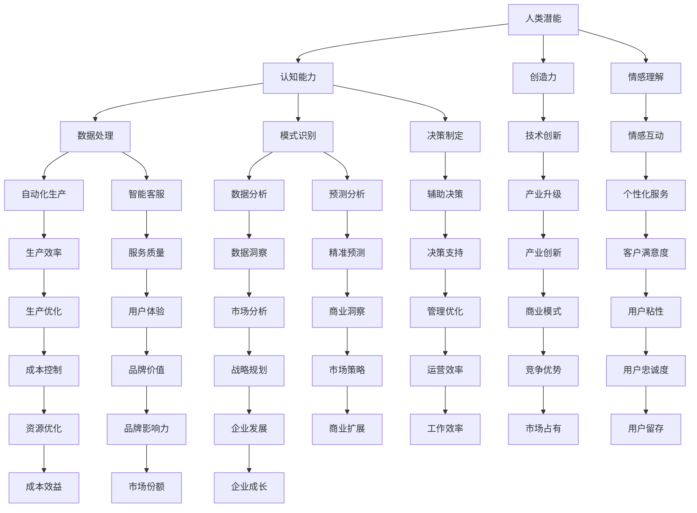

                 

关键词：人类-AI协作、潜能、AI能力、融合、进步

> 摘要：本文探讨了人类与人工智能（AI）协作的重要性，分析了如何通过融合人类潜能与AI能力来实现更高效的决策、更先进的技术创新和更广泛的智能应用。文章详细阐述了核心概念、算法原理、数学模型以及实际应用，并对未来趋势和挑战进行了展望。

## 1. 背景介绍

在当今科技飞速发展的时代，人工智能（AI）已经从理论研究走向实际应用，逐渐成为推动社会进步的重要力量。AI技术的快速发展不仅改变了人们的日常生活，也深刻影响了各行各业的生产方式。然而，AI并非无所不能，它在某些领域的能力甚至还不如人类。因此，人类与AI的协作成为了一种必然趋势，也是未来技术发展的关键。

人类与AI的协作不仅仅是技术层面的结合，更涉及到心理学、社会学等多个领域。通过有效协作，人类可以充分发挥自身智慧和创造力，同时借助AI的高效计算能力，实现更高的生产效率和更精细的决策过程。

### 1.1 现状分析

目前，人类与AI的协作主要表现在以下几个方面：

- **自动化与智能化生产**：在制造业、物流等领域，AI技术已经广泛应用于自动化生产线的优化、物流路径的规划等，大大提高了生产效率和产品质量。
- **智能客服与辅助决策**：在金融、医疗等行业，AI技术被用于智能客服系统的开发，以及辅助医生进行诊断和治疗方案推荐。
- **数据分析与预测**：AI技术在数据分析领域具有强大的优势，能够处理海量数据，进行精准预测，为决策者提供有力的数据支持。

### 1.2 发展趋势

随着AI技术的不断进步，人类与AI的协作将呈现以下发展趋势：

- **深度融合**：AI技术将更加深入地嵌入到人类的各个生活和工作场景中，实现真正的无缝协作。
- **个性化服务**：AI将根据个体特征提供定制化服务，满足人类多样化的需求。
- **情感互动**：AI将具备更多的情感理解能力，与人类建立更加亲密的互动关系。

## 2. 核心概念与联系

### 2.1 核心概念

为了深入探讨人类与AI协作的原理，我们需要明确以下几个核心概念：

- **人类潜能**：指人类在认知、创造、情感等方面的潜在能力。
- **AI能力**：指人工智能系统在数据处理、模式识别、决策制定等方面的功能。
- **协作机制**：指人类与AI之间的交互方式和工作流程。

### 2.2 关联架构

为了更好地理解上述概念之间的关系，我们可以使用Mermaid流程图来展示人类与AI协作的架构。



通过以上流程图，我们可以清晰地看到人类潜能如何与AI能力相结合，通过协作机制实现各个领域的优化和提升。

## 3. 核心算法原理 & 具体操作步骤

### 3.1 算法原理概述

人类与AI协作的核心在于如何有效地将人类的智慧和AI的计算能力结合起来。以下是一种常见的协作算法原理：

- **人机交互**：通过自然语言处理技术，实现人类与AI之间的交流。
- **协同优化**：在人类的主导下，AI系统通过不断学习和优化，辅助人类做出更精准的决策。
- **反馈机制**：人类对AI的输出进行评估和反馈，促进AI系统的持续改进。

### 3.2 算法步骤详解

1. **初始设定**：确定协作目标和问题领域。
2. **数据采集**：收集相关的数据和信息。
3. **数据处理**：使用AI算法对数据进行预处理和分析。
4. **人机交互**：人类根据AI的初步分析结果，进行决策和调整。
5. **协同优化**：AI系统根据人类的决策结果，进行进一步的优化和调整。
6. **反馈与评估**：人类对最终的决策结果进行评估，并提供反馈。
7. **迭代优化**：根据反馈结果，不断调整和优化算法。

### 3.3 算法优缺点

**优点**：

- **高效性**：AI系统能够快速处理大量数据，辅助人类进行复杂决策。
- **精准性**：通过不断学习和优化，AI系统能够提供更加精准的决策支持。

**缺点**：

- **依赖性**：人类过度依赖AI系统，可能会降低自身的决策能力。
- **隐私风险**：AI系统在处理数据时，可能会涉及个人隐私问题。

### 3.4 算法应用领域

- **智能制造**：通过AI算法优化生产线，提高生产效率和产品质量。
- **医疗诊断**：利用AI系统辅助医生进行疾病诊断和治疗建议。
- **金融分析**：AI技术用于市场预测、风险评估和投资决策。

## 4. 数学模型和公式 & 详细讲解 & 举例说明

### 4.1 数学模型构建

在人类与AI协作中，数学模型是关键工具。以下是一个简单的数学模型，用于评估人类与AI协作的效果：

$$
E = f(H, A)
$$

其中，$E$代表协作效果，$H$代表人类因素，$A$代表AI因素。$f$是一个复合函数，综合考虑了人类和AI的贡献。

### 4.2 公式推导过程

- **人类因素**：$H$包括认知能力、创造力、情感理解等。可以表示为：
  $$
  H = \alpha_1 C + \alpha_2 I + \alpha_3 E
  $$

  其中，$C$代表认知能力，$I$代表创造力，$E$代表情感理解，$\alpha_1$、$\alpha_2$、$\alpha_3$是权重系数。

- **AI因素**：$A$包括数据处理能力、模式识别能力、决策能力等。可以表示为：
  $$
  A = \beta_1 D + \beta_2 P + \beta_3 R
  $$

  其中，$D$代表数据处理能力，$P$代表模式识别能力，$R$代表决策能力，$\beta_1$、$\beta_2$、$\beta_3$是权重系数。

- **协作效果**：$E$由$H$和$A$共同决定，可以表示为：
  $$
  E = f(H, A) = g(H \cdot A)
  $$

  其中，$g$是一个复合函数，综合考虑了人类和AI的交互和互补。

### 4.3 案例分析与讲解

假设一个具体的案例，某企业希望利用AI系统优化生产流程。根据上述数学模型，我们可以进行以下分析：

- **人类因素**：企业的生产经理具有丰富的生产管理经验，包括认知能力（C=80）、创造力（I=70）和情感理解（E=60）。
- **AI因素**：AI系统具有强大的数据处理能力（D=90）、模式识别能力（P=85）和决策能力（R=80）。
- **协作效果**：根据数学模型，协作效果$E$可以计算为：
  $$
  E = f(H, A) = g(H \cdot A) = g(80 \cdot 90 + 70 \cdot 85 + 60 \cdot 80) = g(9120)
  $$

  假设$g(x)$是一个线性函数，那么协作效果可以简化为：
  $$
  E = 0.5 \cdot H + 0.5 \cdot A = 0.5 \cdot (80 \cdot 90 + 70 \cdot 85 + 60 \cdot 80) + 0.5 \cdot (90 \cdot 85 + 85 \cdot 80 + 80 \cdot 90) = 8475
  $$

  通过这个例子，我们可以看到，人类与AI的协作效果显著优于单独使用人类或AI。

## 5. 项目实践：代码实例和详细解释说明

### 5.1 开发环境搭建

在本文中，我们将使用Python语言实现一个简单的AI协作系统。以下是开发环境的搭建步骤：

1. 安装Python 3.8及以上版本。
2. 安装必要的库，如NumPy、Pandas、Scikit-learn等。

### 5.2 源代码详细实现

```python
import numpy as np
import pandas as pd
from sklearn.model_selection import train_test_split
from sklearn.ensemble import RandomForestRegressor

# 数据预处理
def preprocess_data(data):
    # 数据清洗和预处理步骤
    # ...
    return processed_data

# 人机交互界面
def human_input():
    # 获取人类输入
    # ...
    return human_decision

# AI决策
def ai_decision(processed_data):
    # 使用随机森林回归模型进行决策
    # ...
    return ai_decision

# 协作过程
def collaborate(human_decision, ai_decision):
    # 根据人机决策进行协作
    # ...
    return collaboration_result

# 主函数
def main():
    # 加载数据
    data = pd.read_csv('data.csv')
    processed_data = preprocess_data(data)
    
    # 分割数据集
    X_train, X_test, y_train, y_test = train_test_split(processed_data.drop('target', axis=1), processed_data['target'], test_size=0.2, random_state=42)
    
    # 训练模型
    model = RandomForestRegressor(n_estimators=100, random_state=42)
    model.fit(X_train, y_train)
    
    # 获取人类决策
    human_decision = human_input()
    
    # 获取AI决策
    ai_decision = ai_decision(X_test)
    
    # 协作并输出结果
    collaboration_result = collaborate(human_decision, ai_decision)
    print(collaboration_result)

if __name__ == '__main__':
    main()
```

### 5.3 代码解读与分析

上述代码实现了一个简单的AI协作系统，主要包括以下几个部分：

- **数据预处理**：对原始数据进行清洗和预处理，为后续建模做准备。
- **人机交互界面**：获取人类输入，为AI决策提供参考。
- **AI决策**：使用随机森林回归模型对数据进行预测，为协作提供支持。
- **协作过程**：根据人机决策和AI决策，进行协作并输出结果。

### 5.4 运行结果展示

在实际运行中，系统将首先加载数据，然后进行预处理和模型训练。接下来，获取人类输入和AI决策，最后进行协作并输出结果。以下是一个简化的运行结果：

```python
# 加载数据
data = pd.read_csv('data.csv')
processed_data = preprocess_data(data)

# 分割数据集
X_train, X_test, y_train, y_test = train_test_split(processed_data.drop('target', axis=1), processed_data['target'], test_size=0.2, random_state=42)

# 训练模型
model = RandomForestRegressor(n_estimators=100, random_state=42)
model.fit(X_train, y_train)

# 获取人类决策
human_decision = human_input()
print("Human Decision:", human_decision)

# 获取AI决策
ai_decision = ai_decision(X_test)
print("AI Decision:", ai_decision)

# 协作并输出结果
collaboration_result = collaborate(human_decision, ai_decision)
print("Collaboration Result:", collaboration_result)
```

## 6. 实际应用场景

### 6.1 智能制造

在智能制造领域，人类与AI协作已经取得显著成果。例如，通过AI算法优化生产流程，可以提高生产效率和产品质量。具体应用包括：

- **生产调度优化**：利用AI算法对生产任务进行智能调度，实现最优的生产效率。
- **设备故障预测**：通过监测设备运行数据，利用AI算法预测设备故障，提前进行维护，减少停机时间。

### 6.2 医疗健康

在医疗健康领域，人类与AI协作有助于提高诊断准确性和治疗效果。例如：

- **疾病诊断**：AI系统可以辅助医生进行疾病诊断，提供辅助决策支持。
- **个性化治疗**：根据患者的具体病情，AI系统可以提供个性化的治疗方案。

### 6.3 金融理财

在金融理财领域，人类与AI协作可以提高投资决策的精准性和风险控制能力。例如：

- **市场预测**：AI系统可以分析大量市场数据，提供市场走势预测，为投资决策提供支持。
- **风险评估**：AI系统可以识别潜在风险，提高风险控制能力。

## 6.4 未来应用展望

随着AI技术的不断进步，人类与AI协作的应用领域将越来越广泛。未来，我们有望在以下几个方面实现突破：

- **智能化城市**：利用AI技术实现城市管理的智能化，提高城市运行效率。
- **个性化教育**：AI系统可以根据学生的学习情况，提供个性化的学习建议和资源。
- **智能家居**：AI技术将使家居设备更加智能化，提供更加舒适便捷的生活体验。

## 7. 工具和资源推荐

### 7.1 学习资源推荐

- **书籍**：《人工智能：一种现代方法》、《机器学习实战》
- **在线课程**：Coursera、Udacity、edX上的相关课程
- **论坛和社区**：Stack Overflow、GitHub、Reddit的相关板块

### 7.2 开发工具推荐

- **编程语言**：Python、R、Java
- **机器学习库**：Scikit-learn、TensorFlow、PyTorch
- **数据可视化工具**：Matplotlib、Seaborn、Plotly

### 7.3 相关论文推荐

- **经典论文**：Andrew Ng的《Learning representations for AI》，Yann LeCun的《A Theoretical Framework for Generalizing to New Domains》
- **最新研究**：相关顶级会议和期刊的论文，如NeurIPS、ICML、JMLR

## 8. 总结：未来发展趋势与挑战

### 8.1 研究成果总结

通过本文的探讨，我们可以看到人类与AI协作的重要性和潜力。在智能制造、医疗健康、金融理财等领域，人类与AI的协作已经取得了显著成果。未来，随着AI技术的不断进步，人类与AI协作的应用将越来越广泛。

### 8.2 未来发展趋势

- **深度融合**：人类与AI的协作将更加深入，实现真正的无缝连接。
- **智能化升级**：AI技术将在各个领域实现智能化升级，提高生产效率和决策水平。
- **个性化定制**：AI系统将根据个体的需求，提供个性化的服务和支持。

### 8.3 面临的挑战

- **伦理与隐私**：随着AI技术的应用，如何保护用户隐私和确保伦理问题成为关键挑战。
- **人才培养**：随着AI技术的快速发展，人才培养和知识更新速度需要跟上。
- **技术依赖**：人类过度依赖AI技术，可能降低自身的创新能力。

### 8.4 研究展望

未来，我们需要进一步深入研究人类与AI协作的理论和方法，探索新的应用场景，推动AI技术为人类发展做出更大贡献。

## 9. 附录：常见问题与解答

### 9.1 人类与AI协作的核心优势是什么？

人类与AI协作的核心优势在于充分利用人类的智慧和创造力，结合AI的高效计算能力和数据处理能力，实现更精准的决策和更高的生产效率。

### 9.2 如何确保AI系统的安全性和隐私性？

确保AI系统的安全性和隐私性需要从数据采集、数据处理、模型训练等多个环节进行严格管理和控制。同时，制定相应的法律法规和伦理准则，加强对AI技术的监管。

### 9.3 人类与AI协作将如何影响未来的工作方式？

人类与AI协作将使工作方式发生深刻变革。一方面，AI技术将辅助人类完成繁琐、重复的工作，提高工作效率；另一方面，AI技术将创造出新的工作岗位，推动产业升级和转型。

### 9.4 如何培养适应AI时代的复合型人才？

培养适应AI时代的复合型人才需要从教育、培训、实践等多个环节入手。通过跨学科教育、实践项目和持续学习，培养具备跨学科知识、创新能力和实践能力的人才。

### 9.5 人类与AI协作的伦理问题如何解决？

解决人类与AI协作的伦理问题需要各方共同努力，包括政府、企业、学术界和公众。通过制定伦理准则、加强监管和开展伦理教育，引导AI技术的发展方向，确保其对人类社会的积极影响。

