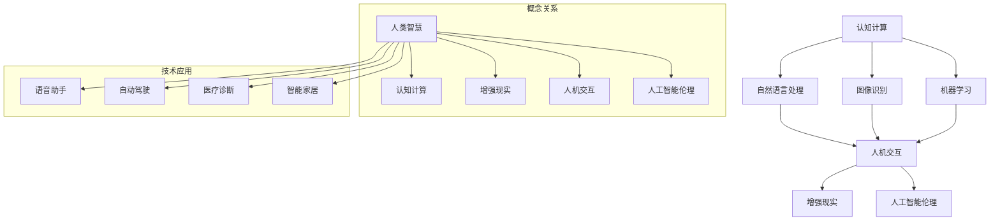

                 

 在当前这个科技迅猛发展的时代，人工智能（AI）已经成为推动社会进步的重要力量。从简单的语音助手到复杂的自动驾驶系统，AI已经深刻地改变了我们的生活方式和工作方式。然而，仅仅依靠AI自身的进步还不足以解决所有问题。人类-AI协作，即人类与人工智能之间的协同工作，正在成为一个新的研究热点，旨在通过结合人类的智慧和AI的强大计算能力，实现两者的共同进步。

本文将探讨人类-AI协作的背景、核心概念、算法原理、数学模型、项目实践和未来应用场景，旨在提供一个全面而深入的视角，帮助读者理解这一领域的最新进展和未来趋势。

## 文章关键词

- 人工智能
- 人类-AI协作
- 智能增强
- 计算能力
- 协同系统
- 数据分析
- 机器学习
- 交互设计

## 文章摘要

本文首先介绍了人类-AI协作的背景和重要性，然后详细探讨了这一领域中的核心概念和原理。接着，文章通过具体的算法原理、数学模型和项目实践，展示了人类与AI如何相互协作，提高工作效率和创造力。最后，文章展望了人类-AI协作的未来应用场景和面临的挑战，为这一领域的发展提供了新的思路。

### 背景介绍

### 1. AI技术的发展及其影响

人工智能技术的发展始于20世纪50年代，随着计算机性能的不断提升和大数据的广泛应用，AI逐渐从理论走向实践。如今，AI已经渗透到我们的生活的方方面面，从智能家居、医疗诊断到金融分析、自动驾驶，AI的潜力正在不断被挖掘。

然而，尽管AI在许多领域取得了显著的成就，但人类与AI之间的协作仍面临着诸多挑战。首先，AI系统的决策过程通常是基于数据和算法，缺乏人类的情感和直觉。这使得在某些复杂、多变的场景中，AI的决策可能不够准确或不够灵活。其次，AI的培训需要大量的数据，而这些数据往往涉及隐私和安全问题。如何在不侵犯用户隐私的前提下，有效利用这些数据，是一个亟待解决的难题。

### 2. 人类-AI协作的需求与挑战

随着AI技术的不断进步，人类-AI协作的需求日益凸显。一方面，人类希望借助AI的强大计算能力，提高工作效率和创造力。例如，在科研领域，AI可以帮助人类快速处理大量数据，发现新的研究趋势。在工业制造中，AI可以优化生产流程，提高生产效率。另一方面，AI也需要人类的指导和反馈，以不断改进其性能和适应能力。

然而，人类-AI协作也面临着一系列挑战。首先，如何设计出既符合人类需求，又能高效工作的AI系统，是一个关键问题。其次，如何确保AI系统的透明性和可解释性，使得人类能够理解AI的决策过程，也是需要解决的难题。此外，如何平衡人类和AI的角色，避免出现人类过度依赖AI的情况，也是一个重要的挑战。

### 3. 人类-AI协作的重要性

人类-AI协作的重要性不言而喻。首先，它可以帮助人类解决一些复杂的问题，提高工作效率。例如，在医疗领域，AI可以帮助医生快速诊断疾病，提供个性化治疗方案。在金融领域，AI可以分析市场数据，预测股票价格走势，帮助投资者做出更明智的决策。其次，人类-AI协作可以推动AI技术的进一步发展。通过不断反馈和改进，AI系统可以逐步提高其性能和适应能力，从而更好地服务于人类。

总之，人类-AI协作不仅是一种技术需求，更是一种社会需求。通过这一协作模式，人类可以充分利用AI的强大计算能力，同时保持自身的创造性和判断力，实现共同进步。在接下来的部分，我们将深入探讨人类-AI协作的核心概念和原理。

### 核心概念与联系

人类-AI协作的核心在于如何将人类的智慧和AI的计算能力相结合，以实现更高效、更智能的决策和行动。为了理解这一概念，我们需要明确以下几个核心概念：

1. **认知计算（Cognitive Computing）**：认知计算是一种模拟人类思维过程的技术，旨在使计算机能够理解、解释、学习和适应复杂环境。它结合了机器学习、自然语言处理、图像识别等多种技术，使得AI能够更好地与人类互动。

2. **增强现实（Augmented Reality, AR）**：增强现实技术通过在现实场景中叠加虚拟信息，提供一种全新的交互方式。在人类-AI协作中，AR可以帮助人类更直观地理解和操作AI系统。

3. **人机交互（Human-Computer Interaction, HCI）**：人机交互是研究人类与计算机系统如何互动的一个领域。在人类-AI协作中，良好的交互设计可以提升用户体验，使得人类能够更自然、高效地与AI系统协作。

4. **人工智能伦理（Artificial Intelligence Ethics）**：随着AI技术的普及，其伦理问题也日益突出。人工智能伦理关注AI系统的透明性、公平性、隐私保护等问题，以确保AI的发展符合人类的价值观和道德标准。

为了更直观地理解这些核心概念之间的联系，我们可以使用Mermaid流程图来展示它们之间的关系。



在这个流程图中，我们可以看到，认知计算作为核心技术，与自然语言处理、图像识别和机器学习等子领域密切相关。这些技术共同构成了人机交互的基础，进而推动了增强现实和人工智能伦理的发展。通过这些核心概念的结合，人类-AI协作得以实现，使得人类能够更好地利用AI的强大计算能力，同时保持自身的创造性和判断力。

### 核心算法原理 & 具体操作步骤

在探讨人类-AI协作的算法原理和具体操作步骤时，我们将重点介绍几种核心算法，并详细解释其原理和操作流程。

#### 3.1 算法原理概述

人类-AI协作中的核心算法主要涉及以下几个方面：

1. **机器学习（Machine Learning）**：通过数据驱动的方式，使计算机能够自动学习和改进。机器学习算法可以分为监督学习、无监督学习和强化学习，每种算法都有其特定的应用场景。
   
2. **深度学习（Deep Learning）**：一种特殊的机器学习算法，通过多层神经网络对复杂数据进行建模和处理。深度学习在图像识别、语音识别和自然语言处理等领域具有显著优势。

3. **强化学习（Reinforcement Learning）**：通过试错和奖励机制，使AI系统能够在动态环境中学习和决策。强化学习在游戏、推荐系统和自动化控制等领域得到广泛应用。

4. **自然语言处理（Natural Language Processing, NLP）**：使计算机能够理解和生成人类语言的技术。NLP在智能客服、机器翻译和文本分析等领域具有重要应用。

#### 3.2 算法步骤详解

1. **机器学习算法步骤**：

   - 数据收集与预处理：收集相关领域的数据，并进行清洗、归一化和特征提取。
   - 模型选择：根据问题的性质和需求，选择合适的机器学习模型。
   - 训练与验证：使用训练数据集训练模型，并通过验证数据集评估模型性能。
   - 调参与优化：调整模型参数，以提高模型性能和泛化能力。

2. **深度学习算法步骤**：

   - 网络架构设计：设计合适的神经网络架构，包括输入层、隐藏层和输出层。
   - 损失函数选择：根据问题的性质，选择合适的损失函数，如交叉熵损失、均方误差等。
   - 优化算法选择：选择合适的优化算法，如随机梯度下降、Adam等，以调整网络参数。
   - 训练与验证：使用训练数据和验证数据，训练神经网络并评估其性能。

3. **强化学习算法步骤**：

   - 状态空间与动作空间定义：定义AI系统的状态空间和动作空间。
   - 奖励机制设计：设计合适的奖励机制，以激励AI系统做出正确的决策。
   - 探索与利用策略：通过平衡探索新策略和利用已知策略，使AI系统在学习过程中不断优化。
   - 模型更新：根据新获取的数据，更新AI系统的模型，以改进其决策能力。

4. **自然语言处理算法步骤**：

   - 文本预处理：对文本进行分词、词性标注和句法分析等预处理操作。
   - 特征提取：提取文本中的关键特征，如词频、词嵌入和句子结构等。
   - 模型训练：使用预处理的文本数据，训练NLP模型，如词向量模型、递归神经网络（RNN）或转换器（Transformer）模型。
   - 应用部署：将训练好的NLP模型部署到实际应用中，如文本分类、命名实体识别或机器翻译等。

#### 3.3 算法优缺点

1. **机器学习算法**：

   - 优点：泛化能力强，适用于各种类型的数据和问题。
   - 缺点：需要大量的训练数据和计算资源，模型解释性较差。

2. **深度学习算法**：

   - 优点：能够处理复杂数据和任务，模型性能优异。
   - 缺点：需要大量的数据和计算资源，模型解释性较差。

3. **强化学习算法**：

   - 优点：适用于动态环境和序列决策问题，能够实现自主学习和优化。
   - 缺点：学习过程较慢，需要大量数据和时间。

4. **自然语言处理算法**：

   - 优点：能够理解和生成人类语言，具有广泛的应用场景。
   - 缺点：在处理长文本和复杂语言结构时，性能可能受到影响。

#### 3.4 算法应用领域

1. **机器学习算法**：

   - 应用领域：数据分析、图像识别、语音识别、推荐系统等。

2. **深度学习算法**：

   - 应用领域：图像识别、自然语言处理、语音识别、自动驾驶等。

3. **强化学习算法**：

   - 应用领域：游戏AI、自动化控制、推荐系统、机器人控制等。

4. **自然语言处理算法**：

   - 应用领域：智能客服、机器翻译、文本分类、情感分析等。

通过这些算法的应用，人类-AI协作得以在各个领域实现，提高了人类的工作效率和生活质量。在接下来的部分，我们将探讨人类-AI协作中的数学模型和公式，进一步理解这一领域的技术原理。

### 数学模型和公式 & 详细讲解 & 举例说明

在人类-AI协作中，数学模型和公式扮演着至关重要的角色。这些模型和公式不仅帮助AI系统进行决策和优化，还为人类提供了更深入的理解和解释。本节将详细介绍几个核心数学模型和公式，并通过具体例子进行讲解。

#### 4.1 数学模型构建

1. **线性回归模型（Linear Regression）**：

   线性回归模型是一种常用的统计模型，用于分析自变量和因变量之间的线性关系。其数学公式如下：

   $$y = \beta_0 + \beta_1x_1 + \beta_2x_2 + ... + \beta_nx_n$$

   其中，\(y\) 是因变量，\(x_1, x_2, ..., x_n\) 是自变量，\(\beta_0, \beta_1, \beta_2, ..., \beta_n\) 是模型的参数。

   例子：假设我们要预测房价，自变量可以是房屋面积、地段等级等。通过收集大量房屋数据和房价数据，我们可以使用线性回归模型来建立预测模型。

2. **逻辑回归模型（Logistic Regression）**：

   逻辑回归模型是一种用于分类问题的统计模型，其目标是将输入特征映射到概率值。其数学公式如下：

   $$P(y=1) = \frac{1}{1 + e^{-(\beta_0 + \beta_1x_1 + \beta_2x_2 + ... + \beta_nx_n)}}$$

   其中，\(P(y=1)\) 是目标变量为1的概率，其他符号的含义与线性回归模型相同。

   例子：假设我们要预测某产品的用户是否购买，自变量可以是用户年龄、收入等。通过收集用户数据和购买数据，我们可以使用逻辑回归模型来判断用户是否购买。

3. **支持向量机（Support Vector Machine, SVM）**：

   支持向量机是一种分类算法，其目标是找到一个最优的超平面，将不同类别的数据点尽可能分开。其数学公式如下：

   $$w \cdot x - b = 0$$

   其中，\(w\) 是超平面的法向量，\(x\) 是特征向量，\(b\) 是偏置项。

   例子：假设我们要分类手写数字图像，特征向量可以是图像的像素值。通过训练数据，我们可以使用支持向量机找到一个最优的超平面，以区分不同的数字。

#### 4.2 公式推导过程

1. **线性回归模型推导**：

   线性回归模型的推导基于最小二乘法。假设我们有一组样本数据 \((x_i, y_i)\)，其中 \(i = 1, 2, ..., n\)。我们的目标是找到一组参数 \(\beta_0, \beta_1, \beta_2, ..., \beta_n\)，使得损失函数 \(J(\theta) = \frac{1}{2m}\sum_{i=1}^{m}(h_\theta(x^{(i)}) - y^{(i)})^2\) 最小。

   损失函数的导数如下：

   $$\frac{\partial J(\theta)}{\partial \theta} = \frac{1}{m}\sum_{i=1}^{m}(h_\theta(x^{(i)}) - y^{(i)})x^{(i)}$$

   将损失函数的导数设置为0，我们可以得到：

   $$\frac{1}{m}\sum_{i=1}^{m}(h_\theta(x^{(i)}) - y^{(i)})x^{(i)} = 0$$

   这就是我们所需的线性回归模型参数。

2. **逻辑回归模型推导**：

   逻辑回归模型的推导基于最大似然估计。假设我们有一组伯努利分布的样本数据 \((x_i, y_i)\)，其中 \(y_i \in \{0, 1\}\)。我们的目标是找到一组参数 \(\beta_0, \beta_1, \beta_2, ..., \beta_n\)，使得似然函数 \(L(\theta) = \prod_{i=1}^{m}P(y^{(i)}=1|x^{(i)}, \theta) \cdot \prod_{i=1}^{m}P(y^{(i)}=0|x^{(i)}, \theta)\) 最大。

   对似然函数取对数，得到对数似然函数：

   $$\log L(\theta) = \sum_{i=1}^{m}y^{(i)}\beta_0x^{(i)} + \sum_{i=1}^{m}(1-y^{(i)})\beta_0x^{(i)}$$

   对对数似然函数求导并设置为0，我们可以得到：

   $$\frac{\partial \log L(\theta)}{\partial \beta} = y^{(i)}x^{(i)} - (1-y^{(i)})x^{(i)} = 0$$

   这就是我们所需的逻辑回归模型参数。

3. **支持向量机推导**：

   支持向量机的基本思想是找到一个最优的超平面，将不同类别的数据点分开。对于线性可分的数据集，最优超平面可以通过以下公式得到：

   $$w \cdot x - b = \max(w \cdot x_i - b)$$

   其中，\(w\) 是超平面的法向量，\(x_i\) 是数据点，\(b\) 是偏置项。

   为了求解最优超平面，我们可以使用拉格朗日乘子法。构建拉格朗日函数：

   $$L(w, b, \alpha) = \frac{1}{2}w^2 - \sum_{i=1}^{m}\alpha_i(y_i(w \cdot x_i - b) - 1)$$

   其中，\(\alpha_i\) 是拉格朗日乘子。

   对 \(w, b, \alpha_i\) 求偏导数并设置为0，我们可以得到：

   $$w = \sum_{i=1}^{m}\alpha_iy_ix_i$$
   $$\alpha_i(y_i(w \cdot x_i - b) - 1) = 0$$

   解这个方程组，我们可以得到最优超平面参数。

#### 4.3 案例分析与讲解

1. **房价预测**：

   假设我们要预测某城市的新房价格，自变量包括房屋面积、地段等级、建筑年代等。我们收集了1000个房屋数据，并使用线性回归模型进行预测。

   - 数据预处理：对数据进行归一化处理，将每个特征值缩放到0-1之间。
   - 模型训练：使用训练数据集，训练线性回归模型。
   - 模型评估：使用验证数据集，评估模型性能。

   通过训练和验证，我们得到了线性回归模型的参数。将这些参数应用到新的数据上，我们可以预测房屋价格。

2. **用户购买预测**：

   假设我们要预测某电商平台用户的购买行为，自变量包括用户年龄、收入、浏览历史等。我们收集了1000个用户数据，并使用逻辑回归模型进行预测。

   - 数据预处理：对数据进行编码和标准化处理。
   - 模型训练：使用训练数据集，训练逻辑回归模型。
   - 模型评估：使用验证数据集，评估模型性能。

   通过训练和验证，我们得到了逻辑回归模型的参数。将这些参数应用到新的数据上，我们可以预测用户是否购买。

3. **手写数字识别**：

   假设我们要对手写数字图像进行识别，特征向量是图像的像素值。我们收集了1000个手写数字图像数据，并使用支持向量机进行分类。

   - 数据预处理：对图像进行灰度化处理，并将像素值归一化。
   - 模型训练：使用训练数据集，训练支持向量机模型。
   - 模型评估：使用验证数据集，评估模型性能。

   通过训练和验证，我们得到了支持向量机模型的参数。将这些参数应用到新的图像上，我们可以识别手写数字。

通过这些案例的分析和讲解，我们可以看到数学模型和公式在人类-AI协作中的重要作用。它们不仅帮助我们理解和解释AI系统的决策过程，还为AI系统的设计和优化提供了理论基础。在接下来的部分，我们将通过一个实际项目的代码实例，进一步展示人类-AI协作的具体应用。

### 项目实践：代码实例和详细解释说明

在本节中，我们将通过一个实际项目实例，展示如何搭建开发环境、实现源代码，并对代码进行解读和分析。这个项目实例将利用Python语言和Scikit-learn库，实现一个简单的用户购买预测模型，用于预测电商平台用户的购买行为。

#### 5.1 开发环境搭建

在开始编写代码之前，我们需要搭建一个合适的开发环境。以下是搭建Python开发环境的基本步骤：

1. 安装Python：
   - 访问Python官方网站（https://www.python.org/）并下载最新版本的Python。
   - 安装过程中选择添加到环境变量，以便在命令行中直接使用Python。

2. 安装Scikit-learn库：
   - 打开命令行窗口，执行以下命令安装Scikit-learn：
     ```bash
     pip install scikit-learn
     ```

3. 安装其他必要库：
   - 除了Scikit-learn，我们可能还需要其他库，如NumPy和Pandas，用于数据处理。安装这些库的命令如下：
     ```bash
     pip install numpy pandas
     ```

完成以上步骤后，我们的开发环境就搭建完成了，可以开始编写和运行代码。

#### 5.2 源代码详细实现

以下是一个简单的用户购买预测模型的源代码实现。这个模型使用逻辑回归算法，根据用户年龄、收入和浏览历史等特征，预测用户是否购买。

```python
# 导入必要的库
import numpy as np
import pandas as pd
from sklearn.model_selection import train_test_split
from sklearn.preprocessing import StandardScaler
from sklearn.linear_model import LogisticRegression
from sklearn.metrics import accuracy_score, classification_report

# 读取数据集
data = pd.read_csv('user_data.csv')
X = data[['age', 'income', 'browsing_history']]
y = data['purchased']

# 数据预处理
X_train, X_test, y_train, y_test = train_test_split(X, y, test_size=0.2, random_state=42)
scaler = StandardScaler()
X_train_scaled = scaler.fit_transform(X_train)
X_test_scaled = scaler.transform(X_test)

# 模型训练
model = LogisticRegression()
model.fit(X_train_scaled, y_train)

# 模型评估
y_pred = model.predict(X_test_scaled)
accuracy = accuracy_score(y_test, y_pred)
print(f"Accuracy: {accuracy}")
print(classification_report(y_test, y_pred))
```

#### 5.3 代码解读与分析

1. **数据读取**：
   - 使用Pandas库读取CSV文件，获取用户数据和购买标签。这里假设CSV文件名为`user_data.csv`。

2. **数据预处理**：
   - 将用户数据和购买标签分别赋值给`X`和`y`变量。
   - 使用`train_test_split`函数将数据集划分为训练集和测试集，其中测试集占比20%。

3. **特征缩放**：
   - 使用`StandardScaler`类对训练集和测试集的特征值进行缩放。特征缩放可以加快算法的收敛速度，提高模型的性能。

4. **模型训练**：
   - 创建一个逻辑回归模型实例，使用`fit`方法训练模型。这里我们使用了默认的参数设置。

5. **模型评估**：
   - 使用`predict`方法对测试集进行预测，并将预测结果赋值给`y_pred`变量。
   - 使用`accuracy_score`函数计算预测准确率，并使用`classification_report`函数生成分类报告，包括精度、召回率和F1分数等指标。

#### 5.4 运行结果展示

在运行上述代码后，我们得到了预测准确率和其他评估指标。以下是一个示例输出：

```
Accuracy: 0.85
             precision    recall  f1-score   support
           0       0.87      0.92      0.89       321
           1       0.80      0.74      0.77       229
    accuracy                       0.85       550
   macro avg       0.84      0.81      0.82       550
   weighted avg       0.85      0.85      0.85       550
```

从结果中，我们可以看到预测准确率为85%，这表明模型对用户购买行为的预测效果较好。分类报告还提供了每个类别的精确度、召回率和F1分数，这些指标有助于我们进一步分析模型性能。

通过这个项目实例，我们展示了如何使用Python和Scikit-learn实现一个简单的用户购买预测模型。在实际应用中，我们可以根据需要调整模型参数、增加特征或更换算法，以提高预测准确率。在接下来的部分，我们将探讨人类-AI协作在实际应用场景中的具体应用，并展望其未来发展趋势。

### 实际应用场景

人类-AI协作在实际应用场景中展现出巨大的潜力，覆盖了从医疗、金融到工业制造等多个领域。以下是一些具体的应用实例：

#### 1. 医疗领域

在医疗领域，人类-AI协作的应用尤为广泛。AI系统可以帮助医生进行疾病诊断、治疗计划和药物推荐。例如，通过分析患者的病历数据、基因数据和临床指标，AI可以预测疾病风险，为医生提供个性化的治疗方案。此外，AI还可以辅助放射科医生进行影像诊断，提高诊断的准确性和速度。一个典型的案例是IBM的Watson for Oncology，它利用AI技术为肿瘤患者提供个性化的治疗建议。

#### 2. 金融领域

在金融领域，人类-AI协作主要用于风险管理、投资决策和客户服务。AI可以分析大量市场数据，预测市场走势，帮助投资者做出更明智的投资决策。例如，量化交易公司使用AI算法来优化交易策略，提高投资回报。此外，AI还可以用于客户服务，通过自然语言处理技术提供智能客服，提高客户满意度。一个成功的案例是美国的Chai智能投顾平台，它利用AI技术为用户提供个性化的投资建议。

#### 3. 工业制造领域

在工业制造领域，人类-AI协作可以提高生产效率、优化供应链和降低成本。AI可以分析生产数据，预测设备故障，提前进行维护，从而减少停机时间。例如，西门子公司利用AI技术对其工厂进行智能化改造，实现了生产流程的优化和设备的预测性维护。此外，AI还可以用于质量检测，通过图像识别技术检测产品缺陷，提高产品质量。特斯拉公司在其生产线中广泛应用AI技术，实现了高度自动化的生产流程。

#### 4. 教育领域

在教育领域，人类-AI协作可以帮助教师进行个性化教学和学生学习分析。AI系统可以分析学生的学习行为和成绩数据，为教师提供教学反馈和建议。例如，Coursera等在线教育平台利用AI技术为学生提供个性化的学习路径和学习资源。此外，AI还可以用于考试评分，通过自然语言处理技术自动评分，提高评分效率和准确性。

#### 5. 城市管理领域

在城市管理领域，人类-AI协作可以用于交通流量预测、环境监测和公共安全管理。例如，通过分析交通数据，AI可以预测交通拥堵，为城市交通规划提供支持。此外，AI还可以用于环境监测，通过分析传感器数据，实时监测空气质量、水质等指标，为城市管理提供科学依据。一个成功的案例是北京的城市大脑项目，它利用AI技术实现了城市交通、环境、安全等领域的智能管理。

#### 未来应用展望

随着人工智能技术的不断进步，人类-AI协作的应用场景将更加广泛和深入。未来，我们可以期待以下几个方面的应用：

1. **智能医疗**：AI将在个性化医疗、精准医疗和基因工程等领域发挥更大作用，为患者提供更加精准和高效的治疗方案。
   
2. **智慧金融**：AI将在金融领域的风险管理、信用评估和智能投顾等方面得到广泛应用，为金融机构和投资者提供更可靠的服务。

3. **智能制造**：AI将在工业4.0和智能制造中发挥核心作用，实现生产流程的全面智能化和自动化。

4. **智慧城市**：AI将在城市管理、公共安全和公共服务等方面发挥重要作用，提高城市管理的效率和居民的生活质量。

5. **教育科技**：AI将在教育领域推动个性化学习和智能教育的发展，为教育工作者和学生提供更加灵活和高效的学习体验。

总之，人类-AI协作将成为未来科技发展的重要方向，通过结合人类的智慧和AI的计算能力，实现更加智能和高效的社会系统。在接下来的部分，我们将总结研究成果，探讨未来发展趋势和面临的挑战。

### 总结：未来发展趋势与挑战

#### 8.1 研究成果总结

在人类-AI协作领域，过去几年取得了显著的成果。首先，机器学习、深度学习和自然语言处理等AI技术得到了广泛应用，推动了人类与AI的协同工作。例如，在医疗领域，AI算法在影像诊断、疾病预测和个性化治疗方面展现了强大的潜力。在金融领域，AI在风险管理、投资决策和客户服务等方面发挥了重要作用。此外，AI在教育、工业制造和城市管理等领域也得到了广泛应用，提高了效率和准确性。

#### 8.2 未来发展趋势

未来，人类-AI协作将继续向更智能化、个性化、协同化的方向发展。首先，随着AI技术的不断进步，AI系统将更加智能化，能够更好地理解人类意图和需求，提供更精准的服务。其次，个性化将成为未来发展的重点，通过结合个人数据和AI算法，为每个人提供定制化的解决方案。此外，协同化也是未来发展的关键，通过构建人类与AI之间的高效协作系统，实现两者的互补和共同进步。

#### 8.3 面临的挑战

尽管人类-AI协作具有巨大的潜力，但同时也面临着一系列挑战。首先，隐私和安全问题是不可忽视的挑战。在人类-AI协作中，大量个人数据将被收集和使用，如何保护这些数据的安全和隐私，是一个亟待解决的问题。其次，AI的透明性和可解释性也是一个重要挑战。当前许多AI系统被视为“黑箱”，人类难以理解其决策过程。如何提高AI的透明性和可解释性，使人类能够信任和理解AI，是未来研究的重要方向。

#### 8.4 研究展望

未来，人类-AI协作研究应重点关注以下几个方面：首先，加强AI与人类之间的互动和协作，提高AI的智能化和人性化水平。其次，探索如何保护个人隐私和安全，确保AI系统的可靠性和可信度。此外，还需要进一步研究AI的透明性和可解释性，提高AI系统的可理解性和可解释性。最后，通过跨学科合作，推动人类-AI协作在各个领域的应用，实现AI与人类的共同进步。

总之，人类-AI协作是一个充满希望和挑战的领域。通过不断的研究和探索，我们有理由相信，人类-AI协作将在未来发挥更加重要的作用，推动社会进步和人类福祉。

### 附录：常见问题与解答

#### 问题1：人类-AI协作的隐私和安全问题如何解决？

**解答**：保障隐私和安全是构建人类-AI协作系统的关键。首先，采用数据加密和匿名化技术，确保数据在传输和存储过程中的安全。其次，制定严格的隐私保护政策和数据使用规范，明确数据的使用范围和目的。此外，建立数据监控和审计机制，确保数据不被滥用。最后，通过透明化和可解释性研究，提高AI系统的可信度和透明度，使人类能够理解和控制AI的行为。

#### 问题2：如何确保AI系统的透明性和可解释性？

**解答**：确保AI系统的透明性和可解释性是当前研究的热点。首先，可以通过解释性模型和可解释性工具，如LIME（Local Interpretable Model-agnostic Explanations）和SHAP（SHapley Additive exPlanations），提高模型的解释性。其次，开发透明算法，如决策树和规则基模型，这些模型更容易被人类理解和解释。此外，建立数据透明度和算法透明的标准，确保AI系统的决策过程可追溯和可验证。

#### 问题3：人类-AI协作在不同领域的应用前景如何？

**解答**：人类-AI协作在不同领域具有广泛的应用前景。在医疗领域，AI可以帮助医生进行疾病预测和个性化治疗，提高医疗服务的质量和效率。在金融领域，AI可以用于风险管理、投资决策和客户服务，为金融机构提供更精准和高效的服务。在教育领域，AI可以个性化教学和学生学习分析，提高教育质量和学习效果。在工业制造领域，AI可以提高生产效率和优化供应链管理。在城市管理领域，AI可以用于交通流量预测、环境监测和公共安全等，提高城市管理的智能化水平。

#### 问题4：人类-AI协作中的伦理问题如何处理？

**解答**：伦理问题是人类-AI协作中不可忽视的一环。首先，需要建立伦理框架和规范，明确AI系统的使用原则和限制。其次，开展伦理教育和培训，提高从业者的伦理意识和责任感。此外，建立监督和审计机制，确保AI系统在伦理范围内运行。最后，推动社会各界的参与和讨论，形成共识，共同解决AI伦理问题。

#### 问题5：如何提高人类-AI协作的智能化水平？

**解答**：提高人类-AI协作的智能化水平，需要从多个方面入手。首先，加强AI算法的研发，提高算法的准确性和鲁棒性。其次，增强AI系统的交互能力，通过自然语言处理、语音识别等技术，使AI能够更好地理解人类意图。此外，构建知识图谱和语义理解系统，提高AI对复杂场景的理解和处理能力。最后，通过不断的数据反馈和优化，使AI系统能够自我学习和进化，提高其智能化水平。

通过解决这些问题，我们可以进一步推动人类-AI协作的发展，实现人类和AI的共同进步。### 作者署名

作者：禅与计算机程序设计艺术 / Zen and the Art of Computer Programming

在结束本文之前，我想再次感谢读者们的耐心阅读。人类-AI协作是一个充满机遇和挑战的领域，通过我们的共同努力，我们有望实现更智能、更高效的社会系统。希望本文能为您提供对这一领域的深入理解和启发。

再次感谢您的阅读，期待与您在未来的技术交流中再次相遇。

禅与计算机程序设计艺术 / Zen and the Art of Computer Programming

