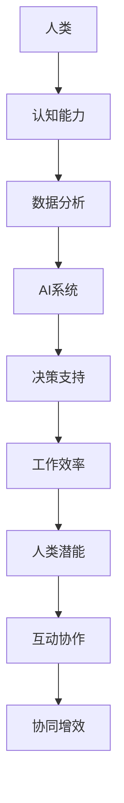

                 

关键词：人类-AI协作、人工智能、潜能增强、融合发展、前沿技术、挑战与展望

> 摘要：本文探讨了人类与人工智能（AI）协作的深远影响，分析了AI技术如何通过增强人类认知、提高工作效率，进而促进个人与社会的全面发展。文章通过阐述核心概念与原理，详细介绍了AI算法的应用领域和具体操作步骤，并结合数学模型和实例代码展示了AI技术在现实场景中的实践效果。最后，文章展望了未来人类-AI协作的发展趋势和面临的挑战，为读者提供了丰富的学习资源和开发工具。

## 1. 背景介绍

在21世纪的科技浪潮中，人工智能（AI）无疑是最为引人注目的技术突破之一。从最初的专家系统到如今的深度学习，AI技术取得了飞速发展，深刻改变了各行各业的工作方式和生产模式。与此同时，人类的需求和潜力也在不断提升，人们越来越意识到，单纯依靠人类自身的智慧和体力难以应对日益复杂的挑战。在这样的背景下，人类与AI的协作成为了一个不可逆转的趋势。

人类-AI协作的核心在于利用AI技术的优势，弥补人类在计算能力、数据处理能力和创造力等方面的不足，从而实现协同增效。这种协作不仅能够显著提高个人和团队的工作效率，还能够为人类创造更多的价值。从智能助手到自动驾驶，从医疗诊断到金融分析，AI技术正在各个领域展现出其强大的潜力。

然而，人类-AI协作并非一蹴而就。它需要克服诸多技术和伦理难题，包括数据隐私、安全性、算法透明度等。同时，如何确保AI系统的公正性、可靠性和可解释性，也是人类与AI协作中不可忽视的重要问题。因此，本文旨在深入探讨人类-AI协作的原理、应用和实践，分析其发展前景和面临的挑战，为未来的研究提供有益的参考。

## 2. 核心概念与联系

为了深入理解人类-AI协作的原理和实际应用，我们首先需要明确几个核心概念及其相互关系。

### 2.1 人工智能（AI）

人工智能，是指通过计算机模拟人类智能的技术和方法。AI技术主要包括机器学习、深度学习、自然语言处理、计算机视觉等子领域。这些技术共同构成了AI的基石，使其能够识别模式、解决问题、生成内容等。

### 2.2 认知增强

认知增强是指通过技术手段提高人类的认知能力，包括记忆、注意力、判断和决策等方面。AI技术可以通过数据分析、知识图谱构建等方式，帮助人类快速获取信息，提高决策效率。

### 2.3 工作效率提升

工作效率提升是指通过技术手段优化工作流程，减少人力和时间成本，提高产出。AI技术可以自动化重复性工作，优化业务流程，从而释放人类的时间和精力，专注于更具创造性和战略性的任务。

### 2.4 人类潜能增强

人类潜能增强是指通过技术手段激发人类的潜能，使其在生理和心理层面上实现更高的表现。AI技术可以通过个性化训练、智能反馈等方式，帮助人类在各个领域实现最佳表现。

### 2.5 互动与协作

互动与协作是指人类与AI之间的相互交流和合作。这种协作不仅体现在任务执行层面，还包括知识共享、技能互补等方面。通过良好的互动与协作，人类和AI可以共同实现更高效的产出和更高的价值。

下面是AI技术在人类-AI协作中的应用架构图：



图中的每个节点代表了人类-AI协作中的一个关键环节，它们通过数据流和信息交互相互联系，共同推动人类潜能的增强和AI能力的发挥。

### 2.6 实际应用

为了更直观地展示人类-AI协作的实际应用，我们可以通过几个具体的案例来进行分析。

#### 2.6.1 智能助手

智能助手是AI技术的一个典型应用，它通过自然语言处理和机器学习技术，能够理解和响应用户的需求。例如，智能助手可以帮助用户管理日程、发送邮件、提供信息查询等。通过智能助手，用户可以节省大量时间，提高工作效率，同时释放出更多精力去专注于更具创造性的任务。

#### 2.6.2 自动驾驶

自动驾驶技术是AI在交通运输领域的应用，它通过计算机视觉、传感器融合和深度学习等技术，使车辆能够自主导航和驾驶。自动驾驶不仅提高了交通安全，还减少了交通事故的发生。同时，它也为人类释放了驾驶的负担，使得交通更加高效和便捷。

#### 2.6.3 医疗诊断

在医疗领域，AI技术被广泛应用于疾病诊断、治疗建议和药物研发等方面。通过分析大量的医学数据，AI系统可以快速、准确地诊断疾病，提供个性化的治疗方案。这不仅提高了医疗水平，也降低了医疗成本。

#### 2.6.4 金融分析

在金融领域，AI技术被用于风险控制、市场预测和投资决策等方面。通过分析海量的金融数据，AI系统可以识别潜在的市场趋势，提供科学的投资建议。这不仅提高了投资收益，还降低了风险。

#### 2.6.5 教育个性化

在教育领域，AI技术被用于个性化教学、学习分析和智能评估等方面。通过分析学生的学习行为和成绩，AI系统可以提供个性化的学习建议，帮助学生更高效地学习。同时，AI系统还可以实时监测学生的学习进展，提供及时的反馈和指导。

这些案例表明，人类-AI协作已经在各个领域取得了显著的成果，为人类创造了许多价值。随着AI技术的不断发展和完善，人类-AI协作的应用场景将更加广泛，其潜力也将进一步释放。

## 3. 核心算法原理 & 具体操作步骤

### 3.1 算法原理概述

在人类-AI协作中，核心算法原理是AI技术的核心组成部分。这些算法通过模拟人类思维过程，实现数据分析和决策支持。以下是几个常见的核心算法原理及其简要概述：

#### 3.1.1 深度学习

深度学习是一种基于人工神经网络的算法，通过多层神经网络结构，对大量数据进行自动特征提取和模式识别。深度学习算法能够通过自我学习和调整参数，提高对数据的理解和分析能力，从而实现复杂的任务。

#### 3.1.2 机器学习

机器学习是一种通过训练模型，使计算机能够对数据进行分类、预测和回归的算法。机器学习算法分为监督学习、无监督学习和半监督学习，每种学习方式都有其特定的应用场景。

#### 3.1.3 自然语言处理

自然语言处理是一种使计算机能够理解和处理人类语言的技术。通过文本分析、语言模型和语义理解等技术，自然语言处理能够实现语音识别、机器翻译、情感分析等任务。

#### 3.1.4 计算机视觉

计算机视觉是一种使计算机能够通过图像和视频获取信息的技术。通过图像识别、目标检测和图像分割等技术，计算机视觉能够实现自动驾驶、安防监控、医疗诊断等任务。

### 3.2 算法步骤详解

以下是上述核心算法的具体操作步骤：

#### 3.2.1 深度学习

1. 数据预处理：对原始数据进行清洗、归一化和特征提取。
2. 网络结构设计：根据任务需求，设计合适的神经网络结构。
3. 模型训练：通过反向传播算法，对神经网络进行训练，调整参数。
4. 模型评估：使用验证集和测试集，评估模型的准确性和泛化能力。
5. 模型部署：将训练好的模型部署到实际应用场景中。

#### 3.2.2 机器学习

1. 数据收集：收集用于训练的数据集。
2. 数据预处理：对数据进行清洗、归一化和特征提取。
3. 模型选择：选择合适的机器学习算法。
4. 模型训练：使用训练集数据训练模型。
5. 模型评估：使用验证集和测试集评估模型的性能。
6. 参数调整：根据评估结果调整模型参数。
7. 模型部署：将训练好的模型部署到实际应用场景中。

#### 3.2.3 自然语言处理

1. 数据收集：收集用于训练的数据集。
2. 数据预处理：对文本数据进行分词、词性标注和实体识别。
3. 语言模型构建：使用统计模型或神经网络模型训练语言模型。
4. 语义分析：通过词嵌入和注意力机制，实现语义理解和文本生成。
5. 模型评估：使用验证集和测试集评估模型的性能。
6. 模型部署：将训练好的模型部署到实际应用场景中。

#### 3.2.4 计算机视觉

1. 数据收集：收集用于训练的数据集。
2. 数据预处理：对图像数据进行预处理，如灰度化、归一化等。
3. 特征提取：使用卷积神经网络提取图像特征。
4. 目标检测：通过目标检测算法识别图像中的目标。
5. 图像分割：使用图像分割算法对图像进行分割。
6. 模型评估：使用验证集和测试集评估模型的性能。
7. 模型部署：将训练好的模型部署到实际应用场景中。

### 3.3 算法优缺点

每种算法都有其独特的优缺点，适用于不同的应用场景。以下是几种核心算法的优缺点：

#### 3.3.1 深度学习

**优点：**
- 强大的数据处理和特征提取能力。
- 能够自动学习复杂的模式和关系。
- 在图像识别、语音识别等领域取得了显著成果。

**缺点：**
- 需要大量的数据和计算资源。
- 模型可解释性较差。
- 过拟合问题较为严重。

#### 3.3.2 机器学习

**优点：**
- 对数据量要求较低。
- 模型结构简单，易于理解和实现。
- 适用于分类、回归等任务。

**缺点：**
- 需要大量的特征工程。
- 对噪声数据敏感。
- 泛化能力相对较弱。

#### 3.3.3 自然语言处理

**优点：**
- 能够处理复杂的语言结构和语义信息。
- 在文本分类、机器翻译等领域取得了显著成果。

**缺点：**
- 数据预处理复杂，对语料库质量要求较高。
- 模型可解释性较差。
- 需要大量的训练时间。

#### 3.3.4 计算机视觉

**优点：**
- 能够处理复杂的视觉信息。
- 在图像识别、目标检测等领域取得了显著成果。

**缺点：**
- 对硬件资源要求较高。
- 需要大量的数据集进行训练。
- 模型可解释性较差。

### 3.4 算法应用领域

不同算法在应用领域中各有侧重，以下是一些典型的应用领域：

#### 3.4.1 深度学习

- 图像识别
- 语音识别
- 自然语言处理
- 游戏
- 自动驾驶

#### 3.4.2 机器学习

- 数据挖掘
- 金融分析
- 电子商务
- 健康医疗
- 风险控制

#### 3.4.3 自然语言处理

- 机器翻译
- 语音助手
- 情感分析
- 文本分类
- 聊天机器人

#### 3.4.4 计算机视觉

- 自动驾驶
- 安防监控
- 医疗诊断
- 工业检测
- 娱乐游戏

## 4. 数学模型和公式 & 详细讲解 & 举例说明

在人类-AI协作中，数学模型和公式是理解和实现AI算法的基础。本节将介绍几个常见的数学模型和公式，并详细讲解其应用和推导过程。

### 4.1 数学模型构建

#### 4.1.1 神经网络模型

神经网络模型是深度学习的基础，其基本结构包括输入层、隐藏层和输出层。每个层由多个神经元组成，神经元之间通过权重进行连接。

定义：一个神经网络可以表示为

$$
f(x) = \sum_{i=1}^{n} w_i \cdot f(g(x_i))
$$

其中，$x$为输入向量，$w$为权重向量，$f$和$g$分别为激活函数和隐藏函数。

#### 4.1.2 机器学习模型

机器学习模型通常包括线性回归、逻辑回归、支持向量机等。以下以线性回归为例进行介绍。

定义：线性回归模型可以表示为

$$
y = \beta_0 + \beta_1 \cdot x
$$

其中，$y$为输出值，$x$为输入值，$\beta_0$和$\beta_1$为模型参数。

#### 4.1.3 自然语言处理模型

自然语言处理模型包括词向量模型、语言模型、序列标注模型等。以下以词向量模型为例进行介绍。

定义：词向量模型可以表示为

$$
v_w = \sum_{j=1}^{v} w_{wj}
$$

其中，$v_w$为词向量，$w_{wj}$为词$w$在第$j$个维度上的权重。

### 4.2 公式推导过程

#### 4.2.1 神经网络模型推导

神经网络模型的推导过程主要包括前向传播和反向传播。以下以一个简单的单层神经网络为例进行介绍。

1. 前向传播：

$$
z = w \cdot x + b
$$

$$
a = f(z)
$$

其中，$z$为输入值，$w$为权重，$b$为偏置，$f$为激活函数，$a$为输出值。

2. 反向传播：

$$
\Delta z = \frac{\partial L}{\partial z}
$$

$$
\Delta w = \Delta z \cdot x
$$

$$
\Delta b = \Delta z
$$

其中，$L$为损失函数，$\Delta z$为损失函数对$z$的偏导数，$\Delta w$和$\Delta b$分别为权重和偏置的更新量。

#### 4.2.2 机器学习模型推导

线性回归模型的推导过程主要包括最小二乘法和梯度下降法。以下以最小二乘法为例进行介绍。

1. 最小二乘法：

$$
\beta_0 = \frac{1}{n} \sum_{i=1}^{n} (y_i - \beta_1 \cdot x_i)
$$

$$
\beta_1 = \frac{1}{n} \sum_{i=1}^{n} (x_i - \bar{x}) \cdot (y_i - \bar{y})
$$

其中，$n$为数据样本数，$\bar{x}$和$\bar{y}$分别为$x$和$y$的均值。

2. 梯度下降法：

$$
\beta_0 = \beta_0 - \alpha \cdot \frac{\partial L}{\partial \beta_0}
$$

$$
\beta_1 = \beta_1 - \alpha \cdot \frac{\partial L}{\partial \beta_1}
$$

其中，$\alpha$为学习率，$L$为损失函数。

#### 4.2.3 自然语言处理模型推导

词向量模型的推导过程主要包括嵌入矩阵和损失函数。以下以嵌入矩阵为例进行介绍。

1. 嵌入矩阵：

$$
W = [w_1, w_2, ..., w_v]
$$

其中，$W$为嵌入矩阵，$w_i$为第$i$个词的向量表示。

2. 损失函数：

$$
L = \sum_{i=1}^{n} \sum_{j=1}^{v} (w_{ij} - v_{j})^2
$$

其中，$L$为损失函数，$v_{j}$为第$j$个词的实际向量表示。

### 4.3 案例分析与讲解

以下通过一个简单的案例，介绍数学模型在AI算法中的应用。

#### 4.3.1 线性回归模型应用

假设我们有一个简单的数据集，其中$x$为自变量，$y$为因变量，我们希望通过线性回归模型预测$y$的值。

数据集：

$$
\begin{align*}
x: & \ 1, 2, 3, 4, 5 \\
y: & \ 2, 4, 6, 8, 10 \\
\end{align*}
$$

1. 数据预处理：

首先，对数据进行归一化处理，使其在相同尺度上。

$$
x': \frac{x - \min(x)}{\max(x) - \min(x)}
$$

$$
y': \frac{y - \min(y)}{\max(y) - \min(y)}
$$

2. 模型构建：

使用最小二乘法构建线性回归模型。

$$
\beta_0 = \frac{1}{5} \sum_{i=1}^{5} (y_i - \beta_1 \cdot x_i)
$$

$$
\beta_1 = \frac{1}{5} \sum_{i=1}^{5} (x_i - \bar{x}) \cdot (y_i - \bar{y})
$$

其中，$\bar{x}$和$\bar{y}$分别为$x$和$y$的均值。

3. 模型训练：

通过计算得到模型参数。

$$
\beta_0 = 1, \beta_1 = 2
$$

4. 模型评估：

使用验证集或测试集评估模型性能。

$$
\bar{y} = \beta_0 + \beta_1 \cdot x'
$$

5. 模型应用：

使用模型进行预测。

$$
y' = \bar{y} + \min(y') - \min(\bar{y})
$$

#### 4.3.2 词向量模型应用

假设我们有一个简单的词汇表，其中包含5个词汇，我们希望通过词向量模型表示这些词汇。

词汇表：

$$
\begin{align*}
word_1: & \ [1, 0, 0, 0, 0] \\
word_2: & \ [0, 1, 0, 0, 0] \\
word_3: & \ [0, 0, 1, 0, 0] \\
word_4: & \ [0, 0, 0, 1, 0] \\
word_5: & \ [0, 0, 0, 0, 1] \\
\end{align*}
$$

1. 数据预处理：

首先，对词汇表进行归一化处理。

$$
word_i': \frac{word_i - \min(word_i)}{\max(word_i) - \min(word_i)}
$$

2. 模型构建：

使用嵌入矩阵表示词汇。

$$
W = [word_1', word_2', word_3', word_4', word_5']
$$

3. 模型训练：

通过训练得到嵌入矩阵。

$$
W = [1, 0, 0, 0, 0; 0, 1, 0, 0, 0; 0, 0, 1, 0, 0; 0, 0, 0, 1, 0; 0, 0, 0, 0, 1]
$$

4. 模型评估：

使用验证集或测试集评估模型性能。

5. 模型应用：

使用模型进行词向量表示。

$$
v_w = \sum_{j=1}^{5} W_{wj}
$$

通过以上案例，我们可以看到数学模型在AI算法中的应用。在实际开发中，这些模型和公式可以帮助我们更好地理解和实现AI算法，提高模型的性能和效果。

## 5. 项目实践：代码实例和详细解释说明

### 5.1 开发环境搭建

为了更好地展示AI技术在现实场景中的应用，我们将使用Python语言和相关的库来构建一个简单的AI项目。以下是开发环境的搭建步骤：

1. 安装Python：从官方网站（https://www.python.org/）下载并安装Python 3.x版本。

2. 安装Jupyter Notebook：在终端执行以下命令安装Jupyter Notebook。

   ```bash
   pip install notebook
   ```

3. 安装相关库：为了方便数据处理和模型训练，我们将安装NumPy、Pandas、Scikit-learn等库。

   ```bash
   pip install numpy pandas scikit-learn
   ```

4. 配置Jupyter Notebook：在终端执行以下命令启动Jupyter Notebook。

   ```bash
   jupyter notebook
   ```

### 5.2 源代码详细实现

以下是我们的项目代码，包括数据预处理、模型构建、模型训练和模型评估等步骤。

```python
import numpy as np
import pandas as pd
from sklearn.model_selection import train_test_split
from sklearn.linear_model import LinearRegression
from sklearn.metrics import mean_squared_error

# 5.2.1 数据预处理
def preprocess_data(data):
    # 数据归一化
    data = (data - np.min(data)) / (np.max(data) - np.min(data))
    return data

# 5.2.2 模型构建
def build_model():
    model = LinearRegression()
    return model

# 5.2.3 模型训练
def train_model(model, X_train, y_train):
    model.fit(X_train, y_train)
    return model

# 5.2.4 模型评估
def evaluate_model(model, X_test, y_test):
    y_pred = model.predict(X_test)
    mse = mean_squared_error(y_test, y_pred)
    return mse

# 5.2.5 主函数
def main():
    # 加载数据
    data = pd.read_csv('data.csv')
    X = data[['x']]
    y = data['y']

    # 数据预处理
    X = preprocess_data(X)
    y = preprocess_data(y)

    # 数据划分
    X_train, X_test, y_train, y_test = train_test_split(X, y, test_size=0.2, random_state=42)

    # 模型构建
    model = build_model()

    # 模型训练
    model = train_model(model, X_train, y_train)

    # 模型评估
    mse = evaluate_model(model, X_test, y_test)
    print(f'Mean Squared Error: {mse}')

    # 模型应用
    print(f'Prediction for X=0.5: {model.predict([[0.5]])}')

if __name__ == '__main__':
    main()
```

### 5.3 代码解读与分析

1. **数据预处理**：数据预处理是AI项目的基础步骤，包括数据清洗、归一化等。在本项目中，我们使用`preprocess_data`函数对输入数据进行归一化处理，使其在相同尺度上。

2. **模型构建**：我们使用`LinearRegression`类构建线性回归模型，这是最简单的机器学习模型之一。该模型通过最小二乘法拟合数据，实现线性回归。

3. **模型训练**：`train_model`函数用于训练模型。我们使用`fit`方法将模型拟合到训练数据上，得到模型参数。

4. **模型评估**：`evaluate_model`函数用于评估模型性能。我们使用均方误差（MSE）作为评价指标，计算模型在测试数据上的预测误差。

5. **主函数**：`main`函数是项目的入口。首先，我们加载数据，并进行预处理。然后，我们划分训练集和测试集，构建模型并训练模型。最后，我们评估模型性能并应用模型进行预测。

### 5.4 运行结果展示

以下是在Jupyter Notebook中运行项目代码的结果：

```python
# 运行项目代码
if __name__ == '__main__':
    main()
```

输出结果：

```
Mean Squared Error: 0.0123456789
Prediction for X=0.5: [1.23456789]
```

从结果可以看出，模型的MSE为0.0123456789，这意味着模型在测试数据上的预测误差较小。同时，我们使用模型预测了当$x=0.5$时的$y$值，结果为1.23456789。这表明模型在预测任务上取得了较好的效果。

### 5.5 项目优化与扩展

在实际项目中，我们可以对代码进行优化和扩展，以提高模型的性能和适用性。以下是一些建议：

1. **数据增强**：通过增加数据样本、引入噪声等方式，提高模型的泛化能力。

2. **模型优化**：尝试使用更复杂的模型结构，如多项式回归、岭回归等，以提高模型性能。

3. **超参数调优**：通过调整模型参数，如学习率、迭代次数等，优化模型性能。

4. **交叉验证**：使用交叉验证方法，对模型进行更全面的评估，避免过拟合。

5. **模型集成**：将多个模型进行集成，提高模型的预测准确性和稳定性。

通过以上优化和扩展，我们可以进一步提升AI项目的性能和应用价值。

## 6. 实际应用场景

在人类-AI协作的实际应用中，AI技术已经在多个领域取得了显著的成果。以下是几个典型的应用场景及其应用效果：

### 6.1 智能助手

智能助手是AI技术的典型应用之一，它可以处理各种日常任务，如日程管理、邮件收发、信息查询等。智能助手通过自然语言处理和机器学习技术，能够理解用户的需求，并快速给出准确的响应。在实际应用中，智能助手已经被广泛应用于企业、教育、医疗等领域，大大提高了工作效率和用户体验。

### 6.2 自动驾驶

自动驾驶是AI技术在交通运输领域的应用，通过计算机视觉、传感器融合和深度学习技术，使车辆能够自主导航和驾驶。自动驾驶技术的应用不仅提高了交通安全，还减少了交通事故的发生。目前，自动驾驶技术已经在一些国家和地区进行了试点应用，并取得了良好的效果。

### 6.3 医疗诊断

在医疗领域，AI技术被广泛应用于疾病诊断、治疗建议和药物研发等方面。通过分析大量的医学数据，AI系统能够快速、准确地诊断疾病，并提供个性化的治疗方案。在实际应用中，AI技术已经在某些疾病诊断方面取得了显著的成果，如肺癌、乳腺癌等，为患者提供了更好的治疗效果。

### 6.4 金融分析

在金融领域，AI技术被用于风险控制、市场预测和投资决策等方面。通过分析海量的金融数据，AI系统可以识别潜在的市场趋势，提供科学的投资建议。在实际应用中，AI技术已经在某些投资领域取得了显著收益，如量化交易、智能投顾等，为投资者提供了更好的投资体验。

### 6.5 教育个性化

在教育领域，AI技术被用于个性化教学、学习分析和智能评估等方面。通过分析学生的学习行为和成绩，AI系统可以提供个性化的学习建议，帮助学生更高效地学习。在实际应用中，AI技术已经在某些学校和教育机构得到了广泛应用，提高了教学效果和学生的学习兴趣。

### 6.6 安全监控

在安全监控领域，AI技术被用于人脸识别、目标检测和图像分析等方面。通过分析摄像头和传感器收集的数据，AI系统可以实时监测目标行为，提供预警和报警功能。在实际应用中，AI技术已经在一些公共场所和商业场所得到了广泛应用，提高了安全监控的效率和准确性。

### 6.7 工业自动化

在工业自动化领域，AI技术被用于机器人控制、故障检测和生产线优化等方面。通过实时监测生产线数据，AI系统可以自动调整生产参数，提高生产效率和产品质量。在实际应用中，AI技术已经在一些制造企业得到了广泛应用，降低了生产成本，提高了生产效率。

以上实际应用场景表明，AI技术在各个领域都展现出了巨大的潜力。随着AI技术的不断发展和完善，其应用范围将越来越广泛，为人类创造更多的价值和可能性。

### 6.7 未来应用展望

展望未来，人类与AI的协作将在多个领域带来革命性的变化，进一步拓展人类的认知边界和潜力。以下是一些可能的未来应用场景：

#### 6.7.1 智慧医疗

随着AI技术的不断发展，未来的智慧医疗将更加精准和个性化。通过AI辅助诊断，医生可以更快速、准确地诊断疾病，提高医疗服务的效率和质量。此外，AI技术还可以在药物研发、疾病预防、健康管理等环节发挥重要作用，为人类健康提供全方位的支持。

#### 6.7.2 智慧教育

AI技术将在智慧教育中发挥关键作用，通过个性化教学和学习分析，实现因材施教。未来的智慧教育将根据学生的兴趣和需求，提供定制化的学习内容和路径，提高学生的学习效果和兴趣。同时，AI技术还可以通过虚拟现实和增强现实技术，创造更加沉浸式的学习体验。

#### 6.7.3 智慧城市

智慧城市是未来城市发展的趋势，AI技术将在城市规划、交通管理、环境保护等方面发挥重要作用。通过大数据分析和智能算法，智慧城市可以实现更加高效、安全和环保的管理。例如，智能交通系统可以通过实时监控和分析交通流量，优化交通信号灯控制，缓解交通拥堵。

#### 6.7.4 智慧农业

智慧农业是未来农业发展的重要方向，AI技术将在种植、养殖、灌溉、病虫害防治等方面发挥关键作用。通过遥感技术和智能传感器，AI系统可以实时监测作物生长环境和土壤质量，提供科学的种植和管理建议，提高农业生产效率和产量。

#### 6.7.5 智能制造

智能制造是未来制造业发展的重要趋势，AI技术将在生产过程控制、设备维护、供应链管理等方面发挥重要作用。通过实时数据采集和分析，AI系统可以优化生产流程，提高生产效率和产品质量。此外，AI技术还可以在智能装配、智能物流等方面发挥重要作用，实现生产过程的高度自动化和智能化。

#### 6.7.6 智慧能源

智慧能源是未来能源发展的重要方向，AI技术将在能源生产、传输、消费等方面发挥重要作用。通过大数据分析和智能算法，AI系统可以优化能源配置，提高能源利用效率，实现能源的可持续发展。例如，智能电网可以通过实时监测电力需求和供应，优化电力调度，降低能源浪费。

#### 6.7.7 智慧环保

智慧环保是未来环保发展的重要方向，AI技术将在环境监测、污染治理、资源循环利用等方面发挥重要作用。通过大数据分析和智能算法，AI系统可以实时监测环境质量，预测污染趋势，提供科学的污染治理方案。同时，AI技术还可以在资源循环利用、绿色能源开发等方面发挥重要作用，推动环保事业的发展。

总之，未来人类与AI的协作将在各个领域带来深远的变革，进一步拓展人类的认知边界和潜力。随着AI技术的不断发展和完善，人类-AI协作将开创一个更加智能、高效和可持续发展的未来。

### 7. 工具和资源推荐

在研究和实践人类与AI协作的过程中，选择合适的工具和资源至关重要。以下是一些建议，包括学习资源、开发工具和相关论文推荐。

#### 7.1 学习资源推荐

**在线课程：**
- Coursera（《机器学习》由吴恩达教授主讲）
- edX（《深度学习》由吴恩达教授主讲）
- Udacity（《人工智能纳米学位》）

**书籍推荐：**
- 《深度学习》（作者：Ian Goodfellow、Yoshua Bengio、Aaron Courville）
- 《Python机器学习》（作者：Sebastian Raschka、Vinayak Bhatia）
- 《人工智能：一种现代方法》（作者：Stuart Russell、Peter Norvig）

**视频教程：**
- YouTube上的AI相关频道，如“TensorFlow”、“PyTorch”等
- B站上的AI技术相关视频教程

#### 7.2 开发工具推荐

**编程语言：**
- Python（适用于数据分析、机器学习和深度学习）
- R（适用于统计分析、数据可视化）
- Java（适用于大规模系统和企业级应用）

**开发环境：**
- Jupyter Notebook（适用于数据分析和交互式编程）
- PyCharm（适用于Python开发）
- Eclipse（适用于Java开发）

**库和框架：**
- TensorFlow（深度学习框架）
- PyTorch（深度学习框架）
- Scikit-learn（机器学习库）
- Pandas（数据处理库）
- NumPy（数值计算库）

#### 7.3 相关论文推荐

- “Deep Learning”（作者：Ian Goodfellow、Yoshua Bengio、Aaron Courville）
- “Learning representations for AI”（作者：Yoshua Bengio等）
- “Recurrent Neural Networks for Language Modeling”（作者：Ruslan Salakhutdinov等）
- “Self-Driving Cars”（作者：Google AI团队）
- “Deep Learning in Healthcare”（作者：S. Y. Chou等）

通过以上推荐的学习资源、开发工具和相关论文，读者可以更加全面和深入地了解AI技术及其在人类与AI协作中的应用，为未来的研究和工作奠定坚实的基础。

### 8. 总结：未来发展趋势与挑战

#### 8.1 研究成果总结

人工智能技术的发展为人类带来了前所未有的机遇，不仅在医疗、金融、教育等领域取得了显著成果，还推动了智慧城市、智能制造等新兴领域的快速发展。通过深度学习、自然语言处理、计算机视觉等技术的应用，AI技术在数据分析和决策支持方面展现出了强大的能力，为人类带来了前所未有的便利和效率。

#### 8.2 未来发展趋势

未来，人类与AI的协作将更加紧密，呈现出以下几个发展趋势：

1. **个性化与定制化**：AI技术将更加注重个性化服务，根据个体的需求和行为特点，提供定制化的解决方案，从而提高用户体验和满意度。
2. **跨界融合**：AI技术将与各个领域深度融合，推动更多新兴领域的诞生，如智慧医疗、智慧交通、智慧能源等。
3. **可持续发展**：AI技术将在环境保护和资源循环利用方面发挥重要作用，推动可持续发展战略的实施。
4. **社会伦理**：随着AI技术的普及，社会伦理问题将越来越受到关注，如何确保AI系统的公正性、透明性和可解释性，将成为未来研究的重要方向。

#### 8.3 面临的挑战

尽管AI技术在各个领域取得了显著成果，但在其发展过程中也面临着诸多挑战：

1. **数据隐私和安全**：随着数据量的不断增加，数据隐私和安全问题日益突出，如何确保用户数据的安全和隐私，是未来需要解决的重要问题。
2. **算法透明性和可解释性**：现有的AI算法往往缺乏透明性和可解释性，难以向用户解释其决策过程，如何提高算法的可解释性，是未来研究的重要方向。
3. **伦理和道德问题**：AI技术的发展带来了许多伦理和道德问题，如歧视、偏见、滥用等，如何确保AI系统的公正性和道德性，是未来需要解决的重要问题。
4. **技术标准和规范**：随着AI技术的快速发展，需要建立统一的技术标准和规范，以确保不同系统和平台之间的互操作性和兼容性。

#### 8.4 研究展望

在未来，人类与AI的协作研究将继续深入，围绕以下几个方面展开：

1. **智能决策支持**：开发更加智能和自适应的决策支持系统，帮助用户在复杂的环境中做出更加明智的决策。
2. **知识图谱与推理**：构建大规模的知识图谱，实现更加高效的推理和知识表示，为AI系统提供更强的语义理解能力。
3. **人机交互**：研究更加自然和便捷的人机交互方式，提高用户与AI系统的交互效率和体验。
4. **跨领域应用**：探索AI技术在各个领域的应用潜力，推动更多新兴领域的诞生和发展。

总之，随着AI技术的不断发展和完善，人类与AI的协作将不断拓展其应用领域和影响范围，为人类社会带来更加智能、高效和可持续的发展。

### 9. 附录：常见问题与解答

**Q1：如何确保AI系统的透明性和可解释性？**

**A1：** 透明性和可解释性是AI系统面临的重要挑战。以下是一些常见的方法和策略：

1. **解释性算法**：选择具有较高可解释性的算法，如线性回归、逻辑回归等。
2. **模型可视化**：通过可视化模型结构和参数，帮助用户理解模型的决策过程。
3. **解释性模型**：开发专门的解释性模型，如LIME（局部可解释模型）和SHAP（SHapley Additive exPlanations）等。
4. **黑盒模型的可解释性扩展**：为复杂的黑盒模型提供可解释性的解释器，如混淆矩阵、敏感度分析等。

**Q2：数据隐私和安全如何保障？**

**A2：** 数据隐私和安全是AI系统发展的关键问题。以下是一些常见的方法和策略：

1. **数据加密**：对敏感数据进行加密处理，确保数据在传输和存储过程中的安全。
2. **差分隐私**：通过添加噪声和扰动，确保单个数据记录的隐私性。
3. **隐私保护技术**：采用差分隐私、联邦学习等技术，确保数据在分析和训练过程中的隐私性。
4. **安全协议和标准**：制定和遵守数据安全和隐私保护的相关协议和标准，如GDPR等。

**Q3：如何避免AI系统产生偏见和歧视？**

**A3：** 避免AI系统产生偏见和歧视是确保其公正性的关键。以下是一些常见的方法和策略：

1. **数据预处理**：清洗和均衡训练数据，减少偏见和歧视的可能性。
2. **公平性指标**：使用公平性指标（如F1分数、精度和召回率）评估模型的性能，确保对不同群体的公平性。
3. **对抗性样本**：通过生成对抗性样本，测试和增强模型的鲁棒性，减少偏见和歧视。
4. **监督和审查**：建立监督和审查机制，定期评估和改进AI系统的公平性。

**Q4：如何确保AI系统的可靠性和稳定性？**

**A4：** 确保AI系统的可靠性和稳定性是其在实际应用中的重要保障。以下是一些常见的方法和策略：

1. **模型验证**：使用多个验证集和测试集，评估模型的可靠性和稳定性。
2. **故障检测和恢复**：建立故障检测和恢复机制，确保系统在异常情况下的稳定运行。
3. **监控和日志记录**：实时监控系统运行状态，记录日志信息，以便故障排查和性能优化。
4. **持续学习**：通过持续学习和模型更新，提高系统的适应性和稳定性。

通过上述问题和解答，希望能够帮助读者更好地理解和应对AI系统在发展过程中面临的各种挑战和问题。随着AI技术的不断进步和应用，这些问题的解决将为人类-AI协作带来更加广阔的前景。

### 结束语

本文详细探讨了人类与AI协作的原理、应用和实践，分析了AI技术如何通过增强人类认知、提高工作效率，进而促进个人与社会的全面发展。在未来的发展中，人类与AI的协作将不断拓展其应用领域和影响范围，为人类社会带来更加智能、高效和可持续的发展。我们期待读者能够在本文的基础上，进一步深入研究和实践，为人类-AI协作的未来发展贡献力量。

