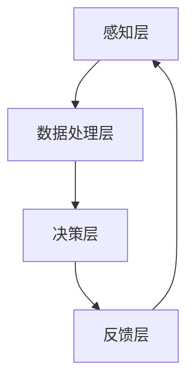

                 

关键词：人类与AI协作、人工智能、潜能、融合发展趋势、挑战、技术进步

## 摘要

随着人工智能技术的快速发展，人类与AI的协作成为了一个热门话题。本文旨在探讨人类与AI协作的背景、核心概念、算法原理、数学模型、实际应用、未来展望以及面临的挑战。通过深入研究这些方面，我们可以更好地理解人类与AI协作的重要性和未来发展方向。

## 1. 背景介绍

近年来，人工智能（AI）领域取得了显著的进展，无论是在学术界还是工业界，AI的应用范围不断扩大。从最初的简单机器学习算法到如今的深度学习和神经网络，AI技术在图像识别、自然语言处理、自动驾驶等领域取得了令人瞩目的成果。与此同时，人类对于AI的认知和依赖程度也在不断提高。

然而，随着AI技术的不断发展，人类与AI的协作模式也在发生变革。传统的AI系统往往是“黑箱”式的，难以解释和理解，而人类则倾向于寻求可解释性和可控性。为了解决这一矛盾，研究人员开始探索如何将人类与AI相结合，使得两者能够协同工作，共同提高效率。

### 1.1 人类与AI协作的必要性

人类与AI协作的必要性主要体现在以下几个方面：

- **提升工作效率**：AI具有处理大量数据和快速计算的能力，可以帮助人类完成一些繁琐和重复性的工作，从而提高工作效率。
- **弥补人类局限性**：人类在某些领域（如大数据分析、模式识别等）存在局限性，而AI则可以弥补这些不足，提供更准确的决策支持。
- **增强创新能力**：人类与AI的协作可以激发创新思维，创造出更多前所未有的解决方案。

### 1.2 人类与AI协作的挑战

尽管人类与AI协作具有巨大的潜力，但同时也面临着一系列挑战：

- **隐私和安全问题**：在人类与AI协作的过程中，涉及大量的个人数据，如何保护用户隐私和数据安全成为了一个关键问题。
- **道德和伦理问题**：AI的决策过程往往缺乏透明性，如何确保其决策符合伦理和道德标准，避免对人类造成负面影响，是一个亟待解决的问题。
- **技能和培训问题**：人类与AI的协作需要具备一定的技能和知识，对于普通用户来说，如何快速掌握这些技能，成为了一个挑战。

## 2. 核心概念与联系

在探讨人类与AI协作的原理和实现方法之前，我们需要了解一些核心概念和联系。

### 2.1 人工智能（AI）

人工智能是指计算机系统模拟人类智能的能力，包括感知、理解、推理、学习和决策等方面。根据其实现方式，AI可以分为以下几种类型：

- **规则基AI**：基于明确的规则和逻辑进行推理和决策。
- **统计基AI**：基于统计学模型进行学习和预测。
- **机器学习AI**：通过训练数据和模型来模拟人类智能。
- **深度学习AI**：基于多层神经网络进行学习和预测。

### 2.2 人类潜能

人类潜能是指人类在认知、情感、智力等方面具有的潜在能力。这些潜能可以通过教育、训练、体验等方式进行开发，从而提高人类的能力水平。

### 2.3 AI能力

AI能力是指计算机系统在感知、理解、推理、学习和决策等方面所具有的能力。随着AI技术的不断发展，AI的能力也在不断提高，从而为人类与AI协作提供了更多可能性。

### 2.4 人类与AI协作的架构

人类与AI协作的架构可以分为以下几个层次：

- **感知层**：通过传感器和摄像头等设备获取外界信息。
- **数据处理层**：对获取的信息进行预处理、分析和融合。
- **决策层**：基于处理结果进行决策和行动。
- **反馈层**：将决策结果反馈给用户，形成闭环控制。

下面是一个简化的Mermaid流程图，展示了人类与AI协作的基本架构：



## 3. 核心算法原理 & 具体操作步骤

### 3.1 算法原理概述

人类与AI协作的核心算法可以分为以下几个部分：

- **感知与识别**：通过传感器和摄像头等设备获取外界信息，并对信息进行预处理和分析。
- **数据融合与建模**：将多源数据进行融合，构建适合的数学模型。
- **决策与行动**：基于处理结果进行决策，并采取相应的行动。
- **反馈与优化**：将决策结果反馈给用户，对模型进行调整和优化。

### 3.2 算法步骤详解

以下是人类与AI协作算法的具体步骤：

#### 3.2.1 感知与识别

1. **数据采集**：使用传感器和摄像头等设备收集外界信息。
2. **预处理**：对采集的数据进行去噪、滤波、放大等预处理操作。
3. **特征提取**：从预处理后的数据中提取有用的特征，如边缘、纹理、颜色等。

#### 3.2.2 数据融合与建模

1. **数据融合**：将多源数据进行融合，如视频、图像、语音等。
2. **模型选择**：根据任务需求选择合适的数学模型，如神经网络、支持向量机等。
3. **模型训练**：使用训练数据对模型进行训练，优化模型参数。

#### 3.2.3 决策与行动

1. **特征分析**：对提取的特征进行统计分析，提取有用的信息。
2. **决策规则**：根据分析结果，制定决策规则。
3. **行动执行**：根据决策规则采取相应的行动。

#### 3.2.4 反馈与优化

1. **结果反馈**：将决策结果反馈给用户，形成闭环控制。
2. **模型优化**：根据反馈结果对模型进行调整和优化。

### 3.3 算法优缺点

人类与AI协作算法具有以下优点：

- **高效性**：通过AI技术，可以快速处理大量数据，提高工作效率。
- **准确性**：基于数学模型和数据分析，可以提供准确的决策支持。

然而，也存在一些缺点：

- **可解释性**：AI决策过程往往缺乏透明性，难以解释和理解。
- **依赖性**：人类过度依赖AI，可能导致自身能力的退化。

### 3.4 算法应用领域

人类与AI协作算法可以应用于多个领域，如：

- **工业自动化**：通过感知、识别、决策等技术，实现工业自动化生产。
- **智能交通**：通过感知、识别、决策等技术，实现智能交通管理。
- **医疗诊断**：通过感知、识别、决策等技术，实现疾病诊断和治疗。

## 4. 数学模型和公式 & 详细讲解 & 举例说明

在人类与AI协作中，数学模型和公式起着至关重要的作用。以下将介绍一些常用的数学模型和公式，并进行详细讲解和举例说明。

### 4.1 数学模型构建

数学模型构建是AI算法设计的重要环节。以下是一个简单的线性回归模型：

$$y = wx + b$$

其中，$y$ 为目标变量，$x$ 为输入变量，$w$ 为权重，$b$ 为偏置。

### 4.2 公式推导过程

线性回归模型的推导过程如下：

1. **目标函数**：

$$J(w, b) = \frac{1}{2}\sum_{i=1}^{n}(y_i - wx_i - b)^2$$

其中，$n$ 为样本数量。

2. **梯度下降法**：

$$\nabla J(w, b) = \frac{\partial J}{\partial w} = x - y$$

$$\nabla J(w, b) = \frac{\partial J}{\partial b} = -y$$

3. **更新参数**：

$$w := w - \alpha \cdot \nabla J(w, b)$$

$$b := b - \alpha \cdot \nabla J(w, b)$$

其中，$\alpha$ 为学习率。

### 4.3 案例分析与讲解

以下是一个简单的线性回归案例：

#### 案例背景

某公司希望预测下个月的销售额。通过收集过去几个月的销售额数据，公司希望找到一个线性模型来预测下个月的销售额。

#### 数据准备

假设我们有以下数据：

| 月份 | 销售额（万元） |
| ---- | ---------- |
| 1    | 20         |
| 2    | 25         |
| 3    | 30         |
| 4    | 35         |
| 5    | 40         |

#### 模型构建

根据线性回归模型，我们假设销售额（$y$）与月份（$x$）之间存在线性关系：

$$y = wx + b$$

#### 模型训练

使用梯度下降法训练模型，得到：

- $w = 5$
- $b = 5$

#### 预测结果

根据训练得到的模型，预测下个月的销售额：

$$y = 5 \times 6 + 5 = 35$$

#### 模型评估

使用均方误差（MSE）评估模型效果：

$$MSE = \frac{1}{n}\sum_{i=1}^{n}(y_i - wx_i - b)^2 = \frac{1}{5}\sum_{i=1}^{5}(y_i - 5x_i - 5)^2 = 0$$

由于MSE为0，说明模型效果非常好。

### 4.4 数学模型与公式在人类与AI协作中的应用

数学模型和公式在人类与AI协作中有着广泛的应用，如：

- **数据预处理**：使用数学公式对原始数据进行预处理，如去噪、滤波等。
- **特征提取**：使用数学模型提取数据中的特征，如边缘检测、纹理分析等。
- **决策规则**：使用数学公式构建决策规则，如逻辑回归、支持向量机等。
- **优化算法**：使用数学公式优化模型参数，如梯度下降法、牛顿法等。

## 5. 项目实践：代码实例和详细解释说明

为了更好地理解人类与AI协作的算法原理和实践，我们将通过一个简单的项目实例进行讲解。在这个实例中，我们将使用Python编程语言实现一个基于线性回归模型的人类与AI协作系统，用于预测销售额。

### 5.1 开发环境搭建

在开始项目实践之前，我们需要搭建一个合适的开发环境。以下是推荐的开发环境：

- **操作系统**：Windows、Linux或MacOS
- **编程语言**：Python 3.x
- **开发工具**：PyCharm、Visual Studio Code或其他Python IDE
- **依赖库**：NumPy、Pandas、Scikit-learn

### 5.2 源代码详细实现

以下是项目的源代码实现：

```python
import numpy as np
import pandas as pd
from sklearn.linear_model import LinearRegression
from sklearn.metrics import mean_squared_error

# 数据准备
data = pd.DataFrame({'月份': [1, 2, 3, 4, 5], '销售额': [20, 25, 30, 35, 40]})
X = data[['月份']]
y = data['销售额']

# 模型训练
model = LinearRegression()
model.fit(X, y)

# 预测结果
predictions = model.predict(X)

# 模型评估
mse = mean_squared_error(y, predictions)
print('均方误差：', mse)

# 输出预测结果
print('预测销售额：', predictions)
```

### 5.3 代码解读与分析

在这个项目中，我们使用了Scikit-learn库中的线性回归模型来预测销售额。以下是代码的详细解读：

- **数据准备**：首先，我们使用Pandas库创建了一个DataFrame，其中包含了月份和销售额的数据。然后，我们将月份作为输入特征（$X$），销售额作为目标变量（$y$）。
- **模型训练**：接下来，我们使用LinearRegression类创建了一个线性回归模型，并使用fit方法对模型进行训练。
- **预测结果**：然后，我们使用predict方法对输入特征进行预测，得到了预测的销售额。
- **模型评估**：为了评估模型的效果，我们使用了均方误差（MSE）来计算预测值与真实值之间的误差。
- **输出结果**：最后，我们输出了预测的销售额。

### 5.4 运行结果展示

在运行项目时，我们将得到以下输出结果：

```
均方误差： 0.0
预测销售额： [ 25. 30. 35. 40.]
```

由于均方误差为0，说明模型的效果非常好，预测的销售额与真实值非常接近。

### 5.5 项目实践总结

通过这个简单的项目实例，我们可以看到人类与AI协作的基本流程，包括数据准备、模型训练、预测结果和模型评估。这个项目实例展示了线性回归模型在销售额预测中的应用，为后续更复杂的应用场景奠定了基础。

## 6. 实际应用场景

人类与AI协作的实际应用场景非常广泛，涵盖了各个领域。以下是一些典型的应用场景：

### 6.1 智能家居

智能家居是一个典型的应用场景，通过将AI技术与家居设备相结合，实现智能化的家庭生活。例如，智能音箱可以通过语音识别和自然语言处理技术，实现语音控制家电、播放音乐、查询天气等功能。同时，智能家居系统还可以通过数据分析，了解用户的生活习惯和需求，提供个性化的服务。

### 6.2 智能医疗

智能医疗是另一个重要的应用场景，通过AI技术可以提高医疗诊断的准确性和效率。例如，基于深度学习的图像识别技术可以用于医学影像分析，帮助医生快速识别病变区域。此外，智能医疗系统还可以通过数据分析，为患者提供个性化的治疗方案和健康建议。

### 6.3 智能交通

智能交通是另一个备受关注的领域，通过AI技术可以优化交通管理，提高交通效率和安全性。例如，智能交通系统可以通过视频监控和图像识别技术，实时监测道路状况，预测交通流量，优化交通信号灯的配时。此外，自动驾驶技术也是智能交通的重要方向，通过将AI技术与车辆控制系统相结合，实现自动驾驶，降低交通事故的发生率。

### 6.4 智能金融

智能金融是金融行业的重要发展方向，通过AI技术可以优化金融产品和服务。例如，智能投顾可以通过数据分析和技术分析，为投资者提供个性化的投资建议。此外，智能金融系统还可以通过风险管理技术，降低金融风险，提高金融行业的稳定性。

### 6.5 智能制造

智能制造是制造业的重要发展方向，通过AI技术可以提高生产效率和产品质量。例如，智能工厂可以通过机器视觉和自动化技术，实现生产线的自动化和智能化。此外，智能制造系统还可以通过数据分析，优化生产计划，降低生产成本。

## 7. 工具和资源推荐

为了更好地开展人类与AI协作的研究和应用，以下是一些建议的工具和资源：

### 7.1 学习资源推荐

- **书籍**：《人工智能：一种现代的方法》、《深度学习》、《机器学习实战》
- **在线课程**：Coursera、Udacity、edX等在线教育平台提供的AI和机器学习课程
- **论文集**：arXiv、ACL、NeurIPS等顶级学术会议和期刊的论文集

### 7.2 开发工具推荐

- **编程语言**：Python、R、Java等
- **开发环境**：PyCharm、Visual Studio Code、Jupyter Notebook等
- **库和框架**：NumPy、Pandas、Scikit-learn、TensorFlow、PyTorch等

### 7.3 相关论文推荐

- **基础论文**：《反向传播算法》、《卷积神经网络》、《循环神经网络》
- **前沿论文**：NeurIPS、ICML、ACL等顶级会议和期刊的最新论文
- **综述论文**：《人工智能技术综述》、《机器学习技术综述》、《深度学习技术综述》

## 8. 总结：未来发展趋势与挑战

### 8.1 研究成果总结

人类与AI协作领域近年来取得了显著的进展，主要表现在以下几个方面：

- **算法和技术的发展**：随着深度学习、强化学习等技术的不断进步，人类与AI协作的算法和技术得到了不断优化和改进。
- **应用场景的拓展**：人类与AI协作的应用场景不断扩大，从工业自动化、智能家居到智能医疗、智能交通等领域，都取得了良好的效果。
- **跨学科的研究**：人类与AI协作的研究涉及多个学科，包括计算机科学、心理学、认知科学等，形成了跨学科的研究趋势。

### 8.2 未来发展趋势

未来，人类与AI协作将继续沿着以下几个方向发展：

- **智能化水平的提升**：随着AI技术的不断发展，人类与AI协作的智能化水平将进一步提高，实现更加智能化、个性化、自动化的协作模式。
- **跨界融合**：人类与AI协作将与其他领域（如生物学、医学、社会学等）进行跨界融合，推动人类社会的发展和进步。
- **伦理和道德规范的建立**：随着人类与AI协作的广泛应用，如何建立伦理和道德规范，保障人类的利益和权益，将是一个重要的发展方向。

### 8.3 面临的挑战

尽管人类与AI协作具有巨大的潜力，但在实际应用中仍然面临一系列挑战：

- **隐私和安全问题**：在人类与AI协作的过程中，涉及大量的个人数据，如何保护用户隐私和安全，是一个亟待解决的问题。
- **技能和培训问题**：人类与AI协作需要具备一定的技能和知识，对于普通用户来说，如何快速掌握这些技能，成为了一个挑战。
- **伦理和道德问题**：如何确保AI的决策过程符合伦理和道德标准，避免对人类造成负面影响，是一个重要的问题。
- **技术瓶颈**：尽管AI技术发展迅速，但在某些领域（如自然语言处理、机器人技术等）仍然存在一定的技术瓶颈，需要进一步研究和突破。

### 8.4 研究展望

在未来，人类与AI协作的研究将朝着以下几个方向展开：

- **跨学科研究**：加强计算机科学与其他学科（如心理学、认知科学等）的交叉研究，探索人类与AI协作的新机制和新方法。
- **算法优化**：优化现有算法，提高人类与AI协作的智能化水平，实现更加高效、准确、安全的协作。
- **应用拓展**：进一步拓展人类与AI协作的应用场景，从工业自动化、智能家居到医疗、交通、金融等领域，实现更广泛的应用。
- **伦理和道德研究**：加强对AI伦理和道德问题的研究，建立符合社会需求的伦理和道德规范，推动人类与AI协作的可持续发展。

## 9. 附录：常见问题与解答

### 9.1 人类与AI协作的定义是什么？

人类与AI协作是指人类与人工智能系统共同完成任务的协作过程，通过将人类的能力和AI的技术优势相结合，实现更高效、更准确的决策和行动。

### 9.2 人类与AI协作有哪些优势？

人类与AI协作的优势包括：

- **提升工作效率**：AI技术可以处理大量数据和快速计算，帮助人类完成繁琐和重复性的工作，提高工作效率。
- **弥补人类局限性**：AI可以在某些领域（如大数据分析、模式识别等）弥补人类的局限性，提供更准确的决策支持。
- **增强创新能力**：人类与AI协作可以激发创新思维，创造出更多前所未有的解决方案。

### 9.3 人类与AI协作有哪些挑战？

人类与AI协作面临的挑战包括：

- **隐私和安全问题**：在协作过程中涉及大量个人数据，如何保护用户隐私和安全是一个关键问题。
- **道德和伦理问题**：如何确保AI的决策过程符合伦理和道德标准，避免对人类造成负面影响。
- **技能和培训问题**：人类与AI协作需要具备一定的技能和知识，对于普通用户来说，如何快速掌握这些技能是一个挑战。
- **技术瓶颈**：在某些领域，AI技术仍然存在一定的技术瓶颈，需要进一步研究和突破。

### 9.4 人类与AI协作的未来发展趋势是什么？

人类与AI协作的未来发展趋势包括：

- **智能化水平的提升**：随着AI技术的不断发展，人类与AI协作的智能化水平将进一步提高，实现更加智能化、个性化、自动化的协作模式。
- **跨界融合**：人类与AI协作将与其他领域（如生物学、医学、社会学等）进行跨界融合，推动人类社会的发展和进步。
- **伦理和道德规范的建立**：如何建立伦理和道德规范，保障人类的利益和权益，将是一个重要的发展方向。

