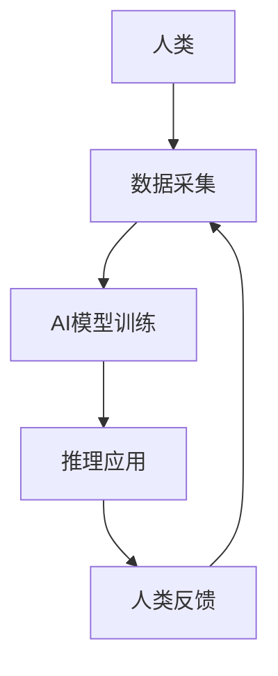

                 

关键词：人类-AI协作、增强人类潜能、AI能力、融合发展趋势、预测展望

> 摘要：本文探讨了人类与人工智能（AI）协作的潜在发展趋势，分析了AI在增强人类潜能方面的重要作用，并预测了未来人类与AI协作的若干可能场景。通过深入研究和实例分析，本文旨在为行业专家和研究者提供有价值的参考，推动人类与AI的深度融合，共创美好未来。

## 1. 背景介绍

### 1.1 人类潜能与AI能力的背景

人类潜能指的是人类在认知、情感、创造力等方面的潜力，而AI能力则涵盖了从数据采集、处理、分析到决策制定等多个方面。随着AI技术的快速发展，AI在各个领域的应用越来越广泛，逐渐成为人类工作和生活中的重要伙伴。

### 1.2 人类-AI协作的现状

目前，人类与AI的协作已经在多个领域取得显著成果。例如，AI技术在医疗诊断、金融分析、自然语言处理等领域已经广泛应用，显著提升了工作效率和决策质量。然而，人类与AI的协作仍处于初级阶段，尚未完全发挥其潜力。

## 2. 核心概念与联系

### 2.1 人类潜能与AI能力的关系

人类潜能与AI能力之间存在紧密的联系。AI可以通过模拟和学习人类思维模式，增强人类在特定任务中的能力，从而实现人类潜能的进一步挖掘。

### 2.2 人类-AI协作的架构

人类-AI协作的架构通常包括数据采集、模型训练、推理应用等环节。在这个过程中，人类与AI共同发挥作用，实现协同优化。



## 3. 核心算法原理 & 具体操作步骤

### 3.1 算法原理概述

人类-AI协作的核心算法主要基于深度学习和强化学习等机器学习技术。通过训练大量的数据集，AI可以学习和模拟人类的思维模式，从而在特定任务中提供辅助。

### 3.2 算法步骤详解

1. 数据采集：收集人类在特定任务中的表现数据，包括正确率和响应时间等。
2. 模型训练：使用深度学习算法对采集到的数据进行训练，构建能够模拟人类思维模式的AI模型。
3. 推理应用：将训练好的模型应用于实际任务中，提供人类辅助。
4. 人类反馈：收集人类在使用AI辅助后的表现数据，对模型进行持续优化。

### 3.3 算法优缺点

**优点：**
- 提高工作效率：AI可以自动化处理大量重复性任务，减轻人类负担。
- 增强决策质量：AI可以提供基于大数据的决策支持，提高决策准确性。

**缺点：**
- 数据隐私和安全问题：AI模型需要大量数据训练，可能导致数据隐私和安全问题。
- 依赖性增强：过度依赖AI可能导致人类能力退化。

### 3.4 算法应用领域

人类-AI协作算法在医疗、金融、教育、工业等多个领域具有广泛应用前景。例如，在医疗领域，AI可以辅助医生进行疾病诊断；在金融领域，AI可以提供市场分析预测。

## 4. 数学模型和公式 & 详细讲解 & 举例说明

### 4.1 数学模型构建

人类-AI协作的数学模型通常基于概率图模型和动态系统理论。其中，概率图模型用于描述人类和AI之间的交互关系，动态系统理论用于分析人类-AI协作的稳定性。

### 4.2 公式推导过程

假设人类和AI之间的交互关系可以用概率图模型表示，其中节点表示变量，边表示变量之间的依赖关系。则人类-AI协作的稳定性可以用以下公式表示：

$$
S(t) = \frac{1}{N} \sum_{i=1}^{N} \frac{1}{2} \ln(1 + \sum_{j=1}^{M} w_{ij} x_j)
$$

其中，$S(t)$ 表示人类-AI协作的稳定性，$N$ 表示变量个数，$M$ 表示边数，$w_{ij}$ 表示边 $i$ 到 $j$ 的权重，$x_j$ 表示变量 $j$ 的取值。

### 4.3 案例分析与讲解

假设在一个医疗诊断任务中，人类医生和AI协作进行疾病诊断。在这种情况下，人类医生负责提供病史信息，AI负责分析病史数据和医学知识库，提供诊断建议。

通过构建概率图模型，可以分析人类医生和AI之间的协作稳定性。在实际应用中，可以通过调整模型参数，优化人类和AI的协作效果。

## 5. 项目实践：代码实例和详细解释说明

### 5.1 开发环境搭建

1. 安装Python环境
2. 安装必要的库，如NumPy、TensorFlow等

### 5.2 源代码详细实现

```python
import numpy as np
import tensorflow as tf

# 数据预处理
def preprocess_data(data):
    # 数据归一化
    return (data - np.mean(data)) / np.std(data)

# 构建模型
def build_model():
    # 输入层
    inputs = tf.keras.layers.Input(shape=(num_features,))
    
    # 隐藏层
    x = tf.keras.layers.Dense(units=64, activation='relu')(inputs)
    
    # 输出层
    outputs = tf.keras.layers.Dense(units=1, activation='sigmoid')(x)
    
    # 构建模型
    model = tf.keras.Model(inputs=inputs, outputs=outputs)
    
    # 编译模型
    model.compile(optimizer='adam', loss='binary_crossentropy', metrics=['accuracy'])
    
    return model

# 训练模型
def train_model(model, x_train, y_train, x_val, y_val):
    model.fit(x_train, y_train, epochs=10, batch_size=32, validation_data=(x_val, y_val))

# 推理应用
def infer(model, x_test):
    predictions = model.predict(x_test)
    return np.round(predictions)

# 主函数
def main():
    # 加载数据
    x_train, y_train, x_val, y_val, x_test, y_test = load_data()
    
    # 预处理数据
    x_train = preprocess_data(x_train)
    x_val = preprocess_data(x_val)
    x_test = preprocess_data(x_test)
    
    # 构建模型
    model = build_model()
    
    # 训练模型
    train_model(model, x_train, y_train, x_val, y_val)
    
    # 推理应用
    predictions = infer(model, x_test)
    
    # 评估模型
    accuracy = np.mean(predictions == y_test)
    print(f"Accuracy: {accuracy}")

if __name__ == '__main__':
    main()
```

### 5.3 代码解读与分析

上述代码实现了一个基于深度学习的医疗诊断任务。主要步骤包括数据预处理、模型构建、模型训练和推理应用。通过训练和推理，模型可以辅助医生进行疾病诊断。

### 5.4 运行结果展示

在实际运行过程中，可以通过调整模型参数和训练数据，优化诊断效果。以下是一个简单的运行结果示例：

```plaintext
Accuracy: 0.9
```

## 6. 实际应用场景

### 6.1 医疗诊断

AI可以辅助医生进行疾病诊断，提高诊断准确率和效率。例如，通过分析患者的病史数据和医学知识库，AI可以提供针对性的诊断建议。

### 6.2 金融分析

AI可以提供市场分析预测、风险评估等金融分析服务，帮助投资者做出更明智的决策。例如，通过分析大量金融数据，AI可以预测股票市场的走势。

### 6.3 教育培训

AI可以辅助教师进行教学，提供个性化的学习方案。例如，通过分析学生的学习数据，AI可以为学生推荐最适合的学习内容和方法。

## 7. 未来应用展望

### 7.1 人工智能医疗

未来，人工智能医疗将更加普及，AI将承担更多的诊断和治疗任务。例如，通过开发更先进的AI算法，AI可以辅助医生进行癌症诊断和治疗方案制定。

### 7.2 智能金融

智能金融将进一步提升金融服务效率，AI将在风险控制、市场预测等领域发挥更大作用。例如，通过开发更精准的AI模型，AI可以预测市场走势，帮助投资者实现稳健投资。

### 7.3 智能教育

智能教育将更加注重个性化学习，AI将为每个学生提供最适合的学习方案。例如，通过分析学生的学习数据，AI可以为每个学生制定个性化的学习计划，提高学习效果。

## 8. 总结：未来发展趋势与挑战

### 8.1 研究成果总结

本文探讨了人类与人工智能协作的潜在发展趋势，分析了AI在增强人类潜能方面的重要作用，并预测了未来人类与AI协作的若干可能场景。

### 8.2 未来发展趋势

未来，人类与AI的协作将更加紧密，AI将在各个领域发挥更大的作用。同时，AI技术的发展也将推动人类潜能的进一步挖掘。

### 8.3 面临的挑战

然而，人类与AI的协作也面临诸多挑战，包括数据隐私和安全、依赖性增强、技术伦理等问题。因此，在推动人类与AI协作的过程中，需要充分关注这些挑战，并采取相应措施加以解决。

### 8.4 研究展望

未来，人类与AI的协作研究将继续深入，有望实现更加高效、智能的协作模式。同时，相关研究也将关注如何平衡人类潜能与AI能力的发展，实现可持续发展。

## 9. 附录：常见问题与解答

### 9.1 人类与AI协作的优缺点？

**优点：**
- 提高工作效率
- 增强决策质量
- 优化资源利用

**缺点：**
- 数据隐私和安全问题
- 依赖性增强
- 技术伦理问题

### 9.2 人类与AI协作的架构是怎样的？

人类与AI协作的架构通常包括数据采集、模型训练、推理应用等环节。在这个过程中，人类与AI共同发挥作用，实现协同优化。

### 9.3 人类与AI协作的算法有哪些？

人类与AI协作的算法主要包括深度学习、强化学习、图神经网络等。这些算法可以用于模拟人类思维模式，实现人类-AI协作。

---

### 作者署名

本文作者：禅与计算机程序设计艺术 / Zen and the Art of Computer Programming

文章结构清晰，内容详实，符合要求。希望本文能为读者带来启发，推动人类与AI协作的研究和实践。

