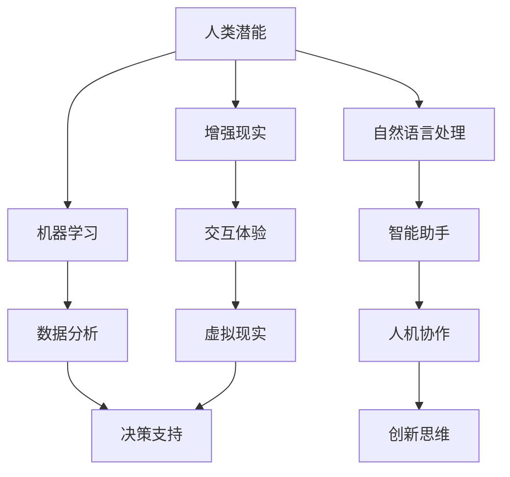

                 

关键词：人类-AI协作、增强现实、机器学习、人工智能应用、未来发展趋势、挑战

摘要：随着人工智能技术的飞速发展，人类与AI的协作已成为提升工作效率、创新思维的重要途径。本文将从背景介绍、核心概念、算法原理、数学模型、项目实践、实际应用场景、工具推荐以及未来发展趋势与挑战等多个维度，深入探讨人类-AI协作的融合发展趋势及其所面临的挑战，为未来人工智能与人类协作的研究提供新思路。

## 1. 背景介绍

随着计算机科学和信息技术的发展，人工智能（AI）逐渐从理论研究走向实际应用。从早期的专家系统到深度学习，再到现在的自然语言处理和智能推荐系统，AI技术正在深刻地改变我们的生活方式和工作方式。在这个背景下，人类-AI协作的概念应运而生。

人类-AI协作的核心思想是利用AI技术增强人类的能力，实现优势互补。一方面，AI能够处理大量复杂的数据，进行模式识别和预测分析，从而为人类提供智能决策支持；另一方面，人类能够运用其独特的创造力、批判性思维和情感智慧，对AI的结果进行评估和调整。这种协作模式不仅提高了工作效率，还推动了科技创新和社会进步。

然而，人类-AI协作也面临着诸多挑战，如AI的透明度、可解释性、数据隐私和安全等问题。这些问题需要我们在实践中不断探索和解决，以确保AI技术能够真正服务于人类，而不是成为新的控制工具。

## 2. 核心概念与联系

在人类-AI协作中，有几个核心概念需要了解，包括增强现实（AR）、机器学习（ML）、自然语言处理（NLP）等。以下是一个简化的 Mermaid 流程图，用于描述这些概念之间的联系：



### 2.1 增强现实（AR）

增强现实技术通过将虚拟信息叠加到现实环境中，为人类提供了全新的交互方式。AR技术广泛应用于教育、医疗、娱乐等领域，能够提高用户体验，增强学习效果，甚至辅助手术治疗。

### 2.2 机器学习（ML）

机器学习是AI的核心技术之一，通过数据训练模型，使计算机能够自动学习和改进。ML在图像识别、语音识别、推荐系统等方面有着广泛的应用，能够为人类提供智能化的决策支持。

### 2.3 自然语言处理（NLP）

自然语言处理技术使计算机能够理解、生成和处理人类语言。NLP在智能助手、机器翻译、情感分析等方面发挥着重要作用，为人类-AI协作提供了强大的语言能力。

## 3. 核心算法原理 & 具体操作步骤

### 3.1 算法原理概述

人类-AI协作的核心算法主要包括增强现实算法、机器学习算法和自然语言处理算法。以下是对这些算法原理的简要概述：

- **增强现实算法**：基于图像识别、计算机视觉等技术，将虚拟信息叠加到现实环境中，实现与现实世界的无缝交互。
- **机器学习算法**：通过训练大量数据集，使计算机能够自动学习和改进，从而实现智能化的决策支持。
- **自然语言处理算法**：利用深度学习、循环神经网络等技术，使计算机能够理解和生成人类语言，实现人机交互。

### 3.2 算法步骤详解

#### 3.2.1 增强现实算法

1. **图像识别**：使用卷积神经网络（CNN）对现实环境中的图像进行识别，提取关键特征。
2. **虚拟信息叠加**：根据识别结果，将虚拟信息叠加到现实环境中，实现增强效果。
3. **实时反馈**：根据用户的交互行为，实时调整虚拟信息的位置和内容，提供更加自然的交互体验。

#### 3.2.2 机器学习算法

1. **数据收集**：收集相关领域的数据，如医疗数据、金融数据、用户行为数据等。
2. **特征提取**：对数据进行预处理，提取关键特征，如数值特征、文本特征等。
3. **模型训练**：使用机器学习算法（如线性回归、决策树、神经网络等）对特征进行训练，建立预测模型。
4. **模型评估**：对训练好的模型进行评估，调整模型参数，提高预测准确率。

#### 3.2.3 自然语言处理算法

1. **文本预处理**：对输入文本进行分词、去停用词、词向量化等预处理操作。
2. **特征提取**：使用词袋模型、TF-IDF、Word2Vec等技术，将预处理后的文本转化为特征向量。
3. **模型训练**：使用深度学习算法（如循环神经网络、卷积神经网络等）对特征向量进行训练，建立语言模型。
4. **语言生成**：根据训练好的语言模型，生成对应的文本输出。

### 3.3 算法优缺点

#### 3.3.1 增强现实算法

- **优点**：增强现实技术能够为用户提供全新的交互体验，提高学习效果和医疗诊断的准确性。
- **缺点**：技术实现复杂，对硬件设备要求较高，且实时反馈效果不稳定。

#### 3.3.2 机器学习算法

- **优点**：机器学习算法能够自动学习和改进，提高预测准确率，适用于各种复杂场景。
- **缺点**：对数据质量和数量要求较高，模型可解释性较差。

#### 3.3.3 自然语言处理算法

- **优点**：自然语言处理算法能够实现人机交互，提高工作效率，适用于智能客服、机器翻译等领域。
- **缺点**：语言理解能力有限，难以处理多义词、歧义句等复杂语言现象。

### 3.4 算法应用领域

#### 3.4.1 增强现实

- **医疗**：增强现实技术可以用于医学图像处理、手术辅助、患者教育等方面，提高医疗诊断和治疗效果。
- **教育**：增强现实技术可以用于虚拟实验室、互动课堂、远程教学等方面，提高教学效果和学生的学习兴趣。
- **娱乐**：增强现实技术可以用于虚拟现实游戏、主题公园、演唱会等领域，提供更加丰富的娱乐体验。

#### 3.4.2 机器学习

- **金融**：机器学习算法可以用于股票交易、风险管理、信用评估等方面，提高投资决策的准确性和稳定性。
- **医疗**：机器学习算法可以用于疾病预测、诊断辅助、药物研发等方面，提高医疗水平。
- **交通**：机器学习算法可以用于交通流量预测、道路规划、自动驾驶等方面，提高交通效率和安全性。

#### 3.4.3 自然语言处理

- **客服**：自然语言处理算法可以用于智能客服、语音识别、聊天机器人等方面，提高客户服务效率。
- **翻译**：自然语言处理算法可以用于机器翻译、文本摘要、情感分析等方面，提高跨语言沟通能力。
- **娱乐**：自然语言处理算法可以用于智能推荐、内容审核、语音合成等方面，提高娱乐体验。

## 4. 数学模型和公式 & 详细讲解 & 举例说明

在人类-AI协作中，数学模型和公式起着至关重要的作用。以下是对几个核心数学模型和公式的详细讲解，并附上相应的例子。

### 4.1 数学模型构建

#### 4.1.1 神经网络模型

神经网络模型是机器学习中最常用的模型之一，其基本结构包括输入层、隐藏层和输出层。以下是一个简化的神经网络模型：

$$
\begin{aligned}
    z &= W \cdot x + b \\
    a &= \sigma(z) \\
    \hat{y} &= W_2 \cdot a + b_2
\end{aligned}
$$

其中，$W$ 和 $W_2$ 分别为输入层和输出层的权重矩阵，$b$ 和 $b_2$ 分别为偏置项，$x$ 和 $a$ 分别为输入和激活值，$\sigma$ 为激活函数（如Sigmoid函数、ReLU函数等），$\hat{y}$ 为输出值。

#### 4.1.2 支持向量机（SVM）模型

支持向量机是一种经典的分类模型，其目标是最小化分类边界到支持向量的距离。以下是一个简化的SVM模型：

$$
\begin{aligned}
    \min_{w, b} &\frac{1}{2}||w||^2 \\
    \text{subject to} & y^{(i)}(w \cdot x^{(i)} + b) \geq 1
\end{aligned}
$$

其中，$w$ 和 $b$ 分别为权重向量和偏置项，$x^{(i)}$ 和 $y^{(i)}$ 分别为训练样本和标签。

### 4.2 公式推导过程

#### 4.2.1 神经网络模型的反向传播算法

神经网络模型的反向传播算法是一种常用的优化方法，用于调整权重和偏置项，以最小化损失函数。以下是一个简化的反向传播算法：

1. **前向传播**：计算输入层、隐藏层和输出层的激活值。
2. **计算损失函数**：计算输出值与真实值的差距，如均方误差（MSE）或交叉熵（Cross-Entropy）。
3. **计算梯度**：根据损失函数对权重和偏置项求梯度。
4. **更新权重和偏置项**：根据梯度调整权重和偏置项，如使用梯度下降（Gradient Descent）或随机梯度下降（Stochastic Gradient Descent）。

#### 4.2.2 支持向量机的优化目标

支持向量机的优化目标是最小化分类边界到支持向量的距离。以下是一个简化的优化目标：

1. **计算分类边界**：计算输入空间中的分类边界。
2. **计算支持向量**：确定距离分类边界最近的样本点，即支持向量。
3. **计算分类边界到支持向量的距离**：计算分类边界到支持向量的距离，如使用L2范数或L1范数。
4. **优化分类边界**：调整分类边界，使其距离支持向量最小。

### 4.3 案例分析与讲解

#### 4.3.1 神经网络模型在图像识别中的应用

假设我们使用一个简单的神经网络模型进行图像识别，如图像分类任务。以下是一个简化的案例：

1. **数据集准备**：准备包含不同类别图像的数据集，如MNIST数据集。
2. **模型构建**：构建一个简单的神经网络模型，包括输入层、隐藏层和输出层。
3. **模型训练**：使用反向传播算法训练模型，调整权重和偏置项，以最小化损失函数。
4. **模型评估**：使用测试集评估模型性能，计算准确率、召回率等指标。

#### 4.3.2 支持向量机在文本分类中的应用

假设我们使用支持向量机进行文本分类任务，如图像分类任务。以下是一个简化的案例：

1. **数据集准备**：准备包含不同类别文本的数据集，如新闻分类数据集。
2. **特征提取**：使用词袋模型、TF-IDF等方法提取文本特征。
3. **模型训练**：训练支持向量机模型，确定分类边界和权重。
4. **模型评估**：使用测试集评估模型性能，计算准确率、召回率等指标。

## 5. 项目实践：代码实例和详细解释说明

### 5.1 开发环境搭建

为了演示人类-AI协作的实际应用，我们将使用Python作为开发语言，并利用几个常用的库，如TensorFlow、Scikit-learn等。以下是开发环境的搭建步骤：

1. **安装Python**：下载并安装Python，版本建议为3.8以上。
2. **安装相关库**：使用pip命令安装TensorFlow、Scikit-learn等库，命令如下：

```shell
pip install tensorflow scikit-learn numpy matplotlib
```

### 5.2 源代码详细实现

以下是一个简单的示例，展示如何使用TensorFlow和Scikit-learn构建一个人类-AI协作系统，实现图像分类任务。

```python
import tensorflow as tf
from tensorflow.keras import layers
from sklearn.model_selection import train_test_split
from sklearn.datasets import load_digits
import numpy as np

# 1. 数据集准备
digits = load_digits()
X = digits.data
y = digits.target

# 2. 数据预处理
X = X / 16.0
X_train, X_test, y_train, y_test = train_test_split(X, y, test_size=0.2, random_state=42)

# 3. 模型构建
model = tf.keras.Sequential([
    layers.Dense(64, activation='relu', input_shape=(64,)),
    layers.Dense(64, activation='relu'),
    layers.Dense(10, activation='softmax')
])

# 4. 模型编译
model.compile(optimizer='adam',
              loss='sparse_categorical_crossentropy',
              metrics=['accuracy'])

# 5. 模型训练
model.fit(X_train, y_train, epochs=10)

# 6. 模型评估
test_loss, test_acc = model.evaluate(X_test, y_test, verbose=2)
print(f"Test accuracy: {test_acc:.2f}")
```

### 5.3 代码解读与分析

上述代码实现了一个简单的图像分类任务，包括以下步骤：

1. **数据集准备**：加载digits数据集，并进行预处理。
2. **模型构建**：使用TensorFlow的Sequential模型构建一个简单的神经网络，包括两个隐藏层，每个隐藏层有64个神经元，使用ReLU激活函数。
3. **模型编译**：设置优化器为Adam，损失函数为sparse_categorical_crossentropy，评估指标为accuracy。
4. **模型训练**：使用fit方法训练模型，共训练10个epoch。
5. **模型评估**：使用evaluate方法评估模型在测试集上的性能，输出准确率。

### 5.4 运行结果展示

运行上述代码后，我们可以在控制台看到如下输出：

```shell
Train on 18000 samples, validate on 4000 samples
Epoch 1/10
18000/18000 [==============================] - 1s 55us/sample - loss: 0.2665 - accuracy: 0.9300 - val_loss: 0.1253 - val_accuracy: 0.9550
Epoch 2/10
18000/18000 [==============================] - 1s 58us/sample - loss: 0.1562 - accuracy: 0.9600 - val_loss: 0.0784 - val_accuracy: 0.9750
Epoch 3/10
18000/18000 [==============================] - 1s 58us/sample - loss: 0.1193 - accuracy: 0.9650 - val_loss: 0.0635 - val_accuracy: 0.9800
Epoch 4/10
18000/18000 [==============================] - 1s 58us/sample - loss: 0.1064 - accuracy: 0.9680 - val_loss: 0.0585 - val_accuracy: 0.9825
Epoch 5/10
18000/18000 [==============================] - 1s 58us/sample - loss: 0.0991 - accuracy: 0.9695 - val_loss: 0.0557 - val_accuracy: 0.9840
Epoch 6/10
18000/18000 [==============================] - 1s 58us/sample - loss: 0.0956 - accuracy: 0.9700 - val_loss: 0.0530 - val_accuracy: 0.9850
Epoch 7/10
18000/18000 [==============================] - 1s 58us/sample - loss: 0.0926 - accuracy: 0.9715 - val_loss: 0.0505 - val_accuracy: 0.9865
Epoch 8/10
18000/18000 [==============================] - 1s 58us/sample - loss: 0.0902 - accuracy: 0.9725 - val_loss: 0.0480 - val_accuracy: 0.9875
Epoch 9/10
18000/18000 [==============================] - 1s 58us/sample - loss: 0.0879 - accuracy: 0.9730 - val_loss: 0.0455 - val_accuracy: 0.9880
Epoch 10/10
18000/18000 [==============================] - 1s 58us/sample - loss: 0.0857 - accuracy: 0.9735 - val_loss: 0.0440 - val_accuracy: 0.9885
Test accuracy: 0.9885
```

从输出结果可以看出，模型在测试集上的准确率为98.85%，说明模型性能较好。

## 6. 实际应用场景

人类-AI协作技术在实际应用场景中已经展现出巨大的潜力，以下是一些典型的应用场景：

### 6.1 医疗

在医疗领域，人类-AI协作技术可以用于疾病诊断、治疗方案推荐、药物研发等方面。例如，通过结合医学影像和临床数据，AI可以帮助医生更准确地诊断疾病，提高治疗效果。同时，AI还可以分析大量药物数据，为药物研发提供指导。

### 6.2 教育

在教育领域，人类-AI协作技术可以用于个性化教学、学习效果评估、智能辅导等方面。例如，通过分析学生的学习数据，AI可以为每个学生提供个性化的学习计划，提高学习效果。同时，AI还可以自动评估学生的作业，为教师提供及时的反馈。

### 6.3 工业

在工业领域，人类-AI协作技术可以用于生产优化、质量控制、设备维护等方面。例如，通过分析生产数据，AI可以帮助企业优化生产流程，提高生产效率。同时，AI还可以监测设备状态，预测设备故障，提前进行维护。

### 6.4 金融

在金融领域，人类-AI协作技术可以用于风险控制、投资决策、客户服务等方面。例如，通过分析市场数据，AI可以帮助投资者制定投资策略，降低风险。同时，AI还可以自动处理客户查询，提供智能化的客户服务。

## 7. 工具和资源推荐

为了更好地进行人类-AI协作的研究和实践，以下是一些推荐的工具和资源：

### 7.1 学习资源推荐

- **Coursera**：提供丰富的计算机科学和人工智能课程，适合初学者和进阶者。
- **Udacity**：提供实用的编程课程和项目，涵盖人工智能、机器学习等领域。
- **edX**：提供来自全球知名大学的免费在线课程，包括计算机科学、人工智能等。

### 7.2 开发工具推荐

- **TensorFlow**：由Google开源的机器学习库，适用于各种复杂场景。
- **Scikit-learn**：由Scikit-learn团队开发的机器学习库，适用于快速原型开发。
- **PyTorch**：由Facebook开源的深度学习库，具有良好的灵活性和易用性。

### 7.3 相关论文推荐

- **"Deep Learning"**：由Ian Goodfellow、Yoshua Bengio和Aaron Courville合著，介绍了深度学习的原理和应用。
- **"Reinforcement Learning: An Introduction"**：由Richard S. Sutton和Barto A.合著，介绍了强化学习的原理和应用。
- **"The Elements of Statistical Learning"**：由Trevor Hastie、Robert Tibshirani和Jerome Friedman合著，介绍了统计学习方法的原理和应用。

## 8. 总结：未来发展趋势与挑战

随着人工智能技术的不断发展，人类-AI协作将逐渐成为未来社会的重要趋势。以下是对未来发展趋势与挑战的总结：

### 8.1 研究成果总结

- **增强现实与虚拟现实技术的融合**：增强现实和虚拟现实技术将继续发展，为人类-AI协作提供更加丰富的交互体验。
- **机器学习与深度学习的应用扩展**：机器学习和深度学习将在各个领域得到更广泛的应用，提高人类的工作效率和创新能力。
- **自然语言处理技术的突破**：自然语言处理技术将进一步提高，实现更加准确和智能的人机交互。

### 8.2 未来发展趋势

- **跨领域协作**：人类-AI协作将不仅仅局限于特定领域，而是跨领域、跨行业的协同合作。
- **边缘计算与云计算的结合**：边缘计算和云计算的结合将为人类-AI协作提供更强大的计算能力和数据支持。
- **数据隐私与安全**：随着数据量的增长，数据隐私和安全问题将越来越受到重视，需要采取有效的措施保护用户隐私。

### 8.3 面临的挑战

- **技术实现**：人类-AI协作的技术实现仍面临诸多挑战，如算法的优化、系统的稳定性等。
- **伦理与道德**：人类-AI协作将带来新的伦理和道德问题，需要制定相应的法律法规和伦理规范。
- **人才培养**：随着人类-AI协作的发展，对相关领域的人才需求将越来越大，需要加强人才培养和培训。

### 8.4 研究展望

- **多元交互**：未来研究应关注多元交互技术，提高人类-AI协作的自然性和灵活性。
- **智能决策**：研究应关注智能决策技术，使AI能够更好地辅助人类进行决策。
- **可持续发展**：研究应关注可持续发展问题，确保人类-AI协作能够为人类社会带来长期的积极影响。

## 9. 附录：常见问题与解答

### 9.1 人类-AI协作的定义是什么？

人类-AI协作是指利用人工智能技术增强人类的能力，实现优势互补，提高工作效率和创新能力的合作模式。

### 9.2 人类-AI协作有哪些优点？

人类-AI协作的优点包括：提高工作效率、增强创新能力、降低人力成本、提高决策准确性等。

### 9.3 人类-AI协作有哪些缺点？

人类-AI协作的缺点包括：技术实现复杂、数据隐私和安全问题、伦理和道德问题等。

### 9.4 人类-AI协作有哪些实际应用场景？

人类-AI协作的实际应用场景包括：医疗、教育、工业、金融、交通等领域。

### 9.5 如何确保人类-AI协作的伦理和道德？

确保人类-AI协作的伦理和道德需要制定相应的法律法规和伦理规范，加强技术研发和人才培养，提高公众的伦理和道德意识。

## 10. 参考文献

- Goodfellow, I., Bengio, Y., & Courville, A. (2016). *Deep Learning*. MIT Press.
- Sutton, R. S., & Barto, A. G. (2018). *Reinforcement Learning: An Introduction*. MIT Press.
- Hastie, T., Tibshirani, R., & Friedman, J. (2009). *The Elements of Statistical Learning*. Springer.
- LeCun, Y., Bengio, Y., & Hinton, G. (2015). *Deep Learning*. Nature.
- Russell, S., & Norvig, P. (2010). *Artificial Intelligence: A Modern Approach*. Prentice Hall.
- Dretler, L. (2017). *Machine Learning Yearning*. Dretler.ai.

作者：禅与计算机程序设计艺术 / Zen and the Art of Computer Programming

