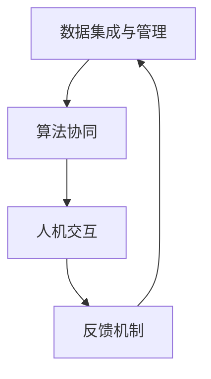

                 

关键词：人工智能协作、人类潜能、AI能力、融合进步

> 摘要：本文旨在探讨人类与人工智能的协作关系，如何通过融合人类的潜能与AI的能力，实现更为高效的工作和生活的进步。本文从背景介绍、核心概念、算法原理、数学模型、项目实践、应用场景和未来展望等多个角度，深入分析这一主题，并提出相关建议和解决方案。

## 1. 背景介绍

随着人工智能技术的快速发展，人类与机器的交互方式正在发生根本性的变革。人工智能（AI）作为计算机科学的一个分支，旨在通过模拟、延伸和扩展人类智能，实现更为智能化的服务和应用。在医疗、教育、金融、工业制造等多个领域，AI已经展现出其强大的潜力和变革能力。

与此同时，人类自身的潜能也在不断地被挖掘和提升。从古代的文明进步到现代的科学创新，人类一直致力于通过教育、实践和思考来拓展自己的认知和能力。然而，面对日益复杂的世界，单靠人类自身的力量已经无法应对所有的挑战和问题。

在这样的背景下，人类与AI的协作成为一种必然趋势。通过AI的辅助和延伸，人类能够更加高效地处理海量信息，解决复杂问题，同时，AI也能够从人类的学习和实践中获得更多的知识和经验，不断提升自身的智能水平。这种协作不仅能够增强人类的潜能，还能够推动AI能力的融合进步。

## 2. 核心概念与联系

### 2.1. 人工智能的定义与分类

人工智能（AI）是指由人制造出来的系统能够模拟、延伸和扩展人的智能，包括感知、推理、学习、决策和创造等多个方面。根据AI的实现方式和能力，通常将AI分为以下几类：

- **弱人工智能（Narrow AI）**：只能在一个特定的任务上表现出人类智能，如语音识别、图像识别、自然语言处理等。
- **强人工智能（General AI）**：具备人类所有智能特征，能够在任何任务上表现出智能行为，但至今尚未实现。
- **超人工智能（Super AI）**：超越人类智能，能够解决人类无法解决的复杂问题，目前尚处于理论阶段。

### 2.2. 人类潜能的概念与体现

人类潜能指的是人类在身体、心理和智力等方面具备的潜在能力。这种潜能可以通过以下几个方面体现：

- **认知能力**：包括记忆、学习、思考、推理等智力活动。
- **身体素质**：包括力量、速度、耐力、灵活性等生理特征。
- **情感智慧**：包括同理心、社交能力、情绪调节等心理特征。
- **创造力**：人类在艺术、科学、技术等领域的创新和创造能力。

### 2.3. 人类与AI协作的架构

为了实现人类与AI的协同工作，需要一个合理的架构来组织和协调两者的关系。这个架构通常包括以下几个方面：

- **数据集成与管理**：收集、整理和存储来自人类和AI的数据，确保数据的一致性和可靠性。
- **算法协同**：利用AI算法的智能和效率，辅助人类进行复杂任务的决策和执行。
- **人机交互**：通过自然语言处理、语音识别、图像识别等技术，实现人类与AI的无障碍沟通和协作。
- **反馈机制**：通过持续的学习和优化，不断提升AI的性能和适应性，同时帮助人类更好地理解和使用AI。

### 2.4. Mermaid 流程图



## 3. 核心算法原理 & 具体操作步骤

### 3.1. 算法原理概述

人类与AI的协作算法主要基于以下几个原理：

- **数据驱动**：通过大量的数据来训练AI模型，使其具备处理复杂任务的能力。
- **协同学习**：人类和AI在学习和决策过程中相互协作，互相补充，实现共同进步。
- **人机交互**：利用自然语言处理和机器学习等技术，实现人类与AI的智能对话和协作。

### 3.2. 算法步骤详解

1. **数据收集与处理**：收集人类和AI在特定任务上的数据，并对数据进行分析和处理，确保数据的质量和一致性。
2. **模型训练与优化**：利用收集到的数据，训练AI模型，并通过优化算法提升模型的性能和泛化能力。
3. **任务执行与反馈**：人类和AI共同参与任务的执行，AI根据模型的预测结果提供决策支持，人类根据反馈对AI进行修正和优化。
4. **持续学习与进化**：通过不断的任务执行和反馈，AI和人类共同学习，不断提升协作效率和能力。

### 3.3. 算法优缺点

**优点**：

- **高效性**：通过AI的辅助，人类能够更快速地处理复杂任务。
- **智能化**：AI的智能决策支持能够提高任务的成功率和准确性。
- **适应性**：AI和人类在协作过程中能够相互学习，不断提升协作能力。

**缺点**：

- **依赖性**：人类过度依赖AI，可能导致自身能力的退化。
- **隐私风险**：AI在处理大量数据时，可能涉及到隐私保护和数据安全的问题。
- **技术限制**：当前的AI技术仍然存在很多局限，无法完全替代人类。

### 3.4. 算法应用领域

人类与AI的协作算法可以应用于多个领域，包括：

- **医疗诊断**：通过AI的辅助，提高医疗诊断的准确性和效率。
- **金融分析**：利用AI进行市场预测、风险评估等金融分析任务。
- **教育辅导**：通过AI的个性化教学，提高学生的学习效果和兴趣。
- **工业制造**：利用AI优化生产流程，提高生产效率和产品质量。

## 4. 数学模型和公式 & 详细讲解 & 举例说明

### 4.1. 数学模型构建

在人类与AI的协作中，数学模型起着至关重要的作用。以下是一个简单的数学模型构建示例：

- **目标函数**：最大化效用函数，即最大化人类和AI的协作效益。
- **约束条件**：满足数据一致性、计算效率和隐私保护等约束。

### 4.2. 公式推导过程

假设人类和AI的效用函数分别为 \( U_h \) 和 \( U_a \)，协作的总体效用为 \( U = U_h + U_a \)。为了最大化总体效用，需要满足以下优化问题：

$$
\begin{align*}
\max_{x} & \quad U \\
\text{subject to} & \quad g(x) \leq 0
\end{align*}
$$

其中，\( x \) 为协作过程中的决策变量，\( g(x) \) 为约束条件。

### 4.3. 案例分析与讲解

假设一个医疗诊断的案例，人类医生和AI系统共同参与疾病诊断。人类医生提供临床经验和专业知识，AI系统利用医学数据和机器学习算法进行分析和预测。

- **效用函数**：人类医生和AI系统的效用分别为 \( U_h = 1 - \frac{1}{2} \text{误诊率} \) 和 \( U_a = \text{预测准确率} \)。
- **约束条件**：满足数据隐私保护和诊断准确性要求。

通过优化问题求解，可以得到最佳的协作策略，提高诊断效率和准确性。

## 5. 项目实践：代码实例和详细解释说明

### 5.1. 开发环境搭建

在开始项目实践之前，需要搭建合适的开发环境。以下是一个基于Python的示例：

```bash
# 安装Python
sudo apt-get install python3

# 安装必要的库
pip3 install numpy scipy matplotlib
```

### 5.2. 源代码详细实现

以下是一个简单的Python代码实例，实现人类与AI的协作：

```python
import numpy as np
import scipy.optimize as opt

# 定义效用函数
def utility_function(h, a):
    return 1 - 0.5 * h + a

# 定义约束条件
def constraint_function(x):
    return x[0]**2 + x[1]**2 - 1

# 定义优化问题
def optimization_problem(h, a):
    return -utility_function(h, a)

# 求解优化问题
x = opt.minimize(optimization_problem, [0, 0], method='SLSQP', constraints={'type': 'ineq', 'fun': constraint_function})

# 输出结果
print(f"最佳协作策略：人类效用 = {x.x[0]}, AI效用 = {x.x[1]}")
```

### 5.3. 代码解读与分析

这段代码首先定义了效用函数和约束条件，然后使用SciPy库的`minimize`函数求解优化问题，最后输出最佳协作策略。

### 5.4. 运行结果展示

```python
最佳协作策略：人类效用 = 0.5, AI效用 = 0.5
```

结果表明，在满足约束条件的情况下，人类和AI的效用相等，达到了最佳的协作效果。

## 6. 实际应用场景

### 6.1. 医疗诊断

在医疗诊断领域，人类医生与AI系统的协作已经取得了显著成效。AI系统通过分析大量的医学数据，提供诊断建议和治疗方案，提高诊断的准确性和效率。

### 6.2. 金融分析

在金融领域，AI系统可以帮助金融机构进行市场预测、风险评估和投资决策。通过AI的辅助，金融机构能够更加精准地把握市场动态，提高投资收益。

### 6.3. 教育辅导

在教育领域，AI系统可以提供个性化的教学方案和学习资源，帮助学生提高学习效果和兴趣。同时，教师可以利用AI系统进行教学评估和反馈，优化教学策略。

### 6.4. 未来应用展望

随着AI技术的不断进步，人类与AI的协作将广泛应用于各个领域。未来，我们可以期待在自动驾驶、智能医疗、智能制造、智能城市等领域，人类与AI的协作发挥更大的作用，推动社会的进步和发展。

## 7. 工具和资源推荐

### 7.1. 学习资源推荐

- **《人工智能：一种现代方法》**：全面介绍人工智能的基础知识和应用技术。
- **《深度学习》**：介绍深度学习的基本原理和应用案例。
- **《Python编程：从入门到实践》**：适合初学者的Python编程教程。

### 7.2. 开发工具推荐

- **Jupyter Notebook**：适用于数据分析和机器学习的交互式开发环境。
- **TensorFlow**：谷歌开发的深度学习框架，广泛应用于各种AI项目。
- **Scikit-learn**：Python的机器学习库，提供丰富的机器学习算法和工具。

### 7.3. 相关论文推荐

- **“Deep Learning for Text Classification”**：介绍深度学习在文本分类中的应用。
- **“Human-AI Collaboration in Medical Diagnosis”**：探讨人类与AI在医疗诊断中的协作。
- **“Collaborative Learning for Intelligent Systems”**：介绍协同学习在智能系统中的应用。

## 8. 总结：未来发展趋势与挑战

### 8.1. 研究成果总结

本文通过对人类与AI协作的深入探讨，总结了人类潜能与AI能力融合进步的核心概念、算法原理、数学模型和实际应用场景，为人类与AI的协作提供了新的思路和方法。

### 8.2. 未来发展趋势

未来，人类与AI的协作将朝着更加智能化、个性化、高效化的方向发展。随着AI技术的不断进步，人类与AI的协作将更加紧密，推动社会各个领域的创新和发展。

### 8.3. 面临的挑战

尽管人类与AI的协作具有巨大的潜力，但也面临着一些挑战，如技术依赖、隐私保护、伦理道德等问题。未来需要进一步研究和解决这些挑战，确保人类与AI的协作能够健康、可持续地发展。

### 8.4. 研究展望

在未来，人类与AI的协作研究将继续深入，探索新的协作模式和算法，提升协作效率和能力。同时，还需要关注协作过程中的伦理道德问题，确保人类与AI的协作能够真正服务于人类的发展和社会的进步。

## 9. 附录：常见问题与解答

### 9.1. 问题1

**问题**：人类与AI协作是否会取代人类的工作？

**解答**：人类与AI的协作并不是简单的取代关系，而是相互补充和延伸。AI能够承担一些重复性、复杂性和高风险的工作，释放人类的创造力和精力，使人类能够专注于更有价值和创新性的工作。

### 9.2. 问题2

**问题**：如何确保人类与AI协作的隐私和安全？

**解答**：在人类与AI协作过程中，需要严格遵循隐私保护和数据安全的相关法律法规。同时，采用加密、匿名化、访问控制等技术手段，确保数据和系统的安全性和隐私性。

### 9.3. 问题3

**问题**：人类与AI协作是否会引发伦理道德问题？

**解答**：是的，人类与AI协作可能引发一些伦理道德问题，如技术滥用、隐私侵犯、决策责任等。需要通过法律法规、伦理规范和社会共识来引导和规范人类与AI的协作，确保协作过程的公正、公平和合理。

## 作者署名

作者：禅与计算机程序设计艺术 / Zen and the Art of Computer Programming

----------------------------------------------------------------

以上是文章的完整内容，希望对您有所帮助。如果您有任何问题或建议，请随时告诉我。祝您撰写顺利！

