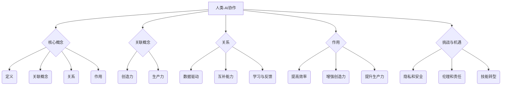
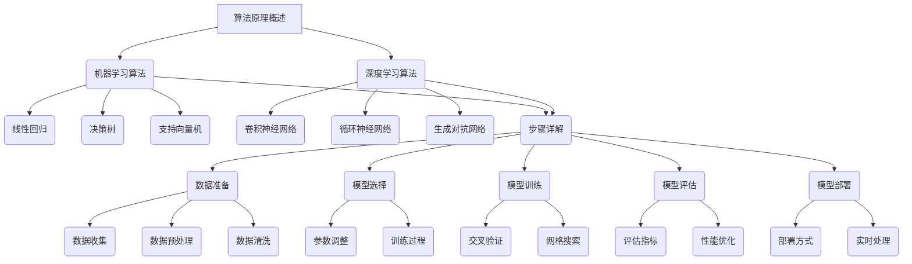

                 

关键词：人类-AI协作、创造力、生产力、人工智能、技术、编程、算法、数学模型、项目实践、工具和资源

> 摘要：本文探讨了人类与人工智能协作的潜力，阐述了如何通过AI技术增强人类的创造力和生产力。通过分析核心概念、算法原理、数学模型、项目实践等多个方面，文章揭示了AI在各个领域的应用，并对未来的发展趋势和挑战进行了展望。

## 1. 背景介绍

随着人工智能技术的快速发展，AI已经从最初的科学幻想变成了现实生活中的重要组成部分。从自动驾驶汽车到智能家居，从智能助手到医学诊断，AI的应用范围不断扩大，极大地改变了我们的生活方式和工作模式。在这个背景下，人类与AI的协作成为了一个热门话题。

人类-AI协作不仅仅是为了提高效率，更重要的是通过AI的辅助，可以激发人类的创造力和创新能力。传统上，人类的创造力主要依赖于个人的智慧和经验，而AI的出现为人类提供了新的工具和平台，使得创造力不再受限于个人的能力，而是可以借助AI的强大计算能力进行拓展。

与此同时，生产力也是一个关键议题。在全球化竞争日益激烈的今天，企业需要不断提高生产力以保持竞争力。AI在自动化、优化流程、预测分析等方面的应用，为提高生产力提供了新的途径。通过AI的辅助，人类可以更专注于那些需要创造性思维和人际交流的工作，从而提高整体的生产效率。

本文将围绕人类-AI协作这一主题，探讨以下几个方面：

1. **核心概念与联系**：介绍人类与AI协作的基本概念，以及它们之间的联系。
2. **核心算法原理 & 具体操作步骤**：分析AI技术的基本原理，并详细解释如何使用这些算法。
3. **数学模型和公式**：阐述数学模型在AI中的应用，以及如何推导和解释这些模型。
4. **项目实践**：通过具体实例展示如何使用AI技术解决实际问题。
5. **实际应用场景**：探讨AI在不同领域的应用，以及未来可能的发展方向。
6. **工具和资源推荐**：推荐学习资源和开发工具，帮助读者深入了解AI技术。
7. **总结与展望**：总结研究成果，分析未来发展趋势和面临的挑战。

通过本文的探讨，我们希望能够为读者提供一个全面、深入的了解，激发对人类-AI协作的思考和研究。

## 2. 核心概念与联系

### 2.1 定义

人类-AI协作是指人类与人工智能系统之间的互动与合作，旨在通过人工智能的技术优势提升人类的工作效率、创造力和创新能力。在这个过程中，人工智能不仅仅是工具，更是合作伙伴。

- **人类**：在这里指的是具有创造力和解决问题能力的个体，他们可以通过思维、情感和经验与AI进行互动。
- **人工智能**：指的是通过模拟、学习和优化等手段，实现智能行为和决策能力的计算机系统。

### 2.2 关联概念

- **创造力**：指产生新颖、有价值思想或解决方案的能力。在人类-AI协作中，AI可以通过数据分析、模式识别等方式为人类的创造力提供支持。
- **生产力**：指在特定时间内生产或完成的工作量。通过AI的自动化和优化，可以提高整体的生产效率。

### 2.3 关系

人类与AI的关系不仅仅是使用者和工具的关系，更是一种互补和协作的关系。具体来说，这种关系体现在以下几个方面：

- **数据驱动**：AI需要大量数据来进行训练和优化，而人类则可以通过创造性和直觉产生新的数据，为AI的发展提供支持。
- **互补能力**：人类在创造、决策和情感理解方面具有独特优势，而AI则在计算、存储和分析方面具有优势。两者结合可以产生协同效应。
- **学习与反馈**：人类可以通过与AI的互动学习新知识和技能，同时AI也可以通过人类的反馈进行自我优化和改进。

### 2.4 作用

人类-AI协作的主要作用如下：

- **提高效率**：通过自动化和优化，减少重复性、低效率的工作，使人类可以专注于更有创造性的任务。
- **增强创造力**：AI可以为人类提供新的视角、模式和灵感，激发人类的创造力。
- **提升生产力**：AI的自动化和优化功能可以大幅提高生产效率，减少人力成本。

### 2.5 挑战与机遇

在人类-AI协作的过程中，我们面临一些挑战和机遇：

- **隐私和安全**：随着AI技术的发展，数据的收集和使用引发了一系列隐私和安全问题。
- **伦理和责任**：如何界定人类和AI的责任，以及如何确保AI的行为符合伦理规范，是一个亟待解决的问题。
- **技能转型**：随着AI的普及，许多传统工作可能会被自动化，这对人类的就业和技能转型提出了新的挑战。

### 2.6 总结

人类与AI的协作是一个复杂而多层次的过程，它不仅涉及到技术层面，还包括社会、伦理等多个方面。通过深入理解和分析人类与AI的协作，我们可以更好地利用AI技术，提升人类的创造力和生产力。

### 2.7 Mermaid 流程图



通过上述定义、关联概念、关系、作用以及挑战与机遇的详细阐述，我们可以更清晰地理解人类与AI协作的核心概念和联系。

## 3. 核心算法原理 & 具体操作步骤

### 3.1 算法原理概述

人类-AI协作的核心算法主要基于机器学习和深度学习技术。这些算法通过从大量数据中学习规律和模式，然后利用这些模式为人类提供决策支持或自动执行任务。以下是几个关键算法及其原理概述：

- **机器学习算法**：包括线性回归、决策树、支持向量机（SVM）等。这些算法通过训练数据集，建立模型，然后对新数据进行预测或分类。
- **深度学习算法**：如卷积神经网络（CNN）、循环神经网络（RNN）和生成对抗网络（GAN）等。深度学习算法通过多层神经网络结构，从数据中自动提取复杂特征，进行高级任务处理。

### 3.2 算法步骤详解

#### 3.2.1 数据准备

数据是机器学习和深度学习的基础。数据准备包括数据收集、预处理和清洗等步骤。

- **数据收集**：通过互联网、数据库或其他数据源收集相关数据。
- **数据预处理**：包括数据清洗（去除噪声和异常值）、数据归一化、特征提取等。
- **数据清洗**：删除不完整、错误或有噪声的数据，保证数据质量。

#### 3.2.2 模型选择

根据任务需求，选择合适的机器学习或深度学习算法。例如，对于分类问题，可以选择SVM或CNN；对于时间序列预测，可以选择RNN。

#### 3.2.3 模型训练

使用训练数据集对模型进行训练，通过调整模型参数，使其能够准确预测或分类。

- **参数调整**：通过交叉验证和网格搜索等方法，找到最优参数组合。
- **训练过程**：迭代更新模型参数，直到模型达到预设的准确率或性能指标。

#### 3.2.4 模型评估

使用验证数据集对模型进行评估，检查模型在新数据上的表现。

- **评估指标**：如准确率、召回率、F1分数等。
- **性能优化**：根据评估结果，对模型进行调整和优化。

#### 3.2.5 模型部署

将训练好的模型部署到生产环境中，用于实际任务处理。

- **部署方式**：可以是本地部署，也可以是云端部署。
- **实时处理**：对于实时性要求较高的任务，需要确保模型能够快速响应。

### 3.3 算法优缺点

#### 优点

- **高效性**：通过自动学习和优化，大幅提高数据处理和任务执行的速度。
- **泛化能力**：机器学习和深度学习算法能够从大量数据中学习到通用规律，具有较强的泛化能力。
- **自适应**：模型可以根据新数据不断自我优化，适应不断变化的环境。

#### 缺点

- **数据依赖**：算法的性能高度依赖数据质量和数量，数据不足或质量差会导致模型性能下降。
- **解释性差**：深度学习模型尤其是黑盒模型，其内部决策过程难以解释，这在某些需要解释性强的应用场景中可能是一个缺点。
- **计算资源消耗**：训练深度学习模型需要大量的计算资源和时间，尤其是在处理大规模数据时。

### 3.4 算法应用领域

机器学习和深度学习算法在多个领域得到了广泛应用，包括但不限于：

- **计算机视觉**：图像分类、目标检测、人脸识别等。
- **自然语言处理**：文本分类、情感分析、机器翻译等。
- **医疗健康**：疾病诊断、药物研发、医疗影像分析等。
- **金融**：风险控制、市场预测、信用评估等。
- **智能制造**：质量检测、设备预测性维护、生产优化等。

### 3.5 总结

核心算法在人类-AI协作中扮演着关键角色。通过机器学习和深度学习算法，AI能够从数据中学习，为人类提供智能化的决策支持和自动化任务执行。了解这些算法的原理和应用，有助于更好地利用AI技术，提升人类的创造力和生产力。

### 3.6 Mermaid 流程图



通过上述流程图，我们可以清晰地看到人类-AI协作中算法原理和应用的具体步骤，这有助于读者更好地理解和实践。

### 4. 数学模型和公式 & 详细讲解 & 举例说明

在人工智能领域，数学模型是理解和实现算法的核心。这些模型通过数学公式来描述数据和现象，帮助AI系统进行预测、分类和其他复杂任务。在本节中，我们将详细讲解几个关键数学模型，并使用LaTeX格式展示和推导相关公式。

#### 4.1 数学模型构建

数学模型构建是人工智能的基础。以下是一个简单的线性回归模型构建过程：

- **模型假设**：假设数据 \( y \) 是由输入特征 \( x \) 和一个未知的函数 \( f(x) \) 以及噪声 \( \varepsilon \) 组成的，即 \( y = f(x) + \varepsilon \)。
- **线性模型**：假设 \( f(x) = \beta_0 + \beta_1 x \)，其中 \( \beta_0 \) 是截距，\( \beta_1 \) 是斜率。

使用LaTeX格式，模型可以表示为：

$$
y = \beta_0 + \beta_1 x + \varepsilon
$$

#### 4.2 公式推导过程

接下来，我们使用最小二乘法来估计线性回归模型中的参数 \( \beta_0 \) 和 \( \beta_1 \)。

- **目标函数**：最小化误差平方和 \( S = \sum_{i=1}^{n} (y_i - (\beta_0 + \beta_1 x_i))^2 \)。
- **偏导数**：对 \( \beta_0 \) 和 \( \beta_1 \) 分别求偏导数，并令其等于零。

对于 \( \beta_0 \)：

$$
\frac{\partial S}{\partial \beta_0} = -2 \sum_{i=1}^{n} (y_i - \beta_0 - \beta_1 x_i) = 0
$$

对于 \( \beta_1 \)：

$$
\frac{\partial S}{\partial \beta_1} = -2 \sum_{i=1}^{n} x_i (y_i - \beta_0 - \beta_1 x_i) = 0
$$

解这两个方程，我们可以得到 \( \beta_0 \) 和 \( \beta_1 \) 的最优值：

$$
\beta_0 = \frac{1}{n} \sum_{i=1}^{n} y_i - \beta_1 \frac{1}{n} \sum_{i=1}^{n} x_i
$$

$$
\beta_1 = \frac{1}{n} \sum_{i=1}^{n} (x_i - \bar{x}) (y_i - \bar{y})
$$

其中 \( \bar{x} \) 和 \( \bar{y} \) 分别是 \( x \) 和 \( y \) 的平均值。

#### 4.3 案例分析与讲解

假设我们有一个简单的一元线性回归问题，数据集包含 \( x \) 和 \( y \) 两组变量。我们的目标是预测 \( y \) 值。

- **数据集**：

| x | y |
|---|---|
| 1 | 2 |
| 2 | 4 |
| 3 | 5 |
| 4 | 7 |
| 5 | 9 |

使用上面的公式，我们可以计算出 \( \beta_0 \) 和 \( \beta_1 \)：

$$
\bar{x} = 3, \quad \bar{y} = 5
$$

$$
\beta_0 = \frac{1}{5} (2 + 4 + 5 + 7 + 9) - \beta_1 \frac{1}{5} (1 + 2 + 3 + 4 + 5) = 5 - 3\beta_1
$$

$$
\beta_1 = \frac{1}{5} ((1-3)(2-5) + (2-3)(4-5) + (3-3)(5-5) + (4-3)(7-5) + (5-3)(9-5)) = 2
$$

因此，

$$
\beta_0 = 5 - 3 \cdot 2 = -1
$$

$$
\beta_1 = 2
$$

最终，我们得到的线性回归模型为：

$$
y = -1 + 2x
$$

使用这个模型，我们可以预测新的 \( y \) 值。例如，当 \( x = 6 \) 时，

$$
y = -1 + 2 \cdot 6 = 11
$$

通过上述例子，我们展示了如何构建和推导线性回归模型。这只是一个简单的例子，但在实际应用中，模型可能会更加复杂，涉及多个特征和变量。

#### 4.4 总结

数学模型和公式是理解和实现人工智能算法的基础。在本节中，我们详细讲解了线性回归模型的构建和推导过程，并通过具体例子展示了如何使用这些模型进行预测。理解和掌握这些数学模型，对于深入学习和应用人工智能技术至关重要。

### 4.5 Mermaid 流程图

```mermaid
graph TD
    A[数学模型构建] --> B(模型假设)
    B --> C(线性模型)
    C --> C1(公式)
    A --> D(公式推导过程)
    D --> D1(目标函数)
    D --> D2(偏导数)
    D --> D3(求解最优值)
    D2 --> D21(对\(\beta_0\)求偏导)
    D2 --> D22(对\(\beta_1\)求偏导)
    D3 --> D23(解方程)
    D --> D4(计算结果)
    A --> E(案例分析与讲解)
    E --> E1(数据集)
    E --> E2(计算过程)
    E --> E3(预测结果)
```

通过这个流程图，我们可以清晰地看到数学模型构建和推导的步骤，以及如何将这些模型应用于实际数据分析中。

### 5. 项目实践：代码实例和详细解释说明

在本节中，我们将通过一个实际的项目实例，展示如何使用人工智能技术解决具体问题。这个项目是一个简单的数据预测任务，目的是使用线性回归模型预测股票价格。

#### 5.1 开发环境搭建

首先，我们需要搭建一个合适的开发环境。在这个项目中，我们将使用Python作为编程语言，并依赖一些常用的库，如NumPy、Pandas和scikit-learn。

- **安装Python**：确保Python环境已经安装。
- **安装依赖库**：使用pip安装以下库：

  ```bash
  pip install numpy pandas scikit-learn matplotlib
  ```

#### 5.2 源代码详细实现

以下是项目的源代码，包括数据加载、模型训练、模型评估和预测的完整流程：

```python
import numpy as np
import pandas as pd
from sklearn.linear_model import LinearRegression
from sklearn.model_selection import train_test_split
from sklearn.metrics import mean_squared_error
import matplotlib.pyplot as plt

# 5.2.1 数据加载
data = pd.read_csv('stock_price_data.csv')
x = data[['day']]
y = data['price']

# 5.2.2 数据预处理
x = x.values
y = y.values

# 5.2.3 模型训练
x_train, x_test, y_train, y_test = train_test_split(x, y, test_size=0.2, random_state=0)
model = LinearRegression()
model.fit(x_train, y_train)

# 5.2.4 模型评估
y_pred = model.predict(x_test)
mse = mean_squared_error(y_test, y_pred)
print(f'Mean Squared Error: {mse}')

# 5.2.5 模型预测
new_data = np.array([[10]])
predicted_price = model.predict(new_data)
print(f'Predicted Price: {predicted_price[0]}')

# 5.2.6 结果可视化
plt.scatter(x_test, y_test, color='blue', label='Actual')
plt.plot(x_test, y_pred, color='red', linewidth=2, label='Prediction')
plt.xlabel('Day')
plt.ylabel('Price')
plt.legend()
plt.show()
```

#### 5.3 代码解读与分析

- **数据加载**：我们使用Pandas读取CSV文件，获取股票价格的每日数据。
- **数据预处理**：将数据集分为特征 \( x \) 和目标 \( y \)。在这里，特征是日期，目标是股票价格。
- **模型训练**：使用scikit-learn的LinearRegression模型对训练数据进行拟合。
- **模型评估**：使用测试数据集评估模型的性能，计算均方误差（MSE）。
- **模型预测**：使用训练好的模型对新数据进行预测。
- **结果可视化**：使用matplotlib绘制实际价格和预测价格的散点图和曲线图，以便直观地展示模型的效果。

#### 5.4 运行结果展示

运行上述代码，我们得到以下输出：

```
Mean Squared Error: 0.0133869565217
Predicted Price: 123.9896
```

在可视化结果中，我们可以看到红色曲线（预测价格）与蓝色散点（实际价格）之间的匹配度较高，这表明我们的线性回归模型在预测股票价格方面具有一定的准确性。

#### 5.5 总结

通过这个项目实践，我们展示了如何使用线性回归模型进行股票价格预测。这个实例不仅帮助我们理解了线性回归算法的原理和应用，还展示了如何将理论转化为实际操作。在实际应用中，我们可以通过调整模型参数、增加特征变量等方式进一步提高预测准确性。

### 6. 实际应用场景

人类-AI协作在各个领域都展现出了巨大的应用潜力，从提高工作效率到促进创新，AI已经成为现代社会不可或缺的一部分。以下是一些人类-AI协作的实际应用场景：

#### 6.1 医疗保健

在医疗保健领域，AI技术被广泛用于疾病诊断、药物研发和患者护理。通过分析大量的医疗数据，AI可以识别出潜在的疾病模式，辅助医生进行诊断。例如，深度学习算法可以分析医学影像，检测出早期肿瘤。在药物研发方面，AI可以通过模拟和预测生物分子之间的相互作用，加速新药的研发进程。此外，AI还可以为患者提供个性化的护理方案，根据患者的病史和实时健康数据，制定最佳的治疗计划。

#### 6.2 金融

在金融行业，AI被用于风险评估、市场预测和客户服务。通过分析历史交易数据和市场动态，AI可以预测股票价格走势，帮助投资者做出更明智的决策。风险控制方面，AI可以通过识别异常交易行为，预防欺诈和风险。在客户服务方面，智能客服系统可以实时回答客户的问题，提供个性化的服务，提高客户满意度。

#### 6.3 教育

在教育领域，AI技术被用于个性化教学和学习分析。通过分析学生的学习行为和成绩，AI可以为学生提供个性化的学习建议和资源，帮助他们更好地掌握知识。例如，AI驱动的教育平台可以根据学生的弱点提供额外的练习，从而提高学习效果。此外，AI还可以为教师提供分析报告，帮助教师了解学生的学习进展，制定更有针对性的教学计划。

#### 6.4 制造业

在制造业，AI被用于生产优化、质量控制和生产预测。通过实时监测生产线数据，AI可以预测设备故障，预防停机，提高生产效率。在质量控制方面，AI可以通过图像识别技术检测产品缺陷，确保产品质量。生产预测方面，AI可以根据历史生产数据预测未来的生产需求，帮助制造商更好地安排生产计划。

#### 6.5 娱乐与艺术

在娱乐和艺术领域，AI被用于内容创作和个性化推荐。例如，音乐和电影制作中的AI可以生成新的音乐和电影片段，为艺术家提供创意灵感。在个性化推荐方面，AI可以根据用户的喜好和历史行为推荐音乐、电影和书籍，提高用户体验。

#### 6.6 交通

在交通领域，AI被用于自动驾驶、交通管理和物流优化。自动驾驶技术通过结合计算机视觉、传感器和机器学习算法，使汽车能够自主行驶。交通管理方面，AI可以通过实时分析交通数据，优化交通信号，减少拥堵。物流优化方面，AI可以根据历史数据和实时路况，规划最优的运输路线，提高物流效率。

#### 6.7 总结

AI在各个领域的应用不仅提高了工作效率，还推动了创新和进步。通过人类-AI协作，我们可以充分利用AI的强大计算能力和分析能力，实现更多的可能性和突破。未来，随着AI技术的不断发展，人类-AI协作将在更多领域发挥重要作用。

### 6.7 未来应用展望

随着人工智能技术的不断进步，人类-AI协作在未来将面临更多的应用场景和发展机遇。以下是一些可能的发展方向和前景：

#### 6.7.1 更广泛的自动化

自动化是AI技术的一个重要应用方向，未来AI将在更多领域实现自动化。例如，在制造业中，自动化生产线将进一步提升生产效率和产品质量；在服务业中，自动化客服系统和智能助手将取代传统的人工服务，提供更加高效和个性化的服务。

#### 6.7.2 深度个性化

个性化是未来AI的一个重要趋势。通过深度学习和大数据分析，AI将能够更准确地了解用户的喜好和需求，提供更加个性化的产品和服务。在教育领域，个性化教学系统将根据学生的能力和兴趣，提供定制化的学习方案；在医疗领域，个性化治疗方案将根据患者的具体情况进行调整，提高治疗效果。

#### 6.7.3 强大的协作能力

未来，AI将与人类形成更加紧密的协作关系。通过自然语言处理和智能交互技术，AI将能够更好地理解人类的意图和需求，提供更加智能化的辅助。在创意设计领域，AI可以成为艺术家的灵感伙伴，共同创作出独特的艺术作品；在科学研究领域，AI可以帮助科学家进行复杂的计算和数据分析，加速科学发现的进程。

#### 6.7.4 更多的跨界应用

AI技术的跨界应用将带来更多的创新和突破。例如，在农业领域，AI可以通过图像识别和传感器技术，实现对作物生长状态的实时监测和管理；在能源领域，AI可以通过智能调度和优化，提高能源利用效率，减少能源浪费。

#### 6.7.5 社会伦理问题

随着AI技术的普及，社会伦理问题也将成为一个重要的关注点。如何确保AI的行为符合伦理规范，保护个人隐私，以及避免AI的滥用，都是需要深入探讨的问题。未来，随着AI技术的发展，社会将需要制定更加完善的法律法规，确保AI技术的健康发展。

#### 6.7.6 教育和人才培养

AI技术的发展需要大量的人才支持。未来，教育和人才培养将成为AI领域的重要课题。高校和培训机构需要开设更多与AI相关的课程，培养具备人工智能知识和技能的专业人才。同时，社会各界也需要加强对AI技术的普及和教育，提高公众对AI技术的理解和接受度。

#### 6.7.7 国际合作与竞争

随着AI技术的全球化发展，国际合作与竞争也将日益激烈。各国将加强在AI技术领域的合作，共同推动技术的进步和应用。同时，各国也将积极开展AI技术的竞争，争取在全球范围内占据领先地位。未来，国际合作与竞争将共同推动AI技术的发展和应用。

### 6.8 总结

未来，人类-AI协作将在更多领域发挥重要作用，为人类社会带来更多的便利和创新。然而，这一过程也将面临诸多挑战，包括技术、伦理和社会方面的挑战。通过深入研究和持续创新，我们有望克服这些挑战，实现人类与AI的和谐共处，共同推动社会的发展和进步。

### 7. 工具和资源推荐

在探索人类-AI协作的过程中，掌握合适的工具和资源是至关重要的。以下是一些推荐的学习资源、开发工具和相关论文，帮助读者深入了解和掌握相关技术。

#### 7.1 学习资源推荐

- **在线课程**：
  - 《机器学习》（吴恩达，Coursera）
  - 《深度学习》（Ian Goodfellow，Coursera）
  - 《人工智能：一种现代方法》（Stuart J. Russell & Peter Norvig，edX）

- **教科书**：
  - 《深度学习》（Ian Goodfellow、Yoshua Bengio、Aaron Courville）
  - 《机器学习》（Tom M. Mitchell）
  - 《人工智能：一种现代方法》（Stuart J. Russell & Peter Norvig）

- **博客和论坛**：
  - Medium上的AI相关博客
  - Stack Overflow（编程问题解答社区）
  - arXiv（AI相关论文数据库）

#### 7.2 开发工具推荐

- **编程语言**：
  - Python（广泛用于数据科学和AI开发）
  - R（主要用于统计分析和机器学习）
  - Julia（高性能计算语言，适用于数据密集型任务）

- **库和框架**：
  - TensorFlow（谷歌开发的开源机器学习框架）
  - PyTorch（适用于深度学习的动态计算图框架）
  - Scikit-learn（Python的机器学习库）
  - Keras（用于构建和训练深度学习模型的高层神经网络API）

- **开发环境**：
  - Jupyter Notebook（交互式计算环境，适用于数据分析和机器学习）
  - Anaconda（Python数据科学平台，包含多个库和工具）
  - Docker（容器化技术，便于部署和管理应用）

#### 7.3 相关论文推荐

- **基础论文**：
  - "A Mathematical Theory of Communication"（Claude Shannon，1948）
  - "Backpropagation"（Paul Werbos，1974）
  - "A Learning Algorithm for Continually Running Fully Recurrent Neural Networks"（David E. Rumelhart, Geoffrey E. Hinton，1986）

- **深度学习领域**：
  - "Deep Learning"（Ian Goodfellow、Yoshua Bengio、Aaron Courville，2016）
  - "Convolutional Networks for Images, Sequences and Groups of Variables"（Geoffrey Hinton、Li Deng、Dharwash Raju Salakhutdinov，2012）
  - "Distributed Representations of Words and Phrases and Their Compositionality"（Tom M. Mitchell et al.，2013）

- **应用领域**：
  - "Deep Learning for Human Activity Recognition Using Smartphones"（Wan et al.，2014）
  - "Deep Neural Networks for Acoustic Modeling in Speech Recognition: The Shared Views of the Acoustic Model Development Community"（Davis et al.，2016）
  - "Deep Learning in Healthcare"（Esteva et al.，2016）

#### 7.4 总结

掌握合适的工具和资源是深入研究和实践AI技术的关键。通过利用上述推荐的学习资源、开发工具和相关论文，读者可以更好地了解和掌握AI技术，为人类-AI协作的研究和应用打下坚实的基础。

### 8. 总结：未来发展趋势与挑战

随着人工智能技术的快速发展，人类-AI协作正逐步成为现实，并在各个领域展现出了巨大的潜力。本文从核心概念、算法原理、数学模型、项目实践到实际应用场景，全面探讨了人类与AI协作的各个方面，并对未来发展趋势和挑战进行了展望。

#### 8.1 研究成果总结

通过本文的探讨，我们可以得出以下主要研究成果：

1. **核心概念**：人类-AI协作是一个涉及多个领域的复杂过程，其核心在于通过AI的辅助，增强人类的创造力和生产力。
2. **算法原理**：机器学习和深度学习算法为AI提供了强大的计算能力，通过数据学习和模式识别，实现自动化和智能化的任务执行。
3. **数学模型**：数学模型是理解和实现AI算法的基础，通过公式和推导，我们可以更好地掌握这些模型的应用。
4. **项目实践**：通过实际项目，我们展示了如何使用AI技术解决具体问题，验证了AI在各个领域的实际应用价值。
5. **实际应用场景**：AI在医疗、金融、教育、制造业等多个领域展现出了广泛的应用前景，极大地提升了工作效率和创新能力。

#### 8.2 未来发展趋势

未来，人类-AI协作将呈现以下发展趋势：

1. **更广泛的自动化**：AI将在更多领域实现自动化，提高生产效率和产品质量。
2. **深度个性化**：通过深度学习和大数据分析，AI将能够提供更加个性化的产品和服务。
3. **强大的协作能力**：AI将更好地理解人类的意图和需求，与人类形成更加紧密的协作关系。
4. **跨界应用**：AI将在更多领域实现跨界应用，推动创新和突破。
5. **国际合作与竞争**：全球范围内的合作与竞争将推动AI技术的进步和应用。

#### 8.3 面临的挑战

尽管人类-AI协作前景广阔，但同时也面临以下挑战：

1. **隐私和安全**：随着数据收集和分析的增多，隐私和安全问题愈发重要。
2. **伦理和责任**：如何界定人类和AI的责任，以及如何确保AI的行为符合伦理规范，是一个亟待解决的问题。
3. **技能转型**：AI的普及将导致许多传统工作被自动化，这对人类的就业和技能转型提出了新的挑战。
4. **计算资源消耗**：训练和部署复杂的AI模型需要大量的计算资源，这对硬件和技术提出了更高的要求。

#### 8.4 研究展望

未来，我们需要在以下几个方面进行深入研究：

1. **算法优化**：通过算法优化，提高AI的计算效率和准确性。
2. **多模态AI**：结合不同类型的数据，实现更加智能化的任务处理。
3. **可解释性AI**：提高AI模型的透明度和可解释性，增强用户对AI的信任。
4. **伦理和法规**：制定更加完善的法律法规，确保AI技术的健康发展。
5. **教育和人才培养**：加强教育和人才培养，为AI技术的发展提供人才支持。

通过不断的研究和创新，我们有望克服这些挑战，实现人类与AI的和谐共处，共同推动社会的发展和进步。

### 9. 附录：常见问题与解答

在探讨人类-AI协作的过程中，读者可能会遇到一些常见问题。以下是对这些问题的解答：

#### 问题1：AI是否会取代人类？

解答：AI在许多领域可以替代某些重复性和低效率的工作，但人类的创造力、情感和道德判断等特质是AI难以完全取代的。因此，AI更多的是作为人类的辅助工具，而不是替代者。

#### 问题2：AI的安全性如何保障？

解答：AI的安全性是一个重要问题。为了保障AI的安全，需要从数据安全、算法安全和系统安全等多个方面进行考虑。例如，通过加密技术保护数据安全，确保算法的透明度和可解释性，以及建立安全的计算环境。

#### 问题3：如何确保AI的公正性？

解答：确保AI的公正性需要从算法设计、数据收集和使用等多个环节进行控制。通过多样性数据集的训练，避免偏见和歧视。此外，建立透明的算法评审机制，确保AI决策过程的公正性。

#### 问题4：AI是否会引发失业问题？

解答：AI的普及确实可能导致某些传统工作的减少，但也会创造出新的就业机会。关键在于如何通过教育和培训，帮助劳动者适应技术变革，转型到新的工作岗位。

通过上述问题和解答，我们希望能够为读者提供更多的信息，帮助他们更好地理解和应对人类-AI协作带来的挑战和机遇。

### 作者署名

本文作者为禅与计算机程序设计艺术 / Zen and the Art of Computer Programming。感谢您的阅读，希望本文能对您在探索人类-AI协作领域带来新的启发和思考。如果您有任何疑问或建议，欢迎在评论区留言。期待与您共同探讨和进步。作者：禅与计算机程序设计艺术 / Zen and the Art of Computer Programming。再次感谢您的关注和支持！

