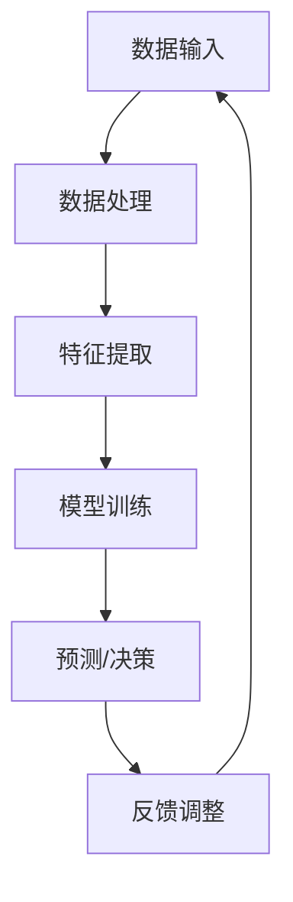

                 

在当今科技飞速发展的时代，人工智能（AI）已经成为推动社会进步的重要力量。然而，面对日益复杂的现实问题，单凭人类的智慧和AI的算法往往无法单独解决。人类与AI的合作成为了解决这些复杂问题的必然选择。本文将探讨人类与AI如何协同工作，共同解决复杂问题，并展望未来的发展趋势与挑战。

## 文章关键词

人工智能，协作，复杂问题，解决策略，技术发展，未来展望。

## 文章摘要

本文首先介绍了人类与AI合作解决复杂问题的背景和重要性。接着，我们探讨了AI的核心概念与联系，以及如何使用逻辑清晰、结构紧凑的算法原理来指导实践。通过具体的项目实践，我们展示了代码实例和详细解释。最后，文章讨论了实际应用场景，并提出了未来应用展望和工具资源推荐。

### 1. 背景介绍

在过去的几十年里，人工智能的发展取得了惊人的进展。从最初的专家系统到深度学习，AI技术在图像识别、自然语言处理、自动驾驶等领域取得了显著的成果。然而，随着问题的复杂度不断增加，单靠人类的智慧和传统的AI技术已经无法应对。例如，医疗领域的复杂疾病诊断、金融领域的风险管理、环境科学的生态模型预测等，都需要更高级别的智能和更深入的协作。

人类与AI的合作不仅能够弥补彼此的不足，还能实现优势互补。人类具备创造力、情感和直觉，能够在复杂的环境中做出决策；而AI则具有强大的计算能力和数据分析能力，能够处理大量数据并发现隐藏的模式。两者结合，可以形成一个更强大的系统，共同解决复杂问题。

### 2. 核心概念与联系

要实现人类与AI的协同工作，我们需要先了解AI的核心概念与联系。以下是一个简化的Mermaid流程图，描述了AI系统的主要组成部分：



- **数据输入**：AI系统首先接收外部数据，这些数据可以是结构化的（如数据库中的记录）或非结构化的（如图像、文本等）。
- **数据处理**：数据需要进行预处理，包括清洗、归一化等，以提高数据质量。
- **特征提取**：从预处理后的数据中提取有用的特征，这些特征将用于训练模型。
- **模型训练**：使用特征和数据来训练模型，模型可以是监督学习、无监督学习或强化学习等。
- **预测/决策**：训练好的模型用于预测或决策，为实际问题提供解决方案。
- **反馈调整**：根据实际效果对模型进行调整，以提高预测准确性。

这个流程图展示了AI系统是如何从数据输入到预测输出，并且如何通过反馈进行自我调整的。在这个过程中，人类可以扮演多个角色，如数据标注、模型调参、解释模型决策等。

### 3. 核心算法原理 & 具体操作步骤

在了解了AI系统的基本流程后，我们需要深入探讨核心算法原理，并给出具体的操作步骤。

#### 3.1 算法原理概述

以深度学习为例，它是一种基于多层神经网络的学习方法。神经网络的每个节点（或神经元）都可以看作一个简单的计算单元，通过加权连接和激活函数来实现复杂的功能。

深度学习的核心原理包括：

- **前向传播**：将输入数据通过网络的各个层进行传递，每个层都对输入进行变换，最终得到输出。
- **反向传播**：计算输出误差，并将其反向传播回网络的各个层，根据误差调整每个神经元的权重。
- **优化算法**：如梯度下降、随机梯度下降、Adam优化器等，用于调整网络参数，最小化误差。

#### 3.2 算法步骤详解

以下是一个深度学习算法的基本步骤：

1. **数据集准备**：收集并准备训练数据集和测试数据集。
2. **数据预处理**：对数据进行清洗、归一化等处理，以提高数据质量。
3. **模型设计**：设计神经网络结构，包括层数、每层的神经元数量、激活函数等。
4. **模型训练**：使用训练数据集训练模型，通过前向传播和反向传播调整网络参数。
5. **模型评估**：使用测试数据集评估模型性能，如准确率、召回率等。
6. **模型优化**：根据评估结果调整模型参数，以提高性能。

#### 3.3 算法优缺点

深度学习具有以下优点：

- **强大的建模能力**：能够处理复杂的非线性关系。
- **自动特征提取**：不需要手动设计特征，提高了算法的通用性。

但深度学习也存在一些缺点：

- **对数据依赖性强**：需要大量的训练数据。
- **计算资源消耗大**：训练过程需要大量的计算资源。
- **模型解释性差**：难以解释模型的决策过程。

#### 3.4 算法应用领域

深度学习在以下领域有广泛应用：

- **图像识别**：如人脸识别、物体检测等。
- **自然语言处理**：如机器翻译、情感分析等。
- **语音识别**：如语音助手、语音合成等。
- **自动驾驶**：用于环境感知、路径规划等。

### 4. 数学模型和公式 & 详细讲解 & 举例说明

在深度学习中，数学模型和公式是核心组成部分。以下是一个简化的数学模型，用于描述神经网络的前向传播过程。

#### 4.1 数学模型构建

假设我们有一个简单的神经网络，包括输入层、隐藏层和输出层。设 $x$ 为输入向量，$W$ 为权重矩阵，$a$ 为激活函数，$z$ 为隐藏层输出，$y$ 为输出层输出。则神经网络的前向传播可以表示为：

$$
z = Wx + b \\
y = a(z)
$$

其中，$b$ 为偏置项。

#### 4.2 公式推导过程

为了求解 $y$，我们首先需要求解 $z$。根据链式法则，我们有：

$$
\frac{\partial y}{\partial z} = \frac{\partial a(z)}{\partial z} = a'(z)
$$

然后，我们求解 $z$ 对 $x$ 的偏导数：

$$
\frac{\partial z}{\partial x} = \frac{\partial (Wx + b)}{\partial x} = W
$$

根据链式法则，我们有：

$$
\frac{\partial y}{\partial x} = \frac{\partial y}{\partial z} \cdot \frac{\partial z}{\partial x} = a'(z) \cdot W
$$

因此，我们可以通过反向传播计算 $y$ 对 $x$ 的偏导数。

#### 4.3 案例分析与讲解

假设我们有一个简单的问题：预测房价。给定一个房屋的属性（如面积、位置、年代等），我们需要预测其价格。以下是一个简化的数学模型：

$$
y = W_1x_1 + W_2x_2 + b \\
a(y) = \frac{1}{1 + e^{-y}}
$$

其中，$x_1$ 和 $x_2$ 分别为房屋面积和位置，$y$ 为预测价格，$W_1$ 和 $W_2$ 为权重，$b$ 为偏置。

首先，我们对训练数据进行预处理，包括归一化和标准化等。然后，设计一个简单的神经网络，包括一个输入层、一个隐藏层和一个输出层。隐藏层的激活函数为ReLU，输出层的激活函数为Sigmoid。

接下来，我们使用梯度下降算法训练模型。具体步骤如下：

1. 初始化权重和偏置。
2. 对于每个训练样本，计算预测价格 $y$。
3. 计算预测价格与实际价格之间的误差。
4. 使用误差更新权重和偏置。
5. 重复步骤2-4，直到满足停止条件（如迭代次数、误差阈值等）。

通过上述步骤，我们可以训练出一个能够预测房价的神经网络模型。这个模型可以用于实际预测，并通过不断优化来提高预测准确性。

### 5. 项目实践：代码实例和详细解释说明

为了更好地理解深度学习算法，我们以下将通过一个简单的项目实例来展示如何使用Python和TensorFlow库实现一个神经网络。

#### 5.1 开发环境搭建

首先，我们需要安装Python环境和TensorFlow库。以下是安装步骤：

1. 安装Python（推荐使用Python 3.7或更高版本）。
2. 安装TensorFlow库：在命令行中运行 `pip install tensorflow`。

#### 5.2 源代码详细实现

以下是一个简单的深度学习项目，用于预测房价。代码如下：

```python
import tensorflow as tf
import numpy as np
import matplotlib.pyplot as plt

# 数据集准备
# 假设我们有一个包含100个样本的数据集，每个样本有两个特征：面积和位置
# 数据集的维度为 (100, 2)
data = np.random.rand(100, 2)

# 目标值，即房屋价格，数据集的维度为 (100, 1)
labels = np.random.rand(100, 1)

# 模型设计
# 输入层：2个神经元
# 隐藏层：5个神经元
# 输出层：1个神经元
model = tf.keras.Sequential([
    tf.keras.layers.Dense(units=5, activation='relu', input_shape=(2,)),
    tf.keras.layers.Dense(units=1)
])

# 模型编译
model.compile(optimizer='adam', loss='mean_squared_error')

# 模型训练
model.fit(data, labels, epochs=10)

# 模型评估
predictions = model.predict(data)
print("Predictions:", predictions)

# 可视化结果
plt.scatter(data[:, 0], labels[:, 0], label="Actual")
plt.plot(data[:, 0], predictions[:, 0], label="Predicted")
plt.xlabel("Area")
plt.ylabel("Price")
plt.legend()
plt.show()
```

#### 5.3 代码解读与分析

1. **数据集准备**：我们使用随机数据生成器创建一个包含100个样本的数据集。每个样本有两个特征（面积和位置），以及一个目标值（房屋价格）。

2. **模型设计**：我们设计了一个简单的神经网络，包括一个输入层、一个隐藏层和一个输出层。输入层有2个神经元，隐藏层有5个神经元，输出层有1个神经元。隐藏层使用ReLU激活函数，输出层使用线性激活函数。

3. **模型编译**：我们使用Adam优化器进行模型训练，并使用均方误差作为损失函数。

4. **模型训练**：我们使用数据集训练模型，训练10个epochs。

5. **模型评估**：我们使用训练好的模型对数据集进行预测，并打印预测结果。

6. **可视化结果**：我们使用matplotlib库将实际价格与预测价格进行可视化。

通过上述代码，我们可以看到如何使用Python和TensorFlow实现一个简单的深度学习模型，并进行预测和可视化。这个项目实例为我们提供了一个基础，可以在此基础上进一步扩展和优化。

### 6. 实际应用场景

深度学习在许多实际应用场景中发挥了重要作用。以下是一些常见的应用领域：

- **图像识别**：用于人脸识别、物体检测、图像分类等。如谷歌的Inception模型在ImageNet图像识别挑战中取得了出色的成绩。
- **自然语言处理**：用于机器翻译、情感分析、文本分类等。如谷歌的BERT模型在自然语言处理任务中取得了显著的效果。
- **语音识别**：用于语音助手、语音合成等。如百度的飞桨语音识别系统，在语音识别准确率方面取得了领先地位。
- **自动驾驶**：用于环境感知、路径规划等。如特斯拉的自动驾驶系统，基于深度学习算法实现了高精度的自动驾驶。

在这些应用中，深度学习模型通过大量的训练数据和复杂的网络结构，能够提取出有用的特征，并做出准确的预测和决策。人类与AI的协同工作，使得这些系统在复杂环境中能够更好地适应和应对。

### 6.4 未来应用展望

随着技术的不断发展，深度学习在未来将会有更广泛的应用。以下是一些可能的发展方向：

- **医疗领域**：深度学习可以用于疾病诊断、药物研发、个性化治疗等。通过分析大量的医疗数据，深度学习可以帮助医生做出更准确的诊断和治疗决策。
- **金融领域**：深度学习可以用于风险评估、欺诈检测、投资策略等。通过分析大量的金融数据，深度学习可以帮助金融机构做出更明智的决策。
- **能源领域**：深度学习可以用于智能电网、能源管理、可再生能源预测等。通过分析大量的能源数据，深度学习可以帮助优化能源使用，提高能源效率。
- **工业制造**：深度学习可以用于质量检测、故障预测、生产线优化等。通过分析大量的工业数据，深度学习可以帮助提高生产效率和质量。

在这些领域中，人类与AI的协作将发挥关键作用。人类可以利用AI的能力，处理大量数据和复杂的计算任务，同时AI可以借鉴人类的经验和知识，不断优化和改进模型。这种协作关系将推动各领域的技术进步，带来更多的创新和变革。

### 7. 工具和资源推荐

为了更好地学习和应用深度学习技术，以下是一些建议的工具和资源：

- **学习资源推荐**：
  - 《深度学习》（Goodfellow et al.）：这是一本深度学习领域的经典教材，适合初学者和进阶者。
  - Coursera、Udacity、edX等在线课程平台：提供了丰富的深度学习课程，涵盖了基础理论和实践应用。

- **开发工具推荐**：
  - TensorFlow：谷歌开发的开源深度学习框架，广泛应用于工业和学术领域。
  - PyTorch：Facebook开发的开源深度学习框架，以其灵活性和易用性受到广泛欢迎。
  - Keras：基于TensorFlow和PyTorch的高层深度学习框架，简化了模型设计和训练过程。

- **相关论文推荐**：
  - "Deep Learning"（Goodfellow et al.）：深度学习领域的经典论文集，总结了深度学习的发展历程和关键技术。
  - "Rectifier Nonlinearities Improve Deep Neural Network Acoustic Models"（Huang et al.）：介绍了ReLU激活函数在深度神经网络中的应用，显著提高了模型性能。
  - "Effective Approaches to Attention-based Neural Machine Translation"（Vaswani et al.）：介绍了Transformer模型在机器翻译中的应用，成为自然语言处理领域的重要突破。

通过这些工具和资源，我们可以更好地学习和应用深度学习技术，为解决复杂问题提供更强大的支持。

### 8. 总结：未来发展趋势与挑战

在总结部分，我们需要对文章的核心内容进行概括，并讨论未来发展趋势与挑战。

人类与AI的协作已经成为解决复杂问题的重要手段。通过深入探讨AI的核心概念与联系，我们了解了如何使用深度学习算法来指导实践。通过具体的项目实践，我们展示了如何使用Python和TensorFlow实现深度学习模型，并进行预测和可视化。

在未来，深度学习将在医疗、金融、能源、工业制造等领域发挥更重要的作用。人类与AI的协作将推动技术的进步，带来更多的创新和变革。

然而，我们也面临一些挑战。首先，深度学习对数据依赖性强，需要大量的训练数据。其次，深度学习模型的解释性较差，难以解释模型的决策过程。此外，深度学习模型的训练过程需要大量的计算资源，对硬件设备的要求较高。

为了克服这些挑战，我们需要不断改进深度学习算法，提高数据利用效率和计算效率。同时，我们也需要探索更多的数据增强和模型解释方法，以提高模型的透明度和可信度。

总的来说，人类与AI的协作在解决复杂问题方面具有巨大的潜力。通过不断努力和创新，我们可以实现更高效、更智能的解决方案，推动社会进步。

### 9. 附录：常见问题与解答

以下是一些关于深度学习与人类协作的常见问题及解答：

**Q：深度学习是否可以完全替代人类？**

A：深度学习在特定任务上表现出了强大的能力，但它无法完全替代人类。人类具备创造力、情感和直觉，这些是深度学习目前无法完全复制的。人类与AI的协作，可以实现优势互补，共同解决复杂问题。

**Q：如何评估深度学习模型的性能？**

A：评估深度学习模型的性能通常使用指标如准确率、召回率、F1分数等。在实际应用中，还需要考虑模型的可解释性和运行效率。

**Q：深度学习模型的训练过程如何优化？**

A：优化深度学习模型的训练过程可以通过以下方法实现：
1. 数据增强：增加训练数据的多样性，提高模型泛化能力。
2. 调整学习率：使用适当的优化算法调整学习率，以避免过拟合。
3. 使用正则化技术：如L1正则化、L2正则化等，减少模型过拟合。
4. 使用批归一化：提高训练过程稳定性，加快收敛速度。

**Q：如何提高深度学习模型的解释性？**

A：提高深度学习模型的解释性可以通过以下方法实现：
1. 使用可解释的模型结构：如决策树、线性模型等，这些模型易于解释。
2. 使用模型可视化工具：如SHAP值、LIME等，帮助理解模型决策过程。
3. 解释模型特征：分析模型中重要的特征和权重，理解其对模型决策的影响。

**Q：深度学习在哪些领域具有广泛应用？**

A：深度学习在图像识别、自然语言处理、语音识别、自动驾驶、医疗诊断、金融预测等多个领域具有广泛应用。随着技术的不断发展，深度学习将渗透到更多领域，推动社会进步。

通过这些问题的解答，我们可以更好地理解深度学习与人类协作的重要性和应用价值。

