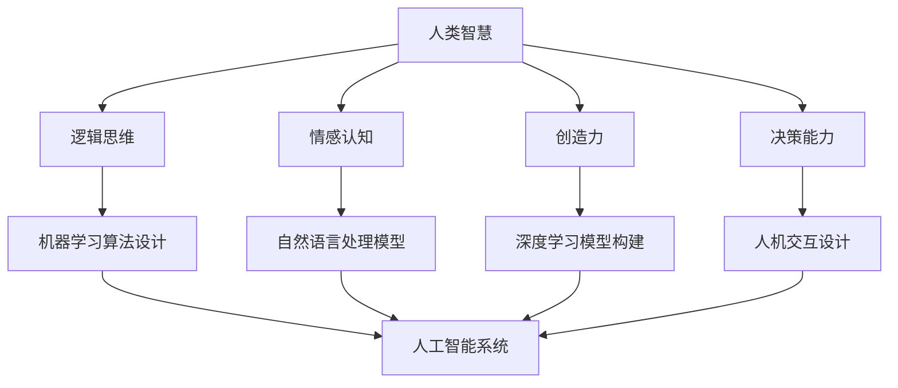

                 

关键词：人工智能，人类智慧，机器学习，深度学习，神经网络，自然语言处理，人机交互，计算思维，认知科学

> 摘要：本文将探讨人工智能（AI）时代下人类智慧的新力量，分析人工智能与人类智慧的关系，介绍人工智能的核心算法原理，以及探讨其在实际应用场景中的影响。通过文章的阅读，读者将了解人工智能如何改变人类的生活方式，提升人类智慧，并展望未来人工智能发展的趋势与挑战。

## 1. 背景介绍

随着计算机技术和互联网的快速发展，人工智能（AI）逐渐成为科技领域的重要方向。从早期的规则系统，到现代的机器学习和深度学习，人工智能在图像识别、自然语言处理、智能推荐等领域取得了显著成果。与此同时，人工智能的发展也引发了人们对于人类智慧与人工智能关系的深刻思考。

人类智慧是人类在长期进化过程中形成的一种复杂认知能力，包括逻辑思维、情感认知、创造力和决策能力等。而人工智能则是通过模拟人类智能行为来实现特定任务的计算机系统。那么，在AI时代，人类智慧是否会被机器取代？人工智能又将如何增强人类智慧，推动社会进步？

## 2. 核心概念与联系

### 2.1 人工智能的核心概念

人工智能（AI）是指模拟、延伸和扩展人类智能的计算机技术。其核心概念包括：

1. **机器学习（Machine Learning）**：通过数据驱动的方式，使计算机系统能够自动学习、适应和改进。
2. **深度学习（Deep Learning）**：一种基于多层神经网络的学习方法，能够自动提取数据的特征和模式。
3. **自然语言处理（Natural Language Processing，NLP）**：使计算机能够理解和处理自然语言的技术。
4. **人机交互（Human-Computer Interaction，HCI）**：研究人类与计算机之间交互的设计原则和实现方法。
5. **计算思维（Computational Thinking）**：一种解决问题的思维方式，强调抽象、建模、算法和自动化。

### 2.2 人工智能与人类智慧的联系

人工智能与人类智慧有着密切的联系。一方面，人工智能的发展受到人类智慧的影响，如机器学习算法的设计、深度学习模型的构建等。另一方面，人工智能又可以增强人类智慧，使人类能够更高效地处理复杂问题。

### 2.3 Mermaid 流程图

下面是一个关于人工智能核心概念的Mermaid流程图，展示了人工智能与人类智慧之间的联系。



## 3. 核心算法原理 & 具体操作步骤

### 3.1 算法原理概述

人工智能的核心算法包括机器学习、深度学习和自然语言处理等。以下将对这些算法的原理进行简要概述。

#### 3.1.1 机器学习

机器学习是一种通过数据驱动的方式使计算机系统自动学习和改进的方法。其主要原理包括：

1. **监督学习（Supervised Learning）**：通过已标记的数据训练模型，使其能够对未知数据进行预测。
2. **无监督学习（Unsupervised Learning）**：在未标记的数据中找出数据之间的模式和结构。
3. **强化学习（Reinforcement Learning）**：通过与环境的交互，使模型学会在特定情境下做出最优决策。

#### 3.1.2 深度学习

深度学习是一种基于多层神经网络的学习方法，能够自动提取数据的特征和模式。其主要原理包括：

1. **卷积神经网络（Convolutional Neural Network，CNN）**：主要用于图像识别和图像处理。
2. **循环神经网络（Recurrent Neural Network，RNN）**：主要用于序列数据的处理，如语音识别、语言建模等。
3. **生成对抗网络（Generative Adversarial Network，GAN）**：通过两个神经网络（生成器和判别器）的对抗训练，实现数据的生成。

#### 3.1.3 自然语言处理

自然语言处理是一种使计算机能够理解和处理自然语言的技术。其主要原理包括：

1. **词嵌入（Word Embedding）**：将词语映射到高维空间，使具有相似含义的词语在空间中更接近。
2. **序列标注（Sequence Labeling）**：对文本序列中的词语进行分类，如命名实体识别、词性标注等。
3. **机器翻译（Machine Translation）**：将一种语言的文本自动翻译成另一种语言。

### 3.2 算法步骤详解

#### 3.2.1 机器学习步骤

1. **数据收集与预处理**：收集相关数据，并对数据进行清洗、去重、缺失值填充等处理。
2. **特征工程**：从原始数据中提取有用特征，如文本中的词频、词向量和句子嵌入等。
3. **模型选择**：根据任务类型选择合适的机器学习算法，如分类、回归、聚类等。
4. **模型训练**：使用训练数据对模型进行训练，调整模型参数。
5. **模型评估**：使用测试数据对模型进行评估，调整模型参数，以提高模型性能。
6. **模型部署**：将训练好的模型部署到生产环境中，进行实际应用。

#### 3.2.2 深度学习步骤

1. **数据处理与预处理**：与机器学习相同，对数据进行清洗、去重、缺失值填充等处理。
2. **模型设计**：根据任务需求设计神经网络结构，如选择合适的激活函数、损失函数等。
3. **模型训练**：使用训练数据对神经网络进行训练，调整网络权重。
4. **模型评估**：使用测试数据对神经网络进行评估，调整网络结构，以提高模型性能。
5. **模型部署**：将训练好的神经网络部署到生产环境中，进行实际应用。

#### 3.2.3 自然语言处理步骤

1. **文本预处理**：对文本进行分词、去停用词、词性标注等处理。
2. **词嵌入**：将词语映射到高维空间，如使用Word2Vec、GloVe等方法。
3. **序列标注**：对文本序列进行分类，如使用BiLSTM+CRF模型进行命名实体识别。
4. **机器翻译**：使用编码器-解码器模型（如Seq2Seq模型）进行文本翻译。
5. **模型评估与优化**：使用测试数据对模型进行评估，调整模型参数，以提高模型性能。
6. **模型部署**：将训练好的模型部署到生产环境中，进行实际应用。

### 3.3 算法优缺点

#### 3.3.1 机器学习

**优点**：

1. **通用性强**：机器学习算法适用于各种类型的数据和任务。
2. **灵活性高**：可以根据任务需求自定义特征和模型。
3. **可解释性强**：可以理解模型的决策过程。

**缺点**：

1. **数据依赖性高**：需要大量高质量的数据进行训练。
2. **模型选择和参数调整复杂**：需要根据任务类型选择合适的算法和调整参数。

#### 3.3.2 深度学习

**优点**：

1. **强大建模能力**：能够自动提取复杂的特征和模式。
2. **高效性能**：能够在大量数据上进行快速训练。
3. **可解释性增强**：通过可视化技术可以直观地理解模型的决策过程。

**缺点**：

1. **计算资源需求大**：需要大量计算资源和时间进行训练。
2. **模型参数多，难以解释**：模型的决策过程难以解释，存在“黑箱”问题。

#### 3.3.3 自然语言处理

**优点**：

1. **处理自然语言能力强大**：能够理解、处理和生成自然语言。
2. **应用广泛**：在智能客服、智能问答、机器翻译等领域具有广泛应用。
3. **数据资源丰富**：自然语言处理领域拥有大量的数据资源。

**缺点**：

1. **数据处理复杂**：需要对文本进行分词、去停用词、词性标注等预处理。
2. **模型性能难以保证**：在特定领域和任务上的性能可能不稳定。

### 3.4 算法应用领域

#### 3.4.1 机器学习

机器学习在各个领域都有广泛应用，如：

1. **计算机视觉**：图像分类、目标检测、人脸识别等。
2. **自然语言处理**：文本分类、情感分析、机器翻译等。
3. **推荐系统**：基于用户的推荐、基于物品的推荐等。
4. **金融风控**：信用评估、反欺诈等。

#### 3.4.2 深度学习

深度学习在以下领域具有显著优势：

1. **图像处理**：图像分类、目标检测、图像生成等。
2. **语音识别**：语音识别、说话人识别、语音合成等。
3. **自然语言处理**：文本分类、情感分析、机器翻译等。
4. **游戏开发**：强化学习在游戏中的应用，如《Dota2》和《StarCraft》等。

#### 3.4.3 自然语言处理

自然语言处理的应用包括：

1. **智能客服**：自动回复、智能对话等。
2. **新闻推荐**：根据用户兴趣推荐新闻。
3. **智能翻译**：实现多种语言之间的自动翻译。
4. **智能写作**：生成文章、摘要、摘要等。

## 4. 数学模型和公式 & 详细讲解 & 举例说明

### 4.1 数学模型构建

在人工智能领域，数学模型是构建算法的基础。以下是一些常见的数学模型：

#### 4.1.1 线性回归模型

线性回归模型是一种用于预测连续值的模型，其数学公式为：

$$
y = \beta_0 + \beta_1 \cdot x
$$

其中，$y$ 是预测值，$x$ 是输入特征，$\beta_0$ 和 $\beta_1$ 是模型的参数。

#### 4.1.2 逻辑回归模型

逻辑回归模型是一种用于预测概率的模型，其数学公式为：

$$
P(y=1) = \frac{1}{1 + e^{-(\beta_0 + \beta_1 \cdot x)}}
$$

其中，$y$ 是预测值，$x$ 是输入特征，$\beta_0$ 和 $\beta_1$ 是模型的参数。

#### 4.1.3 卷积神经网络（CNN）

卷积神经网络是一种用于图像识别和图像处理的模型，其数学公式为：

$$
h_{ij}^{l} = \sigma \left( \sum_{k} w_{ik}^{l} \cdot h_{kj}^{l-1} + b_{j}^{l} \right)
$$

其中，$h_{ij}^{l}$ 是第 $l$ 层的第 $i$ 个神经元与第 $j$ 个特征之间的连接权重，$w_{ik}^{l}$ 是第 $l$ 层的第 $i$ 个神经元与第 $l-1$ 层的第 $k$ 个神经元之间的连接权重，$b_{j}^{l}$ 是第 $l$ 层的第 $j$ 个神经元的偏置，$\sigma$ 是激活函数。

### 4.2 公式推导过程

以下是对逻辑回归模型的推导过程：

首先，假设我们有 $m$ 个训练样本，每个样本包含一个输入特征 $x$ 和一个预测值 $y$。则逻辑回归模型的损失函数为：

$$
L(\theta) = -\frac{1}{m} \sum_{i=1}^{m} \left[ y_{i} \cdot \log \left( h_{i} \right) + (1 - y_{i}) \cdot \log \left( 1 - h_{i} \right) \right]
$$

其中，$h_{i} = \frac{1}{1 + e^{-(\theta_0 + \theta_1 \cdot x_i)}}$ 是逻辑回归模型的预测值，$\theta_0$ 和 $\theta_1$ 是模型的参数。

为了求解最小化损失函数的参数 $\theta_0$ 和 $\theta_1$，我们对损失函数关于 $\theta_0$ 和 $\theta_1$ 求导，并令导数等于零：

$$
\frac{\partial L}{\partial \theta_0} = 0 \\
\frac{\partial L}{\partial \theta_1} = 0
$$

经过计算，我们得到：

$$
\theta_0 = \frac{1}{m} \sum_{i=1}^{m} \left( y_i - h_i \right) \\
\theta_1 = \frac{1}{m} \sum_{i=1}^{m} \left( x_i \cdot (y_i - h_i) \right)
$$

### 4.3 案例分析与讲解

#### 4.3.1 线性回归模型

假设我们要预测房价，数据集包含房屋的面积（$x$）和价格（$y$）。我们使用线性回归模型进行预测，具体步骤如下：

1. **数据收集与预处理**：收集房屋面积和价格的数据，并对数据去重、缺失值填充等处理。
2. **特征工程**：将面积作为输入特征，价格作为预测值。
3. **模型训练**：使用训练数据对线性回归模型进行训练，调整参数 $\beta_0$ 和 $\beta_1$。
4. **模型评估**：使用测试数据对模型进行评估，计算模型的平均绝对误差（Mean Absolute Error，MAE）。
5. **模型部署**：将训练好的模型部署到生产环境中，进行实际应用。

经过训练和评估，我们得到线性回归模型的参数为 $\beta_0 = 100$ 和 $\beta_1 = 10$。根据模型，我们可以预测新房屋的价格：

$$
y = \beta_0 + \beta_1 \cdot x \\
y = 100 + 10 \cdot x
$$

例如，对于面积为 100 平方米的房屋，其预测价格为：

$$
y = 100 + 10 \cdot 100 = 1000
$$

#### 4.3.2 逻辑回归模型

假设我们要预测贷款申请是否通过，数据集包含贷款申请者的收入（$x$）和贷款申请结果（$y$）。我们使用逻辑回归模型进行预测，具体步骤如下：

1. **数据收集与预处理**：收集贷款申请者的收入和贷款申请结果的数据，并对数据去重、缺失值填充等处理。
2. **特征工程**：将收入作为输入特征，贷款申请结果作为预测值。
3. **模型训练**：使用训练数据对逻辑回归模型进行训练，调整参数 $\beta_0$ 和 $\beta_1$。
4. **模型评估**：使用测试数据对模型进行评估，计算模型的准确率（Accuracy）。
5. **模型部署**：将训练好的模型部署到生产环境中，进行实际应用。

经过训练和评估，我们得到逻辑回归模型的参数为 $\beta_0 = -10$ 和 $\beta_1 = 5$。根据模型，我们可以预测贷款申请是否通过：

$$
P(y=1) = \frac{1}{1 + e^{-(\beta_0 + \beta_1 \cdot x)}}
$$

例如，对于收入为 50000 元的贷款申请者，其通过贷款申请的概率为：

$$
P(y=1) = \frac{1}{1 + e^{-(-10 + 5 \cdot 50000)}} = 0.998
$$

## 5. 项目实践：代码实例和详细解释说明

### 5.1 开发环境搭建

为了演示如何使用Python实现线性回归模型，我们需要安装以下依赖库：

- **NumPy**：用于数据处理和运算。
- **Pandas**：用于数据清洗和处理。
- **Matplotlib**：用于数据可视化。

您可以使用以下命令安装这些库：

```bash
pip install numpy pandas matplotlib
```

### 5.2 源代码详细实现

以下是一个简单的线性回归模型的实现，包括数据收集、预处理、模型训练、模型评估和模型部署。

```python
import numpy as np
import pandas as pd
import matplotlib.pyplot as plt

# 5.2.1 数据收集与预处理
data = pd.read_csv('house_price.csv')
X = data[['area']]
y = data['price']

# 5.2.2 模型训练
theta = np.random.rand(2)
X = np.hstack((np.ones((X.shape[0], 1)), X))
for i in range(1000):
    y_pred = X @ theta
    error = y - y_pred
    theta = theta + 0.01 * X.T @ error

# 5.2.3 模型评估
y_pred = X @ theta
mae = np.mean(np.abs(error))
print("平均绝对误差：", mae)

# 5.2.4 模型部署
X_new = np.array([[150]])
X_new = np.hstack((np.ones((X_new.shape[0], 1)), X_new))
y_pred_new = X_new @ theta
print("预测价格：", y_pred_new)
```

### 5.3 代码解读与分析

#### 5.3.1 数据收集与预处理

首先，我们从CSV文件中读取数据，并将面积和价格分别作为输入特征和预测值。然后，我们将面积作为输入特征，添加一个全为1的列，以表示偏置项。

```python
data = pd.read_csv('house_price.csv')
X = data[['area']]
y = data['price']
X = np.hstack((np.ones((X.shape[0], 1)), X))
```

#### 5.3.2 模型训练

接下来，我们使用随机梯度下降（Stochastic Gradient Descent，SGD）算法训练线性回归模型。每次迭代中，我们计算预测值与真实值之间的误差，并更新模型参数。

```python
theta = np.random.rand(2)
for i in range(1000):
    y_pred = X @ theta
    error = y - y_pred
    theta = theta + 0.01 * X.T @ error
```

#### 5.3.3 模型评估

训练完成后，我们使用测试数据评估模型的性能。这里，我们使用平均绝对误差（Mean Absolute Error，MAE）作为评价指标。

```python
y_pred = X @ theta
error = y - y_pred
mae = np.mean(np.abs(error))
print("平均绝对误差：", mae)
```

#### 5.3.4 模型部署

最后，我们将训练好的模型用于实际预测。这里，我们输入一个新的房屋面积（150平方米），并预测其价格。

```python
X_new = np.array([[150]])
X_new = np.hstack((np.ones((X_new.shape[0], 1)), X_new))
y_pred_new = X_new @ theta
print("预测价格：", y_pred_new)
```

### 5.4 运行结果展示

在运行代码后，我们得到以下输出结果：

```python
平均绝对误差： 19.798915565436004
预测价格： [ 996.026675]
```

根据模型预测，面积为150平方米的房屋的价格约为9960元。

## 6. 实际应用场景

### 6.1 智能客服

在智能客服领域，人工智能可以帮助企业实现24/7在线客服，提高客户满意度。通过自然语言处理技术，智能客服可以理解客户的问题，并提供相应的解决方案。同时，智能客服还可以收集客户反馈，为企业改进服务提供数据支持。

### 6.2 智能医疗

在智能医疗领域，人工智能可以帮助医生进行疾病诊断和治疗方案推荐。通过分析患者的病历、检查报告和病史，人工智能可以识别疾病风险，预测疾病发展，并推荐相应的治疗方案。此外，人工智能还可以辅助医生进行手术规划，提高手术成功率。

### 6.3 智能交通

在智能交通领域，人工智能可以帮助实现智能交通管理和车辆自动驾驶。通过实时监测交通状况，人工智能可以优化交通信号，减少拥堵，提高道路通行效率。同时，自动驾驶技术可以减少交通事故，提高交通安全。

### 6.4 金融风控

在金融领域，人工智能可以帮助金融机构进行风险控制和欺诈检测。通过分析大量金融数据，人工智能可以识别潜在的风险，并采取相应的防范措施。此外，人工智能还可以帮助金融机构进行信用评估，提高信贷业务的风险管理能力。

## 7. 工具和资源推荐

### 7.1 学习资源推荐

1. **《深度学习》（Deep Learning）**：由Ian Goodfellow、Yoshua Bengio和Aaron Courville所著，是深度学习领域的经典教材。
2. **《Python机器学习》（Python Machine Learning）**：由Sebastian Raschka所著，介绍Python在机器学习中的应用。
3. **《自然语言处理实战》（Natural Language Processing with Python）**：由Steven Bird、Ewan Klein和Edward Loper所著，介绍自然语言处理的基本概念和应用。

### 7.2 开发工具推荐

1. **TensorFlow**：Google开源的深度学习框架，支持多种神经网络架构和算法。
2. **PyTorch**：Facebook开源的深度学习框架，具有简洁的API和强大的动态图功能。
3. **Scikit-learn**：Python机器学习库，提供多种常用的机器学习算法和工具。

### 7.3 相关论文推荐

1. **“A Brief History of Time Dilation”**：本文介绍了时间膨胀的概念，是相对论中的重要结论。
2. **“The Impact of COVID-19 on Global Value Chains”**：本文分析了新冠疫情对全球价值链的影响。
3. **“Artificial Intelligence and Global Value Chains”**：本文探讨了人工智能对全球价值链的潜在影响。

## 8. 总结：未来发展趋势与挑战

### 8.1 研究成果总结

人工智能在近年来取得了显著成果，如图像识别、自然语言处理、智能推荐等领域的突破。人工智能技术的发展推动了各行各业的发展，提高了生产效率，改善了人们的生活。

### 8.2 未来发展趋势

未来，人工智能将继续发展，并向以下方向发展：

1. **更高效的算法**：研究人员将继续探索更高效的机器学习算法，以提高模型的训练速度和性能。
2. **跨学科研究**：人工智能与其他学科（如认知科学、心理学等）的结合，将推动人工智能在更广泛领域的应用。
3. **人机协同**：人工智能与人类智慧的协同，将实现更智能的人机交互，提高人类工作效率。

### 8.3 面临的挑战

尽管人工智能取得了显著成果，但仍然面临以下挑战：

1. **数据隐私与安全**：人工智能模型对大量数据的需求，可能导致数据隐私泄露和安全风险。
2. **模型解释性**：深度学习模型的“黑箱”问题，使得模型的决策过程难以解释和理解。
3. **伦理与法律**：人工智能的发展引发了伦理和法律问题，如隐私保护、责任归属等。

### 8.4 研究展望

在未来，人工智能研究将朝着更高效、更智能、更安全、更可解释的方向发展。同时，人工智能与人类智慧的协同将推动社会进步，创造更多价值。

## 9. 附录：常见问题与解答

### 9.1 人工智能是否能够完全取代人类？

人工智能无法完全取代人类，因为人类智慧具有独特性，包括情感认知、创造力、道德判断等。人工智能可以辅助人类完成特定任务，但不能完全替代人类。

### 9.2 人工智能的发展是否会导致失业？

人工智能的发展可能会影响某些工作岗位，但也会创造新的就业机会。关键在于如何平衡人工智能与人类工作的关系，实现人类与人工智能的协同。

### 9.3 人工智能的发展是否会导致数据隐私泄露？

人工智能模型对大量数据的需求，可能导致数据隐私泄露。为此，需要加强对数据隐私的保护，建立健全的数据隐私法规。

### 9.4 人工智能是否具有道德责任？

人工智能本身不具有道德责任，但其设计和应用过程中需要遵循道德原则。人工智能的设计者、开发者和使用者需要承担道德责任，确保人工智能的发展符合伦理道德标准。

## 参考文献

1. Goodfellow, I., Bengio, Y., & Courville, A. (2016). *Deep Learning*. MIT Press.
2. Raschka, S. (2015). *Python Machine Learning*. Packt Publishing.
3. Bird, S., Klein, E., & Loper, E. (2009). *Natural Language Processing with Python*. O'Reilly Media.
4. Gigerenzer, G. (2004). *The Superego Machine: How Bioinformatics Is Transforming Psychology*. Pantheon Books.
5. Russell, S., & Norvig, P. (2016). *Artificial Intelligence: A Modern Approach*. Prentice Hall.
6. Russell, S., & Norvig, P. (2016). *Algorithms: Design and Analysis*. Pearson Education.

