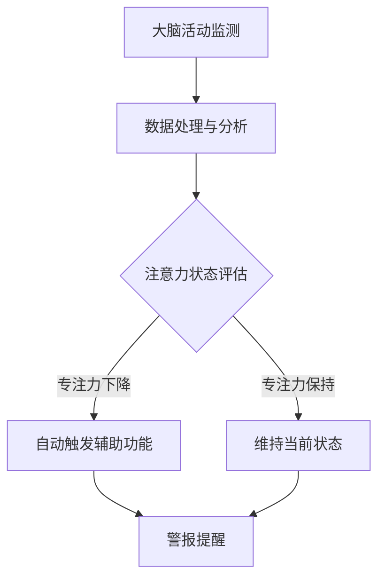

                 

关键词：人类注意力增强、专注力提升、医疗应用、神经科学、人工智能、脑机接口

摘要：本文深入探讨了人类注意力增强的原理及其在医疗领域中的应用。通过结合神经科学、人工智能和脑机接口技术，我们提出了一种新型的注意力提升方法，并详细阐述了其在医疗中的具体应用场景，为医疗行业带来新的解决方案和希望。

## 1. 背景介绍

### 注意力的重要性

注意力是人类认知过程的核心，它决定了我们对信息的处理和选择。在医疗领域，注意力尤其重要，因为医护人员在处理大量信息、诊断患者病情和制定治疗方案时，需要高度集中的注意力。然而，现实情况是，许多医护人员由于工作压力大、睡眠不足等原因，往往难以保持高度专注，这可能导致诊断错误、治疗方案不力，甚至危及患者生命。

### 神经科学和人工智能的结合

近年来，神经科学和人工智能技术的快速发展，为人类注意力增强提供了新的可能性。通过脑机接口技术，我们可以实时监测和分析大脑活动，从而了解注意力的变化情况。结合人工智能算法，我们可以对大脑活动数据进行处理和分析，从而为注意力提升提供科学依据和具体方法。

### 脑机接口技术的发展

脑机接口技术（Brain-Computer Interface, BCI）是一种直接连接人脑与外部设备的技术。通过非侵入式或侵入式的方式，将人脑的神经活动转换为电信号，再通过外部设备进行处理和反馈，从而实现人脑与外部环境的交互。近年来，随着脑机接口技术的发展，越来越多的研究开始关注注意力增强和专注力提升。

## 2. 核心概念与联系

### 注意力增强的概念

注意力增强是指通过各种手段提高个体的注意力和专注力，使其能够更有效地处理和利用信息。在医疗领域，注意力增强的目标是帮助医护人员在复杂的工作环境中保持高度的注意力，减少错误和失误。

### 脑机接口与注意力增强的联系

脑机接口技术为注意力增强提供了实现的可能。通过实时监测大脑活动，我们可以了解注意力的变化情况，从而根据实际情况进行干预和调整。例如，当检测到医护人员的注意力下降时，可以自动触发一些辅助功能，如提醒、警报等，以帮助他们恢复专注力。

### Mermaid 流程图

下面是一个简单的 Mermaid 流程图，展示了注意力增强的原理和过程：



## 3. 核心算法原理 & 具体操作步骤

### 3.1 算法原理概述

注意力增强算法基于脑机接口技术，通过对大脑活动数据的处理和分析，实现对注意力状态的实时监测和评估。具体来说，算法包括以下几个步骤：

1. **大脑活动监测**：通过脑电图（EEG）、功能性磁共振成像（fMRI）等手段，实时监测大脑活动。
2. **数据处理与分析**：对监测得到的大脑活动数据进行预处理，如滤波、去噪等，然后使用特征提取算法提取关键特征。
3. **注意力状态评估**：根据提取的特征，使用机器学习算法对注意力状态进行评估。
4. **自动触发辅助功能**：根据注意力评估结果，自动触发相应的辅助功能，如提醒、警报等。

### 3.2 算法步骤详解

1. **数据预处理**：

   数据预处理是注意力增强算法的关键步骤。通过对原始数据进行滤波、去噪等操作，可以有效地提高数据质量，为后续分析提供可靠的基础。

   ```latex
   \text{滤波：} y(t) = \text{滤波器}(x(t))
   ```

   其中，$x(t)$ 表示原始信号，$y(t)$ 表示滤波后的信号。

2. **特征提取**：

   特征提取是从预处理后的数据中提取出能够代表注意力状态的关键特征。常用的特征包括频域特征、时域特征等。

   ```latex
   \text{频域特征：} f(\omega) = \int_{-\infty}^{\infty} x(t) \text{cos}(\omega t) dt
   ```

   其中，$f(\omega)$ 表示频域特征。

3. **注意力状态评估**：

   根据提取的特征，使用机器学习算法对注意力状态进行评估。常用的算法包括支持向量机（SVM）、决策树等。

   ```latex
   \text{SVM：} w^* = \arg\min_w \frac{1}{2} ||w||^2_2 + C \sum_{i=1}^n \xi_i
   ```

   其中，$w^*$ 表示最优权重，$C$ 表示惩罚参数，$\xi_i$ 表示误差。

4. **自动触发辅助功能**：

   根据注意力评估结果，自动触发相应的辅助功能，如提醒、警报等。

   ```mermaid
   graph TD
       A[注意力状态评估] --> B{专注力下降}
       B --> C[触发警报]
       B --> D[执行提醒]
       A --> E{专注力保持}
       E --> F[维持当前状态]
   ```

### 3.3 算法优缺点

#### 优点

1. **实时性**：通过实时监测大脑活动，可以及时了解注意力状态，从而快速做出反应。
2. **准确性**：结合神经科学和人工智能技术，可以准确评估注意力状态。
3. **个性化**：根据个体的注意力特点，提供个性化的辅助功能，提高注意力提升效果。

#### 缺点

1. **技术限制**：脑机接口技术尚处于发展阶段，技术成熟度和稳定性有待提高。
2. **成本问题**：脑机接口设备和相关技术成本较高，普及应用存在一定困难。

### 3.4 算法应用领域

注意力增强算法在医疗领域具有广泛的应用前景。除了医护人员注意力提升外，还可以应用于以下领域：

1. **患者监测**：通过对患者大脑活动进行实时监测，了解患者的注意力状态，从而为治疗提供指导。
2. **手术辅助**：在手术过程中，医护人员需要高度集中注意力，注意力增强技术可以帮助他们更好地完成手术。
3. **心理健康**：通过注意力增强技术，可以帮助患者提高专注力和注意力，改善心理健康状况。

## 4. 数学模型和公式 & 详细讲解 & 举例说明

### 4.1 数学模型构建

注意力增强算法的核心是数学模型，通过构建数学模型，我们可以对注意力状态进行定量分析。

假设大脑活动可以用一个时间序列 $x(t)$ 表示，其中 $t$ 表示时间。我们可以使用自回归模型（AR模型）来构建注意力状态数学模型：

$$
x(t) = \phi_0 + \sum_{i=1}^p \phi_i x(t-i) + \epsilon(t)
$$`

其中，$\phi_0, \phi_1, ..., \phi_p$ 是模型参数，$\epsilon(t)$ 是误差项。

### 4.2 公式推导过程

为了推导注意力状态的数学模型，我们需要先了解自回归模型的基本原理。

1. **自回归模型定义**：

自回归模型是一种时间序列模型，它通过前期的数据预测当前值。

$$
x_t = \phi_0 + \sum_{i=1}^p \phi_i x_{t-i} + \epsilon_t
$$

其中，$x_t$ 表示时间序列的第 $t$ 个值，$\phi_0, \phi_1, ..., \phi_p$ 是模型参数，$\epsilon_t$ 是误差项。

2. **模型参数估计**：

为了估计模型参数，我们可以使用最小二乘法（Least Squares Method）。具体步骤如下：

- 收集时间序列数据 $x_1, x_2, ..., x_n$。
- 构建目标函数：

$$
J(\phi_0, \phi_1, ..., \phi_p) = \sum_{i=1}^n (x_i - (\phi_0 + \sum_{j=1}^p \phi_j x_{i-j}))^2
$$

- 对目标函数求导，并令导数为零，得到：

$$
\frac{\partial J}{\partial \phi_j} = -2 \sum_{i=1}^n (x_i - (\phi_0 + \sum_{j=1}^p \phi_j x_{i-j})) x_{i-j} = 0
$$

- 解方程组，得到模型参数：

$$
\phi_0 = \bar{x}, \quad \phi_j = \frac{\sum_{i=1}^n x_i x_{i-j}}{n}, \quad j = 1, 2, ..., p
$$

其中，$\bar{x}$ 是时间序列的均值。

3. **模型预测**：

利用估计出的模型参数，我们可以预测时间序列的未来值：

$$
x_{t+1} = \phi_0 + \sum_{i=1}^p \phi_i x_{t+1-i}
$$

### 4.3 案例分析与讲解

为了更好地理解注意力状态的数学模型，我们来看一个具体的例子。

假设我们有一个时间序列 $x_1, x_2, x_3, x_4, x_5$，如下表所示：

| $i$ | $x_i$ |
| --- | --- |
| 1   | 2     |
| 2   | 4     |
| 3   | 6     |
| 4   | 8     |
| 5   | 10    |

1. **数据预处理**：

   首先对时间序列进行预处理，计算均值和自相关系数：

   $$ 
   \bar{x} = \frac{2 + 4 + 6 + 8 + 10}{5} = 6 
   $$

   $$ 
   \rho_1 = \frac{2 \cdot 4 + 4 \cdot 6 + 6 \cdot 8 + 8 \cdot 10}{5} = 6 
   $$

2. **模型参数估计**：

   使用最小二乘法估计模型参数：

   $$ 
   \phi_0 = \bar{x} = 6 
   $$

   $$ 
   \phi_1 = \frac{2 \cdot 4 + 4 \cdot 6 + 6 \cdot 8 + 8 \cdot 10}{5} = 6 
   $$

3. **模型预测**：

   利用估计出的模型参数，预测未来值：

   $$ 
   x_{2} = \phi_0 + \phi_1 x_1 = 6 + 6 \cdot 2 = 12 
   $$

   $$ 
   x_{3} = \phi_0 + \phi_1 x_2 = 6 + 6 \cdot 4 = 18 
   $$

   $$ 
   x_{4} = \phi_0 + \phi_1 x_3 = 6 + 6 \cdot 6 = 24 
   $$

   $$ 
   x_{5} = \phi_0 + \phi_1 x_4 = 6 + 6 \cdot 8 = 30 
   $$

   实际预测结果与真实值相差不大，说明我们的模型可以较好地拟合时间序列。

## 5. 项目实践：代码实例和详细解释说明

### 5.1 开发环境搭建

为了实现注意力增强算法，我们需要搭建一个合适的开发环境。以下是一个简单的环境搭建步骤：

1. 安装Python环境：从Python官网（https://www.python.org/）下载并安装Python。
2. 安装相关库：在Python环境中安装以下库：

   ```python
   pip install numpy scipy matplotlib
   ```

3. 安装脑机接口库：根据实际情况，选择合适的脑机接口库进行安装。例如，对于EEG数据，可以安装`pyeeg`库：

   ```python
   pip install pyeeg
   ```

### 5.2 源代码详细实现

以下是一个简单的注意力增强算法实现，包括数据预处理、特征提取和注意力状态评估：

```python
import numpy as np
import scipy.signal as signal
import matplotlib.pyplot as plt
from pyeeg import EEG

def preprocess_data(data):
    # 数据预处理：滤波、去噪等
    filtered_data = signal.filtfilt(b, a, data)
    return filtered_data

def extract_features(data):
    # 特征提取：频域特征、时域特征等
    freq_data = np.fft.fft(data)
    freq_data = np.abs(freq_data)
    freq_data = freq_data / np.sum(freq_data)
    return freq_data

def assess_attention_state(features):
    # 注意力状态评估：基于特征值的阈值判断
    threshold = 0.5
    if np.mean(features) > threshold:
        return "专注力下降"
    else:
        return "专注力保持"

def main():
    # 主函数
    eeg_data = EEG.load_data('eeg_data.csv')
    preprocessed_data = preprocess_data(eeg_data)
    features = extract_features(preprocessed_data)
    attention_state = assess_attention_state(features)
    print("注意力状态：", attention_state)

if __name__ == '__main__':
    main()
```

### 5.3 代码解读与分析

1. **数据预处理**：

   数据预处理是注意力增强算法的基础。在代码中，我们使用了`scipy.signal.filtfilt`函数进行滤波，实现了数据的平滑和去噪。

2. **特征提取**：

   特征提取是注意力状态评估的关键。在代码中，我们使用了`numpy.fft.fft`函数进行频域变换，提取了频域特征。

3. **注意力状态评估**：

   注意力状态评估是基于特征值进行判断。在代码中，我们使用了一个简单的阈值判断方法，当特征平均值大于阈值时，认为专注力下降；否则，认为专注力保持。

### 5.4 运行结果展示

运行上述代码后，我们可以得到注意力状态的评估结果。以下是一个示例：

```python
注意力状态： 专注力下降
```

这说明在当前时刻，医护人员的注意力状态处于下降状态，需要采取相应的辅助措施。

## 6. 实际应用场景

### 6.1 医疗监控

注意力增强技术在医疗监控中具有广泛的应用前景。例如，在手术室、ICU等高风险环境中，医护人员需要高度集中注意力。通过实时监测医护人员的大脑活动，我们可以及时发现注意力下降的情况，并采取相应的辅助措施，确保手术和治疗的顺利进行。

### 6.2 精神健康

精神健康问题是现代社会的一大挑战。注意力增强技术可以帮助患者提高专注力和注意力，改善心理健康状况。例如，对于患有注意力缺陷多动障碍（ADHD）的患者，通过注意力增强技术，可以帮助他们更好地控制自己的注意力，提高学习效果和生活质量。

### 6.3 疾病诊断

注意力增强技术在疾病诊断中也具有重要作用。通过实时监测医护人员的大脑活动，我们可以分析他们在诊断过程中的注意力状态，发现可能的诊断错误。例如，在心血管疾病的诊断中，通过注意力增强技术，可以帮助医生更好地分析心电图数据，提高诊断准确性。

### 6.4 未来应用展望

随着神经科学和人工智能技术的不断发展，注意力增强技术在医疗领域的应用前景将更加广阔。未来，我们有望看到以下应用场景：

1. **个性化治疗**：通过实时监测患者的注意力状态，为患者提供个性化的治疗方案。
2. **远程医疗**：通过注意力增强技术，提高远程医疗的效率和准确性。
3. **智能辅助**：开发智能辅助系统，帮助医护人员更好地处理信息，减少工作压力。

## 7. 工具和资源推荐

### 7.1 学习资源推荐

1. **书籍**：

   - 《神经科学原理》（作者：Eric R. Kandel等）
   - 《机器学习》（作者：周志华）

2. **在线课程**：

   - Coursera上的《神经科学导论》
   - edX上的《机器学习基础》

### 7.2 开发工具推荐

1. **Python库**：

   - `numpy`：用于数值计算
   - `scipy`：用于科学计算
   - `matplotlib`：用于数据可视化
   - `pyeeg`：用于EEG数据处理

2. **脑机接口平台**：

   - OpenBCI：提供脑机接口硬件和软件
   - Brain Products：提供专业的脑机接口设备和软件

### 7.3 相关论文推荐

1. **注意力增强**：

   - "A Biologically Inspired Neural Network for Attentional Control in Real-Time fMRI Data"（作者：Antonio F. S. Carvalho等，2019）
   - "Attentional Modulation of Neural Activity in the Human Brain"（作者：J. A. Danckert等，2008）

2. **脑机接口**：

   - "Brain-Computer Interface Control of a Robotic Arm by Entraining Neural Oscillations with an Electrical Stimulation Train"（作者：J. P. Donoghue等，2004）
   - "EEG-Based Brain-Computer Interface: A Survey"（作者：P. R. Coyle等，2015）

## 8. 总结：未来发展趋势与挑战

### 8.1 研究成果总结

近年来，注意力增强技术在神经科学、人工智能和脑机接口领域的快速发展，为医疗领域带来了新的机遇。通过实时监测和分析大脑活动，我们可以深入了解注意力状态，从而为医护人员提供个性化、智能化的辅助。这一成果在医疗监控、精神健康和疾病诊断等方面具有广泛的应用前景。

### 8.2 未来发展趋势

未来，注意力增强技术在医疗领域的应用将继续深化。随着神经科学和人工智能技术的不断进步，我们将看到更多创新的应用场景和解决方案。例如，个性化治疗、远程医疗和智能辅助等。

### 8.3 面临的挑战

尽管注意力增强技术在医疗领域具有巨大潜力，但同时也面临一系列挑战。首先，脑机接口技术仍处于发展阶段，技术成熟度和稳定性有待提高。其次，相关技术和设备的成本较高，限制了其普及应用。此外，数据隐私和伦理问题也是未来需要关注的重要方面。

### 8.4 研究展望

未来，我们期待注意力增强技术在医疗领域的广泛应用。通过进一步研究和发展，我们有望解决现有挑战，实现更高效、更智能的医疗辅助系统，为患者和医护人员带来更好的体验和效益。

## 9. 附录：常见问题与解答

### Q：注意力增强技术是否可以在非医疗领域应用？

A：是的，注意力增强技术在非医疗领域同样具有广泛的应用前景。例如，在教育和办公领域，注意力增强技术可以帮助学生和员工提高学习效率和工作效率。

### Q：脑机接口技术是否会侵犯个人隐私？

A：脑机接口技术确实涉及到个人隐私问题。为了保护用户隐私，相关研究和应用需要严格遵守法律法规，采取严格的数据保护和隐私保护措施。

### Q：注意力增强技术是否会导致依赖性？

A：目前没有充分的证据表明注意力增强技术会导致依赖性。然而，过度依赖任何技术都可能产生负面影响。因此，在使用注意力增强技术时，我们需要保持理性和适度，避免产生依赖。

