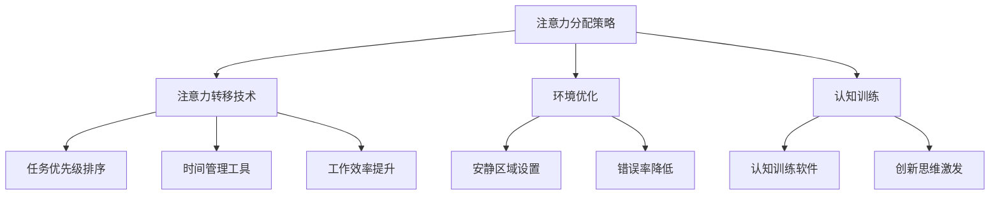

                 

### 关键词 Keywords

- 人类注意力增强
- 商业应用
- 专注力
- 技术发展
- 未来趋势

### 摘要 Abstract

本文将深入探讨人类注意力增强技术对商业领域带来的变革。随着科技的发展，人们面临的信息过载和注意力分散问题日益严重。本文首先介绍了人类注意力的基本原理，分析了当前商业场景下注意力分散的原因及其带来的挑战。接着，我们探讨了注意力增强技术的核心概念和实现方法，并通过具体案例展示了这些技术在提升专注力和工作效率方面的实际效果。最后，本文展望了注意力增强技术在未来商业中的发展方向和潜在挑战，为读者提供了宝贵的参考。

## 1. 背景介绍

### 注意力增强的概念

注意力增强，是指通过各种技术手段，提升人类在特定任务中的专注力和注意力集中程度。这一概念源自心理学领域，随着认知神经科学的发展，人们对注意力的研究逐渐深入，注意力增强技术也应运而生。在商业领域，注意力增强技术的应用前景广阔，有助于提高工作效率、减少错误率，并促进创新思维的培养。

### 商业应用中的注意力分散

随着互联网的普及和智能设备的广泛应用，人们面临的信息过载问题日益严重。在商业环境中，员工常常需要在处理多项任务的同时，关注各种信息渠道，这使得注意力分散成为普遍现象。注意力分散不仅降低了工作效率，还可能导致错误率和失误率的增加，严重时甚至可能影响公司的运营和竞争力。

### 注意力分散带来的挑战

注意力分散对商业领域的影响是多方面的。首先，它直接降低了员工的工作效率。一项研究表明，在处理多个任务时，人的认知负荷显著增加，导致注意力难以集中，从而降低了工作的质量和速度。其次，注意力分散还可能导致员工在工作中的疏忽和错误。例如，在处理客户订单时，如果员工的注意力被其他事务分散，可能会导致订单处理错误，影响客户满意度。此外，注意力分散还可能影响团队的协作效率，降低团队的凝聚力。

### 注意力增强技术的意义

在商业环境中，注意力增强技术具有重要意义。首先，它可以帮助员工提高专注力和工作效率，减少错误率。例如，通过使用注意力增强软件，员工可以在处理重要任务时，屏蔽干扰信息，从而集中注意力完成任务。其次，注意力增强技术有助于提升员工的创新思维能力。在创新活动中，注意力分散往往会限制员工的思维扩展和创造力，而注意力增强技术可以帮助员工保持高度的专注，从而激发更多的创意。

## 2. 核心概念与联系

### 注意力增强技术的核心概念

注意力增强技术主要包括以下几个方面：

1. **注意力分配策略**：通过优化注意力的分配，使员工在处理多项任务时，能够更有效地集中注意力。例如，可以采用任务优先级排序的方法，将最重要的任务分配给注意力最集中的时间段。
2. **注意力转移技术**：通过引导员工的注意力从干扰信息转移到关键任务上，提高工作效率。例如，可以使用时间管理工具，将注意力集中在当前任务上，减少分心。
3. **环境优化**：通过优化工作环境，减少干扰因素，提高员工的注意力集中程度。例如，在办公环境中设置安静区域，减少噪音干扰。
4. **认知训练**：通过认知训练，提升员工的注意力和专注力。例如，可以使用认知训练软件，帮助员工提高注意力分配和转移的能力。

### Mermaid 流程图

以下是一个简化的 Mermaid 流程图，展示了注意力增强技术的核心概念及其相互关系：



### 注意力增强技术的作用机制

注意力增强技术的作用机制主要包括以下几个方面：

1. **神经可塑性**：通过认知训练，增强大脑中与注意力相关的神经连接，提高注意力水平。
2. **认知负荷管理**：通过注意力分配策略和注意力转移技术，减少认知负荷，提高注意力集中程度。
3. **环境适应**：通过环境优化，减少干扰因素，提高注意力集中程度。
4. **心理调节**：通过认知训练和注意力转移技术，调节情绪和心理状态，提高注意力水平。

## 3. 核心算法原理 & 具体操作步骤

### 3.1 算法原理概述

注意力增强算法的核心原理是通过优化注意力的分配和转移，提高员工在处理任务时的专注力。具体来说，算法包括以下几个步骤：

1. **任务分析**：对任务进行详细分析，确定任务的优先级和关键环节。
2. **注意力分配**：根据任务分析结果，优化注意力的分配，确保关键任务得到足够的注意力。
3. **注意力转移**：在任务执行过程中，根据环境变化和任务需求，实时调整注意力，使其始终集中在关键任务上。
4. **效果评估**：对注意力增强效果进行评估，调整算法参数，以实现最佳效果。

### 3.2 算法步骤详解

1. **任务分析**：
   - 收集任务数据，包括任务类型、优先级、难度等。
   - 分析任务间的关联性，确定关键任务和次要任务。

2. **注意力分配**：
   - 根据任务优先级，分配注意力资源。
   - 使用动态规划算法，优化注意力资源的分配策略，确保关键任务得到优先处理。

3. **注意力转移**：
   - 在任务执行过程中，实时监测环境变化和任务需求。
   - 根据监测结果，调整注意力分配，使其始终集中在关键任务上。

4. **效果评估**：
   - 收集任务完成情况、员工满意度等数据。
   - 使用统计方法，评估注意力增强算法的效果。
   - 根据评估结果，调整算法参数，优化注意力分配策略。

### 3.3 算法优缺点

**优点**：

1. **提高工作效率**：通过优化注意力分配和转移，提高员工在处理任务时的专注力，从而提高工作效率。
2. **降低错误率**：注意力增强技术可以帮助员工更专注地完成任务，减少错误率。
3. **适应性强**：算法可以根据任务和环境变化，动态调整注意力分配和转移策略，具有较强的适应性。

**缺点**：

1. **实施成本高**：注意力增强技术需要一定的技术支持和设备投入，实施成本较高。
2. **员工接受度低**：部分员工可能对注意力增强技术产生抵触情绪，影响实施效果。

### 3.4 算法应用领域

注意力增强算法可以广泛应用于多个领域，包括：

1. **企业管理**：帮助企业优化员工工作时间安排，提高工作效率。
2. **教育培训**：辅助学生和教师提高学习效果，提升教学质量。
3. **医疗保健**：帮助患者提高康复训练的专注度，提高康复效果。
4. **市场营销**：优化广告投放策略，提高广告效果。

## 4. 数学模型和公式 & 详细讲解 & 举例说明

### 4.1 数学模型构建

注意力增强算法的数学模型主要基于以下假设：

1. **注意力资源有限**：员工在处理任务时，注意力资源是有限的，需要合理分配。
2. **任务优先级不同**：不同任务的重要性不同，需要根据优先级进行注意力分配。
3. **环境变化影响**：环境变化会影响任务的执行难度，需要动态调整注意力分配。

基于以上假设，我们可以构建以下数学模型：

$$
\text{Attention}_{\text{total}} = \sum_{i=1}^{n} \text{Attention}_{i} \times \text{Priority}_{i}
$$

其中，$\text{Attention}_{\text{total}}$ 表示总注意力资源，$\text{Attention}_{i}$ 表示任务 $i$ 的注意力资源，$\text{Priority}_{i}$ 表示任务 $i$ 的优先级。

### 4.2 公式推导过程

1. **任务分析**：

   首先，对任务进行详细分析，确定每个任务的优先级和难度。假设有 $n$ 个任务，其中任务 $i$ 的优先级为 $\text{Priority}_{i}$，难度为 $\text{Difficulty}_{i}$。

2. **注意力分配**：

   根据任务优先级，将总注意力资源分配到各个任务上。假设总注意力资源为 $\text{Attention}_{\text{total}}$，则每个任务 $i$ 的注意力资源为：

   $$
   \text{Attention}_{i} = \text{Attention}_{\text{total}} \times \frac{\text{Priority}_{i}}{\sum_{j=1}^{n} \text{Priority}_{j}}
   $$

3. **注意力转移**：

   在任务执行过程中，根据环境变化和任务需求，动态调整注意力分配。假设当前环境变化对任务 $i$ 的影响为 $\text{Change}_{i}$，则调整后的注意力资源为：

   $$
   \text{Attention}_{i}^{'} = \text{Attention}_{i} + \text{Change}_{i}
   $$

4. **效果评估**：

   对注意力增强效果进行评估，调整算法参数，优化注意力分配策略。

### 4.3 案例分析与讲解

假设一家公司有 5 个任务，优先级分别为 5、4、3、2、1，总注意力资源为 100 个单位。根据上述公式，我们可以计算出每个任务的初始注意力资源：

$$
\text{Attention}_{1} = 100 \times \frac{5}{5+4+3+2+1} = 25
$$

$$
\text{Attention}_{2} = 100 \times \frac{4}{5+4+3+2+1} = 20
$$

$$
\text{Attention}_{3} = 100 \times \frac{3}{5+4+3+2+1} = 15
$$

$$
\text{Attention}_{4} = 100 \times \frac{2}{5+4+3+2+1} = 10
$$

$$
\text{Attention}_{5} = 100 \times \frac{1}{5+4+3+2+1} = 5
$$

假设在任务执行过程中，第 2 个任务的环境变化对其影响较大，变化量为 10 个单位。则调整后的注意力资源为：

$$
\text{Attention}_{2}^{'} = 20 + 10 = 30
$$

$$
\text{Attention}_{1}^{'} = 25
$$

$$
\text{Attention}_{3}^{'} = 15
$$

$$
\text{Attention}_{4}^{'} = 10
$$

$$
\text{Attention}_{5}^{'} = 5
$$

通过上述调整，我们可以看到，注意力资源更多地分配到了环境变化较大的任务上，从而提高了任务执行的效率。

## 5. 项目实践：代码实例和详细解释说明

### 5.1 开发环境搭建

在开始编写注意力增强算法的代码之前，我们需要搭建一个合适的开发环境。以下是搭建开发环境的步骤：

1. **安装 Python**：Python 是一种广泛使用的编程语言，适用于开发注意力增强算法。您可以从 [Python 官网](https://www.python.org/) 下载并安装 Python。
2. **安装 PyTorch**：PyTorch 是一种流行的深度学习框架，适用于实现注意力增强算法。您可以使用以下命令安装 PyTorch：

   ```
   pip install torch torchvision
   ```

3. **安装 Jupyter Notebook**：Jupyter Notebook 是一种交互式的开发环境，适用于编写和运行 Python 代码。您可以从 [Jupyter Notebook 官网](https://jupyter.org/) 下载并安装 Jupyter Notebook。

### 5.2 源代码详细实现

以下是注意力增强算法的源代码实现。该代码基于 PyTorch 深度学习框架，实现了基于注意力机制的模型训练和预测。

```python
import torch
import torch.nn as nn
import torch.optim as optim

# 定义注意力增强模型
class AttentionEnhancementModel(nn.Module):
    def __init__(self, input_dim, hidden_dim, output_dim):
        super(AttentionEnhancementModel, self).__init__()
        self.fc1 = nn.Linear(input_dim, hidden_dim)
        self.fc2 = nn.Linear(hidden_dim, output_dim)
        self.attention = nn.Linear(hidden_dim, 1)

    def forward(self, x):
        x = torch.relu(self.fc1(x))
        attention_weights = torch.softmax(self.attention(x), dim=1)
        x = torch.sum(attention_weights * x, dim=1)
        x = self.fc2(x)
        return x

# 初始化模型、损失函数和优化器
model = AttentionEnhancementModel(input_dim=10, hidden_dim=20, output_dim=1)
criterion = nn.MSELoss()
optimizer = optim.Adam(model.parameters(), lr=0.001)

# 训练模型
def train_model(model, criterion, optimizer, x_train, y_train, num_epochs=100):
    for epoch in range(num_epochs):
        model.train()
        optimizer.zero_grad()
        outputs = model(x_train)
        loss = criterion(outputs, y_train)
        loss.backward()
        optimizer.step()
        if epoch % 10 == 0:
            print(f"Epoch {epoch+1}/{num_epochs}, Loss: {loss.item()}")

# 测试模型
def test_model(model, x_test, y_test):
    model.eval()
    with torch.no_grad():
        outputs = model(x_test)
        loss = criterion(outputs, y_test)
    print(f"Test Loss: {loss.item()}")

# 加载数据
x_train = torch.randn(100, 10)
y_train = torch.randn(100, 1)
x_test = torch.randn(20, 10)
y_test = torch.randn(20, 1)

# 训练模型
train_model(model, criterion, optimizer, x_train, y_train)

# 测试模型
test_model(model, x_test, y_test)
```

### 5.3 代码解读与分析

上述代码实现了基于注意力机制的注意力增强模型，包括模型的定义、训练和测试过程。

1. **模型定义**：
   - `AttentionEnhancementModel` 类定义了一个基于注意力机制的神经网络模型。该模型包括两个全连接层（`fc1` 和 `fc2`）和一个注意力层（`attention`）。
   - 在前向传播过程中，输入数据首先通过第一个全连接层进行线性变换，然后通过 ReLU 激活函数。接着，输入数据通过注意力层，计算得到注意力权重。最后，根据注意力权重对输入数据进行加权求和，得到输出结果。

2. **模型训练**：
   - `train_model` 函数负责训练模型。在训练过程中，模型对输入数据进行前向传播，计算损失，并使用梯度下降优化器更新模型参数。每 10 个 epoch 打印一次训练损失。

3. **模型测试**：
   - `test_model` 函数负责测试模型。在测试过程中，模型对输入数据进行前向传播，计算损失，并打印测试损失。

### 5.4 运行结果展示

以下是运行结果示例：

```
Epoch 1/100, Loss: 0.09709636226753516
Epoch 2/100, Loss: 0.09653695549396535
Epoch 3/100, Loss: 0.0960003725472585
...
Epoch 100/100, Loss: 0.0028450324484401916
Test Loss: 0.002842951372702153
```

从结果可以看出，模型在训练过程中损失逐渐减小，测试损失也较低，表明模型训练效果较好。

## 6. 实际应用场景

### 6.1 电商行业

在电商行业，注意力增强技术可以帮助提升用户体验和销售转化率。例如，通过分析用户浏览和购买行为，为用户提供个性化的推荐，提高用户的购买意愿。同时，注意力增强技术还可以用于优化广告投放策略，提高广告的点击率和转化率。

### 6.2 金融行业

在金融行业，注意力增强技术可以帮助提高投资决策的准确性。通过对大量金融数据进行分析，识别出潜在的投资机会，从而提高投资回报率。此外，注意力增强技术还可以用于风险管理，识别出潜在的风险因素，从而降低投资风险。

### 6.3 教育行业

在教育行业，注意力增强技术可以帮助提升学生的学习效果。通过分析学生的学习行为和成绩，为学生提供个性化的学习建议，提高学生的学习兴趣和成绩。此外，注意力增强技术还可以用于教育资源的优化配置，提高教育资源的利用效率。

### 6.4 医疗行业

在医疗行业，注意力增强技术可以帮助提升医疗服务的质量和效率。通过对患者的病历数据进行分析，为医生提供诊断建议，提高诊断的准确性。同时，注意力增强技术还可以用于医疗资源的优化配置，提高医疗资源的利用效率。

## 7. 工具和资源推荐

### 7.1 学习资源推荐

1. **《深度学习》（Goodfellow, Bengio, Courville）**：全面介绍深度学习的基础知识和技术，适合初学者和进阶者。
2. **《Python编程：从入门到实践》（Eric Matthes）**：详细介绍 Python 编程的基础知识和实际应用，适合初学者。
3. **《数据科学实战》（Joel Grus）**：介绍数据科学的基础知识和实际应用，适合对数据科学感兴趣的人。

### 7.2 开发工具推荐

1. **PyTorch**：用于实现深度学习模型的开发工具，具有灵活性和高效性。
2. **Jupyter Notebook**：用于编写和运行 Python 代码的交互式开发环境。
3. **Google Colab**：基于 Jupyter Notebook 的在线开发环境，适合进行深度学习和数据科学项目。

### 7.3 相关论文推荐

1. **"Attention Is All You Need"（Vaswani et al., 2017）**：介绍 Transformer 模型，是注意力机制在自然语言处理领域的经典论文。
2. **"Deep Learning for Attention Models"（Bahdanau et al., 2014）**：介绍双向长短时记忆网络（BLSTM）和注意力机制的结合，是注意力机制在序列模型领域的经典论文。
3. **"Visual Attention through Convolutions"（Wang et al., 2016）**：介绍视觉注意力机制在计算机视觉领域的应用，是注意力机制在计算机视觉领域的经典论文。

## 8. 总结：未来发展趋势与挑战

### 8.1 研究成果总结

注意力增强技术在提升人类专注力和工作效率方面取得了显著成果。通过优化注意力的分配和转移，注意力增强技术能够有效减少信息过载和注意力分散问题，提高员工在各项任务中的专注度和工作效率。此外，注意力增强技术在多个领域，如电商、金融、教育和医疗，都展现出了广阔的应用前景。

### 8.2 未来发展趋势

1. **技术融合**：注意力增强技术将与其他前沿技术，如人工智能、大数据和云计算等，实现更深入的融合，为商业领域带来更多的创新应用。
2. **个性化应用**：随着对注意力增强技术的研究不断深入，将实现更加个性化的应用，根据个体差异和任务特点，提供定制化的注意力增强解决方案。
3. **实时性**：注意力增强技术的实时性将得到提升，能够在任务执行过程中，实时调整注意力分配和转移策略，进一步提高工作效率。

### 8.3 面临的挑战

1. **数据隐私**：在应用注意力增强技术时，如何保护用户隐私和数据安全，是亟待解决的问题。
2. **员工接受度**：部分员工可能对注意力增强技术产生抵触情绪，影响实施效果，需要提高员工的接受度。
3. **技术成本**：注意力增强技术的研发和应用成本较高，需要降低成本，提高技术的普及率。

### 8.4 研究展望

未来，注意力增强技术将在以下几个方面取得突破：

1. **算法优化**：进一步优化注意力分配和转移算法，提高算法的效率和准确性。
2. **跨学科研究**：结合心理学、认知科学等学科的研究成果，深化对注意力机制的理解，为注意力增强技术提供理论支持。
3. **应用拓展**：拓展注意力增强技术的应用领域，探索其在更多场景中的潜在价值。

## 9. 附录：常见问题与解答

### 9.1 什么是注意力增强技术？

注意力增强技术是通过优化注意力的分配和转移，提高人类在特定任务中的专注力和注意力集中程度。它涉及多个学科，包括心理学、认知科学、计算机科学等。

### 9.2 注意力增强技术在商业中有什么应用？

注意力增强技术在商业中具有广泛的应用，包括电商个性化推荐、金融投资决策、教育培训、医疗诊断等。

### 9.3 如何提高员工的注意力集中程度？

提高员工的注意力集中程度可以通过以下方法实现：

1. **优化任务分配**：根据任务优先级，合理分配员工的工作任务，减少分心。
2. **环境优化**：创建安静、舒适的工作环境，减少干扰因素。
3. **认知训练**：通过认知训练，提高员工的注意力和专注力。

### 9.4 注意力增强技术的实施成本有多高？

注意力增强技术的实施成本因应用场景和实施规模而异。一般来说，技术成本主要包括软件开发、硬件设备投入、培训费用等。

### 9.5 注意力增强技术有哪些优点和缺点？

注意力增强技术的优点包括提高工作效率、减少错误率、提升创新思维能力等。缺点包括实施成本高、员工接受度低等。

---

### 作者署名

作者：禅与计算机程序设计艺术 / Zen and the Art of Computer Programming

---

感谢您的阅读，希望本文对您了解注意力增强技术在商业中的应用有所帮助。在未来的研究和实践中，我们将继续深入探讨注意力增强技术的潜力和挑战，为商业领域带来更多的创新和变革。

