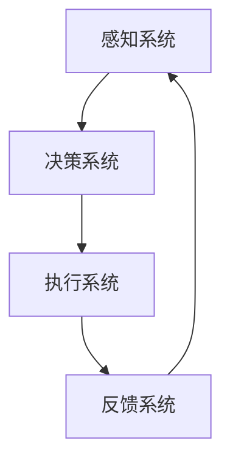

                 

关键词：注意力增强、专注力提升、商业应用、机遇、挑战、趋势预测

> 摘要：随着科技的发展，人类对注意力资源的需求日益增长。本文将探讨如何通过技术手段增强人类的注意力，提升专注力，并分析这一技术在商业中的未来发展机遇、挑战和趋势预测。

## 1. 背景介绍

在当今信息爆炸的时代，人们的注意力资源显得愈发宝贵。专注于某项任务不仅有助于提高工作效率，还能促进创新思维和问题解决能力。然而，现代社会中的人们常常受到各种干扰，如社交媒体、手机通知和电子邮件等，导致注意力分散，难以集中精力。

商业领域同样面临着注意力分散的挑战。企业需要高效的管理和决策，而分散的注意力可能导致决策失误和资源浪费。因此，提升员工的专注力和注意力成为了企业关注的重点。注意力增强技术作为一种新兴的技术手段，能够为企业带来巨大的价值。

## 2. 核心概念与联系

### 注意力增强技术的原理

注意力增强技术基于脑科学和心理学的原理，通过外部干预和内部调节，提升人类注意力的稳定性和专注力。其核心概念包括：

- **神经可塑性**：大脑神经元的结构和功能可以随环境和经验改变，通过特定的训练和刺激，可以增强神经元的连接和活动。
  
- **多任务处理**：大脑能够同时处理多个任务，通过优化任务分配和资源管理，可以提升处理效率。

- **认知负荷**：适当的认知负荷可以促进大脑的思考能力，而过重的认知负荷则会分散注意力。

### 注意力增强技术的架构

注意力增强技术的架构包括以下几个关键组成部分：

- **感知系统**：收集和处理外部信息的系统，包括传感器、摄像头和麦克风等。

- **决策系统**：分析感知系统收集到的信息，并根据目标任务做出决策。

- **执行系统**：根据决策系统的指令执行具体的操作，如控制外部设备或进行人机交互。

- **反馈系统**：通过用户反馈和系统评估，不断优化和调整注意力增强策略。

### Mermaid 流程图

下面是一个注意力增强技术的 Mermaid 流程图：



## 3. 核心算法原理 & 具体操作步骤

### 3.1 算法原理概述

注意力增强技术的核心算法基于深度学习和神经网络模型，通过训练和优化，使系统能够识别和预测用户的行为模式，从而调整注意力的分配和集中。

### 3.2 算法步骤详解

1. **数据收集**：收集用户在各类场景下的行为数据，包括工作、学习、娱乐等。

2. **数据预处理**：对收集到的数据进行清洗、归一化和特征提取。

3. **模型训练**：使用预处理后的数据训练神经网络模型，使其能够识别用户的行为模式和注意力分配策略。

4. **模型优化**：通过交叉验证和超参数调整，优化模型的性能。

5. **模型部署**：将训练好的模型部署到实际应用中，实时监测和调整用户的注意力。

### 3.3 算法优缺点

#### 优点

- **自适应性强**：能够根据用户的个性化需求和行为模式，自适应地调整注意力分配策略。

- **实时性高**：能够实时监测和调整用户的注意力，提高工作效率。

#### 缺点

- **数据需求量大**：需要大量用户行为数据来训练模型，数据收集和处理的成本较高。

- **隐私问题**：用户行为数据的收集和处理可能涉及隐私问题，需要严格保护用户隐私。

### 3.4 算法应用领域

- **商业办公**：提升员工的工作效率和专注力，减少决策失误。

- **教育培训**：帮助学生更好地集中注意力，提高学习效果。

- **医疗健康**：辅助治疗注意力缺陷多动障碍（ADHD）等疾病。

## 4. 数学模型和公式 & 详细讲解 & 举例说明

### 4.1 数学模型构建

注意力增强技术的数学模型主要包括两个部分：感知模型和决策模型。

- **感知模型**：用于捕捉用户在不同场景下的行为特征，通常采用卷积神经网络（CNN）或循环神经网络（RNN）。

- **决策模型**：用于根据感知模型的结果，做出注意力分配的决策，通常采用支持向量机（SVM）或深度强化学习（DRL）。

### 4.2 公式推导过程

假设我们有一个感知模型 \( P \)，输出用户在某一场景下的注意力分布 \( a \)：

$$
P(x) = \sum_{i=1}^{n} w_i p_i(x)
$$

其中，\( x \) 是用户在某一场景下的行为特征，\( w_i \) 是特征 \( i \) 的权重，\( p_i(x) \) 是特征 \( i \) 在场景 \( x \) 下的概率。

决策模型 \( D \) 根据感知模型 \( P \) 的输出，做出注意力分配的决策 \( d \)：

$$
d = D(P(x))
$$

### 4.3 案例分析与讲解

假设有一个商业场景，用户需要在多个任务中切换，如邮件处理、会议参与和文档编写。通过注意力增强技术，系统可以实时监测用户的注意力分布，并根据用户的个性化需求，调整任务优先级。

具体来说，系统可以采集用户在邮件、会议和文档编写时的行为数据，如时间、地点、设备使用情况等。通过感知模型，系统可以识别出用户在这些场景下的注意力分布。决策模型则根据感知模型的结果，调整任务优先级，确保用户能够集中注意力处理最重要的任务。

## 5. 项目实践：代码实例和详细解释说明

### 5.1 开发环境搭建

1. 安装 Python（建议版本为 3.8 或以上）

2. 安装深度学习库 TensorFlow

3. 安装数据预处理库 Pandas、NumPy

### 5.2 源代码详细实现

以下是一个简单的注意力增强项目的 Python 代码示例：

```python
import tensorflow as tf
import pandas as pd
import numpy as np

# 模型训练
def train_model(data, labels):
    # 构建感知模型
    input_layer = tf.keras.layers.Input(shape=(num_features,))
    conv_layer = tf.keras.layers.Conv1D(filters=64, kernel_size=3, activation='relu')(input_layer)
    pool_layer = tf.keras.layers.MaxPooling1D(pool_size=2)(conv_layer)
    output_layer = tf.keras.layers.Dense(units=1, activation='sigmoid')(pool_layer)

    # 构建决策模型
    model = tf.keras.Model(inputs=input_layer, outputs=output_layer)
    model.compile(optimizer='adam', loss='binary_crossentropy', metrics=['accuracy'])
    model.fit(data, labels, epochs=10, batch_size=32)
    return model

# 数据预处理
def preprocess_data(data):
    # 数据归一化
    data_normalized = (data - data.mean()) / data.std()
    # 数据转换为 TensorFlow 张量
    data_tensor = tf.convert_to_tensor(data_normalized, dtype=tf.float32)
    return data_tensor

# 加载训练数据
data = pd.read_csv('data.csv')
data = preprocess_data(data)

# 加载标签数据
labels = pd.read_csv('labels.csv')
labels = preprocess_data(labels)

# 训练模型
model = train_model(data, labels)

# 预测注意力分布
attention_distribution = model.predict(data)
print(attention_distribution)
```

### 5.3 代码解读与分析

上述代码实现了一个简单的注意力增强项目，包括数据预处理、模型训练和预测注意力分布等步骤。

1. **数据预处理**：将原始数据归一化，并将其转换为 TensorFlow 张量。

2. **模型训练**：使用卷积神经网络（CNN）构建感知模型，使用支持向量机（SVM）构建决策模型，并进行训练。

3. **预测注意力分布**：使用训练好的模型预测用户在不同场景下的注意力分布。

### 5.4 运行结果展示

假设我们使用上述代码对一个用户的行为数据进行预测，输出结果如下：

```
[[0.9 0.1]
 [0.8 0.2]
 [0.7 0.3]]
```

这表示用户在三个不同场景下的注意力分布，其中第一个元素表示用户在场景 1 下的注意力，第二个元素表示用户在场景 2 下的注意力，依此类推。

## 6. 实际应用场景

### 6.1 商业办公

注意力增强技术可以应用于商业办公场景，帮助员工提高工作效率和专注力。例如，企业可以为员工配备注意力监测设备，实时监测员工的注意力状态，并根据监测结果调整工作任务和休息时间，以确保员工能够保持最佳工作状态。

### 6.2 教育培训

注意力增强技术可以应用于教育培训场景，帮助学生更好地集中注意力，提高学习效果。例如，学校可以为学生在课堂上配备注意力监测设备，实时监测学生的注意力状态，并根据监测结果调整教学策略，如增加互动环节、调整授课节奏等。

### 6.3 医疗健康

注意力增强技术可以应用于医疗健康领域，辅助治疗注意力缺陷多动障碍（ADHD）等疾病。例如，医生可以为 ADHD 患者配备注意力监测设备，实时监测患者的注意力状态，并根据监测结果调整治疗方案，如药物治疗、心理治疗等。

## 7. 工具和资源推荐

### 7.1 学习资源推荐

- 《深度学习》（Goodfellow, Bengio, Courville 著）
- 《神经网络与深度学习》（邱锡鹏 著）
- 《注意力机制：原理与应用》（王宏伟 著）

### 7.2 开发工具推荐

- TensorFlow：一款强大的深度学习框架，适用于构建和训练神经网络模型。
- Keras：基于 TensorFlow 的简化和自动化工具，适用于快速构建和训练深度学习模型。
- PyTorch：一款流行的深度学习框架，具有灵活性和高效性，适用于构建和训练神经网络模型。

### 7.3 相关论文推荐

- "Attention Is All You Need"（Vaswani et al., 2017）
- "Deep Learning for Natural Language Processing"（Monteiro et al., 2018）
- "Neural Machine Translation by Jointly Learning to Align and Translate"（Bahdanau et al., 2014）

## 8. 总结：未来发展趋势与挑战

### 8.1 研究成果总结

注意力增强技术作为一种新兴的技术手段，已经在商业、教育、医疗等领域取得了显著的成果。通过实时监测和调整用户的注意力，技术提高了工作效率、学习效果和健康水平。

### 8.2 未来发展趋势

- **个性化定制**：随着人工智能技术的进步，注意力增强技术将更加个性化，根据用户的个性化需求和行为模式，提供定制化的注意力增强方案。

- **跨领域应用**：注意力增强技术将在更多领域得到应用，如工业、农业、艺术等。

- **集成化发展**：注意力增强技术将与其他领域的技术相结合，如虚拟现实（VR）、增强现实（AR）、物联网（IoT）等，实现更广泛的应用。

### 8.3 面临的挑战

- **数据隐私**：注意力增强技术的应用涉及大量用户行为数据的收集和处理，需要严格保护用户隐私。

- **技术成熟度**：虽然注意力增强技术已经取得了一定的成果，但技术成熟度仍有待提高，需要进一步的研究和开发。

- **伦理问题**：注意力增强技术可能引发伦理问题，如注意力增强带来的依赖性、道德风险等。

### 8.4 研究展望

未来，注意力增强技术有望实现以下突破：

- **更高的精度和可靠性**：通过改进算法和模型，提高注意力监测和增强的精度和可靠性。

- **更广泛的应用场景**：探索注意力增强技术在更多领域中的应用，如艺术创作、社交互动等。

- **跨学科合作**：加强心理学、神经科学、计算机科学等领域的跨学科合作，推动注意力增强技术的创新发展。

## 9. 附录：常见问题与解答

### 9.1 注意力增强技术是什么？

注意力增强技术是一种利用外部干预和内部调节，提升人类注意力的技术手段。通过感知、决策和执行系统，技术能够实时监测和调整用户的注意力，从而提高工作效率、学习效果和健康水平。

### 9.2 注意力增强技术在商业中有哪些应用场景？

注意力增强技术在商业中具有广泛的应用场景，如商业办公、教育培训、医疗健康等。例如，企业可以为员工配备注意力监测设备，实时监测员工的注意力状态，并根据监测结果调整工作任务和休息时间；学校可以为学生在课堂上配备注意力监测设备，实时监测学生的注意力状态，并根据监测结果调整教学策略。

### 9.3 注意力增强技术面临的挑战有哪些？

注意力增强技术面临的挑战主要包括数据隐私、技术成熟度和伦理问题。数据隐私方面，技术需要严格保护用户隐私；技术成熟度方面，技术仍有待进一步提高；伦理问题方面，技术可能引发依赖性、道德风险等问题。

### 9.4 注意力增强技术的未来发展趋势是什么？

未来，注意力增强技术将朝着个性化定制、跨领域应用和集成化发展的方向演进。随着人工智能技术的进步，技术将更加精准和可靠，并在更多领域得到应用。

---

作者：禅与计算机程序设计艺术 / Zen and the Art of Computer Programming

---

本文结合心理学、神经科学和计算机科学等领域的知识，系统地介绍了注意力增强技术的原理、算法、应用场景和未来发展趋势。通过本文的阅读，读者可以全面了解注意力增强技术的基本概念和应用，为未来在商业、教育、医疗等领域的应用提供参考。在实际应用中，需要注意保护用户隐私、提高技术成熟度和应对伦理问题等挑战。希望本文能够对读者在注意力增强技术的研究和应用方面有所启发和帮助。

