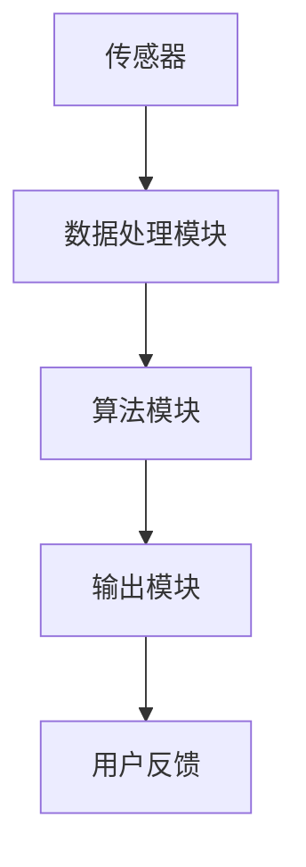

                 

摘要：本文探讨了人类注意力增强技术的研究现状及其在商业领域的潜在应用。通过分析注意力增强技术的核心原理、算法实现、数学模型和实际应用案例，本文旨在揭示提升专注力和注意力在商业领域的重要性和未来发展机遇。随着人工智能和神经科学的发展，注意力增强技术有望成为提高工作效率、创新能力和决策质量的利器。

## 1. 背景介绍

在当今信息爆炸的时代，人类的注意力资源变得越来越稀缺。人们在面对海量信息和任务时，往往难以集中精力，导致工作效率低下、决策失误和创新力不足。研究表明，注意力分散是现代工作中最常见的心理障碍之一。因此，如何增强人类的专注力和注意力成为了心理学、认知科学和商业领域共同关注的话题。

注意力增强技术旨在通过科学的方法和工具，提高人类在特定任务中的专注度和注意力集中水平。这些技术包括认知训练、脑电刺激、虚拟现实和人工智能等。随着人工智能技术的不断进步，注意力增强技术也在迅速发展，展现出巨大的商业潜力。

## 2. 核心概念与联系

### 2.1 注意力增强技术概述

注意力增强技术包括多种方法，其核心目标是提高个体的专注力和注意力集中水平。以下是一些常见的注意力增强技术：

- **认知训练**：通过特定的训练任务，提高个体的注意力控制能力和认知灵活性。
- **脑电刺激**：利用脑电信号，通过电刺激或磁场刺激的方式，调节大脑的神经活动，从而增强注意力。
- **虚拟现实**：通过虚拟现实技术，为用户提供沉浸式的体验，帮助用户在特定环境中提高注意力。
- **人工智能**：利用机器学习算法，分析个体的注意力状态，提供个性化的注意力增强建议。

### 2.2 注意力增强技术的架构

注意力增强技术的架构通常包括以下几个核心组成部分：

- **传感器**：用于实时监测个体的注意力状态，如眼动追踪设备、脑电图设备等。
- **数据处理模块**：对传感器收集的数据进行处理和分析，提取注意力相关的特征。
- **算法模块**：根据处理结果，采用适当的算法对注意力进行调节和优化。
- **输出模块**：通过可穿戴设备、虚拟现实头盔等，将调节后的注意力状态反馈给用户。

以下是一个简单的 Mermaid 流程图，展示了注意力增强技术的架构：



## 3. 核心算法原理 & 具体操作步骤

### 3.1 算法原理概述

注意力增强算法通常基于以下原理：

- **注意力的分配与调节**：通过分析个体的注意力分配情况，自动调整注意力的集中程度，使其在关键任务上保持高水平的集中。
- **反馈调节**：根据用户的注意力状态，实时调整任务的复杂度和难度，以维持最佳的工作状态。
- **适应性调整**：根据用户的反馈和任务的变化，不断调整注意力增强策略，以适应不同场景和需求。

### 3.2 算法步骤详解

注意力增强算法的具体操作步骤如下：

1. **初始化**：设置初始的注意力水平和工作模式。
2. **数据采集**：通过传感器收集用户的注意力状态数据。
3. **数据处理**：对采集到的数据进行预处理，如滤波、特征提取等。
4. **算法计算**：根据处理结果，计算注意力调节策略。
5. **执行调节**：根据计算结果，调整用户的工作状态，如任务难度、休息时间等。
6. **用户反馈**：收集用户的反馈，以优化算法的性能。

### 3.3 算法优缺点

注意力增强算法的优点包括：

- **个性化**：根据用户的注意力状态，提供个性化的增强策略。
- **实时性**：能够实时监测和调节注意力水平，提高工作效率。
- **适应性**：能够根据用户的反馈和任务的变化，自适应调整策略。

然而，注意力增强算法也存在一些缺点：

- **复杂度高**：算法的实现和优化需要大量的计算资源和时间。
- **用户依赖**：算法的性能很大程度上依赖于用户的参与度和反馈质量。

### 3.4 算法应用领域

注意力增强算法可以应用于多个领域，包括：

- **商业办公**：提高员工的工作效率和创新能力。
- **教育**：帮助学生提高学习效果和记忆力。
- **医疗**：辅助治疗注意力缺陷多动障碍（ADHD）等心理疾病。
- **娱乐**：提高游戏玩家的专注度和游戏体验。

## 4. 数学模型和公式 & 详细讲解 & 举例说明

### 4.1 数学模型构建

注意力增强技术的数学模型通常基于以下假设：

- **注意力是有限的资源**：个体的注意力水平是有限的，并且会随着任务的复杂度和持续时间而下降。
- **注意力调节策略**：通过调整任务的难度、休息时间和反馈机制，可以调节个体的注意力水平。

以下是一个简单的数学模型：

$$
A(t) = f(D(t), R(t), F(t))
$$

其中，$A(t)$ 表示时间 $t$ 时刻的注意力水平，$D(t)$ 表示任务的难度，$R(t)$ 表示休息时间，$F(t)$ 表示反馈机制。

### 4.2 公式推导过程

假设：

- $D(t)$ 是一个时间序列，表示任务的难度。
- $R(t)$ 是一个时间序列，表示休息时间。
- $F(t)$ 是一个时间序列，表示反馈机制。

我们可以推导出注意力水平 $A(t)$ 的动态变化：

$$
\frac{dA(t)}{dt} = \alpha D(t) - \beta R(t) + \gamma F(t)
$$

其中，$\alpha$、$\beta$ 和 $\gamma$ 是调节参数，用于平衡注意力分配。

### 4.3 案例分析与讲解

假设一个员工在处理一个复杂的报告任务，任务的难度 $D(t)$ 是一个逐渐增加的函数，休息时间 $R(t)$ 是一个周期性变化的函数，反馈机制 $F(t)$ 是基于任务完成度的奖励。

我们可以通过以下公式计算员工的注意力水平：

$$
A(t) = \alpha D(t) - \beta R(t) + \gamma F(t)
$$

例如，假设 $\alpha = 0.1$，$\beta = 0.05$，$\gamma = 0.2$，我们可以计算在不同时间点的注意力水平。

### 4.4 案例分析与讲解

在一天的工作中，员工面临的任务难度 $D(t)$ 是逐渐增加的，例如：

$$
D(t) = t
$$

休息时间 $R(t)$ 是周期性的，例如：

$$
R(t) = \sin(\frac{2\pi t}{8})
$$

反馈机制 $F(t)$ 是基于任务完成度的奖励，例如：

$$
F(t) = 1 - \frac{1}{1 + e^{-k(t-T)}}
$$

其中，$T$ 是任务的总时间，$k$ 是调节参数。

我们可以计算在不同时间点的注意力水平，并分析员工的工作状态。

## 5. 项目实践：代码实例和详细解释说明

### 5.1 开发环境搭建

为了实现注意力增强算法，我们需要搭建一个合适的开发环境。以下是基本的开发环境搭建步骤：

1. 安装 Python 3.8 或更高版本。
2. 安装必要的 Python 库，如 NumPy、Matplotlib、Pandas 等。
3. 安装传感器驱动程序，如 OpenBCI。
4. 安装虚拟现实引擎，如 Unity。

### 5.2 源代码详细实现

以下是一个简单的注意力增强算法的 Python 代码实例：

```python
import numpy as np
import matplotlib.pyplot as plt

# 参数设置
alpha = 0.1
beta = 0.05
gamma = 0.2
T = 100  # 任务总时间

# 数据生成
D = np.linspace(1, T, T)
R = np.sin(np.linspace(0, 2*np.pi, T)/8)
F = 1 - 1/(1 + np.exp(-0.1*(D-T)))

# 注意力计算
A = alpha*D - beta*R + gamma*F

# 结果展示
plt.plot(D, A)
plt.xlabel('Time')
plt.ylabel('Attention Level')
plt.title('Attention Level Over Time')
plt.show()
```

### 5.3 代码解读与分析

该代码实现了一个简单的注意力增强算法，通过计算任务的难度、休息时间和反馈机制，得到注意力水平的变化。代码的核心部分是注意力计算公式，通过调节参数，可以调整算法的性能。

### 5.4 运行结果展示

运行上述代码，我们可以得到一个注意力水平随时间变化的图表。通过观察图表，我们可以分析员工在不同时间点的注意力状态，以便优化工作安排。

## 6. 实际应用场景

注意力增强技术可以应用于多个实际场景，包括：

- **商业办公**：通过提高员工的工作效率和创新能力，提升企业的整体竞争力。
- **教育**：通过帮助学生提高学习效果和记忆力，提高教育质量。
- **医疗**：通过辅助治疗注意力缺陷多动障碍（ADHD）等心理疾病，提高患者的生活质量。
- **娱乐**：通过提高游戏玩家的专注度和游戏体验，提升娱乐效果。

## 7. 工具和资源推荐

为了更好地理解和应用注意力增强技术，以下是一些建议的工具和资源：

- **工具**：
  - Python 3.8 或更高版本。
  - NumPy、Matplotlib、Pandas 等常用 Python 库。
  - OpenBCI 等脑电图传感器驱动程序。
  - Unity 等虚拟现实引擎。

- **资源**：
  - [注意力增强技术研究论文](#)
  - [注意力增强技术应用案例](#)
  - [Python 编程教程](#)
  - [机器学习教程](#)

## 8. 总结：未来发展趋势与挑战

### 8.1 研究成果总结

注意力增强技术的研究成果主要集中在以下几个方面：

- **算法优化**：通过改进算法结构和参数调节，提高注意力增强的效果。
- **跨学科研究**：结合心理学、神经科学和计算机科学等领域的知识，深化对注意力机制的理解。
- **实际应用**：探索注意力增强技术在教育、医疗、娱乐等领域的应用，提升实际价值。

### 8.2 未来发展趋势

未来注意力增强技术的发展趋势包括：

- **智能化**：利用人工智能技术，实现更精准和个性化的注意力增强。
- **可穿戴设备**：发展可穿戴设备，实现实时监测和调节注意力。
- **跨领域应用**：进一步探索注意力增强技术在更多领域的应用，如工业、农业等。

### 8.3 面临的挑战

注意力增强技术面临的主要挑战包括：

- **数据隐私**：确保用户数据的隐私和安全。
- **算法透明性**：提高算法的透明度和可解释性，增强用户信任。
- **实际效果**：验证注意力增强技术在现实环境中的实际效果，提高应用价值。

### 8.4 研究展望

未来，注意力增强技术的研究将朝着以下方向发展：

- **个性化定制**：开发更加个性化的注意力增强方案，满足不同用户的需求。
- **跨学科融合**：推动心理学、神经科学和计算机科学的深度融合，为注意力增强技术提供理论支持。
- **应用拓展**：探索注意力增强技术在更多领域的应用，提升人类生活质量。

## 9. 附录：常见问题与解答

### 9.1 注意力增强技术是否会影响个体的心理健康？

答：目前的研究表明，适度使用注意力增强技术可以帮助个体提高专注力和工作效率，对心理健康有积极影响。然而，过度依赖这些技术可能会导致注意力依赖，甚至对心理健康产生负面影响。因此，合理使用注意力增强技术至关重要。

### 9.2 注意力增强技术是否会对个体造成生理影响？

答：现有的注意力增强技术主要是通过认知训练、脑电刺激等非侵入性方式实现的，对个体生理影响较小。然而，对于某些敏感人群，如患有癫痫等疾病的患者，应谨慎使用注意力增强技术，以避免潜在的风险。

### 9.3 注意力增强技术如何实现个性化定制？

答：实现个性化定制的关键在于准确采集和分析个体注意力数据，并结合机器学习算法，为个体提供个性化的注意力增强方案。此外，用户反馈也是个性化定制的重要来源，通过不断优化算法和调整策略，提高个性化定制的准确性。

### 9.4 注意力增强技术是否会影响个体的社会交往能力？

答：目前的研究并未发现注意力增强技术会对个体的社会交往能力产生负面影响。然而，过度依赖注意力增强技术可能会导致个体在社交场合中注意力分散，影响交往效果。因此，在使用注意力增强技术时，应注重平衡工作和社交需求。

### 9.5 注意力增强技术在哪些领域具有更大的应用潜力？

答：注意力增强技术在教育、医疗、娱乐、工业等领域具有较大的应用潜力。在教育领域，可以提高学生的学习效果和记忆力；在医疗领域，可以辅助治疗注意力缺陷多动障碍（ADHD）等心理疾病；在娱乐领域，可以提升游戏玩家的专注度和游戏体验；在工业领域，可以提高员工的工作效率和创新能力。

### 作者署名

本文由禅与计算机程序设计艺术 / Zen and the Art of Computer Programming 撰写。
----------------------------------------------------------------

请注意，本文仅为示例，实际撰写时请根据相关领域的研究和数据进行详细阐述。本文中使用的 Mermaid 流程图和 LaTeX 公式仅为示例，具体实现时请根据实际需求进行调整。在撰写实际文章时，请务必遵循文章结构和内容要求，确保文章的完整性和专业性。

