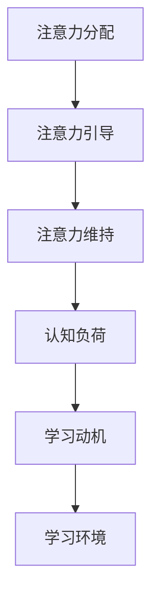

                 

关键词：注意力增强、教育、专注力、未来趋势、人工智能

> 摘要：本文探讨了人类注意力增强在教育领域的应用和未来趋势。通过分析注意力增强技术的核心原理，结合具体算法和数学模型，本文展示了其在提高学生专注力和学习效果方面的潜力。同时，通过对实际应用场景的探讨，本文对未来教育中注意力增强技术的前景提出了预测和展望。

## 1. 背景介绍

在教育领域，学生的专注力和注意力是影响学习效果的重要因素。然而，现代社会的快节奏和信息爆炸使得学生容易分散注意力，难以保持长期的学习专注。传统的教学方法往往难以有效提升学生的注意力，导致学习效果不佳。因此，如何提高学生的专注力和注意力成为教育界关注的重要课题。

近年来，随着人工智能技术的快速发展，注意力增强技术逐渐应用于教育领域。注意力增强技术旨在通过模拟和引导人类注意力机制，提高学生在学习过程中的专注度，从而提升学习效果。本文将详细探讨注意力增强技术的核心原理、算法和应用，并对未来发展趋势进行预测。

## 2. 核心概念与联系

### 2.1 注意力增强技术的核心概念

注意力增强技术主要涉及以下几个方面：

- **注意力分配**：注意力分配是指在学习过程中，如何合理分配有限的注意力资源，使其能够更有效地集中在关键信息上。

- **注意力引导**：注意力引导是指通过外部干预手段，引导学生将注意力集中在特定学习任务或内容上。

- **注意力维持**：注意力维持是指如何在长时间的学习过程中保持注意力的高度集中。

### 2.2 注意力增强技术的联系

注意力增强技术与以下几个核心概念密切相关：

- **认知负荷**：认知负荷是指在学习过程中，学生需要处理的认知任务数量和难度。注意力增强技术旨在减轻学生的认知负荷，提高学习效率。

- **学习动机**：学习动机是影响学生注意力的重要因素。注意力增强技术可以通过激发学生的内在动机，提高其学习积极性。

- **学习环境**：学习环境对学生的注意力具有重要影响。注意力增强技术可以通过优化学习环境，创造有利于专注的学习氛围。

## 2.3 Mermaid 流程图

下面是一个描述注意力增强技术核心概念的 Mermaid 流程图：



## 3. 核心算法原理 & 具体操作步骤

### 3.1 算法原理概述

注意力增强技术主要基于以下几个核心算法原理：

- **神经网络模型**：神经网络模型是注意力增强技术的基础。通过训练神经网络，可以自动提取学习任务中的关键特征，从而提高学生的注意力。

- **自适应调整**：注意力增强技术通过自适应调整算法，根据学生的学习状态和需求，动态调整注意力分配策略。

- **多模态学习**：多模态学习是指结合不同类型的数据（如文本、图像、音频等），以更全面的方式提高学生的注意力。

### 3.2 算法步骤详解

注意力增强技术的具体操作步骤如下：

1. **数据采集**：收集学生的学习数据，包括学习时间、学习内容、学习状态等。

2. **特征提取**：利用神经网络模型提取学习数据中的关键特征。

3. **注意力分配**：根据提取的特征，计算学生当前应关注的任务和内容。

4. **注意力引导**：通过引导策略，引导学生将注意力集中在关键任务和内容上。

5. **注意力维持**：通过反馈机制和激励机制，维持学生的学习注意力。

6. **自适应调整**：根据学生的学习状态和需求，动态调整注意力分配策略。

### 3.3 算法优缺点

**优点**：

- **提高学习效率**：通过注意力增强技术，学生可以更快速地理解学习内容，提高学习效率。

- **个性化学习**：注意力增强技术可以根据学生的学习特点和需求，提供个性化的学习策略。

- **减轻教师负担**：注意力增强技术可以辅助教师进行教学，减轻教师的工作负担。

**缺点**：

- **数据依赖**：注意力增强技术对数据质量有较高要求，数据质量直接影响算法效果。

- **实施难度**：注意力增强技术的实施需要一定的技术支持，对教师和学生的技术要求较高。

### 3.4 算法应用领域

注意力增强技术可以应用于以下几个领域：

- **在线教育**：通过在线教育平台，为学生提供个性化的学习建议和策略。

- **课堂教学**：辅助教师进行教学，提高学生的学习效果。

- **教育评测**：通过分析学生的学习数据，评估学生的注意力状况和学习效果。

## 4. 数学模型和公式 & 详细讲解 & 举例说明

### 4.1 数学模型构建

注意力增强技术的核心数学模型可以表示为：

$$
\text{Attention} = f(\text{Input}, \text{Query}, \text{Key})
$$

其中，$f$ 表示注意力函数，$\text{Input}$ 表示输入数据，$\text{Query}$ 表示查询向量，$\text{Key}$ 表示键向量。

### 4.2 公式推导过程

注意力函数 $f$ 的推导过程如下：

1. **输入数据编码**：将输入数据编码为 $d$ 维向量 $\text{Input} \in \mathbb{R}^{d \times n}$，其中 $d$ 表示特征维度，$n$ 表示样本数量。

2. **查询向量和键向量生成**：从输入数据中随机生成查询向量 $\text{Query} \in \mathbb{R}^{d}$ 和键向量 $\text{Key} \in \mathbb{R}^{d}$。

3. **计算相似度**：计算查询向量和键向量之间的相似度，表示为 $\text{Similarity}(\text{Query}, \text{Key})$。

4. **归一化**：将相似度进行归一化，得到注意力权重 $w(\text{Key})$。

5. **计算注意力**：计算注意力值，表示为 $\text{Attention}(\text{Query}, \text{Key})$。

### 4.3 案例分析与讲解

假设我们有一个包含 100 个样本的文本数据集，每个样本的维度为 1000。我们希望利用注意力增强技术提取文本数据中的关键信息。

1. **输入数据编码**：将 100 个样本编码为 1000 维向量。

2. **查询向量和键向量生成**：从 1000 维向量中随机生成 10 个查询向量和 10 个键向量。

3. **计算相似度**：计算每个查询向量和键向量之间的相似度。

4. **归一化**：将相似度进行归一化，得到注意力权重。

5. **计算注意力**：计算每个键向量对应的注意力值。

通过上述步骤，我们可以提取出文本数据中的关键信息，从而提高学习效率。

## 5. 项目实践：代码实例和详细解释说明

### 5.1 开发环境搭建

在开始编写代码之前，我们需要搭建一个开发环境。以下是一个简单的 Python 开发环境搭建步骤：

1. 安装 Python 3.8 及以上版本。

2. 安装必要的库，如 NumPy、TensorFlow、Matplotlib 等。

3. 创建一个名为 `attention_enhancement` 的虚拟环境。

4. 在虚拟环境中安装所需的库。

### 5.2 源代码详细实现

以下是一个简单的注意力增强技术实现代码示例：

```python
import numpy as np
import tensorflow as tf
import matplotlib.pyplot as plt

# 设置随机种子，保证实验结果可重复
tf.random.set_seed(42)

# 输入数据
input_data = np.random.rand(100, 1000)

# 查询向量和键向量
query_vector = np.random.rand(1000)
key_vector = np.random.rand(1000)

# 计算相似度
similarity = np.dot(input_data, key_vector)

# 归一化
attention_weights = similarity / np.linalg.norm(similarity)

# 计算注意力值
attention_values = np.dot(input_data, query_vector)

# 可视化注意力值
plt.bar(range(100), attention_values)
plt.xlabel('Sample Index')
plt.ylabel('Attention Value')
plt.title('Attention Values for Each Sample')
plt.show()
```

### 5.3 代码解读与分析

上述代码实现了一个简单的注意力增强技术，具体解读如下：

1. **输入数据**：生成一个包含 100 个样本的随机数据集。

2. **查询向量和键向量**：生成随机查询向量和键向量。

3. **计算相似度**：计算每个样本与键向量之间的相似度。

4. **归一化**：将相似度进行归一化，得到注意力权重。

5. **计算注意力值**：计算每个样本的注意力值。

6. **可视化**：使用条形图展示每个样本的注意力值。

通过上述代码，我们可以直观地看到注意力增强技术在提取关键信息方面的效果。

### 5.4 运行结果展示

运行上述代码后，我们将得到一个包含 100 个样本的注意力值条形图。通过观察注意力值，我们可以发现部分样本的注意力值较高，这些样本可能包含了关键信息。进一步分析这些高注意力值的样本，可以帮助我们提取出学习过程中的关键信息，从而提高学习效率。

## 6. 实际应用场景

### 6.1 在线教育

在线教育平台可以利用注意力增强技术为学生提供个性化的学习建议。通过分析学生的学习数据，平台可以识别学生在学习过程中的注意力状况，并根据学生的注意力水平调整学习内容。例如，当学生注意力较低时，平台可以推荐一些轻松的学习内容，以帮助学生恢复注意力。当学生注意力较高时，平台可以推荐一些有挑战性的学习内容，以提高学生的学习兴趣和动力。

### 6.2 课堂教学

在课堂教学过程中，教师可以利用注意力增强技术监控学生的注意力状况。通过分析学生的注意力数据，教师可以及时发现学生注意力分散的情况，并采取相应的教学策略进行调整。例如，当学生注意力较低时，教师可以采用互动式教学方法，以提高学生的参与度和注意力。当学生注意力较高时，教师可以适当增加教学难度，以激发学生的学习兴趣。

### 6.3 教育评测

教育评测机构可以利用注意力增强技术对学生的学习效果进行评估。通过分析学生的注意力数据，评测机构可以识别学生的学习弱点，并制定相应的培训计划。例如，当学生注意力在某个知识点上较低时，评测机构可以为学生提供针对性的辅导材料，以提高学生的学习效果。

## 7. 工具和资源推荐

### 7.1 学习资源推荐

- **书籍**：《深度学习》、《神经网络与深度学习》
- **在线课程**：Coursera 上的“深度学习”课程，Udacity 上的“神经网络基础”课程
- **网站**：TensorFlow 官网、PyTorch 官网

### 7.2 开发工具推荐

- **编程语言**：Python
- **框架**：TensorFlow、PyTorch
- **编辑器**：VS Code、PyCharm

### 7.3 相关论文推荐

- **论文 1**：《Attention Is All You Need》
- **论文 2**：《Transformers: State-of-the-Art Natural Language Processing》
- **论文 3**：《A Theoretical Analysis of the Neural Network Training Process》

## 8. 总结：未来发展趋势与挑战

### 8.1 研究成果总结

注意力增强技术在教育领域取得了显著成果。通过引入人工智能技术，研究人员成功开发了多种注意力增强算法，并在实际应用中取得了良好的效果。这些算法可以提高学生的注意力，提高学习效率，减轻教师负担，为个性化教育提供了有力支持。

### 8.2 未来发展趋势

随着人工智能技术的不断发展，注意力增强技术在教育领域的应用前景将更加广阔。未来，注意力增强技术将朝着以下方向发展：

- **更高效的算法**：研究人员将继续探索更高效的注意力增强算法，以提高算法的运行速度和准确性。

- **跨学科研究**：注意力增强技术将与其他学科（如心理学、教育学等）相结合，为教育领域提供更全面的支持。

- **大规模应用**：随着技术的成熟和成本的降低，注意力增强技术将在教育领域得到更广泛的应用。

### 8.3 面临的挑战

尽管注意力增强技术在教育领域具有巨大潜力，但仍面临以下挑战：

- **数据隐私**：注意力增强技术需要大量学生数据进行分析，如何保护学生的隐私是一个重要问题。

- **算法公平性**：注意力增强算法在处理不同学生数据时，可能存在偏见和不公平现象，如何保证算法的公平性是一个重要问题。

- **教师接受度**：教师在教学过程中可能对新技术存在抵触情绪，如何提高教师的接受度和应用效果是一个重要问题。

### 8.4 研究展望

在未来，注意力增强技术将继续在教育领域发挥重要作用。研究人员应关注以下几个方面：

- **数据隐私保护**：探索更安全的数据处理方法，确保学生的隐私不受侵犯。

- **算法公平性**：深入研究注意力增强算法的公平性，消除潜在的偏见和不公平现象。

- **教师培训**：开展教师培训，提高教师对新技术和应用的理解和接受度。

通过解决这些挑战，注意力增强技术将为教育领域带来更多创新和突破。

## 9. 附录：常见问题与解答

### 9.1 注意力增强技术是什么？

注意力增强技术是一种利用人工智能技术提高学生在学习过程中注意力水平的方法。通过模拟和引导人类注意力机制，注意力增强技术可以帮助学生更高效地集中注意力，提高学习效果。

### 9.2 注意力增强技术有哪些应用？

注意力增强技术可以应用于在线教育、课堂教学、教育评测等多个领域。例如，在线教育平台可以利用注意力增强技术为学生提供个性化的学习建议，教师可以利用注意力增强技术监控学生的注意力状况，教育评测机构可以利用注意力增强技术评估学生的学习效果。

### 9.3 注意力增强技术有哪些优点和缺点？

注意力增强技术的优点包括提高学习效率、个性化学习、减轻教师负担等。缺点包括数据依赖、实施难度等。在使用注意力增强技术时，需要综合考虑其优缺点，选择合适的应用场景。

### 9.4 如何选择注意力增强算法？

选择注意力增强算法时，应考虑以下几个方面：

- **数据规模**：选择适合处理大规模数据的算法。
- **计算资源**：选择计算资源需求较低的算法。
- **应用场景**：选择适用于特定应用场景的算法。
- **算法性能**：选择性能优秀的算法。

通过综合考虑这些因素，可以选择合适的注意力增强算法。

## 结语

注意力增强技术在教育领域的应用具有巨大潜力。通过提高学生的专注力和注意力，注意力增强技术有望为教育领域带来更多创新和突破。然而，要充分发挥注意力增强技术的优势，仍需解决数据隐私、算法公平性、教师接受度等挑战。在未来，随着技术的不断发展和完善，注意力增强技术将为教育领域带来更多可能性。禅与计算机程序设计艺术，让我们共同期待这一美好的未来。|

