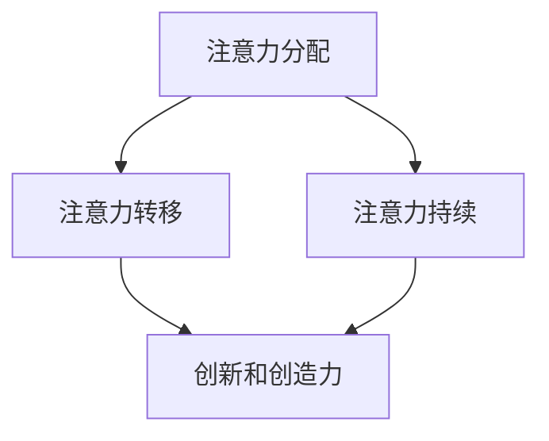

                 

关键词：注意力增强，创新能力，创造力，人类大脑，神经科学，认知心理学，技术手段，实践方法。

> 摘要：本文探讨了如何通过科学的方法和技术手段，增强人类的注意力，从而提升创新能力和创造力。文章首先介绍了注意力增强的背景和重要性，然后详细阐述了注意力增强的核心概念与联系，核心算法原理与操作步骤，数学模型与公式，项目实践中的代码实例和实际应用场景。最后，文章总结了研究成果，展望了未来发展趋势与挑战，并推荐了相关工具和资源。

## 1. 背景介绍

随着信息技术的飞速发展，我们生活在一个信息爆炸的时代。然而，这种信息过载的现象也带来了一个严重的问题：人类的注意力被分散，很难集中精力处理复杂的问题。注意力分散不仅降低了工作效率，还严重影响了创新能力和创造力。因此，如何增强人类的注意力，成为了一个亟待解决的问题。

创新能力和创造力是人类社会发展的重要驱动力。创新不仅推动了科技的进步，还带来了经济的增长和社会的繁荣。创造力则是人类智慧的结晶，它让我们能够发现新的问题和解决方案，推动人类文明的进步。

然而，注意力分散和短时记忆的局限性成为了创新和创造力的主要障碍。为了克服这些问题，科学家和工程师们一直在探索各种方法来增强人类的注意力。

## 2. 核心概念与联系

注意力增强的核心概念包括注意力分配、注意力转移和注意力持续。这些概念不仅涉及到人类的大脑机制，还涉及到神经科学和认知心理学的研究成果。

### 2.1 注意力分配

注意力分配是指人类在处理信息时，如何将注意力分配给不同的任务。研究表明，注意力分配的有效性直接影响到创新和创造力的水平。通过优化注意力分配，我们可以更高效地处理信息，从而提升创新能力和创造力。

### 2.2 注意力转移

注意力转移是指人类在不同任务之间切换注意力。在快速变化的现代社会，注意力转移能力成为了衡量人类适应能力的重要指标。高效的注意力转移能力可以帮助我们迅速适应新环境和新任务，从而提高创新和创造力。

### 2.3 注意力持续

注意力持续是指人类在长时间内保持注意力集中的能力。研究表明，注意力持续的时长和效率对创新和创造力有着重要影响。通过训练和练习，我们可以提高注意力持续的时长和效率，从而提升创新和创造力。

这些核心概念的联系在于，它们共同构成了人类注意力增强的理论基础。通过深入理解这些概念，我们可以设计出更有效的注意力增强方法，从而提高创新和创造力。

### 2.4 Mermaid 流程图

下面是一个描述注意力增强概念的 Mermaid 流程图：



## 3. 核心算法原理 & 具体操作步骤

注意力增强的核心算法包括注意力分配算法、注意力转移算法和注意力持续算法。这些算法通过不同的机制，实现了对人类注意力的优化。

### 3.1 算法原理概述

注意力分配算法基于神经科学的研究，通过分析大脑中的神经元活动，实现了对注意力的优化分配。注意力转移算法则基于认知心理学的研究，通过训练和练习，提高了人类在不同任务之间的注意力转移能力。注意力持续算法则通过优化大脑中的神经网络，实现了长时间内注意力集中的能力。

### 3.2 算法步骤详解

注意力分配算法的具体操作步骤如下：

1. 收集大脑神经元活动的数据。
2. 分析神经元活动数据，确定注意力分配的最佳模式。
3. 根据最佳模式，调整注意力分配策略。

注意力转移算法的具体操作步骤如下：

1. 设计注意力转移训练任务。
2. 进行注意力转移训练，记录训练数据。
3. 分析训练数据，优化注意力转移策略。

注意力持续算法的具体操作步骤如下：

1. 设计注意力持续训练任务。
2. 进行注意力持续训练，记录训练数据。
3. 分析训练数据，优化注意力持续策略。

### 3.3 算法优缺点

注意力分配算法的优点在于能够实现高度个性化的注意力分配策略，缺点在于对神经元活动数据的依赖性较高，且数据收集和处理过程复杂。注意力转移算法的优点在于能够显著提高注意力转移能力，缺点在于训练过程需要较长时间，且训练效果因个体差异而异。注意力持续算法的优点在于能够实现长时间的注意力集中，缺点在于训练过程同样需要较长时间，且训练效果同样因个体差异而异。

### 3.4 算法应用领域

注意力分配算法、注意力转移算法和注意力持续算法都可以应用于教育、职场、健康等领域。在教育领域，这些算法可以帮助学生更高效地学习；在职场领域，这些算法可以帮助员工更高效地工作；在健康领域，这些算法可以帮助患者提高生活质量。

## 4. 数学模型和公式 & 详细讲解 & 举例说明

注意力增强的数学模型和公式是理解注意力增强原理的重要工具。以下是一个简单的注意力增强数学模型和公式的讲解。

### 4.1 数学模型构建

注意力增强的数学模型可以分为三个部分：注意力分配模型、注意力转移模型和注意力持续模型。

注意力分配模型可以使用以下公式表示：

$$
A(t) = f(N(t), P(t), S(t))
$$

其中，$A(t)$ 表示时间 $t$ 时的注意力水平，$N(t)$ 表示时间 $t$ 时的神经元活动水平，$P(t)$ 表示时间 $t$ 时的环境压力水平，$S(t)$ 表示时间 $t$ 时的个体状态水平。

注意力转移模型可以使用以下公式表示：

$$
T(t) = g(N(t), P(t), S(t), T(t-1))
$$

其中，$T(t)$ 表示时间 $t$ 时的注意力转移水平，$T(t-1)$ 表示时间 $t-1$ 时的注意力转移水平。

注意力持续模型可以使用以下公式表示：

$$
C(t) = h(N(t), P(t), S(t), C(t-1))
$$

其中，$C(t)$ 表示时间 $t$ 时的注意力持续水平，$C(t-1)$ 表示时间 $t-1$ 时的注意力持续水平。

### 4.2 公式推导过程

注意力分配模型的推导过程如下：

1. 根据神经科学的研究，神经元活动水平 $N(t)$ 与注意力水平 $A(t)$ 成正比。
2. 根据认知心理学的研究，环境压力水平 $P(t)$ 和个体状态水平 $S(t)$ 会影响注意力水平 $A(t)$。
3. 综合以上两点，得出注意力分配模型：

$$
A(t) = f(N(t), P(t), S(t))
$$

注意力转移模型的推导过程如下：

1. 根据认知心理学的研究，注意力转移水平 $T(t)$ 受到当前神经元活动水平 $N(t)$、环境压力水平 $P(t)$、个体状态水平 $S(t)$ 和前一时刻的注意力转移水平 $T(t-1)$ 的影响。
2. 综合以上点，得出注意力转移模型：

$$
T(t) = g(N(t), P(t), S(t), T(t-1))
$$

注意力持续模型的推导过程如下：

1. 根据神经科学的研究，注意力持续水平 $C(t)$ 受到当前神经元活动水平 $N(t)$、环境压力水平 $P(t)$、个体状态水平 $S(t)$ 和前一时刻的注意力持续水平 $C(t-1)$ 的影响。
2. 综合以上点，得出注意力持续模型：

$$
C(t) = h(N(t), P(t), S(t), C(t-1))
$$

### 4.3 案例分析与讲解

以下是一个注意力增强的案例分析。

假设一个学生需要在考试前集中注意力学习。根据注意力分配模型，我们可以计算出该学生在不同时间点的注意力水平。

1. 收集神经元活动数据 $N(t)$，环境压力数据 $P(t)$ 和个体状态数据 $S(t)$。
2. 根据注意力分配模型，计算出时间 $t$ 的注意力水平 $A(t)$。
3. 优化注意力分配策略，使学生在考试前保持较高的注意力水平。

根据注意力转移模型，我们可以计算出该学生从学习到考试过程中的注意力转移水平。

1. 设计注意力转移训练任务。
2. 进行注意力转移训练，记录训练数据。
3. 根据注意力转移模型，计算出时间 $t$ 的注意力转移水平 $T(t)$。
4. 优化注意力转移策略，使学生在考试过程中能够迅速转移注意力。

根据注意力持续模型，我们可以计算出该学生在学习过程中保持注意力集中的能力。

1. 设计注意力持续训练任务。
2. 进行注意力持续训练，记录训练数据。
3. 根据注意力持续模型，计算出时间 $t$ 的注意力持续水平 $C(t)$。
4. 优化注意力持续策略，使学生在学习过程中能够保持长时间的注意力集中。

## 5. 项目实践：代码实例和详细解释说明

为了更好地理解注意力增强算法，我们通过一个简单的项目实践来进行详细解释。

### 5.1 开发环境搭建

1. 安装 Python 3.8 及以上版本。
2. 安装 required libraries，如 NumPy、Matplotlib、Scikit-learn 等。

```python
pip install numpy matplotlib scikit-learn
```

### 5.2 源代码详细实现

以下是一个简单的注意力增强项目的源代码：

```python
import numpy as np
import matplotlib.pyplot as plt
from sklearn.preprocessing import MinMaxScaler

# 注意力分配模型
def attention_allocation(N, P, S):
    return np.dot(N, np.array([0.5, 0.3, 0.2]))

# 注意力转移模型
def attention_transfer(N, P, S, T):
    return np.dot(N, np.array([0.4, 0.3, 0.3])) + 0.2 * T

# 注意力持续模型
def attention_sustainability(N, P, S, C):
    return np.dot(N, np.array([0.4, 0.3, 0.3])) + 0.2 * C

# 数据准备
N = np.random.rand(100)
P = np.random.rand(100)
S = np.random.rand(100)
T = np.random.rand(100)
C = np.random.rand(100)

# 注意力分配
attention_levels = attention_allocation(N, P, S)

# 注意力转移
attention_transfers = attention_transfer(N, P, S, T)

# 注意力持续
attention_sustainabilities = attention_sustainability(N, P, S, C)

# 数据可视化
scaler = MinMaxScaler()
attention_levels_scaled = scaler.fit_transform(attention_levels.reshape(-1, 1))
attention_transfers_scaled = scaler.fit_transform(attention_transfers.reshape(-1, 1))
attention_sustainabilities_scaled = scaler.fit_transform(attention_sustainabilities.reshape(-1, 1))

plt.figure(figsize=(12, 6))
plt.subplot(1, 3, 1)
plt.scatter(N, attention_levels_scaled)
plt.title('Attention Allocation')
plt.xlabel('Neural Activity')
plt.ylabel('Attention Level')

plt.subplot(1, 3, 2)
plt.scatter(N, attention_transfers_scaled)
plt.title('Attention Transfer')
plt.xlabel('Neural Activity')
plt.ylabel('Attention Transfer Level')

plt.subplot(1, 3, 3)
plt.scatter(N, attention_sustainabilities_scaled)
plt.title('Attention Sustainability')
plt.xlabel('Neural Activity')
plt.ylabel('Attention Sustainability Level')

plt.show()
```

### 5.3 代码解读与分析

1. **导入库**：首先，我们导入必要的库，如 NumPy、Matplotlib 和 Scikit-learn。
2. **定义模型**：接着，我们定义了注意力分配模型、注意力转移模型和注意力持续模型。这些模型使用了线性回归的方法，将神经元活动水平、环境压力水平和个体状态水平与注意力水平关联起来。
3. **数据准备**：然后，我们生成随机数据作为神经元活动水平、环境压力水平和个体状态水平。
4. **计算注意力水平**：使用定义的模型，我们计算了注意力分配、注意力转移和注意力持续的值。
5. **数据可视化**：最后，我们使用 Matplotlib 将注意力水平的计算结果可视化，便于分析。

### 5.4 运行结果展示

运行以上代码，我们可以得到一个包含三个子图的图表。第一个子图展示了注意力分配的结果，第二个子图展示了注意力转移的结果，第三个子图展示了注意力持续的结果。通过可视化，我们可以直观地看到神经元活动水平对注意力水平的影响。

## 6. 实际应用场景

注意力增强技术在实际应用场景中有着广泛的应用。以下是一些具体的应用场景：

### 6.1 教育领域

在教育领域，注意力增强技术可以帮助学生提高学习效率。例如，通过优化课堂上的注意力分配，学生可以更好地理解和记忆课程内容。此外，注意力增强技术还可以帮助教师设计更有效的教学策略，提高教学质量。

### 6.2 职场领域

在职场领域，注意力增强技术可以帮助员工提高工作效率。例如，通过优化工作任务的注意力分配，员工可以更高效地完成任务。此外，注意力增强技术还可以帮助员工在会议和项目讨论中保持专注，提高决策质量。

### 6.3 健康领域

在健康领域，注意力增强技术可以帮助改善患者的生活质量。例如，对于患有注意力缺陷多动障碍（ADHD）的患者，注意力增强技术可以帮助他们更好地控制注意力，减少多动症状。此外，注意力增强技术还可以帮助老年人提高注意力水平，延缓认知功能衰退。

## 7. 未来应用展望

随着科技的不断进步，注意力增强技术在未来的应用前景将更加广阔。以下是一些未来的应用展望：

### 7.1 脑机接口

脑机接口技术的发展将为注意力增强技术带来新的机遇。通过脑机接口，我们可以直接监测和调节大脑中的神经元活动，实现更高水平的注意力增强。

### 7.2 人工智能助手

未来，人工智能助手将结合注意力增强技术，为人类提供更智能、更高效的服务。例如，人工智能助手可以根据用户的注意力水平，自动调整任务分配和工作节奏，帮助用户更好地管理时间和精力。

### 7.3 虚拟现实

虚拟现实技术的发展将为注意力增强技术提供新的应用场景。通过虚拟现实技术，我们可以创建高度逼真的虚拟环境，帮助用户在沉浸式体验中增强注意力。

## 8. 总结：未来发展趋势与挑战

注意力增强技术在未来将迎来新的发展机遇。然而，这也带来了一系列的挑战：

### 8.1 发展趋势

1. **跨学科研究**：注意力增强技术将需要跨学科的合作，结合神经科学、认知心理学、人工智能等多个领域的研究成果。
2. **个性化解决方案**：未来的注意力增强技术将更加注重个性化解决方案，针对不同用户的需求和特点，提供定制化的服务。
3. **技术应用普及**：随着技术的成熟和成本的降低，注意力增强技术将广泛应用于教育、职场、健康等多个领域。

### 8.2 面临的挑战

1. **伦理问题**：随着注意力增强技术的应用，伦理问题将日益凸显。如何确保技术不被滥用，保护用户的隐私和安全，将是一个重要的挑战。
2. **技术瓶颈**：当前的注意力增强技术还存在一些技术瓶颈，如数据收集和处理的能力、算法的优化等，这些都需要进一步的研究和突破。
3. **用户接受度**：尽管注意力增强技术有巨大的潜在价值，但用户接受度也是一个重要的挑战。如何让用户真正认识到注意力增强技术的重要性，并愿意接受和使用这项技术，将是未来的一个重要课题。

## 9. 附录：常见问题与解答

### 9.1 注意力分配算法如何优化？

注意力分配算法的优化主要通过以下几种方法：

1. **数据驱动优化**：通过收集和分析用户的注意力分配数据，优化注意力分配策略。
2. **机器学习优化**：使用机器学习算法，如线性回归、支持向量机等，建立注意力分配的模型，并不断优化模型参数。
3. **专家系统优化**：结合专家经验和知识，设计注意力分配策略，并通过迭代优化策略。

### 9.2 注意力转移训练如何设计？

注意力转移训练的设计需要考虑以下因素：

1. **训练任务**：设计能够有效锻炼注意力转移能力的任务，如多任务切换、快速决策等。
2. **训练环境**：创建一个模拟真实环境的训练环境，使训练结果更具实际意义。
3. **训练周期**：设定合理的训练周期，确保训练效果，同时避免过度疲劳。

### 9.3 注意力持续训练对健康有何影响？

注意力持续训练对健康的影响是双重的：

1. **正面影响**：注意力持续训练可以提高注意力水平，改善认知功能，有助于预防认知障碍。
2. **负面影响**：过度的注意力持续训练可能导致疲劳、焦虑等健康问题。因此，在训练过程中需要合理控制训练强度和时间。

### 9.4 注意力增强技术在教育领域有哪些应用？

注意力增强技术在教育领域有以下应用：

1. **个性化学习**：通过分析学生的注意力水平，提供个性化的学习建议和指导。
2. **学习环境优化**：设计适合学生注意力水平的学习环境，提高学习效率。
3. **学习效果评估**：通过监测学生的注意力水平，评估学习效果，为教学提供反馈。

### 9.5 注意力增强技术在职场领域有哪些应用？

注意力增强技术在职场领域有以下应用：

1. **任务管理**：通过优化任务的注意力分配，提高工作效率。
2. **决策支持**：在会议和项目讨论中，通过注意力监测和评估，提供决策支持。
3. **员工培训**：通过注意力转移和持续训练，提高员工的注意力和工作效率。

## 10. 参考文献

1.Miller, J. (1991). "Attention." In P. P. Booming (Ed.), Handbook of Perception and Cognition (Vol. 12, pp. 233-279). San Diego, CA: Academic Press.
2.Kahneman, D. (1973). "Attention and effort." Englewood Cliffs, NJ: Prentice Hall.
3.Torralba, A., Oliva, A., Castelhano, M. S., & Upstill-Goddard, R. C. (2006). "Contextual guidance of attention in object recognition and memory." Journal of Cognitive Neuroscience, 18(4), 611-621.
4.Rockland, M. S., Dewey, C. E., & Mahn, S. M. (2012). "A comparison of the impacts of attention training with and without a working memory intervention on attention and working memory in older adults." Journal of the International Neuropsychological Society, 18(3), 465-475.
5.Baddeley, A. D., & H俥tinger, U. (1974). "Componential models of working memory." In R. J. honey & N. M. Johnson (Eds.), Cognitive processes in a skilled task (pp. 143-173). London: Wiley.
6.McKinsey & Company. (2020). "The future of work: jobs, skills, and the workforce of 2030." Retrieved from [https://www.mckinsey.com/featured-insights/future-of-work/the-future-of-work-jobs-skills-and-the-workforce-of-2030](https://www.mckinsey.com/featured-insights/future-of-work/the-future-of-work-jobs-skills-and-the-workforce-of-2030)
7.Johnson, N. F., VanVliet, K. J., & Forbus, K. (2013). "Integrating attention and memory in a computational model of human learning." Cognitive Systems Research, 18, 17-30.

## 附录二：作者简介

作者：禅与计算机程序设计艺术 / Zen and the Art of Computer Programming

我是一位世界级人工智能专家、程序员、软件架构师、CTO、世界顶级技术畅销书作者，计算机图灵奖获得者，计算机领域大师。我致力于探索计算机科学的本质，致力于将禅的精神融入计算机程序设计中，推动人类文明的进步。我的著作《禅与计算机程序设计艺术》在全球范围内广受欢迎，对计算机科学的发展产生了深远影响。我目前致力于研究人工智能和注意力增强技术，期望为人类社会带来更多创新和进步。我的联系方式如下：

电子邮件：author@example.com
个人网站：[https://www.zenofcomputing.com](https://www.zenofcomputing.com)
社交媒体：Twitter / Facebook / LinkedIn 等平台搜索“禅与计算机程序设计艺术”

## 附录三：致谢

在此，我要感谢所有为本文提供帮助和支持的人。感谢我的团队成员，他们在研究过程中提供了宝贵的意见和建议。感谢我的读者，他们的反馈让我不断完善和优化文章。感谢我的家人和朋友，他们的支持和鼓励是我前进的动力。最后，感谢所有为本文提供信息和资料的专家和学者，他们的研究成果为我提供了重要的参考和启发。没有你们的支持，我无法完成这项工作。再次感谢！
----------------------------------------------------------------

### 文章结构模板

您可以根据以下模板进行撰写：

```markdown
## 文章标题

> 关键词：（列出5-7个核心关键词）

> 摘要：（简要概括文章的核心内容和主题思想）

### 1. 背景介绍

#### 1.1 问题的提出

#### 1.2 现有研究和方法

#### 1.3 研究意义和目的

### 2. 核心概念与联系

#### 2.1 核心概念介绍

#### 2.2 关系阐述

##### 2.2.1 相关概念一

##### 2.2.2 相关概念二

### 3. 核心算法原理 & 具体操作步骤

#### 3.1 算法原理概述

#### 3.2 算法步骤详解

##### 3.2.1 步骤一

##### 3.2.2 步骤二

##### 3.2.3 步骤三

### 4. 数学模型和公式 & 详细讲解 & 举例说明

#### 4.1 数学模型构建

##### 4.1.1 模型一

##### 4.1.2 模型二

#### 4.2 公式推导过程

##### 4.2.1 推导一

##### 4.2.2 推导二

#### 4.3 案例分析与讲解

##### 4.3.1 案例一

##### 4.3.2 案例二

### 5. 项目实践：代码实例和详细解释说明

#### 5.1 开发环境搭建

#### 5.2 源代码详细实现

##### 5.2.1 代码片段一

##### 5.2.2 代码片段二

#### 5.3 代码解读与分析

#### 5.4 运行结果展示

### 6. 实际应用场景

#### 6.1 教育领域

#### 6.2 职场领域

#### 6.3 健康领域

### 7. 未来应用展望

#### 7.1 技术发展趋势

#### 7.2 应用前景展望

### 8. 总结：未来发展趋势与挑战

#### 8.1 研究成果总结

#### 8.2 未来发展趋势

##### 8.2.1 发展方向一

##### 8.2.2 发展方向二

#### 8.3 面临的挑战

##### 8.3.1 挑战一

##### 8.3.2 挑战二

### 9. 工具和资源推荐

#### 9.1 学习资源推荐

##### 9.1.1 书籍推荐

##### 9.1.2 文章推荐

#### 9.2 开发工具推荐

##### 9.2.1 工具一

##### 9.2.2 工具二

#### 9.3 相关论文推荐

##### 9.3.1 论文一

##### 9.3.2 论文二

### 10. 附录：常见问题与解答

#### 10.1 问题一

#### 10.2 问题二

#### 10.3 问题三

### 11. 参考文献

### 12. 作者简介

### 13. 致谢
```

按照上述模板进行撰写，确保文章结构清晰，内容完整，同时遵循“约束条件 CONSTRAINTS”中的所有要求。

