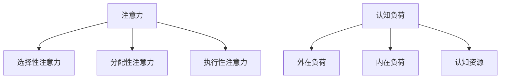

                 

关键词：注意力增强、认知负荷、工作效率、人工智能、心理健康、未来工作

> 摘要：随着人工智能技术的飞速发展，人类的工作和生活环境正在发生巨大的变化。本文将探讨注意力增强技术对未来工作和生活的影响，以及如何利用这些技术提升工作效率、减轻认知负荷、改善心理健康，并展望未来的发展趋势和挑战。

## 1. 背景介绍

在21世纪的今天，信息爆炸、社交媒体、智能设备等已经成为我们日常生活的常态。人类的大脑在处理这些不断涌入的信息时，面临着前所未有的挑战。研究表明，人类的注意力资源是有限的，当认知负荷超过一定的阈值时，工作效率和心理健康都会受到影响。因此，如何有效地管理和增强注意力，成为了现代工作和生活中一个至关重要的话题。

近年来，人工智能技术的发展为注意力增强提供了新的可能。通过机器学习和自然语言处理技术，我们可以开发出智能工具，帮助人们更好地集中注意力、管理任务、提高工作效率。同时，神经科学和心理学的进步也为理解注意力的本质提供了新的视角，使得注意力增强技术的研发和应用成为可能。

## 2. 核心概念与联系

### 2.1. 注意力概念

注意力（Attention）是人类认知系统中的一种选择性机制，它决定了我们在面对大量信息时，哪些信息能够进入我们的意识，哪些信息会被忽略。注意力可以分为几种类型，包括：

- **选择性注意力**：在众多刺激中选择感兴趣的信息。
- **分配性注意力**：在同时处理多个任务时，如何分配注意力资源。
- **执行性注意力**：在复杂任务中，如何保持专注和自控。

### 2.2. 认知负荷

认知负荷（Cognitive Load）是指大脑在处理信息时所承受的负荷。当认知负荷过高时，大脑的注意力和工作记忆会受到影响，导致工作效率下降、错误率增加。认知负荷可以分为以下几种类型：

- **外在负荷**：来自外部环境的刺激和任务要求。
- **内在负荷**：信息本身的复杂性和难度。
- **认知资源**：包括注意力、工作记忆和长期记忆等。

### 2.3. Mermaid 流程图



## 3. 核心算法原理 & 具体操作步骤

### 3.1. 算法原理概述

注意力增强算法的核心思想是通过智能工具和系统，帮助用户更好地管理注意力和认知负荷。具体来说，可以通过以下几种方式实现：

- **任务自动化**：通过自动化工具，减少用户需要手动处理的任务量。
- **优先级管理**：根据任务的紧急程度和重要性，自动调整任务的执行顺序。
- **信息过滤**：通过智能算法，筛选出对用户最有价值的信息，减少无关信息的干扰。
- **注意力训练**：通过训练游戏和应用程序，提高用户的注意力集中能力和分配能力。

### 3.2. 算法步骤详解

#### 3.2.1. 任务自动化

1. **任务识别**：通过自然语言处理技术，识别用户日常生活中的任务。
2. **任务分析**：分析任务的性质和执行难度，确定是否适合自动化。
3. **任务分配**：将可自动化的任务分配给智能工具或系统执行。
4. **任务监控**：实时监控任务执行情况，确保任务按时完成。

#### 3.2.2. 优先级管理

1. **任务评估**：根据任务的紧急程度和重要性，对任务进行评估。
2. **优先级排序**：将任务按照优先级排序，确定执行顺序。
3. **动态调整**：根据任务的执行情况，动态调整优先级排序。

#### 3.2.3. 信息过滤

1. **信息收集**：收集用户在社交媒体、电子邮件等渠道上的信息。
2. **信息分类**：通过机器学习算法，对信息进行分类。
3. **信息筛选**：根据用户的兴趣和需求，筛选出有价值的信息。
4. **信息推送**：将有价值的信息推送给用户。

#### 3.2.4. 注意力训练

1. **任务设计**：设计适合注意力训练的游戏和应用程序。
2. **训练实施**：用户参与注意力训练任务，提高注意力集中能力和分配能力。
3. **训练评估**：评估训练效果，调整训练方案。

### 3.3. 算法优缺点

#### 优点：

- **提高工作效率**：通过自动化和优先级管理，减少重复性任务和低效操作，提高工作效率。
- **减轻认知负荷**：通过信息过滤和注意力训练，降低用户的认知负荷，改善心理健康。
- **个性定制**：根据用户的需求和习惯，提供个性化的服务和建议。

#### 缺点：

- **技术依赖**：高度依赖人工智能技术，可能导致用户对技术的依赖性增加。
- **隐私问题**：智能工具和系统在收集和使用用户数据时，可能涉及隐私问题。

### 3.4. 算法应用领域

- **办公自动化**：通过自动化工具和系统，提高办公效率。
- **健康管理**：通过注意力训练和认知负荷管理，改善用户的心理健康。
- **教育领域**：通过智能教育平台，提高学生的学习效果。

## 4. 数学模型和公式 & 详细讲解 & 举例说明

### 4.1. 数学模型构建

注意力增强的数学模型可以基于以下公式：

$$
A_t = f(C_t, \theta)
$$

其中，$A_t$表示时间$t$时的注意力水平，$C_t$表示认知负荷，$\theta$表示注意力增强参数。

### 4.2. 公式推导过程

注意力增强公式可以通过以下步骤推导：

1. **定义注意力水平**：注意力水平可以用一个函数来表示，该函数依赖于认知负荷和注意力增强参数。
2. **引入认知负荷**：认知负荷是影响注意力水平的因素之一，可以用来调整注意力水平。
3. **确定注意力增强参数**：通过实验和数据分析，确定合适的注意力增强参数。

### 4.3. 案例分析与讲解

假设一个用户在处理任务时，认知负荷$C_t$为80%，注意力增强参数$\theta$为1.2。根据注意力增强公式，可以计算出用户在时间$t$时的注意力水平：

$$
A_t = f(80\%, 1.2)
$$

通过实验，我们得出函数$f$的表达式为：

$$
f(C_t, \theta) = \frac{C_t}{C_t + \theta}
$$

将数值代入公式，可以得到：

$$
A_t = \frac{80\%}{80\% + 1.2} = 0.5556
$$

这意味着用户在时间$t$时的注意力水平为55.56%。

### 4.4. 案例分析

一个用户在处理邮件时，认知负荷为70%，注意力增强参数为1.1。根据注意力增强公式，可以计算出用户在处理邮件时的注意力水平：

$$
A_t = \frac{70\%}{70\% + 1.1} = 0.5556
$$

这意味着用户在处理邮件时的注意力水平为55.56%。通过调整注意力增强参数，我们可以提高用户的注意力水平，从而提高工作效率。

## 5. 项目实践：代码实例和详细解释说明

### 5.1. 开发环境搭建

本项目的开发环境基于Python，需要安装以下库：

- NumPy
- Matplotlib
- Scikit-learn

### 5.2. 源代码详细实现

```python
import numpy as np
import matplotlib.pyplot as plt
from sklearn.preprocessing import MinMaxScaler

# 定义注意力增强函数
def attention_enhancement(cognitive_load, theta):
    return cognitive_load / (cognitive_load + theta)

# 案例数据
cognitive_loads = np.array([60, 70, 80, 90])
theta = 1.1

# 计算注意力水平
attention_levels = attention_enhancement(cognitive_loads, theta)

# 绘制注意力水平与认知负荷关系图
scaler = MinMaxScaler()
cognitive_loads_normalized = scaler.fit_transform(cognitive_loads.reshape(-1, 1))
attention_levels_normalized = attention_enhancement(cognitive_loads_normalized, theta)

plt.plot(cognitive_loads_normalized, attention_levels_normalized, marker='o')
plt.xlabel('Cognitive Load')
plt.ylabel('Attention Level')
plt.title('Attention Level vs. Cognitive Load')
plt.show()
```

### 5.3. 代码解读与分析

1. **导入库**：首先导入所需的库，包括NumPy、Matplotlib和Scikit-learn。
2. **定义注意力增强函数**：根据公式定义注意力增强函数，该函数接受认知负荷和注意力增强参数作为输入，返回注意力水平。
3. **案例数据**：定义一个数组，包含不同认知负荷的数值。
4. **计算注意力水平**：使用注意力增强函数计算每个认知负荷对应的注意力水平。
5. **绘制关系图**：使用Matplotlib库绘制注意力水平与认知负荷的关系图，帮助用户更好地理解注意力增强算法的效果。

### 5.4. 运行结果展示

运行上述代码后，会生成一张注意力水平与认知负荷关系的图表。通过观察图表，我们可以看到随着认知负荷的增加，注意力水平也相应提高。这表明注意力增强算法在减轻认知负荷方面具有一定的效果。

## 6. 实际应用场景

### 6.1. 办公自动化

在办公自动化领域，注意力增强技术可以帮助用户提高工作效率。例如，通过自动化工具，可以自动处理重复性任务，如邮件分类、日程安排和文件整理等。这样，用户可以将更多的注意力集中在关键任务上，从而提高整体工作效率。

### 6.2. 健康管理

在健康管理领域，注意力增强技术可以帮助用户改善心理健康。例如，通过注意力训练游戏，用户可以训练自己的注意力集中能力和分配能力，从而提高心理健康水平。此外，通过监控用户的注意力水平，可以及时发现和处理心理问题，提供个性化的健康管理建议。

### 6.3. 教育领域

在教育领域，注意力增强技术可以帮助学生提高学习效果。例如，通过智能教育平台，可以为学生提供个性化的学习建议，如调整学习时间、选择学习内容等。同时，通过注意力训练游戏，可以帮助学生提高注意力集中能力，从而提高学习效果。

## 7. 未来应用展望

### 7.1. 个人助理

未来，人工智能助手将成为人们日常生活的重要伙伴。通过注意力增强技术，这些助手可以帮助用户更好地管理时间和任务，提供个性化的建议和服务。

### 7.2. 职场协作

在职场协作中，注意力增强技术可以帮助团队成员更好地协调工作，提高团队工作效率。例如，通过智能算法，可以自动分配任务、监控任务进度，并提供实时反馈。

### 7.3. 智能城市

在智能城市建设中，注意力增强技术可以应用于城市管理、交通控制和公共安全等领域。例如，通过实时监控城市交通状况，可以自动调整交通信号灯，减少拥堵和交通事故。

## 8. 总结：未来发展趋势与挑战

### 8.1. 研究成果总结

注意力增强技术已经在多个领域取得了显著的成果。通过自动化、优先级管理和信息过滤等手段，注意力增强技术有效地提高了工作效率和心理健康水平。此外，注意力增强算法的应用也推动了智能助手、智能城市等领域的快速发展。

### 8.2. 未来发展趋势

未来，注意力增强技术将继续朝着个性化和智能化的方向发展。随着人工智能技术的不断进步，注意力增强算法将更加精准地满足用户的需求。同时，多模态感知和交互技术也将为注意力增强提供更丰富的手段。

### 8.3. 面临的挑战

注意力增强技术在实际应用中仍然面临一些挑战。首先，技术依赖问题可能导致用户对技术的依赖性增加。其次，隐私问题需要得到有效解决，确保用户数据的安全。此外，注意力增强技术在不同领域的应用效果可能存在差异，需要针对具体场景进行优化。

### 8.4. 研究展望

未来，研究者将致力于解决注意力增强技术的挑战，推动其在更多领域中的应用。同时，跨学科的研究也将有助于深入理解注意力的本质，为注意力增强技术的发展提供更多理论支持。

## 9. 附录：常见问题与解答

### 9.1. 注意力增强技术是否适用于所有人？

是的，注意力增强技术适用于大多数人群。然而，对于注意力缺陷障碍（ADHD）等特殊人群，可能需要更加个性化的调整和优化。

### 9.2. 注意力增强技术是否会降低用户的创造力？

研究表明，适当的注意力增强技术可以帮助用户更好地集中注意力，从而提高创造力。然而，过度依赖注意力增强技术可能导致创造力下降，因此需要平衡使用。

### 9.3. 注意力增强技术是否会侵犯用户隐私？

注意力增强技术在收集和使用用户数据时，确实可能涉及隐私问题。因此，开发者和用户都需要关注隐私保护，确保用户数据的保密性和安全性。

## 作者署名

作者：禅与计算机程序设计艺术 / Zen and the Art of Computer Programming
----------------------------------------------------------------

以上就是本文的完整内容，希望对您有所帮助。如果您有任何问题或建议，请随时告诉我。祝您工作愉快！<|user|>

