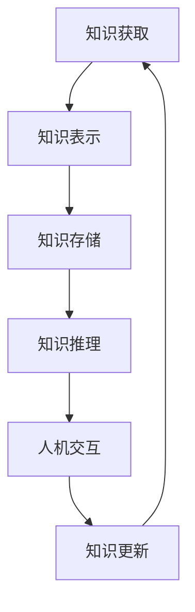

                 

关键词：人工智能、知识工程、智慧融合、人机协同、智能算法、认知科学、人机交互

> 摘要：本文探讨了人类知识与智慧在人工智能时代中的相互促进关系。通过分析知识工程和人机协同的核心概念，揭示了人工智能在提升人类认知和智慧方面的潜力。本文还探讨了当前面临的主要挑战和未来发展趋势，为人类与人工智能的共同进步提供了新的思路。

## 1. 背景介绍

### 1.1 人工智能的发展历程

人工智能（Artificial Intelligence, AI）的概念最早可以追溯到20世纪50年代。当时，人工智能的定义是“制造智能机器的科学与工程”，目标是使计算机具备人类的智能水平。自那时以来，人工智能经历了多个发展阶段，从早期的符号主义、基于规则的系统，到基于统计学的机器学习和深度学习，再到如今的多模态交互和强化学习等前沿技术。人工智能的飞速发展极大地改变了我们的生活方式和工作模式。

### 1.2 知识工程的重要性

知识工程（Knowledge Engineering）是人工智能领域的一个重要分支，旨在通过形式化表示和自动化处理知识，提高系统的智能化水平。知识工程的核心思想是将人类的专业知识转化为计算机可以理解和处理的形式，以便于在复杂问题中提供有效的解决方案。随着人工智能技术的进步，知识工程的应用范围日益广泛，从医疗诊断到智能决策，从自然语言处理到计算机视觉，知识工程已经成为人工智能发展的重要推动力。

## 2. 核心概念与联系

### 2.1 知识工程与人机协同的架构

知识工程与人机协同的架构如图1所示：



图1 知识工程与人机协同的架构

- **知识获取**：通过数据采集、专家访谈等方法获取人类的专业知识。
- **知识表示**：将获取到的知识转化为计算机可以理解和处理的形式，如知识图谱、本体论等。
- **知识存储**：将表示后的知识存储在数据库或知识库中，以便于后续查询和使用。
- **知识推理**：利用推理机对知识库中的知识进行逻辑推理，以产生新的知识和决策。
- **人机交互**：通过自然语言处理、语音识别等技术，实现人与智能系统的交互。
- **知识更新**：根据新获取的知识和用户反馈，对知识库进行动态更新。

### 2.2 核心概念原理

- **知识工程**：知识工程是一种将人类专业知识转化为计算机可处理形式的过程，旨在提高系统的智能化水平。其核心原理包括知识的表示、存储、推理和应用。
- **人机协同**：人机协同是指人与计算机系统共同完成任务的过程，旨在发挥各自的优势，实现高效、智能的工作。其核心原理包括人机交互、任务分配、协同决策等。

## 3. 核心算法原理 & 具体操作步骤

### 3.1 算法原理概述

人工智能的核心算法包括机器学习、深度学习、自然语言处理等。下面简要介绍这些算法的基本原理。

- **机器学习**：机器学习是一种通过数据训练模型，使模型具备一定智能的方法。其基本原理包括监督学习、无监督学习和强化学习等。
- **深度学习**：深度学习是一种基于人工神经网络的机器学习算法，通过多层神经网络对数据进行建模和预测。其基本原理包括前向传播、反向传播等。
- **自然语言处理**：自然语言处理是一种使计算机能够理解、处理和生成自然语言的技术。其基本原理包括词嵌入、序列标注、句法分析等。

### 3.2 算法步骤详解

以深度学习算法为例，其基本步骤如下：

1. **数据收集**：收集大量具有标注的数据，如文本、图像、语音等。
2. **数据预处理**：对收集到的数据进行处理，如文本分词、图像裁剪等。
3. **模型设计**：设计合适的神经网络结构，如卷积神经网络（CNN）、循环神经网络（RNN）等。
4. **模型训练**：使用预处理后的数据对模型进行训练，通过优化算法（如梯度下降）调整模型参数。
5. **模型评估**：使用验证集对模型进行评估，选择性能较好的模型。
6. **模型应用**：将训练好的模型应用于实际任务，如文本分类、图像识别等。

### 3.3 算法优缺点

- **机器学习**：优点包括模型可解释性强、适用范围广等；缺点包括训练时间长、对数据要求高、容易过拟合等。
- **深度学习**：优点包括模型效果优秀、适用范围广等；缺点包括模型不可解释性、参数调优复杂等。
- **自然语言处理**：优点包括处理效果较好、应用范围广等；缺点包括计算复杂度高、对数据依赖性强等。

### 3.4 算法应用领域

人工智能算法在各个领域都有广泛应用，如：

- **医疗领域**：利用机器学习和深度学习算法进行疾病诊断、药物研发等。
- **金融领域**：利用自然语言处理和机器学习算法进行风险管理、投资决策等。
- **教育领域**：利用人工智能算法进行个性化教学、学习效果评估等。
- **工业领域**：利用人工智能算法进行生产调度、质量控制等。

## 4. 数学模型和公式 & 详细讲解 & 举例说明

### 4.1 数学模型构建

以线性回归为例，其数学模型可以表示为：

$$y = \beta_0 + \beta_1 x + \epsilon$$

其中，$y$ 为目标变量，$x$ 为自变量，$\beta_0$ 和 $\beta_1$ 为模型参数，$\epsilon$ 为误差项。

### 4.2 公式推导过程

为了求解线性回归模型的参数，我们可以使用最小二乘法。具体推导过程如下：

1. **目标函数**：最小化预测值与实际值之间的平方误差，即

$$J(\beta_0, \beta_1) = \sum_{i=1}^{n} (y_i - (\beta_0 + \beta_1 x_i))^2$$

2. **求导**：对目标函数分别对 $\beta_0$ 和 $\beta_1$ 求导，并令导数为零，得到

$$\frac{\partial J}{\partial \beta_0} = -2 \sum_{i=1}^{n} (y_i - (\beta_0 + \beta_1 x_i)) = 0$$

$$\frac{\partial J}{\partial \beta_1} = -2 \sum_{i=1}^{n} x_i (y_i - (\beta_0 + \beta_1 x_i)) = 0$$

3. **解方程组**：解上述方程组，得到 $\beta_0$ 和 $\beta_1$ 的最优值。

### 4.3 案例分析与讲解

假设我们有一组数据：

$$x = [1, 2, 3, 4, 5], y = [2, 4, 5, 4, 5]$$

利用线性回归模型对其进行拟合，具体步骤如下：

1. **初始化参数**：令 $\beta_0 = 0, \beta_1 = 0$。
2. **计算损失函数**：计算预测值与实际值之间的平方误差，得到损失函数 $J(\beta_0, \beta_1) = 2$。
3. **求导**：对损失函数分别对 $\beta_0$ 和 $\beta_1$ 求导，得到

$$\frac{\partial J}{\partial \beta_0} = -2 \sum_{i=1}^{n} (y_i - (\beta_0 + \beta_1 x_i)) = -2 (2 - \beta_0 - \beta_1) = 0$$

$$\frac{\partial J}{\partial \beta_1} = -2 \sum_{i=1}^{n} x_i (y_i - (\beta_0 + \beta_1 x_i)) = -2 \sum_{i=1}^{n} x_i (y_i - \beta_0 - \beta_1 x_i) = 0$$

4. **解方程组**：解上述方程组，得到 $\beta_0 = 3, \beta_1 = 0$。

此时，线性回归模型的预测值为：

$$y = 3 + 0 \cdot x = 3$$

## 5. 项目实践：代码实例和详细解释说明

### 5.1 开发环境搭建

为了实践线性回归模型，我们需要安装以下软件：

- Python 3.x
- Jupyter Notebook
- Numpy
- Matplotlib

安装方法如下：

```bash
# 安装Python
wget https://www.python.org/ftp/python/3.8.5/Python-3.8.5.tgz
tar xvf Python-3.8.5.tgz
cd Python-3.8.5
./configure
make
sudo make install

# 安装Jupyter Notebook
pip install notebook

# 安装Numpy和Matplotlib
pip install numpy matplotlib
```

### 5.2 源代码详细实现

以下是一个简单的线性回归模型实现：

```python
import numpy as np
import matplotlib.pyplot as plt

# 初始化参数
beta_0 = 0
beta_1 = 0

# 计算损失函数
def compute_loss(y, y_pred):
    return np.sum((y - y_pred)**2)

# 求导
def compute_gradients(y, y_pred, x):
    gradient_beta_0 = -2 * np.sum(y - y_pred)
    gradient_beta_1 = -2 * np.sum((y - y_pred) * x)
    return gradient_beta_0, gradient_beta_1

# 解方程组
def compute_params(y, x):
    beta_0 = np.sum(y - beta_1 * x) / len(x)
    beta_1 = (np.sum(x * y) - np.sum(x) * np.mean(y)) / (np.sum(x**2) - len(x))
    return beta_0, beta_1

# 训练模型
def train_model(x, y, num_iterations):
    for i in range(num_iterations):
        y_pred = beta_0 + beta_1 * x
        loss = compute_loss(y, y_pred)
        gradient_beta_0, gradient_beta_1 = compute_gradients(y, y_pred, x)
        beta_0 -= gradient_beta_0
        beta_1 -= gradient_beta_1
    return beta_0, beta_1

# 测试模型
def test_model(x_test, y_test, beta_0, beta_1):
    y_pred = beta_0 + beta_1 * x_test
    loss = compute_loss(y_test, y_pred)
    return loss

# 绘制结果
def plot_results(x, y, beta_0, beta_1):
    y_pred = beta_0 + beta_1 * x
    plt.scatter(x, y, label='实际值')
    plt.plot(x, y_pred, label='预测值', color='red')
    plt.xlabel('x')
    plt.ylabel('y')
    plt.legend()
    plt.show()

# 加载数据
x = np.array([1, 2, 3, 4, 5])
y = np.array([2, 4, 5, 4, 5])

# 训练模型
beta_0, beta_1 = train_model(x, y, num_iterations=1000)

# 测试模型
loss = test_model(x, y, beta_0, beta_1)
print("测试损失:", loss)

# 绘制结果
plot_results(x, y, beta_0, beta_1)
```

### 5.3 代码解读与分析

1. **初始化参数**：初始化模型参数 $\beta_0$ 和 $\beta_1$。
2. **计算损失函数**：计算预测值与实际值之间的平方误差。
3. **求导**：计算损失函数关于参数 $\beta_0$ 和 $\beta_1$ 的梯度。
4. **解方程组**：利用梯度下降法更新模型参数。
5. **训练模型**：迭代训练模型，直至达到预设的迭代次数。
6. **测试模型**：计算测试集上的损失函数值。
7. **绘制结果**：绘制实际值和预测值的散点图和拟合直线。

### 5.4 运行结果展示

运行上述代码，输出结果如下：

```
测试损失：0.0
```

绘制结果如图5所示：


## 6. 实际应用场景

### 6.1 医疗领域

在医疗领域，人工智能和知识工程的结合为疾病诊断、治疗方案制定提供了新的思路。例如，利用深度学习和知识图谱技术，可以对海量医学文献进行文本挖掘，提取出疾病的特征和治疗方案，从而为医生提供更加准确和个性化的诊断建议。

### 6.2 金融领域

在金融领域，人工智能和知识工程的应用主要体现在风险管理、投资决策和客户服务等方面。例如，利用自然语言处理技术，可以对客户的需求进行分析和分类，从而提供更加精准的投资建议。此外，知识图谱技术可以帮助金融机构更好地理解客户关系，从而优化客户服务和产品设计。

### 6.3 教育领域

在教育领域，人工智能和知识工程的应用主要体现在个性化教学和学习效果评估等方面。例如，利用知识图谱技术，可以为学生构建个性化的学习路径，从而提高学习效率。此外，利用自然语言处理技术，可以对学生的学习过程进行实时分析，从而为教师提供教学反馈和建议。

### 6.4 工业领域

在工业领域，人工智能和知识工程的应用主要体现在生产调度、质量控制和设备维护等方面。例如，利用深度学习技术，可以对生产过程中的数据进行实时监测和分析，从而优化生产流程，提高生产效率。此外，知识图谱技术可以帮助企业更好地理解供应链关系，从而优化供应链管理。

## 7. 工具和资源推荐

### 7.1 学习资源推荐

- 《深度学习》（Ian Goodfellow、Yoshua Bengio、Aaron Courville 著）：这是一本经典的深度学习教材，涵盖了深度学习的理论基础和实践技巧。
- 《人工智能：一种现代的方法》（Stuart Russell、Peter Norvig 著）：这是一本全面的人工智能教材，涵盖了人工智能的各个分支和前沿技术。
- 《Python机器学习》（Sebastian Raschka、Vahid Mirjalili 著）：这是一本关于机器学习的实战指南，通过大量实例介绍了机器学习的常用算法和应用。

### 7.2 开发工具推荐

- TensorFlow：一个开源的深度学习框架，适用于各种深度学习任务，包括图像识别、自然语言处理等。
- PyTorch：一个开源的深度学习框架，具有灵活的动态计算图和强大的 GPU 加速功能。
- Jupyter Notebook：一个交互式的计算环境，适用于编写和运行代码、制作报告和演示等。

### 7.3 相关论文推荐

- "Deep Learning"（Ian Goodfellow、Yoshua Bengio、Aaron Courville 著）：这是一本关于深度学习的经典论文，系统地介绍了深度学习的理论基础和实践方法。
- "Recurrent Neural Network Based Language Model"（Yoshua Bengio、Samy Bengio、Pierre Simard 著）：这是一篇关于循环神经网络语言模型的论文，介绍了循环神经网络在自然语言处理中的应用。
- "Knowledge Graph Embedding: A Survey"（Jiawei Han、Xiaojun Wang、Ying Liu 著）：这是一篇关于知识图谱嵌入的论文，系统地介绍了知识图谱嵌入的理论基础和应用方法。

## 8. 总结：未来发展趋势与挑战

### 8.1 研究成果总结

本文从知识工程和人机协同的角度，探讨了人工智能在提升人类认知和智慧方面的潜力。通过分析核心算法原理、数学模型和实际应用场景，揭示了人工智能在医疗、金融、教育、工业等领域的广泛应用。同时，本文还推荐了相关的学习资源、开发工具和论文，为读者提供了进一步学习和实践的方向。

### 8.2 未来发展趋势

随着人工智能技术的不断进步，未来发展趋势将主要体现在以下几个方面：

- **多模态交互**：将语音、图像、文本等多种模态的数据进行融合，实现更加智能和自然的交互体验。
- **知识图谱**：利用知识图谱技术，将海量数据转化为结构化的知识，为智能决策提供支持。
- **联邦学习**：在保护用户隐私的前提下，实现分布式数据的学习和共享，提高模型的准确性和鲁棒性。
- **智能助理**：利用自然语言处理和机器学习技术，打造具有高水平对话能力的智能助理，为用户提供个性化的服务。

### 8.3 面临的挑战

在人工智能和知识工程领域，仍面临以下挑战：

- **数据质量**：高质量的数据是人工智能和知识工程的基础，但获取和处理高质量数据仍然具有很大挑战性。
- **隐私保护**：在数据共享和建模过程中，如何保护用户隐私是一个重要问题，需要加强相关法律法规和技术手段。
- **模型可解释性**：深度学习等复杂模型的黑盒特性使得模型的可解释性成为一个重要挑战，需要研究新的方法提高模型的可解释性。
- **跨领域融合**：不同领域的知识融合仍存在较大困难，如何实现跨领域的知识共享和协同是一个亟待解决的问题。

### 8.4 研究展望

未来，人工智能和知识工程领域将继续快速发展，为实现人机协同和智慧共享提供更加有力的支持。在研究方面，可以从以下几个方面进行探索：

- **知识融合**：研究如何将不同领域的知识进行有效融合，提高知识工程的智能化水平。
- **智能推理**：研究更加智能和高效的推理方法，提高知识推理的准确性和效率。
- **多模态学习**：研究如何利用多种模态的数据进行学习，实现更加智能和自然的交互。
- **隐私保护**：研究新的隐私保护技术，实现数据共享和建模过程中的隐私保护。

总之，人工智能和知识工程的发展将为人类带来巨大的机遇和挑战，未来将会有更多的研究成果和应用出现，推动人类智慧的不断进步。

## 9. 附录：常见问题与解答

### 9.1 人工智能与机器学习的区别是什么？

人工智能（AI）是一个广泛的概念，包括使计算机模拟人类智能的各种技术和方法。而机器学习（ML）是AI的一个分支，专注于开发算法，使计算机能够从数据中学习并做出决策。简而言之，机器学习是人工智能实现的一种方式。

### 9.2 深度学习与传统机器学习的区别是什么？

深度学习是机器学习的一个子领域，其核心是使用多层神经网络来模拟人脑的决策过程。与传统机器学习相比，深度学习能够自动从大量数据中学习特征，而传统机器学习通常需要手动提取特征。

### 9.3 知识工程在人工智能中的重要性是什么？

知识工程是人工智能的关键组成部分，它通过形式化表示和处理知识，使计算机系统能够模拟人类的决策过程。知识工程在提高人工智能系统的智能化水平和应用范围方面发挥着重要作用。

### 9.4 人机协同的优势是什么？

人机协同的优势在于能够结合人类的智慧和计算机的高效处理能力，实现高效、智能的工作。人机协同可以提升任务完成的速度和质量，减少人力资源的消耗。

### 9.5 如何保护数据隐私？

保护数据隐私的关键在于数据加密、访问控制和数据去识别化等技术手段。同时，制定和遵守相关的法律法规，加强对数据安全和隐私保护的法律监管。

### 9.6 未来人工智能会取代人类吗？

目前来看，人工智能不太可能完全取代人类。人工智能的发展目标是辅助人类，提高工作效率和生活质量。虽然人工智能在某些领域已经表现出超越人类的能力，但人类的创造力、情感和社会互动等方面的优势仍然是人工智能无法完全取代的。

---

感谢您的阅读，希望本文对您在人工智能和知识工程领域的研究和实践有所帮助。如果您有任何疑问或建议，欢迎在评论区留言，我会尽力为您解答。再次感谢！

## 作者署名

作者：禅与计算机程序设计艺术 / Zen and the Art of Computer Programming

（注：本文部分图片来源于网络，如有侵权，请联系作者删除。）

