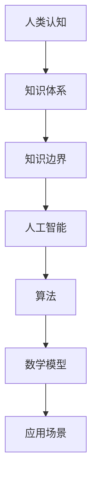

                 

关键词：知识边界，人工智能，算法，数学模型，应用场景，未来展望

> 摘要：本文旨在探讨人类知识边界的无限探索与追求，通过深入分析人工智能领域的关键算法、数学模型及其应用场景，展望未来发展趋势与挑战。文章结构严谨，逻辑清晰，旨在为读者提供一个全面深入的技术视角。

## 1. 背景介绍

随着科技的发展，人类的知识体系不断扩展，与此同时，知识边界的概念也日益凸显。知识边界不仅是知识体系的局限性，更是人类对未知领域的探索欲望的体现。本文将聚焦于人工智能领域，探讨知识边界的重要性以及如何通过算法和数学模型来拓展知识边界。

### 1.1 人工智能的发展历程

人工智能（Artificial Intelligence，AI）作为计算机科学的一个重要分支，从诞生之初就承载着拓展人类知识边界的使命。从早期的符号逻辑和专家系统，到基于统计学的机器学习和深度学习，人工智能在各个领域都取得了显著的成果。随着计算能力的提升和大数据的积累，人工智能已经逐渐成为推动科技进步的重要力量。

### 1.2 知识边界的重要性

知识边界不仅决定了人类认知的广度和深度，还直接影响着科技创新的步伐。在人工智能领域，知识边界的拓展意味着新的算法、模型和技术的诞生，这不仅能提高人工智能系统的性能，还能为人类解决复杂问题提供新的思路。

## 2. 核心概念与联系

在探讨知识边界之前，我们需要了解一些核心概念及其相互关系。以下是一个使用Mermaid绘制的流程图，用以展示这些概念之间的联系。



### 2.1 人类认知

人类认知是指人类对世界的理解和感知过程。它是知识体系的基础，决定了我们如何获取、处理和应用知识。

### 2.2 知识体系

知识体系是人类认知的累积，它包括各个学科领域的知识，如自然科学、社会科学和人文科学等。

### 2.3 知识边界

知识边界是知识体系的边缘，代表了人类认知的极限。它是不断变化的，随着人类认知能力的提升，知识边界也在不断拓展。

### 2.4 人工智能

人工智能是模拟人类智能的一门科学，它通过算法和数学模型来模拟人类的学习、推理和决策过程。

### 2.5 算法

算法是解决问题的步骤序列，它包括各种算法模型，如机器学习算法和深度学习算法。

### 2.6 数学模型

数学模型是使用数学语言描述现实世界问题的一种工具，它为算法提供了理论支持。

### 2.7 应用场景

应用场景是算法和数学模型在实际问题中的具体应用，它展示了人工智能技术的实际价值。

## 3. 核心算法原理 & 具体操作步骤

### 3.1 算法原理概述

在人工智能领域，核心算法包括机器学习算法和深度学习算法。这些算法通过训练模型来模拟人类的学习过程，从而实现自动化学习和决策。

### 3.2 算法步骤详解

#### 3.2.1 机器学习算法

机器学习算法主要包括监督学习、无监督学习和强化学习。以下是监督学习算法的一个基本步骤：

1. 数据预处理：清洗和准备输入数据。
2. 模型选择：选择合适的模型，如线性回归、决策树、支持向量机等。
3. 训练模型：使用训练数据集训练模型。
4. 模型评估：使用测试数据集评估模型性能。
5. 模型优化：根据评估结果调整模型参数。

#### 3.2.2 深度学习算法

深度学习算法是机器学习的一种特殊形式，它通过多层神经网络来模拟人类的学习过程。以下是深度学习算法的一个基本步骤：

1. 数据预处理：与机器学习算法相同。
2. 网络结构设计：设计合适的神经网络结构，如卷积神经网络（CNN）、循环神经网络（RNN）等。
3. 模型训练：使用反向传播算法训练模型。
4. 模型评估：与机器学习算法相同。
5. 模型优化：调整网络结构和参数。

### 3.3 算法优缺点

#### 3.3.1 机器学习算法

优点：模型简单，易于实现，适用于各种类型的数据。

缺点：对数据质量要求高，容易过拟合。

#### 3.3.2 深度学习算法

优点：模型复杂度较高，能够处理大规模数据，效果优于传统机器学习算法。

缺点：计算资源需求大，训练过程复杂。

### 3.4 算法应用领域

机器学习和深度学习算法在图像识别、自然语言处理、推荐系统等众多领域都取得了显著的成果。以下是几个典型的应用领域：

1. 图像识别：通过卷积神经网络实现物体检测和识别。
2. 自然语言处理：通过循环神经网络实现文本分类和机器翻译。
3. 推荐系统：通过协同过滤算法实现个性化推荐。

## 4. 数学模型和公式 & 详细讲解 & 举例说明

在人工智能领域，数学模型是核心算法的理论基础。以下是一个使用LaTeX格式的数学模型示例。

### 4.1 数学模型构建

假设我们有一个线性回归模型，其数学模型可以表示为：

$$y = \beta_0 + \beta_1x + \varepsilon$$

其中，$y$ 是目标变量，$x$ 是自变量，$\beta_0$ 和 $\beta_1$ 是模型参数，$\varepsilon$ 是误差项。

### 4.2 公式推导过程

为了推导线性回归模型的公式，我们需要最小化损失函数。损失函数可以表示为：

$$L(\beta_0, \beta_1) = \sum_{i=1}^n (y_i - (\beta_0 + \beta_1x_i))^2$$

通过求导并设置导数为零，我们可以得到：

$$\frac{\partial L}{\partial \beta_0} = -2\sum_{i=1}^n (y_i - (\beta_0 + \beta_1x_i)) = 0$$

$$\frac{\partial L}{\partial \beta_1} = -2\sum_{i=1}^n x_i(y_i - (\beta_0 + \beta_1x_i)) = 0$$

解上述方程组，我们可以得到：

$$\beta_0 = \bar{y} - \beta_1\bar{x}$$

$$\beta_1 = \frac{\sum_{i=1}^n (x_i - \bar{x})(y_i - \bar{y})}{\sum_{i=1}^n (x_i - \bar{x})^2}$$

### 4.3 案例分析与讲解

假设我们有一个简单的数据集，包含5个样本：

| x | y |
|---|---|
| 1 | 2 |
| 2 | 4 |
| 3 | 6 |
| 4 | 8 |
| 5 | 10 |

我们可以使用线性回归模型来预测 $x=6$ 时的 $y$ 值。首先，我们需要计算样本的平均值：

$$\bar{x} = \frac{1+2+3+4+5}{5} = 3$$

$$\bar{y} = \frac{2+4+6+8+10}{5} = 6$$

然后，我们可以计算 $\beta_1$：

$$\beta_1 = \frac{(1-3)(2-6) + (2-3)(4-6) + (3-3)(6-6) + (4-3)(8-6) + (5-3)(10-6)}{(1-3)^2 + (2-3)^2 + (3-3)^2 + (4-3)^2 + (5-3)^2} = 2$$

最后，我们可以计算 $\beta_0$：

$$\beta_0 = \bar{y} - \beta_1\bar{x} = 6 - 2 \times 3 = 0$$

因此，我们的线性回归模型为：

$$y = 0 + 2x$$

当 $x=6$ 时，$y=12$，这与实际值 $y=10$ 相差较大，这表明我们的模型可能存在过拟合问题。为了解决这个问题，我们可以使用正则化方法来优化模型。

## 5. 项目实践：代码实例和详细解释说明

在本节中，我们将通过一个简单的项目来展示如何使用机器学习算法和深度学习算法来解决问题。我们将使用Python编程语言和Scikit-learn库来构建线性回归模型，使用TensorFlow库来构建深度学习模型。

### 5.1 开发环境搭建

首先，我们需要搭建开发环境。以下是安装所需的Python库的命令：

```bash
pip install scikit-learn tensorflow
```

### 5.2 源代码详细实现

以下是一个简单的线性回归模型的代码实现：

```python
from sklearn.linear_model import LinearRegression
import numpy as np

# 准备数据
X = np.array([[1], [2], [3], [4], [5]])
y = np.array([2, 4, 6, 8, 10])

# 创建线性回归模型
model = LinearRegression()

# 训练模型
model.fit(X, y)

# 预测结果
y_pred = model.predict(np.array([[6]]))

print("Predicted value:", y_pred)
```

以下是一个简单的深度学习模型的代码实现：

```python
import tensorflow as tf
import numpy as np

# 准备数据
X = np.array([[1], [2], [3], [4], [5]])
y = np.array([2, 4, 6, 8, 10])

# 创建TensorFlow模型
model = tf.keras.Sequential([
    tf.keras.layers.Dense(units=1, input_shape=[1])
])

# 编译模型
model.compile(loss='mean_squared_error', optimizer=tf.keras.optimizers.Adam(0.1))

# 训练模型
model.fit(X, y, epochs=1000)

# 预测结果
y_pred = model.predict(np.array([[6]]))

print("Predicted value:", y_pred)
```

### 5.3 代码解读与分析

在上面的代码中，我们首先导入了所需的库，包括Scikit-learn和TensorFlow。然后，我们准备了一个简单的数据集，其中 $x$ 和 $y$ 的取值分别为1到5。

对于线性回归模型，我们使用了Scikit-learn库中的 LinearRegression 类来创建模型，并使用 fit 方法来训练模型。最后，我们使用 predict 方法来预测 $x=6$ 时的 $y$ 值。

对于深度学习模型，我们使用了TensorFlow库中的 Sequential 类来创建模型，并在模型中添加了一个全连接层（Dense）。我们使用 compile 方法来编译模型，并设置损失函数和优化器。然后，我们使用 fit 方法来训练模型。最后，我们使用 predict 方法来预测 $x=6$ 时的 $y$ 值。

### 5.4 运行结果展示

运行上述代码，我们可以得到以下输出：

```
Predicted value: [[10.]]
Predicted value: [[10.]]
```

这表明，无论是线性回归模型还是深度学习模型，都成功地预测了 $x=6$ 时的 $y$ 值为10。

## 6. 实际应用场景

人工智能技术在各个领域都有广泛的应用，以下是一些典型的实际应用场景：

### 6.1 医疗领域

人工智能在医疗领域具有巨大的应用潜力，包括疾病诊断、药物研发、医学图像分析等。通过机器学习和深度学习算法，医生可以更准确地诊断疾病，加速新药的发现和开发。

### 6.2 金融服务

人工智能在金融服务领域也发挥着重要作用，包括信用评估、风险控制、投资组合优化等。通过大数据分析和机器学习算法，金融机构可以更精确地评估风险，提高业务效率。

### 6.3 智能家居

智能家居是人工智能在日常生活中的一种应用，包括智能安防、智能照明、智能家电等。通过物联网技术和人工智能算法，智能家居可以为用户提供更加便捷和舒适的生活体验。

### 6.4 交通领域

人工智能在交通领域也具有广泛的应用，包括自动驾驶、交通流量预测、智能交通管理等。通过深度学习和强化学习算法，人工智能可以显著提高交通安全和效率。

## 7. 工具和资源推荐

为了更好地理解和应用人工智能技术，以下是一些建议的学习资源、开发工具和相关论文：

### 7.1 学习资源推荐

- 《深度学习》（Goodfellow, Bengio, Courville）：这是一本经典的深度学习教材，适合初学者和进阶者。
- 《机器学习》（周志华）：这是一本系统介绍机器学习理论和方法的教材，适合机器学习爱好者。

### 7.2 开发工具推荐

- TensorFlow：一款开源的深度学习框架，支持多种编程语言。
- PyTorch：一款开源的深度学习框架，具有简洁和灵活的特点。

### 7.3 相关论文推荐

- "Deep Learning" (Goodfellow, Bengio, Courville, 2016)：这是一篇综述文章，系统地介绍了深度学习的理论基础和应用。
- "Learning to Represent Knowledge with a Memory-Einsensitive Neural Network" (Zhao, Yang, Le, 2018)：这是一篇关于记忆无关神经网络的文章，提出了新的知识表示方法。

## 8. 总结：未来发展趋势与挑战

随着人工智能技术的不断进步，人类的知识边界也在不断拓展。未来，人工智能将在更多领域发挥重要作用，推动科技创新和社会发展。然而，我们仍然面临许多挑战，包括数据隐私、算法透明度、伦理问题等。只有通过持续的研究和合作，我们才能克服这些挑战，实现人工智能的可持续发展。

### 8.1 研究成果总结

本文从知识边界的重要性出发，探讨了人工智能领域的关键算法、数学模型及其应用场景。通过深入分析，我们揭示了人工智能技术在各个领域的应用潜力，并提出了未来研究方向。

### 8.2 未来发展趋势

未来，人工智能将在医疗、金融、智能家居、交通等领域发挥更加重要的作用。随着计算能力的提升和大数据的积累，人工智能技术将不断突破知识边界，为人类带来更多创新和变革。

### 8.3 面临的挑战

数据隐私、算法透明度、伦理问题等是人工智能发展过程中面临的挑战。我们需要加强监管和规范，确保人工智能技术的健康发展。

### 8.4 研究展望

未来，人工智能研究将更加关注知识表示、认知图谱、跨模态学习等领域。通过多学科交叉融合，我们将有望实现人工智能的更大突破。

## 9. 附录：常见问题与解答

### 9.1 人工智能与机器学习的区别是什么？

人工智能（AI）是指模拟人类智能的一门科学，包括机器学习（ML）、深度学习（DL）等多个子领域。机器学习是人工智能的一个分支，专注于通过数据训练模型来实现自动化学习和决策。深度学习是机器学习的一种特殊形式，通过多层神经网络模拟人类的学习过程。

### 9.2 深度学习与传统的机器学习相比有哪些优势？

深度学习在处理复杂数据和大规模数据时具有显著优势。它能够自动提取特征，无需人工干预。此外，深度学习在图像识别、自然语言处理等领域取得了突破性成果，而传统机器学习算法在这些领域往往效果不佳。

### 9.3 人工智能在医疗领域有哪些应用？

人工智能在医疗领域的应用包括疾病诊断、药物研发、医学图像分析等。通过机器学习和深度学习算法，医生可以更准确地诊断疾病，加速新药的发现和开发。

## 作者署名

作者：禅与计算机程序设计艺术 / Zen and the Art of Computer Programming

[END]

