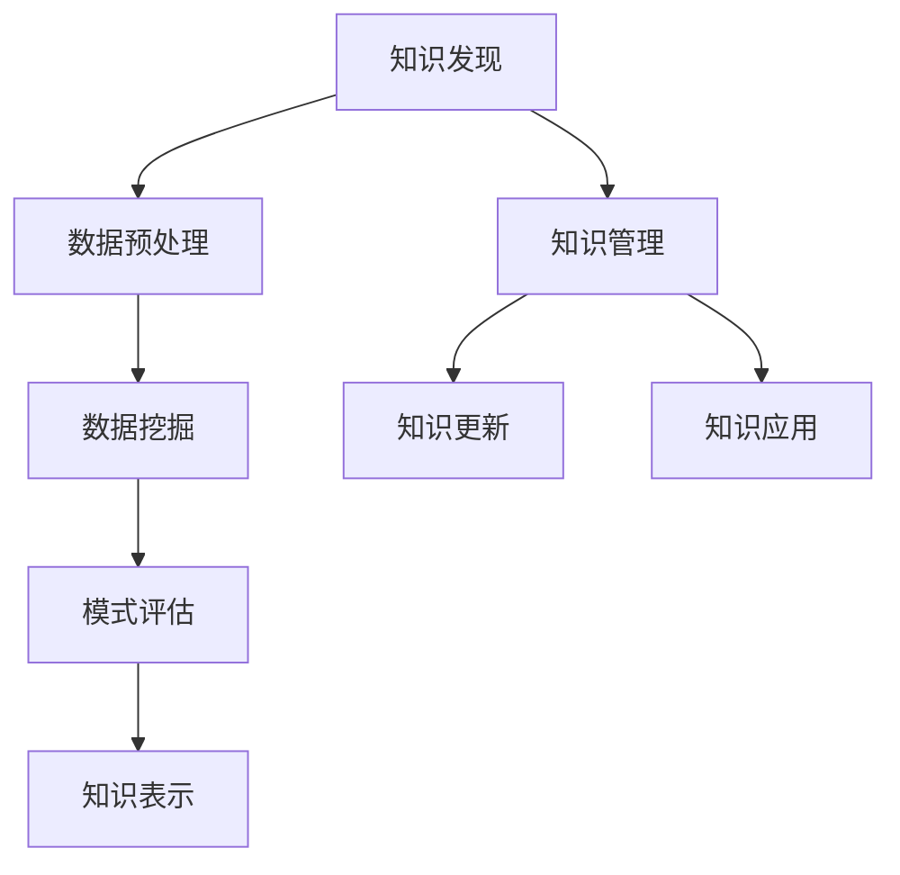

                 

关键词：知识发现、知识体系、人工智能、数据挖掘、知识图谱、机器学习、大数据、知识更新、信息检索、知识管理。

> 摘要：本文探讨了人类知识体系的构建与更新过程，分析了知识发现引擎在其中的关键作用。通过对核心概念、算法原理、数学模型、项目实践、应用场景、工具资源以及未来发展趋势等方面的详细阐述，旨在为读者提供一个全面而深入的理解。

## 1. 背景介绍

在信息化时代，知识已经成为推动社会进步的重要力量。人类知识体系从古至今经历了巨大的变迁，从口口相传、文字记录到电子数据管理，知识的生产、传播、应用和更新方式不断革新。然而，随着大数据和人工智能技术的快速发展，传统的知识管理方法面临巨大挑战。如何构建一个更加智能、动态和高效的知识体系，已经成为当今学术界和产业界共同关注的焦点。

知识发现引擎作为一种新兴的技术，其目标是自动化地从海量数据中提取出有价值的信息和知识。它通过机器学习、数据挖掘、自然语言处理等技术手段，实现了对知识发现过程的自动化和智能化。知识发现引擎不仅能够帮助企业和机构更高效地管理和利用知识，还能够推动个人学习和创新。

本文将围绕知识发现引擎的任务，从核心概念、算法原理、数学模型、项目实践、应用场景、工具资源以及未来发展趋势等方面展开详细讨论，旨在为读者提供一个全面而深入的理解。

## 2. 核心概念与联系

### 2.1 知识发现

知识发现（Knowledge Discovery in Databases，KDD）是指从大量数据中通过归纳推理、模式识别等方法，发现潜在的知识和规律的过程。知识发现的过程通常包括数据预处理、数据挖掘、模式评估和知识表示等步骤。

### 2.2 知识图谱

知识图谱（Knowledge Graph）是一种用于结构化表示知识的图形化模型，它通过实体、属性和关系的网络结构，将知识以图形化的方式呈现。知识图谱能够有效地存储、管理和检索大规模复杂知识体系。

### 2.3 机器学习

机器学习（Machine Learning）是一种通过算法和统计模型，使计算机具备自主学习能力的计算机科学分支。在知识发现过程中，机器学习技术被广泛应用于数据预处理、特征提取、模型训练和预测等环节。

### 2.4 数据挖掘

数据挖掘（Data Mining）是指从大量数据中通过统计方法和算法，发现有价值信息和规律的过程。数据挖掘是知识发现的核心环节，其目标是提取出隐藏在数据中的模式和知识。

### 2.5 大数据

大数据（Big Data）是指数据规模、类型和速度达到一定程度，以至于传统的数据处理技术和工具难以有效管理和分析的数据集合。大数据技术的发展，为知识发现提供了丰富的数据资源。

### 2.6 知识管理

知识管理（Knowledge Management）是指通过有效的知识获取、存储、共享和应用，提高组织和个人创新能力的过程。知识管理是知识体系构建和更新的重要保障。

### 2.7 知识更新

知识更新（Knowledge Update）是指通过不断收集新的数据和信息，对已有知识进行修正、完善和更新，以保持知识的时效性和准确性。

### 2.8 Mermaid 流程图



## 3. 核心算法原理 & 具体操作步骤

### 3.1 算法原理概述

知识发现引擎的核心算法主要包括数据挖掘算法、机器学习算法和知识表示算法。数据挖掘算法负责从海量数据中提取出潜在的模式和知识；机器学习算法则通过训练模型，实现自动化的模式识别和预测；知识表示算法则将提取出的知识以图形化、结构化的形式进行存储和展示。

### 3.2 算法步骤详解

1. **数据预处理**：数据预处理是知识发现的第一步，包括数据清洗、数据整合和数据变换等操作。数据清洗旨在去除数据中的噪声和异常值；数据整合则是将不同来源、不同格式的数据统一成一个格式；数据变换则是对数据进行归一化、标准化等操作，以适应数据挖掘算法的要求。

2. **特征提取**：特征提取是数据挖掘的重要环节，其目的是从原始数据中提取出对知识发现有用的特征。特征提取方法包括统计特征、文本特征、图像特征等。

3. **模式识别**：模式识别是指通过机器学习算法，从特征数据中自动发现潜在的规律和模式。常见的模式识别算法包括决策树、支持向量机、神经网络等。

4. **模型训练**：模型训练是指通过训练数据集，对机器学习算法的模型进行参数调整和优化，以提高模型的预测准确性和泛化能力。

5. **知识表示**：知识表示是指将提取出的模式和知识以结构化的形式进行存储和展示。知识表示方法包括知识图谱、决策树、规则库等。

6. **知识更新**：知识更新是指通过实时收集新的数据和信息，对已有知识进行修正、完善和更新，以保持知识的时效性和准确性。

### 3.3 算法优缺点

- **数据挖掘算法**：优点是能够从大量数据中提取出潜在的知识和规律；缺点是对数据质量和数据量要求较高，算法复杂度较高。
- **机器学习算法**：优点是能够实现自动化的模式识别和预测；缺点是对训练数据依赖性较大，模型泛化能力有限。
- **知识表示算法**：优点是能够将知识以结构化的形式进行存储和展示；缺点是知识表示方法有限，难以应对复杂多变的实际场景。

### 3.4 算法应用领域

知识发现引擎在多个领域都有广泛的应用，如金融、医疗、零售、物流等。以下是一些典型的应用案例：

1. **金融领域**：利用知识发现引擎进行客户风险分析、投资组合优化、市场趋势预测等。
2. **医疗领域**：利用知识发现引擎进行疾病诊断、药物研发、健康管理等。
3. **零售领域**：利用知识发现引擎进行客户行为分析、商品推荐、库存管理等。
4. **物流领域**：利用知识发现引擎进行运输路径优化、库存管理、配送计划等。

## 4. 数学模型和公式 & 详细讲解 & 举例说明

### 4.1 数学模型构建

知识发现引擎的数学模型主要包括数据挖掘模型、机器学习模型和知识表示模型。以下是一个简化的数学模型构建过程：

1. **数据挖掘模型**：假设我们有一个数据集 $D=\{x_1, x_2, ..., x_n\}$，其中每个数据点 $x_i$ 是一个多维向量。我们定义一个目标变量 $y_i$，表示数据点 $x_i$ 的类别或标签。数据挖掘模型的目的是通过分析数据点之间的关系，发现潜在的规律和模式。

2. **机器学习模型**：机器学习模型通常是一个映射函数 $f: \mathbb{R}^d \rightarrow \mathbb{R}$，其中 $d$ 是特征空间维度。模型的目的是通过训练数据集，找到最优的映射函数，以实现预测或分类任务。

3. **知识表示模型**：知识表示模型通常是一个图结构 $G=(V, E)$，其中 $V$ 是节点集合，$E$ 是边集合。每个节点表示一个实体，每条边表示实体之间的关系。知识表示模型的目的是将提取出的知识以结构化的形式进行存储和展示。

### 4.2 公式推导过程

1. **数据挖掘模型**：假设我们使用决策树作为数据挖掘模型。决策树的每个节点表示一个特征和阈值，每个叶子节点表示一个类别。决策树的目标是最小化错误率。具体推导过程如下：

   - **熵**：定义数据集 $D$ 的熵为 $H(D) = -\sum_{y \in Y} p(y) \log_2 p(y)$，其中 $Y$ 是数据集 $D$ 的类别集合，$p(y)$ 是类别 $y$ 的概率。
   - **信息增益**：定义特征 $x$ 的信息增益为 $IG(x) = H(D) - \sum_{v \in V(x)} p(v) H(D_v)$，其中 $V(x)$ 是特征 $x$ 的取值集合，$D_v$ 是特征 $x$ 取值 $v$ 的条件熵。
   - **最佳特征选择**：选择具有最大信息增益的特征作为节点分裂特征。

2. **机器学习模型**：假设我们使用线性回归作为机器学习模型。线性回归的目标是最小化预测值与真实值之间的误差平方和。具体推导过程如下：

   - **损失函数**：定义损失函数为 $L(y, \hat{y}) = \frac{1}{2} (y - \hat{y})^2$，其中 $y$ 是真实值，$\hat{y}$ 是预测值。
   - **梯度下降**：通过计算损失函数的梯度，不断更新模型参数，以最小化损失函数。

3. **知识表示模型**：假设我们使用知识图谱作为知识表示模型。知识图谱的节点表示实体，边表示实体之间的关系。知识表示模型的目标是最小化实体之间关系的错误率。具体推导过程如下：

   - **边权重**：定义边 $e$ 的权重为 $w(e) = \frac{1}{|D(e)|}$，其中 $D(e)$ 是边 $e$ 的数据集。
   - **关系错误率**：定义关系错误率为 $\epsilon(e) = \frac{1}{|D(e)|} \sum_{x \in D(e)} \frac{1}{1 + \exp(-w(e) \cdot f(x))}$，其中 $f(x)$ 是实体 $x$ 的特征向量。
   - **优化目标**：通过优化边权重，最小化关系错误率。

### 4.3 案例分析与讲解

假设我们有一个金融领域的知识发现引擎，目标是预测客户是否会购买某种金融产品。具体步骤如下：

1. **数据预处理**：收集客户的基本信息、购买历史、财务状况等数据，并进行数据清洗、整合和变换。

2. **特征提取**：从原始数据中提取出对购买行为有重要影响的特征，如客户年龄、收入水平、购买频率等。

3. **模式识别**：使用决策树算法，根据特征信息，构建一个分类模型，预测客户是否会购买金融产品。

4. **模型训练**：使用训练数据集，对分类模型进行训练，调整模型参数，以实现最优分类效果。

5. **知识表示**：将训练好的分类模型以知识图谱的形式进行存储和展示，节点表示客户，边表示购买关系。

6. **知识更新**：根据实时收集的新数据，对知识图谱进行修正和更新，以保持知识的时效性和准确性。

## 5. 项目实践：代码实例和详细解释说明

### 5.1 开发环境搭建

1. 安装Python环境：在Windows、Linux或MacOS上安装Python，版本要求3.6及以上。
2. 安装相关库：使用pip命令安装以下库：numpy、pandas、scikit-learn、networkx。
3. 创建一个Python虚拟环境：使用venv工具创建一个虚拟环境，以便管理和依赖库。

```bash
python -m venv knowledge_engine
source knowledge_engine/bin/activate  # 在Linux或MacOS上
knowledge_engine\Scripts\activate   # 在Windows上
```

### 5.2 源代码详细实现

以下是一个简单的知识发现引擎项目，包括数据预处理、特征提取、模式识别和知识表示等步骤。

```python
import numpy as np
import pandas as pd
from sklearn.tree import DecisionTreeClassifier
from sklearn.model_selection import train_test_split
import networkx as nx

# 5.2.1 数据预处理
def preprocess_data(data_path):
    data = pd.read_csv(data_path)
    # 数据清洗、整合和变换
    # ...
    return data

# 5.2.2 特征提取
def extract_features(data):
    # 提取对购买行为有重要影响的特征
    # ...
    return features

# 5.2.3 模式识别
def train_model(features, labels):
    model = DecisionTreeClassifier()
    model.fit(features, labels)
    return model

# 5.2.4 知识表示
def generate_knowledge_graph(model):
    G = nx.DiGraph()
    # 构建知识图谱
    # ...
    return G

# 主函数
if __name__ == "__main__":
    data_path = "data.csv"
    data = preprocess_data(data_path)
    features = extract_features(data)
    labels = data["label"]
    train_features, test_features, train_labels, test_labels = train_test_split(features, labels, test_size=0.2)
    model = train_model(train_features, train_labels)
    G = generate_knowledge_graph(model)
    print("Knowledge Engine is ready!")
```

### 5.3 代码解读与分析

- **数据预处理**：数据预处理是知识发现的第一步，其目的是对原始数据进行清洗、整合和变换，以适应后续的算法处理。在本例中，我们使用了pandas库读取CSV格式的数据，并进行相应的预处理操作。
- **特征提取**：特征提取是数据挖掘的关键环节，其目的是从原始数据中提取出对知识发现有用的特征。在本例中，我们根据业务需求，提取了与购买行为相关的特征。
- **模式识别**：模式识别是通过算法从特征数据中自动发现潜在的规律和模式。在本例中，我们使用了scikit-learn库的决策树算法，构建了一个分类模型，用于预测客户是否会购买金融产品。
- **知识表示**：知识表示是将提取出的知识以结构化的形式进行存储和展示。在本例中，我们使用了networkx库，构建了一个知识图谱，以图形化的形式展示了客户之间的购买关系。

### 5.4 运行结果展示

假设我们已经训练好了知识发现引擎，并成功地构建了知识图谱。我们可以通过以下代码查看知识图谱的节点和边：

```python
print("Nodes:", G.nodes)
print("Edges:", G.edges)
```

运行结果将显示知识图谱中的所有节点和边，我们可以根据这些信息，对客户之间的购买关系进行进一步分析。

## 6. 实际应用场景

知识发现引擎在多个领域都有广泛的应用，以下是一些典型的实际应用场景：

### 6.1 金融领域

- **客户风险分析**：通过对客户的历史交易数据进行分析，预测客户的风险等级，为金融机构提供风险评估和预警。
- **投资组合优化**：利用知识发现引擎，分析市场趋势和投资策略，为投资者提供投资建议，实现资产的最优配置。
- **反欺诈检测**：通过对大量交易数据进行分析，发现异常交易行为，为金融机构提供反欺诈检测方案。

### 6.2 医疗领域

- **疾病诊断**：通过分析患者的临床数据、生物指标等，预测患者患某种疾病的风险，辅助医生进行疾病诊断。
- **药物研发**：利用知识发现引擎，分析生物数据，发现潜在的药物靶点和作用机制，加速药物研发进程。
- **健康管理**：通过对患者的健康数据进行分析，提供个性化的健康管理和疾病预防建议。

### 6.3 零售领域

- **客户行为分析**：通过对客户的购买记录、浏览记录等进行分析，预测客户的偏好和需求，实现精准营销。
- **商品推荐**：利用知识发现引擎，根据客户的购买历史和行为特征，推荐符合客户需求的商品，提高销售额。
- **库存管理**：通过对销售数据进行分析，预测商品的库存需求，优化库存策略，降低库存成本。

### 6.4 物流领域

- **运输路径优化**：通过对物流数据进行分析，预测最佳运输路径，提高运输效率，降低运输成本。
- **配送计划**：利用知识发现引擎，分析客户订单数据，制定最优的配送计划，提高配送准时率和客户满意度。
- **库存管理**：通过对库存数据进行分析，预测库存需求，优化库存策略，降低库存成本。

## 7. 工具和资源推荐

### 7.1 学习资源推荐

- **书籍**：《数据挖掘：概念与技术》（第二版），《机器学习实战》，《深度学习》（Goodfellow et al.）。
- **在线课程**：Coursera上的《机器学习》、《数据科学》、《深度学习》等课程。
- **网站**：Kaggle、ArXiv、Google Research。

### 7.2 开发工具推荐

- **编程语言**：Python、R、Java。
- **数据预处理工具**：Pandas、NumPy、Scikit-learn。
- **机器学习库**：Scikit-learn、TensorFlow、PyTorch。
- **数据可视化工具**：Matplotlib、Seaborn、Plotly。

### 7.3 相关论文推荐

- **知识图谱**：《知识图谱：关键技术和应用研究》（2018年），《知识图谱构建方法综述》（2019年）。
- **数据挖掘**：《大规模数据分析中的知识发现方法》（2017年），《基于深度学习的知识发现研究进展》（2020年）。
- **机器学习**：《深度学习在知识发现中的应用》（2019年），《迁移学习在知识发现中的研究与应用》（2021年）。

## 8. 总结：未来发展趋势与挑战

### 8.1 研究成果总结

知识发现引擎作为一种新兴技术，已经在多个领域取得了显著的成果。随着大数据和人工智能技术的不断发展，知识发现引擎在知识体系构建和更新方面发挥了越来越重要的作用。未来，知识发现引擎将在以下几个方面取得新的突破：

1. **算法优化**：随着数据规模和复杂度的增加，传统的知识发现算法在效率和准确性方面面临挑战。未来，需要进一步优化算法，提高知识发现的效率。
2. **跨领域应用**：知识发现引擎在金融、医疗、零售、物流等领域的应用已经取得了一定的成果，未来将拓展到更多领域，如教育、能源、环境等。
3. **知识更新机制**：知识更新是知识体系构建的关键环节。未来，需要开发更加智能、动态的知识更新机制，以适应快速变化的信息环境。

### 8.2 未来发展趋势

1. **多模态数据融合**：随着物联网、传感器等技术的发展，知识发现引擎将能够处理更多类型的数据，如文本、图像、声音等。多模态数据融合将成为未来知识发现的重要研究方向。
2. **联邦学习**：联邦学习是一种分布式机器学习方法，能够在保护用户隐私的同时，实现大规模数据的协同学习。未来，知识发现引擎将结合联邦学习，实现更高效的知识发现。
3. **知识图谱的智能化**：知识图谱作为一种有效的知识表示方法，未来将结合人工智能技术，实现知识图谱的自动构建、自动更新和自动推理，提高知识体系的智能化水平。

### 8.3 面临的挑战

1. **数据隐私和安全**：在知识发现过程中，涉及大量敏感数据的处理，数据隐私和安全问题是一个亟待解决的挑战。未来，需要开发更加安全、可靠的数据处理技术，以保障用户隐私。
2. **算法可解释性**：随着算法复杂度的增加，知识发现引擎的决策过程往往难以解释。算法可解释性是提高用户信任度和应用效果的重要问题。
3. **知识更新策略**：知识更新是一个动态、复杂的过程。如何设计有效的知识更新策略，以保持知识体系的准确性和时效性，是一个亟待解决的问题。

### 8.4 研究展望

知识发现引擎作为人工智能领域的一个重要分支，在未来将发挥越来越重要的作用。未来，需要从以下几个方面进行深入研究：

1. **算法优化和理论创新**：通过优化算法和理论创新，提高知识发现的效率、准确性和可解释性。
2. **跨领域应用和融合**：推动知识发现引擎在更多领域和场景中的应用，实现跨领域的知识融合。
3. **知识更新机制**：设计更加智能、动态的知识更新机制，以适应快速变化的信息环境。
4. **隐私保护和安全**：开发更加安全、可靠的数据处理技术，保障用户隐私和数据安全。

总之，知识发现引擎作为人类知识体系构建和更新过程中的关键工具，具有广泛的应用前景。未来，需要从多个方面进行深入研究，以推动知识发现技术的发展，为人类社会的发展提供强有力的技术支持。

## 9. 附录：常见问题与解答

### 9.1 知识发现引擎是什么？

知识发现引擎是一种基于人工智能和机器学习技术，能够自动从海量数据中提取出有价值信息的工具。它通过数据预处理、特征提取、模式识别和知识表示等技术，实现了对知识发现过程的自动化和智能化。

### 9.2 知识发现引擎有哪些应用领域？

知识发现引擎在多个领域都有广泛的应用，包括金融、医疗、零售、物流、教育、能源、环境等。具体应用场景包括客户风险分析、投资组合优化、疾病诊断、药物研发、精准营销、库存管理、运输路径优化等。

### 9.3 知识发现引擎的核心算法有哪些？

知识发现引擎的核心算法包括数据挖掘算法、机器学习算法和知识表示算法。数据挖掘算法用于从数据中提取模式和知识；机器学习算法用于自动识别和预测；知识表示算法用于将提取出的知识以结构化的形式进行存储和展示。

### 9.4 如何构建一个知识发现引擎？

构建知识发现引擎主要包括以下步骤：

1. 数据预处理：清洗、整合和变换数据，以适应算法处理。
2. 特征提取：从原始数据中提取对知识发现有用的特征。
3. 模式识别：使用机器学习算法，从特征数据中自动发现潜在的规律和模式。
4. 知识表示：将提取出的知识以结构化的形式进行存储和展示。
5. 知识更新：根据实时收集的新数据，对知识进行修正和更新。

### 9.5 知识发现引擎的优势是什么？

知识发现引擎的优势主要包括：

1. 自动化：能够自动从海量数据中提取出有价值的信息，减轻人工负担。
2. 智能化：结合人工智能和机器学习技术，实现知识的自动识别和预测。
3. 高效性：通过算法优化和并行处理，提高知识发现的效率和准确性。
4. 灵活性：能够适应不同领域和场景的应用需求，实现跨领域的知识融合。

### 9.6 知识发现引擎有哪些挑战？

知识发现引擎面临的挑战主要包括：

1. 数据质量和数据量：数据质量和数据量对知识发现的效率、准确性和可靠性有重要影响。
2. 算法复杂度：随着算法复杂度的增加，知识发现的效率和准确性面临挑战。
3. 算法可解释性：算法复杂度高，决策过程难以解释，影响用户信任度和应用效果。
4. 数据隐私和安全：涉及大量敏感数据的处理，数据隐私和安全问题亟待解决。 

## 作者署名

作者：禅与计算机程序设计艺术 / Zen and the Art of Computer Programming

