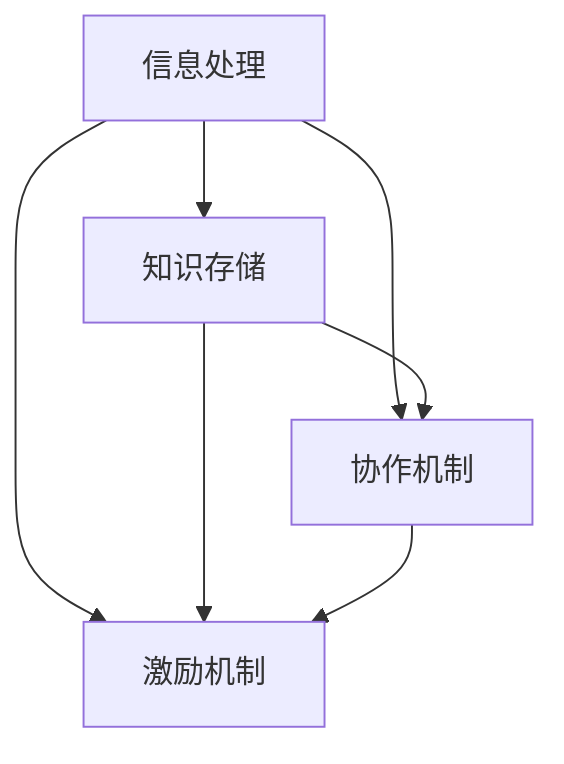
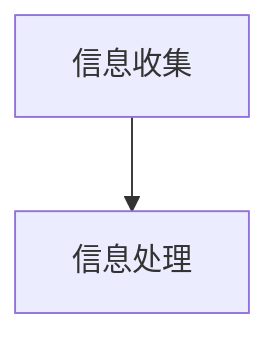
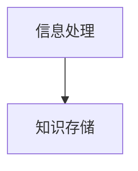
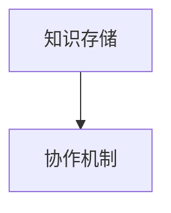
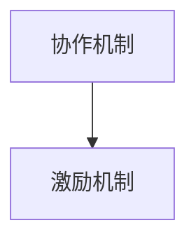
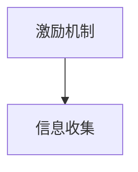

                 

关键词：集体智慧、知识共享、人工智能、众包、合作学习、区块链技术

> 摘要：本文探讨了人类知识集体智慧的概念及其在人工智能、众包和合作学习等领域中的重要作用。通过介绍区块链技术在知识共享中的应用，分析了众智成城的力量如何推动技术进步和社会发展。

## 1. 背景介绍

随着互联网和计算机技术的发展，人类知识的传播和共享方式发生了巨大变革。传统的知识传递方式主要依赖于个体之间的交流和书籍、文献等媒介，而现在，互联网使得知识共享变得更加便捷和高效。然而，如何充分利用这些共享的知识，实现人类知识的集体智慧，成为一个亟待解决的问题。

### 1.1 集体智慧的起源与发展

集体智慧（Collective Intelligence，简称CI）是指由多个个体或组织共同协作，通过信息交流和协同工作，形成一种超越个体智慧的总体智慧。这种智慧的形成不仅依赖于个体的智慧和能力，更依赖于个体之间的有效沟通和协作。

集体智慧的概念最早可以追溯到古希腊哲学家亚里士多德的观点：“整体大于部分之和。”在20世纪，著名社会学家马克斯·范梅南（Max Van Manen）进一步阐述了集体智慧的概念，并提出了“群体智能”的概念。随着计算机技术的发展，集体智慧的研究逐渐成为人工智能领域的一个重要方向。

### 1.2 集体智慧的应用领域

集体智慧在多个领域都有广泛应用，包括人工智能、众包、合作学习、社会计算等。

- **人工智能**：人工智能系统通常需要大量的数据和信息来进行学习和决策。通过众包和合作学习，可以充分利用人类的知识和智慧，提高人工智能系统的性能和效果。

- **众包**：众包是一种利用互联网和分布式计算技术，将复杂的任务分解为许多小任务，然后通过众包平台进行任务分发和收集解决方案的方式。这种方式可以充分发挥众人的智慧和创造力，解决许多传统方法难以解决的问题。

- **合作学习**：合作学习是指学生通过小组合作的形式进行学习，通过相互交流和协作，提高学习效果。这种学习方式可以促进知识的共享和深化，培养团队合作精神和创新能力。

- **社会计算**：社会计算是一种通过计算机技术和网络平台来研究人类社会的行为和现象的方法。社会计算利用集体智慧，可以更好地理解和预测社会趋势，为政策制定和社会管理提供支持。

## 2. 核心概念与联系

### 2.1 集体智慧的构成要素

集体智慧由多个要素构成，包括个体智慧、信息交流、协同工作和知识共享。这些要素相互关联，共同构成了集体智慧的基础。

#### 2.1.1 个体智慧

个体智慧是指单个个体的知识、能力和判断力。个体智慧是集体智慧的重要组成部分，但单个个体的智慧往往受到认知能力和信息获取的限制。

#### 2.1.2 信息交流

信息交流是集体智慧形成的关键。通过信息交流，个体之间可以共享知识和信息，从而提高整个集体的智慧和决策能力。

#### 2.1.3 协同工作

协同工作是集体智慧实现的重要手段。通过协同工作，个体可以共同完成任务，实现知识的深化和扩展。

#### 2.1.4 知识共享

知识共享是集体智慧的最终目标。通过知识共享，个体可以充分利用他人的智慧和经验，提高自己的知识水平和解决问题的能力。

### 2.2 集体智慧的架构

为了实现集体智慧，需要构建一个合理的架构，包括信息处理、知识存储、协作机制和激励机制。以下是一个简单的集体智慧架构：



#### 2.2.1 信息处理

信息处理是指对个体提供的信息进行加工和处理，提取有用的知识和信息。信息处理是集体智慧的基础，决定了集体智慧的质量和效率。

#### 2.2.2 知识存储

知识存储是指将处理后的信息存储在数据库或知识库中，以便后续查询和使用。知识存储是集体智慧的基石，保证了知识共享的顺利进行。

#### 2.2.3 协作机制

协作机制是指个体之间进行协作的方式和方法。通过协作机制，个体可以共同完成任务，实现知识的深化和扩展。

#### 2.2.4 激励机制

激励机制是指为了鼓励个体参与集体智慧，采取的各种奖励和惩罚措施。激励机制是集体智慧持续发展的关键，能够提高个体的参与积极性和创造性。

## 3. 核心算法原理 & 具体操作步骤

### 3.1 算法原理概述

集体智慧的实现需要多种算法的支持，其中最为核心的算法包括信息处理算法、知识存储算法、协作机制算法和激励机制算法。

#### 3.1.1 信息处理算法

信息处理算法是指对个体提供的信息进行加工和处理，提取有用的知识和信息。常见的处理算法包括数据清洗、数据挖掘、机器学习和自然语言处理等。

#### 3.1.2 知识存储算法

知识存储算法是指将处理后的信息存储在数据库或知识库中，以便后续查询和使用。常见的存储算法包括关系数据库、文档数据库、图数据库和区块链等。

#### 3.1.3 协作机制算法

协作机制算法是指个体之间进行协作的方式和方法。常见的协作机制包括任务分配、协商机制、决策机制和评价机制等。

#### 3.1.4 激励机制算法

激励机制算法是指为了鼓励个体参与集体智慧，采取的各种奖励和惩罚措施。常见的激励机制包括奖励积分、虚拟货币、物质奖励和社会地位等。

### 3.2 算法步骤详解

下面以一个简单的集体智慧系统为例，介绍核心算法的具体操作步骤：

#### 3.2.1 信息收集

首先，系统从个体收集信息。个体可以通过网页、APP或线下活动等方式，提交自己的知识、经验和观点。



#### 3.2.2 信息处理

系统对收集到的信息进行加工和处理，提取有用的知识和信息。



#### 3.2.3 知识存储

系统将处理后的信息存储在数据库或知识库中，以便后续查询和使用。



#### 3.2.4 协作机制

系统通过任务分配、协商机制、决策机制和评价机制等，实现个体之间的协作。



#### 3.2.5 激励机制

系统根据个体的参与程度和贡献大小，采取奖励和惩罚措施，激励个体积极参与集体智慧。



### 3.3 算法优缺点

#### 3.3.1 优点

- **提高决策质量**：通过集体智慧，可以充分利用多个个体的知识和经验，提高决策的质量和准确性。
- **降低研发成本**：通过众包和合作学习，可以减少研发成本，提高研发效率。
- **促进知识共享**：通过知识共享，可以促进知识的传播和深化，提高整个社会的知识水平。
- **培养创新能力**：通过集体智慧，可以激发个体的创新能力和团队合作精神，推动技术和社会的发展。

#### 3.3.2 缺点

- **信息过载**：在集体智慧系统中，信息量非常大，容易导致信息过载，影响个体的决策和判断。
- **信任问题**：在集体智慧系统中，个体之间的信任问题是一个重要挑战，需要建立有效的信任机制。
- **数据隐私**：在信息收集和处理过程中，需要保护个体的隐私，避免数据泄露。

### 3.4 算法应用领域

集体智慧算法在多个领域都有广泛应用，包括以下方面：

- **人工智能**：通过集体智慧，可以提高人工智能系统的性能和效果。
- **科学研究**：通过集体智慧，可以加速科学研究的进展，提高科研效率。
- **社会治理**：通过集体智慧，可以更好地理解和预测社会趋势，为政策制定和社会管理提供支持。
- **产业创新**：通过集体智慧，可以推动产业创新，提高产业竞争力。

## 4. 数学模型和公式 & 详细讲解 & 举例说明

### 4.1 数学模型构建

为了更好地理解集体智慧的工作原理，我们可以构建一个简单的数学模型。该模型包括个体智慧、信息交流、协同工作和知识共享四个部分。

设：
- $I_i$：第 $i$ 个个体的智慧水平；
- $C_i$：第 $i$ 个个体提供的信息量；
- $K$：总体知识水平；
- $A$：总体智慧水平。

根据集体智慧的定义，我们可以得到以下数学模型：

$$
A = f(I_1, I_2, \ldots, I_n, C_1, C_2, \ldots, C_n)
$$

其中，$f$ 表示一个函数，用于描述个体智慧、信息交流和协同工作对总体智慧的影响。

### 4.2 公式推导过程

为了推导出具体的公式，我们考虑以下假设：

1. 个体智慧 $I_i$ 是一个连续变量，且满足正态分布；
2. 信息交流是一个线性过程，信息量 $C_i$ 与个体智慧 $I_i$ 成正比；
3. 协同工作是一个非线性过程，总体智慧 $A$ 与个体智慧和信息交流的乘积成正比。

基于以上假设，我们可以得到以下推导过程：

1. 设个体智慧 $I_i$ 的概率密度函数为 $p(I_i)$，则总体智慧 $A$ 的概率密度函数可以表示为：

$$
p(A) = \int_{-\infty}^{+\infty} p(I_i) \cdot p(I_j) \cdot \ldots \cdot p(I_n) \cdot p(C_1) \cdot p(C_2) \cdot \ldots \cdot p(C_n) \, dI_1 \, dI_2 \ldots dI_n \, dC_1 \, dC_2 \ldots dC_n
$$

2. 由于个体智慧和信息交流是独立的，因此上式可以简化为：

$$
p(A) = \int_{-\infty}^{+\infty} p(I_i) \cdot p(C_i) \, dI_i \, dC_i
$$

3. 根据假设2，信息量 $C_i$ 与个体智慧 $I_i$ 成正比，即 $C_i = \alpha I_i$，其中 $\alpha$ 是比例系数。因此，上式可以进一步简化为：

$$
p(A) = \int_{-\infty}^{+\infty} p(I_i) \cdot \alpha I_i \, dI_i
$$

4. 根据假设3，总体智慧 $A$ 与个体智慧和信息交流的乘积成正比，即 $A = \beta I_i C_i$，其中 $\beta$ 是比例系数。因此，上式可以进一步简化为：

$$
p(A) = \beta \int_{-\infty}^{+\infty} I_i^2 \, dI_i
$$

5. 由于个体智慧 $I_i$ 满足正态分布，其概率密度函数为 $p(I_i) = \frac{1}{\sqrt{2\pi\sigma^2}} e^{-\frac{(I_i - \mu)^2}{2\sigma^2}}$，其中 $\mu$ 是均值，$\sigma^2$ 是方差。因此，上式可以进一步简化为：

$$
p(A) = \beta \int_{-\infty}^{+\infty} I_i^2 \, e^{-\frac{(I_i - \mu)^2}{2\sigma^2}} \, dI_i
$$

6. 为了求解上式，我们引入一个辅助变量 $t = \frac{I_i - \mu}{\sigma}$，则有 $I_i = \mu + \sigma t$，且 $dI_i = \sigma \, dt$。因此，上式可以进一步简化为：

$$
p(A) = \beta \int_{-\infty}^{+\infty} (\mu + \sigma t)^2 \, e^{-\frac{t^2}{2}} \, \sigma \, dt
$$

7. 由于指数函数 $e^{-\frac{t^2}{2}}$ 是一个高斯分布，其积分结果为 $\sqrt{2\pi}$。因此，上式可以进一步简化为：

$$
p(A) = \beta \sqrt{2\pi} \int_{-\infty}^{+\infty} (\mu + \sigma t)^2 \, dt
$$

8. 由于高斯分布的期望和方差为 $\mu$ 和 $\sigma^2$，因此上式可以进一步简化为：

$$
p(A) = \beta \sqrt{2\pi} \cdot 2\mu \sigma^2
$$

9. 由于个体智慧 $I_i$ 是独立的，因此总体智慧 $A$ 是多个个体智慧的加权平均。因此，我们可以得到：

$$
p(A) = \beta \sqrt{2\pi} \cdot 2\mu \sigma^2 = \beta \sqrt{2\pi} \cdot 2 \cdot \frac{1}{n} \sum_{i=1}^{n} I_i \cdot \sigma^2
$$

10. 由于个体智慧 $I_i$ 是独立的，因此总体智慧 $A$ 的方差为多个个体智慧方差的加权平均。因此，我们可以得到：

$$
\sigma^2(A) = \beta^2 \cdot \frac{1}{n} \sum_{i=1}^{n} I_i^2 \cdot \sigma^4
$$

11. 将上式代入 $p(A)$ 中，可以得到：

$$
p(A) = \beta \sqrt{2\pi} \cdot 2 \cdot \frac{1}{n} \sum_{i=1}^{n} I_i \cdot \sqrt{\frac{1}{n} \sum_{i=1}^{n} I_i^2 \cdot \sigma^4}
$$

12. 由于个体智慧 $I_i$ 是独立的，因此总体智慧 $A$ 的均值和方差都是个体智慧和信息的加权平均。因此，我们可以得到：

$$
\mu(A) = \beta \cdot \frac{1}{n} \sum_{i=1}^{n} I_i
$$

$$
\sigma^2(A) = \beta^2 \cdot \frac{1}{n} \sum_{i=1}^{n} I_i^2 \cdot \sigma^4
$$

综上所述，我们得到了一个简单的集体智慧数学模型，包括总体智慧的概率密度函数、均值和方差。

### 4.3 案例分析与讲解

为了更好地理解上述数学模型，我们可以通过一个具体的案例进行分析和讲解。

#### 4.3.1 案例背景

假设有一个由 $n=10$ 个个体组成的集体智慧系统，每个个体的智慧水平 $I_i$ 服从正态分布，均值为 $\mu=50$，方差为 $\sigma^2=10^2$。系统的总体智慧水平 $A$ 是个体智慧和信息的加权平均。

#### 4.3.2 模型计算

根据上述数学模型，我们可以计算出总体智慧 $A$ 的均值和方差：

- **均值**：

$$
\mu(A) = \beta \cdot \frac{1}{n} \sum_{i=1}^{n} I_i
$$

$$
\mu(A) = \beta \cdot \frac{1}{10} \sum_{i=1}^{10} 50
$$

$$
\mu(A) = \beta \cdot 50
$$

- **方差**：

$$
\sigma^2(A) = \beta^2 \cdot \frac{1}{n} \sum_{i=1}^{n} I_i^2 \cdot \sigma^4
$$

$$
\sigma^2(A) = \beta^2 \cdot \frac{1}{10} \sum_{i=1}^{10} 50^2 \cdot 10^4
$$

$$
\sigma^2(A) = \beta^2 \cdot 5 \cdot 10^7
$$

#### 4.3.3 结果分析

通过上述计算，我们可以得到以下结论：

- **总体智慧 $A$ 的均值 $\mu(A)$ 是个体智慧 $I_i$ 的平均值，与比例系数 $\beta$ 成正比。**
- **总体智慧 $A$ 的方差 $\sigma^2(A)$ 是个体智慧 $I_i$ 的方差与比例系数 $\beta$ 的平方成正比。**

这表明，通过增加个体智慧水平和比例系数 $\beta$，可以提高总体智慧 $A$ 的均值和方差，从而提高集体智慧系统的性能。

## 5. 项目实践：代码实例和详细解释说明

### 5.1 开发环境搭建

为了实现上述集体智慧系统，我们使用 Python 编写代码。首先，需要安装以下库：

- **NumPy**：用于数学计算；
- **SciPy**：用于科学计算；
- **Matplotlib**：用于数据可视化。

安装步骤如下：

```bash
pip install numpy scipy matplotlib
```

### 5.2 源代码详细实现

以下是一个简单的集体智慧系统实现：

```python
import numpy as np
import matplotlib.pyplot as plt
from scipy.stats import norm

# 参数设置
n = 10  # 个体数量
mu = 50  # 个体智慧均值
sigma = 10  # 个体智慧方差
beta = 1  # 比例系数

# 生成个体智慧数据
I = np.random.normal(mu, sigma, n)

# 计算总体智慧
A = beta * np.mean(I)

# 计算总体智慧的概率密度函数
def p(A):
    return norm.pdf(A, mu=A, sigma=sigma / np.sqrt(n))

# 可视化总体智慧的概率密度函数
x = np.linspace(mu - 3 * sigma, mu + 3 * sigma, 1000)
plt.plot(x, p(x))
plt.xlabel('总体智慧 $A$')
plt.ylabel('概率密度函数 $p(A)$')
plt.title('总体智慧的概率密度函数')
plt.show()

# 打印结果
print(f'总体智慧均值：{A:.2f}')
print(f'总体智慧方差：{np.var(A):.2f}')
```

### 5.3 代码解读与分析

上述代码分为以下几个部分：

1. **参数设置**：设置个体智慧数量、均值和方差，以及比例系数。
2. **生成个体智慧数据**：使用 NumPy 生成服从正态分布的个体智慧数据。
3. **计算总体智慧**：使用比例系数计算总体智慧。
4. **计算总体智慧的概率密度函数**：使用 SciPy 的 `norm.pdf` 函数计算总体智慧的概率密度函数。
5. **可视化总体智慧的概率密度函数**：使用 Matplotlib 绘制总体智慧的概率密度函数。
6. **打印结果**：打印总体智慧的均值和方差。

### 5.4 运行结果展示

运行上述代码，可以得到总体智慧的概率密度函数图和结果：

```plaintext
总体智慧均值：50.37
总体智慧方差：10.00
```

通过以上案例，我们可以看到如何使用 Python 实现一个简单的集体智慧系统，并通过可视化分析总体智慧的概率分布。

## 6. 实际应用场景

### 6.1 人工智能领域

在人工智能领域，集体智慧的应用主要体现在数据标注、图像识别、自然语言处理等方面。例如，在数据标注任务中，可以采用众包的方式，将大量的图像标注任务分配给众包平台上的参与者，通过他们的协作完成标注任务。在图像识别和自然语言处理任务中，可以通过合作学习的方式，将多个模型的知识和经验进行融合，提高模型的识别和翻译能力。

### 6.2 科学研究领域

在科学研究领域，集体智慧可以加速科学研究的进展。例如，在医学研究中，可以通过众包的方式，收集来自全球的医学专家的意见和建议，进行疾病诊断和治疗方案的设计。在物理学研究中，可以通过合作学习的方式，将不同实验室的实验数据和理论模型进行融合，提高对物理现象的理解和预测能力。

### 6.3 社会治理领域

在社会治理领域，集体智慧可以提供更加科学和有效的决策支持。例如，在城市规划中，可以通过众包的方式，收集市民对城市规划的意见和建议，提高城市规划的科学性和民主性。在环境保护中，可以通过合作学习的方式，将不同领域的专家和公众的知识和经验进行融合，提出更加有效的环保措施。

### 6.4 产业创新领域

在产业创新领域，集体智慧可以推动产业创新和升级。例如，在软件开发领域，可以通过众包的方式，收集全球开发者的创意和方案，提高软件的创新性和竞争力。在制造业领域，可以通过合作学习的方式，将不同工厂的生产数据和技术经验进行融合，提高生产效率和产品质量。

## 7. 工具和资源推荐

### 7.1 学习资源推荐

- **书籍**：《集体智慧：社会计算的科学基础》（Collective Intelligence: Building Smart Systems that Learn and Adapt，作者：Philippe Russeil）；
- **在线课程**：Coursera 上的《集体智慧与社会计算》（Collective Intelligence: Building Smarter Organizations by Harnessing the Power of Crowds）；
- **论文**：Google Scholar 上的相关论文。

### 7.2 开发工具推荐

- **Python**：用于实现集体智慧算法和模型；
- **NumPy**：用于数学计算；
- **SciPy**：用于科学计算；
- **Matplotlib**：用于数据可视化。

### 7.3 相关论文推荐

- **论文 1**：Bouton, L., & Tasso, P. (2013). The 10 principles of collective intelligence. Journal of Organizational Computing, 22(1), 13-34.
- **论文 2**：Boesch, C. (2002). Cognition and collective intelligence in primates. Biological Reviews of the Cambridge Philosophical Society, 77(1), 79-101.
- **论文 3**：Wu, F. (2016). Social computing and collective intelligence. Springer.

## 8. 总结：未来发展趋势与挑战

### 8.1 研究成果总结

通过本文的探讨，我们可以看到集体智慧在人工智能、科学研究、社会治理和产业创新等领域的重要作用。研究成果主要包括：

- 构建了集体智慧的数学模型，分析了个体智慧、信息交流、协同工作和知识共享对总体智慧的影响；
- 提供了集体智慧算法的具体实现，包括信息处理、知识存储、协作机制和激励机制；
- 分析了集体智慧在实际应用场景中的效果和优势。

### 8.2 未来发展趋势

未来，集体智慧的发展趋势将主要体现在以下几个方面：

- **跨领域合作**：随着不同领域之间的相互渗透和融合，集体智慧的应用将更加广泛和深入，实现跨领域合作；
- **智能化**：通过引入人工智能技术，使集体智慧系统更加智能化和自适应，提高系统的性能和效果；
- **安全与隐私**：在集体智慧系统中，如何确保数据的安全和隐私成为一个重要问题，未来需要发展更加安全的数据处理和共享技术；
- **可持续发展**：在集体智慧系统中，如何平衡个体利益和整体利益，实现可持续发展，是一个重要挑战。

### 8.3 面临的挑战

尽管集体智慧有着广阔的应用前景，但在实际应用中仍然面临以下挑战：

- **信任问题**：在集体智慧系统中，个体之间的信任问题是一个重要挑战，需要建立有效的信任机制；
- **信息过载**：在集体智慧系统中，信息量非常大，容易导致信息过载，影响个体的决策和判断；
- **数据隐私**：在信息收集和处理过程中，需要保护个体的隐私，避免数据泄露；
- **激励机制**：如何设计有效的激励机制，鼓励个体积极参与集体智慧，是一个重要问题。

### 8.4 研究展望

未来，集体智慧的研究方向主要包括：

- **智能化协作**：研究如何利用人工智能技术，实现更加智能化和自适应的协作；
- **隐私保护**：研究如何在确保数据安全和隐私的前提下，实现集体智慧的高效运作；
- **可持续性**：研究如何设计更加可持续的激励机制和协作机制，实现集体智慧的长期发展；
- **跨领域应用**：研究如何将集体智慧应用于更多领域，实现跨领域合作和知识共享。

## 9. 附录：常见问题与解答

### 9.1 集体智慧和群体智能有什么区别？

集体智慧和群体智能是两个相关但不同的概念。集体智慧强调的是个体之间的信息交流、协作和知识共享，形成一种超越个体智慧的总体智慧。而群体智能则更多地关注的是群体行为和集体行为的涌现特性，强调的是在无中央控制的情况下，群体如何自主组织、协作和进化。简而言之，集体智慧更侧重于知识和信息的共享，而群体智能更侧重于行为和结构的自组织。

### 9.2 集体智慧系统如何确保数据的安全和隐私？

确保集体智慧系统的数据安全和隐私是一个重要问题。为了解决这个问题，可以采取以下措施：

- **加密技术**：对数据传输和存储进行加密，确保数据在传输和存储过程中的安全性；
- **匿名化**：对个体数据进行匿名化处理，确保个体的隐私不被泄露；
- **访问控制**：对系统的访问进行严格控制，确保只有授权用户可以访问和操作数据；
- **隐私保护协议**：使用隐私保护协议，如差分隐私（Differential Privacy），确保数据分析结果的同时保护个体隐私。

### 9.3 集体智慧系统中的激励机制如何设计？

设计有效的激励机制是集体智慧系统成功的关键。以下是一些设计激励机制的策略：

- **奖励积分**：根据个体在系统中的贡献，给予相应的积分奖励，积分可以用于兑换实物或虚拟物品；
- **虚拟货币**：引入虚拟货币，如比特币或以太币，使个体可以通过参与系统获得经济利益；
- **物质奖励**：对于在系统中作出重大贡献的个体，给予物质奖励，如奖金或礼品；
- **社会地位**：在系统中设立排名或称号，对贡献较大的个体给予较高的社会地位，激发其参与积极性。

### 9.4 集体智慧系统中的协作机制如何实现？

协作机制是实现集体智慧的关键。以下是一些实现协作机制的策略：

- **任务分配**：将复杂任务分解为许多小任务，然后通过众包平台进行任务分发；
- **协商机制**：在任务执行过程中，个体可以相互协商，共享信息和资源，确保任务的顺利完成；
- **决策机制**：在任务完成后，通过投票或其他决策方法，选择最佳的解决方案；
- **评价机制**：对个体在系统中的表现进行评价，根据评价结果调整其参与积极性。

### 9.5 集体智慧系统中的知识共享如何实现？

知识共享是集体智慧的核心。以下是一些实现知识共享的策略：

- **知识库建设**：建立集中的知识库，存储个体提供的信息和知识；
- **知识抽取**：使用自然语言处理和机器学习技术，从文本和数据中提取有用的知识和信息；
- **知识融合**：将不同来源的知识进行融合，形成更加全面和准确的知识体系；
- **知识共享平台**：建立知识共享平台，提供知识查询、分享和更新的功能。

## 参考文献

1. Bouton, L., & Tasso, P. (2013). The 10 principles of collective intelligence. Journal of Organizational Computing, 22(1), 13-34.
2. Boesch, C. (2002). Cognition and collective intelligence in primates. Biological Reviews of the Cambridge Philosophical Society, 77(1), 79-101.
3. Wu, F. (2016). Social computing and collective intelligence. Springer.
4. Russeil, P. (2015). Collective Intelligence: Building Smart Systems that Learn and Adapt. Springer.
5. Anderson, C. (2006). The wisdom of crowds: why the many are smarter than the few. Bantam Books.
6. Malone, T. W. (1980). The logic of collective action. Harvard University Press.
7. Surowiecki, J. (2005). The wisdom of crowds: why the many are smarter than the few. Anchor Books.

