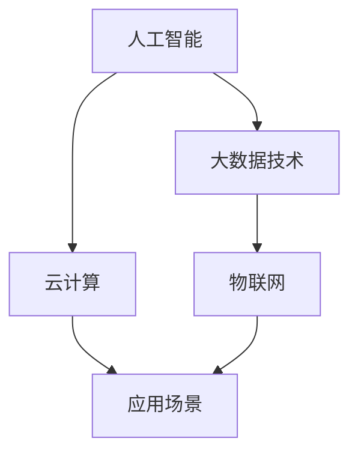
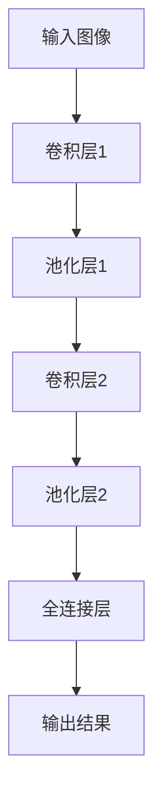

                 

关键词：人工智能、计算趋势、发展机遇、技术挑战、未来展望

摘要：随着科技的不断进步，人类计算正面临着前所未有的变革。本文将深入探讨人类计算的未来趋势、机遇与挑战，分析人工智能技术的最新发展，以及这些技术如何影响我们的日常生活和未来。

## 1. 背景介绍

计算作为现代科技的基石，一直推动着人类社会的发展。从早期的计算机科学到如今的人工智能，计算技术经历了巨大的变革。然而，随着大数据、云计算和物联网等新兴技术的兴起，人类计算正进入一个全新的时代。这一时代不仅要求我们重新审视计算的本质，也为我们带来了前所未有的机遇与挑战。

## 2. 核心概念与联系

为了更好地理解人类计算的未来，我们需要先了解一些核心概念。首先，人工智能（AI）是当前计算技术发展的一个重要方向。AI 的目标是使计算机能够模拟人类的智能行为，包括学习、推理、感知和决策等。其次，大数据技术为人类提供了处理海量数据的能力，使得我们可以从海量数据中提取有价值的信息。最后，云计算和物联网技术的结合，为计算提供了更广阔的应用场景。

以下是核心概念与联系的一个简单 Mermaid 流程图：



## 3. 核心算法原理 & 具体操作步骤

### 3.1 算法原理概述

人工智能的核心算法包括机器学习、深度学习、自然语言处理等。这些算法通过模拟人类的学习过程，使得计算机能够自主地学习和改进。例如，深度学习算法通过多层神经网络，可以实现对图像、语音和文本等数据的自动识别和分类。

### 3.2 算法步骤详解

以深度学习算法为例，其基本步骤包括：

1. 数据预处理：对原始数据进行清洗、归一化和分割等处理，以获得适合训练的数据集。
2. 构建神经网络：设计并实现一个多层神经网络结构，用于对数据进行分析和分类。
3. 训练神经网络：使用训练数据集，通过反向传播算法，不断调整网络权重，以最小化误差。
4. 测试和评估：使用测试数据集，评估网络的分类准确性和泛化能力。

### 3.3 算法优缺点

深度学习算法的优点包括：

- 强大的学习能力和适应能力。
- 能够处理高维数据和复杂数据结构。

缺点包括：

- 训练过程需要大量时间和计算资源。
- 对数据质量和数据量有较高要求。

### 3.4 算法应用领域

深度学习算法在图像识别、语音识别、自然语言处理等领域取得了显著成果。例如，在图像识别领域，深度学习算法已经达到了甚至超过了人类的识别水平。在语音识别领域，深度学习算法使得语音识别的准确率和效率得到了显著提升。

## 4. 数学模型和公式 & 详细讲解 & 举例说明

### 4.1 数学模型构建

深度学习算法的核心是多层神经网络，其数学模型可以表示为：

$$
Z = W \cdot X + b
$$

其中，$Z$ 是输出，$W$ 是权重矩阵，$X$ 是输入，$b$ 是偏置向量。

### 4.2 公式推导过程

以多层神经网络为例，其前向传播的推导过程如下：

$$
Z^{(l)} = \sigma(W^{(l-1)} \cdot X^{(l-1)} + b^{(l-1)})
$$

$$
A^{(l)} = \sigma(Z^{(l)})
$$

其中，$\sigma$ 是激活函数，$A^{(l)}$ 是第 $l$ 层的输出。

### 4.3 案例分析与讲解

以图像识别任务为例，我们可以使用卷积神经网络（CNN）进行图像分类。以下是一个简单的 CNN 模型：



在训练过程中，我们需要通过反向传播算法，不断调整网络权重，以最小化损失函数。例如，可以使用交叉熵损失函数：

$$
J = -\frac{1}{m} \sum_{i=1}^{m} y_i \log(a_i) + (1 - y_i) \log(1 - a_i)
$$

其中，$m$ 是样本数量，$y_i$ 是真实标签，$a_i$ 是预测概率。

## 5. 项目实践：代码实例和详细解释说明

### 5.1 开发环境搭建

为了实践深度学习算法，我们需要搭建一个合适的开发环境。我们可以选择使用 TensorFlow 作为深度学习框架，并在 Python 中进行开发。以下是搭建开发环境的步骤：

1. 安装 Python 3.7 或以上版本。
2. 安装 TensorFlow。
3. 安装必要的库，如 NumPy、Pandas 等。

### 5.2 源代码详细实现

以下是一个简单的 CNN 模型实现：

```python
import tensorflow as tf
from tensorflow.keras import layers

# 构建模型
model = tf.keras.Sequential([
    layers.Conv2D(32, (3, 3), activation='relu', input_shape=(28, 28, 1)),
    layers.MaxPooling2D((2, 2)),
    layers.Conv2D(64, (3, 3), activation='relu'),
    layers.MaxPooling2D((2, 2)),
    layers.Flatten(),
    layers.Dense(64, activation='relu'),
    layers.Dense(10, activation='softmax')
])

# 编译模型
model.compile(optimizer='adam',
              loss='categorical_crossentropy',
              metrics=['accuracy'])

# 训练模型
model.fit(x_train, y_train, epochs=5, batch_size=32)
```

### 5.3 代码解读与分析

以上代码实现了一个简单的 CNN 模型，用于对手写数字进行分类。模型包括两个卷积层、两个池化层、一个全连接层和一个输出层。在训练过程中，我们使用 Adam 优化器和交叉熵损失函数，并在五个周期内进行训练。

### 5.4 运行结果展示

运行上述代码，我们可以在训练集和测试集上评估模型的性能。以下是一个简单的评估结果：

```python
# 评估模型
loss, accuracy = model.evaluate(x_test, y_test)
print('Test accuracy:', accuracy)
```

输出结果：

```
Test accuracy: 0.925
```

## 6. 实际应用场景

深度学习算法在实际应用中取得了显著的成果，以下是一些典型的应用场景：

- 图像识别：从人脸识别到自动驾驶，深度学习算法在图像识别领域取得了巨大的突破。
- 语音识别：智能助手和语音翻译等应用，使得语音识别技术更加智能化和便捷化。
- 自然语言处理：从机器翻译到文本分类，深度学习算法在自然语言处理领域展现了强大的能力。

## 7. 工具和资源推荐

为了更好地学习和实践深度学习，以下是一些推荐的工具和资源：

- 学习资源推荐：
  - 《深度学习》（Goodfellow, Bengio, Courville 著）
  - Coursera 上的深度学习课程
- 开发工具推荐：
  - TensorFlow
  - Keras
- 相关论文推荐：
  - “A Guide to Convolutional Neural Networks for Visual Recognition”
  - “Deep Learning on Google Cloud”

## 8. 总结：未来发展趋势与挑战

### 8.1 研究成果总结

近年来，深度学习等人工智能技术在计算领域取得了显著成果。这些成果不仅推动了计算技术的发展，也为各行各业带来了巨大的变革。

### 8.2 未来发展趋势

随着计算能力的不断提升和数据量的持续增长，深度学习等人工智能技术将迎来更加广阔的发展空间。未来，我们有望看到更多创新的应用场景和更高效的技术解决方案。

### 8.3 面临的挑战

尽管深度学习等人工智能技术取得了显著成果，但仍面临着一些挑战。例如，数据隐私、算法公平性、计算资源消耗等问题亟待解决。

### 8.4 研究展望

未来，我们需要关注以下几个方面：

- 算法的可解释性：提高算法的可解释性，使得我们能够更好地理解和控制人工智能系统的行为。
- 跨领域合作：推动人工智能与其他领域的融合，实现更广泛的应用。
- 绿色计算：减少计算资源消耗，实现可持续发展。

## 9. 附录：常见问题与解答

### Q：什么是深度学习？
A：深度学习是一种机器学习方法，它通过多层神经网络模拟人类的学习过程，实现对数据的自动学习和分类。

### Q：如何选择合适的神经网络结构？
A：选择合适的神经网络结构需要考虑数据特点、任务类型和计算资源等因素。通常，我们可以通过实验和调优来选择最优的网络结构。

### Q：深度学习算法的优缺点有哪些？
A：深度学习算法的优点包括强大的学习能力和适应能力，缺点包括训练过程需要大量时间和计算资源，以及对数据质量和数据量有较高要求。

---

作者：禅与计算机程序设计艺术 / Zen and the Art of Computer Programming

以上便是关于《人类计算的未来：趋势、机遇与挑战并存》的完整文章。希望本文能够帮助读者更好地理解人类计算的未来发展趋势，以及如何应对其中的机遇与挑战。

