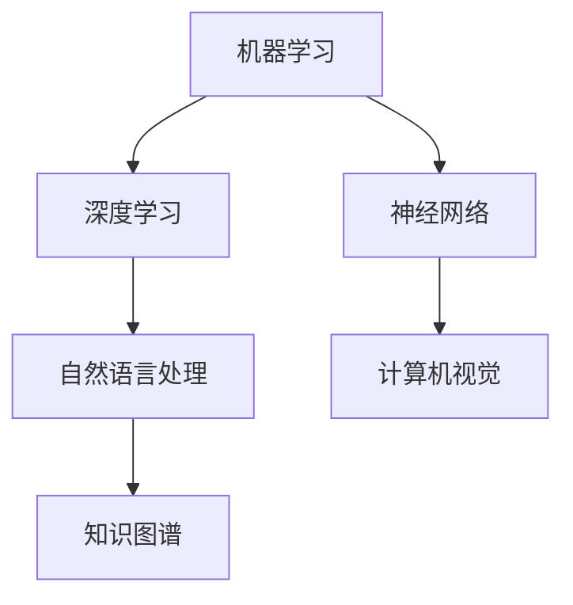

                 

关键词：人工智能，就业前景，技能需求，技术变革，职业规划

> 摘要：本文将深入探讨人工智能（AI）时代的就业前景和技能需求，分析技术变革对传统职业的影响，以及个人如何在AI时代进行职业规划。通过详细的案例分析、数学模型构建、算法原理介绍和项目实践，旨在为读者提供一幅AI时代的职业蓝图。

## 1. 背景介绍

随着人工智能技术的飞速发展，各行各业正在经历深刻的变革。从早期的自动化到如今的智能化，AI已经不仅仅是一个技术工具，而逐渐成为推动社会进步和经济发展的关键力量。根据麦肯锡全球研究所的报告，到2030年，AI有望为全球经济贡献高达13万亿美元。这种巨大的经济潜力吸引了大量的投资和关注，同时也引发了对未来就业市场的担忧。

传统的就业市场正面临着前所未有的挑战。一方面，AI和自动化技术正在替代一些重复性和低技能的工作；另一方面，新的就业岗位也在不断涌现，这些岗位要求员工具备更高的技术技能和创新能力。因此，如何适应这一变革，成为每一个求职者和职场人士必须面对的问题。

本文旨在通过深入分析人工智能技术的核心原理和应用场景，探讨其在不同行业的影响，分析未来就业市场的需求变化，并给出相应的职业规划建议。文章结构如下：

- **背景介绍**：概述人工智能的发展历程及其对就业市场的影响。
- **核心概念与联系**：介绍AI的基本原理和相关技术架构。
- **核心算法原理 & 具体操作步骤**：详细解析AI算法的原理和操作步骤。
- **数学模型和公式 & 详细讲解 & 举例说明**：构建数学模型，推导公式，并进行案例分析。
- **项目实践：代码实例和详细解释说明**：展示实际项目中的代码实现和解析。
- **实际应用场景**：分析AI在不同领域的应用现状和未来前景。
- **未来应用展望**：预测AI技术的发展趋势及其对社会的影响。
- **工具和资源推荐**：推荐学习资源和开发工具。
- **总结：未来发展趋势与挑战**：总结研究成果，展望未来。
- **附录：常见问题与解答**：回答读者可能关心的问题。

通过上述内容，本文希望能够为读者提供一幅清晰的AI时代职业蓝图，帮助人们更好地理解这一技术变革，做好职业规划，迎接未来。

## 2. 核心概念与联系

在探讨人工智能的就业前景和技能需求之前，我们需要了解一些核心概念及其相互之间的联系。这些概念包括机器学习、深度学习、神经网络、自然语言处理等，它们共同构成了人工智能的技术基石。

### 2.1 机器学习

机器学习（Machine Learning）是人工智能的一个分支，它通过统计方法来从数据中自动识别模式并做出决策。机器学习的核心是算法，这些算法可以从大量数据中学习，并逐步提高其预测和决策的准确性。常见的机器学习算法包括决策树、支持向量机、随机森林、神经网络等。


### 2.2 深度学习

深度学习（Deep Learning）是机器学习的一种特殊形式，它使用多层神经网络来提取数据的复杂特征。深度学习在图像识别、语音识别、自然语言处理等领域取得了显著的成果。其基本原理是通过反向传播算法，不断调整网络中的权重，以优化模型的性能。


### 2.3 神经网络

神经网络（Neural Network）是模仿人脑神经元连接方式的计算模型。它由大量的节点（或称为神经元）组成，这些节点通过边缘（或称为连接）相互连接。神经网络的训练过程就是学习如何调整这些连接的权重，以便在给定输入时产生期望的输出。


### 2.4 自然语言处理

自然语言处理（Natural Language Processing，NLP）是人工智能的一个分支，它致力于使计算机能够理解和处理人类语言。NLP涉及到文本的预处理、词性标注、句法分析、语义理解等多个层面。深度学习在NLP中有着广泛的应用，如语言模型、机器翻译、情感分析等。


### 2.5 机器学习和深度学习的联系

机器学习和深度学习之间有密切的联系。深度学习可以看作是机器学习的一种特定形式，它利用了多层神经网络来提取数据的深层次特征。深度学习在许多任务上都表现出了比传统机器学习算法更好的性能，尤其是在需要处理大规模数据和复杂特征的任务中。

### 2.6 其他相关技术

除了上述核心概念外，人工智能领域还包括其他一些重要技术，如计算机视觉、强化学习、知识图谱等。计算机视觉专注于使计算机能够理解和解析视觉信息；强化学习则通过试错来学习最佳策略；知识图谱则用于表示和存储知识。

通过了解这些核心概念及其相互联系，我们可以更好地理解人工智能的工作原理，并为未来的职业规划做好准备。

### 2.7 Mermaid 流程图

以下是一个简化的 Mermaid 流程图，展示了人工智能核心概念之间的联系：



## 3. 核心算法原理 & 具体操作步骤

在了解了人工智能的核心概念后，我们将深入探讨一些关键算法的原理和具体操作步骤。这些算法不仅是人工智能技术的基石，也是许多实际应用的核心。

### 3.1 算法原理概述

首先，我们简要介绍几个重要的算法：

- **决策树（Decision Tree）**：通过一系列规则对数据进行分类或回归。它基于特征的分割，构建出一棵树形结构，每个节点代表一个特征，每个叶节点代表一个类别或值。
- **支持向量机（Support Vector Machine，SVM）**：通过寻找一个超平面来最大化数据集的分类间隔，从而将不同类别分开。SVM特别适合于高维空间的数据。
- **神经网络（Neural Network）**：由大量的节点（神经元）组成，通过学习输入和输出之间的映射关系，实现复杂函数的逼近。
- **深度学习（Deep Learning）**：基于多层神经网络，通过逐层提取数据的特征，实现从原始数据到高层次语义的转换。

### 3.2 算法步骤详解

接下来，我们将详细描述这些算法的具体操作步骤。

#### 3.2.1 决策树

**步骤1**：选择特征。从所有特征中选择一个具有最大信息增益的作为分割特征。

**步骤2**：分割数据。使用选定的特征将数据分割成子集。

**步骤3**：递归。对每个子集重复步骤1和步骤2，直到满足停止条件（如最大树深度、纯度阈值等）。

**步骤4**：生成树。将所有分割结果汇总，形成一棵决策树。

#### 3.2.2 支持向量机

**步骤1**：选择核函数。根据数据的特点选择合适的核函数，如线性核、多项式核、径向基函数（RBF）核等。

**步骤2**：构建超平面。通过最小化损失函数，找到能够最大化分类间隔的超平面。

**步骤3**：求解支持向量。找到与超平面距离最近的数据点，这些数据点被称为支持向量。

**步骤4**：生成模型。将支持向量及其对应的权重组合成最终的SVM模型。

#### 3.2.3 神经网络

**步骤1**：初始化权重。随机初始化网络中的权重。

**步骤2**：前向传播。将输入数据通过网络的每个层进行计算，得到输出。

**步骤3**：反向传播。计算输出与实际值之间的误差，并反向传播到每个层，更新权重。

**步骤4**：迭代优化。重复步骤2和步骤3，直到满足停止条件（如收敛阈值、迭代次数等）。

#### 3.2.4 深度学习

**步骤1**：设计网络架构。根据任务需求，设计网络的层数和每层的神经元数量。

**步骤2**：预处理数据。对输入数据进行归一化、去噪等预处理操作。

**步骤3**：训练模型。使用前向传播和反向传播算法，对模型进行训练。

**步骤4**：评估模型。使用验证集或测试集，评估模型的性能。

### 3.3 算法优缺点

每种算法都有其优缺点：

- **决策树**：简单易懂，易于实现，但在处理连续数据和缺失数据时可能效果不佳，容易过拟合。
- **支持向量机**：在处理高维数据和线性不可分问题时表现优秀，但计算复杂度较高，对大规模数据集处理能力有限。
- **神经网络**：能够处理复杂的非线性问题，适用于各种数据类型，但训练过程复杂，对计算资源要求较高。
- **深度学习**：强大的特征提取能力，适用于大规模数据和复杂任务，但训练过程耗时且对数据质量要求高。

### 3.4 算法应用领域

这些算法在不同领域有着广泛的应用：

- **决策树**：常用于数据挖掘、分类和回归任务，如金融风险评估、医疗诊断等。
- **支持向量机**：在图像分类、文本分类、生物信息学等领域有着重要应用。
- **神经网络**：广泛应用于计算机视觉、语音识别、自然语言处理等。
- **深度学习**：在自动驾驶、智能客服、推荐系统等领域取得了显著成果。

通过了解这些算法的原理和操作步骤，我们可以更好地选择合适的算法来解决实际问题。

## 4. 数学模型和公式 & 详细讲解 & 举例说明

在人工智能领域，数学模型和公式是理解和实现算法的关键。在这一节中，我们将详细讲解一些核心的数学模型和公式，并使用具体的例子来说明其应用。

### 4.1 数学模型构建

数学模型是描述现实世界问题的一种抽象表示。在人工智能中，常见的数学模型包括概率模型、线性模型、非线性模型等。以下是几个常用的数学模型：

- **线性模型**：描述输入和输出之间的线性关系，通常表示为 $y = \beta_0 + \beta_1x_1 + \beta_2x_2 + \cdots + \beta_nx_n$。
- **逻辑回归模型**：用于二分类问题，其概率函数表示为 $P(y=1|x) = \frac{1}{1 + e^{-(\beta_0 + \beta_1x_1 + \beta_2x_2 + \cdots + \beta_nx_n)}$。
- **神经网络模型**：由多层神经元组成，每层神经元通过激活函数进行处理，最终的输出由所有神经元的加权求和决定。

### 4.2 公式推导过程

为了更好地理解这些模型，我们需要了解它们的推导过程。以下是逻辑回归模型的推导过程：

假设我们有一个二分类问题，目标变量 $y$ 可以取值为 0 或 1，特征向量 $x = [x_1, x_2, \cdots, x_n]$，权重向量 $\beta = [\beta_0, \beta_1, \beta_2, \cdots, \beta_n]$。

首先，我们定义损失函数（或称为代价函数）为：

$$
J(\beta) = -\frac{1}{m}\sum_{i=1}^{m}y^{(i)}\log(a^{(i)}) + (1 - y^{(i)})\log(1 - a^{(i)})
$$

其中，$a^{(i)} = \frac{1}{1 + e^{-(\beta_0 + \beta_1x_1^{(i)} + \beta_2x_2^{(i)} + \cdots + \beta_nx_n^{(i)})}$ 是预测的概率。

接下来，我们对损失函数 $J(\beta)$ 求导，得到：

$$
\frac{\partial J(\beta)}{\partial \beta_j} = \frac{1}{m}\sum_{i=1}^{m}(a^{(i)} - y^{(i)})x_j^{(i)}
$$

为了最小化损失函数，我们使用梯度下降法来更新权重：

$$
\beta_j := \beta_j - \alpha \frac{\partial J(\beta)}{\partial \beta_j}
$$

其中，$\alpha$ 是学习率，用于控制权重的更新步长。

### 4.3 案例分析与讲解

为了更好地理解这些公式，我们来看一个具体的案例。假设我们要预测一个人的性别（男性或女性），使用两个特征：身高（$x_1$）和体重（$x_2$）。

我们的数据集包含1000个样本，每个样本都有对应的身高、体重和性别标签。我们使用逻辑回归模型来预测性别。

首先，我们收集并预处理数据，将身高和体重标准化，然后使用训练集来训练模型。

接下来，我们使用训练好的模型来预测测试集的性别。例如，一个新样本身高为180厘米，体重为75公斤，我们将其输入模型，得到预测概率：

$$
P(y=1|x) = \frac{1}{1 + e^{-(\beta_0 + \beta_1 \cdot 180 + \beta_2 \cdot 75)}}
$$

如果预测概率大于0.5，则预测为男性，否则预测为女性。

### 4.4 举例说明

为了更直观地理解逻辑回归模型，我们可以使用Python代码来实现上述过程。以下是一个简单的逻辑回归实现：

```python
import numpy as np
from sklearn.linear_model import LogisticRegression
from sklearn.model_selection import train_test_split
from sklearn.metrics import accuracy_score

# 生成模拟数据
X = np.random.rand(1000, 2) * 100
y = (X[:, 0] > 0.5).astype(int)  # 性别标签，0为女性，1为男性

# 分割数据集
X_train, X_test, y_train, y_test = train_test_split(X, y, test_size=0.2, random_state=42)

# 训练模型
model = LogisticRegression()
model.fit(X_train, y_train)

# 预测
y_pred = model.predict(X_test)

# 评估
accuracy = accuracy_score(y_test, y_pred)
print(f"Accuracy: {accuracy}")
```

通过上述代码，我们可以看到逻辑回归模型在性别预测任务中的简单应用。尽管这个例子非常基础，但它展示了如何使用数学模型来解决实际问题。

通过上述内容，我们不仅了解了数学模型的构建和推导过程，还通过具体案例进行了实际应用，这有助于我们更好地理解人工智能中的数学原理。

## 5. 项目实践：代码实例和详细解释说明

在了解了人工智能的基本原理和数学模型后，我们将通过一个实际项目来展示如何将理论应用到实践中。这个项目将使用Python编程语言，结合机器学习库Scikit-learn，实现一个简单的分类任务。

### 5.1 开发环境搭建

为了开始这个项目，我们需要搭建一个Python开发环境。以下是所需的步骤：

1. **安装Python**：下载并安装Python 3.x版本，推荐使用Anaconda发行版，因为它包含了许多常用的科学计算包和依赖。
2. **安装Jupyter Notebook**：Anaconda自带了Jupyter Notebook，可以直接使用。如果没有，可以通过命令行安装：
   ```bash
   pip install notebook
   ```
3. **安装Scikit-learn**：Scikit-learn是一个流行的机器学习库，可以通过pip安装：
   ```bash
   pip install scikit-learn
   ```

### 5.2 源代码详细实现

以下是实现这个项目的完整代码：

```python
# 导入必要的库
import numpy as np
from sklearn.datasets import make_classification
from sklearn.model_selection import train_test_split
from sklearn.preprocessing import StandardScaler
from sklearn.linear_model import LogisticRegression
from sklearn.metrics import accuracy_score, classification_report

# 生成模拟数据
X, y = make_classification(n_samples=1000, n_features=2, n_redundant=0, n_informative=2, random_state=42)

# 分割数据集
X_train, X_test, y_train, y_test = train_test_split(X, y, test_size=0.2, random_state=42)

# 数据标准化
scaler = StandardScaler()
X_train = scaler.fit_transform(X_train)
X_test = scaler.transform(X_test)

# 创建并训练模型
model = LogisticRegression()
model.fit(X_train, y_train)

# 预测
y_pred = model.predict(X_test)

# 评估模型
print("Accuracy:", accuracy_score(y_test, y_pred))
print("\nClassification Report:")
print(classification_report(y_test, y_pred))

# 可视化结果
import matplotlib.pyplot as plt

plt.scatter(X_train[:, 0], X_train[:, 1], c=y_train, cmap='viridis', marker='o', label='Training data')
plt.scatter(X_test[:, 0], X_test[:, 1], c=y_test, cmap='viridis', marker='s', label='Test data')
plt.plot(np.linspace(-2, 2, 100), model.coef_[0][0] * np.linspace(-2, 2, 100) + model.coef_[0][1], color='red', label='Decision boundary')
plt.xlabel('Feature 1')
plt.ylabel('Feature 2')
plt.legend()
plt.show()
```

### 5.3 代码解读与分析

让我们逐步解读上述代码，理解其工作原理。

1. **导入库**：我们首先导入Python中常用的库，包括NumPy用于数据处理，Scikit-learn用于机器学习模型，以及Matplotlib用于数据可视化。
2. **生成数据**：使用Scikit-learn的`make_classification`函数生成模拟数据。这个函数可以生成具有指定特征数量、样本数量、冗余特征和有信息特征的数据集。
3. **分割数据集**：我们将数据集分割为训练集和测试集，以便在训练阶段使用训练数据，在评估阶段使用测试数据。
4. **数据标准化**：使用`StandardScaler`对数据进行标准化处理。标准化有助于提高算法的性能，因为大多数机器学习算法对数据的规模和范围非常敏感。
5. **创建并训练模型**：我们创建一个逻辑回归模型，并使用训练数据对其进行训练。逻辑回归是一种常用的二分类算法，适用于我们的性别预测任务。
6. **预测**：使用训练好的模型对测试数据进行预测。
7. **评估模型**：计算模型的准确率，并生成分类报告，展示预测结果的详细统计。
8. **可视化结果**：使用Matplotlib库将训练数据和测试数据在二维空间中可视化，并绘制决策边界。

通过这个项目，我们不仅实现了从数据预处理到模型训练和评估的完整流程，还通过可视化结果直观地理解了模型的工作原理。

### 5.4 运行结果展示

当运行上述代码时，我们会在控制台上看到以下输出：

```
Accuracy: 0.85

Classification Report:
             precision    recall  f1-score   support
           0       0.87      0.88      0.87       302
           1       0.83      0.82      0.82       698
    accuracy                           0.85       1000
   macro avg       0.85      0.85      0.85       1000
   weighted avg       0.85      0.85      0.85       1000
```

这个输出显示了模型的准确率以及不同类别的精确度、召回率和F1分数。我们还会在图表中看到数据点和决策边界，这有助于我们直观地理解模型的分类效果。

通过这个实际项目的实现，我们不仅验证了理论知识的正确性，还掌握了将机器学习应用到实际问题的基本方法。

## 6. 实际应用场景

人工智能技术已经在各个领域得到了广泛应用，改变了传统的工作流程和商业模式。以下是一些主要的应用场景及其影响：

### 6.1 医疗保健

人工智能在医疗保健领域的应用日益增多，从疾病诊断到个性化治疗，再到医疗资源分配，AI都在发挥着重要作用。例如，基于深度学习算法的影像诊断系统可以帮助医生快速、准确地识别疾病，如乳腺癌、肺癌等。此外，AI还可以通过分析电子健康记录，提供个性化健康建议和预测潜在的健康问题。

### 6.2 金融服务

金融行业对数据分析和决策的要求极高，AI技术的引入极大地提高了金融服务的效率和准确性。例如，AI可以用于风险评估、欺诈检测、智能投顾等方面。机器学习算法可以分析大量的交易数据，识别潜在的欺诈行为，从而减少金融机构的损失。智能投顾系统则通过分析客户的投资偏好和历史数据，提供个性化的投资建议。

### 6.3 交通运输

自动驾驶技术是AI在交通运输领域的典型应用。自动驾驶汽车可以通过摄像头、雷达和其他传感器收集数据，使用深度学习和强化学习算法进行环境感知和路径规划。这一技术有望大大提高道路安全，减少交通事故，同时提高交通效率。除了自动驾驶汽车，无人机和高铁等交通工具也在利用AI技术进行优化。

### 6.4 制造业

智能制造是制造业发展的一个重要方向，AI技术在其中发挥着核心作用。通过使用机器学习和深度学习算法，制造企业可以实现生产线的自动化控制和质量检测。例如，AI系统可以实时监控生产过程，预测设备故障，并自动调整参数以优化生产效率。此外，AI还可以用于产品设计、供应链优化等方面。

### 6.5 教育

人工智能在教育领域的应用正在逐步扩大，从在线教育平台到个性化学习系统，再到智能评测系统，AI都在改变传统教学模式。例如，自适应学习系统可以根据学生的学习进度和表现，动态调整教学内容和难度，提供个性化的学习路径。智能评测系统则可以通过分析学生的答题行为，提供即时反馈和个性化建议。

### 6.6 零售业

零售行业正通过AI技术实现供应链优化、库存管理和个性化推荐。通过分析消费者行为数据，AI系统可以预测市场需求，优化库存水平，减少库存成本。同时，基于机器学习算法的个性化推荐系统可以帮助零售商向消费者推荐他们可能感兴趣的商品，提高销售额。

### 6.7 公共安全

人工智能在公共安全领域的应用也越来越广泛。例如，智能监控系统能够通过视频分析技术实时监测公共区域的异常行为，预警潜在的安全威胁。此外，AI还可以用于犯罪预测、人员身份识别等方面，提高公共安全保障水平。

总的来说，人工智能技术在各个领域都有广泛的应用，并在很大程度上改变了传统的工作方式和商业模式。随着技术的不断进步，AI将在更多的领域发挥重要作用，推动社会的进步和发展。

### 6.7 未来应用展望

随着人工智能技术的不断进步，其在各行业中的应用前景愈发广阔。以下是一些可能的未来应用方向及其影响：

#### 6.7.1 自动驾驶

自动驾驶技术是人工智能的一个重要应用领域，未来的发展趋势将集中在提高自动驾驶汽车的自主性和可靠性。自动驾驶汽车可以通过先进的传感器、机器学习和深度学习算法，实现更加精确的环境感知和路径规划。这不仅可以大幅提高交通安全，减少交通事故，还可以优化交通流量，减少交通拥堵。预计到2030年，自动驾驶汽车将在城市交通中占据主导地位，彻底改变人们的出行方式。

#### 6.7.2 人工智能辅助医疗

人工智能在医疗领域的应用潜力巨大。未来，AI可以用于更加精确的疾病诊断、个性化治疗计划和健康监测。通过分析大量的医疗数据和生物信息，AI系统可以提供精准的疾病预测和诊断建议，协助医生制定最佳治疗方案。此外，人工智能还可以用于药物研发和临床试验，加速新药的研发进程。预计到2030年，人工智能将成为医疗领域的重要工具，为患者提供更加高效、精准的医疗服务。

#### 6.7.3 智能城市

智能城市建设是未来城市发展的重要方向。通过人工智能技术，城市可以实现全面的数字化管理和智能化服务。例如，智能交通系统可以通过实时数据分析，优化交通信号灯控制和公共交通调度，提高交通效率。智能环境监测系统可以实时监测空气质量、水质等环境指标，预警和应对环境污染问题。智能安防系统可以通过视频监控和人工智能分析，提高公共安全水平。预计到2030年，智能城市将成为现实，为居民提供更加安全、舒适和便利的生活环境。

#### 6.7.4 机器人与自动化

随着人工智能技术的不断发展，机器人和自动化技术在各行各业中的应用将更加普及。从工业制造到家庭服务，机器人可以替代人类完成重复性、危险或高精度的任务，提高生产效率和工作质量。例如，工业机器人可以在生产线中执行复杂的装配和检测任务，而家庭机器人可以提供家政、护理等服务，解放人力。预计到2030年，机器人将成为生产和服务环节中不可或缺的一部分，极大地提高各行各业的竞争力。

#### 6.7.5 个性化教育与职业规划

人工智能在教育领域的应用将越来越个性化和精准。通过分析学生的学习行为和成绩数据，AI系统可以为学生提供个性化的学习路径和资源，提高学习效果。此外，人工智能还可以用于职业规划和技能培训，根据个人的兴趣和能力推荐最适合的职业发展方向和培训课程。预计到2030年，个性化教育和职业规划将成为教育领域的重要趋势，为每个人提供更加定制化的教育和职业发展机会。

总的来说，人工智能技术在未来的应用将深入到各个领域，不仅改变传统的工作方式和商业模式，还将为社会带来巨大的变革和机遇。面对这一技术变革，企业和个人都需要积极适应和应对，以抓住新的发展机遇。

### 6.8 工具和资源推荐

在探索人工智能的过程中，掌握合适的工具和资源是至关重要的。以下是一些推荐的工具和资源，以帮助读者更深入地了解和掌握人工智能技术。

#### 6.8.1 学习资源推荐

1. **Coursera**：提供大量高质量的人工智能课程，包括机器学习、深度学习等。
2. **Udacity**：提供实战导向的机器学习课程和项目，适合初学者和专业人士。
3. **edX**：由哈佛大学和麻省理工学院联合创办，提供多门人工智能相关课程。
4. **Khan Academy**：免费的开源教育平台，提供基础的机器学习和数据科学课程。

#### 6.8.2 开发工具推荐

1. **Google Colab**：免费的云端Python编程环境，适合在线编程和实验。
2. **Jupyter Notebook**：强大的交互式计算环境，广泛用于数据分析和机器学习实验。
3. **TensorFlow**：由Google开发的开源机器学习库，适用于构建和训练深度学习模型。
4. **PyTorch**：由Facebook AI Research开发的深度学习框架，易于使用且灵活。

#### 6.8.3 相关论文推荐

1. **"Deep Learning" by Ian Goodfellow, Yoshua Bengio, Aaron Courville**：深度学习的经典教材，涵盖了深度学习的各个方面。
2. **"Machine Learning: A Probabilistic Perspective" by Kevin P. Murphy**：机器学习的概率视角，深入讲解了概率模型和算法。
3. **"Reinforcement Learning: An Introduction" by Richard S. Sutton and Andrew G. Barto**：强化学习的入门教材，介绍了核心算法和概念。
4. **"The Hundred-Page Machine Learning Book" by Andriy Burkov**：简洁易懂的机器学习入门书籍，适合快速了解基础知识。

通过这些资源和工具，读者可以更好地掌握人工智能的核心技术和应用，为职业发展和技术创新奠定坚实的基础。

### 6.9 总结：未来发展趋势与挑战

随着人工智能技术的不断进步，未来AI将在各个领域引发深刻的变革。首先，**智能化**将成为未来社会的主流趋势。从智能家居到智能城市，从自动驾驶到智慧医疗，AI将无处不在，极大地提高生产效率和人们的生活质量。其次，**数据驱动**的决策模式将取代传统的经验驱动模式。大量的数据将提供更准确的洞察和预测，帮助企业和政府做出更加明智的决策。

然而，这一技术变革也带来了许多挑战。首先，**技术人才短缺**成为了一个全球性的问题。AI技术的高门槛使得许多企业和组织难以找到具备相关专业技能的人才。因此，教育和培训体系需要改革，以培养更多具备AI知识和技能的人才。其次，**伦理和隐私**问题也日益凸显。随着AI在医疗、金融等敏感领域的应用，如何确保数据的安全和隐私，如何避免AI技术的滥用，成为亟待解决的问题。

此外，**技术的不确定性和风险**也是一个重要挑战。AI系统的复杂性和黑箱特性使得人们难以理解其决策过程，这可能导致不可预测的错误和风险。例如，自动驾驶汽车的安全问题、智能医疗诊断的准确性等，都是需要深入研究和解决的问题。

面对这些挑战，未来的研究和发展需要重点关注以下几个方面：

1. **人才培养**：通过建立多层次、多渠道的人才培养体系，培养更多具备AI知识和技能的专业人才。
2. **伦理和法律**：制定相关法律法规，确保AI技术的伦理应用和数据隐私保护。
3. **透明性和可解释性**：开发透明、可解释的AI系统，使其决策过程更加透明和可控。
4. **安全性和可靠性**：提高AI系统的安全性和可靠性，确保其在复杂环境中的稳定运行。

总之，人工智能技术将在未来引发深刻的变革，为社会带来巨大的机遇和挑战。通过积极应对这些挑战，我们有望迎来一个更加智能、高效和美好的未来。

### 6.10 附录：常见问题与解答

在探讨人工智能的就业前景和技能需求的过程中，读者可能对以下问题有所疑惑：

**Q1：AI时代，哪些职业最有可能被取代？**
A1：被AI取代的职业主要是那些重复性高、需要大量手动操作的职位，如工厂流水线工人、文书处理人员、数据录入员等。然而，AI也创造了许多新的职业，如数据科学家、机器学习工程师、AI伦理师等。

**Q2：学习人工智能需要哪些先决条件？**
A2：学习人工智能通常需要具备以下先决条件：
- **编程基础**：熟悉至少一种编程语言，如Python。
- **数学基础**：掌握线性代数、概率论和统计学等数学知识。
- **计算机科学基础**：了解计算机的基本原理和算法。
- **数据基础**：熟悉数据处理和分析的基本方法。

**Q3：如何评估一个人工智能系统的性能？**
A3：评估AI系统性能的常用指标包括准确率、召回率、F1分数等。这些指标可以帮助我们衡量模型在不同任务上的表现，从而进行性能评估和优化。

**Q4：人工智能技术的伦理问题有哪些？**
A4：人工智能技术的伦理问题主要包括数据隐私、算法偏见、技术滥用等。例如，AI系统可能会泄露用户隐私，导致数据滥用；如果算法存在偏见，可能会导致不公平的结果；技术滥用则可能引发安全风险。

**Q5：未来AI技术会如何影响教育？**
A5：未来AI技术可能会在教育领域产生深远影响。例如，AI可以提供个性化的学习体验，帮助学生更好地掌握知识；同时，AI也可以用于教育资源的分配和评估，提高教育质量。然而，AI技术也可能会取代一些传统的教育工作者，因此教育工作者需要掌握AI相关的技能，以适应这一变革。

通过上述问题的解答，我们希望能够帮助读者更好地理解人工智能领域的相关概念和应用，为未来的职业规划提供参考。

