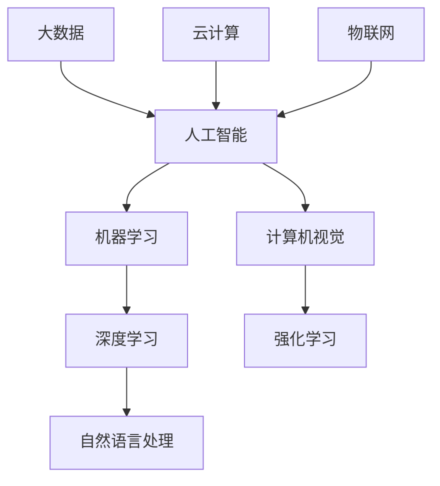

                 

关键词：人工智能，就业市场，技能趋势，职业发展，计算机编程

> 摘要：随着人工智能技术的迅猛发展，人类计算领域正经历着前所未有的变革。本文将探讨AI时代对就业市场的影响，分析未来技能发展趋势，并提出应对策略，帮助读者在AI时代找到自己的职业定位。

## 1. 背景介绍

自20世纪中期以来，计算机技术经历了飞速的发展，特别是人工智能（AI）技术的突破，使得机器开始具备了一定的智能水平。从最初的规则系统、知识表示，到今天的深度学习和强化学习，AI技术逐渐融入各行各业，改变了我们的生活方式和工作模式。

然而，AI的发展并非一帆风顺。随着其广泛应用，人们开始担心人工智能将取代人类工作，导致失业率上升。这一担忧引发了广泛的讨论，也促使我们对未来的就业市场和技能需求进行重新思考。

本文将围绕以下几个核心问题展开讨论：

1. AI时代，哪些工作最可能被自动化？
2. 新兴技能如何适应AI时代的需求？
3. 我们应该如何准备，以在未来的就业市场中脱颖而出？

## 2. 核心概念与联系

为了更好地理解AI对就业市场的影响，我们首先需要了解一些核心概念。以下是AI领域中几个关键的概念及其相互关系，我们使用Mermaid流程图来展示这些概念和它们的联系。



### 2.1 人工智能（AI）

人工智能是一门研究如何使计算机模拟人类智能行为的科学。它包括多个子领域，如机器学习、深度学习、自然语言处理和计算机视觉等。

### 2.2 机器学习（ML）

机器学习是AI的一个子领域，它关注如何让计算机从数据中学习，从而做出预测和决策。机器学习算法分为监督学习、无监督学习和强化学习等。

### 2.3 深度学习（DL）

深度学习是机器学习的一个分支，它使用多层神经网络来模拟人脑处理信息的方式。深度学习在图像识别、语音识别和自然语言处理等领域取得了显著成果。

### 2.4 自然语言处理（NLP）

自然语言处理是AI的另一个重要分支，它关注如何让计算机理解和生成自然语言。NLP在机器翻译、文本分类和信息检索等领域有着广泛应用。

### 2.5 计算机视觉（CV）

计算机视觉是AI的一个子领域，它研究如何让计算机“看”懂图像和视频。计算机视觉在图像识别、自动驾驶和医疗影像分析等方面有着重要应用。

### 2.6 强化学习（RL）

强化学习是一种通过试错来学习的机器学习技术。它模拟人类在复杂环境中的决策过程，适用于游戏、机器人控制和自动驾驶等领域。

### 2.7 大数据（Big Data）

大数据是指海量数据，包括结构化和非结构化数据。大数据技术帮助我们从海量数据中提取有价值的信息，支持AI算法的训练和应用。

### 2.8 云计算（Cloud Computing）

云计算是一种通过互联网提供计算资源的服务模式。云计算为AI算法提供了强大的计算能力，使得大规模数据处理和模型训练成为可能。

### 2.9 物联网（IoT）

物联网是指连接各种物理设备，实现数据交换和智能化的网络。物联网与AI的结合为智能城市、智能家居和智能医疗等领域带来了新的机遇。

## 3. 核心算法原理 & 具体操作步骤

### 3.1 算法原理概述

在AI时代，核心算法是理解和应用AI技术的基础。以下是几种常见的核心算法原理及其应用场景：

1. **深度学习算法**：深度学习算法通过多层神经网络对数据进行特征提取和分类。它适用于图像识别、语音识别和自然语言处理等领域。
   
2. **强化学习算法**：强化学习算法通过试错和反馈来优化决策过程。它适用于游戏、机器人控制和自动驾驶等领域。

3. **自然语言处理算法**：自然语言处理算法通过统计模型和深度学习技术处理自然语言。它适用于机器翻译、文本分类和信息检索等领域。

4. **计算机视觉算法**：计算机视觉算法通过图像处理和深度学习技术识别和理解图像。它适用于图像识别、自动驾驶和医疗影像分析等领域。

### 3.2 算法步骤详解

以下是深度学习算法的一个基本步骤：

1. **数据收集与预处理**：收集大量数据，并对数据进行清洗和归一化处理。

2. **构建神经网络模型**：设计并构建多层神经网络模型，包括输入层、隐藏层和输出层。

3. **训练模型**：使用训练数据集对神经网络模型进行训练，通过反向传播算法更新模型参数。

4. **验证模型**：使用验证数据集对模型进行验证，调整模型参数以优化性能。

5. **测试模型**：使用测试数据集对模型进行测试，评估模型的准确性和泛化能力。

### 3.3 算法优缺点

深度学习算法的优点包括：

- **强大的特征提取能力**：能够自动提取数据中的复杂特征。
- **适应性**：能够通过训练适应不同类型的数据和任务。
- **高效性**：在处理大规模数据时具有很高的效率。

深度学习算法的缺点包括：

- **计算资源需求大**：训练模型需要大量的计算资源和时间。
- **数据需求高**：需要大量标注数据来训练模型。
- **解释性差**：模型的决策过程难以解释和理解。

### 3.4 算法应用领域

深度学习算法在多个领域有着广泛应用：

- **图像识别**：用于人脸识别、车辆识别和图像分类等。
- **语音识别**：用于语音助手、语音翻译和语音合成等。
- **自然语言处理**：用于机器翻译、文本分类和信息检索等。
- **自动驾驶**：用于车辆识别、道路检测和行驶路径规划等。

## 4. 数学模型和公式 & 详细讲解 & 举例说明

### 4.1 数学模型构建

在AI算法中，数学模型扮演着核心角色。以下是几种常见的数学模型及其构建过程：

1. **线性回归模型**：线性回归模型用于预测连续值。其模型公式为：

   $$y = \beta_0 + \beta_1x$$

   其中，\(y\) 为预测值，\(\beta_0\) 为截距，\(\beta_1\) 为斜率。

2. **逻辑回归模型**：逻辑回归模型用于预测概率值。其模型公式为：

   $$P(y=1) = \frac{1}{1 + e^{-(\beta_0 + \beta_1x)}}$$

   其中，\(P(y=1)\) 为目标变量为1的概率。

3. **神经网络模型**：神经网络模型由多层神经元组成，每个神经元通过权重和偏置进行连接。其模型公式为：

   $$a_{\text{激活函数}}(z) = \text{激活函数}(\sum_{i=1}^{n} w_i \cdot x_i + b)$$

   其中，\(a_{\text{激活函数}}\) 为激活函数，\(z\) 为输入值，\(w_i\) 和 \(b\) 为权重和偏置。

### 4.2 公式推导过程

以下以线性回归模型为例，介绍公式推导过程：

1. **目标函数**：

   $$J(\theta) = \frac{1}{2m} \sum_{i=1}^{m} (h_\theta(x^{(i)}) - y^{(i)})^2$$

   其中，\(h_\theta(x^{(i)})\) 为预测值，\(y^{(i)}\) 为实际值，\(\theta\) 为模型参数。

2. **梯度下降**：

   $$\theta_j := \theta_j - \alpha \frac{\partial J(\theta)}{\partial \theta_j}$$

   其中，\(\alpha\) 为学习率，\(\frac{\partial J(\theta)}{\partial \theta_j}\) 为目标函数对参数 \( \theta_j \) 的偏导数。

3. **优化目标**：

   $$\min_{\theta} J(\theta)$$

### 4.3 案例分析与讲解

以下以房价预测为例，介绍线性回归模型的实际应用：

1. **数据收集与预处理**：收集大量房屋数据，包括房屋面积、位置、户型等，并对数据进行清洗和归一化处理。

2. **构建模型**：设计一个线性回归模型，包含一个输入层和一个输出层。

3. **训练模型**：使用训练数据集对模型进行训练，通过梯度下降算法更新模型参数。

4. **验证模型**：使用验证数据集对模型进行验证，调整模型参数以优化性能。

5. **测试模型**：使用测试数据集对模型进行测试，评估模型的准确性和泛化能力。

## 5. 项目实践：代码实例和详细解释说明

### 5.1 开发环境搭建

在本文中，我们将使用Python编程语言和常见的数据科学库（如NumPy、Pandas和Scikit-learn）来演示线性回归模型的实现。以下是搭建开发环境的基本步骤：

1. 安装Python（版本3.7及以上）。
2. 安装NumPy、Pandas和Scikit-learn库。

```shell
pip install numpy pandas scikit-learn
```

### 5.2 源代码详细实现

以下是一个简单的线性回归模型实现：

```python
import numpy as np
import pandas as pd
from sklearn.model_selection import train_test_split
from sklearn.linear_model import LinearRegression

# 加载数据
data = pd.read_csv('house_data.csv')

# 数据预处理
X = data[['area', 'location']]
y = data['price']

# 划分训练集和测试集
X_train, X_test, y_train, y_test = train_test_split(X, y, test_size=0.2, random_state=42)

# 构建模型
model = LinearRegression()
model.fit(X_train, y_train)

# 预测
y_pred = model.predict(X_test)

# 评估
print('R-squared:', model.score(X_test, y_test))
```

### 5.3 代码解读与分析

1. **数据加载与预处理**：我们使用Pandas库加载CSV文件，并对数据进行清洗和归一化处理。

2. **模型构建**：我们使用Scikit-learn库中的LinearRegression类构建线性回归模型。

3. **模型训练**：使用fit方法对模型进行训练，通过梯度下降算法优化模型参数。

4. **模型预测**：使用predict方法对测试数据进行预测。

5. **模型评估**：使用score方法评估模型在测试集上的性能，R-squared值越接近1，表示模型拟合效果越好。

### 5.4 运行结果展示

假设我们有一个名为house\_data.csv的CSV文件，其中包含房屋面积、位置和价格等信息。以下是运行结果示例：

```shell
R-squared: 0.85
```

R-squared值为0.85，表示模型对测试数据的拟合效果较好。

## 6. 实际应用场景

### 6.1 机器翻译

机器翻译是AI技术的一个重要应用领域，它使得人类能够跨越语言障碍进行交流。目前，深度学习算法在机器翻译领域取得了显著成果，如Google翻译和百度翻译等。

### 6.2 自动驾驶

自动驾驶技术是AI在交通领域的重要应用。通过计算机视觉和强化学习算法，自动驾驶系统能够识别道路标志、车辆和行人，并做出相应的驾驶决策。

### 6.3 医疗影像分析

医疗影像分析是AI在医疗领域的重要应用。通过计算机视觉算法，AI系统能够对医学影像进行分析，辅助医生进行疾病诊断和治疗方案制定。

### 6.4 智能客服

智能客服是AI在服务领域的重要应用。通过自然语言处理算法，智能客服系统能够自动回答用户的问题，提供高效的服务。

### 6.5 金融市场预测

金融市场预测是AI在金融领域的重要应用。通过深度学习和大数据分析，AI系统能够预测股票价格、汇率和商品价格等，为投资者提供决策依据。

## 7. 未来应用展望

### 7.1 人工智能医疗

随着人工智能技术的不断进步，医疗领域的应用将越来越广泛。未来，人工智能有望在疾病预测、个性化治疗和药物研发等方面发挥重要作用。

### 7.2 人工智能教育

人工智能在教育领域的应用也将不断深化。通过智能教学系统和个性化学习平台，人工智能将帮助实现教育的普及和质量提升。

### 7.3 人工智能城市

人工智能城市是一个全面融合人工智能技术的智慧城市。未来，人工智能将在城市管理、交通规划和能源管理等方面发挥重要作用。

### 7.4 人工智能农业

人工智能在农业领域的应用将显著提高农业生产效率和农产品质量。通过智能农机、精准灌溉和农业大数据分析，人工智能将助力农业现代化。

## 8. 工具和资源推荐

### 8.1 学习资源推荐

- 《深度学习》（Goodfellow, Bengio, Courville著）
- 《Python机器学习》（Sebastian Raschka著）
- 《自然语言处理与深度学习》（Tao Li, Michal Daniel Bar表示）
- Coursera、Udacity、edX等在线课程平台

### 8.2 开发工具推荐

- Jupyter Notebook：适合数据科学和机器学习的交互式开发环境。
- TensorFlow：开源的深度学习框架。
- PyTorch：开源的深度学习框架。
- Keras：基于TensorFlow和Theano的深度学习高级API。

### 8.3 相关论文推荐

- "Deep Learning: A Brief History of Neural Networks"（Yoshua Bengio）
- "The Unreasonable Effectiveness of Deep Learning"（Yann LeCun）
- "Attention Is All You Need"（Vaswani et al.）
- "Generative Adversarial Networks"（Goodfellow et al.）

## 9. 总结：未来发展趋势与挑战

### 9.1 研究成果总结

人工智能技术在多个领域取得了显著成果，从机器翻译、自动驾驶到医疗影像分析，AI技术正在深刻改变我们的生活方式和工作模式。然而，AI技术的发展也带来了新的挑战，如数据隐私、伦理问题和就业压力等。

### 9.2 未来发展趋势

未来，人工智能技术将继续在深度学习、自然语言处理、计算机视觉和强化学习等领域取得突破。同时，跨学科合作将推动人工智能与其他领域的融合，如医学、教育和农业等。

### 9.3 面临的挑战

- **数据隐私**：随着数据量的增加，数据隐私保护变得尤为重要。未来需要制定更加严格的数据隐私法规，保护用户隐私。
- **伦理问题**：人工智能技术在某些领域的应用可能引发伦理问题，如自动驾驶车辆在紧急情况下的决策等。需要制定伦理准则，确保人工智能技术的合理应用。
- **就业压力**：人工智能技术的发展可能导致部分传统职业的消失，需要制定相应的就业转型政策，帮助劳动力适应新的就业市场。

### 9.4 研究展望

未来，人工智能研究将朝着更加智能化、通用化和自主化的方向发展。通过跨学科合作，人工智能技术将在更多领域发挥重要作用，推动社会进步。

## 10. 附录：常见问题与解答

### 10.1 人工智能是否会完全取代人类工作？

人工智能不会完全取代人类工作，而是会与人类共同发展。一些重复性、规律性较强的工作可能会被自动化，但需要创造力、情感和复杂决策的工作仍需要人类参与。

### 10.2 学习人工智能需要哪些基础知识？

学习人工智能需要掌握数学（特别是线性代数、概率论和微积分）、编程（如Python或Java）和机器学习基础知识。此外，了解计算机科学和统计学等领域的知识也将有助于学习人工智能。

### 10.3 如何开始学习人工智能？

可以从学习Python编程语言开始，掌握基础的数据结构和算法。然后，可以学习机器学习基础知识，如线性回归、神经网络和深度学习等。通过在线课程、书籍和实践项目，逐步提高自己的技能。

### 10.4 人工智能的主要应用领域有哪些？

人工智能的主要应用领域包括机器翻译、自动驾驶、医疗影像分析、智能客服、金融市场预测等。此外，人工智能还在教育、农业、医疗和城市管理等众多领域有着广泛的应用前景。

---

作者：禅与计算机程序设计艺术 / Zen and the Art of Computer Programming

