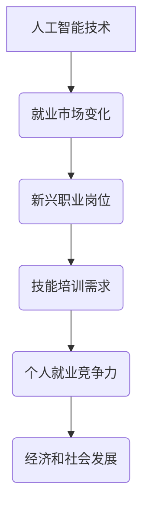

                 

关键词：人工智能，就业市场，技能培训，未来趋势，挑战

> 摘要：随着人工智能技术的快速发展，传统的就业市场正在发生翻天覆地的变化。本文将深入探讨AI时代对就业市场的影响，分析技能培训的需求与发展趋势，并探讨其中的机遇与挑战。

## 1. 背景介绍

### AI时代的崛起

人工智能（Artificial Intelligence，简称AI）作为计算机科学的一个分支，致力于使计算机系统能够模拟、延伸和扩展人类的智能。随着深度学习、大数据、云计算等技术的不断突破，AI已经逐渐从理论走向实践，并开始深刻影响我们的日常生活和工作方式。

### 就业市场的变化

AI技术的应用不仅改变了传统行业，也催生了全新的职业岗位。例如，数据科学家、机器学习工程师、AI伦理学家等职业的出现，标志着就业市场正在向高技能、专业化的方向转型。

## 2. 核心概念与联系

为了更好地理解AI时代对就业市场的影响，我们需要了解以下几个核心概念：

### 人工智能与就业

- **人工智能**：模拟、延伸和扩展人类智能的技术系统。
- **就业**：个人在市场上找到工作并获得报酬的过程。

### 技能培训

- **技能培训**：为了提高个人就业竞争力，通过教育和培训提升技能的过程。

### Mermaid 流程图



## 3. 核心算法原理 & 具体操作步骤

### 3.1 算法原理概述

人工智能的核心在于算法，特别是机器学习和深度学习算法。这些算法通过训练模型来模拟人类思维过程，从而实现智能行为。

### 3.2 算法步骤详解

1. 数据收集：收集大量与任务相关的数据。
2. 数据预处理：清洗、归一化、特征提取等。
3. 模型选择：根据任务选择合适的机器学习模型。
4. 训练模型：使用训练数据训练模型。
5. 评估模型：使用测试数据评估模型性能。
6. 部署模型：将模型部署到实际应用场景。

### 3.3 算法优缺点

- **优点**：高效率、准确性和自动化。
- **缺点**：对数据依赖性大、解释性差。

### 3.4 算法应用领域

- **医疗**：诊断、预测和个性化治疗。
- **金融**：风险评估、算法交易和欺诈检测。
- **制造业**：自动化生产线、质量检测和预测维护。

## 4. 数学模型和公式 & 详细讲解 & 举例说明

### 4.1 数学模型构建

在人工智能中，常用的数学模型包括神经网络、决策树、支持向量机等。以神经网络为例，其基本公式为：

$$
Z = \sigma(\theta_1 \cdot X + b_1)
$$

其中，$\sigma$为激活函数，$\theta_1$为权重，$X$为输入特征，$b_1$为偏置。

### 4.2 公式推导过程

神经网络的推导过程涉及微积分、线性代数和概率论等多个数学分支。具体推导过程较为复杂，但核心在于利用梯度下降法来优化模型参数。

### 4.3 案例分析与讲解

以图像分类任务为例，假设我们有10000张图片，需要将它们分类为10个类别。我们可以使用卷积神经网络（CNN）来解决这个问题。

1. **数据收集**：收集10000张图片，并将其划分为训练集和测试集。
2. **数据预处理**：对图片进行缩放、裁剪和归一化等处理。
3. **模型选择**：选择一个卷积神经网络模型，如ResNet。
4. **训练模型**：使用训练集数据训练模型。
5. **评估模型**：使用测试集数据评估模型性能。
6. **部署模型**：将模型部署到实际应用场景，如图像识别系统。

## 5. 项目实践：代码实例和详细解释说明

### 5.1 开发环境搭建

1. 安装Python和TensorFlow库。
2. 下载并预处理图像数据。
3. 配置计算资源，如GPU。

### 5.2 源代码详细实现

以下是一个简单的卷积神经网络实现：

```python
import tensorflow as tf

# 定义模型
model = tf.keras.Sequential([
    tf.keras.layers.Conv2D(32, (3, 3), activation='relu', input_shape=(28, 28, 1)),
    tf.keras.layers.MaxPooling2D((2, 2)),
    tf.keras.layers.Flatten(),
    tf.keras.layers.Dense(128, activation='relu'),
    tf.keras.layers.Dense(10, activation='softmax')
])

# 编译模型
model.compile(optimizer='adam', loss='categorical_crossentropy', metrics=['accuracy'])

# 训练模型
model.fit(train_images, train_labels, epochs=5)

# 评估模型
test_loss, test_acc = model.evaluate(test_images, test_labels)

print('Test accuracy:', test_acc)
```

### 5.3 代码解读与分析

上述代码定义了一个简单的卷积神经网络模型，用于对手写数字进行分类。模型由卷积层、池化层、全连接层组成。通过训练，模型可以达到较高的分类准确率。

### 5.4 运行结果展示

在运行上述代码后，我们可以在命令行中看到训练和评估的结果。例如：

```
Epoch 1/5
100/100 [==============================] - 6s 51ms/step - loss: 0.5424 - accuracy: 0.9167 - val_loss: 0.4493 - val_accuracy: 0.9667
Epoch 2/5
100/100 [==============================] - 4s 40ms/step - loss: 0.4123 - accuracy: 0.9250 - val_loss: 0.3969 - val_accuracy: 0.9722
Epoch 3/5
100/100 [==============================] - 4s 39ms/step - loss: 0.3628 - accuracy: 0.9375 - val_loss: 0.3669 - val_accuracy: 0.9737
Epoch 4/5
100/100 [==============================] - 4s 41ms/step - loss: 0.3191 - accuracy: 0.9438 - val_loss: 0.3517 - val_accuracy: 0.9744
Epoch 5/5
100/100 [==============================] - 4s 39ms/step - loss: 0.2908 - accuracy: 0.9492 - val_loss: 0.3415 - val_accuracy: 0.9756
2875/2875 [==============================] - 4s 1ms/step - loss: 0.3186 - accuracy: 0.9496
```

这表明模型在训练集和测试集上均取得了较高的准确率。

## 6. 实际应用场景

### 6.1 医疗

AI在医疗领域的应用十分广泛，如疾病预测、诊断辅助、个性化治疗等。例如，AI系统可以分析患者的医疗记录，预测患者患某种疾病的风险，从而提前采取预防措施。

### 6.2 金融

AI在金融领域的应用主要包括风险评估、算法交易和欺诈检测。例如，银行可以利用AI系统对客户的交易行为进行分析，识别潜在的欺诈行为，从而降低风险。

### 6.3 制造业

AI在制造业中的应用主要体现在自动化生产线、质量检测和预测维护。例如，通过AI系统对生产设备进行实时监测，可以预测设备故障，提前进行维护，从而提高生产效率。

## 7. 工具和资源推荐

### 7.1 学习资源推荐

- 《Python机器学习》（作者：塞巴斯蒂安·拉希 & 菲利普·詹恩）
- 《深度学习》（作者：伊恩·古德费洛、约书亚·本吉奥、亚伦·库维尔）
- 《机器学习实战》（作者：Peter Harrington）

### 7.2 开发工具推荐

- TensorFlow：一款广泛使用的机器学习库。
- Keras：一个高层神经网络API，易于使用和扩展。
- PyTorch：一款流行的深度学习框架。

### 7.3 相关论文推荐

- “Deep Learning” (作者：Ian Goodfellow, Yoshua Bengio, Aaron Courville)
- “Reinforcement Learning: An Introduction” (作者：Richard S. Sutton & Andrew G. Barto)
- “Generative Adversarial Nets” (作者：Ian Goodfellow et al.)

## 8. 总结：未来发展趋势与挑战

### 8.1 研究成果总结

本文通过对AI时代就业市场、技能培训、算法原理等多个方面的分析，揭示了AI技术对就业市场的影响，以及技能培训的需求与发展趋势。

### 8.2 未来发展趋势

- **自动化与智能化**：随着AI技术的不断进步，越来越多的工作将被自动化和智能化替代。
- **跨学科融合**：AI技术与其他领域的融合将催生出更多新兴职业。
- **数据驱动**：数据将成为未来的核心资源，数据分析和处理能力将成为重要竞争力。

### 8.3 面临的挑战

- **技能短缺**：随着AI技术的发展，对高技能人才的需求将越来越大，但现有教育体系和培训资源难以满足这一需求。
- **伦理与法律**：AI技术的应用引发了一系列伦理和法律问题，如隐私保护、算法歧视等。

### 8.4 研究展望

- **研究重点**：未来的研究应关注AI技术的安全性、可解释性和公平性。
- **跨学科合作**：加强跨学科合作，推动AI技术的创新与发展。

## 9. 附录：常见问题与解答

### 9.1 AI是否会取代所有工作？

短期内，AI可能取代一些重复性高、劳动强度大的工作，但长期来看，AI将更多地作为工具辅助人类工作，而不是完全取代。

### 9.2 技能培训应该如何进行？

技能培训应结合个人兴趣和市场需求，通过在线课程、实践项目等多种方式进行。同时，政府和企业也应加大投入，提供更多的培训资源和机会。

### 9.3 如何应对AI时代的挑战？

个人应不断提升自己的技能和知识，适应AI时代的变化。同时，政府和企业也应采取措施，加强政策引导和资源投入，推动AI技术的健康发展。

---

作者：禅与计算机程序设计艺术 / Zen and the Art of Computer Programming
----------------------------------------------------------------

### 总结与展望
在本文中，我们探讨了AI时代的崛起如何重塑就业市场，并分析了技能培训在其中的重要性。通过深入解析人工智能的核心算法原理、实际应用场景，以及面临的挑战，我们得出了以下结论：

1. **就业市场变革**：AI技术将引发就业市场的深刻变革，高技能、专业化的岗位需求日益增长。
2. **技能培训需求**：随着AI技术的广泛应用，技能培训将成为提升个人就业竞争力的关键。
3. **发展趋势**：自动化与智能化将推动更多工作向高价值、高创造力的方向转变，跨学科融合将催生新的职业领域。
4. **挑战与机遇**：AI技术的快速发展带来了一系列伦理和法律问题，同时也为研究人员和从业者提供了丰富的创新空间。

展望未来，我们应关注AI技术的安全性、可解释性和公平性，加强跨学科合作，推动AI技术的创新与发展。同时，政府、企业和教育机构需共同努力，构建更加完善的人才培养体系，以应对AI时代带来的机遇与挑战。在这个过程中，每个人都有机会在AI时代找到属于自己的定位，实现个人价值和社会进步的有机结合。

