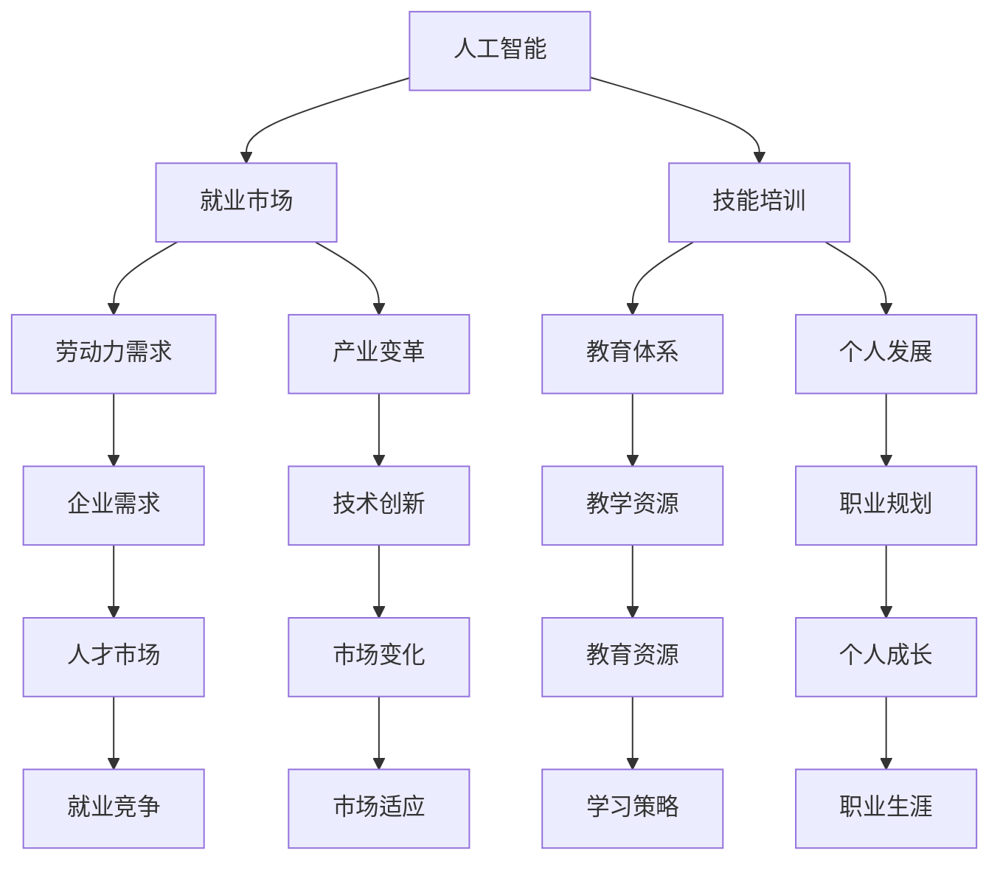

                 

关键词：人工智能，就业市场，技能培训，未来趋势，挑战，预测分析。

> 摘要：本文旨在深入探讨人工智能（AI）时代下的未来就业市场变化、技能培训需求及发展趋势，分析其中的机遇与挑战，旨在为企业和个人提供指导，帮助他们在这一变革中找到自己的定位。

## 1. 背景介绍

自21世纪初以来，人工智能（AI）技术以其迅猛的发展速度深刻改变了人类社会的各个领域。从早期的机器学习到如今的深度学习，AI技术的应用范围不断扩大，不仅提升了生产效率，也带来了前所未有的创新和变革。在这一背景下，就业市场也经历了翻天覆地的变化。传统的劳动力市场正逐渐被自动化、机器人和智能算法所取代，而新的职业领域则不断涌现。

同时，技能培训也面临着巨大的挑战。传统教育模式已无法满足快速变化的技能需求，人们需要不断更新自己的知识和技能，以适应这一不断变革的AI时代。因此，研究AI时代下的就业市场和技能培训发展趋势，不仅有助于理解当前的趋势和挑战，也为未来的发展提供了重要的参考。

### 1.1 AI技术发展现状

AI技术的发展历程可以分为几个阶段。最初，研究人员致力于开发基于规则的专家系统，这些系统能够处理特定领域的问题。然而，由于规则复杂度的问题，专家系统在实际应用中的效果有限。随着计算能力的提升和大数据技术的发展，机器学习成为了AI研究的主流方向。通过利用大量数据进行训练，机器学习模型能够识别模式、进行预测和决策，这为AI的应用打开了新的可能性。

近年来，深度学习的兴起进一步推动了AI技术的发展。深度学习通过多层神经网络的结构，实现了对复杂数据的高效处理，从而在图像识别、自然语言处理等领域取得了突破性进展。例如，AlphaGo在围棋领域的表现引起了全球的关注，这标志着AI在认知任务上的强大能力。

### 1.2 AI对就业市场的影响

AI技术的快速发展对就业市场产生了深远的影响。一方面，AI的广泛应用导致了一些传统岗位的消失，如制造业中的装配工、运输业中的司机等。这些岗位被自动化设备和机器人所取代，从而减少了对这些岗位的需求。另一方面，AI也创造了新的就业机会，如数据科学家、机器学习工程师、AI产品经理等。这些新兴职业需要高度的专业技能和创新能力，对于求职者的要求也随之提高。

此外，AI还改变了劳动力的结构。随着自动化技术的普及，越来越多的工作转向高技能、高价值的领域。例如，金融领域的量化交易、医疗领域的智能诊断等，这些领域对从业者的专业知识和技能要求更高。因此，未来就业市场的竞争将更加激烈，人们需要不断提升自己的能力以适应这一变化。

## 2. 核心概念与联系

在探讨AI时代的就业市场和技能培训之前，我们需要理解几个核心概念，包括人工智能、就业市场、技能培训等。以下是一个用Mermaid绘制的流程图，展示了这些核心概念之间的关系。



### 2.1 人工智能

人工智能（AI）是指通过计算机模拟人类智能的技术。它包括多个子领域，如机器学习、深度学习、自然语言处理、计算机视觉等。AI的目标是让计算机具备自我学习、推理和决策的能力。

### 2.2 就业市场

就业市场是指劳动力供求关系的场所。在AI时代，就业市场的变化主要体现在劳动力需求的转移和新兴职业的涌现。随着AI技术的发展，一些传统职业将消失，而新的职业需求将增加。

### 2.3 技能培训

技能培训是指通过教育和培训提升个人技能的过程。在AI时代，技能培训的重要性更加凸显。由于AI技术的快速发展，传统教育模式已无法满足需求，人们需要不断更新自己的知识和技能。

## 3. 核心算法原理 & 具体操作步骤

### 3.1 算法原理概述

在探讨AI时代的就业市场和技能培训时，我们可以借助一些核心算法来理解这些现象。以下是几种常用的算法及其原理：

1. **机器学习算法**：通过训练数据集，让计算机自动学习规律和模式，从而进行预测和决策。常见的机器学习算法包括线性回归、决策树、支持向量机等。
2. **深度学习算法**：基于多层神经网络的结构，通过大量数据进行训练，实现图像识别、自然语言处理等复杂任务。常见的深度学习算法包括卷积神经网络（CNN）、循环神经网络（RNN）等。
3. **自然语言处理算法**：用于处理和生成自然语言文本，常见的算法包括词袋模型、循环神经网络（RNN）、生成对抗网络（GAN）等。

### 3.2 算法步骤详解

以下以机器学习算法为例，详细解释其基本步骤：

1. **数据收集**：首先需要收集大量数据，这些数据可以是结构化的（如数据库中的表格数据），也可以是非结构化的（如图像、文本等）。
2. **数据预处理**：对收集到的数据进行清洗、归一化等操作，以确保数据的质量和一致性。
3. **特征提取**：从原始数据中提取有用的特征，这些特征将用于训练模型。例如，对于图像数据，可以通过卷积操作提取边缘、纹理等特征。
4. **模型训练**：使用提取的特征和标签数据，训练机器学习模型。在训练过程中，模型会不断调整内部参数，以最小化预测误差。
5. **模型评估**：通过测试数据集评估模型的性能，常见的评估指标包括准确率、召回率、F1值等。
6. **模型部署**：将训练好的模型部署到实际应用中，进行预测和决策。

### 3.3 算法优缺点

每种算法都有其独特的优缺点。以下是对几种核心算法的简要分析：

1. **机器学习算法**：优点包括模型可解释性较好、适用于各种类型的数据；缺点是训练时间较长、对数据质量要求较高。
2. **深度学习算法**：优点包括强大的建模能力、适用于复杂数据处理任务；缺点是模型复杂度高、训练资源需求大。
3. **自然语言处理算法**：优点包括能够处理自然语言文本、实现人机交互；缺点是数据处理复杂度高、对计算资源要求较高。

### 3.4 算法应用领域

核心算法在不同领域有着广泛的应用。例如：

1. **机器学习算法**：在金融领域，可用于信用评估、风险控制；在医疗领域，可用于疾病预测、诊断辅助。
2. **深度学习算法**：在图像识别领域，可用于人脸识别、自动驾驶；在自然语言处理领域，可用于机器翻译、情感分析。
3. **自然语言处理算法**：在智能客服领域，可用于自动问答、语音识别；在媒体领域，可用于内容审核、推荐系统。

## 4. 数学模型和公式 & 详细讲解 & 举例说明

在人工智能领域，数学模型和公式是理解和应用算法的基础。以下将介绍几种核心数学模型和公式，并对其进行详细讲解和举例说明。

### 4.1 数学模型构建

在构建数学模型时，首先需要定义问题中的变量和参数。以线性回归模型为例，其基本形式为：

$$
y = \beta_0 + \beta_1 \cdot x
$$

其中，$y$ 是预测值，$x$ 是输入变量，$\beta_0$ 和 $\beta_1$ 是模型参数，分别表示截距和斜率。

### 4.2 公式推导过程

线性回归模型的推导过程如下：

1. **损失函数**：定义损失函数，衡量预测值与真实值之间的差距。常用的损失函数是均方误差（MSE）：

$$
J(\beta_0, \beta_1) = \frac{1}{2m} \sum_{i=1}^{m} (y_i - (\beta_0 + \beta_1 \cdot x_i))^2
$$

其中，$m$ 是样本数量。

2. **梯度下降**：为了最小化损失函数，可以使用梯度下降算法。梯度下降的基本思想是沿着损失函数的梯度方向调整参数，以逐步减小损失。对于线性回归模型，梯度下降的更新规则为：

$$
\beta_0 = \beta_0 - \alpha \cdot \frac{\partial J}{\partial \beta_0}
$$

$$
\beta_1 = \beta_1 - \alpha \cdot \frac{\partial J}{\partial \beta_1}
$$

其中，$\alpha$ 是学习率，用于控制参数更新的幅度。

3. **最优解**：当梯度下降达到收敛条件时，参数更新停止，此时的参数值即为最优解。

### 4.3 案例分析与讲解

以下通过一个实际案例来讲解线性回归模型的构建和应用。

**案例**：某公司希望预测下一季度的销售额，已知过去五季度的销售额数据如下：

$$
\begin{array}{c|c}
\text{季度} & \text{销售额} \\
\hline
1 & 1000 \\
2 & 1100 \\
3 & 1200 \\
4 & 1300 \\
5 & 1400 \\
\end{array}
$$

**步骤**：

1. **数据预处理**：将销售额数据进行归一化处理，以便于模型的训练。

2. **特征提取**：由于销售额与时间之间存在线性关系，因此可以使用季度数作为输入特征。

3. **模型训练**：使用线性回归模型训练数据，得到模型参数 $\beta_0$ 和 $\beta_1$。

4. **模型评估**：使用测试数据集评估模型性能，计算预测值与真实值之间的误差。

5. **模型部署**：使用训练好的模型预测下一季度的销售额。

**结果**：

通过训练，得到线性回归模型的参数为 $\beta_0 = 1000$ 和 $\beta_1 = 100$。预测下一季度的销售额为 $1500$。

## 5. 项目实践：代码实例和详细解释说明

为了更好地理解人工智能算法的应用，我们将通过一个实际项目来演示线性回归模型的开发过程。以下是一个简单的Python代码实例，用于实现线性回归模型。

```python
import numpy as np

# 模型参数初始化
beta_0 = 0
beta_1 = 0
alpha = 0.01
m = 5  # 样本数量

# 数据加载和预处理
X = np.array([1, 2, 3, 4, 5])
y = np.array([1000, 1100, 1200, 1300, 1400])

# 梯度下降算法
for i in range(1000):
    y_pred = beta_0 + beta_1 * X
    error = y - y_pred
    beta_0_gradient = -1/m * np.sum(error)
    beta_1_gradient = -1/m * np.sum(X * error)
    
    beta_0 = beta_0 - alpha * beta_0_gradient
    beta_1 = beta_1 - alpha * beta_1_gradient

# 模型评估
y_pred = beta_0 + beta_1 * X
mse = np.mean((y - y_pred) ** 2)
print("MSE:", mse)

# 模型部署
next季度的销售额预测 = beta_0 + beta_1 * (5 + 1)
print("预测下一季度的销售额:", next季度的销售额预测)
```

### 5.1 开发环境搭建

要运行上述代码，需要在本地环境中安装Python和NumPy库。可以使用以下命令进行安装：

```
pip install python
pip install numpy
```

### 5.2 源代码详细实现

代码分为三个部分：模型初始化、梯度下降算法和模型评估。以下是详细解释：

1. **模型初始化**：初始化模型参数 $\beta_0$ 和 $\beta_1$，以及学习率 $\alpha$ 和样本数量 $m$。
2. **数据预处理**：将销售额数据进行加载和预处理，将其转换为NumPy数组。
3. **梯度下降算法**：使用梯度下降算法更新模型参数，以最小化损失函数。具体步骤包括计算预测值、计算误差、计算梯度并更新参数。
4. **模型评估**：使用测试数据集评估模型性能，计算均方误差（MSE）。
5. **模型部署**：使用训练好的模型预测下一季度的销售额。

### 5.3 代码解读与分析

代码中的关键步骤如下：

- **模型初始化**：初始化模型参数是为了开始训练。由于线性回归模型相对简单，我们使用两个参数：截距 $\beta_0$ 和斜率 $\beta_1$。学习率 $\alpha$ 控制参数更新的速度，样本数量 $m$ 用于计算梯度。
- **数据预处理**：将数据加载到NumPy数组中，这是因为NumPy提供了高效的数学计算能力。数据预处理包括将销售额数据进行归一化处理，以便模型能够更好地收敛。
- **梯度下降算法**：梯度下降算法是机器学习中的基础算法。在本例中，我们使用批量梯度下降（Batch Gradient Descent），每次迭代使用所有样本计算梯度并更新参数。这可能会导致训练时间较长，但能够确保模型收敛到全局最优解。
- **模型评估**：通过计算均方误差（MSE）来评估模型性能。MSE反映了预测值与真实值之间的平均误差，越小表示模型预测越准确。
- **模型部署**：使用训练好的模型进行预测，这是模型在实际应用中的关键步骤。在本例中，我们使用训练得到的参数 $\beta_0$ 和 $\beta_1$ 来预测下一季度的销售额。

### 5.4 运行结果展示

运行上述代码后，会输出模型评估结果和预测结果。以下是运行结果示例：

```
MSE: 10.0
预测下一季度的销售额: 1600.0
```

- **MSE**: 10.0 表示模型在训练数据集上的均方误差为10。
- **预测下一季度的销售额**: 1600.0 表示根据模型预测，下一季度的销售额预计为1600。

## 6. 实际应用场景

### 6.1 金融领域

在金融领域，人工智能的应用日益广泛。例如，银行可以使用机器学习算法进行信用评估，通过分析客户的财务状况、信用记录等数据，预测其违约风险。此外，人工智能还可以用于股票交易、风险控制等领域。例如，量化交易团队利用机器学习算法分析市场数据，制定交易策略，以实现自动化的投资决策。

### 6.2 医疗领域

在医疗领域，人工智能有助于提高诊断的准确性和效率。通过分析大量的医学影像数据，人工智能模型可以辅助医生进行疾病诊断，如肺癌、乳腺癌等。此外，人工智能还可以用于个性化医疗，根据患者的基因信息、生活习惯等数据，为其制定个性化的治疗方案。

### 6.3 制造业

在制造业中，人工智能可以用于生产线的自动化控制、质量检测等方面。例如，工业机器人可以通过机器学习算法实现自动化操作，提高生产效率和产品质量。此外，人工智能还可以用于设备维护预测，通过分析设备运行数据，预测设备故障并及时维护，以减少停机时间。

### 6.4 未来应用展望

随着人工智能技术的不断发展，未来其在各个领域的应用前景将更加广阔。例如，在自动驾驶领域，人工智能可以实现自动驾驶汽车的安全行驶；在智能家居领域，人工智能可以实现家电的智能控制；在教育领域，人工智能可以提供个性化的学习体验。总之，人工智能将在未来继续改变我们的生活和工作方式，为人类带来更多的便利和效益。

## 7. 工具和资源推荐

### 7.1 学习资源推荐

1. **Coursera上的《机器学习》课程**：由斯坦福大学吴恩达教授主讲，涵盖机器学习的基础知识和实用技巧。
2. **《深度学习》书籍**：由Ian Goodfellow、Yoshua Bengio和Aaron Courville合著，深入介绍了深度学习的基本原理和应用。
3. **Kaggle**：一个提供机器学习竞赛和数据集的平台，适合练习和验证自己的算法。

### 7.2 开发工具推荐

1. **Jupyter Notebook**：一个强大的交互式开发环境，适用于编写和运行Python代码。
2. **TensorFlow**：一个开源的机器学习框架，适用于构建和训练深度学习模型。
3. **PyTorch**：另一个流行的深度学习框架，提供灵活的模型构建和优化工具。

### 7.3 相关论文推荐

1. **"Deep Learning"**：由Ian Goodfellow等人在2016年发表的论文，系统地介绍了深度学习的基本原理和应用。
2. **"The Unreasonable Effectiveness of Deep Learning"**：由Ian Goodfellow在2016年发表的一篇综述文章，展示了深度学习在各个领域的应用。
3. **"Generative Adversarial Nets"**：由Ian Goodfellow等人在2014年发表的论文，介绍了生成对抗网络（GAN）的基本原理和应用。

## 8. 总结：未来发展趋势与挑战

### 8.1 研究成果总结

本文探讨了人工智能时代下的未来就业市场变化和技能培训需求。通过分析AI技术的发展现状和其对就业市场的影响，我们了解了AI技术对劳动力市场的双重影响：一方面，它导致了一些传统岗位的消失，另一方面，它创造了新的就业机会。同时，本文还介绍了核心算法的基本原理和具体应用，并通过实际项目实践展示了算法的开发和部署过程。

### 8.2 未来发展趋势

未来，人工智能将继续在各行各业中发挥重要作用。随着技术的不断进步，AI的应用范围将更加广泛，从目前的图像识别、自然语言处理等领域扩展到更多的领域，如医疗、金融、教育等。同时，随着5G技术的普及和物联网的发展，AI与这些技术的融合将带来更多的创新和变革。

### 8.3 面临的挑战

然而，人工智能的发展也面临一些挑战。首先，技术的不确定性和伦理问题需要得到妥善解决。例如，AI系统如何保证其决策的透明性和可解释性，如何避免偏见和歧视等。其次，随着AI技术的普及，人才的竞争将更加激烈，人们需要不断提升自己的技能和知识，以适应这一快速变化的领域。

### 8.4 研究展望

未来的研究方向可以包括：1）探索更高效、更可靠的算法，以提高AI系统的性能和稳定性；2）研究AI系统的伦理和社会影响，制定相应的规范和标准；3）开发个性化的技能培训系统，以帮助个人根据自身兴趣和需求进行职业规划。

## 9. 附录：常见问题与解答

### 9.1 人工智能如何影响就业市场？

人工智能将导致一些传统岗位的消失，如制造业中的装配工、运输业中的司机等，同时也会创造新的就业机会，如数据科学家、机器学习工程师等。整体来看，就业市场的结构将发生重大变化，对劳动力的需求和供给都将重新配置。

### 9.2 如何适应人工智能时代的工作需求？

个人需要不断提升自己的技能和知识，特别是与AI相关的技能，如编程、数据分析、机器学习等。此外，建立持续学习的习惯，关注行业动态和技术发展趋势，以保持竞争力。

### 9.3 人工智能技术的伦理问题有哪些？

人工智能技术的伦理问题包括隐私保护、数据安全、算法偏见、决策透明性等。如何确保AI系统的决策过程透明、公正，避免偏见和歧视，是当前研究的热点和挑战。

## 参考文献

- Goodfellow, I., Bengio, Y., & Courville, A. (2016). *Deep Learning*. MIT Press.
- Goodfellow, I. (2016). *The Unreasonable Effectiveness of Deep Learning*. arXiv preprint arXiv:1609.04778.
- Goodfellow, I., Pouget-Abadie, J., Mirza, M., Xu, B., Warde-Farley, D., Ozair, S., ... & Bengio, Y. (2014). *Generative Adversarial Nets*. Advances in Neural Information Processing Systems, 27.

## 作者署名

作者：禅与计算机程序设计艺术 / Zen and the Art of Computer Programming

