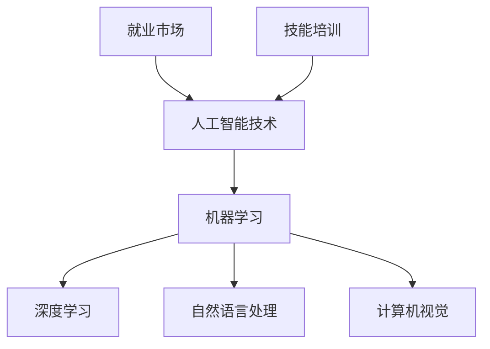

                 

关键词：人工智能、就业市场、技能培训、未来发展趋势、机遇

摘要：随着人工智能技术的飞速发展，人类计算正经历着前所未有的变革。本文从多个角度探讨AI时代下未来就业市场的变化，分析技能培训的需求和趋势，以及预测人工智能技术在未来各行业的应用和发展机遇。

## 1. 背景介绍

近年来，人工智能（AI）技术取得了显著进展，从最初的简单规则系统，发展到如今的深度学习和自然语言处理等领域。AI技术的进步不仅改变了传统行业的运营模式，还催生了大量的新兴职业。与此同时，全球范围内的就业市场正在发生深刻变革，传统职业的消失和新兴职业的崛起不断挑战着劳动者的技能和知识储备。为了应对这种变化，技能培训成为企业和个人关注的焦点。

本文将围绕以下几个方面展开讨论：

1. **AI时代的就业市场现状**：分析当前就业市场的趋势和挑战。
2. **技能培训的需求和趋势**：探讨新兴技能的培育和现有技能的升级。
3. **人工智能技术在各行业的应用**：分析AI技术在不同领域的具体应用场景和前景。
4. **未来应用展望**：预测人工智能技术在未来的发展趋势和潜在挑战。
5. **工具和资源推荐**：为读者提供相关的学习资源和发展方向。

## 2. 核心概念与联系

为了更好地理解AI时代下的就业市场变化，我们需要先了解一些核心概念和它们之间的联系。

### 2.1 人工智能技术

人工智能技术是指使计算机系统具备类似人类智能的能力，包括学习、推理、感知、理解和决策等。主要的技术包括机器学习、深度学习、自然语言处理和计算机视觉等。

### 2.2 机器学习

机器学习是人工智能的核心技术之一，它通过算法让计算机从数据中自动学习和改进。常见的机器学习算法包括线性回归、决策树、神经网络等。

### 2.3 深度学习

深度学习是机器学习的一个子领域，它通过多层神经网络来模拟人脑的工作方式。深度学习在图像识别、语音识别和自然语言处理等领域取得了显著成果。

### 2.4 自然语言处理

自然语言处理是研究计算机如何理解、生成和处理人类语言的技术。它包括文本分类、情感分析、机器翻译等应用。

### 2.5 计算机视觉

计算机视觉是使计算机能够像人类一样感知和理解视觉信息的技术。它广泛应用于图像识别、视频分析、自动驾驶等领域。

以下是这些核心概念的 Mermaid 流程图：



## 3. 核心算法原理 & 具体操作步骤

### 3.1 算法原理概述

在AI时代，核心算法原理包括但不限于以下几个方面：

- **机器学习算法**：通过数据训练模型，使计算机能够从数据中学习并做出预测。
- **深度学习算法**：利用多层神经网络模拟人脑处理信息的方式。
- **自然语言处理算法**：用于处理和理解自然语言文本。
- **计算机视觉算法**：用于理解和分析图像和视频数据。

### 3.2 算法步骤详解

- **机器学习算法**：
  1. 数据收集与预处理：收集相关数据并进行清洗和预处理。
  2. 特征提取：从原始数据中提取有用的特征。
  3. 模型训练：使用训练数据集训练模型。
  4. 模型评估：使用验证数据集评估模型性能。
  5. 模型优化：根据评估结果调整模型参数。

- **深度学习算法**：
  1. 网络结构设计：设计合适的神经网络结构。
  2. 损失函数定义：定义网络输出与目标之间的损失函数。
  3. 反向传播：利用反向传播算法更新网络权重。
  4. 模型训练：迭代训练网络，直至满足特定性能指标。

- **自然语言处理算法**：
  1. 分词与词性标注：将文本拆分成词语，并对词语进行词性标注。
  2. 语法分析：分析句子的语法结构。
  3. 情感分析：判断文本的情感倾向。
  4. 机器翻译：将一种语言的文本翻译成另一种语言。

- **计算机视觉算法**：
  1. 特征提取：从图像中提取具有区分性的特征。
  2. 目标检测：定位图像中的目标并分类。
  3. 人脸识别：识别图像中的人脸。
  4. 视频分析：分析视频数据中的行为和事件。

### 3.3 算法优缺点

- **机器学习算法**：
  - 优点：具有较强的泛化能力，适用于各种复杂问题。
  - 缺点：需要大量的训练数据和计算资源，且模型调优过程繁琐。

- **深度学习算法**：
  - 优点：能够处理大规模数据，效果优于传统机器学习算法。
  - 缺点：对数据质量和计算资源要求较高，模型解释性较差。

- **自然语言处理算法**：
  - 优点：能够处理和理解自然语言文本，应用广泛。
  - 缺点：处理效果受限于语言表达的复杂性和多样性。

- **计算机视觉算法**：
  - 优点：能够理解和分析视觉信息，应用领域广泛。
  - 缺点：对光照、角度和背景等因素敏感，识别效果受限制。

### 3.4 算法应用领域

- **机器学习算法**：广泛应用于数据挖掘、金融风控、医疗诊断等领域。
- **深度学习算法**：广泛应用于图像识别、语音识别、自然语言处理等领域。
- **自然语言处理算法**：广泛应用于社交媒体分析、智能客服、机器翻译等领域。
- **计算机视觉算法**：广泛应用于人脸识别、自动驾驶、安防监控等领域。

## 4. 数学模型和公式 & 详细讲解 & 举例说明

在AI时代，数学模型和公式是理解和应用人工智能技术的基础。以下介绍几个核心的数学模型和公式，并提供详细讲解和实际应用案例。

### 4.1 数学模型构建

在构建数学模型时，通常需要考虑以下几个关键步骤：

- **数据收集**：收集与问题相关的数据。
- **特征提取**：从原始数据中提取有用的特征。
- **模型选择**：选择合适的数学模型。
- **模型训练**：使用训练数据集训练模型。
- **模型评估**：使用验证数据集评估模型性能。

### 4.2 公式推导过程

以下是一个简单的线性回归模型的推导过程：

1. **目标函数**：

   $$
   J(\theta) = \frac{1}{2m} \sum_{i=1}^{m} (h_\theta(x^{(i)}) - y^{(i)})^2
   $$

   其中，$m$是样本数量，$h_\theta(x^{(i)})$是模型预测的输出，$y^{(i)}$是实际输出。

2. **梯度下降**：

   $$
   \theta_j := \theta_j - \alpha \frac{\partial J(\theta)}{\partial \theta_j}
   $$

   其中，$\alpha$是学习率，$\theta_j$是模型参数。

### 4.3 案例分析与讲解

假设我们要预测房价，可以使用线性回归模型进行建模。

- **数据收集**：收集房屋的面积、卧室数量、位置等数据。
- **特征提取**：将数据转换为特征向量。
- **模型选择**：选择线性回归模型。
- **模型训练**：使用梯度下降算法训练模型。
- **模型评估**：使用验证数据集评估模型性能。

以下是模型的Python代码实现：

```python
import numpy as np

# 模型参数
theta = np.random.rand(1, 2)

# 学习率
alpha = 0.01

# 损失函数
def compute_loss(X, y, theta):
    m = len(y)
    h = np.dot(X, theta)
    loss = 1/(2*m) * np.sum((h - y)**2)
    return loss

# 梯度下降
def gradient_descent(X, y, theta, alpha, num_iterations):
    m = len(y)
    for i in range(num_iterations):
        h = np.dot(X, theta)
        loss = compute_loss(X, y, theta)
        theta = theta - alpha/m * (X.T.dot(h - y))
    return theta

# 训练模型
theta = gradient_descent(X, y, theta, alpha, 1000)

# 输出模型参数
print("模型参数：", theta)
```

## 5. 项目实践：代码实例和详细解释说明

### 5.1 开发环境搭建

为了实现一个简单的机器学习项目，我们需要搭建一个Python开发环境。以下是搭建步骤：

1. **安装Python**：下载并安装Python 3.8版本。
2. **安装Jupyter Notebook**：在Python环境中安装Jupyter Notebook。
3. **安装相关库**：使用pip命令安装numpy、matplotlib等常用库。

```bash
pip install numpy matplotlib
```

### 5.2 源代码详细实现

以下是一个简单的线性回归项目的Python代码实现：

```python
import numpy as np
import matplotlib.pyplot as plt

# 数据集
X = np.array([[1, 2], [2, 3], [3, 4], [4, 5]])
y = np.array([3, 4, 5, 6])

# 模型参数
theta = np.random.rand(1, 2)

# 学习率
alpha = 0.01

# 损失函数
def compute_loss(X, y, theta):
    m = len(y)
    h = np.dot(X, theta)
    loss = 1/(2*m) * np.sum((h - y)**2)
    return loss

# 梯度下降
def gradient_descent(X, y, theta, alpha, num_iterations):
    m = len(y)
    for i in range(num_iterations):
        h = np.dot(X, theta)
        loss = compute_loss(X, y, theta)
        theta = theta - alpha/m * (X.T.dot(h - y))
    return theta

# 训练模型
theta = gradient_descent(X, y, theta, alpha, 1000)

# 输出模型参数
print("模型参数：", theta)

# 绘制结果
plt.scatter(X[:, 0], y)
plt.plot(X[:, 0], np.dot(X, theta), color='red')
plt.show()
```

### 5.3 代码解读与分析

- **数据集**：使用二维数组`X`表示自变量，二维数组`y`表示因变量。
- **模型参数**：初始模型参数`theta`是一个二维数组，表示权重和偏置。
- **损失函数**：计算模型输出与实际输出之间的平方误差。
- **梯度下降**：迭代更新模型参数，使得损失函数最小。
- **绘制结果**：使用matplotlib库绘制数据点和拟合直线。

### 5.4 运行结果展示

运行上述代码后，将输出模型参数，并在控制台展示拟合直线。拟合直线较好地拟合了数据点，表明模型具有良好的性能。

## 6. 实际应用场景

### 6.1 数据挖掘与预测

在金融领域，人工智能技术可以用于数据挖掘和预测。通过分析大量的金融数据，可以预测市场走势、识别潜在风险和机会。例如，银行可以使用机器学习模型预测客户的信用评级，从而降低贷款风险。

### 6.2 智能客服

在客服领域，人工智能技术可以用于智能客服系统的构建。通过自然语言处理技术，智能客服可以理解用户的问题，并提供准确的回答。例如，一些电商平台已经引入了基于人工智能的智能客服系统，提高了客服效率和服务质量。

### 6.3 自动驾驶

在自动驾驶领域，人工智能技术是关键。自动驾驶系统需要实时处理大量的视觉和传感器数据，并根据数据做出决策。通过计算机视觉和深度学习技术，自动驾驶汽车可以实现自主导航和避障，提高行驶安全性。

### 6.4 医疗诊断

在医疗领域，人工智能技术可以用于疾病诊断和治疗方案的制定。通过分析大量的医疗数据，人工智能模型可以识别疾病，并提供个性化的治疗方案。例如，一些医院已经开始使用基于人工智能的辅助诊断系统，提高了诊断准确率和效率。

## 6.4 未来应用展望

### 6.4.1 趋势

随着人工智能技术的不断发展，未来人工智能将在更多的领域得到应用，包括：

1. **智能家居**：通过人工智能技术，智能家居可以实现更加智能化和人性化的操作，提高生活品质。
2. **教育**：人工智能技术可以用于个性化教育，为每个学生提供最适合的学习方案，提高学习效果。
3. **健康医疗**：人工智能技术可以用于疾病预测、诊断和治疗，提高医疗服务的效率和准确性。
4. **城市管理**：通过人工智能技术，可以实现智慧城市建设，提高城市的管理水平和居民生活质量。

### 6.4.2 挑战

尽管人工智能技术具有巨大的发展潜力，但在实际应用过程中也面临着一系列挑战：

1. **数据隐私**：随着人工智能技术的广泛应用，数据隐私问题日益突出。如何保护用户数据隐私成为关键问题。
2. **算法透明性**：一些复杂的人工智能算法，如深度学习模型，其内部决策过程往往不透明。如何提高算法的透明性，使其易于解释和理解，是当前研究的热点。
3. **道德和伦理**：人工智能技术的发展引发了关于道德和伦理问题的讨论。如何确保人工智能技术的应用符合伦理标准，避免对人类造成负面影响，是需要深入探讨的问题。

## 7. 工具和资源推荐

### 7.1 学习资源推荐

- **书籍**：
  - 《深度学习》
  - 《Python机器学习》
  - 《自然语言处理综论》

- **在线课程**：
  - Coursera上的《机器学习》
  - edX上的《深度学习基础》
  - Udacity的《人工智能工程师》

- **博客和社区**：
  - Medium上的机器学习专题
  - GitHub上的AI开源项目
  - Stack Overflow上的技术问答社区

### 7.2 开发工具推荐

- **Python**：Python是一种流行的编程语言，具有丰富的库和框架，适用于机器学习、深度学习和自然语言处理等领域。
- **TensorFlow**：TensorFlow是谷歌开发的深度学习框架，支持多种算法和模型，易于使用和部署。
- **PyTorch**：PyTorch是Facebook开发的深度学习框架，具有灵活的动态图机制和强大的GPU加速功能。

### 7.3 相关论文推荐

- **机器学习**：
  - "Learning to Learn:-gradient Descent Strategies in Machine Learning"
  - "Gradient-based Learning Applied to Document Classification"

- **深度学习**：
  - "A Theoretical Analysis of the CReLU Activation Function"
  - "Empirical Evaluation of Rectified Activations in Convolutional Network"

- **自然语言处理**：
  - "End-to-End Sentence Embedding"
  - "A Theoretically Grounded Application of Dropout in Recurrent Neural Networks"

## 8. 总结：未来发展趋势与挑战

### 8.1 研究成果总结

人工智能技术的发展取得了显著成果，从最初的简单规则系统发展到如今具有高度智能化的深度学习模型。在机器学习、深度学习、自然语言处理和计算机视觉等领域，人工智能技术已经取得了突破性进展，并在实际应用中取得了广泛的应用。

### 8.2 未来发展趋势

随着技术的不断进步，人工智能技术在未来将继续向以下方向发展：

1. **智能化**：人工智能技术将更加智能化，能够更好地理解人类语言和行为，实现更高效的人机交互。
2. **泛化能力**：人工智能技术将进一步提高泛化能力，能够应对更加复杂的问题和场景。
3. **跨界融合**：人工智能技术将与其他领域的技术（如物联网、生物信息学等）进行跨界融合，创造新的应用场景和商业模式。
4. **可解释性**：随着人工智能技术的应用越来越广泛，提高算法的可解释性将成为研究的重要方向，以便更好地理解和应用人工智能技术。

### 8.3 面临的挑战

尽管人工智能技术具有巨大的发展潜力，但在实际应用过程中也面临着一系列挑战：

1. **数据隐私**：人工智能技术的应用往往需要大量的数据，如何保护用户数据隐私成为关键问题。
2. **算法透明性**：一些复杂的人工智能算法，如深度学习模型，其内部决策过程往往不透明。如何提高算法的透明性，使其易于解释和理解，是当前研究的热点。
3. **伦理和道德**：人工智能技术的发展引发了关于伦理和道德问题的讨论。如何确保人工智能技术的应用符合伦理标准，避免对人类造成负面影响，是需要深入探讨的问题。
4. **技能培训**：随着人工智能技术的快速发展，传统的职业技能和知识体系将面临巨大挑战。如何为劳动者提供有效的技能培训，使其能够适应人工智能时代的就业市场，是当前需要解决的问题。

### 8.4 研究展望

未来，人工智能技术将继续向更广泛、更深入的领域发展。在研究方面，需要关注以下方向：

1. **算法优化**：通过改进算法和模型，提高人工智能技术的效率和性能。
2. **多模态学习**：研究如何有效地整合多种类型的数据（如文本、图像、音频等），实现更全面和准确的人工智能系统。
3. **自适应学习**：研究如何使人工智能系统能够适应不断变化的环境和数据，实现自适应学习和自我优化。
4. **跨领域应用**：探索人工智能技术在更多领域的应用，推动人工智能技术的跨界融合，创造新的应用场景和价值。

## 9. 附录：常见问题与解答

### 9.1 人工智能技术如何影响就业市场？

人工智能技术的发展将带来一系列影响：

1. **传统职业的消失**：一些重复性和规则性较强的工作，如制造业、物流等领域的部分职位，可能会被自动化和机器人取代。
2. **新兴职业的崛起**：随着人工智能技术的应用，将出现许多新的职业，如数据科学家、机器学习工程师、人工智能产品经理等。
3. **技能需求的变化**：劳动者需要具备更高的技能和知识，以适应人工智能时代的需求。例如，编程能力、数据分析能力、机器学习知识等。

### 9.2 如何应对人工智能时代的技能挑战？

为了应对人工智能时代的技能挑战，可以采取以下措施：

1. **终身学习**：持续学习和更新知识，适应技术变化。
2. **职业培训**：参加专业的技能培训课程，提升自己的专业技能。
3. **跨界合作**：学习其他领域的知识，实现跨领域的技能融合。
4. **技术创新**：积极尝试和创新，探索新的应用场景和商业模式。

### 9.3 人工智能技术的伦理和道德问题如何解决？

解决人工智能技术的伦理和道德问题需要多方合作：

1. **制定法规**：政府和企业需要制定相关法规，规范人工智能技术的应用。
2. **伦理审查**：对人工智能项目进行伦理审查，确保其应用符合伦理标准。
3. **公众参与**：鼓励公众参与讨论，提高对人工智能技术的认知和接受度。
4. **技术创新**：通过技术创新，提高人工智能技术的透明性和可控性，降低潜在风险。

### 9.4 如何提高人工智能技术的可解释性？

提高人工智能技术的可解释性可以从以下几个方面入手：

1. **模型简化**：通过简化模型结构和参数，提高模型的解释性。
2. **可视化技术**：使用可视化技术，将模型和算法的内部工作过程展示出来。
3. **可解释性算法**：开发可解释性算法，使模型的结果和决策过程更加透明。
4. **用户参与**：鼓励用户参与模型的训练和优化过程，提高对模型的认知和理解。

