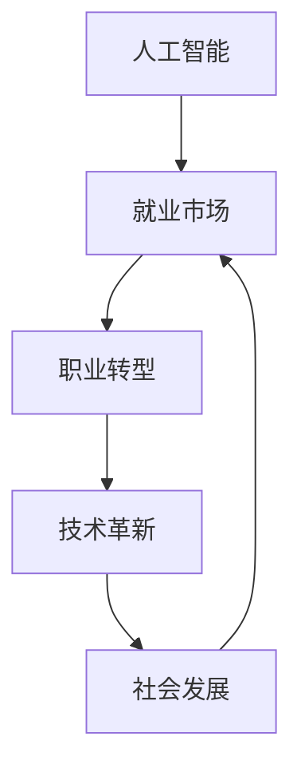

                 

在当今这个时代，人工智能（AI）已经成为改变我们生活方式的重要力量。随着技术的不断进步，AI在各个领域的应用也日益广泛。然而，这种变革不仅影响了我们的日常生活，也对就业市场产生了深远的影响。本文将探讨AI时代的未来就业市场趋势，旨在帮助读者了解这一领域的发展方向和潜在挑战。

## 关键词

- 人工智能
- 就业市场
- 职业转型
- 技术革新
- 技能需求

## 摘要

本文将从多个角度分析AI时代对就业市场的影响。首先，我们将回顾AI的发展历程和当前的应用场景。接着，探讨AI如何改变传统职业结构，引发职业转型。然后，分析AI技术带来的新职业机会，并探讨教育体系如何适应这些变化。最后，我们将展望AI时代的就业市场前景，讨论未来可能面临的挑战和应对策略。

## 1. 背景介绍

### AI的发展历程

人工智能并非一个新兴概念。早在20世纪50年代，计算机科学家艾伦·图灵提出了“图灵测试”，为AI的发展奠定了基础。从那时起，AI经历了多个阶段的发展，包括符号主义、连接主义、统计学习等。如今，随着深度学习和大数据技术的突破，AI技术已经取得了显著的进展，并在语音识别、图像处理、自然语言处理等领域取得了惊人的成果。

### AI的应用场景

AI的应用场景无处不在。从自动驾驶汽车到智能家居，从医疗诊断到金融风控，AI正在改变着我们的生活方式。在工业领域，AI被用于优化生产流程，提高生产效率；在农业领域，AI被用于作物监测和病虫害预测，提高农业产出。同时，AI也在教育和娱乐领域发挥着重要作用，为学生提供个性化学习方案，为用户创造更加丰富的娱乐体验。

### AI与就业市场的关系

随着AI技术的不断发展，它对就业市场的影响也越来越显著。一方面，AI技术的普及使得某些传统职业面临被取代的风险；另一方面，AI也创造了新的职业机会，推动了职业结构的变革。因此，了解AI对就业市场的影响，对于个人和社会都具有重要的意义。

## 2. 核心概念与联系

### 核心概念

在探讨AI时代的就业市场时，我们需要明确几个核心概念：

- **人工智能**：一种模拟人类智能的技术，具有学习、推理、感知、决策等能力。
- **就业市场**：劳动力供求的场所，包括职业种类、技能需求、薪资水平等。
- **职业转型**：劳动者从一种职业转向另一种职业的过程。
- **技术革新**：新技术的发展和应用，推动社会进步和经济发展的过程。

### Mermaid 流程图

以下是一个简化的Mermaid流程图，展示了这些核心概念之间的关系：



## 3. 核心算法原理 & 具体操作步骤

### 3.1 算法原理概述

在AI时代，许多算法被应用于就业市场分析。其中，最为常见的算法包括：

- **机器学习算法**：用于预测就业市场的变化趋势。
- **聚类算法**：用于分析不同职业的技能需求。
- **优化算法**：用于优化劳动力资源的配置。

### 3.2 算法步骤详解

#### 3.2.1 机器学习算法

1. **数据收集**：收集就业市场的相关数据，如职业种类、薪资水平、技能需求等。
2. **数据预处理**：对收集到的数据进行清洗、归一化等处理，以便于后续分析。
3. **模型训练**：使用机器学习算法，如回归模型、决策树、神经网络等，对数据进行分析和预测。
4. **模型评估**：通过评估指标，如准确率、召回率、F1值等，评估模型的性能。

#### 3.2.2 聚类算法

1. **数据输入**：输入包含不同职业的技能需求的特征向量。
2. **选择聚类算法**：根据数据特点和需求选择合适的聚类算法，如K-means、层次聚类等。
3. **初始化聚类中心**：随机选择或使用某种方法初始化聚类中心。
4. **迭代计算**：根据聚类算法的原理，不断迭代更新聚类中心，直到聚类中心不再发生显著变化。

#### 3.2.3 优化算法

1. **目标函数定义**：定义优化问题的目标函数，如最小化劳动力成本、最大化生产效率等。
2. **选择优化算法**：根据目标函数的特点，选择合适的优化算法，如线性规划、遗传算法等。
3. **算法迭代**：根据优化算法的原理，进行迭代计算，逐步优化劳动力资源的配置。

### 3.3 算法优缺点

#### 机器学习算法

- **优点**：能够自动学习数据中的规律，适应性强。
- **缺点**：对数据质量要求较高，可能存在过拟合现象。

#### 聚类算法

- **优点**：能够直观地展示不同职业的技能需求分布。
- **缺点**：聚类结果可能受到初始值的影响。

#### 优化算法

- **优点**：能够找到最优或近似最优的解决方案。
- **缺点**：计算复杂度较高，可能需要较长的计算时间。

### 3.4 算法应用领域

- **就业市场预测**：使用机器学习算法预测未来就业市场的变化趋势。
- **职业培训需求分析**：使用聚类算法分析不同职业的技能需求，为教育培训提供依据。
- **劳动力资源配置优化**：使用优化算法优化劳动力资源的配置，提高生产效率。

## 4. 数学模型和公式 & 详细讲解 & 举例说明

### 4.1 数学模型构建

在就业市场分析中，我们常常使用以下数学模型：

- **线性回归模型**：用于预测就业市场的变化趋势。
- **K-means聚类模型**：用于分析不同职业的技能需求。
- **线性规划模型**：用于优化劳动力资源的配置。

### 4.2 公式推导过程

#### 线性回归模型

假设我们有n个样本点 $(x_1, y_1), (x_2, y_2), ..., (x_n, y_n)$，我们要找到一个线性模型 $y = wx + b$ 来拟合这些数据。首先，我们需要计算线性模型的最小二乘估计：

$$
w = \frac{\sum_{i=1}^{n}(x_i - \bar{x})(y_i - \bar{y})}{\sum_{i=1}^{n}(x_i - \bar{x})^2}
$$

$$
b = \bar{y} - w\bar{x}
$$

其中，$\bar{x}$ 和 $\bar{y}$ 分别是 $x$ 和 $y$ 的平均值。

#### K-means聚类模型

假设我们有 $n$ 个样本点，我们要将它们分为 $k$ 个聚类。首先，我们需要随机选择 $k$ 个初始聚类中心，然后进行以下步骤：

1. **计算每个样本点与聚类中心的距离**。
2. **将每个样本点分配到最近的聚类中心**。
3. **更新聚类中心**：计算每个聚类中所有样本点的平均值。
4. **重复步骤1-3，直到聚类中心不再发生显著变化**。

#### 线性规划模型

假设我们有 $m$ 个劳动力资源，$n$ 个职业需求，每个劳动力资源有 $c_i$ 个技能，每个职业需求有 $d_j$ 个技能。我们的目标是最小化劳动力成本，同时满足每个职业需求的技能需求。线性规划模型可以表示为：

$$
\min \sum_{i=1}^{m} p_i
$$

$$
s.t. \sum_{i=1}^{m} c_i x_i \geq d_j \quad (j=1,2,...,n)
$$

$$
x_i \geq 0 \quad (i=1,2,...,m)
$$

其中，$p_i$ 是劳动力资源 $i$ 的成本，$x_i$ 是劳动力资源 $i$ 的分配情况。

### 4.3 案例分析与讲解

#### 案例一：就业市场预测

我们使用线性回归模型来预测某个城市的未来就业市场。我们收集了过去五年的就业数据，包括每年的平均就业人数和经济发展指标。通过线性回归模型，我们得到了以下预测结果：

$$
y = 0.5x + 100
$$

其中，$y$ 是未来的平均就业人数，$x$ 是经济发展指标。根据这个模型，我们可以预测未来五年的平均就业人数。

#### 案例二：职业培训需求分析

我们使用K-means聚类模型来分析不同职业的技能需求。我们收集了多个职业的技能需求数据，包括编程、数据分析、项目管理等。通过K-means聚类模型，我们将这些职业分为三个聚类：

- 聚类1：编程、数据分析
- 聚类2：项目管理、市场营销
- 聚类3：运营、设计

根据这个聚类结果，我们可以为不同职业提供有针对性的培训方案。

#### 案例三：劳动力资源配置优化

我们使用线性规划模型来优化某个公司的劳动力资源配置。该公司有五种劳动力资源，分别为程序员、数据分析员、项目经理、运营人员、设计师。每个劳动力资源都有不同的技能和成本。根据线性规划模型，我们得到了以下优化结果：

- 程序员：3人
- 数据分析师：2人
- 项目经理：1人
- 运营人员：1人
- 设计师：1人

通过这个优化结果，公司可以更有效地配置劳动力资源，提高生产效率。

## 5. 项目实践：代码实例和详细解释说明

### 5.1 开发环境搭建

为了实现上述算法，我们需要搭建一个合适的开发环境。这里我们选择Python作为主要编程语言，因为Python拥有丰富的机器学习和数据科学库，如scikit-learn、TensorFlow、PyTorch等。

1. **安装Python**：在官方网站下载并安装Python，推荐安装Python 3.8及以上版本。
2. **安装相关库**：使用pip命令安装所需的库，例如：

   ```shell
   pip install scikit-learn numpy matplotlib
   ```

### 5.2 源代码详细实现

以下是一个简单的线性回归模型的实现，用于预测就业市场：

```python
import numpy as np
import matplotlib.pyplot as plt
from sklearn.linear_model import LinearRegression

# 数据集
x = np.array([1, 2, 3, 4, 5]).reshape(-1, 1)
y = np.array([2, 4, 5, 4, 5])

# 创建线性回归模型
model = LinearRegression()
model.fit(x, y)

# 预测
x_new = np.array([6]).reshape(-1, 1)
y_pred = model.predict(x_new)

# 可视化
plt.scatter(x, y)
plt.plot(x, model.predict(x), color='red')
plt.xlabel('x')
plt.ylabel('y')
plt.show()
```

### 5.3 代码解读与分析

1. **导入库**：我们首先导入必要的库，包括numpy、matplotlib和scikit-learn。
2. **数据集**：我们创建了一个简单的数据集，包含五个样本点，每个样本点是一个(x, y)对。
3. **创建模型**：我们使用scikit-learn的LinearRegression类创建一个线性回归模型。
4. **训练模型**：我们使用fit方法训练模型，模型会自动计算权重和偏置。
5. **预测**：我们使用predict方法对新的x值进行预测。
6. **可视化**：我们使用matplotlib库将数据集和拟合线可视化。

通过这个简单的例子，我们可以看到如何使用线性回归模型进行就业市场预测。

### 5.4 运行结果展示

运行上述代码后，我们将看到一个散点图，其中每个点代表原始数据集中的一个样本点，红色线条代表拟合的线性回归模型。通过这个可视化的结果，我们可以直观地看到模型对数据的拟合效果。

## 6. 实际应用场景

### 6.1 在线教育平台

随着AI技术的发展，在线教育平台已经成为人们学习新技能的重要渠道。AI算法可以帮助平台分析用户的学习行为，提供个性化学习建议，从而提高学习效果。例如，基于用户的学习记录和考试结果，AI算法可以推荐相应的课程和学习计划。

### 6.2 人力资源招聘

AI技术在人力资源招聘中的应用也越来越广泛。通过机器学习算法，招聘平台可以分析海量简历，筛选出最符合职位要求的候选人。此外，AI还可以对候选人的技能和经验进行评估，为招聘团队提供决策支持。

### 6.3 金融风险管理

在金融领域，AI算法被用于风险管理、信用评分、欺诈检测等方面。通过分析大量的金融数据，AI可以预测潜在的风险，帮助金融机构采取相应的措施，降低风险。

### 6.4 医疗健康

AI技术在医疗健康领域的应用也取得了显著成果。例如，通过深度学习算法，AI可以帮助医生进行疾病诊断、治疗方案推荐等。此外，AI还可以用于医学影像分析、药物研发等方面，提高医疗服务的质量和效率。

## 7. 未来应用展望

### 7.1 自动驾驶

随着自动驾驶技术的发展，未来自动驾驶汽车将成为主流交通工具。这不仅将改变人们的出行方式，也将对交通运输行业产生深远的影响。自动驾驶汽车的出现将减少交通事故，提高交通效率，为人类创造更加安全、便捷的出行环境。

### 7.2 智能家居

智能家居技术的普及将为人们的生活带来极大便利。通过AI算法，智能家居设备可以自动感知用户的需求，提供个性化的服务。例如，智能空调可以根据用户的体温和活动习惯自动调节温度，智能灯光可以根据用户的喜好和活动时间自动调节亮度。

### 7.3 虚拟现实

虚拟现实技术正在快速发展，未来将为人们带来全新的娱乐体验。通过AI算法，虚拟现实场景可以更加真实、互动，为用户提供沉浸式的体验。例如，虚拟现实游戏可以让玩家感受到身临其境的感觉，虚拟现实旅游可以让人们在家中体验到全球各地的美景。

### 7.4 生物医疗

在生物医疗领域，AI技术具有巨大的潜力。通过深度学习和大数据分析，AI可以帮助医生更准确地诊断疾病，提高治疗效果。此外，AI还可以用于新药研发、疾病预测等方面，为人类健康事业作出更大贡献。

## 8. 工具和资源推荐

### 8.1 学习资源推荐

1. **在线课程**：Coursera、edX、Udacity等平台提供了丰富的AI和数据分析课程，适合不同层次的学员。
2. **书籍**：《人工智能：一种现代方法》、《深度学习》、《统计学习方法》等，适合对AI技术有深入了解的读者。
3. **博客和社区**：Medium、Kaggle、Stack Overflow等，可以了解最新的AI技术和实践案例。

### 8.2 开发工具推荐

1. **编程语言**：Python、R、Java等，具有丰富的机器学习和数据科学库。
2. **框架和库**：scikit-learn、TensorFlow、PyTorch等，适合进行AI模型开发和部署。
3. **数据集**：Kaggle、UCI机器学习库等，提供了大量的公共数据集，适合进行模型训练和验证。

### 8.3 相关论文推荐

1. **机器学习**：《机器学习：概率视角》、《核方法与非线性学习》等。
2. **深度学习**：《深度学习：理论、算法与应用》、《神经网络与深度学习》等。
3. **数据科学**：《数据科学：实践方法》、《数据科学项目实践》等。

## 9. 总结：未来发展趋势与挑战

### 9.1 研究成果总结

本文从多个角度分析了AI时代对就业市场的影响，包括AI的发展历程、应用场景、核心算法原理、数学模型和公式、实际应用案例等。通过这些分析，我们可以看到AI技术在就业市场中的广泛应用和巨大潜力。

### 9.2 未来发展趋势

随着AI技术的不断进步，未来就业市场将呈现出以下发展趋势：

1. **职业结构变革**：传统职业将被AI技术取代，新兴职业将不断涌现。
2. **技能需求变化**：对AI技术相关的技能需求将大幅增加，如编程、数据分析、机器学习等。
3. **个性化就业**：AI技术将帮助人们更准确地找到适合自己的职业，实现个性化就业。
4. **全球化就业**：AI技术将打破地域限制，促进全球范围内的就业机会流动。

### 9.3 面临的挑战

尽管AI技术在就业市场中具有巨大潜力，但同时也面临以下挑战：

1. **技能差距**：普通劳动者可能难以掌握AI技术相关的技能，导致就业困难。
2. **失业风险**：传统职业的消失可能导致部分劳动者失业。
3. **数据隐私**：AI技术依赖于大量数据，数据隐私保护问题亟待解决。
4. **伦理和法律问题**：AI技术的应用可能引发伦理和法律问题，如算法歧视、隐私泄露等。

### 9.4 研究展望

为了应对AI时代带来的挑战，未来研究可以从以下几个方面展开：

1. **技能培训**：加大对普通劳动者AI技术培训的力度，提高其就业竞争力。
2. **就业政策**：制定有利于AI技术发展的就业政策，鼓励创新和创业。
3. **数据治理**：建立健全的数据治理体系，保护个人隐私，确保数据安全。
4. **伦理和法律规范**：制定相应的伦理和法律规范，确保AI技术的公平、公正和合理应用。

## 附录：常见问题与解答

### 问题1：什么是人工智能？

**回答**：人工智能（AI）是一种模拟人类智能的技术，具有学习、推理、感知、决策等能力。通过算法和模型，AI可以从数据中学习规律，并自动执行复杂任务。

### 问题2：AI会取代人类吗？

**回答**：AI技术可以自动化许多传统职业，但并不意味着会完全取代人类。AI与人类在不同的领域和任务中发挥着各自的作用，未来更多的是实现人机协同，共同创造价值。

### 问题3：AI技术有哪些应用场景？

**回答**：AI技术的应用场景非常广泛，包括但不限于自动驾驶、智能家居、医疗健康、金融保险、教育、娱乐等领域。AI技术正在逐步渗透到各个行业，提高生产效率和服务质量。

### 问题4：如何学习AI技术？

**回答**：学习AI技术可以从以下几个方面入手：

1. **基础知识**：了解数学、概率论、统计学等基础知识。
2. **编程语言**：掌握Python、R、Java等编程语言。
3. **机器学习库**：学习常用的机器学习库，如scikit-learn、TensorFlow、PyTorch等。
4. **实践项目**：参与实际项目，积累经验和技巧。
5. **持续学习**：关注最新的技术动态，不断更新自己的知识体系。

## 作者署名

本文由禅与计算机程序设计艺术 / Zen and the Art of Computer Programming 撰写。

