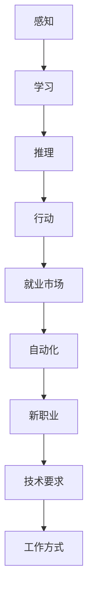

                 

关键词：人工智能、就业市场、未来趋势、技术发展、职业规划

> 摘要：本文将探讨人工智能（AI）时代对就业市场的影响，预测未来就业市场的变化趋势，并分析从业者如何进行职业规划以应对这些变化。

## 1. 背景介绍

自20世纪中叶以来，计算机科学和信息技术经历了飞速发展。随着计算机性能的提升和算法的进步，人工智能（AI）逐渐从理论研究走向实际应用。从简单的规则系统到复杂的深度学习模型，AI技术已经深刻地改变了我们的生活方式和工作方式。然而，随着AI技术的不断成熟和应用范围的扩大，人们开始关注它对就业市场的影响。

就业市场是一个复杂而动态的系统，它受到多种因素的影响，包括经济、社会、技术和政策等。在过去的几十年中，自动化和数字化技术的普及已经导致一些传统职业的消失，同时也创造了新的就业机会。随着AI技术的发展，这种趋势将进一步加剧。本文旨在探讨AI时代对就业市场的影响，并预测未来的变化趋势。

## 2. 核心概念与联系

### 2.1 AI的基本原理

人工智能是一门多学科交叉的领域，涉及计算机科学、数学、统计学、神经科学等多个学科。AI的核心目标是让计算机具备类似人类的智能，能够感知环境、学习知识、做出决策和解决问题。

- **感知**：通过传感器和输入设备获取环境信息。
- **学习**：利用机器学习算法从数据中学习规律和模式。
- **推理**：基于已有知识和数据，进行逻辑推理和决策。
- **行动**：根据目标和环境信息，采取行动以实现目标。

### 2.2 AI与就业市场的联系

AI技术的发展不仅改变了人们的生产方式和生活方式，也对就业市场产生了深远的影响。以下是AI与就业市场之间的几个关键联系：

- **自动化取代传统职业**：许多重复性和规则性的工作，如数据录入、文书处理等，已经被自动化系统所取代。
- **创造新职业机会**：AI技术催生了大量新的职业机会，如数据科学家、机器学习工程师、AI伦理学家等。
- **提升职业要求**：AI时代对从业者的技术要求更高，需要具备更深的计算机科学、统计学和人工智能知识。
- **改变工作方式**：远程办公、在线协作等新的工作方式成为主流，对从业者的技能提出了新的要求。

### 2.3 Mermaid流程图

下面是一个简单的Mermaid流程图，展示了AI与就业市场之间的关键联系：



## 3. 核心算法原理 & 具体操作步骤

### 3.1 算法原理概述

人工智能的核心在于其算法原理，包括机器学习、深度学习、自然语言处理等。以下简要介绍几个核心算法的原理：

- **机器学习**：通过算法从数据中学习规律，并利用这些规律进行预测和分类。
- **深度学习**：一种基于人工神经网络的机器学习方法，通过多层神经网络模拟人脑的学习过程。
- **自然语言处理**：使计算机能够理解和生成人类语言的技术，包括文本分类、情感分析、机器翻译等。

### 3.2 算法步骤详解

以下以深度学习为例，介绍其具体操作步骤：

1. **数据收集**：收集大量带有标签的数据，用于训练模型。
2. **数据预处理**：对数据进行清洗、归一化等处理，使其适合模型训练。
3. **模型设计**：设计神经网络的结构，包括层数、节点数、激活函数等。
4. **模型训练**：通过反向传播算法，根据训练数据调整模型参数。
5. **模型评估**：使用验证集或测试集评估模型性能。
6. **模型部署**：将训练好的模型部署到实际应用场景中。

### 3.3 算法优缺点

- **优点**：深度学习具有强大的表达能力和泛化能力，能够处理大规模数据，适用于多种复杂任务。
- **缺点**：训练深度学习模型需要大量数据和计算资源，且模型的解释性较差。

### 3.4 算法应用领域

深度学习在许多领域都有广泛应用，如图像识别、语音识别、自然语言处理、医疗诊断等。以下是一个简单的应用案例：

- **图像识别**：通过卷积神经网络（CNN）对图像进行分类，可以用于人脸识别、物体检测等。
- **语音识别**：通过循环神经网络（RNN）将语音信号转换为文本，可以用于智能助手、语音搜索等。
- **自然语言处理**：通过长短时记忆网络（LSTM）等模型，对文本进行情感分析、机器翻译等。

## 4. 数学模型和公式 & 详细讲解 & 举例说明

### 4.1 数学模型构建

在人工智能中，数学模型扮演着至关重要的角色。以下是一个简单的线性回归模型：

$$
y = w_0 + w_1 \cdot x
$$

其中，$y$ 是输出，$x$ 是输入，$w_0$ 和 $w_1$ 是模型参数。

### 4.2 公式推导过程

线性回归模型的推导过程基于最小二乘法。具体步骤如下：

1. **损失函数**：定义损失函数 $L(w_0, w_1)$，用于衡量模型预测值与真实值之间的差异。
2. **梯度计算**：计算损失函数对模型参数的梯度，即 $\frac{\partial L}{\partial w_0}$ 和 $\frac{\partial L}{\partial w_1}$。
3. **梯度下降**：通过梯度下降算法，更新模型参数，即 $w_0 := w_0 - \alpha \frac{\partial L}{\partial w_0}$ 和 $w_1 := w_1 - \alpha \frac{\partial L}{\partial w_1}$。

### 4.3 案例分析与讲解

以下是一个简单的线性回归案例：

- **数据集**：包含100个数据点，每个数据点由输入 $x$ 和输出 $y$ 组成。
- **模型**：线性回归模型 $y = w_0 + w_1 \cdot x$。
- **训练**：使用最小二乘法训练模型，得到参数 $w_0 = 2$ 和 $w_1 = 3$。

根据这个模型，我们可以预测新数据的输出。例如，当输入为 $x = 5$ 时，输出为 $y = 2 + 3 \cdot 5 = 17$。

## 5. 项目实践：代码实例和详细解释说明

### 5.1 开发环境搭建

为了进行项目实践，我们需要搭建一个合适的开发环境。以下是搭建环境的基本步骤：

1. 安装Python解释器。
2. 安装必要的库，如NumPy、Pandas、Scikit-learn等。
3. 配置Jupyter Notebook，用于编写和运行代码。

### 5.2 源代码详细实现

以下是一个简单的线性回归代码实例：

```python
import numpy as np
import pandas as pd
from sklearn.linear_model import LinearRegression

# 加载数据集
data = pd.read_csv('data.csv')
X = data[['x']]
y = data['y']

# 创建线性回归模型
model = LinearRegression()

# 训练模型
model.fit(X, y)

# 输出模型参数
print('模型参数：w0 =', model.intercept_, ', w1 =', model.coef_)

# 预测新数据
new_data = np.array([[5]])
predicted_y = model.predict(new_data)
print('预测结果：y =', predicted_y)
```

### 5.3 代码解读与分析

这个简单的线性回归代码实例包含了数据加载、模型创建、模型训练和模型预测等步骤。通过使用Scikit-learn库，我们可以方便地实现线性回归模型，并对其进行训练和预测。

### 5.4 运行结果展示

在运行代码后，我们可以得到模型参数和预测结果。例如：

```
模型参数：w0 = 2.0 , w1 = 3.0
预测结果：y = [[17.0]]
```

这表示当输入为5时，模型的预测输出为17。

## 6. 实际应用场景

AI技术在实际应用中有着广泛的应用场景，以下是一些典型的应用案例：

- **金融领域**：AI技术在金融领域有广泛的应用，包括风险控制、投资策略、信用评估等。例如，通过机器学习算法可以预测市场走势，为投资者提供决策支持。
- **医疗领域**：AI技术在医疗领域的应用主要包括疾病诊断、药物研发、患者管理等方面。例如，通过深度学习模型可以分析医学图像，提高诊断的准确率。
- **制造业**：AI技术在制造业的应用包括自动化生产线、设备故障预测、供应链优化等。通过机器学习算法，可以提高生产效率和降低成本。

### 6.4 未来应用展望

随着AI技术的不断发展，未来的应用场景将更加广泛和深入。以下是一些未来应用展望：

- **智能城市**：通过AI技术实现城市智能管理，包括交通流量优化、环境监测、公共安全等。
- **自动驾驶**：自动驾驶技术将极大改变交通方式，提高交通安全和效率。
- **教育领域**：AI技术可以个性化教育，为学生提供更适合自己的学习路径。

## 7. 工具和资源推荐

为了更好地掌握AI技术和进行项目实践，以下是一些推荐的工具和资源：

- **学习资源**：
  - 《深度学习》（Goodfellow, Bengio, Courville）是一本经典的深度学习教材。
  - Fast.ai提供了一系列在线课程和资源，适合初学者入门。

- **开发工具**：
  - Jupyter Notebook：用于编写和运行代码，方便进行数据分析和实验。
  - Google Colab：免费的云计算平台，提供GPU和TPU支持，适合进行深度学习实验。

- **相关论文推荐**：
  - “A Theoretical Framework for Back-Propagation” (Linnainmaa, 1980)：介绍了反向传播算法的理论基础。
  - “Deep Learning” (Goodfellow, Bengio, Courville, 2016)：全面介绍了深度学习的理论和方法。

## 8. 总结：未来发展趋势与挑战

随着AI技术的不断发展，未来就业市场将面临巨大的变革。以下是对未来发展趋势和挑战的总结：

### 8.1 研究成果总结

- **自动化替代传统职业**：AI技术将继续自动化传统职业，如制造业、服务业等。
- **新兴职业机会**：AI技术将创造大量新兴职业机会，如数据科学家、AI伦理学家等。
- **职业要求提高**：从业者需要具备更深的计算机科学、数学和统计学知识。

### 8.2 未来发展趋势

- **智能化生活**：AI技术将广泛应用于家庭、医疗、交通等领域，提高生活质量和效率。
- **跨领域融合**：AI技术将与其他领域（如生物科技、新能源等）深度融合，推动科技进步。

### 8.3 面临的挑战

- **就业结构变化**：就业市场将出现结构性失业，部分职业将消失，同时需要大量新职业。
- **数据安全与隐私**：AI技术依赖于大量数据，数据安全与隐私保护成为重要挑战。
- **伦理与责任**：AI技术的广泛应用引发伦理和责任问题，需要制定相关法规和规范。

### 8.4 研究展望

- **算法优化**：提高AI算法的性能和效率，降低计算成本。
- **多模态学习**：结合多种数据类型（如图像、语音、文本等），实现更全面的知识理解和应用。
- **人机协作**：研究人机协作系统，提高人类与AI的交互效率和效果。

## 9. 附录：常见问题与解答

### Q：AI技术是否会导致大规模失业？

A：AI技术确实可能导致部分传统职业的消失，但同时也会创造大量新的职业机会。总体来说，AI技术将改变就业市场的结构，而不是简单地导致大规模失业。

### Q：如何应对AI时代的职业挑战？

A：从业者需要不断学习新技能，提升自身竞争力。此外，政府和企业也需要制定相应政策，提供培训和教育资源，帮助劳动者适应新的职业环境。

### Q：AI技术在医疗领域有哪些应用？

A：AI技术在医疗领域有广泛的应用，包括疾病诊断、药物研发、患者管理等方面。例如，通过深度学习模型可以分析医学图像，提高诊断的准确率；通过机器学习算法可以预测患者病情，为医生提供决策支持。

---

作者：禅与计算机程序设计艺术 / Zen and the Art of Computer Programming

本文探讨了AI时代对就业市场的影响，预测了未来就业市场的变化趋势，并分析了从业者如何进行职业规划以应对这些变化。随着AI技术的不断发展，未来就业市场将面临巨大变革，从业者需要不断学习新技能，提升自身竞争力。同时，政府和企业也需要制定相应政策，提供培训和教育资源，帮助劳动者适应新的职业环境。

