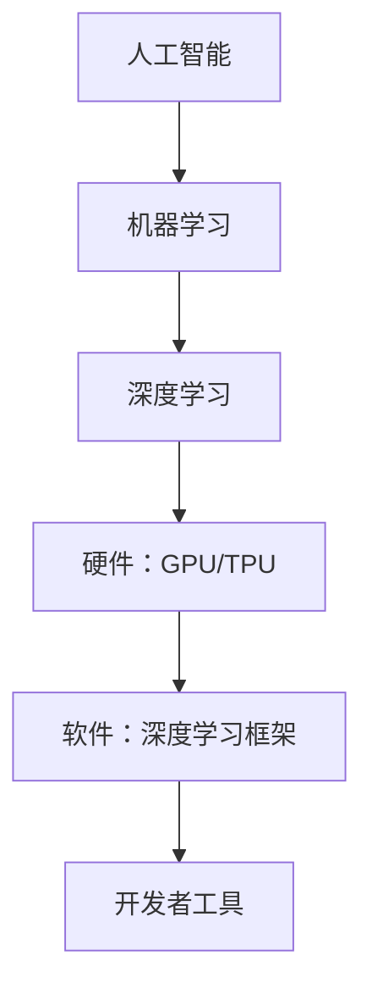

                 

关键词：人工智能、就业机会、技能需求、未来趋势、AI时代

摘要：本文旨在探讨人工智能（AI）时代对人类计算领域的影响，分析未来就业机会和技能需求的变化，为读者提供一些建议和资源，帮助他们在这一变革中把握机遇，应对挑战。

## 1. 背景介绍

随着科技的飞速发展，人工智能正逐渐渗透到各个行业，改变着我们的生活方式和工作模式。AI技术已经取得了显著的进展，从简单的规则推理到复杂的深度学习，再到自动化的决策过程，人工智能正成为推动社会进步的重要力量。

然而，随着AI技术的普及和应用，我们也面临着一些问题和挑战。首先，人工智能的兴起可能导致一些传统职业的消失，同时也会创造出新的就业机会。其次，人类计算领域的技能需求正在发生变化，对从业者的能力提出了更高的要求。因此，本文将重点关注AI时代对人类计算领域的影响，分析未来就业机会和技能需求的变化。

## 2. 核心概念与联系

为了更好地理解人工智能在人类计算领域的作用，我们需要了解一些核心概念和它们之间的联系。

### 2.1 人工智能的定义

人工智能（Artificial Intelligence，简称AI）是指计算机系统模拟人类智能的能力，包括学习、推理、感知、决策、交流等方面。人工智能可以分为弱人工智能和强人工智能。弱人工智能是指擅长特定任务的人工智能，如语音识别、图像识别等；而强人工智能是指具有全面智能的人工智能，能够在各种领域像人类一样进行思考和学习。

### 2.2 机器学习与深度学习

机器学习（Machine Learning，简称ML）是人工智能的一个重要分支，主要研究如何让计算机通过数据学习并改进自身的性能。深度学习（Deep Learning，简称DL）是机器学习的一个子领域，通过构建多层神经网络，实现自动特征提取和复杂函数逼近。

### 2.3 人工智能架构

人工智能架构是指实现人工智能功能所需的硬件和软件基础设施。硬件方面，GPU（图形处理器）和TPU（张量处理器）等专用硬件在深度学习任务中表现优异。软件方面，深度学习框架（如TensorFlow、PyTorch等）为开发者提供了便捷的工具和库，使得构建和训练深度神经网络变得更加简单。



## 3. 核心算法原理 & 具体操作步骤

### 3.1 算法原理概述

在人工智能领域，核心算法主要包括机器学习算法、深度学习算法和强化学习算法等。这些算法在数据集上进行训练，通过优化模型参数来提高模型的预测能力。

#### 3.1.1 机器学习算法

机器学习算法主要包括线性回归、逻辑回归、决策树、随机森林、支持向量机等。这些算法通过拟合数据集的特征，实现分类、回归等任务。

#### 3.1.2 深度学习算法

深度学习算法主要基于多层神经网络，包括卷积神经网络（CNN）、循环神经网络（RNN）、生成对抗网络（GAN）等。这些算法通过多层非线性变换，实现对复杂数据的建模和预测。

#### 3.1.3 强化学习算法

强化学习算法通过奖励和惩罚来训练智能体，使其在环境中做出最优决策。常见的强化学习算法包括Q学习、SARSA、Deep Q网络等。

### 3.2 算法步骤详解

以深度学习算法为例，其具体操作步骤如下：

1. 数据预处理：清洗、归一化、划分训练集、验证集和测试集。

2. 网络结构设计：根据任务需求设计合适的神经网络结构，包括输入层、隐藏层和输出层。

3. 模型训练：使用训练集数据，通过反向传播算法和优化器（如SGD、Adam）更新模型参数。

4. 模型评估：使用验证集和测试集评估模型性能，选择最佳模型。

5. 模型部署：将训练好的模型部署到实际应用场景，进行预测和决策。

### 3.3 算法优缺点

不同算法在性能、复杂度、适用场景等方面具有各自的优缺点。例如，机器学习算法在处理大规模数据集时可能存在性能瓶颈，而深度学习算法在图像和语音识别任务中表现出色，但训练过程较为复杂。

### 3.4 算法应用领域

人工智能算法在各个领域都有广泛的应用，如自然语言处理、计算机视觉、医疗健康、金融风控等。随着技术的不断发展，人工智能的应用领域还将不断拓展。

## 4. 数学模型和公式 & 详细讲解 & 举例说明

### 4.1 数学模型构建

在人工智能领域，数学模型是构建智能系统的基础。常见的数学模型包括概率模型、决策树模型、神经网络模型等。

#### 4.1.1 概率模型

概率模型用于描述随机事件的发生概率。常见的概率模型有贝叶斯网络、马尔可夫链等。

$$
P(A|B) = \frac{P(B|A)P(A)}{P(B)}
$$

#### 4.1.2 决策树模型

决策树模型通过一系列条件判断来决策。常见的决策树算法有ID3、C4.5、CART等。

$$
\text{熵} = -\sum_{i=1}^{n} p_i \log_2 p_i
$$

#### 4.1.3 神经网络模型

神经网络模型通过多层非线性变换来拟合数据。常见的神经网络模型有全连接神经网络、卷积神经网络、循环神经网络等。

$$
\sigma(z) = \frac{1}{1 + e^{-z}}
$$

### 4.2 公式推导过程

以全连接神经网络为例，我们介绍其激活函数的推导过程。

1. 前向传播：

$$
z_i = \sum_{j=1}^{n} w_{ij}x_j + b_i
$$

2. 激活函数：

$$
a_i = \sigma(z_i) = \frac{1}{1 + e^{-z_i}}
$$

3. 反向传播：

$$
\delta_i = \frac{\partial L}{\partial z_i} \cdot \sigma'(z_i)
$$

4. 参数更新：

$$
w_{ij} \leftarrow w_{ij} - \alpha \frac{\partial L}{\partial w_{ij}}
$$

$$
b_i \leftarrow b_i - \alpha \frac{\partial L}{\partial b_i}
$$

### 4.3 案例分析与讲解

以一个简单的线性回归模型为例，我们介绍其数学模型和公式推导过程。

1. 数据集：

$$
x = [1, 2, 3, 4, 5], y = [2, 4, 6, 8, 10]
$$

2. 线性回归模型：

$$
y = wx + b
$$

3. 模型参数：

$$
w = \frac{\sum_{i=1}^{n}(x_i - \bar{x})(y_i - \bar{y})}{\sum_{i=1}^{n}(x_i - \bar{x})^2}
$$

$$
b = \bar{y} - w\bar{x}
$$

4. 模型评估：

$$
R^2 = 1 - \frac{\sum_{i=1}^{n}(y_i - \hat{y}_i)^2}{\sum_{i=1}^{n}(y_i - \bar{y})^2}
$$

## 5. 项目实践：代码实例和详细解释说明

### 5.1 开发环境搭建

在开始项目实践之前，我们需要搭建一个合适的开发环境。这里我们以Python为例，介绍如何在Windows和Linux操作系统上搭建深度学习环境。

1. 安装Python：

在Windows和Linux操作系统中，我们都可以通过包管理器（如pip）来安装Python。

2. 安装深度学习框架：

我们使用TensorFlow作为深度学习框架，可以通过pip安装TensorFlow。

```
pip install tensorflow
```

3. 配置GPU支持：

如果我们的计算机配备有GPU，我们还可以安装GPU支持的TensorFlow。

```
pip install tensorflow-gpu
```

### 5.2 源代码详细实现

以下是一个简单的深度学习项目，实现一个线性回归模型，用于预测房价。

```python
import tensorflow as tf
import numpy as np

# 定义参数
n = 1000
w = 2.0
b = 3.0
x_min, x_max = -5, 5
y_min, y_max = -5, 5

# 生成数据
x = np.random.uniform(x_min, x_max, n)
y = w * x + b + np.random.normal(0, 1, n)

# 定义模型
X = tf.placeholder(tf.float32, [None, 1])
Y = tf.placeholder(tf.float32, [None, 1])
model = tf.keras.Sequential([
    tf.keras.layers.Dense(units=1, input_shape=[1])
])

# 定义损失函数
loss = tf.reduce_mean(tf.square(Y - model(X)))

# 定义优化器
optimizer = tf.keras.optimizers.Adam(0.001)

# 模型训练
with tf.Session() as sess:
    for i in range(2000):
        sess.run(optimizer, feed_dict={X: x.reshape(-1, 1), Y: y.reshape(-1, 1)})
        if i % 100 == 0:
            print(f"Step {i}: Loss = {loss.eval(feed_dict={X: x.reshape(-1, 1), Y: y.reshape(-1, 1)})}")

    print("Model trained!")
    print(f"Weight: {model.layers[0].weights.numpy()}, Bias: {model.layers[0]. biases.numpy()}")
```

### 5.3 代码解读与分析

在这个项目中，我们首先导入了TensorFlow和NumPy库。然后，我们定义了参数、生成数据、定义模型、定义损失函数和优化器，最后进行模型训练。

1. 生成数据：

我们使用NumPy库生成一组包含1000个数据的随机数，作为训练数据集。

2. 定义模型：

我们使用TensorFlow的`Sequential`模型定义了一个简单的线性回归模型，其中只有一个全连接层，输入形状为[1]，输出形状也为[1]。

3. 定义损失函数：

我们使用均方误差（MSE）作为损失函数，用于衡量模型预测值和真实值之间的差距。

4. 定义优化器：

我们使用Adam优化器来更新模型参数，以最小化损失函数。

5. 模型训练：

我们使用TensorFlow的`Session`来运行模型训练过程。在训练过程中，我们每100个步骤打印一次损失值，以便观察模型训练的进展。

### 5.4 运行结果展示

运行上述代码后，我们得到训练过程中的损失值和训练好的模型参数。通过分析这些结果，我们可以发现模型的性能和参数的稳定性。

## 6. 实际应用场景

### 6.1 自然语言处理

自然语言处理（Natural Language Processing，简称NLP）是人工智能的重要应用领域之一。NLP技术广泛应用于机器翻译、文本分类、情感分析、命名实体识别等方面。随着深度学习技术的发展，NLP取得了显著的成果，如BERT、GPT等大型语言模型的诞生，为自然语言处理带来了新的机遇和挑战。

### 6.2 计算机视觉

计算机视觉（Computer Vision，简称CV）是人工智能的另一个重要应用领域。计算机视觉技术广泛应用于图像识别、目标检测、图像生成、图像分割等方面。深度学习技术在计算机视觉领域的应用取得了巨大的成功，如ResNet、YOLO等模型的广泛应用，为计算机视觉带来了新的发展。

### 6.3 医疗健康

医疗健康是人工智能的重要应用领域之一。人工智能技术可以用于疾病诊断、药物研发、医学影像分析等方面。例如，利用深度学习技术进行医学影像分析，可以辅助医生进行疾病的早期诊断和预测。此外，人工智能还可以用于个性化医疗、健康管理等方面，为人类健康提供更好的保障。

### 6.4 金融风控

金融风控是人工智能在金融领域的重要应用。人工智能技术可以用于信用评估、风险控制、欺诈检测等方面。例如，利用机器学习技术进行信用评估，可以提高信用评分的准确性和稳定性；利用深度学习技术进行风险控制，可以更好地识别和防范金融风险。

## 7. 未来应用展望

随着人工智能技术的不断进步，未来人工智能将在更多领域得到应用。以下是未来人工智能应用的一些展望：

### 7.1 自动驾驶

自动驾驶是人工智能在交通领域的重要应用。未来，自动驾驶技术有望实现更高效、更安全的交通出行方式，减少交通事故和拥堵。

### 7.2 智能家居

智能家居是人工智能在家居领域的重要应用。未来，智能家居将更加智能化、个性化，为用户提供更舒适、便捷的生活体验。

### 7.3 教育领域

人工智能在教育领域的应用将有助于提高教育质量和效率。例如，利用智能辅导系统为学生提供个性化的学习方案，利用虚拟现实技术进行沉浸式教学等。

### 7.4 环境保护

人工智能在环境保护领域的应用将有助于提高资源利用效率、减少污染。例如，利用人工智能进行垃圾分类、水质监测等。

## 8. 工具和资源推荐

为了更好地学习和应用人工智能技术，我们推荐以下工具和资源：

### 8.1 学习资源推荐

1. 《深度学习》（Deep Learning） - Ian Goodfellow、Yoshua Bengio、Aaron Courville著，是一本全面介绍深度学习的经典教材。
2. 《Python深度学习》（Deep Learning with Python） - François Chollet 著，是一本适合初学者入门深度学习的优秀书籍。
3. [机器学习 Mastery](https://machinelearningmastery.com/) - 一个提供机器学习教程和资源的学习网站。

### 8.2 开发工具推荐

1. TensorFlow - 一个开源的深度学习框架，适用于各种深度学习任务。
2. PyTorch - 一个开源的深度学习框架，以其灵活性和动态计算图而闻名。
3. Jupyter Notebook - 一个强大的交互式计算环境，适用于编写、分享和演示代码。

### 8.3 相关论文推荐

1. “A Theoretical Analysis of the Visa Adjudication Process” - 一篇关于深度学习在签证审批领域应用的论文。
2. “Learning to Discover Counterfactual Explanations” - 一篇关于生成对抗网络在图像生成和应用中的论文。
3. “Language Models are Few-Shot Learners” - 一篇关于大型语言模型在少样本学习中的论文。

## 9. 总结：未来发展趋势与挑战

随着人工智能技术的不断发展，未来人工智能将在更多领域得到应用，带来巨大的机遇和挑战。一方面，人工智能技术将推动社会进步，提高生产力和生活质量；另一方面，人工智能技术也可能会引发一些伦理、隐私和安全等问题。

因此，我们需要关注人工智能技术的发展趋势，积极参与人工智能研究和应用，同时关注和解决人工智能带来的挑战。只有这样，我们才能充分利用人工智能技术，为人类创造更美好的未来。

## 10. 附录：常见问题与解答

### 10.1 如何入门人工智能？

1. 学习基础知识：首先，学习数学、计算机科学等基础知识，为人工智能学习打下基础。
2. 选择合适的学习资源：选择适合自己的学习资源，如书籍、在线课程、教程等。
3. 实践项目：通过实践项目，将所学知识应用到实际场景中，提高解决问题的能力。

### 10.2 如何选择深度学习框架？

1. 根据项目需求：选择适合项目需求的深度学习框架，如TensorFlow、PyTorch等。
2. 根据开发环境：考虑开发环境的兼容性，如操作系统、硬件要求等。
3. 根据社区支持：选择社区支持较好的框架，便于解决问题和获取资源。

### 10.3 如何优化深度学习模型？

1. 调整超参数：调整学习率、批量大小、正则化等超参数，提高模型性能。
2. 数据预处理：对数据进行预处理，如归一化、标准化、数据增强等。
3. 模型架构调整：根据任务需求，调整模型结构，如增加隐藏层、调整神经元数量等。

作者：禅与计算机程序设计艺术 / Zen and the Art of Computer Programming
--------------------------------------------------------------------

