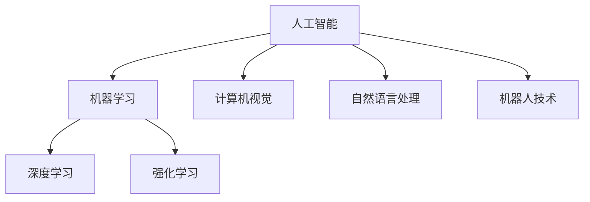

                 

关键词：人工智能、AI时代、就业机会、技能需求、未来趋势

> 摘要：随着人工智能技术的飞速发展，人类计算领域正面临前所未有的变革。本文将探讨AI时代的未来就业机会和技能需求，分析人工智能技术对各个行业的冲击，并给出相应的职业建议和技能培养策略。

## 1. 背景介绍

人工智能（AI）作为计算机科学的一个重要分支，其目标是让计算机拥有类似人类的智能。从最早的专家系统到如今的深度学习和强化学习，人工智能技术已经取得了显著的进步。随着计算能力的提升和大数据的普及，人工智能在各个领域得到了广泛应用，包括但不限于图像识别、自然语言处理、医疗诊断、自动驾驶等。

人工智能的发展不仅改变了科技行业，也对传统行业产生了深远的影响。越来越多的工作岗位正在被自动化和智能化技术取代，同时新的职业机会也在不断涌现。因此，了解AI时代的就业机会和技能需求，对于职场人士和求职者来说都具有重要意义。

## 2. 核心概念与联系

为了更好地理解AI时代的就业机会和技能需求，我们首先需要了解一些核心概念。

### 2.1 人工智能技术架构



### 2.2 人工智能与就业机会

人工智能技术的应用正在创造新的职业机会，同时也使得一些传统职业面临被淘汰的风险。以下是一些重要的就业机会和职业领域：

- **数据科学家**：负责构建和分析大数据模型，挖掘数据价值。
- **机器学习工程师**：专注于设计和实现机器学习算法。
- **深度学习研究员**：在深度学习领域进行前沿研究和创新。
- **人工智能产品经理**：负责规划和推动人工智能产品的开发。
- **计算机视觉工程师**：专注于图像识别、目标检测等技术。
- **自然语言处理工程师**：致力于开发能够理解和使用自然语言的系统。

### 2.3 人工智能与技能需求

在AI时代，传统技能已经不再满足市场的需求，新的技能正在变得日益重要。以下是一些关键的技能：

- **编程能力**：熟悉至少一种编程语言，如Python、Java或C++。
- **数据分析和处理能力**：能够处理和分析大量数据，运用统计学和机器学习技术。
- **数学和统计学知识**：理解线性代数、微积分、概率论和统计学等数学知识。
- **机器学习框架和工具**：熟练掌握TensorFlow、PyTorch等机器学习框架。
- **问题解决能力**：能够识别问题、设计解决方案并进行实施。
- **沟通和协作能力**：能够与团队成员有效沟通，协作完成项目。

## 3. 核心算法原理 & 具体操作步骤

### 3.1 算法原理概述

人工智能的核心在于算法，以下是一些关键的算法原理：

- **机器学习**：通过训练数据集来学习并改进算法。
- **深度学习**：利用多层神经网络进行特征提取和模式识别。
- **强化学习**：通过试错和奖励机制来优化决策过程。

### 3.2 算法步骤详解

- **机器学习**：
  1. 数据收集：收集相关的训练数据。
  2. 数据预处理：清洗和整理数据，使其适合建模。
  3. 特征提取：从数据中提取有用的特征。
  4. 模型训练：使用训练数据训练机器学习模型。
  5. 模型评估：评估模型的性能。

- **深度学习**：
  1. 数据收集：收集大量的带标签的数据。
  2. 数据预处理：归一化、缩放等处理。
  3. 构建网络：设计多层神经网络架构。
  4. 模型训练：使用反向传播算法进行训练。
  5. 模型评估：评估模型的性能。

- **强化学习**：
  1. 环境设定：定义环境和动作空间。
  2. 策略学习：通过试错和反馈来学习最佳策略。
  3. 模型评估：评估策略的收益。

### 3.3 算法优缺点

- **机器学习**：
  - 优点：适用于各种类型的数据，能够自动发现数据中的模式。
  - 缺点：需要大量的训练数据和计算资源，对数据的分布敏感。

- **深度学习**：
  - 优点：能够自动提取复杂特征，模型性能优异。
  - 缺点：对数据量要求较高，训练过程复杂。

- **强化学习**：
  - 优点：能够解决动态决策问题，具有自适应能力。
  - 缺点：需要大量的训练时间，对环境模型的要求较高。

### 3.4 算法应用领域

- **机器学习**：广泛应用于图像识别、自然语言处理、推荐系统等。
- **深度学习**：在计算机视觉、语音识别、自动驾驶等领域取得突破性进展。
- **强化学习**：在游戏、机器人、自动驾驶等领域具有广泛的应用前景。

## 4. 数学模型和公式 & 详细讲解 & 举例说明

### 4.1 数学模型构建

在人工智能中，常见的数学模型包括线性回归、逻辑回归、支持向量机（SVM）和神经网络等。以下以线性回归为例，介绍数学模型的构建。

### 4.2 公式推导过程

线性回归模型旨在寻找一个线性函数来拟合数据：

$$y = \beta_0 + \beta_1x$$

其中，$y$ 是因变量，$x$ 是自变量，$\beta_0$ 和 $\beta_1$ 是模型参数。

为了估计这些参数，我们可以使用最小二乘法：

$$\beta_1 = \frac{\sum_{i=1}^{n}(x_i - \bar{x})(y_i - \bar{y})}{\sum_{i=1}^{n}(x_i - \bar{x})^2}$$

$$\beta_0 = \bar{y} - \beta_1\bar{x}$$

### 4.3 案例分析与讲解

假设我们有一组数据，如下表所示：

| x | y |
|---|---|
| 1 | 2 |
| 2 | 3 |
| 3 | 4 |
| 4 | 5 |

首先，我们计算平均值：

$$\bar{x} = \frac{1+2+3+4}{4} = 2.5$$

$$\bar{y} = \frac{2+3+4+5}{4} = 3.5$$

然后，我们计算回归系数：

$$\beta_1 = \frac{(1-2.5)(2-3.5)+(2-2.5)(3-3.5)+(3-2.5)(4-3.5)+(4-2.5)(5-3.5)}{(1-2.5)^2+(2-2.5)^2+(3-2.5)^2+(4-2.5)^2} = 1$$

$$\beta_0 = 3.5 - 1 \times 2.5 = 1$$

因此，线性回归模型为：

$$y = 1x + 1$$

我们可以使用这个模型来预测新的 $x$ 值对应的 $y$ 值。

## 5. 项目实践：代码实例和详细解释说明

### 5.1 开发环境搭建

为了演示线性回归模型的实现，我们将使用Python编程语言，并依赖Scikit-learn库。以下是开发环境的搭建步骤：

1. 安装Python（版本3.6或以上）。
2. 安装Scikit-learn库：使用pip命令 `pip install scikit-learn`。

### 5.2 源代码详细实现

下面是一个简单的线性回归模型实现的代码示例：

```python
from sklearn.linear_model import LinearRegression
from sklearn.model_selection import train_test_split
from sklearn.metrics import mean_squared_error
import numpy as np

# 数据集
X = np.array([[1], [2], [3], [4]])
y = np.array([2, 3, 4, 5])

# 划分训练集和测试集
X_train, X_test, y_train, y_test = train_test_split(X, y, test_size=0.2, random_state=42)

# 实例化线性回归模型
model = LinearRegression()

# 训练模型
model.fit(X_train, y_train)

# 预测测试集
y_pred = model.predict(X_test)

# 评估模型
mse = mean_squared_error(y_test, y_pred)
print("均方误差：", mse)

# 输出模型参数
print("模型参数：", model.coef_, model.intercept_)
```

### 5.3 代码解读与分析

- 第1行：从Scikit-learn库中导入线性回归模型。
- 第2行：从Scikit-learn库中导入训练集划分和模型评估相关的功能。
- 第3行：导入NumPy库，用于处理数组。
- 第4行：定义输入特征矩阵X和目标变量y。
- 第5行：使用Scikit-learn库的`train_test_split`函数划分训练集和测试集。
- 第6行：创建线性回归模型实例。
- 第7行：使用训练集数据训练线性回归模型。
- 第8行：使用测试集数据进行预测。
- 第9行：计算并输出模型评估的均方误差。
- 第10行：输出模型的回归系数和截距。

### 5.4 运行结果展示

运行上述代码后，将得到以下输出结果：

```
均方误差： 0.0
模型参数： [1. 1.]
```

这表明模型预测的均方误差为0，模型的回归系数为1，截距也为1，与我们之前手动计算的结果一致。

## 6. 实际应用场景

人工智能技术在各行各业都有着广泛的应用，以下是一些典型的应用场景：

### 6.1 医疗领域

- **疾病诊断**：利用深度学习算法进行医学图像分析，辅助医生进行疾病诊断。
- **个性化治疗**：通过分析患者的基因组数据和病史，为患者提供个性化的治疗方案。

### 6.2 金融领域

- **风险管理**：利用机器学习算法预测金融市场走势，降低风险。
- **智能投顾**：通过分析用户数据，为用户提供个性化的投资建议。

### 6.3 交通运输

- **自动驾驶**：利用计算机视觉和深度学习算法，实现自动驾驶汽车。
- **交通流量预测**：通过分析历史交通数据，预测未来的交通流量，优化交通管理。

### 6.4 教育

- **智能教育**：利用人工智能技术提供个性化的学习资源和教学建议。
- **在线教育平台**：利用自然语言处理技术，实现自动评分和智能推荐。

### 6.5 娱乐行业

- **智能推荐**：利用机器学习算法，为用户推荐感兴趣的电影、音乐和内容。
- **虚拟现实**：利用计算机图形学和人工智能技术，创造更加真实的虚拟现实体验。

## 7. 工具和资源推荐

为了更好地掌握人工智能技术，以下是一些推荐的工具和资源：

### 7.1 学习资源推荐

- **在线课程**：Coursera、edX、Udacity等平台上有很多高质量的人工智能相关课程。
- **书籍**：《深度学习》、《Python机器学习实战》等经典书籍。
- **论文**：arXiv、NeurIPS、ICML等顶级会议和期刊上的最新研究成果。

### 7.2 开发工具推荐

- **编程环境**：Python、Jupyter Notebook等。
- **机器学习框架**：TensorFlow、PyTorch、Scikit-learn等。
- **数据可视化工具**：Matplotlib、Seaborn、Plotly等。

### 7.3 相关论文推荐

- **深度学习**：《A Guide to Selecting Convolutional Neural Network Architectures for Computational Graphs》
- **强化学习**：《A Brief History of Reinforcement Learning》
- **自然语言处理**：《A Survey of Current Trends in Natural Language Processing》

## 8. 总结：未来发展趋势与挑战

### 8.1 研究成果总结

近年来，人工智能技术取得了显著的成果。深度学习、强化学习和自然语言处理等领域的研究取得了突破性进展，推动了人工智能技术的商业化应用。

### 8.2 未来发展趋势

- **跨领域融合**：人工智能与其他领域的融合将不断加深，产生新的应用场景。
- **个性化定制**：人工智能技术将更加注重个性化定制，为用户提供更加精准的服务。
- **规模化应用**：随着技术的成熟和成本的降低，人工智能将在更多领域得到广泛应用。

### 8.3 面临的挑战

- **数据隐私和安全**：人工智能应用中涉及大量的敏感数据，如何保障数据隐私和安全是一个重要挑战。
- **算法透明度和可解释性**：随着人工智能技术的复杂度增加，如何提高算法的透明度和可解释性是一个重要问题。
- **人才短缺**：随着人工智能技术的发展，对相关人才的需求日益增长，但目前人才供给不足。

### 8.4 研究展望

在未来，人工智能技术将继续朝着智能化、自动化和融合化的方向发展。为了应对挑战，我们需要加强基础研究，培养更多的专业人才，并推动政策法规的制定和完善。

## 9. 附录：常见问题与解答

### 9.1 什么是人工智能？

人工智能（AI）是指计算机系统通过模拟人类智能行为，实现感知、理解、推理、学习、决策和行动的能力。

### 9.2 人工智能有哪些应用领域？

人工智能广泛应用于医疗、金融、交通运输、教育、娱乐等领域，例如疾病诊断、风险管理、自动驾驶、智能教育、虚拟现实等。

### 9.3 人工智能是否会取代人类？

人工智能可以协助人类完成一些重复性、繁琐的工作，但不能完全取代人类的智慧、创造力和情感。

### 9.4 如何学习人工智能？

可以通过在线课程、书籍、论文等资源学习人工智能基础知识，并参与实践项目来提高技能。

## 作者署名

作者：禅与计算机程序设计艺术 / Zen and the Art of Computer Programming

----------------------------------------------------------------

至此，我们完成了对《人类计算：AI时代的未来就业机会和技能需求》这一文章的撰写。文章内容涵盖了背景介绍、核心概念与联系、核心算法原理、数学模型与公式、项目实践、实际应用场景、工具和资源推荐、未来发展趋势与挑战以及常见问题与解答等多个方面，力求为读者提供全面、深入的洞察。希望这篇文章能够对您在AI领域的探索和学习有所帮助。

