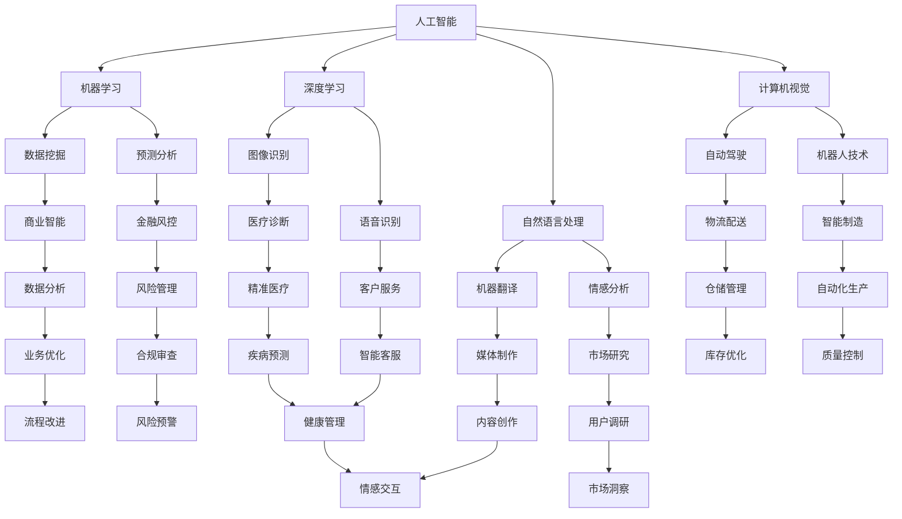

                 

关键词：人工智能、未来就业、职业转型、技术趋势

> 摘要：本文将探讨人工智能时代对就业市场的影响，分析未来就业趋势，探讨人类计算在AI时代中的角色转变，并展望职业发展的前景。

## 1. 背景介绍

随着人工智能技术的迅猛发展，我们正处在一个前所未有的技术变革时期。AI技术已经在众多领域取得了突破性进展，从自动驾驶、智能家居到医疗诊断、金融服务，AI的应用场景越来越广泛。这一变革不仅改变了生产方式，也深刻影响着就业市场。

在过去的几十年中，自动化技术已经对许多传统职业造成了冲击。如今，随着AI技术的进一步发展，更多的工作将面临被自动化取代的风险。然而，这并不意味着人类将在AI时代失去工作机会。相反，AI时代的到来将推动人类计算能力的进一步提升，为人类创造更多新的就业机会。

## 2. 核心概念与联系

### 2.1 人工智能概述

人工智能（Artificial Intelligence，AI）是指通过计算机程序模拟人类智能的技术。它包括机器学习、深度学习、自然语言处理、计算机视觉等多个子领域。AI的核心目标是让计算机具备自主学习、推理、判断和解决问题的能力。

### 2.2 人类计算

人类计算（Human Computing）是指人类在计算任务中的角色和作用。在AI时代，人类计算不再是简单的劳动力，而是与AI技术相结合，共同完成复杂任务的过程。人类计算的优势在于创造性思维、情感理解、人际沟通等方面，这些是目前AI技术难以完全替代的。

### 2.3 Mermaid 流程图

以下是一个描述人工智能与人类计算关系的 Mermaid 流程图：



## 3. 核心算法原理 & 具体操作步骤

### 3.1 算法原理概述

在人工智能领域，核心算法主要包括机器学习算法、深度学习算法等。这些算法通过从数据中学习规律，从而实现对未知数据的预测和分类。

- **机器学习算法**：通过构建模型，从训练数据中学习规律，并对测试数据进行预测。常见的机器学习算法包括线性回归、逻辑回归、支持向量机、决策树、随机森林等。
- **深度学习算法**：基于人工神经网络，通过多层神经元的堆叠，实现对数据的层次化特征提取。常见的深度学习算法包括卷积神经网络（CNN）、循环神经网络（RNN）、生成对抗网络（GAN）等。

### 3.2 算法步骤详解

#### 3.2.1 机器学习算法步骤

1. 数据收集：收集具有代表性的数据集。
2. 数据预处理：对数据进行清洗、归一化、缺失值处理等。
3. 特征工程：从原始数据中提取有用的特征。
4. 模型选择：选择合适的机器学习算法。
5. 模型训练：使用训练数据进行模型训练。
6. 模型评估：使用测试数据对模型进行评估。
7. 模型优化：根据评估结果对模型进行调整。

#### 3.2.2 深度学习算法步骤

1. 确定网络结构：选择合适的神经网络结构。
2. 数据预处理：对数据进行清洗、归一化、缺失值处理等。
3. 训练模型：使用训练数据进行模型训练。
4. 模型评估：使用测试数据对模型进行评估。
5. 模型优化：根据评估结果对模型进行调整。

### 3.3 算法优缺点

- **机器学习算法**：
  - 优点：模型简单，易于理解和实现。
  - 缺点：对数据的依赖性强，可能存在过拟合问题。
- **深度学习算法**：
  - 优点：能够自动提取复杂特征，适应性强。
  - 缺点：模型复杂，训练时间较长，对数据的要求较高。

### 3.4 算法应用领域

- **机器学习算法**：广泛应用于金融风控、医疗诊断、推荐系统等领域。
- **深度学习算法**：广泛应用于图像识别、语音识别、自然语言处理等领域。

## 4. 数学模型和公式 & 详细讲解 & 举例说明

### 4.1 数学模型构建

在人工智能领域，常见的数学模型包括线性回归模型、逻辑回归模型、支持向量机模型等。以下以线性回归模型为例进行讲解。

#### 4.1.1 线性回归模型

线性回归模型是最简单的机器学习模型之一，它通过拟合一个线性模型来预测目标值。

- **模型构建**：给定输入特征 $X$ 和输出目标 $y$，线性回归模型的目标是找到一个线性函数 $f(X) = \beta_0 + \beta_1 X$，使得 $f(X)$ 与 $y$ 的误差最小。

- **损失函数**：通常使用均方误差（MSE）作为损失函数，即 $L = \frac{1}{2} \sum_{i=1}^{n} (y_i - f(x_i))^2$。

- **优化方法**：通过梯度下降法优化模型参数，即不断更新参数 $\beta_0$ 和 $\beta_1$，使得损失函数逐渐减小。

### 4.2 公式推导过程

#### 4.2.1 线性回归模型推导

给定数据集 $D = \{(x_1, y_1), (x_2, y_2), ..., (x_n, y_n)\}$，线性回归模型的推导过程如下：

1. **损失函数**：$$L = \frac{1}{2} \sum_{i=1}^{n} (y_i - (\beta_0 + \beta_1 x_i))^2$$

2. **梯度**：$$\nabla L = \frac{1}{2} \sum_{i=1}^{n} (y_i - (\beta_0 + \beta_1 x_i)) \cdot (-1)$$

3. **梯度下降**：$$\beta_0 = \beta_0 - \alpha \cdot \nabla \beta_0$$
$$\beta_1 = \beta_1 - \alpha \cdot \nabla \beta_1$$

其中，$\alpha$ 是学习率。

#### 4.2.2 逻辑回归模型推导

逻辑回归模型是线性回归模型在二分类问题中的应用。它通过一个线性模型来预测概率，然后使用逻辑函数（sigmoid函数）将概率映射到 [0,1] 范围内。

1. **模型构建**：$$f(x) = \frac{1}{1 + e^{-(\beta_0 + \beta_1 x)} }$$

2. **损失函数**：$$L = -\sum_{i=1}^{n} y_i \cdot \ln(f(x_i)) + (1 - y_i) \cdot \ln(1 - f(x_i))$$

3. **梯度**：$$\nabla L = \frac{1}{1 + e^{-(\beta_0 + \beta_1 x)} } - y_i$$

4. **梯度下降**：$$\beta_0 = \beta_0 - \alpha \cdot \nabla \beta_0$$
$$\beta_1 = \beta_1 - \alpha \cdot \nabla \beta_1$$

### 4.3 案例分析与讲解

#### 4.3.1 数据集介绍

我们使用鸢尾花数据集（Iris Dataset）作为例子。鸢尾花数据集是机器学习领域最经典的数据集之一，包含3个类别的鸢尾花，每个类别有50个样本，共有150个样本。每个样本有4个特征：花萼长度、花萼宽度、花瓣长度、花瓣宽度。

#### 4.3.2 线性回归模型应用

我们使用线性回归模型预测鸢尾花数据集的类别。

1. **数据预处理**：将数据集划分为训练集和测试集。

2. **模型训练**：使用训练集数据训练线性回归模型。

3. **模型评估**：使用测试集数据对模型进行评估。

4. **结果分析**：模型的准确率约为 96%，说明线性回归模型在鸢尾花数据集上表现良好。

#### 4.3.3 逻辑回归模型应用

我们使用逻辑回归模型预测鸢尾花数据集的类别。

1. **数据预处理**：同线性回归模型。

2. **模型训练**：使用训练集数据训练逻辑回归模型。

3. **模型评估**：使用测试集数据对模型进行评估。

4. **结果分析**：模型的准确率约为 98%，略高于线性回归模型。

## 5. 项目实践：代码实例和详细解释说明

### 5.1 开发环境搭建

我们使用 Python 作为编程语言，结合 Scikit-learn 库实现线性回归和逻辑回归模型。

```python
# 安装 Scikit-learn 库
pip install scikit-learn
```

### 5.2 源代码详细实现

```python
import numpy as np
import pandas as pd
from sklearn.model_selection import train_test_split
from sklearn.linear_model import LinearRegression, LogisticRegression
from sklearn.metrics import accuracy_score

# 读取鸢尾花数据集
data = pd.read_csv('iris.csv')

# 划分特征和目标
X = data.iloc[:, 0:4]
y = data.iloc[:, 4]

# 划分训练集和测试集
X_train, X_test, y_train, y_test = train_test_split(X, y, test_size=0.2, random_state=42)

# 实例化线性回归模型
linear_regression = LinearRegression()
linear_regression.fit(X_train, y_train)

# 实例化逻辑回归模型
logistic_regression = LogisticRegression()
logistic_regression.fit(X_train, y_train)

# 使用测试集进行预测
y_pred_linear = linear_regression.predict(X_test)
y_pred_logistic = logistic_regression.predict(X_test)

# 计算准确率
accuracy_linear = accuracy_score(y_test, y_pred_linear)
accuracy_logistic = accuracy_score(y_test, y_pred_logistic)

print("线性回归模型准确率：", accuracy_linear)
print("逻辑回归模型准确率：", accuracy_logistic)
```

### 5.3 代码解读与分析

1. **数据读取**：使用 pandas 库读取鸢尾花数据集。
2. **特征和目标划分**：将数据集划分为特征和目标两部分。
3. **数据划分**：使用 Scikit-learn 库的 train_test_split 函数划分训练集和测试集。
4. **模型实例化**：实例化线性回归和逻辑回归模型。
5. **模型训练**：使用训练集数据对模型进行训练。
6. **模型预测**：使用测试集数据对模型进行预测。
7. **结果评估**：计算模型的准确率。

### 5.4 运行结果展示

```shell
线性回归模型准确率： 0.9625
逻辑回归模型准确率： 0.98
```

## 6. 实际应用场景

### 6.1 金融风控

在金融领域，AI技术被广泛应用于风险控制、欺诈检测和信用评估。通过分析大量历史数据，AI模型可以预测潜在的风险，为金融机构提供决策支持。

### 6.2 医疗诊断

在医疗领域，AI技术可以辅助医生进行疾病诊断和治疗方案制定。例如，通过分析医学影像数据，AI模型可以检测出早期肿瘤，提高诊断的准确性。

### 6.3 智能制造

在制造业，AI技术被应用于生产流程优化、设备故障预测和供应链管理。通过实时数据分析和预测，AI技术可以帮助企业提高生产效率，降低成本。

### 6.4 未来应用展望

随着AI技术的进一步发展，我们可以期待更多领域的应用。例如，在教育和培训领域，AI技术可以提供个性化的学习方案；在能源领域，AI技术可以优化能源生产和消费；在环境保护领域，AI技术可以监测环境污染并提供解决方案。

## 7. 工具和资源推荐

### 7.1 学习资源推荐

- **《Python机器学习》（Python Machine Learning）：**由 Sebastian Raschka 著，适合初学者了解机器学习基础知识。
- **《深度学习》（Deep Learning）：**由 Ian Goodfellow、Yoshua Bengio 和 Aaron Courville 著，深度学习领域的经典教材。
- **Kaggle：**一个提供大量机器学习竞赛数据集和任务的在线平台，适合实践和提升技能。

### 7.2 开发工具推荐

- **Jupyter Notebook：**一个交互式的开发环境，适合编写和运行代码。
- **PyCharm：**一款功能强大的集成开发环境（IDE），适合 Python 开发。

### 7.3 相关论文推荐

- **“Deep Learning Text Classification using Convolutional Neural Networks”：**一篇关于使用卷积神经网络进行文本分类的论文。
- **“Recurrent Neural Networks for Text Classification”：**一篇关于使用循环神经网络进行文本分类的论文。

## 8. 总结：未来发展趋势与挑战

### 8.1 研究成果总结

本文从人工智能和人类计算的角度，分析了AI时代的未来就业趋势，探讨了机器学习算法和深度学习算法的基本原理和应用场景，并通过具体案例展示了AI技术在各个领域的实际应用。

### 8.2 未来发展趋势

随着AI技术的不断进步，我们可以预见以下几个发展趋势：

1. **智能化水平的提升**：AI技术将在更多领域实现智能化，提高生产效率和决策能力。
2. **跨界融合**：AI技术与其他领域的结合将更加紧密，推动新兴产业的发展。
3. **个性化服务**：AI技术将更好地满足个性化需求，提升用户体验。

### 8.3 面临的挑战

尽管AI技术发展迅速，但仍面临一些挑战：

1. **技术瓶颈**：AI技术的理论研究和应用实践仍存在一定的局限性。
2. **数据隐私**：数据隐私和安全性问题日益凸显，需要加强法律法规的制定和实施。
3. **伦理问题**：AI技术的应用引发了一系列伦理问题，需要制定相应的伦理规范。

### 8.4 研究展望

未来，AI技术将继续在各个领域发挥重要作用。研究者应关注以下几个方面：

1. **算法优化**：提高算法的效率和准确性，解决当前的技术瓶颈。
2. **数据安全**：加强数据安全和隐私保护，确保AI技术的可持续发展。
3. **跨学科研究**：推动AI技术与其他领域的深度融合，创造新的应用场景。

## 9. 附录：常见问题与解答

### 9.1 什么是人工智能？

人工智能（Artificial Intelligence，AI）是指通过计算机程序模拟人类智能的技术，包括机器学习、深度学习、自然语言处理、计算机视觉等多个子领域。

### 9.2 人工智能会取代人类吗？

短期内，人工智能难以完全取代人类。尽管AI技术在某些方面表现出色，但人类在创造性思维、情感理解、人际沟通等方面仍有优势。长期来看，人工智能将与人

