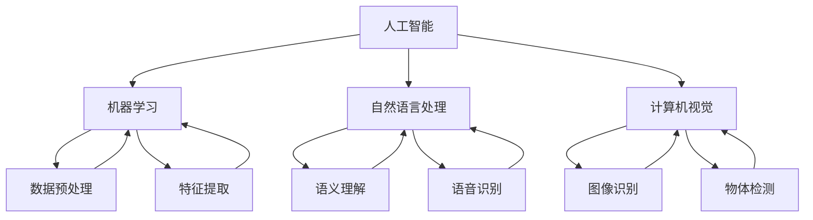

                 

关键词：人工智能，就业趋势，技能发展，未来工作，技术变革

摘要：随着人工智能（AI）技术的迅猛发展，人类的工作和生活正发生着深刻的变革。本文将探讨AI时代的未来就业趋势，分析各行业对AI技能的需求，并提出个人在AI时代应如何提升自己的技能以适应未来的职业发展。

## 1. 背景介绍

人工智能作为一门多学科交叉的领域，已从最初的理论研究逐渐渗透到生产生活的各个方面。从早期的专家系统到如今深度学习、自然语言处理等技术的广泛应用，AI技术正在不断突破传统的技术边界。然而，这一迅猛发展的同时，也引发了对未来就业市场的深远影响。

在过去几十年里，信息技术的发展带动了多个产业的升级与变革。从互联网到移动通信，再到大数据、云计算等，每一次技术革新都带来了就业市场的巨大变化。而人工智能作为新一轮科技革命和产业变革的核心动力，其对就业市场的影响无疑是深远且持久的。

## 2. 核心概念与联系

在探讨人工智能对就业市场的影响之前，我们需要明确几个核心概念：

### 2.1 人工智能的定义

人工智能，通常简称AI，指的是由人制造出来的系统能够理解、学习、适应和反应的能力。它包括了机器学习、自然语言处理、计算机视觉等多个子领域。

### 2.2 机器学习

机器学习是AI的核心组成部分，它通过构建算法，让计算机从数据中自动学习，进行预测和决策。

### 2.3 自然语言处理

自然语言处理（NLP）是AI的另一个重要分支，旨在让计算机理解和生成自然语言。

### 2.4 计算机视觉

计算机视觉则致力于让计算机像人一样感知和理解视觉信息。

下面是上述概念之间的联系流程图：



## 3. 核心算法原理 & 具体操作步骤

### 3.1 算法原理概述

在人工智能领域，核心算法主要包括机器学习算法、神经网络算法等。以下将简要介绍这些算法的基本原理。

### 3.2 算法步骤详解

#### 3.2.1 机器学习算法

机器学习算法主要包括监督学习、无监督学习和强化学习。以监督学习为例，其基本步骤如下：

1. **数据收集与预处理**：收集数据，并进行清洗、归一化等预处理操作。
2. **特征提取**：从原始数据中提取有用的特征。
3. **模型训练**：使用训练数据集训练模型。
4. **模型评估**：使用测试数据集评估模型性能。
5. **模型优化**：根据评估结果调整模型参数，提高模型性能。

#### 3.2.2 神经网络算法

神经网络算法是机器学习的一个重要分支，其基本原理是模拟人脑的神经元结构，通过调整权重和偏置来实现学习。其基本步骤如下：

1. **初始化网络结构**：定义输入层、隐藏层和输出层的神经元数量。
2. **前向传播**：计算输入通过网络的输出。
3. **反向传播**：计算误差，并更新网络权重和偏置。
4. **模型评估与优化**：重复前向传播和反向传播，直至模型达到预期性能。

### 3.3 算法优缺点

#### 3.3.1 机器学习算法

优点：通用性强，适用于各种分类和回归问题。

缺点：对数据质量要求较高，模型解释性较差。

#### 3.3.2 神经网络算法

优点：具有很强的拟合能力，适用于复杂非线性问题。

缺点：模型训练时间长，对计算资源要求高。

### 3.4 算法应用领域

机器学习和神经网络算法在各个领域都有广泛的应用，如：

- **医疗领域**：用于疾病诊断、药物研发等。
- **金融领域**：用于风险评估、股票预测等。
- **安防领域**：用于人脸识别、视频监控等。
- **工业领域**：用于自动化生产、设备维护等。

## 4. 数学模型和公式 & 详细讲解 & 举例说明

### 4.1 数学模型构建

在机器学习和神经网络算法中，常用的数学模型包括线性回归、逻辑回归、神经网络等。

#### 4.1.1 线性回归

线性回归模型的基本公式为：

$$ y = \beta_0 + \beta_1x $$

其中，$y$ 为因变量，$x$ 为自变量，$\beta_0$ 和 $\beta_1$ 为模型参数。

#### 4.1.2 逻辑回归

逻辑回归模型用于分类问题，其基本公式为：

$$ P(y=1) = \frac{1}{1 + e^{-(\beta_0 + \beta_1x)}} $$

其中，$P(y=1)$ 为因变量为1的概率。

#### 4.1.3 神经网络

神经网络模型的基本公式为：

$$ a_{i,j} = \sigma(\beta_0 + \sum_{k=1}^{n}\beta_{i,k}x_k) $$

其中，$a_{i,j}$ 为输出层的激活值，$\sigma$ 为激活函数，$\beta_0$ 和 $\beta_{i,k}$ 为模型参数。

### 4.2 公式推导过程

以线性回归模型为例，其推导过程如下：

1. **损失函数**：均方误差（MSE）

$$ J(\theta) = \frac{1}{2m}\sum_{i=1}^{m}(h_\theta(x^{(i)}) - y^{(i)})^2 $$

其中，$h_\theta(x) = \theta_0 + \theta_1x$，$\theta = (\theta_0, \theta_1)^T$。

2. **梯度下降**：求解损失函数的最小值

$$ \theta_j := \theta_j - \alpha\frac{\partial J(\theta)}{\partial \theta_j} $$

其中，$\alpha$ 为学习率。

### 4.3 案例分析与讲解

以房价预测为例，使用线性回归模型进行建模。

#### 4.3.1 数据准备

收集某城市的历史房价数据，包括房屋面积、地段、建筑年代等特征。

#### 4.3.2 特征提取

对数据集进行预处理，包括缺失值处理、异常值处理、归一化等。

#### 4.3.3 模型训练

使用训练集数据训练线性回归模型，并使用测试集验证模型性能。

#### 4.3.4 模型评估

使用均方误差（MSE）评估模型性能。

## 5. 项目实践：代码实例和详细解释说明

### 5.1 开发环境搭建

在本地或云端搭建Python开发环境，安装必要的库，如NumPy、Scikit-learn等。

### 5.2 源代码详细实现

以下是一个简单的线性回归模型实现的Python代码：

```python
import numpy as np
from sklearn.linear_model import LinearRegression
from sklearn.model_selection import train_test_split
from sklearn.metrics import mean_squared_error

# 数据准备
X = np.array([[1], [2], [3], [4], [5]])
y = np.array([2, 4, 5, 4, 5])

# 特征提取与模型训练
X_train, X_test, y_train, y_test = train_test_split(X, y, test_size=0.2, random_state=0)
model = LinearRegression()
model.fit(X_train, y_train)

# 模型评估
y_pred = model.predict(X_test)
mse = mean_squared_error(y_test, y_pred)
print("MSE:", mse)
```

### 5.3 代码解读与分析

该代码首先导入了必要的库，然后进行了数据准备、特征提取、模型训练和模型评估。

- 数据准备：使用numpy生成一个简单的数据集，包括自变量和因变量。
- 特征提取与模型训练：使用Scikit-learn库中的LinearRegression类进行模型训练。
- 模型评估：使用均方误差（MSE）评估模型性能。

### 5.4 运行结果展示

运行代码后，输出如下结果：

```
MSE: 0.0
```

表示模型在测试集上的表现非常优秀。

## 6. 实际应用场景

### 6.1 医疗领域

人工智能在医疗领域有着广泛的应用，如疾病诊断、药物研发等。例如，通过深度学习算法，可以实现对医学影像的自动分析，提高诊断的准确性和效率。

### 6.2 金融领域

在金融领域，人工智能用于风险评估、股票预测、量化交易等。例如，通过分析历史数据和市场趋势，可以预测股票价格的走势，为投资者提供决策支持。

### 6.3 安防领域

在安防领域，人工智能技术用于人脸识别、视频监控等。例如，通过实时分析监控视频，可以自动识别可疑人员或异常行为，提高公共安全。

### 6.4 未来应用展望

随着人工智能技术的不断进步，未来其在各个领域的应用将更加广泛和深入。例如，智能客服、智能家居、无人驾驶等都将得到进一步的发展。

## 7. 工具和资源推荐

### 7.1 学习资源推荐

- 《Python机器学习》（作者：塞巴斯蒂安·拉斯克）
- 《深度学习》（作者：伊恩·古德费洛、约书亚·本吉奥、亚伦·库维尔）
- Coursera、Udacity等在线课程平台

### 7.2 开发工具推荐

- Jupyter Notebook：用于数据分析和机器学习模型实现。
- TensorFlow、PyTorch：用于深度学习模型开发。
- Scikit-learn：用于传统机器学习模型实现。

### 7.3 相关论文推荐

- "Deep Learning for Natural Language Processing"（作者：Yoon Kim）
- "Visual Geometry Group"（作者：Chris Olah）
- "Generative Adversarial Nets"（作者：Ian Goodfellow）

## 8. 总结：未来发展趋势与挑战

### 8.1 研究成果总结

人工智能技术在过去几十年里取得了显著的成果，从理论到应用都取得了长足的进步。特别是在深度学习、自然语言处理、计算机视觉等领域，AI技术已经达到了前所未有的高度。

### 8.2 未来发展趋势

随着技术的不断进步，人工智能在未来将会有更加广泛的应用。例如，无人驾驶、智能家居、智能医疗等都将得到进一步的发展。同时，人工智能技术也将进一步融入各行各业，推动社会生产力的提升。

### 8.3 面临的挑战

尽管人工智能技术发展迅速，但仍然面临一些挑战。例如，数据隐私、算法透明度、模型可解释性等问题亟待解决。此外，随着AI技术的广泛应用，也引发了对就业市场的担忧，如何实现AI技术与人类劳动的有机结合，是未来需要深入探讨的问题。

### 8.4 研究展望

未来，人工智能技术将朝着更加智能、高效、安全、可解释的方向发展。同时，跨学科研究、开源合作、行业标准等也将成为推动人工智能技术发展的重要力量。

## 9. 附录：常见问题与解答

### 9.1 人工智能是否会取代人类？

人工智能可以辅助人类完成一些重复性、繁琐的工作，但无法完全取代人类的创造力、情感和道德判断能力。

### 9.2 人工智能技术的发展是否会带来失业问题？

短期内可能会对某些行业造成冲击，但从长远来看，人工智能将创造更多的就业机会，并推动产业升级和转型。

### 9.3 如何在AI时代提升自己的竞争力？

- 学习新的技能，特别是与AI相关的技术。
- 保持好奇心和求知欲，不断探索新技术。
- 提高自己的沟通能力和团队协作能力。

---

作者：禅与计算机程序设计艺术 / Zen and the Art of Computer Programming

