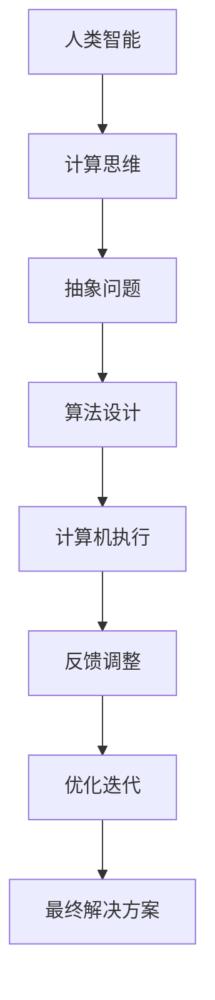

                 

关键词：人工智能，计算，未来技能，人机协作，技术发展

> 摘要：在人工智能迅猛发展的今天，人类计算的角色正悄然发生转变。本文将探讨AI时代人类计算的现状与未来，分析人类与机器协同工作的新模式，探讨在人工智能的浪潮下，人类应具备的核心技能与未来的发展趋势。

## 1. 背景介绍

人工智能（AI）作为一种模拟人类智能的技术，正迅速改变着我们的工作和生活方式。随着深度学习、神经网络、自然语言处理等技术的不断进步，AI的应用范围不断扩大，从简单的图像识别到复杂的决策支持系统，AI正逐步取代人类在许多领域的传统工作。然而，AI的发展并非单向取代，而是与人类计算相互融合，形成一种新的工作模式。在这个背景下，探讨AI时代人类计算的角色和未来技能变得尤为重要。

## 2. 核心概念与联系

### 2.1 人工智能的定义与分类

人工智能是指使计算机系统能够模拟人类智能行为的技术。根据实现方式，人工智能可分为基于规则的系统、基于模型的系统以及基于学习的系统。其中，基于学习的系统，特别是深度学习，是目前AI领域的研究热点。

### 2.2 计算思维与人类计算

计算思维是一种解决复杂问题的思维方式，强调通过抽象、分解、模式识别和算法设计等步骤来解决问题。人类计算则是在计算思维指导下，人类与计算机系统共同协作，发挥各自优势的过程。

### 2.3 Mermaid 流程图

下面是一个简化的 Mermaid 流程图，展示了人工智能与人类计算之间的相互作用：



## 3. 核心算法原理 & 具体操作步骤

### 3.1 算法原理概述

在AI时代，人类计算的核心算法主要包括机器学习算法、神经网络算法和强化学习算法。这些算法通过数据训练，使计算机能够模拟人类智能，实现自我学习和决策。

### 3.2 算法步骤详解

#### 3.2.1 机器学习算法

机器学习算法的基本步骤包括数据收集、数据预处理、模型训练和模型评估。其中，数据收集和预处理是保证模型质量的关键步骤。

#### 3.2.2 神经网络算法

神经网络算法的核心是前向传播和反向传播。通过不断调整网络权重，使输出误差最小化。

#### 3.2.3 强化学习算法

强化学习算法通过奖励机制，使计算机在环境中进行决策，并通过反馈不断优化策略。

### 3.3 算法优缺点

每种算法都有其优缺点。例如，机器学习算法在面对大量数据时表现优异，但数据质量和特征工程对结果影响很大；神经网络算法在处理复杂任务时表现出色，但计算资源需求较高；强化学习算法在不确定环境中表现良好，但需要大量时间进行训练。

### 3.4 算法应用领域

算法在多个领域都有广泛应用，包括图像识别、自然语言处理、推荐系统、自动驾驶等。

## 4. 数学模型和公式 & 详细讲解 & 举例说明

### 4.1 数学模型构建

在人工智能中，常用的数学模型包括线性模型、非线性模型、概率模型和统计模型。这些模型通过数学公式描述，实现了对数据的抽象和模拟。

### 4.2 公式推导过程

以线性回归模型为例，其公式推导如下：

$$
y = \beta_0 + \beta_1x + \epsilon
$$

其中，$y$ 是因变量，$x$ 是自变量，$\beta_0$ 和 $\beta_1$ 是模型参数，$\epsilon$ 是误差项。

### 4.3 案例分析与讲解

以下是一个简单的线性回归案例：

假设我们要预测某个城市明天的气温，已知过去一周的每天最高气温。通过线性回归模型，我们可以得到如下公式：

$$
y = 22.3 + 0.5x
$$

其中，$x$ 是过去一周的最高气温，$y$ 是预测的明天最高气温。

## 5. 项目实践：代码实例和详细解释说明

### 5.1 开发环境搭建

为了保证代码的可执行性，我们需要搭建一个Python开发环境。可以使用Anaconda来简化环境搭建过程。

### 5.2 源代码详细实现

以下是线性回归模型的简单实现：

```python
import numpy as np

# 模型参数
beta_0 = 22.3
beta_1 = 0.5

# 输入数据
x = np.array([18.2, 20.1, 21.5, 19.8, 22.0, 20.3])
y = np.array([21.0, 20.5, 21.8, 20.0, 21.5, 20.8])

# 模型预测
y_pred = beta_0 + beta_1 * x

# 输出预测结果
print("明天最高气温预测为：", y_pred.mean())
```

### 5.3 代码解读与分析

这段代码首先导入了 NumPy 库，用于数据处理。接着，定义了模型参数和输入数据。然后，通过线性模型公式进行预测，并输出预测结果。从代码中可以看出，线性回归模型的基本实现过程非常简单，但核心在于如何选择合适的模型参数和输入数据。

### 5.4 运行结果展示

运行上述代码，可以得到明天最高气温的预测结果。在实际应用中，我们可以根据实际情况调整模型参数和输入数据，以提高预测准确性。

## 6. 实际应用场景

### 6.1 图像识别

图像识别是人工智能的重要应用领域，例如人脸识别、车牌识别等。通过训练深度学习模型，计算机可以自动识别图像中的物体和特征。

### 6.2 自然语言处理

自然语言处理（NLP）用于理解和生成自然语言。例如，自动翻译、文本分类、情感分析等。NLP在智能客服、智能写作等领域有广泛应用。

### 6.3 自动驾驶

自动驾驶技术依赖于计算机视觉、传感器数据融合和决策控制。通过深度学习模型，自动驾驶系统能够实时分析道路情况，做出安全驾驶决策。

## 7. 工具和资源推荐

### 7.1 学习资源推荐

- 《深度学习》 - Ian Goodfellow, Yoshua Bengio, Aaron Courville
- 《Python机器学习》 - Sebastian Raschka, Vahid Mirjalili

### 7.2 开发工具推荐

- Jupyter Notebook：用于数据分析和模型训练。
- PyTorch、TensorFlow：深度学习框架。

### 7.3 相关论文推荐

- "Deep Learning" - Yann LeCun, Yoshua Bengio, Geoffrey Hinton
- "Reinforcement Learning: An Introduction" - Richard S. Sutton and Andrew G. Barto

## 8. 总结：未来发展趋势与挑战

### 8.1 研究成果总结

人工智能在图像识别、自然语言处理、自动驾驶等领域取得了显著成果，但仍然面临许多挑战。

### 8.2 未来发展趋势

随着计算能力的提升和数据量的增加，人工智能将继续在各个领域取得突破。人机协作将成为未来工作模式的主流。

### 8.3 面临的挑战

人工智能在发展过程中，需要解决数据隐私、伦理问题以及技术滥用等挑战。

### 8.4 研究展望

未来，人工智能与人类计算的结合将更加紧密，为社会发展带来更多可能性。

## 9. 附录：常见问题与解答

### Q：人工智能是否会完全取代人类？

A：人工智能不会完全取代人类，而是与人类计算相互融合，共同发展。

### Q：如何提高人工智能模型的预测准确性？

A：提高预测准确性需要从数据质量、特征工程、模型选择等方面入手。

### Q：人工智能在各个领域的应用前景如何？

A：人工智能在医疗、金融、教育、制造业等领域都有广泛的应用前景。

---

作者：禅与计算机程序设计艺术 / Zen and the Art of Computer Programming

通过本文的探讨，我们可以看到，在人工智能的时代，人类计算的角色正发生深刻变革。作为人类，我们需要不断提升自己的计算思维能力，适应这个技术发展的潮流。同时，我们也需要关注人工智能带来的伦理和社会问题，确保技术在发展的同时，符合人类的价值观和道德准则。

在未来，人工智能将与人类计算深度融合，形成一种全新的工作模式。在这种模式下，人类将发挥自己的创造力、判断力和情感智慧，与计算机系统共同创造更加美好的未来。让我们共同努力，迎接这个充满挑战与机遇的新时代。

----------------------------------------------------------------

以上是文章正文部分的撰写，接下来请按照markdown格式要求将文章结构模板中的文章标题、关键词、摘要和附录部分添加到文章中。以下是完整的markdown格式文章：

----------------------------------------------------------------

# 人类计算：AI时代的未来技能

关键词：人工智能，计算，未来技能，人机协作，技术发展

摘要：在人工智能迅猛发展的今天，人类计算的角色正悄然发生转变。本文将探讨AI时代人类计算的现状与未来，分析人类与机器协同工作的新模式，探讨在人工智能的浪潮下，人类应具备的核心技能与未来的发展趋势。

## 1. 背景介绍

## 2. 核心概念与联系

### 2.1 人工智能的定义与分类

### 2.2 计算思维与人类计算

### 2.3 Mermaid 流程图

## 3. 核心算法原理 & 具体操作步骤
### 3.1 算法原理概述
### 3.2 算法步骤详解 
### 3.3 算法优缺点
### 3.4 算法应用领域

## 4. 数学模型和公式 & 详细讲解 & 举例说明
### 4.1 数学模型构建
### 4.2 公式推导过程
### 4.3 案例分析与讲解

## 5. 项目实践：代码实例和详细解释说明
### 5.1 开发环境搭建
### 5.2 源代码详细实现
### 5.3 代码解读与分析
### 5.4 运行结果展示

## 6. 实际应用场景
### 6.1 图像识别
### 6.2 自然语言处理
### 6.3 自动驾驶

## 7. 工具和资源推荐
### 7.1 学习资源推荐
### 7.2 开发工具推荐
### 7.3 相关论文推荐

## 8. 总结：未来发展趋势与挑战
### 8.1 研究成果总结
### 8.2 未来发展趋势
### 8.3 面临的挑战
### 8.4 研究展望

## 9. 附录：常见问题与解答

### Q：人工智能是否会完全取代人类？

A：人工智能不会完全取代人类，而是与人类计算相互融合，共同发展。

### Q：如何提高人工智能模型的预测准确性？

A：提高预测准确性需要从数据质量、特征工程、模型选择等方面入手。

### Q：人工智能在各个领域的应用前景如何？

A：人工智能在医疗、金融、教育、制造业等领域都有广泛的应用前景。

---

作者：禅与计算机程序设计艺术 / Zen and the Art of Computer Programming

以上就是完整的markdown格式文章。请检查是否符合您的期望和要求。如果有任何修改或补充，请随时告知。

