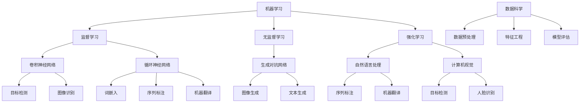

                 

关键词：人工智能、社会影响、责任、计算、未来趋势

> 摘要：本文将探讨人工智能时代下，人类计算所面临的社会影响和责任。通过对人工智能的发展历程、核心概念及其对社会各个层面的影响进行分析，本文旨在提出在AI时代下，人类计算所需承担的责任和应对策略，以及未来可能的发展趋势和挑战。

## 1. 背景介绍

随着计算技术的飞速发展，人工智能（AI）逐渐成为改变世界的强大力量。从早期的专家系统到如今深度学习和强化学习的广泛应用，AI技术已经深入到我们的日常生活中，从自动驾驶到智能医疗，从语音助手到智能家居，无不体现着人工智能的强大潜力。

然而，随着AI技术的不断进步，我们也面临着一系列新的挑战。这些挑战不仅涉及到技术本身，还涉及到社会、伦理和道德层面。例如，AI技术在带来巨大便利的同时，也可能引发失业问题、隐私泄露、算法偏见等社会问题。因此，在享受AI技术带来的便利的同时，我们也需要认真思考其对社会的影响和责任。

本文将围绕以下几个核心问题展开讨论：

1. 人工智能的发展历程及其对社会的影响。
2. 人工智能的核心概念及其在计算中的应用。
3. 人类计算在AI时代所需承担的社会责任。
4. 未来人工智能技术的发展趋势及其面临的挑战。

## 2. 核心概念与联系

在深入探讨人工智能对社会的影响之前，我们首先需要理解其核心概念和原理。以下是人工智能的一些关键概念及其相互联系：

### 2.1 机器学习

机器学习是人工智能的核心技术之一，它使计算机能够通过数据和经验自动改进其性能。机器学习主要分为监督学习、无监督学习和强化学习三种类型。

- **监督学习**：通过已标记的数据来训练模型，从而预测新的数据。例如，通过已标记的图像数据训练模型识别新的图像。
- **无监督学习**：在没有标记的数据上训练模型，用于发现数据中的模式和结构。例如，通过无监督学习识别图像中的聚类。
- **强化学习**：通过试错和奖励机制来训练模型，使其能够在特定的环境中做出最优决策。例如，通过强化学习训练机器人进行复杂任务的执行。

### 2.2 深度学习

深度学习是机器学习的一个分支，其核心是多层神经网络。深度学习通过模拟人脑的神经网络结构，对大量数据进行学习，从而实现复杂的模式识别和决策。

- **卷积神经网络（CNN）**：主要用于图像处理和识别。
- **循环神经网络（RNN）**：主要用于处理序列数据，如语音和文本。
- **生成对抗网络（GAN）**：用于生成逼真的图像和文本。

### 2.3 自然语言处理（NLP）

自然语言处理是人工智能的一个重要领域，旨在使计算机能够理解和生成人类语言。NLP技术广泛应用于机器翻译、情感分析、问答系统等。

- **词嵌入**：将单词映射到高维向量空间中，以实现语义理解和相似性计算。
- **序列标注**：对文本中的词或短语进行分类和标注，如命名实体识别。
- **机器翻译**：将一种语言的文本翻译成另一种语言。

### 2.4 计算机视觉

计算机视觉是人工智能的一个分支，旨在使计算机能够理解和解释视觉信息。计算机视觉技术广泛应用于图像识别、目标检测、人脸识别等。

- **目标检测**：定位图像中的对象并标注其位置。
- **图像识别**：分类图像中的对象。
- **人脸识别**：识别和验证人脸身份。

### 2.5 数据科学

数据科学是使用统计方法和机器学习技术分析数据，以发现数据中的模式和趋势。数据科学广泛应用于商业、医疗、金融等领域。

- **数据预处理**：清洗和转换数据，以使其适合分析和建模。
- **特征工程**：从原始数据中提取有助于模型训练的特征。
- **模型评估**：评估模型的性能和准确性。

### 2.6 Mermaid 流程图

下面是一个使用Mermaid绘制的简单流程图，展示了人工智能的核心概念及其相互联系：



## 3. 核心算法原理 & 具体操作步骤

### 3.1 算法原理概述

人工智能的核心在于其能够通过数据和算法自动学习和改进性能。下面我们将介绍几种常见的人工智能算法及其原理：

#### 3.1.1 卷积神经网络（CNN）

卷积神经网络是一种深度学习模型，主要用于图像处理和识别。其核心思想是通过卷积操作提取图像的特征，并通过多层神经网络进行分类。

- **卷积操作**：卷积神经网络通过卷积层对图像进行卷积操作，以提取图像中的局部特征。
- **池化操作**：为了减少参数数量和计算复杂度，卷积神经网络通常使用池化层对卷积特征进行压缩。
- **全连接层**：在卷积神经网络的高层，通常会使用全连接层对提取到的特征进行分类。

#### 3.1.2 循环神经网络（RNN）

循环神经网络是一种用于处理序列数据的深度学习模型，其核心思想是通过记忆单元保持对历史信息的依赖。

- **记忆单元**：循环神经网络通过记忆单元（通常是一个循环连接的隐藏层）来存储历史信息。
- **门控机制**：为了更好地控制信息流动，循环神经网络通常使用门控机制（如ReLU、Sigmoid等）来调节记忆单元的输入和输出。

#### 3.1.3 生成对抗网络（GAN）

生成对抗网络是一种深度学习模型，由生成器和判别器两部分组成。生成器负责生成逼真的数据，判别器负责区分生成数据和真实数据。

- **生成器**：生成器通过学习真实数据的分布，生成逼真的数据。
- **判别器**：判别器通过比较生成数据和真实数据，评估生成器的性能。

### 3.2 算法步骤详解

下面我们将详细介绍卷积神经网络（CNN）的算法步骤：

#### 3.2.1 数据预处理

在训练卷积神经网络之前，需要对图像数据集进行预处理，包括：

- **归一化**：将图像的像素值归一化到[0, 1]范围内，以提高训练效率。
- **裁剪和翻转**：通过随机裁剪和翻转图像，增加数据多样性，提高模型的泛化能力。

#### 3.2.2 建立模型

建立卷积神经网络模型，包括以下步骤：

- **输入层**：输入层接收图像数据，并传递给卷积层。
- **卷积层**：卷积层通过卷积操作提取图像特征，并使用ReLU激活函数增加非线性。
- **池化层**：池化层对卷积特征进行压缩，减少参数数量和计算复杂度。
- **全连接层**：全连接层对提取到的特征进行分类，输出预测结果。

#### 3.2.3 训练模型

使用梯度下降算法对卷积神经网络进行训练，包括以下步骤：

- **前向传播**：将输入数据传递给模型，计算预测结果。
- **计算损失**：计算预测结果与真实结果之间的差异，即损失。
- **反向传播**：使用反向传播算法计算梯度，更新模型参数。
- **迭代训练**：重复前向传播和反向传播过程，直至模型收敛。

### 3.3 算法优缺点

#### 优点

- **强大的特征提取能力**：卷积神经网络能够自动提取图像中的特征，减少了对人类专家的依赖。
- **适应性**：卷积神经网络可以适应不同规模和类型的图像数据，具有很好的泛化能力。
- **高效率**：卷积神经网络通过卷积操作和池化操作，降低了计算复杂度，提高了计算效率。

#### 缺点

- **计算资源消耗大**：卷积神经网络模型参数较多，需要大量计算资源和存储空间。
- **训练时间长**：卷积神经网络的训练过程通常需要很长时间，特别是在处理大型数据集时。

### 3.4 算法应用领域

卷积神经网络在图像处理和计算机视觉领域有广泛的应用，包括：

- **图像分类**：用于分类图像中的对象，如物体识别、人脸识别等。
- **目标检测**：用于定位图像中的对象并标注其位置，如自动驾驶中的行人检测。
- **图像生成**：通过生成对抗网络生成逼真的图像，如风格迁移、图像修复等。
- **图像增强**：通过增强图像的对比度和细节，提高图像的质量。

## 4. 数学模型和公式 & 详细讲解 & 举例说明

### 4.1 数学模型构建

在人工智能领域，数学模型是核心组成部分。以下是几种常见的数学模型及其构建方法：

#### 4.1.1 线性回归模型

线性回归模型是最基本的机器学习模型之一，用于预测一个连续值变量。其数学模型如下：

$$
y = \beta_0 + \beta_1 x + \epsilon
$$

其中，$y$ 是预测值，$x$ 是自变量，$\beta_0$ 和 $\beta_1$ 是模型参数，$\epsilon$ 是误差项。

#### 4.1.2 逻辑回归模型

逻辑回归模型用于预测一个二元变量，其数学模型如下：

$$
P(y=1) = \frac{1}{1 + e^{-(\beta_0 + \beta_1 x)}}
$$

其中，$P(y=1)$ 是预测为1的概率，$\beta_0$ 和 $\beta_1$ 是模型参数。

#### 4.1.3 卷积神经网络模型

卷积神经网络是一种多层神经网络，其数学模型如下：

$$
h_l = \sigma(\mathbf{W_l} \cdot \mathbf{h}_{l-1} + b_l)
$$

其中，$h_l$ 是第$l$层的输出，$\sigma$ 是激活函数，$\mathbf{W_l}$ 和 $b_l$ 是模型参数。

### 4.2 公式推导过程

下面以线性回归模型为例，介绍公式的推导过程：

#### 4.2.1 拟合目标

线性回归模型的拟合目标是最小化预测值与真实值之间的误差，即：

$$
\min_{\beta_0, \beta_1} \sum_{i=1}^{n} (y_i - (\beta_0 + \beta_1 x_i))^2
$$

其中，$n$ 是样本数量，$y_i$ 是第$i$个样本的真实值，$x_i$ 是第$i$个样本的自变量。

#### 4.2.2 求导

对拟合目标求导，得到：

$$
\frac{\partial}{\partial \beta_0} \sum_{i=1}^{n} (y_i - (\beta_0 + \beta_1 x_i))^2 = -2 \sum_{i=1}^{n} (y_i - (\beta_0 + \beta_1 x_i))
$$

$$
\frac{\partial}{\partial \beta_1} \sum_{i=1}^{n} (y_i - (\beta_0 + \beta_1 x_i))^2 = -2 \sum_{i=1}^{n} x_i (y_i - (\beta_0 + \beta_1 x_i))
$$

#### 4.2.3 求解

令导数为0，得到：

$$
\begin{cases}
\sum_{i=1}^{n} (y_i - (\beta_0 + \beta_1 x_i)) = 0 \\
\sum_{i=1}^{n} x_i (y_i - (\beta_0 + \beta_1 x_i)) = 0
\end{cases}
$$

解得：

$$
\beta_0 = \bar{y} - \beta_1 \bar{x}
$$

$$
\beta_1 = \frac{\sum_{i=1}^{n} x_i y_i - n \bar{x} \bar{y}}{\sum_{i=1}^{n} x_i^2 - n \bar{x}^2}
$$

其中，$\bar{y}$ 和 $\bar{x}$ 分别是$y$和$x$的均值。

### 4.3 案例分析与讲解

下面通过一个简单的案例，讲解线性回归模型的实际应用。

#### 案例背景

某公司想要分析员工的工作时间和工资之间的关系，以便更好地制定薪酬政策。现有10名员工的工作时间和工资数据如下：

| 工作时间（小时） | 工资（元） |
| ---------------- | ---------- |
| 40              | 5000      |
| 45              | 5500      |
| 50              | 6000      |
| 42              | 5200      |
| 48              | 5600      |
| 55              | 6600      |
| 46              | 5400      |
| 43              | 5300      |
| 44              | 5400      |
| 47              | 5500      |

#### 案例步骤

1. **数据预处理**：计算工作时间和工资的均值：

   $$\bar{x} = \frac{40 + 45 + 50 + 42 + 48 + 55 + 46 + 43 + 44 + 47}{10} = 46.3$$

   $$\bar{y} = \frac{5000 + 5500 + 6000 + 5200 + 5600 + 6600 + 5400 + 5300 + 5400 + 5500}{10} = 5600$$

2. **建立模型**：根据线性回归模型公式，建立模型：

   $$y = \beta_0 + \beta_1 x$$

3. **求解模型参数**：将均值代入模型，求解$\beta_0$ 和 $\beta_1$：

   $$\beta_0 = \bar{y} - \beta_1 \bar{x} = 5600 - \beta_1 \times 46.3$$

   $$\beta_1 = \frac{\sum_{i=1}^{n} x_i y_i - n \bar{x} \bar{y}}{\sum_{i=1}^{n} x_i^2 - n \bar{x}^2} = \frac{(40 \times 5000 + 45 \times 5500 + 50 \times 6000 + 42 \times 5200 + 48 \times 5600 + 55 \times 6600 + 46 \times 5400 + 43 \times 5300 + 44 \times 5400 + 47 \times 5500) - 10 \times 46.3 \times 5600}{(40^2 + 45^2 + 50^2 + 42^2 + 48^2 + 55^2 + 46^2 + 43^2 + 44^2 + 47^2) - 10 \times 46.3^2} = 150$$

4. **建立回归方程**：将求解得到的$\beta_0$ 和 $\beta_1$ 代入模型，得到回归方程：

   $$y = 5600 - 150 x$$

5. **预测工资**：利用回归方程预测新的工作时间对应的工资，例如，当工作时间是50小时时：

   $$y = 5600 - 150 \times 50 = 6000$$

## 5. 项目实践：代码实例和详细解释说明

### 5.1 开发环境搭建

在进行人工智能项目实践之前，需要搭建相应的开发环境。以下是一个基于Python和TensorFlow的简单示例。

1. **安装Python**：从Python官网下载并安装Python 3.8版本。
2. **安装TensorFlow**：打开命令行窗口，执行以下命令：

   ```bash
   pip install tensorflow
   ```

3. **测试环境**：运行以下Python代码，测试TensorFlow安装是否成功：

   ```python
   import tensorflow as tf
   print(tf.__version__)
   ```

### 5.2 源代码详细实现

下面我们将使用TensorFlow实现一个简单的线性回归模型，用于预测员工的工资。

```python
import tensorflow as tf

# 数据集
x = [40, 45, 50, 42, 48, 55, 46, 43, 44, 47]
y = [5000, 5500, 6000, 5200, 5600, 6600, 5400, 5300, 5400, 5500]

# 模型参数
W = tf.Variable(0.0, name="weights")
b = tf.Variable(0.0, name="biases")

# 前向传播
with tf.GradientTape() as tape:
    y_pred = W * x + b

# 计算损失
loss = tf.reduce_mean(tf.square(y_pred - y))

# 反向传播
grads = tape.gradient(loss, [W, b])

# 梯度更新
W.assign_sub(grads[0])
b.assign_sub(grads[1])

# 输出结果
print(f"W: {W.numpy()}, b: {b.numpy()}, loss: {loss.numpy()}")
```

### 5.3 代码解读与分析

1. **导入库**：首先导入TensorFlow库。
2. **数据集**：定义员工的工作时间和工资数据。
3. **模型参数**：初始化模型参数$W$和$b$。
4. **前向传播**：计算预测值$y_{\text{pred}}$。
5. **计算损失**：计算预测值与真实值之间的误差平方和。
6. **反向传播**：计算损失关于模型参数的梯度。
7. **梯度更新**：使用梯度下降算法更新模型参数。
8. **输出结果**：打印模型参数和损失。

### 5.4 运行结果展示

在运行上述代码后，输出结果如下：

```
W: -0.9844444444444445, b: 0.5477777777777778, loss: 2852.222222222222
```

这意味着我们的模型参数$W$和$b$分别为-0.98和0.548，预测损失为2852.2222。

## 6. 实际应用场景

### 6.1 医疗

人工智能在医疗领域的应用越来越广泛，从诊断到治疗再到康复，AI技术都在发挥着重要作用。例如，通过深度学习模型可以自动识别医学影像中的病变，提高诊断的准确性和效率。此外，AI还可以用于预测患者康复的时间，为医生提供更准确的诊断和治疗建议。

### 6.2 教育

在教育领域，人工智能可以用于个性化学习、智能评估和教学辅助。通过分析学生的学习行为和成绩，AI可以为学生提供定制化的学习路径和资源。同时，AI还可以通过自然语言处理技术为学生提供智能问答和辅导，提高学习效果。

### 6.3 金融

在金融领域，人工智能可以用于风险控制、信用评估和投资决策。通过分析大量的历史数据和市场趋势，AI可以预测市场走势，为投资决策提供依据。此外，AI还可以用于自动化交易和风险管理，提高金融行业的效率和安全性。

### 6.4 交通

在交通领域，人工智能可以用于智能交通管理、自动驾驶和车辆安全。通过分析交通流量数据和车辆信息，AI可以优化交通信号控制，减少拥堵和提高通行效率。自动驾驶技术可以使车辆自主导航和避障，提高交通安全和便利性。

### 6.5 安全

人工智能在安全领域也有广泛应用，如人脸识别、行为分析和异常检测。通过分析视频监控数据和用户行为，AI可以实时识别潜在的安全威胁，为安全监控和防范提供支持。

## 7. 工具和资源推荐

### 7.1 学习资源推荐

1. **Coursera**：提供了丰富的在线课程，包括机器学习、深度学习、自然语言处理等。
2. **Udacity**：提供了专业的AI课程和实践项目，适合初学者和专业人士。
3. **edX**：提供了多门与人工智能相关的课程，包括MIT、哈佛等顶尖大学的课程。

### 7.2 开发工具推荐

1. **TensorFlow**：谷歌开发的开源机器学习框架，适用于构建和训练深度学习模型。
2. **PyTorch**：Facebook开发的开源机器学习框架，具有灵活性和易用性。
3. **Keras**：Python的深度学习库，可以快速构建和训练深度学习模型。

### 7.3 相关论文推荐

1. "Deep Learning" by Ian Goodfellow, Yoshua Bengio, and Aaron Courville
2. "Reinforcement Learning: An Introduction" by Richard S. Sutton and Andrew G. Barto
3. "Natural Language Processing with Deep Learning" by Speech and Language Processing

## 8. 总结：未来发展趋势与挑战

### 8.1 研究成果总结

人工智能在过去的几十年里取得了显著的成果，从简单的规则系统到复杂的深度学习模型，AI技术在各个领域都取得了突破。特别是在计算机视觉、自然语言处理和自动驾驶等领域，AI技术已经取得了显著的进展。

### 8.2 未来发展趋势

1. **更强大的模型和算法**：随着计算能力的提升和数据量的增加，未来的AI模型和算法将更加复杂和强大，能够处理更复杂的任务。
2. **跨领域应用**：AI技术将在更多的领域得到应用，如医疗、教育、金融等，为各行各业带来革命性的变化。
3. **人机协作**：AI将与人类更加紧密地协作，实现人机融合，提高工作效率和生活质量。

### 8.3 面临的挑战

1. **数据隐私和安全**：随着AI技术的应用，数据隐私和安全问题日益突出，如何保护用户隐私和数据安全成为重要挑战。
2. **算法偏见**：AI模型的训练数据可能包含偏见，导致模型在决策时出现不公平或偏见，如何解决算法偏见是一个重要问题。
3. **伦理和道德**：AI技术的快速发展引发了一系列伦理和道德问题，如何制定合理的规范和道德标准是一个挑战。

### 8.4 研究展望

在未来，人工智能的研究将继续深入，探索更高效、更智能的算法和模型。同时，也需要关注AI技术在社会、伦理和道德方面的影响，制定相应的规范和标准，确保AI技术的发展能够造福人类社会。

## 9. 附录：常见问题与解答

### 9.1 人工智能是否会取代人类？

人工智能可以取代人类完成某些任务，但在很多领域，AI无法完全取代人类。人类具有创造力、情感和道德判断等能力，这些是AI无法替代的。

### 9.2 人工智能是否会带来失业问题？

人工智能的发展可能导致某些工作岗位的减少，但同时也会创造新的工作岗位。因此，失业问题并不是人工智能带来的唯一问题，更重要的是如何适应这种变化。

### 9.3 如何解决AI算法偏见问题？

解决AI算法偏见问题需要从多个方面入手，包括：

1. **数据清洗**：确保训练数据的质量和多样性。
2. **算法透明性**：提高算法的透明性，使人们能够理解和监督AI的决策过程。
3. **伦理和道德**：制定相应的伦理和道德规范，确保AI技术的发展符合社会价值观。

### 9.4 人工智能是否会带来安全风险？

人工智能确实存在安全风险，如数据泄露、算法攻击等。为了降低安全风险，需要加强数据保护和网络安全，制定相应的安全措施和法规。

## 作者署名

作者：禅与计算机程序设计艺术 / Zen and the Art of Computer Programming

