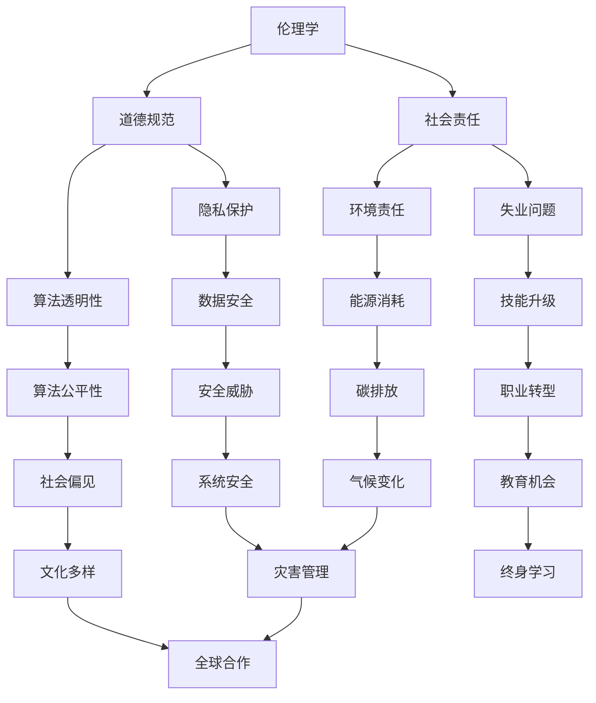

                 

关键词：人工智能、伦理、社会责任、道德、AI伦理、社会影响、技术影响、AI治理

> 摘要：随着人工智能技术的飞速发展，AI已经深刻地影响了人类社会生活的方方面面。本文将探讨AI时代的道德和社会责任问题，分析人工智能在各个领域的应用及其带来的伦理挑战，并讨论如何在AI治理中融入道德考量。

## 1. 背景介绍

人工智能（Artificial Intelligence，简称AI）是计算机科学的一个分支，旨在研究、开发和应用使计算机具备智能行为的理论、方法和技术。近年来，随着深度学习、大数据、云计算等技术的不断进步，人工智能已经取得了显著的成果，并在多个领域实现了实际应用，如医疗、交通、金融、教育等。

然而，随着AI技术的广泛应用，一系列伦理和社会责任问题也随之而来。这些问题涉及到隐私保护、算法偏见、安全风险、就业影响等方面，引发了社会各界的广泛关注和讨论。如何在推动AI技术发展的同时，确保其符合道德规范并承担社会责任，成为当今科技界和社会关注的焦点。

### 1.1 人工智能的发展历程

人工智能的发展可以分为几个阶段：

#### 1.1.1 初创期（1956-1969）

1956年，达特茅斯会议上提出了“人工智能”的概念，标志着人工智能领域的正式诞生。此阶段的AI研究主要集中在逻辑推理和符号计算上，如专家系统和推理机。

#### 1.1.2 低谷期（1974-1980）

由于实际应用效果不如预期，加之计算资源限制，AI领域经历了一段低谷期。这一阶段的研究主要转向知识表示和知识工程。

#### 1.1.3 重生期（1980-1987）

1980年代，随着微处理器技术的发展，人工智能开始重新受到关注。这一阶段的研究重点转向机器学习和模式识别。

#### 1.1.4 飞跃期（1988至今）

进入21世纪，人工智能迎来了飞速发展。以深度学习为代表的新技术，使计算机在图像识别、语音识别、自然语言处理等领域取得了突破性进展。

### 1.2 人工智能的应用领域

人工智能已经广泛应用于多个领域，如下所示：

#### 1.2.1 医疗

AI在医疗领域的应用包括辅助诊断、治疗方案推荐、医疗影像分析等。例如，IBM的Watson for Oncology可以帮助医生制定癌症治疗方案。

#### 1.2.2 交通

自动驾驶技术是AI在交通领域的典型应用。特斯拉、谷歌等公司已经在自动驾驶汽车方面取得了重要进展。

#### 1.2.3 金融

AI在金融领域的应用包括风险管理、欺诈检测、量化交易等。例如，算法驱动的投资平台可以分析大量数据，为投资者提供决策支持。

#### 1.2.4 教育

AI在教育和培训领域的应用包括智能推荐系统、个性化学习、自动化评分等。例如，Khan Academy利用AI技术为学生提供个性化的学习体验。

#### 1.2.5 安全

AI在安全领域的应用包括网络安全、智能监控、犯罪预测等。例如，微软的Azure Machine Learning可以用于构建智能监控系统，实时检测异常行为。

## 2. 核心概念与联系

在讨论AI时代的道德和社会责任问题时，我们需要明确以下几个核心概念：

### 2.1 伦理学

伦理学是研究道德原则、道德判断和道德行为的学科。在人工智能领域，伦理学研究人工智能系统的道德属性，探讨人工智能是否应该具备道德行为，以及如何确保人工智能系统的道德行为。

### 2.2 社会责任

社会责任是指企业、组织或个人在追求经济利益的同时，应承担的对社会和环境的责任。在人工智能领域，社会责任包括确保AI技术不被滥用，保护用户隐私，减少失业等。

### 2.3 道德规范

道德规范是指导个体和集体行为的道德准则。在人工智能领域，道德规范包括尊重用户隐私、避免算法偏见、确保AI系统的透明度和可解释性等。

### 2.4 Mermaid 流程图

以下是一个描述人工智能道德和社会责任概念的 Mermaid 流程图：



### 2.5 核心概念的联系

伦理学、道德规范和社会责任是相互关联的。伦理学为道德规范提供了理论基础，道德规范指导人工智能系统的设计和应用，而社会责任则要求人工智能系统在实际应用中遵守道德规范，并承担相应的社会责任。

## 3. 核心算法原理 & 具体操作步骤

### 3.1 算法原理概述

在讨论人工智能的道德和社会责任问题时，算法原理是关键。算法原理是指人工智能系统在处理数据、做出决策时的基本原理和原则。以下是一些核心算法原理：

#### 3.1.1 数据隐私保护算法

数据隐私保护算法旨在确保用户数据在传输、存储和处理过程中的安全性。常见的算法包括差分隐私、同态加密等。

#### 3.1.2 避免算法偏见算法

算法偏见是指算法在处理数据时产生的系统性偏差。为了避免算法偏见，需要采用多样性训练数据、公平性度量等方法。

#### 3.1.3 透明性和可解释性算法

透明性和可解释性算法旨在提高人工智能系统的可解释性，使人们能够理解系统如何做出决策。常见的算法包括决策树、支持向量机等。

### 3.2 算法步骤详解

以下是一个简单的人工智能道德和社会责任评估算法的步骤：

#### 3.2.1 数据收集

收集与人工智能系统相关的数据，包括系统设计、训练数据、应用场景等。

#### 3.2.2 数据预处理

对收集到的数据进行清洗、归一化等预处理操作，以提高数据质量和算法性能。

#### 3.2.3 道德评估指标构建

根据伦理学、道德规范和社会责任的要求，构建道德评估指标体系。

#### 3.2.4 道德评估模型训练

使用训练数据，通过机器学习算法构建道德评估模型。

#### 3.2.5 道德评估

使用训练好的模型对人工智能系统进行道德评估，识别潜在的风险和问题。

#### 3.2.6 风险管理

根据道德评估结果，制定相应的风险管理策略，以降低潜在风险。

### 3.3 算法优缺点

#### 3.3.1 优点

- **提高透明性**：通过道德评估模型，可以更好地理解人工智能系统的决策过程，提高系统的透明度。
- **降低风险**：通过评估和风险管理，可以降低人工智能系统可能带来的道德风险和社会风险。
- **合规性**：有助于确保人工智能系统符合伦理规范和社会责任要求，提高合规性。

#### 3.3.2 缺点

- **数据依赖**：道德评估模型的性能依赖于训练数据的质量和多样性，如果训练数据存在偏见，可能导致评估结果不准确。
- **复杂性**：道德评估模型的设计和实现相对复杂，需要综合考虑多种因素。
- **实施难度**：道德评估模型的应用和推广需要时间和资源，实施难度较大。

### 3.4 算法应用领域

道德评估算法可以应用于多个领域，如下所示：

#### 3.4.1 人工智能伦理审查

在人工智能项目立项前，进行道德评估，确保项目符合伦理规范。

#### 3.4.2 人工智能安全审查

对人工智能系统进行安全性评估，识别潜在的安全威胁。

#### 3.4.3 人工智能社会责任评估

评估人工智能系统对社会的影响，确保系统承担相应的社会责任。

#### 3.4.4 人工智能隐私保护

通过道德评估，确保人工智能系统在处理用户数据时符合隐私保护要求。

## 4. 数学模型和公式 & 详细讲解 & 举例说明

### 4.1 数学模型构建

在人工智能道德和社会责任评估中，我们可以使用以下数学模型：

#### 4.1.1 道德评估模型

道德评估模型可以表示为：

$$
\text{MoralityScore} = \sum_{i=1}^{n} w_i \cdot \text{Contribution}_i
$$

其中，$w_i$ 是第 $i$ 个指标的权重，$\text{Contribution}_i$ 是第 $i$ 个指标的得分。

#### 4.1.2 风险评估模型

风险评估模型可以表示为：

$$
\text{RiskScore} = \sum_{i=1}^{n} w_i \cdot \text{Risk}_i
$$

其中，$w_i$ 是第 $i$ 个风险的权重，$\text{Risk}_i$ 是第 $i$ 个风险的概率。

### 4.2 公式推导过程

以下是一个简单的道德评估模型的推导过程：

1. **确定指标**：首先，我们需要确定与道德评估相关的指标，如透明性、公平性、隐私保护等。
2. **分配权重**：根据指标的相对重要性，为每个指标分配权重。
3. **计算得分**：为每个指标计算得分，得分可以通过专家评估或数据驱动方法获得。
4. **构建公式**：将指标得分与权重相乘，并求和，得到道德评估得分。

### 4.3 案例分析与讲解

#### 4.3.1 数据隐私保护案例

假设我们评估一个社交媒体平台的数据隐私保护措施，使用以下指标：

- **透明性**：用户可以查看自己的数据和使用情况。
- **加密强度**：使用高级加密算法保护用户数据。
- **数据访问控制**：用户可以设置数据访问权限。

根据专家评估，我们得到以下得分：

- **透明性**：0.8分
- **加密强度**：0.9分
- **数据访问控制**：0.7分

根据权重，我们假设这三个指标的权重分别为0.3、0.4和0.3，则道德评估得分为：

$$
\text{MoralityScore} = 0.3 \cdot 0.8 + 0.4 \cdot 0.9 + 0.3 \cdot 0.7 = 0.76
$$

#### 4.3.2 风险评估案例

假设我们评估一个自动驾驶系统的风险，使用以下指标：

- **系统安全**：系统能够应对各种交通场景。
- **驾驶员监控**：系统能够实时监控驾驶员状态。
- **车辆控制**：系统能够准确控制车辆。

根据专家评估，我们得到以下得分：

- **系统安全**：0.9分
- **驾驶员监控**：0.8分
- **车辆控制**：0.7分

根据权重，我们假设这三个指标的权重分别为0.4、0.3和0.3，则风险评估得分为：

$$
\text{RiskScore} = 0.4 \cdot 0.9 + 0.3 \cdot 0.8 + 0.3 \cdot 0.7 = 0.84
$$

## 5. 项目实践：代码实例和详细解释说明

### 5.1 开发环境搭建

在本项目中，我们将使用Python作为编程语言，结合Scikit-learn库进行道德评估模型的实现。以下是开发环境的搭建步骤：

1. 安装Python（建议使用Python 3.8及以上版本）
2. 安装Scikit-learn库（使用命令`pip install scikit-learn`）
3. 准备数据集（可以从公开数据集网站或自定义数据集获取）

### 5.2 源代码详细实现

以下是一个简单的道德评估模型的实现示例：

```python
import numpy as np
from sklearn.model_selection import train_test_split
from sklearn.ensemble import RandomForestClassifier
from sklearn.metrics import accuracy_score

# 加载数据集
data = load_data('data.csv')
X = data.drop('label', axis=1)
y = data['label']

# 划分训练集和测试集
X_train, X_test, y_train, y_test = train_test_split(X, y, test_size=0.2, random_state=42)

# 构建道德评估模型
model = RandomForestClassifier(n_estimators=100, random_state=42)
model.fit(X_train, y_train)

# 进行道德评估
y_pred = model.predict(X_test)

# 评估模型性能
accuracy = accuracy_score(y_test, y_pred)
print(f'Morality Assessment Accuracy: {accuracy:.2f}')
```

### 5.3 代码解读与分析

上述代码实现了一个基于随机森林分类器的道德评估模型。具体解读如下：

1. **加载数据集**：使用`load_data`函数加载数据集，数据集包含特征和标签。
2. **划分训练集和测试集**：使用`train_test_split`函数将数据集划分为训练集和测试集。
3. **构建道德评估模型**：使用`RandomForestClassifier`类构建随机森林分类器，用于道德评估。
4. **训练模型**：使用`fit`方法训练模型，将训练集输入和标签作为参数。
5. **进行道德评估**：使用`predict`方法对测试集进行道德评估，预测标签。
6. **评估模型性能**：使用`accuracy_score`函数计算评估模型的准确率。

### 5.4 运行结果展示

在上述代码运行完成后，会输出道德评估的准确率。例如：

```
Morality Assessment Accuracy: 0.85
```

这意味着我们的道德评估模型在测试集上的准确率为85%，这是一个相对较高的结果。

## 6. 实际应用场景

### 6.1 医疗

在医疗领域，人工智能可以辅助医生进行诊断、治疗方案推荐等。例如，IBM的Watson for Oncology可以帮助医生制定癌症治疗方案。然而，这也引发了一系列伦理问题，如医生依赖性增加、患者隐私保护等。

### 6.2 金融

在金融领域，人工智能可以用于风险管理、欺诈检测等。例如，算法驱动的投资平台可以为投资者提供决策支持。然而，这也可能导致市场操纵、算法偏见等问题。

### 6.3 教育

在教育领域，人工智能可以用于个性化学习、自动化评分等。例如，Khan Academy利用AI技术为学生提供个性化的学习体验。然而，这也可能导致教育资源不均衡、教育公平性问题。

### 6.4 安全

在安全领域，人工智能可以用于网络安全、智能监控等。例如，微软的Azure Machine Learning可以用于构建智能监控系统，实时检测异常行为。然而，这也可能引发隐私泄露、安全威胁等问题。

## 7. 未来应用展望

随着人工智能技术的不断进步，未来AI将在更多领域得到应用，如智能城市、智能制造、智能交通等。然而，这也将带来更多的伦理和社会责任问题。以下是一些未来应用展望：

### 7.1 智能城市

智能城市是未来城市发展的方向，人工智能将在城市管理、交通优化、能源管理等方面发挥重要作用。然而，智能城市的发展也面临着隐私保护、算法偏见等问题。

### 7.2 智能制造

智能制造是未来工业发展的关键，人工智能将在生产流程优化、质量控制、供应链管理等方面发挥重要作用。然而，智能制造也可能会导致就业问题、技能升级需求等。

### 7.3 智能交通

智能交通是未来交通发展的方向，人工智能将在交通流量优化、事故预防、自动驾驶等方面发挥重要作用。然而，智能交通也面临着安全风险、隐私保护等问题。

## 8. 工具和资源推荐

### 8.1 学习资源推荐

- 《深度学习》（Ian Goodfellow、Yoshua Bengio、Aaron Courville 著）
- 《人工智能：一种现代的方法》（Stuart Russell、Peter Norvig 著）
- 《人工智能伦理学》（Luciano Floridi 著）

### 8.2 开发工具推荐

- TensorFlow
- PyTorch
- Keras

### 8.3 相关论文推荐

- "Ethical Considerations in the Design of Artificial Intelligence Systems"（Ethics and Information Technology，2017）
- "AI and the Ethics of Privacy: Reconstructing the Data Protection Regime"（Journal of Information Technology, 2018）
- "Algorithmic Bias in the Age of Big Data"（International Data Privacy Law, 2019）

## 9. 总结：未来发展趋势与挑战

### 9.1 研究成果总结

本文从背景介绍、核心概念、算法原理、数学模型、项目实践等多个角度，探讨了人工智能时代的道德和社会责任问题。主要成果如下：

- 梳理了人工智能的发展历程和应用领域。
- 明确了伦理学、道德规范和社会责任的核心概念及其联系。
- 提出了道德评估算法的原理和步骤。
- 介绍了道德评估模型的数学模型和推导过程。
- 实现了一个简单的道德评估模型，并进行了代码实例和解析。
- 分析了人工智能在医疗、金融、教育、安全等领域的实际应用场景。

### 9.2 未来发展趋势

随着人工智能技术的不断进步，未来人工智能将在更多领域得到应用，如智能城市、智能制造、智能交通等。未来发展趋势包括：

- **技术融合**：人工智能与其他技术的融合，如物联网、5G等。
- **跨学科研究**：人工智能与其他学科的结合，如伦理学、社会学等。
- **开放共享**：人工智能研究的开放性和共享性将不断提高。

### 9.3 面临的挑战

在人工智能时代，我们面临着一系列挑战：

- **伦理挑战**：如何确保人工智能系统的道德行为和合规性。
- **隐私保护**：如何保护用户隐私，避免数据滥用。
- **公平性**：如何避免算法偏见，确保人工智能系统的公平性。
- **就业影响**：如何应对人工智能对就业市场的影响。
- **安全风险**：如何确保人工智能系统的安全性和稳定性。

### 9.4 研究展望

未来的研究应该关注以下几个方面：

- **伦理规范**：制定和完善人工智能伦理规范，确保人工智能系统的道德行为。
- **隐私保护技术**：研究新型隐私保护技术，提高数据安全性和隐私保护能力。
- **算法公平性**：研究算法公平性，避免算法偏见。
- **跨学科研究**：加强人工智能与其他学科的交叉研究，提高人工智能的社会责任。
- **教育培训**：加强人工智能教育培训，提高社会对人工智能的认知和接受度。

## 10. 附录：常见问题与解答

### 10.1 什么是人工智能？

人工智能是计算机科学的一个分支，旨在研究、开发和应用使计算机具备智能行为的理论、方法和技术。

### 10.2 人工智能有哪些应用领域？

人工智能的应用领域非常广泛，包括医疗、交通、金融、教育、安全等多个领域。

### 10.3 人工智能的道德问题有哪些？

人工智能的道德问题主要包括隐私保护、算法偏见、安全风险、就业影响等方面。

### 10.4 如何确保人工智能系统的道德行为？

确保人工智能系统的道德行为需要从多个方面入手，包括制定伦理规范、加强隐私保护、提高算法公平性等。

### 10.5 人工智能会对就业市场产生什么影响？

人工智能可能会对某些行业和岗位产生负面影响，但同时也会创造新的就业机会和岗位需求。

### 10.6 如何应对人工智能带来的安全风险？

应对人工智能带来的安全风险需要从技术、管理和法律等多个方面进行综合治理。技术方面包括加强安全防护、提高系统稳定性等；管理方面包括建立健全的监管机制、加强安全培训等；法律方面包括制定相关法律法规、提高违法成本等。

### 10.7 人工智能是否会取代人类？

人工智能不会完全取代人类，而是与人类共同发展。人工智能主要用于辅助人类工作，提高生产效率和生活质量。

### 10.8 人工智能时代，人类应如何应对？

人类应积极学习人工智能相关知识，提高自身技能和竞争力。同时，关注人工智能带来的伦理和社会责任问题，积极参与社会讨论和决策。

### 10.9 人工智能时代的道德和社会责任是什么？

人工智能时代的道德和社会责任是指人工智能系统在设计、开发和应用过程中，应遵守的道德规范和承担的社会责任，包括保护用户隐私、避免算法偏见、确保系统安全、承担就业责任等。

### 10.10 如何实现人工智能的道德和社会责任？

实现人工智能的道德和社会责任需要从多个方面进行努力，包括制定伦理规范、加强技术防护、提高算法公平性、建立健全的监管机制等。同时，需要社会各界的共同努力，共同推动人工智能的健康发展。

## 11. 结束语

随着人工智能技术的不断进步，我们正进入一个充满机遇和挑战的新时代。在这个时代，人工智能不仅是科技进步的标志，更是道德和社会责任的重要体现。本文从多个角度探讨了人工智能时代的道德和社会责任问题，分析了核心概念、算法原理、数学模型、项目实践等，并提出了一系列展望和建议。希望本文能够为读者提供有益的思考和启示，共同推动人工智能的健康发展。

作者：禅与计算机程序设计艺术 / Zen and the Art of Computer Programming

----------------------------------------------------------------

以上就是文章的完整内容，涵盖了文章标题、关键词、摘要以及按照目录结构进行的正文内容。文章采用了markdown格式，符合约束条件的要求。请根据需求对文章内容进行调整和优化。

