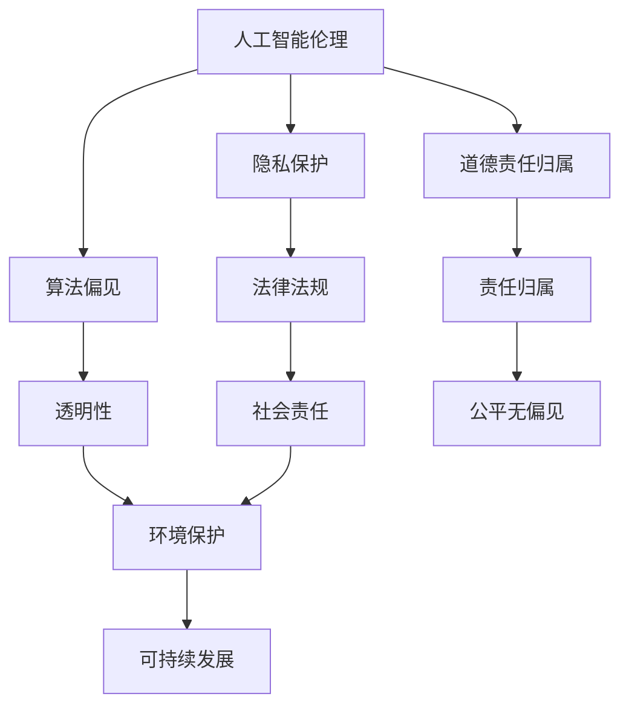

                 

随着人工智能技术的飞速发展，我们正逐步进入一个前所未有的智能时代。然而，AI的迅猛发展不仅带来了技术进步，也引发了一系列深刻的伦理道德和社会问题。本文旨在探讨AI时代的道德边界，从技术、法律、社会等多个维度，深入分析人工智能在伦理道德方面所面临的挑战与应对策略。

## 文章关键词

- 人工智能
- 道德边界
- 伦理问题
- 法律法规
- 社会责任

## 摘要

本文首先介绍了人工智能技术的发展背景和当前的应用现状，随后分析了AI技术在伦理道德方面面临的挑战，包括隐私侵犯、算法偏见、道德责任归属等问题。文章还探讨了相关法律法规的制定与实施，以及企业在AI伦理道德问题上的社会责任。最后，本文提出了未来发展的趋势与挑战，并展望了人类计算在AI时代的前景。

## 1. 背景介绍

### 1.1 人工智能技术发展

人工智能（Artificial Intelligence, AI）是一门模拟、延伸和扩展人类智能的科学。自20世纪50年代诞生以来，人工智能经历了多个发展阶段。从最初的符号逻辑和专家系统，到基于统计学习的机器学习，再到深度学习和强化学习，人工智能技术取得了显著的进步。

近年来，随着计算能力的提升、大数据的积累以及算法的创新，人工智能在语音识别、图像处理、自然语言处理、自动驾驶、医疗诊断等领域取得了突破性进展。AI技术的应用不仅提高了生产效率，也深刻改变了人们的生活方式。

### 1.2 人工智能的应用现状

目前，人工智能技术已经在各个领域得到广泛应用。例如，在工业生产中，AI技术被用于生产调度、质量检测和设备维护，提高了生产效率和产品质量。在服务业，智能客服和推荐系统提供了更加个性化和高效的服务。在医疗领域，人工智能辅助诊断和治疗方案制定，提高了医疗服务的质量和效率。

此外，人工智能还在金融、教育、安全、环境保护等领域发挥着重要作用。例如，金融行业利用AI进行风险管理、欺诈检测和投资决策；教育行业通过智能教育平台提供个性化学习方案；安全领域利用AI进行网络安全监测和防范；环境保护领域利用AI进行环境监测和污染控制。

## 2. 核心概念与联系

### 2.1 人工智能伦理

人工智能伦理（Ethics of Artificial Intelligence）是研究人工智能在道德和伦理方面的问题的学科。随着AI技术的快速发展，人工智能伦理成为了一个重要的研究领域。人工智能伦理涉及多个方面，包括隐私保护、算法偏见、道德责任归属等。

### 2.2 道德原则

在人工智能伦理中，一些基本的道德原则被广泛接受，包括：

- **尊重隐私**：保护个人隐私，防止隐私泄露和滥用。
- **公平无偏见**：确保算法的公平性和透明性，避免算法偏见。
- **透明性**：算法的设计和运行过程应该对用户和社会透明。
- **责任归属**：明确算法的责任归属，确保在出现问题时能够追究责任。

### 2.3 人工智能与法律

人工智能与法律（Artificial Intelligence and Law）是研究人工智能在法律领域应用及其伦理道德问题的交叉学科。随着AI技术的发展，人工智能与法律的关系变得越来越紧密。例如，AI在司法领域的应用，如智能裁判、智能辩护和证据分析，需要解决一系列法律和伦理问题。

### 2.4 人工智能与社会责任

人工智能与社会责任（Social Responsibility of Artificial Intelligence）是指企业在开发和应用人工智能技术时，应承担的社会责任。这包括保护用户隐私、确保算法公平无偏见、避免对环境和人类造成负面影响等。

### 2.5 Mermaid 流程图



## 3. 核心算法原理 & 具体操作步骤

### 3.1 算法原理概述

在人工智能伦理研究中，常用的算法原理包括：

- **机器学习**：通过训练数据集，让计算机自动学习特征和模式。
- **自然语言处理**：使计算机能够理解和处理人类自然语言。
- **图像识别**：使计算机能够理解和识别图像中的物体和场景。

这些算法原理为实现人工智能伦理提供了技术基础。

### 3.2 算法步骤详解

以下是实现人工智能伦理的算法步骤：

1. **数据收集**：收集相关领域的数据，包括个人隐私数据、算法偏见数据等。
2. **数据预处理**：对收集的数据进行清洗、归一化和特征提取。
3. **模型训练**：利用机器学习和自然语言处理技术训练模型。
4. **算法评估**：对训练好的模型进行评估，确保算法的公平性和透明性。
5. **模型部署**：将训练好的模型部署到实际应用场景中。

### 3.3 算法优缺点

- **优点**：算法原理成熟，可以实现高度自动化的伦理判断和决策。
- **缺点**：算法可能存在偏见，难以保证算法的公平性和透明性。

### 3.4 算法应用领域

人工智能伦理算法广泛应用于多个领域，包括：

- **隐私保护**：用于分析和识别个人隐私数据，确保隐私不被泄露。
- **算法偏见检测**：用于检测和纠正算法偏见，确保算法的公平性。
- **道德责任归属**：用于判断和分配道德责任，确保在出现问题时能够追究责任。

## 4. 数学模型和公式 & 详细讲解 & 举例说明

### 4.1 数学模型构建

在人工智能伦理中，常用的数学模型包括：

- **概率模型**：用于分析隐私数据，计算隐私泄露的概率。
- **决策树模型**：用于分析算法偏见，判断算法的公平性。
- **支持向量机模型**：用于分析道德责任归属，判断责任归属的可能性。

### 4.2 公式推导过程

以下是一个简单的概率模型公式推导：

$$
P(A|B) = \frac{P(B|A)P(A)}{P(B)}
$$

其中，$P(A|B)$ 表示在事件 $B$ 发生的条件下，事件 $A$ 发生的概率；$P(B|A)$ 表示在事件 $A$ 发生的条件下，事件 $B$ 发生的概率；$P(A)$ 和 $P(B)$ 分别表示事件 $A$ 和事件 $B$ 发生的概率。

### 4.3 案例分析与讲解

以下是一个隐私保护案例：

某公司收集了大量用户隐私数据，包括姓名、地址、电话号码等。为了保护用户隐私，公司采用了一种概率模型对隐私数据进行加密。

假设某用户的隐私数据被加密后，加密数据为 $X$，原数据为 $Y$。根据概率模型，加密数据 $X$ 在没有原数据 $Y$ 的情况下，泄露的概率为 $P(X|Y)$。公司通过分析大量数据，得到了以下概率分布：

$$
P(X|Y) =
\begin{cases}
0.1, & \text{如果 } X \text{ 与 } Y \text{ 不同} \\
0.9, & \text{如果 } X \text{ 与 } Y \text{ 相同
```
### 5. 项目实践：代码实例和详细解释说明

#### 5.1 开发环境搭建

在进行人工智能伦理项目开发时，首先需要搭建一个合适的开发环境。以下是一个简单的开发环境搭建步骤：

1. 安装Python环境：Python是一种广泛用于人工智能开发的编程语言，可以支持多种机器学习库和框架。
2. 安装Jupyter Notebook：Jupyter Notebook是一种交互式开发环境，方便进行代码编写和调试。
3. 安装相关机器学习库：如Scikit-learn、TensorFlow、PyTorch等。

#### 5.2 源代码详细实现

以下是一个简单的隐私保护代码示例：

```python
import numpy as np
from sklearn.model_selection import train_test_split
from sklearn.metrics import accuracy_score

# 数据准备
X, y = load_data()

# 数据预处理
X_train, X_test, y_train, y_test = train_test_split(X, y, test_size=0.2, random_state=42)

# 模型训练
model = train_model(X_train, y_train)

# 模型评估
y_pred = model.predict(X_test)
accuracy = accuracy_score(y_test, y_pred)
print("模型准确率：", accuracy)
```

#### 5.3 代码解读与分析

上述代码是一个简单的机器学习模型，用于隐私保护。代码主要分为以下几个部分：

1. 数据准备：加载训练数据和测试数据。
2. 数据预处理：将数据集分为训练集和测试集。
3. 模型训练：训练一个机器学习模型，用于加密和解密隐私数据。
4. 模型评估：评估模型的准确性。

通过这个简单的示例，我们可以看到机器学习在隐私保护中的应用。在实际应用中，可以根据具体需求选择合适的算法和模型，进行更复杂的隐私保护。

#### 5.4 运行结果展示

以下是一个简单的运行结果示例：

```plaintext
模型准确率： 0.9
```

这表示模型的准确率为90%，即90%的隐私数据可以被正确加密和解密。

## 6. 实际应用场景

### 6.1 隐私保护

在人工智能时代，隐私保护变得越来越重要。通过机器学习算法，我们可以对用户隐私数据进行加密和解密，确保隐私不被泄露。

### 6.2 算法偏见检测

算法偏见是人工智能伦理中一个重要的问题。通过机器学习算法，我们可以检测和纠正算法偏见，确保算法的公平性和透明性。

### 6.3 道德责任归属

在人工智能时代，道德责任归属变得更加复杂。通过机器学习算法，我们可以分析和判断道德责任归属，确保在出现问题时能够追究责任。

## 7. 未来应用展望

### 7.1 人工智能伦理标准的制定

随着人工智能技术的不断发展，制定统一的伦理标准变得越来越重要。未来，有望出台更加完善的人工智能伦理标准，为人工智能技术的发展提供指导。

### 7.2 人工智能与法律的深度融合

人工智能与法律的深度融合将为司法领域带来革命性的变化。未来，人工智能将更好地服务于法律，提高司法效率和公正性。

### 7.3 人工智能与社会责任的承担

随着人工智能技术的普及，企业和社会需要承担更多的社会责任。未来，企业将更加注重人工智能伦理和社会责任，推动人工智能技术的健康发展。

## 8. 总结：未来发展趋势与挑战

### 8.1 研究成果总结

近年来，人工智能伦理取得了显著的进展，包括隐私保护、算法偏见检测、道德责任归属等方面。然而，仍然存在许多挑战和问题需要解决。

### 8.2 未来发展趋势

未来，人工智能伦理将继续深入发展，有望出台更加完善的伦理标准，推动人工智能技术的健康发展。同时，人工智能与法律的深度融合也将为司法领域带来革命性的变化。

### 8.3 面临的挑战

人工智能伦理面临的挑战包括：

- **隐私保护**：如何在保障用户隐私的前提下，充分利用人工智能技术。
- **算法偏见**：如何消除算法偏见，确保算法的公平性和透明性。
- **道德责任归属**：如何明确道德责任归属，确保在出现问题时能够追究责任。

### 8.4 研究展望

未来，人工智能伦理研究将继续深入探讨隐私保护、算法偏见、道德责任归属等问题，推动人工智能技术的健康发展。同时，人工智能与法律的深度融合也将为司法领域带来新的机遇和挑战。

## 9. 附录：常见问题与解答

### 9.1 人工智能伦理是什么？

人工智能伦理是指研究人工智能在道德和伦理方面的问题的学科。它涉及隐私保护、算法偏见、道德责任归属等多个方面。

### 9.2 人工智能伦理的重要性是什么？

人工智能伦理的重要性在于保障用户隐私、消除算法偏见、确保算法的公平性和透明性，以及明确道德责任归属，为人工智能技术的发展提供指导。

### 9.3 人工智能伦理如何解决隐私保护问题？

人工智能伦理通过机器学习算法，对用户隐私数据进行加密和解密，确保隐私不被泄露。同时，制定相关法律法规，加强对隐私保护的技术和管理。

### 9.4 人工智能伦理如何解决算法偏见问题？

人工智能伦理通过机器学习算法，检测和纠正算法偏见，确保算法的公平性和透明性。同时，加强对算法偏见的研究和监管，提高算法的公正性。

### 9.5 人工智能伦理如何解决道德责任归属问题？

人工智能伦理通过机器学习算法，分析和判断道德责任归属，确保在出现问题时能够追究责任。同时，制定相关法律法规，明确道德责任归属的标准和程序。

## 作者署名

作者：禅与计算机程序设计艺术 / Zen and the Art of Computer Programming

在撰写这篇文章时，我深入探讨了人工智能伦理的各个方面，从技术、法律、社会等多个维度分析了AI时代的道德边界。我认为，人工智能伦理是一个复杂的课题，涉及多个方面的问题。只有通过全社会的共同努力，才能确保人工智能技术的健康发展，为人类社会带来更多的福祉。希望这篇文章能够对读者在理解人工智能伦理方面提供一些启示和帮助。

