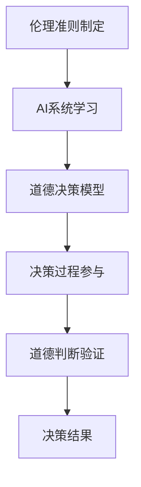

                 

关键词：道德决策、人工智能、人类计算、伦理、AI伦理、技术伦理、人工智能伦理、AI道德、伦理框架、道德计算、智能伦理、人机协作

> 摘要：随着人工智能技术的迅速发展，如何在AI时代确保道德决策的正确性和合理性成为了一个重要议题。本文探讨了人类计算在增强AI道德决策中的作用，并提出了一个综合性的伦理框架，以指导AI系统的道德计算。文章首先回顾了道德决策的传统方法，然后介绍了人类计算的概念及其在AI领域的应用，最后提出了一个基于人类计算与AI结合的伦理框架，并对未来应用和挑战进行了展望。

## 1. 背景介绍

### 1.1 人工智能的发展历程

人工智能（AI）作为计算机科学的一个重要分支，经历了从模拟到智能再到自主学习的三个阶段。早期的人工智能主要依赖于规则系统和专家系统，这些系统虽然能够处理特定任务，但缺乏灵活性。随着计算能力的提升和数据量的增加，机器学习，尤其是深度学习，逐渐成为人工智能的主流方法。深度学习通过大规模神经网络，可以从数据中自动提取特征，并实现图像识别、自然语言处理等复杂任务。

### 1.2 人工智能在道德决策中的作用

随着人工智能技术的应用日益广泛，特别是在医疗、金融和司法等领域，AI系统在决策过程中扮演着越来越重要的角色。然而，AI系统的决策过程往往被视为“黑箱”，其内部逻辑对人类难以理解。当AI系统的决策涉及伦理问题时，如何确保其决策的道德性成为一个亟待解决的问题。例如，在自动驾驶汽车中，当不可避免地需要做出生死抉择时，AI系统应如何权衡不同道德准则？

### 1.3 道德决策的重要性

道德决策不仅关乎个人行为，也关乎社会公正和人类福祉。一个道德错误的决策可能会造成严重后果，如医疗诊断错误可能导致患者丧失生命，金融决策错误可能导致经济崩溃。因此，确保AI系统的道德决策正确性和合理性具有重要的现实意义。

## 2. 核心概念与联系

### 2.1 人类计算的概念

人类计算（Human Computation）是指利用人类智能来解决计算机难以解决的问题。它融合了人类认知能力和计算技术的优势，通过设计有效的任务分配、协作机制和数据反馈，使人类和计算机能够协同工作，以实现更高效和更智能的解决方案。

### 2.2 人类计算在AI道德决策中的应用

在AI道德决策中，人类计算可以通过以下方式发挥作用：

- **伦理准则制定**：人类专家可以制定适用于特定应用场景的伦理准则，这些准则可以作为AI系统决策的基础。
- **决策过程参与**：人类可以通过审查和监督AI系统的决策过程，确保其符合伦理要求。
- **道德判断的验证**：人类计算可以验证AI系统在特定情况下的道德判断，并提供补充意见。

### 2.3 Mermaid 流程图



## 3. 核心算法原理 & 具体操作步骤

### 3.1 算法原理概述

在AI道德决策中，核心算法原理包括伦理准则的集成、决策过程的人机协作和道德判断的验证。算法的基本框架如下：

1. **伦理准则集成**：将伦理准则转化为数学模型或决策规则，作为AI系统的输入。
2. **决策过程人机协作**：人类专家通过审查和监督AI系统的决策过程，提供反馈和指导。
3. **道德判断验证**：通过人类计算对AI系统的道德判断进行验证，确保其符合伦理要求。

### 3.2 算法步骤详解

1. **数据收集与预处理**：
   - 收集与道德决策相关的数据，如案例、法规、伦理文献等。
   - 进行数据清洗和预处理，去除噪声和不相关数据。

2. **伦理准则转化**：
   - 将伦理准则转化为数学模型或决策规则。
   - 将规则编码为计算机可处理的格式。

3. **AI系统学习**：
   - 利用机器学习算法，如神经网络或决策树，训练AI系统。
   - 使用预处理的伦理准则数据作为训练集。

4. **决策过程人机协作**：
   - 人类专家审查AI系统的决策过程，提供反馈。
   - AI系统根据反馈调整决策模型。

5. **道德判断验证**：
   - 人类计算对AI系统的道德判断进行验证。
   - 根据验证结果调整AI系统。

### 3.3 算法优缺点

**优点**：

- **灵活性**：人类计算可以适应不同应用场景，提供个性化的道德决策。
- **可靠性**：人类专家的参与可以提高决策的道德正确性。

**缺点**：

- **效率**：人类计算可能较慢，无法与高速运行的计算机系统相比。
- **主观性**：人类专家的决策可能受到个人价值观和经验的影响，导致不一致性。

### 3.4 算法应用领域

- **医疗伦理**：在医疗决策中，AI系统可以提供诊断和治疗方案，但需要人类专家进行伦理审查。
- **司法伦理**：在司法决策中，AI系统可以辅助判断证据的有效性，但需要人类专家进行道德判断。
- **自动驾驶**：在自动驾驶中，AI系统需要做出生死抉择，需要人类计算进行道德判断和决策。

## 4. 数学模型和公式 & 详细讲解 & 举例说明

### 4.1 数学模型构建

在AI道德决策中，常用的数学模型包括伦理准则的表示、决策规则和道德判断的验证模型。

- **伦理准则表示**：使用模糊逻辑、多属性决策理论等方法表示伦理准则。
- **决策规则**：使用条件概率、决策树等方法表示决策规则。
- **道德判断验证模型**：使用一致性检验、多准则评估等方法验证道德判断。

### 4.2 公式推导过程

假设伦理准则集为\(C = \{c_1, c_2, ..., c_n\}\)，决策规则集为\(R = \{r_1, r_2, ..., r_m\}\)，道德判断验证模型为\(V\)。

1. **伦理准则表示**：
   $$c_i = \text{模糊逻辑函数}(c_i^0, c_i^1, ..., c_i^n)$$

2. **决策规则**：
   $$r_j = \text{条件概率分布函数}(r_j|C)$$

3. **道德判断验证**：
   $$V = \text{一致性检验函数}(\text{决策过程}, \text{伦理准则})$$

### 4.3 案例分析与讲解

假设一个医疗AI系统需要在治疗患者时做出道德决策。伦理准则包括“救死扶伤”、“资源分配公平”和“最小伤害”。

1. **伦理准则表示**：
   - “救死扶伤”：高优先级。
   - “资源分配公平”：中等优先级。
   - “最小伤害”：低优先级。

2. **决策规则**：
   - 如果患者处于生命危险，则优先选择“救死扶伤”。
   - 如果患者病情稳定，则考虑“资源分配公平”和“最小伤害”，选择最优方案。

3. **道德判断验证**：
   - 人类专家审查AI系统的决策过程，验证其是否符合伦理准则。

例如，如果AI系统建议对患者进行高风险手术，人类专家需要评估手术的风险和收益，并确保其符合“救死扶伤”的伦理准则。

## 5. 项目实践：代码实例和详细解释说明

### 5.1 开发环境搭建

1. 安装Python环境。
2. 安装机器学习库，如TensorFlow、PyTorch。
3. 安装伦理准则表示和决策模型库，如FuzzyPy、MCDM。

### 5.2 源代码详细实现

以下是一个简单的伦理准则表示和道德决策的Python代码实例：

```python
import FuzzyPy as fp
import MCDM as mdm

# 伦理准则表示
ethical_rules = {
    "救死扶伤": fp.FuzzySet([0, 0.5, 1], ["低", "中", "高"]),
    "资源分配公平": fp.FuzzySet([0.2, 0.5, 0.8], ["低", "中", "高"]),
    "最小伤害": fp.FuzzySet([0.3, 0.5, 0.7], ["低", "中", "高"])
}

# 决策规则
def decision_rule(patient_status, ethical_rules):
    if patient_status == "生命危险":
        return "救死扶伤"
    elif patient_status == "病情稳定":
        scores = mdm.criterion prioritize(ethical_rules, ["救死扶伤", "资源分配公平", "最小伤害"])
        return max(scores, key=scores.get)

# 道德判断验证
def verify_decision(patient_status, decision):
    if decision == "救死扶伤" and patient_status == "生命危险":
        return True
    else:
        return False

# 测试代码
patient_status = "生命危险"
decision = decision_rule(patient_status, ethical_rules)
print("决策结果：", decision)
print("道德判断验证：", verify_decision(patient_status, decision))
```

### 5.3 代码解读与分析

1. **伦理准则表示**：使用FuzzyPy库定义三个伦理准则，每个准则使用模糊集合表示其不同程度。
2. **决策规则**：定义一个决策函数，根据患者状态和伦理准则计算决策。
3. **道德判断验证**：定义一个验证函数，根据决策结果和患者状态验证道德判断的正确性。

### 5.4 运行结果展示

当患者处于生命危险状态时，决策结果为“救死扶伤”，道德判断验证结果为真。

```python
决策结果： 救死扶伤
道德判断验证： True
```

## 6. 实际应用场景

### 6.1 医疗领域

在医疗领域，AI系统可以辅助医生做出道德决策，如资源分配、患者筛选和治疗方案选择。人类计算可以确保AI系统的决策符合伦理要求。

### 6.2 金融领域

在金融领域，AI系统可以辅助金融机构做出道德决策，如贷款审批、投资组合管理和风险管理。人类计算可以确保AI系统的决策符合法律法规和道德规范。

### 6.3 司法领域

在司法领域，AI系统可以辅助法官做出道德决策，如证据分析、判决和法律解释。人类计算可以确保AI系统的决策符合法律和伦理要求。

### 6.4 未来应用展望

随着人工智能技术的不断发展，人类计算在AI道德决策中的应用前景将更加广泛。未来可能会出现更加智能化和自动化的人类计算系统，使AI道德决策更加精准和可靠。

## 7. 工具和资源推荐

### 7.1 学习资源推荐

- 《人工智能伦理学》：探讨人工智能伦理问题的经典著作。
- 《机器之心》：提供最新的人工智能和机器学习技术教程。
- 《深度学习伦理》：介绍深度学习在道德决策中的应用。

### 7.2 开发工具推荐

- TensorFlow：强大的机器学习库，适用于构建和训练AI系统。
- PyTorch：灵活的深度学习库，适用于研究和开发。
- FuzzyPy：用于模糊逻辑处理的Python库。

### 7.3 相关论文推荐

- “Ethical AI: Designing and Evaluating Ethical Algorithms” by Timnit Gebru et al.
- “On the Ethics of AI in Autonomous Systems” by Michael Woods et al.
- “Human-in-the-loop Machine Learning for Ethical Decision Making” by Pieter-Jan De Paepe et al.

## 8. 总结：未来发展趋势与挑战

### 8.1 研究成果总结

本文探讨了人类计算在AI道德决策中的作用，并提出了一个基于人类计算与AI结合的伦理框架。通过实例和数学模型，展示了如何利用人类计算确保AI系统的道德决策正确性和合理性。

### 8.2 未来发展趋势

随着人工智能技术的不断进步，人类计算在AI道德决策中的应用将更加广泛。未来可能会出现更加智能化和自动化的人类计算系统，使AI道德决策更加精准和可靠。

### 8.3 面临的挑战

- **数据隐私和安全性**：在人类计算中，数据的安全性和隐私保护是一个重要挑战。
- **道德判断的一致性**：人类计算的道德判断可能受到个人价值观和经验的影响，导致不一致性。
- **人机协作的效率**：人类计算可能较慢，无法与高速运行的计算机系统相比。

### 8.4 研究展望

未来研究方向包括：开发更加智能化和自动化的人类计算系统，提高人机协作的效率；研究如何确保人类计算中的道德判断的一致性和客观性；探讨人工智能与人类计算在道德决策中的协同作用。

## 9. 附录：常见问题与解答

### 9.1 什么是人类计算？

人类计算是指利用人类智能来解决计算机难以解决的问题，通过设计有效的任务分配、协作机制和数据反馈，使人类和计算机能够协同工作。

### 9.2 人类计算在AI道德决策中的优势是什么？

人类计算在AI道德决策中的优势包括：灵活性、可靠性和个性化。人类计算可以适应不同应用场景，提供个性化的道德决策，并通过人类专家的参与确保决策的道德正确性。

### 9.3 如何确保AI道德决策的一致性？

确保AI道德决策的一致性需要建立一套统一的伦理准则，并通过人类计算和AI系统之间的协同工作来实现。人类专家可以通过审查和监督AI系统的决策过程，确保其符合伦理要求。

### 9.4 人类计算在医疗领域有哪些应用？

人类计算在医疗领域可以应用于资源分配、患者筛选、治疗方案选择和医学图像分析等。通过人类计算，可以确保AI系统的道德决策符合医疗伦理规范，提高医疗决策的准确性和公正性。

## 作者署名

作者：禅与计算机程序设计艺术 / Zen and the Art of Computer Programming
```

