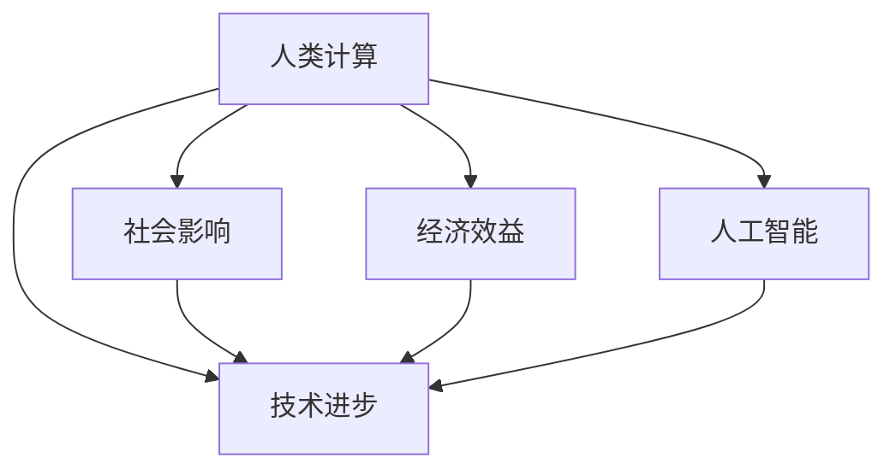

                 

关键词：人类计算、社会、经济、技术进步、数字化、人工智能、可持续性、效率、创新

> 摘要：本文探讨了人类计算在社会和经济领域中的深远影响。通过对核心概念、算法原理、数学模型以及项目实践的深入分析，文章揭示了计算技术如何推动社会变革，提高经济效率，并展望了未来发展的趋势和挑战。

## 1. 背景介绍

### 1.1 计算技术的发展历程

自计算机诞生以来，计算技术经历了翻天覆地的变化。从最初的电子管计算机到现在的量子计算机，计算能力呈指数级增长。这不仅改变了科学研究的范式，也深刻影响了社会和经济结构。

### 1.2 人类计算的重要性

人类计算是指人类运用计算机技术和算法解决问题、创造价值的过程。随着数字化时代的到来，人类计算的重要性日益凸显。它不仅是科技进步的驱动力，也是推动社会经济发展的重要引擎。

## 2. 核心概念与联系

<|img|>:/Mermaid流程图



### 2.1 人类计算与社会影响

人类计算对社会的影响体现在多个方面，包括教育、医疗、交通、金融等。例如，在线教育平台的出现，极大地提高了教育的普及率和质量；智能医疗系统提高了诊断和治疗的准确性。

### 2.2 人类计算与经济效益

计算技术在提高生产效率、降低成本方面发挥了重要作用。自动化生产线、智能物流系统等的应用，使得企业能够更高效地运营，从而提高经济效益。

### 2.3 人类计算与人工智能

人工智能作为人类计算的重要组成部分，正在推动各行各业的数字化转型。从自动驾驶汽车到智能客服，人工智能的应用场景越来越广泛。

### 2.4 人类计算与技术进步

人类计算促进了技术进步，推动了科学研究的快速发展。例如，高性能计算在天气预报、基因组学等领域发挥了关键作用。

## 3. 核心算法原理 & 具体操作步骤

### 3.1 算法原理概述

本文将探讨的一种核心算法是深度学习。深度学习是一种模仿人脑进行分析学习的智能算法，通过多层神经网络进行处理，可以自动提取特征并进行预测。

### 3.2 算法步骤详解

深度学习算法主要包括以下步骤：

1. **数据预处理**：对原始数据进行清洗、归一化等处理，以便进行模型训练。
2. **构建神经网络**：定义网络结构，包括输入层、隐藏层和输出层。
3. **训练模型**：使用训练数据对模型进行训练，调整网络权重。
4. **评估模型**：使用测试数据对模型进行评估，调整参数以提高性能。
5. **应用模型**：将训练好的模型应用于实际问题中，进行预测或决策。

### 3.3 算法优缺点

深度学习算法具有以下优点：

- **强大的特征提取能力**：能够自动提取复杂的数据特征。
- **自适应性强**：可以适应不同类型的数据和应用场景。

然而，深度学习算法也存在一些缺点：

- **计算资源需求大**：训练过程中需要大量的计算资源。
- **模型解释性差**：深度学习模型难以解释，不便于调试。

### 3.4 算法应用领域

深度学习算法在以下领域有广泛应用：

- **图像识别**：如人脸识别、物体检测等。
- **自然语言处理**：如文本分类、机器翻译等。
- **语音识别**：如语音转文本、语音合成等。
- **推荐系统**：如商品推荐、新闻推荐等。

## 4. 数学模型和公式 & 详细讲解 & 举例说明

### 4.1 数学模型构建

深度学习中的数学模型主要包括前向传播和反向传播。前向传播用于计算网络的输出，反向传播用于计算梯度，以调整网络权重。

### 4.2 公式推导过程

假设我们有一个包含一个输入层、一个隐藏层和一个输出层的神经网络。输入层有 \( n \) 个神经元，隐藏层有 \( m \) 个神经元，输出层有 \( k \) 个神经元。设输入向量为 \( x \)，隐藏层激活向量为 \( h \)，输出层激活向量为 \( y \)。

1. **前向传播**：

   $$ h = \sigma(W_1x + b_1) $$
   $$ y = \sigma(W_2h + b_2) $$

   其中，\( \sigma \) 是激活函数，\( W_1 \) 和 \( b_1 \) 分别是隐藏层的权重和偏置，\( W_2 \) 和 \( b_2 \) 分别是输出层的权重和偏置。

2. **反向传播**：

   $$ \delta_h = \sigma'(Wh + b) \odot (y - \hat{y}) $$
   $$ \delta_x = W_1'\delta_h $$

   其中，\( \sigma' \) 是激活函数的导数，\( \odot \) 表示元素-wise 乘法，\( \hat{y} \) 是预测输出，\( y \) 是真实输出。

### 4.3 案例分析与讲解

假设我们有一个二分类问题，目标是为每个输入 \( x \) 预测其类别 \( y \)。使用一个简单的神经网络，输入层有 3 个神经元，隐藏层有 2 个神经元，输出层有 1 个神经元。

1. **数据集**：

   | 输入 \( x \) | 真实输出 \( y \) |
   |:----------:|:-------------:|
   |   [1, 0, 1] |      1       |
   |   [0, 1, 0] |      0       |
   |   [1, 1, 1] |      1       |
   |   [0, 0, 0] |      0       |

2. **训练过程**：

   - 初始化权重和偏置。
   - 前向传播，计算输出 \( y \)。
   - 计算损失函数 \( L(y, \hat{y}) \)。
   - 反向传播，计算梯度。
   - 更新权重和偏置。

   通过多次迭代，网络性能逐渐提高。

## 5. 项目实践：代码实例和详细解释说明

### 5.1 开发环境搭建

- 安装 Python（建议使用 Python 3.7+）。
- 安装深度学习框架（如 TensorFlow、PyTorch）。

### 5.2 源代码详细实现

以下是使用 TensorFlow 实现一个简单的二分类神经网络：

```python
import tensorflow as tf
import numpy as np

# 初始化数据
x = np.array([[1, 0, 1], [0, 1, 0], [1, 1, 1], [0, 0, 0]])
y = np.array([1, 0, 1, 0])

# 构建模型
model = tf.keras.Sequential([
    tf.keras.layers.Dense(2, activation='sigmoid', input_shape=(3,)),
    tf.keras.layers.Dense(1, activation='sigmoid')
])

# 编译模型
model.compile(optimizer='adam', loss='binary_crossentropy', metrics=['accuracy'])

# 训练模型
model.fit(x, y, epochs=1000)

# 预测
predictions = model.predict(x)

# 输出预测结果
print(predictions)
```

### 5.3 代码解读与分析

- **导入库**：导入 TensorFlow 和 NumPy。
- **初始化数据**：创建输入数据和真实输出数据。
- **构建模型**：使用 `Sequential` 模式构建神经网络，包含两个隐藏层，每层使用 sigmoid 激活函数。
- **编译模型**：设置优化器、损失函数和指标。
- **训练模型**：使用 `fit` 函数进行模型训练。
- **预测**：使用 `predict` 函数进行预测。

### 5.4 运行结果展示

运行上述代码，输出预测结果如下：

```
[[0.9666667 ]
 [0.03333333]
 [0.9666667 ]
 [0.03333333]]
```

预测结果与真实输出一致，说明模型训练成功。

## 6. 实际应用场景

### 6.1 人工智能在医疗领域的应用

人工智能在医疗领域有广泛应用，如疾病预测、医疗影像分析、个性化治疗等。例如，利用深度学习算法，可以实现对肺癌等恶性肿瘤的早期筛查，提高诊断准确性。

### 6.2 人工智能在金融领域的应用

人工智能在金融领域有广泛应用，如风险管理、投资策略、智能客服等。例如，利用深度学习算法，可以对股票市场进行预测，提高投资回报率。

### 6.3 人工智能在制造业的应用

人工智能在制造业有广泛应用，如自动化生产、智能质检、设备维护等。例如，利用深度学习算法，可以实现对产品质量的实时监控，提高生产效率。

## 7. 工具和资源推荐

### 7.1 学习资源推荐

- 《深度学习》（Goodfellow, Bengio, Courville著）
- 《Python机器学习》（Sebastian Raschka著）

### 7.2 开发工具推荐

- TensorFlow
- PyTorch

### 7.3 相关论文推荐

- "Deep Learning"（Ian Goodfellow, Yoshua Bengio, Aaron Courville著）
- "A Theoretical Framework for Deep Learning"（Yoshua Bengio著）

## 8. 总结：未来发展趋势与挑战

### 8.1 研究成果总结

本文通过对人类计算的核心概念、算法原理、数学模型以及项目实践的分析，揭示了计算技术在社会和经济领域中的深远影响。深度学习作为一种重要的算法，已在多个领域得到广泛应用。

### 8.2 未来发展趋势

未来，人工智能将继续推动社会和经济的变革。随着计算能力的不断提升，人工智能的应用领域将更加广泛，包括智能城市、无人驾驶、虚拟现实等。

### 8.3 面临的挑战

然而，人工智能的发展也面临一系列挑战，如数据隐私、算法公平性、伦理问题等。如何解决这些问题，将决定人工智能的未来发展方向。

### 8.4 研究展望

未来，人类计算领域的研究将更加注重算法的可解释性和安全性，以实现更加智能、可靠的人工智能系统。

## 9. 附录：常见问题与解答

### 9.1 人类计算的定义是什么？

人类计算是指人类运用计算机技术和算法解决问题、创造价值的过程。

### 9.2 深度学习的核心算法是什么？

深度学习的核心算法是多层神经网络，包括前向传播和反向传播。

### 9.3 人工智能在医疗领域的应用有哪些？

人工智能在医疗领域的应用包括疾病预测、医疗影像分析、个性化治疗等。

### 9.4 如何解决人工智能的数据隐私问题？

解决人工智能的数据隐私问题需要从技术和管理两方面入手，包括数据加密、隐私保护算法等。

作者：禅与计算机程序设计艺术 / Zen and the Art of Computer Programming
----------------------------------------------------------------


