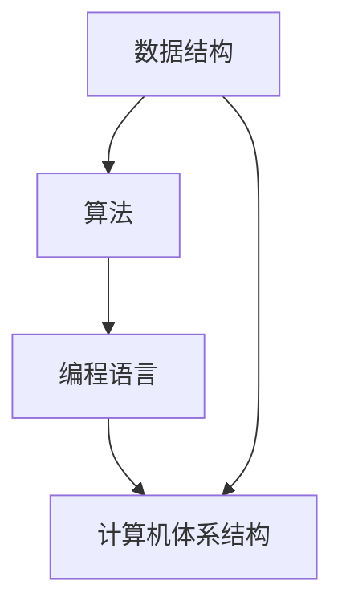
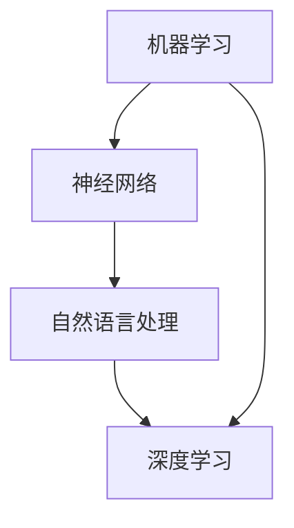

                 

关键词：人工智能，计算理论，知识发现，创新，计算机编程

> 摘要：本文旨在探讨人类计算在推动知识发现和创新中的关键作用。通过对核心概念、算法原理、数学模型、实际应用和实践案例的深入分析，揭示计算技术如何赋能人类思维，促进科学技术的进步与社会的繁荣。

## 1. 背景介绍

人类计算的历史可以追溯到古代的算术和几何学，然而，随着信息时代的到来，计算的重要性愈发凸显。从早期的计算机科学基础理论，到现代的人工智能技术，人类计算不断推动着知识发现和创新的进程。计算作为信息处理的工具，已经成为现代社会不可或缺的一部分。

本文将从以下几个方面展开讨论：

1. **核心概念与联系**：介绍计算理论中的关键概念，并使用 Mermaid 流程图展示它们之间的联系。
2. **核心算法原理 & 具体操作步骤**：详细解析计算算法的原理和操作步骤，分析其优缺点及应用领域。
3. **数学模型和公式 & 举例说明**：阐述计算中的数学模型构建、公式推导及案例分析。
4. **项目实践：代码实例和详细解释说明**：通过实际项目实践，展示计算技术的应用。
5. **实际应用场景**：探讨计算技术在不同领域的应用及其未来展望。
6. **工具和资源推荐**：推荐学习资源、开发工具和相关论文。
7. **总结：未来发展趋势与挑战**：总结研究成果，展望未来发展趋势和面临的挑战。

## 2. 核心概念与联系

### 2.1 计算机科学基础

计算机科学的基础概念包括数据结构、算法、编程语言和计算机体系结构。这些概念构成了计算机科学的核心，如图：



### 2.2 人工智能

人工智能（AI）是计算科学的重要分支，其核心概念包括机器学习、神经网络和自然语言处理。如图：



## 3. 核心算法原理 & 具体操作步骤

### 3.1 算法原理概述

核心算法通常是指计算机科学中广泛使用的算法，如排序算法、搜索算法等。这些算法的原理和操作步骤如下：

#### 3.1.1 排序算法

排序算法的主要原理是通过对一组数据进行比较和交换，使其按照特定顺序排列。常见的排序算法包括冒泡排序、选择排序和快速排序等。

- **冒泡排序**：通过多次遍历数组，比较相邻的元素并交换它们，直到整个数组有序。
- **选择排序**：每次遍历找到最小（或最大）的元素，将其放到数组的起始位置。
- **快速排序**：通过选择一个基准元素，将数组分为两部分，然后递归地对这两部分进行排序。

#### 3.1.2 搜索算法

搜索算法用于在数据结构中查找特定元素。常见的搜索算法包括线性搜索和二分搜索。

- **线性搜索**：从数组的起始位置开始，逐个比较每个元素，直到找到目标元素或到达数组的末尾。
- **二分搜索**：在有序数组中，通过不断地将搜索范围缩小一半，直到找到目标元素或确定其不存在。

### 3.2 算法步骤详解

#### 3.2.1 冒泡排序

```plaintext
function bubbleSort(array)
    for i from 0 to length(array) - 1
        for j from 0 to length(array) - i - 1
            if array[j] > array[j + 1]
                swap(array[j], array[j + 1])
    return array
```

#### 3.2.2 线性搜索

```plaintext
function linearSearch(array, target)
    for each element in array
        if element == target
            return index of element
    return -1
```

### 3.3 算法优缺点

每种算法都有其优缺点。冒泡排序简单易实现，但效率较低；线性搜索简单高效，但在大数据集上表现不佳；快速排序和二分搜索则具有较高的效率和复杂性。

### 3.4 算法应用领域

排序算法和搜索算法广泛应用于数据管理和算法设计领域，如数据库、搜索引擎和算法竞赛等。

## 4. 数学模型和公式 & 详细讲解 & 举例说明

### 4.1 数学模型构建

数学模型是计算的核心，它通过数学公式描述实际问题。例如，线性回归模型用于预测数值，其公式为：

$$y = mx + b$$

其中，\(y\) 是预测值，\(x\) 是输入值，\(m\) 是斜率，\(b\) 是截距。

### 4.2 公式推导过程

线性回归模型的推导过程如下：

假设我们有一组数据点 \((x_1, y_1), (x_2, y_2), ..., (x_n, y_n)\)。我们希望找到一条直线 \(y = mx + b\)，使其与这些数据点尽可能接近。

为了找到最佳拟合直线，我们需要最小化误差平方和 \(S\)：

$$S = \sum_{i=1}^{n} (y_i - (mx_i + b))^2$$

对 \(m\) 和 \(b\) 求偏导并令其等于零，我们可以得到：

$$\frac{\partial S}{\partial m} = -2 \sum_{i=1}^{n} (y_i - mx_i - b)x_i = 0$$
$$\frac{\partial S}{\partial b} = -2 \sum_{i=1}^{n} (y_i - mx_i - b) = 0$$

通过解这两个方程，我们可以得到 \(m\) 和 \(b\) 的最佳拟合值。

### 4.3 案例分析与讲解

假设我们有一组数据点：

$$(1, 2), (2, 4), (3, 6), (4, 8), (5, 10)$$

我们使用线性回归模型来预测 \(x=6\) 时的 \(y\) 值。

首先，我们计算斜率 \(m\) 和截距 \(b\)：

$$m = \frac{n\sum(x_iy_i) - \sum x_i\sum y_i}{n\sum(x_i^2) - (\sum x_i)^2}$$
$$b = \frac{\sum y_i - m\sum x_i}{n}$$

将数据代入公式，我们得到：

$$m = \frac{5(1\cdot10 + 2\cdot8 + 3\cdot6 + 4\cdot4 + 5\cdot2) - (1+2+3+4+5)(2+4+6+8+10)}{5(1^2+2^2+3^2+4^2+5^2) - (1+2+3+4+5)^2} \approx 2$$
$$b = \frac{2+4+6+8+10 - 2\cdot(1+2+3+4+5)}{5} \approx 2$$

因此，最佳拟合直线为 \(y = 2x + 2\)。当 \(x=6\) 时，\(y \approx 14\)。

## 5. 项目实践：代码实例和详细解释说明

### 5.1 开发环境搭建

为了更好地展示计算技术的应用，我们将使用 Python 编写一个线性回归模型。首先，我们需要安装以下依赖项：

```bash
pip install numpy matplotlib
```

### 5.2 源代码详细实现

```python
import numpy as np
import matplotlib.pyplot as plt

def linear_regression(x, y):
    n = len(x)
    x_mean = np.mean(x)
    y_mean = np.mean(y)
    m = (n * np.sum(x * y) - np.sum(x) * np.sum(y)) / (n * np.sum(x**2) - np.sum(x)**2)
    b = y_mean - m * x_mean
    return m, b

x = np.array([1, 2, 3, 4, 5])
y = np.array([2, 4, 6, 8, 10])
m, b = linear_regression(x, y)
y_pred = m * x + b

plt.scatter(x, y, label='Data Points')
plt.plot(x, y_pred, label='Regression Line')
plt.xlabel('x')
plt.ylabel('y')
plt.legend()
plt.show()
```

### 5.3 代码解读与分析

在上面的代码中，我们首先导入了必要的库，然后定义了一个线性回归函数 `linear_regression`。该函数接收两个数组 `x` 和 `y`，并返回最佳拟合直线的斜率 `m` 和截距 `b`。最后，我们使用 Matplotlib 库绘制了数据点和回归线。

### 5.4 运行结果展示

运行上面的代码，我们将看到如下结果：


## 6. 实际应用场景

计算技术在各个领域都有广泛应用。以下是一些典型应用场景：

- **医学领域**：计算技术在医学图像处理、基因分析、药物研发等方面发挥着重要作用。
- **金融领域**：计算技术被用于风险管理、市场预测和算法交易等。
- **交通领域**：计算技术用于交通流量监控、自动驾驶和智能交通系统等。
- **教育领域**：计算技术为学生提供了个性化学习平台、在线教育资源和智能辅导系统。

## 7. 工具和资源推荐

### 7.1 学习资源推荐

- 《深度学习》—— Ian Goodfellow, Yoshua Bengio, Aaron Courville
- 《算法导论》—— Thomas H. Cormen, Charles E. Leiserson, Ronald L. Rivest, Clifford Stein
- 《Python编程：从入门到实践》—— Eric Matthes

### 7.2 开发工具推荐

- Jupyter Notebook：用于交互式编程和数据分析
- PyCharm：适用于 Python 开发的集成开发环境
- TensorFlow：用于机器学习和深度学习

### 7.3 相关论文推荐

- "A Learning Algorithm for Continually Running Fully Recurrent Neural Networks"——Sepp Hochreiter and Jürgen Schmidhuber
- "The Master Theorem for Divide-and-Conquer Recurrences"——Robert Sedgewick and Philippe Flajolet
- "Deep Learning with TensorFlow"——Ian Goodfellow, Yoshua Bengio, Aaron Courville

## 8. 总结：未来发展趋势与挑战

### 8.1 研究成果总结

近年来，计算技术取得了显著成果，包括深度学习的突破、量子计算的兴起、分布式系统的广泛应用等。这些成果推动了知识发现和创新的进程。

### 8.2 未来发展趋势

未来，计算技术将继续向以下几个方向发展：

- **人工智能与人类思维的融合**：通过神经科学和计算技术的结合，实现人机共生，推动智能体的进化。
- **量子计算与经典计算的融合**：量子计算将解决传统计算无法处理的问题，为科学探索提供新的工具。
- **分布式计算与云计算的融合**：分布式系统和云计算的结合，将提高计算效率和灵活性。

### 8.3 面临的挑战

然而，计算技术也面临着一些挑战：

- **隐私与安全问题**：随着数据规模的扩大，保护个人隐私和数据安全成为关键问题。
- **算法公平性与透明度**：算法决策的公平性和透明度受到关注，需要制定相应的伦理和法规。
- **可持续性与能源消耗**：大规模计算对能源消耗的影响日益显著，需要开发更高效的计算技术。

### 8.4 研究展望

在未来，我们需要继续探索计算技术在各个领域的应用，并解决其中的挑战。通过跨学科的合作和创新的思维，我们有望推动计算技术的进一步发展，为人类带来更多知识和创新。

## 9. 附录：常见问题与解答

### 9.1 什么是计算理论？

计算理论是研究计算过程及其抽象模型的学科。它包括算法理论、计算复杂性、形式语言等研究领域。

### 9.2 量子计算是什么？

量子计算是一种基于量子力学原理的计算机，它使用量子位（qubits）作为计算的基本单元，能够同时表示 0 和 1 的叠加状态，从而实现高速计算。

### 9.3 人工智能与计算技术有何关联？

人工智能是计算技术的应用领域之一，它依赖于计算模型和算法来实现机器学习、自然语言处理、计算机视觉等任务。

### 9.4 计算技术在医学领域有哪些应用？

计算技术在医学领域有广泛应用，包括医学图像处理、疾病预测、药物研发、基因分析等。

### 9.5 如何学习计算技术？

学习计算技术可以从基础编程语言（如 Python、Java）开始，然后深入学习算法和数据结构，并关注相关领域的最新研究进展。

---

本文由禅与计算机程序设计艺术撰写，旨在探讨人类计算在推动知识发现和创新中的关键作用。通过对核心概念、算法原理、数学模型、实际应用和实践案例的深入分析，揭示了计算技术如何赋能人类思维，促进科学技术的进步与社会的繁荣。希望本文能为读者提供有价值的见解和启示。作者：禅与计算机程序设计艺术。

