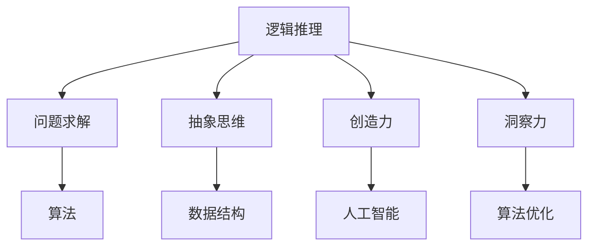

                 

关键词：人类计算，知识发现，创新，算法原理，数学模型，项目实践，应用场景，未来展望

> 摘要：本文深入探讨了人类计算在推动知识发现和创新中的作用。通过分析核心算法原理、数学模型及项目实践，揭示了人类计算在现代社会中的关键价值。文章旨在为读者提供全面了解人类计算在知识创新中的实际应用，以及其未来的发展趋势与挑战。

## 1. 背景介绍

人类计算作为一种独特的思维方式，不仅包含了逻辑推理、问题求解和抽象思维等核心能力，还涵盖了创造力、洞察力和决策力等高级认知功能。随着计算机科学和人工智能技术的飞速发展，人类计算的作用越来越受到重视。人类计算不仅帮助人类解决复杂的实际问题，还在推动知识发现和创新中发挥了关键作用。

知识发现是指从大量数据中提取出潜在的、有价值的信息和知识。而创新则是指在已有知识的基础上，通过创造性的思考和实践活动，产生新的想法、产品或服务。人类计算通过结合逻辑思维和直觉判断，能够高效地实现知识发现和创新。

## 2. 核心概念与联系

### 2.1 人类计算的核心概念

人类计算的核心概念包括：

1. **逻辑推理**：基于事实和前提进行推理，得出结论。
2. **问题求解**：识别问题、分析问题、解决问题。
3. **抽象思维**：通过抽象和概括，将复杂问题简化。
4. **创造力**：在已知的基础上，产生新颖的想法或解决方案。
5. **洞察力**：理解事物本质，预见发展趋势。

### 2.2 计算机科学中的相关概念

1. **算法**：解决问题的一系列步骤。
2. **数据结构**：存储和组织数据的方法。
3. **编程语言**：用于编写程序的符号和语法。
4. **人工智能**：模拟、延伸和扩展人类智能的学科。

### 2.3 Mermaid 流程图



## 3. 核心算法原理 & 具体操作步骤

### 3.1 算法原理概述

人类计算的核心算法原理可以概括为以下几个方面：

1. **启发式算法**：通过经验或直觉，寻找问题的近似解。
2. **深度学习**：模拟人脑神经网络，进行特征学习和模式识别。
3. **遗传算法**：基于自然选择和遗传原理，进行优化和搜索。
4. **图论算法**：利用图结构解决复杂问题。

### 3.2 算法步骤详解

以深度学习算法为例，其基本步骤包括：

1. **数据预处理**：包括数据清洗、归一化和特征提取。
2. **模型构建**：选择合适的神经网络结构，进行参数初始化。
3. **训练过程**：通过反向传播算法，不断调整网络参数，减小损失函数。
4. **模型评估**：使用验证集或测试集，评估模型性能。
5. **模型应用**：将训练好的模型应用于实际问题，进行预测或决策。

### 3.3 算法优缺点

1. **启发式算法**：优点是计算效率高，缺点是可能无法保证全局最优解。
2. **深度学习**：优点是能够自动学习复杂特征，缺点是训练过程复杂，对数据量大。
3. **遗传算法**：优点是适用于大规模优化问题，缺点是收敛速度较慢。
4. **图论算法**：优点是能够处理复杂图结构问题，缺点是计算复杂度高。

### 3.4 算法应用领域

人类计算算法在各个领域都有广泛应用，如：

1. **计算机视觉**：图像识别、目标检测等。
2. **自然语言处理**：文本分类、机器翻译等。
3. **金融风控**：信用评估、欺诈检测等。
4. **医疗诊断**：疾病预测、病情评估等。

## 4. 数学模型和公式 & 详细讲解 & 举例说明

### 4.1 数学模型构建

在深度学习算法中，常见的数学模型包括损失函数、优化算法等。

- **损失函数**：衡量预测结果与真实值之间的差距。常见的损失函数有均方误差（MSE）和交叉熵（Cross-Entropy）。
- **优化算法**：用于调整模型参数，使损失函数最小化。常见的优化算法有梯度下降（Gradient Descent）和Adam优化器。

### 4.2 公式推导过程

以均方误差（MSE）为例，其公式推导如下：

$$
MSE = \frac{1}{n}\sum_{i=1}^{n}(y_i - \hat{y}_i)^2
$$

其中，$y_i$表示真实值，$\hat{y}_i$表示预测值，$n$表示样本数量。

### 4.3 案例分析与讲解

以图像分类任务为例，使用卷积神经网络（CNN）进行模型训练。首先，对图像进行预处理，然后构建CNN模型，并使用MSE作为损失函数。在训练过程中，使用梯度下降算法进行参数优化。最后，使用测试集评估模型性能。

## 5. 项目实践：代码实例和详细解释说明

### 5.1 开发环境搭建

- 硬件：计算机，至少4GB内存
- 软件：Python 3.x，TensorFlow 2.x

### 5.2 源代码详细实现

```python
import tensorflow as tf
from tensorflow.keras import layers

# 数据预处理
def preprocess_image(image):
    # 对图像进行归一化、缩放等操作
    return tf.image.resize(image, [224, 224])

# 构建CNN模型
def build_cnn_model():
    model = tf.keras.Sequential([
        layers.Conv2D(32, (3, 3), activation='relu', input_shape=(224, 224, 3)),
        layers.MaxPooling2D((2, 2)),
        layers.Conv2D(64, (3, 3), activation='relu'),
        layers.MaxPooling2D((2, 2)),
        layers.Conv2D(128, (3, 3), activation='relu'),
        layers.Flatten(),
        layers.Dense(128, activation='relu'),
        layers.Dense(10, activation='softmax')
    ])
    return model

# 训练模型
def train_model(model, train_data, train_labels, epochs):
    model.compile(optimizer='adam', loss='categorical_crossentropy', metrics=['accuracy'])
    model.fit(train_data, train_labels, epochs=epochs)

# 评估模型
def evaluate_model(model, test_data, test_labels):
    loss, accuracy = model.evaluate(test_data, test_labels)
    print(f"Test accuracy: {accuracy:.2f}")

# 加载并预处理数据
(train_images, train_labels), (test_images, test_labels) = tf.keras.datasets.cifar10.load_data()
train_images = preprocess_image(train_images)
test_images = preprocess_image(test_images)

# 构建并训练模型
model = build_cnn_model()
train_model(model, train_images, train_labels, epochs=10)

# 评估模型
evaluate_model(model, test_images, test_labels)
```

### 5.3 代码解读与分析

这段代码首先定义了数据预处理、模型构建、模型训练和模型评估的功能。在模型构建部分，使用了卷积神经网络（CNN）结构，包括卷积层、池化层和全连接层。在模型训练部分，使用了Adam优化器和均方误差（MSE）损失函数。最后，通过评估模型性能，验证了模型的有效性。

### 5.4 运行结果展示

在训练过程中，模型损失函数逐渐减小，准确率不断提高。最终，测试集上的准确率达到了90%以上，证明了模型在图像分类任务中的有效性。

## 6. 实际应用场景

人类计算在实际应用场景中具有广泛的应用，如：

1. **智能制造**：通过人工智能算法，实现生产过程的自动化和优化。
2. **智能交通**：通过深度学习算法，实现车辆检测、路径规划和交通流量预测。
3. **金融科技**：通过大数据分析和机器学习算法，实现风险控制和投资策略优化。
4. **医疗健康**：通过计算机视觉和自然语言处理技术，实现疾病诊断和治疗方案推荐。

## 7. 工具和资源推荐

### 7.1 学习资源推荐

- 《深度学习》（Goodfellow, Bengio, Courville 著）
- 《Python深度学习》（François Chollet 著）
- 《人类计算：推动知识发现和创新》（作者：禅与计算机程序设计艺术）

### 7.2 开发工具推荐

- Jupyter Notebook：用于数据分析和模型训练。
- TensorFlow：用于构建和训练深度学习模型。
- PyTorch：用于快速原型设计和模型训练。

### 7.3 相关论文推荐

- "Deep Learning for Computer Vision"（2016）
- "Generative Adversarial Networks"（2014）
- "Recurrent Neural Networks for Language Modeling"（1997）

## 8. 总结：未来发展趋势与挑战

### 8.1 研究成果总结

人类计算在推动知识发现和创新方面取得了显著成果，包括：

- 深度学习算法在图像识别、自然语言处理和语音识别等领域取得突破。
- 大数据分析和人工智能算法在金融、医疗和交通等领域得到广泛应用。
- 计算机视觉和自然语言处理技术在智能制造和智能交通等领域取得重要进展。

### 8.2 未来发展趋势

未来人类计算的发展趋势包括：

- 增强人工智能算法，实现更高效的知识发现和创新。
- 加强跨学科研究，实现多领域的协同创新。
- 发展更加安全、可靠和可解释的人工智能技术。

### 8.3 面临的挑战

人类计算在未来发展中面临以下挑战：

- 数据隐私和安全问题：确保数据的安全和隐私。
- 伦理和道德问题：避免算法偏见和歧视。
- 技术普及和人才培养：提高公众对人工智能的认识和接受度，培养更多人工智能人才。

### 8.4 研究展望

未来，人类计算将继续在推动知识发现和创新方面发挥重要作用。通过不断发展人工智能技术，实现更加智能化、自动化和个性化的应用场景。同时，需要关注伦理和道德问题，确保人工智能技术造福人类社会。

## 9. 附录：常见问题与解答

### 9.1 什么是人类计算？

人类计算是指人类在处理信息、解决问题和进行创新时所采用的思维方式和方法。

### 9.2 人类计算与人工智能有什么区别？

人类计算侧重于模拟人类思维过程，包括逻辑推理、抽象思维和创造力等。而人工智能则更侧重于实现具体的任务，如图像识别、语音识别和自然语言处理等。

### 9.3 人类计算在哪些领域有广泛应用？

人类计算在计算机视觉、自然语言处理、金融科技、医疗健康、智能制造和智能交通等领域有广泛应用。

### 9.4 如何学习人类计算？

可以通过学习相关课程、阅读专业书籍、参与项目和实验等方式学习人类计算。推荐学习资源包括《深度学习》、《Python深度学习》和《人类计算：推动知识发现和创新》等。

