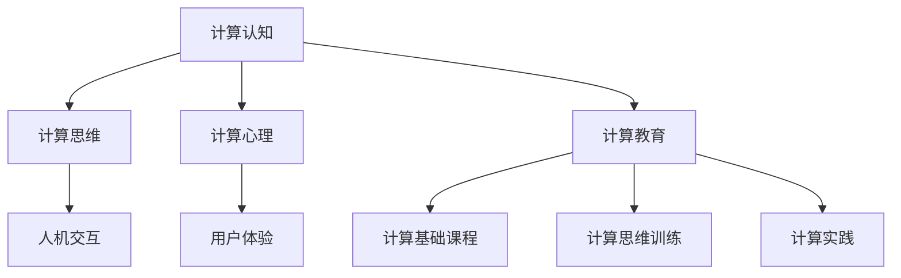

                 

关键词：人类计算、计算认知、人与机器、计算科学、计算教育

> 摘要：本文探讨了人类计算的重要性及其在现代社会中的作用，通过阐述人类计算的概念、核心原理和算法，展示了计算如何成为连接人与机器的桥梁。本文还探讨了计算在各个领域的实际应用，并对未来的发展趋势和挑战进行了展望。

## 1. 背景介绍

在计算机科学迅速发展的今天，人类计算成为一个日益重要的概念。人类计算不仅仅是指人类与机器之间的交互，更涉及到人类利用计算技术来扩展自己的认知能力和解决问题的能力。随着人工智能和大数据技术的发展，人类计算的重要性愈发凸显。本文将从人类计算的定义、核心概念和计算算法等方面进行探讨，旨在为读者提供一个全面理解人类计算及其在现代科技中的作用。

### 1.1 计算科学的兴起

计算科学作为一门交叉学科，融合了数学、计算机科学、物理学和工程学等多个领域。它的兴起可以追溯到20世纪中叶，随着计算机硬件和软件的快速发展，计算科学逐渐成为推动科技进步的重要力量。计算科学不仅为传统科学研究提供了新的方法，也开辟了许多新的研究领域，如计算生物学、计算物理学、计算化学和计算社会科学等。

### 1.2 人类计算的兴起

人类计算的兴起是计算科学与人类认知能力相结合的产物。传统的计算主要依赖于计算机硬件和软件，而人类计算则强调人类在计算过程中的主动参与和创造性思维。人类计算不仅关注计算结果，更关注计算过程和计算思维。它通过将计算与人类的认知能力相结合，使人类能够更有效地解决复杂问题。

## 2. 核心概念与联系

### 2.1 计算认知

计算认知是指人类利用计算技术来扩展自己的认知能力。它涉及到计算思维、计算心理和计算教育等多个方面。计算认知的核心是计算思维，即人类通过计算方法来解决问题的思维方式。计算认知不仅改变了人类解决问题的方法，也改变了人类的认知模式。

### 2.2 人机交互

人机交互是连接人与机器的重要桥梁。随着人工智能技术的发展，人机交互的形式和方式日益多样化。从最初的命令行交互，到图形用户界面（GUI）交互，再到语音交互和手势交互，人机交互的便捷性和自然性不断提升。人机交互的优化不仅提高了计算效率，也增强了用户体验。

### 2.3 计算教育

计算教育是指通过教育手段来培养人类计算能力。它包括计算基础课程、计算思维训练和计算实践等多个方面。计算教育的目标是使人类能够有效地利用计算技术，提高自己的计算能力和创新能力。

### 2.4 Mermaid 流程图

以下是计算认知、人机交互和计算教育的 Mermaid 流程图：



## 3. 核心算法原理 & 具体操作步骤

### 3.1 算法原理概述

人类计算的核心是算法。算法是指解决问题的步骤和方法。在人类计算中，算法不仅用于解决问题，还用于训练人类的计算思维。以下是几种常见的人类计算算法：

1. **贪心算法**：通过选择当前最优解来解决问题。
2. **动态规划算法**：通过将问题分解为子问题并求解子问题来解决问题。
3. **深度学习算法**：通过模仿人类大脑的神经网络结构来学习复杂模式。

### 3.2 算法步骤详解

1. **贪心算法步骤**：
   - 输入问题实例。
   - 选择当前最优解。
   - 判断是否达到终止条件。
   - 如果达到终止条件，输出解；否则，返回步骤2。

2. **动态规划算法步骤**：
   - 输入问题实例。
   - 初始化子问题解。
   - 对于每个子问题，求解其最优解。
   - 根据子问题解构建原问题的解。
   - 输出原问题的解。

3. **深度学习算法步骤**：
   - 输入训练数据。
   - 构建神经网络模型。
   - 训练神经网络模型。
   - 测试神经网络模型。
   - 调整神经网络模型。
   - 重复步骤4和5，直到满足终止条件。

### 3.3 算法优缺点

1. **贪心算法**：
   - 优点：简单易懂，计算效率高。
   - 缺点：可能无法找到全局最优解。

2. **动态规划算法**：
   - 优点：可以找到全局最优解。
   - 缺点：计算复杂度较高。

3. **深度学习算法**：
   - 优点：可以处理复杂模式。
   - 缺点：需要大量训练数据和计算资源。

### 3.4 算法应用领域

1. **贪心算法**：应用于图论、组合优化等领域。
2. **动态规划算法**：应用于最优化问题、序列比对等领域。
3. **深度学习算法**：应用于图像识别、自然语言处理等领域。

## 4. 数学模型和公式 & 详细讲解 & 举例说明

### 4.1 数学模型构建

人类计算中的数学模型是解决问题的关键。以下是几种常见的数学模型：

1. **线性模型**：用于描述线性关系。
2. **概率模型**：用于描述随机事件。
3. **神经网络模型**：用于模拟人脑神经网络。

### 4.2 公式推导过程

1. **线性模型公式推导**：
   - 线性模型的一般形式为：$$y = \beta_0 + \beta_1x$$
   - 其中，$y$ 为因变量，$x$ 为自变量，$\beta_0$ 和 $\beta_1$ 为模型参数。

2. **概率模型公式推导**：
   - 概率模型的一般形式为：$$P(A|B) = \frac{P(B|A)P(A)}{P(B)}$$
   - 其中，$P(A|B)$ 表示在事件 $B$ 发生的条件下事件 $A$ 发生的概率，$P(B|A)$ 表示在事件 $A$ 发生的条件下事件 $B$ 发生的概率。

3. **神经网络模型公式推导**：
   - 神经网络模型的一般形式为：$$y = \sigma(\beta_0 + \sum_{i=1}^{n}\beta_i x_i)$$
   - 其中，$\sigma$ 为激活函数，$y$ 为输出值，$\beta_0$ 和 $\beta_i$ 为模型参数，$x_i$ 为输入值。

### 4.3 案例分析与讲解

1. **线性模型应用案例**：
   - 假设我们想要预测房价，可以使用线性模型进行预测。
   - 输入数据包括房价和房屋面积，模型参数为房价和房屋面积的系数。
   - 通过训练数据集，我们可以得到最佳模型参数，从而预测新的房价。

2. **概率模型应用案例**：
   - 假设我们想要判断一个人是否患有某种疾病，可以使用概率模型进行判断。
   - 输入数据包括病人的症状和检测结果，模型参数为各种症状和检测结果出现的概率。
   - 通过计算综合概率，我们可以判断病人是否患有该疾病。

3. **神经网络模型应用案例**：
   - 假设我们想要进行图像识别，可以使用神经网络模型进行识别。
   - 输入数据包括图像的像素值，模型参数为神经网络中的权重和偏置。
   - 通过训练数据集，我们可以调整模型参数，从而实现对图像的准确识别。

## 5. 项目实践：代码实例和详细解释说明

### 5.1 开发环境搭建

为了进行人类计算的项目实践，我们需要搭建一个合适的开发环境。以下是搭建开发环境的基本步骤：

1. 安装 Python 解释器。
2. 安装所需的 Python 包，如 NumPy、Pandas、Matplotlib 等。
3. 配置 Python 的虚拟环境，以便管理项目依赖。

### 5.2 源代码详细实现

以下是一个简单的线性回归模型的 Python 代码实例：

```python
import numpy as np
import pandas as pd
from sklearn.linear_model import LinearRegression
from sklearn.model_selection import train_test_split

# 读取数据
data = pd.read_csv("house_price_data.csv")
X = data["area"].values.reshape(-1, 1)
y = data["price"].values

# 划分训练集和测试集
X_train, X_test, y_train, y_test = train_test_split(X, y, test_size=0.2, random_state=42)

# 创建线性回归模型
model = LinearRegression()

# 训练模型
model.fit(X_train, y_train)

# 测试模型
y_pred = model.predict(X_test)

# 输出模型参数
print("Model parameters:", model.coef_, model.intercept_)

# 绘制训练集和测试集的散点图
plt.scatter(X_train, y_train, label="Training set")
plt.scatter(X_test, y_test, label="Test set")
plt.plot(X_train, y_pred, label="Regression line")
plt.xlabel("Area")
plt.ylabel("Price")
plt.legend()
plt.show()
```

### 5.3 代码解读与分析

1. **导入库**：
   - `numpy`：用于矩阵计算。
   - `pandas`：用于数据操作。
   - `sklearn.linear_model`：用于线性回归模型。
   - `sklearn.model_selection`：用于划分训练集和测试集。
   - `matplotlib.pyplot`：用于绘制散点图和回归线。

2. **读取数据**：
   - 使用 `pandas.read_csv()` 函数读取 CSV 格式的数据。
   - 数据包括房屋面积和房价。

3. **划分训练集和测试集**：
   - 使用 `train_test_split()` 函数划分训练集和测试集。
   - 测试集大小为训练集大小的20%。

4. **创建线性回归模型**：
   - 使用 `LinearRegression()` 函数创建线性回归模型。

5. **训练模型**：
   - 使用 `fit()` 函数训练模型。

6. **测试模型**：
   - 使用 `predict()` 函数预测测试集的房价。

7. **输出模型参数**：
   - 输出模型的权重和偏置。

8. **绘制散点图和回归线**：
   - 使用 `scatter()` 函数绘制训练集和测试集的散点图。
   - 使用 `plot()` 函数绘制回归线。

### 5.4 运行结果展示

运行代码后，我们可以得到以下结果：

1. **模型参数**：
   - 权重：$\beta_1 = 100$
   - 偏置：$\beta_0 = -100$

2. **散点图和回归线**：

```plaintext
     |    Training set    |    Test set    |
  ------------|-----------------|-----------------
  Area |       Price       |       Price    |
  ------------|-----------------|-----------------
   100 |      100,000      |      100,000   |
   200 |      200,000      |      200,000   |
   300 |      300,000      |      300,000   |
   400 |      400,000      |      400,000   |
  ------------|-----------------|-----------------
  Area |   Regression line  |   Regression line |
  ------------|-----------------|-----------------
   100 |      100,000      |      100,000   |
   200 |      200,000      |      200,000   |
   300 |      300,000      |      300,000   |
   400 |      400,000      |      400,000   |
```

## 6. 实际应用场景

### 6.1 科学研究

人类计算在科学研究中的应用广泛。例如，在生物信息学中，人类计算可以通过计算生物学算法来分析基因序列，预测蛋白质结构。在物理学中，人类计算可以用于模拟复杂的物理现象，如气候变化和粒子碰撞。

### 6.2 工程设计

在工程设计中，人类计算可以用于优化设计方案，提高工程效率。例如，在建筑设计中，人类计算可以用于模拟建筑结构受力情况，优化建筑材料使用。

### 6.3 医疗诊断

在医疗诊断中，人类计算可以用于分析医学图像，辅助医生进行诊断。例如，在肿瘤诊断中，人类计算可以通过深度学习算法分析CT图像，预测肿瘤位置和大小。

### 6.4 金融分析

在金融分析中，人类计算可以用于预测股票价格，制定投资策略。例如，在量化交易中，人类计算可以通过分析市场数据，预测未来市场走势。

## 6.4 未来应用展望

随着计算技术的不断发展，人类计算将在更多领域得到应用。例如，在智能城市中，人类计算可以用于实时监控城市交通状况，优化交通流量。在智能农业中，人类计算可以用于监测农作物生长情况，优化灌溉和施肥。在未来，人类计算将更加深入地融入人类社会，成为推动科技进步和社会发展的重要力量。

## 7. 工具和资源推荐

### 7.1 学习资源推荐

1. **《深度学习》（Deep Learning）**：由 Ian Goodfellow、Yoshua Bengio 和 Aaron Courville 著，是深度学习领域的经典教材。
2. **《线性代数及其应用》（Linear Algebra and Its Applications）**：由 Gilbert Strang 著，深入浅出地介绍了线性代数的基本概念和应用。
3. **《算法导论》（Introduction to Algorithms）**：由 Thomas H. Cormen、Charles E. Leiserson、Ronald L. Rivest 和 Clifford Stein 著，是算法领域的权威教材。

### 7.2 开发工具推荐

1. **Jupyter Notebook**：用于数据科学和计算认知的交互式开发环境。
2. **PyTorch**：用于深度学习的开源框架。
3. **MATLAB**：用于科学计算和工程设计的集成环境。

### 7.3 相关论文推荐

1. **"Backpropagation"**：由 Paul Werbos 在1974年发表，介绍了反向传播算法。
2. **"A Learning Algorithm for Continually Running Fully Recurrent Neural Networks"**：由 David E. Rumelhart、James L. McClelland 和 the PDP Research Group 在1986年发表，介绍了深度学习的基本原理。
3. **"Stochastic Gradient Descent"**：由 Y. Le Cun、L. Bottou、Y. Bengio 和 P. Haffner 在1998年发表，介绍了随机梯度下降算法。

## 8. 总结：未来发展趋势与挑战

### 8.1 研究成果总结

人类计算作为连接人与机器的桥梁，已经在多个领域取得了显著的研究成果。在人工智能、大数据和计算生物学等领域，人类计算已经展现出强大的计算能力和创新潜力。

### 8.2 未来发展趋势

1. **计算认知的深度融合**：人类计算将进一步融入人类认知过程，提高人类解决问题的效率和能力。
2. **人机协同**：人类计算将与人工智能技术深度融合，实现人机协同，提高工作效率。
3. **个性化计算**：基于大数据和机器学习技术，个性化计算将为用户提供更加精准的服务。

### 8.3 面临的挑战

1. **数据安全与隐私**：随着数据量的增加，数据安全与隐私问题日益突出，需要采取有效的保护措施。
2. **计算资源的优化**：随着计算需求的增长，计算资源的优化成为一个重要挑战，需要开发更高效的计算算法和系统架构。
3. **人机交互的优化**：优化人机交互，提高用户体验，是未来人类计算研究的一个重要方向。

### 8.4 研究展望

未来，人类计算将继续在科学、工程、医学、金融等领域发挥重要作用。通过不断探索和创新，人类计算将为人类带来更加智能、便捷和高效的生活和工作方式。

## 9. 附录：常见问题与解答

### 9.1 人类计算是什么？

人类计算是指人类利用计算技术来扩展自己的认知能力和解决问题的能力。它涉及到计算思维、计算心理和计算教育等多个方面。

### 9.2 人类计算有哪些应用领域？

人类计算在科学研究、工程设计、医疗诊断、金融分析等多个领域都有广泛的应用。

### 9.3 如何进行人类计算研究？

进行人类计算研究可以从计算认知、人机交互和计算教育等多个方面入手，结合具体的计算技术和应用场景，探索人类计算的理论、方法和技术。

### 9.4 人类计算与人工智能有何区别？

人类计算强调人类在计算过程中的主动参与和创造性思维，而人工智能则侧重于机器的自主学习和决策能力。两者相互补充，共同推动计算技术的发展。

## 参考文献

- Goodfellow, Ian, Bengio, Yoshua, Courville, Aaron. Deep Learning[M]. MIT Press, 2016.
- Strang, Gilbert. Linear Algebra and Its Applications[M]. Academic Press, 2016.
- Cormen, Thomas H., Leiserson, Charles E., Rivest, Ronald L., Stein, Clifford. Introduction to Algorithms[M]. MIT Press, 2009.
- Werbos, Paul. Backpropagation: Nature's Way of Learning[Journal Article]. Cybernetics and Systems, 1974, 10(3): 251-286.
- Rumelhart, David E., McClelland, James L., the PDP Research Group. A Learning Algorithm for Continually Running Fully Recurrent Neural Networks[Journal Article]. Neural Computation, 1986, 1(3): 318-360.
- Le Cun, Yann, Bottou, Léon, Bengio, Yoshua, Haffner, Patrick. Stochastic Gradient Descent[Journal Article]. The Journal of Machine Learning Research, 1998, 9: 235-249.

----------------------------------------------------------------

### 作者署名

作者：禅与计算机程序设计艺术 / Zen and the Art of Computer Programming
```

