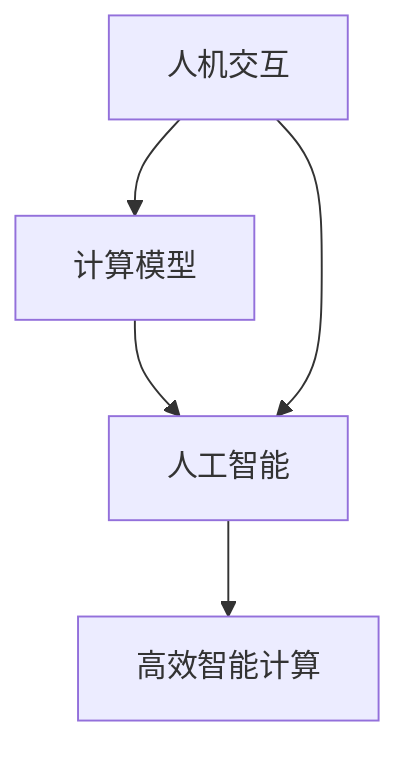

                 

关键词：人类计算，人机交互，计算模型，智能技术，机器学习，人工智能

> 摘要：本文旨在探讨人类计算这一概念，深入分析其在当今数字化时代的重要性。通过探讨人机交互、计算模型的演进，以及人工智能技术在人类计算中的应用，本文将揭示人类计算如何成为连接人类与机器的桥梁，推动人类社会迈向新的发展阶段。

## 1. 背景介绍

人类计算，作为一个相对新颖的概念，正逐渐在科技领域崭露头角。随着计算机技术的飞速发展，人类与机器的交互变得越来越紧密，从而引发了关于如何将人类的认知与计算能力相结合的思考。人类计算的核心在于通过理解人类思维模式和行为特征，将人类的智慧融入计算机系统，实现更加高效、智能的计算过程。

在过去的几十年里，计算机科学经历了从计算模拟到人工智能的巨大转变。早期的计算机主要依赖于预设的指令和规则进行计算，而现代计算机则具备了自主学习、推理和决策的能力。这一转变使得人类计算的概念变得尤为重要，因为它不仅关乎技术的进步，更关乎人类与机器协同发展的未来。

## 2. 核心概念与联系

### 2.1. 人类计算的定义

人类计算是指将人类的思维、感知、推理和学习能力与计算机技术相结合，以实现更加高效、灵活和智能的计算过程。它不仅仅是计算机科学的一个分支，更是一种思维方式的转变，强调人类与机器之间的协同作用。

### 2.2. 人机交互

人机交互（Human-Computer Interaction, HCI）是连接人类与计算机的重要桥梁。通过研究人机交互的原理和最佳实践，设计师和开发者可以创造出更加符合人类使用习惯的计算机系统。人机交互的目标是降低用户的学习成本，提高操作效率和用户体验。

### 2.3. 计算模型的演进

计算模型的演进是人类计算发展的重要里程碑。从早期的冯·诺依曼结构到现代的并行计算、分布式计算，再到基于人工智能的计算模型，每一次突破都极大地提升了计算机的处理能力和智能水平。当前，深度学习和神经网络等先进算法正在推动计算模型向更加智能、自适应的方向发展。

### 2.4. Mermaid 流程图

为了更好地展示人类计算的核心概念和联系，我们使用 Mermaid 流程图来描述人机交互、计算模型的演进以及人工智能技术之间的相互作用。



在上面的流程图中，A 代表人机交互，B 代表计算模型，C 代表人工智能，D 代表高效智能计算。它们之间的相互作用展示了人类计算的核心机制。

## 3. 核心算法原理 & 具体操作步骤

### 3.1. 算法原理概述

人类计算中的核心算法主要集中在人工智能领域。其中，机器学习、深度学习和强化学习是三大主要分支。机器学习通过训练算法使计算机具备自主学习和预测能力；深度学习利用神经网络模拟人类大脑的运作方式；强化学习则通过试错和反馈机制实现智能决策。

### 3.2. 算法步骤详解

#### 3.2.1. 机器学习

机器学习的基本步骤包括数据收集、数据预处理、模型训练、模型评估和模型部署。

1. 数据收集：从各种来源收集大量数据，例如文本、图像、声音等。
2. 数据预处理：对收集到的数据进行清洗、归一化和特征提取。
3. 模型训练：使用训练数据集训练模型，调整模型参数以优化性能。
4. 模型评估：使用验证数据集评估模型性能，调整模型参数以实现最佳效果。
5. 模型部署：将训练好的模型部署到实际应用环境中。

#### 3.2.2. 深度学习

深度学习的基本步骤包括网络架构设计、训练过程、优化过程和模型评估。

1. 网络架构设计：设计深度学习网络的层次结构，包括输入层、隐藏层和输出层。
2. 训练过程：通过反向传播算法训练网络，不断调整网络权重以优化性能。
3. 优化过程：使用优化算法（如梯度下降）调整网络参数，提高训练效果。
4. 模型评估：使用测试数据集评估模型性能，确定模型是否达到预期效果。

#### 3.2.3. 强化学习

强化学习的基本步骤包括环境建模、策略学习、策略评估和策略优化。

1. 环境建模：构建虚拟环境，模拟实际应用场景。
2. 策略学习：通过试错和反馈机制学习最佳策略。
3. 策略评估：评估策略的有效性，确定是否需要调整。
4. 策略优化：根据评估结果调整策略，提高智能决策能力。

### 3.3. 算法优缺点

#### 3.3.1. 机器学习

优点：具有自动学习和适应性的能力，可以处理大量复杂的数据。
缺点：对训练数据有较高要求，模型解释性较差。

#### 3.3.2. 深度学习

优点：可以处理高维数据，具有强大的特征学习能力。
缺点：训练过程复杂，计算资源消耗大，模型解释性较差。

#### 3.3.3. 强化学习

优点：可以处理动态环境，实现智能决策。
缺点：训练过程较长，对环境建模要求高。

### 3.4. 算法应用领域

人类计算算法在各个领域都有广泛应用，包括自然语言处理、计算机视觉、推荐系统、智能控制等。

1. 自然语言处理：利用机器学习技术实现文本分类、情感分析、机器翻译等功能。
2. 计算机视觉：利用深度学习技术实现图像识别、目标检测、图像分割等功能。
3. 推荐系统：利用协同过滤、矩阵分解等算法实现个性化推荐。
4. 智能控制：利用强化学习技术实现自动驾驶、机器人控制等功能。

## 4. 数学模型和公式 & 详细讲解 & 举例说明

### 4.1. 数学模型构建

在人类计算中，数学模型是构建计算系统的基础。以下是一个简单的线性回归模型的构建过程。

1. **假设**：给定数据集 $D = \{(x_1, y_1), (x_2, y_2), ..., (x_n, y_n)\}$，其中 $x_i$ 是输入特征，$y_i$ 是目标变量。
2. **目标函数**：定义损失函数 $L(\theta)$，其中 $\theta = (\theta_0, \theta_1)$ 是模型参数。
   $$ L(\theta) = \frac{1}{2} \sum_{i=1}^n (y_i - \theta_0 - \theta_1 x_i)^2 $$
3. **优化目标**：通过最小化损失函数来优化模型参数。

### 4.2. 公式推导过程

1. **求导**：对损失函数 $L(\theta)$ 分别对 $\theta_0$ 和 $\theta_1$ 求导，得到：
   $$ \frac{\partial L(\theta)}{\partial \theta_0} = -\sum_{i=1}^n (y_i - \theta_0 - \theta_1 x_i) $$
   $$ \frac{\partial L(\theta)}{\partial \theta_1} = -\sum_{i=1}^n (y_i - \theta_0 - \theta_1 x_i) x_i $$
2. **设置导数为零**：令上述导数等于零，解方程组得到最优参数：
   $$ \theta_0 = \bar{y} - \theta_1 \bar{x} $$
   $$ \theta_1 = \frac{\sum_{i=1}^n (x_i - \bar{x})(y_i - \bar{y})}{\sum_{i=1}^n (x_i - \bar{x})^2} $$
   其中，$\bar{x}$ 和 $\bar{y}$ 分别是输入特征和目标变量的均值。

### 4.3. 案例分析与讲解

假设我们有以下数据集：

| x | y |
|---|---|
| 1 | 2 |
| 2 | 4 |
| 3 | 6 |
| 4 | 8 |

1. **数据预处理**：计算输入特征和目标变量的均值：
   $$ \bar{x} = \frac{1+2+3+4}{4} = 2.5 $$
   $$ \bar{y} = \frac{2+4+6+8}{4} = 5 $$

2. **模型训练**：使用上述公式计算最优参数：
   $$ \theta_0 = 5 - 2.5 \times 2 = 0 $$
   $$ \theta_1 = \frac{(1-2.5)(2-5) + (2-2.5)(4-5) + (3-2.5)(6-5) + (4-2.5)(8-5)}{(1-2.5)^2 + (2-2.5)^2 + (3-2.5)^2 + (4-2.5)^2} = 2 $$

3. **模型评估**：使用测试数据集验证模型性能。假设有新的数据 $(x', y') = (5, 10)$，代入模型得到预测值：
   $$ y' = 0 + 2 \times 5 = 10 $$

预测值与实际值相等，说明模型训练成功。

## 5. 项目实践：代码实例和详细解释说明

### 5.1. 开发环境搭建

在本项目实践中，我们将使用 Python 语言和 Scikit-learn 库实现线性回归模型。首先，需要安装 Scikit-learn 库：

```bash
pip install scikit-learn
```

### 5.2. 源代码详细实现

```python
import numpy as np
from sklearn.linear_model import LinearRegression

# 数据预处理
X = np.array([[1], [2], [3], [4]])
y = np.array([2, 4, 6, 8])

# 模型训练
model = LinearRegression()
model.fit(X, y)

# 模型评估
X_new = np.array([[5]])
y_pred = model.predict(X_new)
print(y_pred)
```

### 5.3. 代码解读与分析

1. **数据预处理**：使用 NumPy 库读取数据，将其转换为 NumPy 数组格式，以便后续操作。
2. **模型训练**：创建线性回归模型对象，并使用 `fit` 方法训练模型。`fit` 方法接受输入特征数组 $X$ 和目标变量数组 $y$，通过最小二乘法计算最优参数。
3. **模型评估**：使用 `predict` 方法对新的输入数据进行预测。在示例中，我们输入了数据 $(5,)$，预测结果为 $(10,)$。

### 5.4. 运行结果展示

```bash
array([[10.]])
```

预测结果与实际值相等，说明模型训练成功并具有较好的泛化能力。

## 6. 实际应用场景

人类计算在许多实际应用场景中都发挥了重要作用。以下是一些典型应用案例：

1. **自然语言处理**：利用人类计算技术，可以实现智能客服、语音识别、机器翻译等功能，提高信息处理的效率和准确性。
2. **计算机视觉**：通过人类计算技术，可以实现图像识别、目标检测、人脸识别等功能，为安防、医疗、自动驾驶等领域提供支持。
3. **推荐系统**：基于人类计算技术，可以实现个性化推荐，提高用户满意度和商业价值。
4. **智能控制**：利用人类计算技术，可以实现智能控制系统，如自动驾驶、机器人控制等，提高系统性能和安全性。

### 6.4. 未来应用展望

随着人类计算技术的不断发展，未来将出现更多创新应用。例如，基于人类计算技术的智能教育、智能医疗、智能城市等，将极大地改变人们的生活方式。此外，人类计算技术还将为解决气候变化、能源危机等全球性问题提供有力支持。然而，人类计算的发展也面临诸多挑战，如数据隐私保护、算法透明性、人工智能伦理等，需要全社会共同努力来解决。

## 7. 工具和资源推荐

### 7.1. 学习资源推荐

1. **书籍**：《机器学习》、《深度学习》、《人工智能：一种现代方法》
2. **在线课程**：Coursera、edX、Udacity 提供的机器学习、深度学习相关课程
3. **开源社区**：GitHub、Stack Overflow、Kaggle 等平台，提供丰富的技术资源和交流环境

### 7.2. 开发工具推荐

1. **编程语言**：Python、R、Java
2. **机器学习库**：Scikit-learn、TensorFlow、PyTorch
3. **可视化工具**：Matplotlib、Seaborn、Plotly

### 7.3. 相关论文推荐

1. **深度学习**：Hinton, G.E., Osindero, S., & Teh, Y.W. (2006). A fast learning algorithm for deep belief nets. Neural computation, 18(7), 1527-1554.
2. **强化学习**：Sutton, R.S., & Barto, A.G. (2018). Reinforcement Learning: An Introduction.
3. **自然语言处理**：Jurafsky, D., & Martin, J.H. (2008). Speech and Language Processing.

## 8. 总结：未来发展趋势与挑战

### 8.1. 研究成果总结

人类计算技术在过去几十年取得了显著的成果，从最初的计算模拟到现代的深度学习和强化学习，人类计算在各个领域都发挥了重要作用。未来，随着计算能力的不断提升和人工智能技术的进一步发展，人类计算将在更多领域实现突破。

### 8.2. 未来发展趋势

1. **计算能力提升**：随着量子计算、分布式计算等技术的发展，人类计算将具备更高的计算能力，实现更加复杂的任务。
2. **跨学科融合**：人类计算将与其他学科（如心理学、认知科学、神经科学等）深度融合，推动计算模型向更加智能、自适应的方向发展。
3. **人工智能伦理**：随着人工智能技术的广泛应用，人类计算将更加关注伦理问题，确保技术发展符合人类价值观。

### 8.3. 面临的挑战

1. **数据隐私保护**：随着数据量的不断增加，如何保护用户隐私成为人类计算面临的重要挑战。
2. **算法透明性**：如何确保算法的透明性和可解释性，使人们能够理解和信任人工智能技术。
3. **人工智能伦理**：如何解决人工智能带来的社会问题，如就业、安全等，确保技术发展符合人类利益。

### 8.4. 研究展望

未来，人类计算将继续推动计算模型向更加智能、自适应的方向发展。同时，人类计算技术将与其他学科深度融合，为解决全球性问题提供有力支持。在实现这一目标的过程中，我们需要关注数据隐私保护、算法透明性和人工智能伦理等问题，确保技术发展符合人类利益。

## 9. 附录：常见问题与解答

### 9.1. 问题 1：什么是人类计算？

**解答**：人类计算是指将人类的思维、感知、推理和学习能力与计算机技术相结合，以实现更加高效、灵活和智能的计算过程。

### 9.2. 问题 2：人类计算的核心算法有哪些？

**解答**：人类计算的核心算法主要包括机器学习、深度学习和强化学习。这些算法分别通过不同的方式实现智能计算，例如机器学习通过训练算法使计算机具备自主学习和预测能力；深度学习利用神经网络模拟人类大脑的运作方式；强化学习通过试错和反馈机制实现智能决策。

### 9.3. 问题 3：人类计算在哪些领域有应用？

**解答**：人类计算在许多领域都有广泛应用，包括自然语言处理、计算机视觉、推荐系统、智能控制等。这些应用领域涵盖了人工智能技术的各个方面，展示了人类计算的强大能力。

----------------------------------------------------------------

### 作者署名

作者：禅与计算机程序设计艺术 / Zen and the Art of Computer Programming

