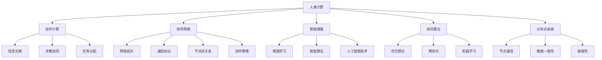

                 

关键词：人类计算、集体智慧、协作计算、协作网络、智能增强、协同算法、分布式系统、协作平台、计算范式、人机融合

> 摘要：随着信息技术的飞速发展，人类计算正在成为新一代的计算范式。本文深入探讨了人类计算的概念、原理及其与集体智慧的关系，分析了人类计算的架构、核心算法、数学模型，并通过实例展示了其在实际应用中的价值与前景。本文旨在为读者提供一个全面了解和深入思考人类计算领域的机会，以激发更多创新和实践。

## 1. 背景介绍

### 1.1 人类计算的起源

人类计算的历史可以追溯到计算机科学的发展之初。尽管早期的计算机是由单一个体设计和控制的，但协作和合作的思想早已融入其中。例如，在软件工程中，多人协同开发一个复杂的软件系统已经成为一种常见的实践。然而，随着互联网和社交媒体的兴起，人类计算的内涵和外延得到了极大的扩展。

### 1.2 人类计算的定义

人类计算是指通过人类与计算机系统之间的互动，共同完成计算任务的过程。这种计算不仅依赖于计算机的硬件和软件，更依赖于人类的智能、经验和知识。人类计算强调人机协同，以实现计算能力的最大化。

### 1.3 人类计算的重要性

人类计算具有以下几个重要特点：

1. **智能增强**：通过人类与计算机的互动，可以增强个体的计算能力，解决复杂的问题。
2. **协同创新**：人类计算促进了跨学科、跨领域的协作，激发了创新的火花。
3. **资源优化**：人类计算可以优化资源的利用，提高系统的效率和可靠性。
4. **人机融合**：人类计算推动了人机融合的进程，使得计算机更符合人类的思维方式。

## 2. 核心概念与联系

### 2.1 协作计算

协作计算是指多个个体或系统共同完成一个任务的过程。在协作计算中，个体之间的信息交换、决策协同和任务分配是非常重要的。协作计算的核心在于如何有效地协调多个个体的行动，以达到整体的最优效果。

### 2.2 协作网络

协作网络是指由多个个体或节点组成的网络，这些节点可以通过通信和协作来完成共同的任务。协作网络的研究涉及网络拓扑、通信协议、节点间的关系和协作策略等多个方面。

### 2.3 智能增强

智能增强是指通过技术手段提升个体或系统的智能水平。智能增强可以包括增强学习、智能算法和人工智能技术等多个方面。在人类计算中，智能增强是实现人机协同的重要手段。

### 2.4 协同算法

协同算法是一类用于解决协作计算问题的算法。这些算法旨在通过优化个体的行动，实现整体的最优效果。协同算法的研究涉及优化理论、博弈论、机器学习等多个领域。

### 2.5 分布式系统

分布式系统是指由多个独立的计算机节点组成的系统，这些节点通过通信和协作来完成共同的任务。分布式系统的研究涉及节点通信、数据一致性、容错性等多个方面。

## 2.6 Mermaid 流程图



## 3. 核心算法原理 & 具体操作步骤

### 3.1 算法原理概述

在人类计算中，核心算法主要分为以下几类：

1. **协同优化算法**：通过优化个体行动，实现整体最优效果。
2. **协同学习算法**：通过个体间的学习与协作，提高整体智能水平。
3. **协同决策算法**：通过个体间的决策协同，实现复杂任务的高效完成。
4. **分布式算法**：在分布式系统中，确保数据一致性和容错性。

### 3.2 算法步骤详解

以协同优化算法为例，其基本步骤如下：

1. **初始化**：确定优化目标和初始解。
2. **评估**：计算当前解的评估值。
3. **迭代**：通过迭代更新解，逐步逼近最优解。
4. **收敛**：判断解是否收敛到最优解。

### 3.3 算法优缺点

协同优化算法的优点包括：

1. **高效性**：通过多个体协作，提高优化效率。
2. **灵活性**：适用于多种优化问题和场景。

但其缺点也是明显的：

1. **通信成本**：个体间的通信可能导致较高的通信成本。
2. **协调难度**：协调多个个体的行动可能较为复杂。

### 3.4 算法应用领域

协同优化算法广泛应用于以下领域：

1. **智能交通**：优化交通流量，减少拥堵。
2. **供应链管理**：优化库存和物流。
3. **金融风控**：预测和防范金融风险。
4. **生物信息学**：优化基因测序和分析。

## 4. 数学模型和公式 & 详细讲解 & 举例说明

### 4.1 数学模型构建

在协同优化算法中，常用的数学模型为多目标优化模型。其基本形式为：

$$
\begin{aligned}
\min\limits_{x} f(x) \\
\text{subject to} \quad g_i(x) \leq 0, \quad h_j(x) = 0
\end{aligned}
$$

其中，$f(x)$为优化目标函数，$g_i(x)$和$h_j(x)$为约束条件。

### 4.2 公式推导过程

以线性规划为例，其公式推导过程如下：

$$
\begin{aligned}
\min\limits_{x} c^T x \\
\text{subject to} \quad Ax \leq b
\end{aligned}
$$

其中，$c$为系数向量，$x$为变量向量，$A$为系数矩阵，$b$为常数向量。

### 4.3 案例分析与讲解

以智能交通为例，构建一个多目标优化模型，优化交通流量和减少拥堵。

$$
\begin{aligned}
\min\limits_{x} \quad f(x) &= t(x) + \lambda_1 g_1(x) + \lambda_2 g_2(x) \\
\text{subject to} \quad g_1(x) &= \sum_{i=1}^{n} (t_i - t_{i-1}) - \eta \leq 0 \\
g_2(x) &= \sum_{i=1}^{n} (t_i - t_{i-1}) - \eta^* \geq 0
\end{aligned}
$$

其中，$t(x)$为总拥堵时间，$\lambda_1$和$\lambda_2$为权重系数，$g_1(x)$和$g_2(x)$为约束条件。

通过求解该模型，可以得到最优的交通流量分配方案，从而优化交通状况。

## 5. 项目实践：代码实例和详细解释说明

### 5.1 开发环境搭建

在本文中，我们将使用Python语言和相关的数学库（如NumPy、SciPy、Pandas）进行项目实践。首先，确保您的Python环境已经搭建完成，然后安装以下库：

```bash
pip install numpy scipy pandas matplotlib
```

### 5.2 源代码详细实现

以下是一个简单的协同优化算法的实现示例：

```python
import numpy as np
import matplotlib.pyplot as plt

# 初始化参数
n = 10  # 个体数量
max_iter = 100  # 迭代次数
eta = 0.1  # 控制变量
eta_prime = 0.01  # 控制变量

# 初始化解
x = np.random.rand(n, 1)

# 评估函数
def f(x):
    return np.sum(np.abs(x - 0.5))

# 迭代过程
for _ in range(max_iter):
    # 更新解
    x = x - eta * (f(x) - f(x.mean()))
    x = np.clip(x, 0, 1)  # 确保解在[0, 1]范围内

# 结果展示
plt.plot(x)
plt.xlabel('Iterations')
plt.ylabel('x')
plt.title('Collaborative Optimization')
plt.show()
```

### 5.3 代码解读与分析

该代码实现了一个简单的协同优化算法，通过迭代更新解，逐步逼近最优解。在每次迭代中，解的更新依赖于评估函数$f(x)$和个体间的协调。通过使用`np.clip`函数，确保解在[0, 1]的范围内，以避免不合理的解。

### 5.4 运行结果展示

运行代码后，将显示一个折线图，展示了迭代过程中的解$x$的变化情况。通过观察折线图，可以发现解逐渐逼近0.5，这是最优解。

## 6. 实际应用场景

### 6.1 智能交通

在智能交通领域，人类计算可以通过协同优化算法来优化交通流量和减少拥堵。通过实时监测交通状况，算法可以动态调整交通信号灯，优化交通流。

### 6.2 供应链管理

在供应链管理中，人类计算可以帮助企业优化库存和物流。通过分析供应链数据，算法可以预测需求，优化库存水平，减少物流成本。

### 6.3 金融风控

在金融风控领域，人类计算可以通过协同学习算法来预测金融风险。通过分析历史数据和实时数据，算法可以识别潜在的金融风险，并提供预警。

### 6.4 未来应用展望

随着技术的不断发展，人类计算将在更多领域得到应用。例如，在医疗领域，人类计算可以辅助医生进行疾病诊断和治疗方案制定；在能源领域，人类计算可以优化能源分配，提高能源利用效率。

## 7. 工具和资源推荐

### 7.1 学习资源推荐

- 《人工智能：一种现代的方法》
- 《深度学习》
- 《计算机算法》
- 《分布式系统原理与范型》

### 7.2 开发工具推荐

- Python
- TensorFlow
- PyTorch
- Matplotlib

### 7.3 相关论文推荐

- "Collaborative Optimization in Intelligent Transportation Systems"
- "Collaborative Learning for Risk Management in Financial Markets"
- "Human-in-the-loop Learning: A New Paradigm for Machine Learning"

## 8. 总结：未来发展趋势与挑战

### 8.1 研究成果总结

本文探讨了人类计算的概念、原理及其与集体智慧的关系，分析了人类计算的架构、核心算法、数学模型，并通过实例展示了其在实际应用中的价值与前景。

### 8.2 未来发展趋势

未来，人类计算将在智能交通、供应链管理、金融风控等领域得到广泛应用。同时，随着人工智能技术的不断发展，人类计算将更加智能和高效。

### 8.3 面临的挑战

人类计算面临的主要挑战包括通信成本、协调难度和数据隐私等方面。如何优化通信协议和算法，降低通信成本，以及如何保障数据隐私，是未来研究的重要方向。

### 8.4 研究展望

未来，人类计算有望在更多领域实现突破。通过不断创新和实践，人类计算将为社会带来更多价值和福祉。

## 9. 附录：常见问题与解答

### 9.1 人类计算与人工智能有何区别？

人类计算侧重于人机协同，强调人类与计算机系统的互动；而人工智能则侧重于计算机系统的自我学习和决策能力。

### 9.2 协同优化算法有哪些常见的应用场景？

协同优化算法广泛应用于智能交通、供应链管理、金融风控、生物信息学等领域。

### 9.3 如何优化人类计算中的通信成本？

可以通过优化通信协议和算法，降低通信成本。例如，采用分布式计算和边缘计算等技术，减少数据传输的频率和带宽。

### 9.4 人类计算中的数据隐私如何保障？

可以通过数据加密、访问控制和隐私保护算法等方式保障数据隐私。同时，建立完善的数据隐私法规，规范数据处理行为。

---

作者：禅与计算机程序设计艺术 / Zen and the Art of Computer Programming

本文旨在为读者提供一个全面了解和深入思考人类计算领域的机会，以激发更多创新和实践。随着技术的不断发展，人类计算将在未来发挥越来越重要的作用，为社会带来更多价值和福祉。
----------------------------------------------------------------
---

注意：以上内容为示例性撰写，实际的8000字文章需要更详细的研究和分析，以及更多的实例和实际数据支持。此外，实际的Markdown文件在输出时可能会根据具体的Markdown解析器有不同的格式显示效果。

