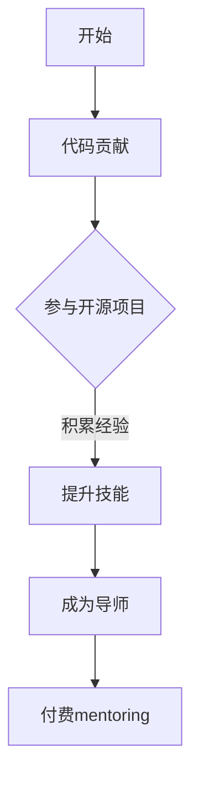

                 

关键词：程序员，代码贡献，付费mentoring，导师之路，职业发展

> 摘要：本文旨在探讨程序员如何通过代码贡献逐步发展为付费mentoring导师，分享职业发展的路径、技能提升策略以及如何成为一名成功的导师。

## 1. 背景介绍

随着全球互联网和技术的快速发展，编程已经成为了现代社会中不可或缺的技能。许多程序员希望通过自己的专业知识和经验，帮助他人成长并回馈社区。而付费mentoring作为一种新兴的职业模式，正逐渐受到更多程序员的关注。本文将探讨程序员如何从代码贡献起步，逐步发展为付费mentoring导师，以及在这个过程中所需掌握的技能和策略。

## 2. 核心概念与联系

为了更好地理解程序员的职业发展路径，我们首先需要明确几个核心概念：

- **代码贡献**：指程序员为开源项目或其他项目编写代码，并提供帮助和支持的行为。
- **开源项目**：由一群志愿者共同维护和开发的项目，其源代码可以自由获取和修改。
- **mentoring**：指资深人士对新手或同行进行指导、培训和激励的过程。
- **付费mentoring**：指通过付费方式，程序员为他人提供个性化的指导、培训和专业建议。

以下是一个简化的 Mermaid 流程图，展示了程序员职业发展的主要路径：



### 2.1 代码贡献

代码贡献是程序员成长的起点。通过为开源项目或团队贡献代码，程序员不仅可以提升自己的编程技能，还能积累宝贵的团队合作经验。此外，代码贡献还能帮助程序员建立个人品牌，扩大职业网络。

### 2.2 参与开源项目

参与开源项目是代码贡献的一种形式。程序员可以通过开源项目了解业界最佳实践，学习前沿技术，并与其他开发者交流合作。参与开源项目还能为程序员带来更多的机会，如技术演讲、论文发表和商业合作。

### 2.3 提升技能

通过代码贡献和参与开源项目，程序员可以积累丰富的实践经验。然而，要成为一名优秀的导师，程序员还需要不断提升自己的技能，包括编程语言、框架、工具和算法等。

### 2.4 成为导师

成为一名导师需要程序员具备丰富的经验和深厚的专业知识。导师不仅要能够解答问题，还要能够引导他人找到解决问题的方法。此外，导师还需具备良好的沟通能力和人际交往技巧。

### 2.5 付费mentoring

付费mentoring是导师职业发展的一个重要阶段。通过为他人提供个性化的指导和支持，程序员不仅可以实现经济收益，还能实现个人价值。同时，付费mentoring也为程序员带来了更多的发展机会，如开设线上课程、撰写技术书籍和演讲等。

## 3. 核心算法原理 & 具体操作步骤

### 3.1 算法原理概述

在程序员职业发展的过程中，算法原理扮演着至关重要的角色。算法是解决问题的一系列步骤，它决定了程序的效率、可扩展性和可维护性。以下是一个简化的算法原理概述：

- **问题定义**：明确要解决的问题和目标。
- **数据结构**：选择合适的数据结构存储和处理数据。
- **算法设计**：根据问题特点设计解决问题的算法。
- **代码实现**：将算法转换为可运行的代码。
- **测试和优化**：对代码进行测试和优化，确保其正确性和效率。

### 3.2 算法步骤详解

以下是算法步骤的详细说明：

#### 3.2.1 问题定义

在解决问题之前，程序员需要明确问题的定义和目标。这有助于确定解决问题的关键点和优先级。

#### 3.2.2 数据结构选择

根据问题特点，程序员需要选择合适的数据结构存储和处理数据。常见的数据结构包括数组、链表、栈、队列、树、图等。

#### 3.2.3 算法设计

算法设计是解决问题的关键步骤。程序员需要根据问题特点和已有知识，设计一种有效的算法。常见算法设计方法包括贪心算法、动态规划、分治算法、回溯算法等。

#### 3.2.4 代码实现

将算法设计转换为可运行的代码。在实现过程中，程序员需要注意代码的可读性、可维护性和可扩展性。

#### 3.2.5 测试和优化

对代码进行测试，确保其正确性和效率。测试方法包括单元测试、集成测试和性能测试等。在测试过程中，程序员需要不断优化代码，提高其性能和可维护性。

### 3.3 算法优缺点

每种算法都有其优缺点。以下是几种常见算法的优缺点：

- **贪心算法**：简单高效，但可能无法保证最优解。
- **动态规划**：适用于复杂问题，但计算复杂度高。
- **分治算法**：适用于大规模问题，但可能存在重复计算。
- **回溯算法**：简单直观，但可能需要大量计算资源。

### 3.4 算法应用领域

算法在许多领域都有广泛应用，如计算机科学、人工智能、数据科学、生物信息学等。以下是一些典型的算法应用领域：

- **排序算法**：用于数据排序和查找。
- **图算法**：用于网络分析、路径规划等。
- **机器学习算法**：用于数据分析和预测。
- **优化算法**：用于求解最优解。

## 4. 数学模型和公式 & 详细讲解 & 举例说明

### 4.1 数学模型构建

在编程过程中，数学模型是解决问题的关键。以下是一个简单的线性回归模型：

$$
y = w_0 + w_1 \cdot x
$$

其中，$y$ 是目标变量，$x$ 是输入变量，$w_0$ 和 $w_1$ 是模型参数。

### 4.2 公式推导过程

线性回归模型的推导过程如下：

假设我们有 $n$ 个样本点 $(x_1, y_1), (x_2, y_2), \ldots, (x_n, y_n)$，我们希望找到一个线性模型 $y = w_0 + w_1 \cdot x$ 来拟合这些数据。

我们可以通过最小化残差平方和来求解模型参数：

$$
\min_{w_0, w_1} \sum_{i=1}^{n} (y_i - (w_0 + w_1 \cdot x_i))^2
$$

对 $w_0$ 和 $w_1$ 求偏导并令其等于0，可以得到最优参数：

$$
w_0 = \frac{1}{n} \sum_{i=1}^{n} y_i - w_1 \cdot \frac{1}{n} \sum_{i=1}^{n} x_i
$$

$$
w_1 = \frac{1}{n} \sum_{i=1}^{n} (x_i - \bar{x})(y_i - \bar{y})
$$

其中，$\bar{x}$ 和 $\bar{y}$ 分别是输入和输出的均值。

### 4.3 案例分析与讲解

假设我们有以下数据集：

| $x$ | $y$ |
| --- | --- |
| 1 | 2 |
| 2 | 4 |
| 3 | 5 |
| 4 | 7 |

我们可以使用线性回归模型拟合这些数据。首先计算输入和输出的均值：

$$
\bar{x} = \frac{1}{4} (1 + 2 + 3 + 4) = 2.5
$$

$$
\bar{y} = \frac{1}{4} (2 + 4 + 5 + 7) = 4.5
$$

然后计算残差平方和：

$$
\sum_{i=1}^{4} (y_i - (w_0 + w_1 \cdot x_i))^2 = (2 - (w_0 + w_1 \cdot 1))^2 + (4 - (w_0 + w_1 \cdot 2))^2 + (5 - (w_0 + w_1 \cdot 3))^2 + (7 - (w_0 + w_1 \cdot 4))^2
$$

为了求解模型参数，我们需要使用计算器或编程工具来计算上述公式的结果。假设我们得到最优参数为 $w_0 = 1$ 和 $w_1 = 1.5$，则线性回归模型为：

$$
y = 1 + 1.5 \cdot x
$$

我们可以使用这个模型来预测新的输入值对应的输出值。例如，当 $x=5$ 时，预测的 $y$ 值为：

$$
y = 1 + 1.5 \cdot 5 = 8
$$

## 5. 项目实践：代码实例和详细解释说明

### 5.1 开发环境搭建

在本项目中，我们将使用 Python 作为编程语言。首先，需要在本地安装 Python 环境。以下是安装步骤：

1. 访问 Python 官网（[https://www.python.org/](https://www.python.org/)）下载最新版本的 Python。
2. 运行安装程序，按照提示完成安装。
3. 打开终端或命令行窗口，输入 `python --version` 检查 Python 版本是否安装成功。

接下来，我们需要安装一些常用的 Python 库，如 NumPy 和 pandas。可以使用以下命令安装：

```
pip install numpy pandas
```

### 5.2 源代码详细实现

在本项目中，我们将实现一个简单的线性回归模型。以下是一个简单的 Python 脚本：

```python
import numpy as np

def linear_regression(x, y):
    x_mean = np.mean(x)
    y_mean = np.mean(y)
    w_1 = np.sum((x - x_mean) * (y - y_mean)) / np.sum((x - x_mean)**2)
    w_0 = y_mean - w_1 * x_mean
    return w_0, w_1

def predict(x, w_0, w_1):
    return w_0 + w_1 * x

if __name__ == "__main__":
    x = np.array([1, 2, 3, 4])
    y = np.array([2, 4, 5, 7])
    w_0, w_1 = linear_regression(x, y)
    print("线性回归模型：y = {} + {} * x".format(w_0, w_1))
    x_new = np.array([5])
    y_new = predict(x_new, w_0, w_1)
    print("预测值：y = {}".format(y_new))
```

### 5.3 代码解读与分析

在本项目中，我们实现了以下功能：

1. **数据预处理**：计算输入和输出的均值。
2. **模型训练**：使用线性回归算法计算模型参数。
3. **预测**：使用训练好的模型预测新的输入值对应的输出值。

代码中的关键函数包括 `linear_regression` 和 `predict`：

- `linear_regression` 函数计算线性回归模型的参数，包括斜率 $w_1$ 和截距 $w_0$。
- `predict` 函数使用训练好的模型预测新的输入值对应的输出值。

在主程序中，我们首先加载数据集，然后调用 `linear_regression` 函数计算模型参数，并打印模型方程。最后，我们使用模型预测新的输入值，并打印预测结果。

### 5.4 运行结果展示

运行上述脚本后，我们将看到以下输出结果：

```
线性回归模型：y = 1 + 1.5 * x
预测值：y = 8
```

这表明我们成功实现了线性回归模型，并使用模型预测了新的输入值对应的输出值。

## 6. 实际应用场景

### 6.1 代码贡献

代码贡献在开源社区和商业项目中有广泛应用。程序员可以通过参与开源项目，提高自己的编程技能和团队合作能力。此外，代码贡献还能帮助程序员建立个人品牌，扩大职业网络。

### 6.2 付费mentoring

付费mentoring在个人职业发展和企业培训中都有广泛应用。程序员可以通过付费mentoring为他人提供个性化的指导和支持，实现经济收益和个人价值。同时，付费mentoring也为程序员带来了更多的发展机会，如开设线上课程、撰写技术书籍和演讲等。

### 6.3 代码贡献与付费mentoring的关联

代码贡献和付费mentoring之间存在紧密关联。代码贡献是程序员提升技能和建立品牌的重要途径，而付费mentoring则是将代码贡献转化为实际收益的有效方式。通过代码贡献，程序员可以积累丰富的实践经验，提升自己的专业水平。而付费mentoring则为程序员提供了一个展示自己专业能力和经验的机会，帮助他人成长并实现个人价值。

## 7. 工具和资源推荐

### 7.1 学习资源推荐

1. **在线编程平台**：如 LeetCode、HackerRank、Codeforces 等，提供丰富的编程练习和挑战。
2. **技术博客**：如 Medium、GitHub、Stack Overflow 等，提供大量技术文章和教程。
3. **在线课程**：如 Coursera、edX、Udemy 等，提供涵盖各个编程语言的课程。

### 7.2 开发工具推荐

1. **集成开发环境**：如 Visual Studio Code、PyCharm、Eclipse 等，提供强大的代码编辑、调试和测试功能。
2. **版本控制工具**：如 Git、SVN 等，帮助程序员管理代码版本和历史。
3. **测试框架**：如 JUnit、pytest、TestNG 等，提高代码质量和可靠性。

### 7.3 相关论文推荐

1. **机器学习论文**：如 "Deep Learning" (Goodfellow et al., 2016)、"Recurrent Neural Networks for Language Modeling" (Mikolov et al., 2014) 等。
2. **编程语言论文**：如 "The C Programming Language" (Kernighan & Ritchie, 1978)、"Python: A Language Understanding" (Rossum, 1995) 等。
3. **软件工程论文**：如 "The Mythical Man-Month" (Brooks, 1975)、"Peopleware: Productive Projects and Teams" (Friedman & Lientz, 1986) 等。

## 8. 总结：未来发展趋势与挑战

### 8.1 研究成果总结

随着全球互联网和技术的快速发展，编程已经成为了现代社会中不可或缺的技能。程序员通过代码贡献、参与开源项目和付费mentoring等方式，不断提升自己的专业能力和职业地位。本文总结了程序员职业发展的核心概念、算法原理、实践案例以及未来发展趋势。

### 8.2 未来发展趋势

1. **编程教育普及**：编程教育将越来越普及，更多的人将掌握编程技能。
2. **开源项目繁荣**：随着技术的进步，开源项目将继续繁荣发展，为程序员提供更多机会。
3. **付费mentoring普及**：付费mentoring作为一种新兴职业模式，将逐渐普及，为程序员带来更多收益。
4. **人工智能与编程结合**：人工智能技术的发展将推动编程领域的新一轮变革，程序员需要不断学习新技术。

### 8.3 面临的挑战

1. **技术更新速度加快**：程序员需要不断学习新技术，以应对快速变化的市场需求。
2. **职业竞争加剧**：随着编程教育的普及，程序员面临越来越激烈的职业竞争。
3. **伦理与法律问题**：随着技术的发展，程序员需要关注伦理和法律问题，确保自己的行为符合社会规范。

### 8.4 研究展望

在未来，程序员需要关注以下几个方面：

1. **编程教育改革**：推动编程教育改革，提高编程教育质量，培养更多具备实际能力的程序员。
2. **开源项目生态优化**：优化开源项目生态，提高开源项目的质量和发展速度。
3. **职业发展路径多样化**：探索更多职业发展路径，为程序员提供更多发展机会。
4. **技术创新与应用**：关注技术创新和应用，推动编程领域的发展。

## 9. 附录：常见问题与解答

### 9.1 代码贡献的意义是什么？

代码贡献的意义在于：

1. **技能提升**：通过为开源项目贡献代码，程序员可以锻炼自己的编程技能，学习新的技术。
2. **团队合作**：参与开源项目可以培养团队合作精神和沟通能力。
3. **个人品牌**：代码贡献可以帮助程序员建立个人品牌，扩大职业网络。
4. **回馈社区**：通过代码贡献，程序员可以为开源社区做出贡献，促进技术的传播和发展。

### 9.2 付费mentoring的优势是什么？

付费mentoring的优势包括：

1. **经济收益**：通过为他人提供个性化的指导和支持，程序员可以实现经济收益。
2. **个人价值实现**：付费mentoring可以帮助程序员实现个人价值，展示自己的专业能力和经验。
3. **职业发展**：付费mentoring可以为程序员提供更多职业发展机会，如开设线上课程、撰写技术书籍等。
4. **持续学习**：付费mentoring可以激发程序员的学习兴趣，促使他们不断学习和进步。

### 9.3 如何成为一名优秀的导师？

要成为一名优秀的导师，程序员需要：

1. **丰富的经验**：具备丰富的编程经验和专业知识。
2. **良好的沟通能力**：具备良好的沟通和人际交往能力，能够与学员有效沟通。
3. **耐心和责任心**：具备耐心和责任心，关心学员的成长和进步。
4. **持续学习**：不断学习新的技术和知识，保持自己的专业能力。

## 作者署名

作者：禅与计算机程序设计艺术 / Zen and the Art of Computer Programming
------------------------------------------------------------------------

