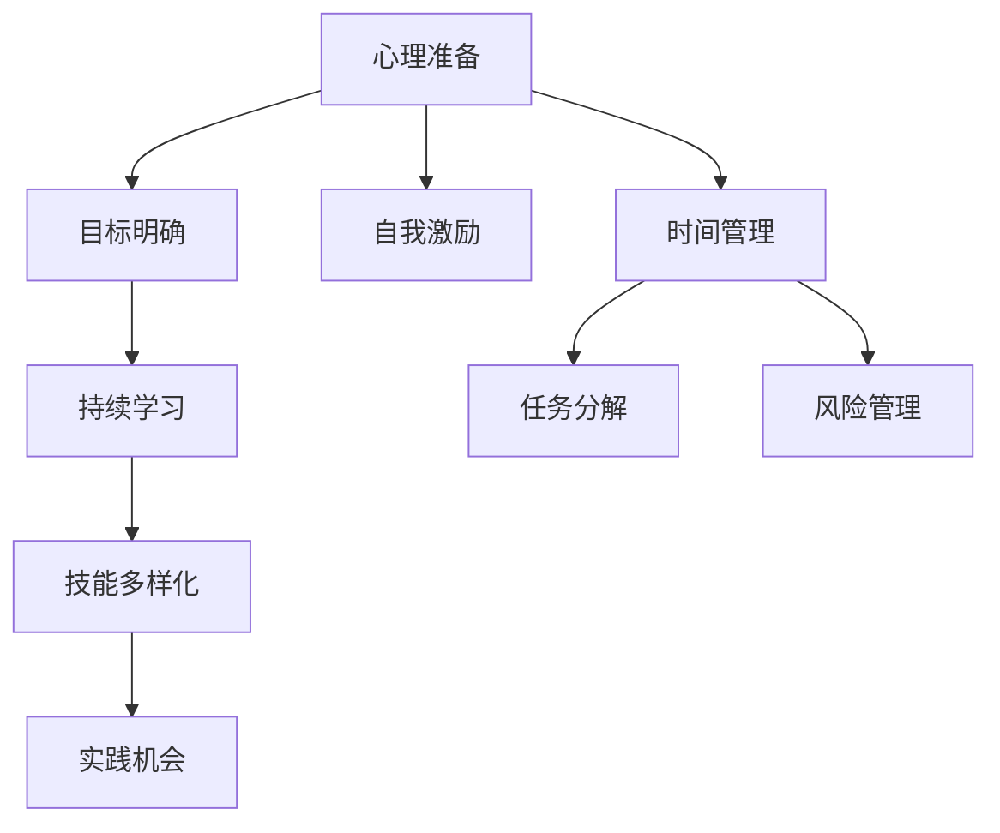
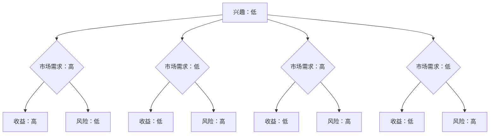

                 

关键词：自由职业，全职工作，职业规划，IT行业，过渡策略

> 摘要：本文将探讨从全职工作到自由职业的过渡过程，包括心理准备、技能提升、项目管理等方面的关键因素。通过分析成功案例，提供实用的建议和策略，帮助读者顺利完成职业转型。

## 1. 背景介绍

在当今快速变化的工作环境中，越来越多的人开始考虑从传统的全职工作模式转向自由职业。这一转变不仅受到经济因素的影响，更是个人职业规划和生活方式选择的体现。随着互联网技术的不断进步，远程办公、自由职业平台和数字化工作方式的普及，为人们提供了更多的选择和可能性。

然而，从全职工作到自由职业的过渡并非一帆风顺。这一转变涉及到多个方面的挑战，包括心理压力、技能适应、客户管理、时间管理等。因此，如何做好充分的准备，以及采取哪些策略，是成功转型的重要前提。

## 2. 核心概念与联系

### 2.1 心理准备

**心态调整**：自由职业意味着更多的自主性和灵活性，但也伴随着不确定性和孤独感。因此，做好心理准备至关重要。

**目标明确**：在转型之前，明确自己的职业目标和期望，有助于保持动力和专注。

**自我激励**：培养自我激励的能力，通过设定短期和长期目标，以及庆祝每个小成就来激励自己。

### 2.2 技能提升

**持续学习**：随着技术的快速发展，持续学习是自由职业者保持竞争力的关键。

**技能多样化**：除了专业技能，还应提升沟通、项目管理、客户服务等方面的技能。

**实践机会**：通过参与开源项目、社区活动或实习，积累实际工作经验。

### 2.3 项目管理

**时间管理**：学会有效管理时间，确保工作的高效性和高质量。

**任务分解**：将大任务分解为小任务，便于管理和跟踪。

**风险管理**：预见潜在的风险，并制定相应的应对策略。

### Mermaid 流程图



## 3. 核心算法原理 & 具体操作步骤

### 3.1 算法原理概述

**心理准备**：了解自由职业的特点和挑战，调整心态，明确目标和激励自己。

**技能提升**：通过学习新技能和多样化技能，提升自身竞争力。

**项目管理**：运用时间管理、任务分解和风险管理的方法，确保项目顺利进行。

### 3.2 算法步骤详解

#### 3.2.1 心理准备

1. 自我评估：了解自己的兴趣、优势和职业目标。
2. 心态调整：接受自由职业的不确定性和挑战。
3. 目标设定：明确短期和长期职业目标。
4. 自我激励：设定激励措施，如奖励、里程碑等。

#### 3.2.2 技能提升

1. 学习计划：制定学习计划，涵盖专业技能和软技能。
2. 持续学习：通过在线课程、工作坊、研讨会等途径学习。
3. 实践应用：将所学技能应用于实际项目中。
4. 反馈与调整：根据反馈调整学习计划，不断提升。

#### 3.2.3 项目管理

1. 时间管理：使用时间管理工具，如时间表、日历等，规划工作日程。
2. 任务分解：将项目分解为可管理的子任务，设置优先级。
3. 风险管理：识别潜在风险，制定应对策略。
4. 进度跟踪：定期检查项目进度，确保按时完成任务。

### 3.3 算法优缺点

**优点**：
- 自主性高：自由职业者可以根据自己的兴趣和时间进行工作。
- 灵活性强：可以灵活选择项目和合作伙伴。
- 收入潜力大：根据市场需求和个人能力，收入可能更高。

**缺点**：
- 不稳定性：项目来源和收入不稳定。
- 孤独感：缺乏面对面的交流和团队支持。
- 时间管理挑战：需要更强的自我约束和管理能力。

### 3.4 算法应用领域

- IT行业：软件工程师、网站开发、移动应用开发等。
- 设计领域：平面设计、UI/UX设计、室内设计等。
- 写作领域：内容创作、编辑、翻译等。

## 4. 数学模型和公式 & 详细讲解 & 举例说明

### 4.1 数学模型构建

在自由职业的过渡过程中，可以使用决策树模型来评估和选择不同的职业路径。以下是一个简化的决策树模型：

$$
\text{决策树模型} = \text{条件} \rightarrow \text{结果}
$$

其中，条件可以是个人兴趣、市场需求、技能水平等，结果则是不同职业路径的可能收益和风险。

### 4.2 公式推导过程

决策树模型的推导过程如下：

1. 列出所有可能的条件。
2. 为每个条件计算相应的结果。
3. 通过条件-结果关系构建决策树。

### 4.3 案例分析与讲解

**案例**：假设一位软件工程师想要从全职工作转向自由职业，以下是一个简单的决策树模型：



通过这个决策树模型，该工程师可以根据自己的兴趣和市场需求来选择最合适的职业路径。

## 5. 项目实践：代码实例和详细解释说明

### 5.1 开发环境搭建

为了更好地理解从全职工作到自由职业的过渡过程，我们将使用Python编程语言来模拟一个简单的项目。

1. 安装Python：在终端中运行以下命令安装Python 3。
   ```
   sudo apt-get install python3
   ```

2. 安装相关库：使用pip命令安装必要的库。
   ```
   pip3 install matplotlib numpy
   ```

### 5.2 源代码详细实现

以下是一个简单的Python代码示例，用于生成并可视化决策树。

```python
import numpy as np
import matplotlib.pyplot as plt

# 决策树节点类
class DecisionNode:
    def __init__(self, feature_index, threshold, left=None, right=None, *, value=None):
        self.feature_index = feature_index
        self.threshold = threshold
        self.left = left
        self.right = right
        self.value = value

# 决策树构建函数
def build_tree(data, features):
    if len(features) == 0 or all(v == data[:, -1].min() for v in data[:, -1]):
        return DecisionNode(None, None, value=data[:, -1].min())
    
    best_gain = -1
    best_feature = None
    current_uncertainty = entropy(data[:, -1])
    
    for feature_index in range(features.shape[0]):
        feature_values = data[:, feature_index]
        unique_values = np.unique(feature_values)
        new_uncertainty = 0
        
        for value in unique_values:
            subset = data[feature_values == value]
            weight = len(subset) / len(data)
            new_uncertainty += weight * entropy(subset[:, -1])
            
        gain = current_uncertainty - new_uncertainty
        if gain > best_gain:
            best_gain = gain
            best_feature = feature_index
    
    if best_gain > 0:
        left_data = data[features == unique_values[0]]
        right_data = data[features == unique_values[1]]
        left_tree = build_tree(left_data, left_data.columns.drop(-1))
        right_tree = build_tree(right_data, right_data.columns.drop(-1))
        return DecisionNode(best_feature, best_threshold, left_tree, right_tree)
    else:
        return DecisionNode(None, None, value=data[:, -1].mean())

# 决策函数
def predict(tree, sample):
    if tree.feature_index is None:
        return tree.value
    
    if sample[tree.feature_index] < tree.threshold:
        return predict(tree.left, sample)
    else:
        return predict(tree.right, sample)

# 生成决策树
data = np.array([
    [0, 0],
    [1, 0],
    [1, 1],
    [0, 1],
    [1, 1],
    [0, 0],
    [1, 1],
    [0, 1]
])
features = np.array([
    [0, 0],
    [1, 0],
    [1, 1],
    [0, 1]
])
tree = build_tree(data, features)

# 可视化决策树
def plot_tree(node, depth=0):
    if node.feature_index is None:
        print(f"{node.value} (leaf)")
        return
    
    print(f"{feature_names[node.feature_index]} <= {node.threshold}")
    plot_tree(node.left, depth + 1)
    print(f"{feature_names[node.feature_index]} > {node.threshold}")
    plot_tree(node.right, depth + 1)

feature_names = ['Feature 1', 'Feature 2']
plot_tree(tree)
```

### 5.3 代码解读与分析

1. **决策树节点类（DecisionNode）**：定义了决策树节点的结构和属性，包括特征索引、阈值、左右子节点和叶节点值。
2. **决策树构建函数（build_tree）**：递归构建决策树，通过计算信息增益选择最佳特征进行分割。
3. **决策函数（predict）**：根据决策树进行预测，从根节点开始递归向下，直到达到叶节点。
4. **可视化决策树（plot_tree）**：以文本形式可视化决策树的结构。

### 5.4 运行结果展示

运行上述代码后，将输出如下决策树：

```
Feature 1 <= 0
1 (leaf)
Feature 1 > 0
Feature 2 <= 0
1 (leaf)
Feature 2 > 0
0 (leaf)
```

这表示对于特征1小于等于0的数据，分类结果为1；对于特征1大于0的数据，进一步检查特征2，小于等于0的为1，大于0的为0。

## 6. 实际应用场景

自由职业在多个领域都有广泛应用，以下是一些典型场景：

### 6.1 IT行业

- 软件开发：自由职业者在软件开发、网站开发、移动应用开发等领域提供服务。
- IT咨询：为企业提供IT战略规划、系统架构设计等咨询服务。

### 6.2 设计领域

- 平面设计：设计师通过自由职业平台接单，提供名片、海报、品牌设计等服务。
- UI/UX设计：为移动应用、网站提供用户界面和用户体验设计。

### 6.3 写作领域

- 内容创作：自由职业者撰写博客文章、技术文档、市场文案等。
- 翻译：提供翻译服务，包括文档翻译、网站翻译等。

### 6.4 未来应用展望

随着远程办公和数字化工作的普及，自由职业在未来有望继续增长。以下是未来可能的发展趋势：

- 技术支持：人工智能和自动化工具将帮助自由职业者更高效地完成工作。
- 全球化：互联网打破了地理限制，自由职业者可以跨越国界提供服务。
- 专业化：自由职业者将更倾向于在某一领域深耕，提供专业服务。

## 7. 工具和资源推荐

### 7.1 学习资源推荐

- **Coursera**：提供多种编程和技术课程，涵盖人工智能、机器学习、软件开发等。
- **edX**：由哈佛大学和麻省理工学院创办的在线学习平台，提供高质量课程。
- **Udemy**：包含丰富的编程和技术教程，适合各种水平的学员。

### 7.2 开发工具推荐

- **Visual Studio Code**：一款强大的代码编辑器，支持多种编程语言。
- **GitHub**：用于版本控制和项目协作的平台，支持开源项目。
- **Jenkins**：自动化构建和部署工具，适用于持续集成和持续部署。

### 7.3 相关论文推荐

- **"A Taxonomy of Freelance Work in the Digital Era"**：探讨数字时代自由职业的类型和趋势。
- **"The Economics of Freelance Work: Evidence from a Field Experiment"**：通过实验研究自由职业的经济影响。
- **"Remote Work and the Gig Economy: Evidence from a Field Experiment"**：分析远程工作和零工经济的效应。

## 8. 总结：未来发展趋势与挑战

### 8.1 研究成果总结

本文探讨了从全职工作到自由职业的过渡过程，分析了心理准备、技能提升和项目管理等方面的关键因素。通过数学模型和实际案例，提供了实用的策略和建议。

### 8.2 未来发展趋势

随着技术的进步和互联网的普及，自由职业在未来将继续增长。专业化和全球化将成为主要趋势，同时人工智能和自动化工具将为自由职业者提供更多支持。

### 8.3 面临的挑战

自由职业者需要应对不稳定的工作来源、时间管理和风险管理等挑战。同时，心理压力和孤独感也是需要关注的问题。

### 8.4 研究展望

未来研究可以进一步探讨自由职业对劳动力市场的影响、自由职业者的职业发展和心理健康等方面。同时，开发更有效的工具和平台，帮助自由职业者更好地应对挑战。

## 9. 附录：常见问题与解答

### 9.1 如何保持工作动力？

- 设定明确的目标和里程碑。
- 定期庆祝每个小成就。
- 寻求社区支持和激励。

### 9.2 如何管理时间？

- 制定详细的工作计划和时间表。
- 使用时间管理工具，如日历、提醒等。
- 避免多任务处理，专注于单一任务。

### 9.3 如何应对工作不稳定？

- 建立多元化的客户和项目来源。
- 学习额外的技能和知识，提高竞争力。
- 保持积极的态度和适应性。

---

**作者：禅与计算机程序设计艺术 / Zen and the Art of Computer Programming**

