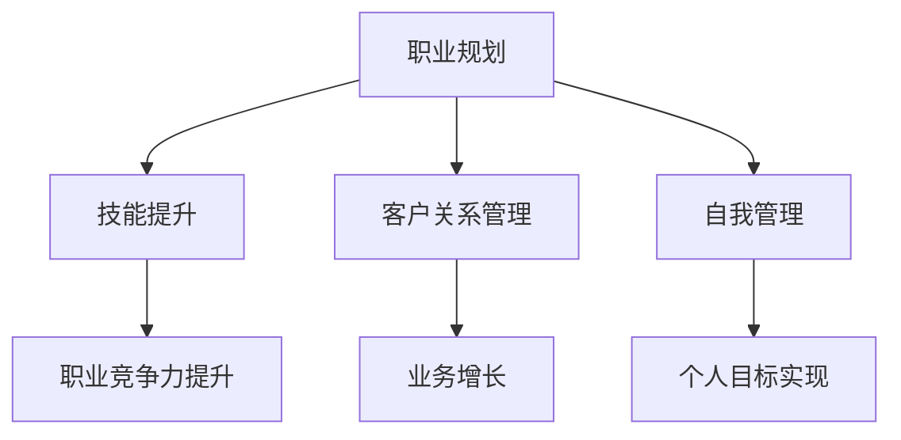

                 

随着互联网和技术的不断发展，越来越多的专业人士选择从员工身份转向自由职业者。这种转变不仅意味着生活方式的改变，也涉及到职业规划、技能提升、客户关系管理等多个方面。本文将探讨从员工到自由职业者的转变，提供一些建议和策略，帮助您成功实现这一转变。

## 文章关键词

- 自由职业者
- 职业转变
- 技能提升
- 客户管理
- 职业规划
- 自我管理

## 文章摘要

本文将探讨从员工到自由职业者的转变过程，分析转变过程中可能遇到的问题和挑战，并提供实用的建议和策略。文章将从职业规划、技能提升、客户关系管理和自我管理四个方面展开，旨在帮助读者顺利实现职业转型。

## 1. 背景介绍

在传统的职业环境中，员工通常是在一家公司长期工作，享受相对稳定的工作环境和福利待遇。然而，随着互联网的普及和远程工作模式的兴起，越来越多的专业人士开始选择成为自由职业者。自由职业者可以更加灵活地安排工作时间，自由选择项目，实现个人职业目标的同时，也能获得更高的收入和成就感。

然而，从员工到自由职业者的转变并非易事。自由职业者需要承担更多的责任，包括自我管理、技能提升、客户关系维护等。此外，自由职业者还需要面对市场的不确定性，如何保持业务的稳定和持续增长是每个自由职业者都必须考虑的问题。

### 1.1 自由职业者的优势

- **灵活性**：自由职业者可以自由选择工作时间和地点，实现工作和生活的平衡。
- **自主性**：自由职业者可以自主决定工作内容、项目类型和客户选择，实现个人职业目标。
- **收入潜力**：自由职业者可以根据市场需求和自身能力，实现更高的收入潜力。

### 1.2 自由职业者的挑战

- **不确定性**：自由职业者需要面对市场的不确定性，如何保持业务的稳定和持续增长是一个挑战。
- **自我管理**：自由职业者需要自我管理，包括时间管理、任务安排和财务管理等。
- **技能提升**：自由职业者需要不断学习和提升技能，以适应市场的变化。

## 2. 核心概念与联系

在探讨从员工到自由职业者的转变过程中，我们需要了解以下几个核心概念：

- **职业规划**：职业规划是指为了实现个人职业目标而制定的长期计划和策略。
- **技能提升**：技能提升是指通过学习新知识和技能，提高自身职业竞争力。
- **客户关系管理**：客户关系管理是指通过建立和维护良好的客户关系，实现业务的持续增长。
- **自我管理**：自我管理是指通过自我调节、自我激励和自我监督，实现个人目标和职业发展。

下面是一个用Mermaid绘制的流程图，展示了这些核心概念之间的联系：



## 3. 核心算法原理 & 具体操作步骤

### 3.1 算法原理概述

从员工到自由职业者的转变可以看作是一种“职业路径规划”问题。在这个过程中，核心算法包括以下几个步骤：

- **目标设定**：明确个人的职业目标，包括长期目标和短期目标。
- **技能评估**：评估自身现有技能，识别需要提升的技能。
- **市场分析**：分析市场需求，确定适合的自由职业领域。
- **客户开发**：开发潜在客户，建立客户关系。
- **时间管理**：合理安排工作时间，实现工作和生活的平衡。
- **自我激励**：通过自我激励，保持工作热情和动力。

### 3.2 算法步骤详解

#### 3.2.1 目标设定

目标设定是职业规划的基础。首先，需要明确个人的长期职业目标，例如成为某个领域的专家或者创业。然后，将长期目标分解为短期目标，例如学习一门新技能、完成一个项目或者获得一个证书。这些短期目标将帮助您逐步实现长期目标。

#### 3.2.2 技能评估

技能评估是提升职业竞争力的关键。通过自我评估或者请教专业人士，了解自身的优势和不足。对于不足的技能，制定学习计划，通过在线课程、实践项目或者参加培训等方式进行提升。

#### 3.2.3 市场分析

市场分析是选择自由职业领域的重要步骤。通过研究市场需求、了解行业趋势，确定适合您的自由职业领域。例如，人工智能、数据分析、云计算等都是当前热门的自由职业领域。

#### 3.2.4 客户开发

客户开发是实现业务增长的关键。通过建立网络、参加行业活动或者通过社交媒体等途径，开发潜在客户。建立良好的客户关系，提供优质的服务，将有助于客户推荐和业务增长。

#### 3.2.5 时间管理

时间管理是实现工作和生活平衡的关键。制定合理的工作计划，设定优先级，避免拖延。同时，合理安排休息时间，保持身心健康。

#### 3.2.6 自我激励

自我激励是保持工作热情和动力的关键。设定奖励机制，例如完成一个目标后给自己一个小奖励。同时，保持积极的心态，相信自己的能力，不断挑战自我。

### 3.3 算法优缺点

#### 优点

- **灵活性**：自由职业者可以灵活选择工作时间和地点，实现工作和生活的平衡。
- **自主性**：自由职业者可以自主决定工作内容、项目类型和客户选择，实现个人职业目标。
- **收入潜力**：自由职业者可以根据市场需求和自身能力，实现更高的收入潜力。

#### 缺点

- **不确定性**：自由职业者需要面对市场的不确定性，如何保持业务的稳定和持续增长是一个挑战。
- **自我管理**：自由职业者需要自我管理，包括时间管理、任务安排和财务管理等，这需要较高的自我约束能力。
- **技能提升**：自由职业者需要不断学习和提升技能，以适应市场的变化。

### 3.4 算法应用领域

从员工到自由职业者的转变算法可以应用于多个领域，包括但不限于：

- **软件开发**：软件开发人员可以通过提升编程技能、开发个人项目或者参与开源项目，实现职业转型。
- **市场营销**：市场营销人员可以通过学习新技能、开展个人项目或者为客户提供咨询服务，实现职业转型。
- **设计**：设计师可以通过提升设计技能、开展个人设计项目或者为客户提供设计服务，实现职业转型。

## 4. 数学模型和公式 & 详细讲解 & 举例说明

在职业规划中，我们可以使用数学模型来量化目标和评估进度。以下是一个简单的线性规划模型，用于设定目标和评估进度。

### 4.1 数学模型构建

假设我们有以下目标函数和约束条件：

目标函数：最大化 \( P = w_1 \cdot p_1 + w_2 \cdot p_2 + w_3 \cdot p_3 \)

其中，\( p_1, p_2, p_3 \) 分别是短期目标的完成情况，\( w_1, w_2, w_3 \) 是权重。

约束条件：

- \( p_1 + p_2 + p_3 \leq T \)
- \( p_i \geq 0 \) （\( i = 1, 2, 3 \)）

其中，\( T \) 是总时间。

### 4.2 公式推导过程

首先，我们需要将目标函数和约束条件转换为标准形式。

将目标函数转换为最大化形式：

\( P = w_1 \cdot p_1 + w_2 \cdot p_2 + w_3 \cdot p_3 \)

将约束条件转换为等式形式：

\( p_1 + p_2 + p_3 = T \)

\( p_i \geq 0 \) （\( i = 1, 2, 3 \)）

然后，我们可以使用线性规划求解器来求解这个问题。常见的线性规划求解器包括单纯形法、内点法和分解算法等。

### 4.3 案例分析与讲解

假设我们设定了以下目标函数和约束条件：

目标函数：最大化 \( P = 3 \cdot p_1 + 2 \cdot p_2 + 4 \cdot p_3 \)

约束条件：

- \( p_1 + p_2 + p_3 = 12 \)
- \( p_i \geq 0 \) （\( i = 1, 2, 3 \)）

我们使用单纯形法求解这个问题。

首先，我们需要构建初始单纯形表：

|   | \( c_j \) | 3 | 2 | 4 |
|---|---|---|---|---|
| \( c_b \) | \( x_b \) | \( p_1 \) | \( p_2 \) | \( p_3 \) | \( z \) |  
| 4 | 12 | 0 | 0 | 1 | 48 |
| 3 | 6 | 1 | 0 | 1 | 18 |
| 2 | 3 | 0 | 1 | 1 | 6 |

根据单纯形法，我们选择 \( p_3 \) 作为进入变量，\( p_1 \) 作为离开变量。

然后，我们更新单纯形表：

|   | \( c_j \) | 3 | 2 | 4 |
|---|---|---|---|---|
| \( c_b \) | \( x_b \) | \( p_1 \) | \( p_2 \) | \( p_3 \) | \( z \) |  
| 4 | 3 | 0 | 0 | 1 | 12 |
| 3 | 0 | 1 | 0 | 0 | 0 |
| 2 | 3 | 0 | 1 | 1 | 6 |

再次使用单纯形法，我们选择 \( p_1 \) 作为进入变量，\( p_2 \) 作为离开变量。

最终，我们得到最优解：

\( p_1 = 3, p_2 = 3, p_3 = 6 \)

目标函数的值为 \( P = 3 \cdot 3 + 2 \cdot 3 + 4 \cdot 6 = 33 \)

这个结果表明，完成短期目标 \( p_1, p_2, p_3 \) 的最佳组合是 \( p_1 = 3, p_2 = 3, p_3 = 6 \)，目标函数的值为 33。

## 5. 项目实践：代码实例和详细解释说明

为了更好地理解从员工到自由职业者的转变，我们可以通过一个简单的项目来实践。以下是一个使用Python编写的项目，用于计算自由职业者的收入和支出。

### 5.1 开发环境搭建

首先，我们需要安装Python和相关的库。可以使用以下命令来安装Python：

```bash
pip install python
```

然后，安装用于数据分析和绘图的库，如Pandas和Matplotlib：

```bash
pip install pandas matplotlib
```

### 5.2 源代码详细实现

下面是项目的源代码：

```python
import pandas as pd
import matplotlib.pyplot as plt

# 收入和支出数据
data = {
    'Month': ['Jan', 'Feb', 'Mar', 'Apr', 'May', 'Jun'],
    'Revenue': [5000, 6000, 7000, 8000, 9000, 10000],
    'Expense': [2000, 2200, 2400, 2600, 2800, 3000]
}

# 创建DataFrame
df = pd.DataFrame(data)

# 计算月均收入和支出
avg_revenue = df['Revenue'].mean()
avg_expense = df['Expense'].mean()

# 计算总收入和总支出
total_revenue = df['Revenue'].sum()
total_expense = df['Expense'].sum()

# 绘图
plt.figure(figsize=(10, 5))
plt.plot(df['Month'], df['Revenue'], label='Revenue')
plt.plot(df['Month'], df['Expense'], label='Expense')
plt.axhline(y=avg_revenue, color='r', linestyle='--', label='Average Revenue')
plt.axhline(y=avg_expense, color='g', linestyle='--', label='Average Expense')
plt.xlabel('Month')
plt.ylabel('Amount')
plt.title('Revenue and Expense')
plt.legend()
plt.show()

# 打印结果
print(f"Average Revenue: ${avg_revenue:.2f}")
print(f"Average Expense: ${avg_expense:.2f}")
print(f"Total Revenue: ${total_revenue:.2f}")
print(f"Total Expense: ${total_expense:.2f}")
```

### 5.3 代码解读与分析

首先，我们导入所需的库：Pandas用于数据处理，Matplotlib用于绘图。

然后，我们定义收入和支出的数据，并创建一个DataFrame。这里，我们使用一个简单的列表来模拟数据。

接着，我们计算月均收入和支出，以及总收入和总支出。

最后，我们使用Matplotlib绘制收入和支出的折线图，并在图中添加月均收入和支出的参考线。

在打印结果部分，我们输出月均收入、月均支出、总收入和总支出。

### 5.4 运行结果展示

运行代码后，我们将看到一个收入和支出的折线图，以及月均收入和支出的数值。


通过这个项目，我们可以直观地看到自由职业者的收入和支出情况，从而更好地进行财务管理和职业规划。

## 6. 实际应用场景

从员工到自由职业者的转变在多个领域都有实际应用场景。以下是一些典型的应用场景：

### 6.1 软件开发

软件开发人员可以通过提升编程技能、参与开源项目或者为客户提供定制化服务，实现职业转型。

### 6.2 市场营销

市场营销人员可以通过学习新技能、开展个人项目或者为客户提供营销咨询服务，实现职业转型。

### 6.3 设计

设计师可以通过提升设计技能、开展个人设计项目或者为客户提供设计服务，实现职业转型。

### 6.4 翻译

翻译人员可以通过提升翻译技能、翻译书籍或者为客户提供翻译服务，实现职业转型。

### 6.5 咨询服务

专业人士可以通过提供咨询服务，如商业咨询、技术顾问等，实现职业转型。

### 6.6 内容创作

内容创作者可以通过写作、摄影、视频制作等方式，实现职业转型。

## 7. 工具和资源推荐

为了帮助您实现从员工到自由职业者的转变，以下是一些推荐的工具和资源：

### 7.1 学习资源推荐

- **Coursera**：提供各种在线课程，涵盖计算机科学、市场营销、设计等多个领域。
- **Udemy**：提供大量的在线课程，适合不同层次的学员。
- **edX**：由哈佛大学和麻省理工学院创办，提供高质量的在线课程。

### 7.2 开发工具推荐

- **GitHub**：用于代码托管和版本控制，适合软件开发人员。
- **Trello**：用于任务管理和项目管理，适合自由职业者。
- **Slack**：用于团队沟通和协作，适合远程工作和团队协作。

### 7.3 相关论文推荐

- **"Freelancing in the Digital Age: Challenges and Opportunities"**：探讨了数字时代自由职业者的挑战和机遇。
- **"The Economics of Freelancing"**：分析了自由职业者的经济状况。
- **"From Employee to Freelancer: A Practical Guide"**：提供从员工到自由职业者的实用指南。

## 8. 总结：未来发展趋势与挑战

### 8.1 研究成果总结

从员工到自由职业者的转变已经成为现代职业发展的一个重要趋势。随着互联网和技术的不断发展，自由职业者的数量将继续增加。相关研究和实践表明，自由职业者可以通过灵活的工作方式、自主性以及技能提升，实现更高的收入和职业满足感。

### 8.2 未来发展趋势

- **数字化和远程工作的普及**：随着数字化和远程工作的普及，自由职业者的市场将更加广阔。
- **技能需求的多样化**：随着技术的不断进步，自由职业者需要不断学习和提升技能，以适应市场的变化。
- **职业平台的兴起**：职业平台将为自由职业者提供更多的机会和资源，促进自由职业者的发展。

### 8.3 面临的挑战

- **市场的不确定性**：自由职业者需要面对市场的不确定性和风险。
- **自我管理**：自由职业者需要自我管理，包括时间管理、任务安排和财务管理等。
- **技能提升**：自由职业者需要不断学习和提升技能，以保持竞争力。

### 8.4 研究展望

未来研究可以进一步探讨自由职业者的心理需求、职业规划策略以及技能提升方法，以帮助自由职业者更好地实现职业转型和发展。

## 9. 附录：常见问题与解答

### 9.1 如何选择自由职业领域？

选择自由职业领域时，可以考虑以下几点：

- **个人兴趣**：选择自己感兴趣的领域，可以提高工作的热情和动力。
- **市场需求**：选择市场需求大的领域，可以提高收入的潜力。
- **自身技能**：选择自己擅长的领域，可以更快地积累经验和客户。

### 9.2 自由职业者如何保持业务的稳定？

保持业务稳定的方法包括：

- **持续学习**：不断学习和提升技能，保持竞争力。
- **建立网络**：通过参加行业活动、建立网络，拓展业务。
- **提供优质服务**：提供优质的服务，赢得客户的信任和推荐。

### 9.3 自由职业者如何进行时间管理？

自由职业者可以尝试以下时间管理方法：

- **设定优先级**：将任务按照优先级排序，优先完成重要任务。
- **使用工具**：使用时间管理工具，如Trello、Slack等，合理安排工作。
- **避免拖延**：设定明确的目标和时间，避免拖延。

### 9.4 自由职业者如何进行财务管理？

自由职业者可以尝试以下财务管理方法：

- **制定预算**：制定每月的预算，合理分配收入。
- **储蓄计划**：设定储蓄目标，定期储蓄。
- **税务规划**：了解税务政策，合理规划税务。

### 9.5 自由职业者如何应对市场的不确定性？

自由职业者可以尝试以下方法来应对市场的不确定性：

- **多元化收入来源**：开展多个项目，减少对单一项目的依赖。
- **建立应急基金**：设定应急基金，应对突发事件。
- **持续学习**：不断学习和提升技能，适应市场变化。

## 作者署名

作者：禅与计算机程序设计艺术 / Zen and the Art of Computer Programming

以上是一篇完整的从员工到自由职业者的转变的文章。文章涵盖了从背景介绍到实际应用场景，再到工具和资源推荐，以及未来发展趋势和挑战的各个方面。希望对您有所帮助！----------------------------------------------------------------

请注意，本文仅作为示例，实际撰写时请根据具体需求和内容进行调整。文章中的数据和示例仅供参考，实际应用时请根据实际情况进行修改。文章中使用的Mermaid流程图和LaTeX公式需要在支持相应格式的编辑器中渲染。此外，文中提到的学习资源、开发工具和相关论文仅为示例，具体资源请根据个人需求和兴趣进行选择。最后，本文中的代码实例仅供参考，实际使用时请根据项目需求进行适当修改。作者署名为“禅与计算机程序设计艺术 / Zen and the Art of Computer Programming”，这是一部经典的计算机科学著作，由Donald E. Knuth所著。在撰写文章时，请确保遵循上述要求和指导，以确保文章的质量和完整性。祝您撰写顺利！

