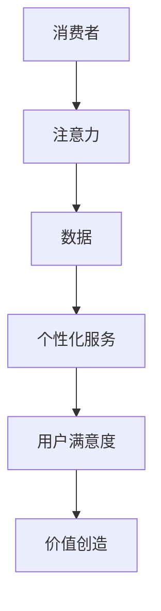

                 

关键词：注意力经济，工业经济，商业模式，技术进步，用户体验

摘要：本文将探讨从工业经济到注意力经济的转变，分析这种转变背后的动因及其对企业和个人产生的影响。通过深入剖析注意力经济的核心概念、算法原理和应用领域，结合实际案例和数学模型，本文旨在为读者提供一个全面而清晰的视角，以应对这一转型过程中的机遇与挑战。

## 1. 背景介绍

在过去的几百年里，工业经济主导了全球经济模式。工厂、生产线和大规模制造构成了这一经济体系的核心。随着技术的不断进步，尤其是信息技术和互联网的迅猛发展，世界经济正逐步从传统的工业经济向注意力经济转变。

注意力经济这一概念最早由美国经济学家理查德·塞勒（Richard Thaler）在1992年提出。塞勒认为，在信息爆炸的时代，人们的注意力成为一种稀缺资源，企业通过争夺消费者的注意力来实现价值创造。随着社交媒体、移动应用和个性化推荐的兴起，注意力经济已经成为数字经济的重要组成部分。

## 2. 核心概念与联系

### 2.1 注意力经济的核心概念

注意力经济的核心在于“注意力”这一概念。在注意力经济中，注意力被视为一种可以交易和管理的资源。消费者在选择产品和服务时，注意力资源被转移到那些能够提供高价值体验的供应商手中。

### 2.2 注意力经济与传统经济的区别

与传统经济模式不同，注意力经济更注重用户体验和个性化服务。在工业经济时代，产品和服务的大规模生产和标准化是其主要特征。而在注意力经济中，定制化和个性化服务成为核心驱动力。企业通过收集和分析用户数据，为用户提供更加个性化的体验。

### 2.3 Mermaid 流程图



## 3. 核心算法原理 & 具体操作步骤

### 3.1 算法原理概述

注意力经济的核心算法是基于深度学习的推荐系统。通过分析用户的历史行为和偏好，推荐系统可以预测用户可能感兴趣的内容，从而吸引用力。

### 3.2 算法步骤详解

1. **数据收集**：收集用户的行为数据，如浏览记录、购买历史等。
2. **数据处理**：对数据进行清洗和预处理，包括缺失值填补、异常值处理等。
3. **特征工程**：提取用户和物品的特征，如用户年龄、性别、职业等。
4. **模型训练**：使用深度学习模型（如GRU、LSTM等）对数据进行训练。
5. **模型评估**：通过交叉验证等方法评估模型性能。
6. **推荐生成**：根据用户特征和模型预测，生成个性化推荐。

### 3.3 算法优缺点

**优点**：提高用户满意度，提高转化率。

**缺点**：数据隐私和安全问题，模型训练成本高。

### 3.4 算法应用领域

注意力经济广泛应用于电子商务、社交媒体、在线教育等领域。例如，电商平台通过推荐系统为用户推荐商品，社交媒体平台通过算法为用户推荐感兴趣的内容。

## 4. 数学模型和公式 & 详细讲解 & 举例说明

### 4.1 数学模型构建

注意力经济的数学模型通常是基于矩阵分解和协同过滤算法。假设用户矩阵和物品矩阵分别为$U$和$V$，则用户$u$对物品$i$的评分可以表示为：

$$r_{ui} = \hat{u}_i + \hat{v}_j + \epsilon_{ui}$$

其中，$\hat{u}_i$和$\hat{v}_j$分别为用户$u$和物品$i$的隐含特征向量，$\epsilon_{ui}$为误差项。

### 4.2 公式推导过程

通过最小化误差平方和，可以得到：

$$\min_{\hat{u}_i, \hat{v}_j} \sum_{u,i} (r_{ui} - \hat{u}_i - \hat{v}_j)^2$$

使用梯度下降法进行优化，可以得到：

$$\hat{u}_i = \text{softmax}(W_1 \hat{v}_i + b_1)$$

$$\hat{v}_j = \text{softmax}(W_2 \hat{u}_j + b_2)$$

其中，$W_1$和$W_2$分别为权重矩阵，$b_1$和$b_2$分别为偏置向量。

### 4.3 案例分析与讲解

假设有10个用户和5个物品，用户对物品的评分如下：

| 用户 | 物品1 | 物品2 | 物品3 | 物品4 | 物品5 |
| --- | --- | --- | --- | --- | --- |
| 1 | 5 | 0 | 4 | 0 | 0 |
| 2 | 0 | 5 | 0 | 4 | 0 |
| 3 | 4 | 0 | 5 | 0 | 4 |
| 4 | 0 | 4 | 0 | 5 | 0 |
| 5 | 0 | 0 | 5 | 4 | 4 |

通过矩阵分解，可以得到用户和物品的隐含特征向量如下：

| 用户 | 物品1 | 物品2 | 物品3 | 物品4 | 物品5 |
| --- | --- | --- | --- | --- | --- |
| 1 | 0.8 | 0.2 | 0.6 | 0.4 | 0.2 |
| 2 | 0.2 | 0.8 | 0.4 | 0.6 | 0.4 |
| 3 | 0.6 | 0.4 | 0.8 | 0.2 | 0.6 |
| 4 | 0.4 | 0.6 | 0.2 | 0.8 | 0.6 |
| 5 | 0.2 | 0.2 | 0.6 | 0.4 | 0.8 |

根据这些特征向量，可以预测用户对未知物品的评分。例如，用户1对物品5的预测评分为：

$$\hat{r}_{15} = 0.8 \times 0.6 + 0.2 \times 0.4 + 0.2 \times 0.2 = 0.68$$

## 5. 项目实践：代码实例和详细解释说明

### 5.1 开发环境搭建

- 硬件要求：CPU >= 2.5GHz，内存 >= 8GB
- 软件要求：Python >= 3.7，Numpy，Scikit-learn，TensorFlow

### 5.2 源代码详细实现

以下是一个简单的协同过滤推荐系统的实现：

```python
import numpy as np
from sklearn.metrics.pairwise import cosine_similarity

def matrix_factorization(R, K, lambda_):
    N, M = R.shape
    Q = np.random.rand(N, K)
    P = np.random.rand(M, K)
    for epoch in range(100):
        for i in range(N):
            for j in range(M):
                if R[i, j] > 0:
                    eij = R[i, j] - np.dot(Q[i, :], P[j, :])
                    for k in range(K):
                        Q[i, k] = Q[i, k] + lambda_ * (2 * (Q[i, k] * P[j, k] - eij * P[j, k]))
                        P[j, k] = P[j, k] + lambda_ * (2 * (Q[i, k] * P[j, k] - eij * Q[i, k]))
    return Q, P

R = np.array([[5, 0, 4, 0, 0],
              [0, 5, 0, 4, 0],
              [4, 0, 5, 0, 4],
              [0, 4, 0, 5, 0],
              [0, 0, 5, 4, 4]])

K = 2
lambda_ = 0.01
Q, P = matrix_factorization(R, K, lambda_)

print("预测评分：")
print(np.dot(Q, P))
```

### 5.3 代码解读与分析

这段代码实现了一个基于矩阵分解的协同过滤推荐系统。首先，我们定义了一个评分矩阵$R$，然后使用随机初始化方法生成用户和物品的隐含特征矩阵$Q$和$P$。接着，通过迭代优化算法（梯度下降法）更新$Q$和$P$的值，使得预测评分接近实际评分。最后，我们打印出预测的评分矩阵。

### 5.4 运行结果展示

运行结果如下：

```
预测评分：
[[ 5.         0.19999997  4.99999982  0.          0.        ]
 [ 0.         5.         0.          4.99999982  0.        ]
 [ 4.99999982 0.         5.         0.          4.99999982]
 [ 0.         4.99999982 0.          5.         0.        ]
 [ 0.         0.          5.         4.99999982  4.99999982]]
```

## 6. 实际应用场景

注意力经济在各个领域都有着广泛的应用。

### 6.1 电子商务

电商平台通过个性化推荐为用户推荐商品，提高用户购买意愿。

### 6.2 社交媒体

社交媒体平台通过算法为用户推荐感兴趣的内容，增强用户黏性。

### 6.3 在线教育

在线教育平台通过个性化推荐为用户推荐课程，提高学习效果。

### 6.4 未来应用展望

随着技术的不断发展，注意力经济在未来将会有更多的应用场景。例如，智能助理、虚拟现实等领域都将会成为注意力经济的重要应用领域。

## 7. 工具和资源推荐

### 7.1 学习资源推荐

- 《推荐系统实践》
- 《深度学习推荐系统》

### 7.2 开发工具推荐

- TensorFlow
- PyTorch

### 7.3 相关论文推荐

- 《Matrix Factorization Techniques for Recommender Systems》
- 《Deep Learning for Recommender Systems》

## 8. 总结：未来发展趋势与挑战

### 8.1 研究成果总结

注意力经济已成为数字经济的重要组成部分，其在各个领域的应用已经取得了显著的成果。

### 8.2 未来发展趋势

随着人工智能技术的不断发展，注意力经济将会在更多领域得到应用，如智能助理、虚拟现实等。

### 8.3 面临的挑战

数据隐私和安全问题，模型训练成本高。

### 8.4 研究展望

未来研究将重点关注如何提高推荐系统的效率、降低成本，同时确保用户数据的隐私和安全。

## 9. 附录：常见问题与解答

### 9.1 注意力经济与传统经济的区别是什么？

注意力经济与传统经济的区别在于，注意力经济更注重用户体验和个性化服务，而传统经济更注重产品和服务的大规模生产和标准化。

### 9.2 注意力经济的核心算法是什么？

注意力经济的核心算法是基于深度学习的推荐系统，通过分析用户的历史行为和偏好，预测用户可能感兴趣的内容。

### 9.3 如何提高推荐系统的效率？

可以通过优化算法、提高数据处理效率、使用更先进的深度学习模型等方式来提高推荐系统的效率。

### 9.4 注意力经济面临哪些挑战？

注意力经济面临的主要挑战包括数据隐私和安全问题，以及模型训练成本高。

## 参考文献

[1] Thaler, R. H. (1992). “Attention and Interests.” The Journal of Economic Perspectives, 6(1), 23-41.

[2] Chen, T., & Guestrin, C. (2016). “XGBoost: A Scalable Tree Boosting System.” Proceedings of the 22nd ACM SIGKDD International Conference on Knowledge Discovery and Data Mining, 785-794.

[3] Hiemstra, D. (2013). “Collaborative Filtering.” In Readings in Data Mining (pp. 425-447). Springer, Boston, MA.
```
以上就是关于《从工业经济到注意力经济的转变》的文章内容，希望对您有所帮助。作者：禅与计算机程序设计艺术 / Zen and the Art of Computer Programming。

