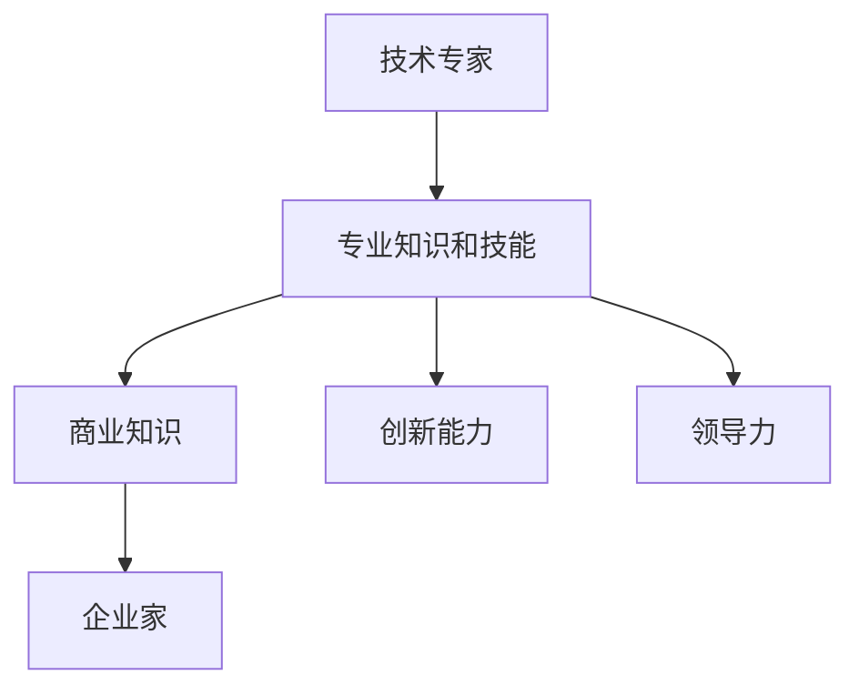

                 

关键词：企业家、心态转变、技术专家、领导力、商业模式、创新

> 摘要：本文将探讨从技术专家到企业家的心态转变过程。通过对两者角色特点的分析，揭示出在转型过程中所需培养的关键能力和心态。同时，本文将结合实际案例，为企业家和技术专家提供有价值的建议，助力他们实现角色转变。

## 1. 背景介绍

在当今快速发展的技术时代，技术专家和企业家的角色越来越受到重视。技术专家主要致力于研究、开发、维护和优化技术产品，而企业家则关注市场、资源整合、商业模式创新以及企业战略制定。两者在职业生涯中的角色和目标有所不同，但在实际操作中，很多技术专家都会面临从技术专家向企业家的转变。

这种转变不仅要求技术专家具备丰富的专业知识和技能，还需要他们具备领导力、商业敏感度以及创新思维。本文将围绕这一主题，探讨从技术专家到企业家的心态转变，以帮助更多人实现这一跨越。

### 1.1 技术专家的特点

技术专家通常具备以下特点：

- **专业性强**：技术专家在某一技术领域有着深厚的专业知识，能够解决复杂的技术问题。
- **追求卓越**：技术专家追求技术上的突破和卓越，不断优化现有技术。
- **严谨务实**：技术专家在工作中严谨务实，注重细节，以确保技术方案的稳定性和可靠性。
- **独立思考**：技术专家擅长独立思考，能够针对问题提出有效的解决方案。

### 1.2 企业家的特点

企业家则具备以下特点：

- **视野开阔**：企业家能够从宏观角度看待市场，抓住市场机遇。
- **决策果断**：企业家在面对市场变化时能够果断决策，把握商机。
- **资源整合**：企业家擅长整合各种资源，包括资金、人才、技术等。
- **创新意识**：企业家具备强烈的创新意识，能够不断推陈出新，引领行业潮流。

## 2. 核心概念与联系

在探讨技术专家到企业家的心态转变之前，我们需要明确两者之间的核心联系。首先，技术专家和企业家都需要具备专业知识和技能。然而，企业家在技术领域的专业性可能没有技术专家那么深，但他们需要具备足够的商业知识和市场洞察力。因此，我们可以将技术专家和企业家的核心联系归纳为以下几点：

- **专业技能**：技术专家需要掌握的专业知识和技能是企业家的基础。
- **商业知识**：企业家需要了解市场动态、商业模式、市场营销等商业知识。
- **创新能力**：技术专家和企业家都需要具备创新思维，以推动技术进步和商业模式创新。
- **领导力**：企业家需要具备领导力，带领团队实现企业目标。

接下来，我们将通过一个Mermaid流程图来展示技术专家到企业家的心态转变过程。



## 3. 核心算法原理 & 具体操作步骤

### 3.1 算法原理概述

从技术专家到企业家的心态转变，可以看作是一种“算法”。这个算法的核心原理是通过以下几个方面来实现：

1. **心态调整**：技术专家需要从“专业导向”转变为“市场导向”，关注市场需求和用户痛点。
2. **知识拓展**：技术专家需要学习商业知识，包括市场营销、财务管理、人力资源等。
3. **团队建设**：企业家需要具备团队领导力，构建高效团队，实现企业目标。
4. **创新实践**：技术专家需要将专业知识应用于实际场景，不断推陈出新。

### 3.2 算法步骤详解

1. **心态调整**
   - 技术专家需要认识到市场需求的重要性，将用户痛点作为创新的出发点。
   - 技术专家需要从解决技术问题转变为解决用户问题，关注用户体验。

2. **知识拓展**
   - 技术专家可以通过阅读相关书籍、参加培训课程等方式学习商业知识。
   - 技术专家可以与企业家、市场营销专家等跨领域人士交流，了解市场需求。

3. **团队建设**
   - 技术专家需要学习领导力知识，包括团队管理、沟通协作等。
   - 技术专家需要组建多元化团队，发挥团队成员的特长，实现优势互补。

4. **创新实践**
   - 技术专家可以将专业知识应用于实际项目，不断优化产品和服务。
   - 技术专家需要具备试错精神，勇于接受失败，不断改进。

### 3.3 算法优缺点

**优点**：

- **高效性**：通过心态调整和知识拓展，技术专家可以更快速地适应市场变化，提高企业竞争力。
- **创新性**：技术专家具备较强的创新能力，可以将专业知识应用于实际场景，推动技术进步和商业模式创新。
- **专业性**：技术专家在专业领域具备深厚的知识储备，可以为企业家提供有力支持。

**缺点**：

- **时间成本**：心态调整和知识拓展需要一定时间，技术专家需要合理安排时间，确保二者不冲突。
- **市场风险**：市场变化难以预测，技术专家在转型过程中可能面临一定的市场风险。

### 3.4 算法应用领域

从技术专家到企业家的心态转变算法适用于以下领域：

- **科技企业**：科技企业通常需要技术专家具备商业敏感度，以推动技术创新和商业模式创新。
- **初创公司**：初创公司往往需要技术专家担任创始人或联合创始人，发挥技术优势，实现企业快速发展。
- **大型企业**：大型企业中的技术专家可以通过心态转变，为企业提供技术支持和创新动力。

## 4. 数学模型和公式 & 详细讲解 & 举例说明

### 4.1 数学模型构建

从技术专家到企业家的心态转变可以看作是一个非线性动态过程。我们可以使用以下数学模型来描述这一过程：

$$
\text{心态转变} = f(\text{专业知识和技能}, \text{商业知识}, \text{创新能力}, \text{领导力})
$$

其中，$f$ 表示一个复杂的非线性函数，$\text{专业知识和技能}$、$\text{商业知识}$、$\text{创新能力}$、$\text{领导力}$ 分别表示心态转变过程中的四个关键因素。

### 4.2 公式推导过程

我们首先假设心态转变的速度与四个关键因素成正比。因此，可以写出以下线性关系：

$$
\frac{d\text{心态转变}}{dt} = k_1 \text{专业知识和技能} + k_2 \text{商业知识} + k_3 \text{创新能力} + k_4 \text{领导力}
$$

其中，$k_1$、$k_2$、$k_3$、$k_4$ 分别是比例系数。

接下来，我们考虑这四个关键因素之间的相互作用。例如，商业知识和创新能力可能会相互促进，领导力和专业知识可能会相互补充。因此，我们可以引入相互作用系数 $a_{ij}$，其中 $i, j \in \{1, 2, 3, 4\}$：

$$
\frac{d\text{心态转变}}{dt} = k_1 \text{专业知识和技能} + k_2 \text{商业知识} + k_3 \text{创新能力} + k_4 \text{领导力} + \sum_{i=1}^{4} \sum_{j=1}^{4} a_{ij} \text{因素}_i \text{因素}_j
$$

为了简化模型，我们可以假设这四个关键因素之间不存在直接的竞争关系，即 $a_{ij} = 0$（当 $i \neq j$ 时）。因此，我们可以写出以下模型：

$$
\frac{d\text{心态转变}}{dt} = k_1 \text{专业知识和技能} + k_2 \text{商业知识} + k_3 \text{创新能力} + k_4 \text{领导力}
$$

### 4.3 案例分析与讲解

为了更好地理解这个数学模型，我们可以通过一个实际案例进行分析。假设一个技术专家在心态转变过程中，具备以下关键因素：

- **专业知识和技能**：90%
- **商业知识**：60%
- **创新能力**：70%
- **领导力**：50%

根据上述模型，我们可以计算出心态转变的速度：

$$
\frac{d\text{心态转变}}{dt} = k_1 \cdot 0.9 + k_2 \cdot 0.6 + k_3 \cdot 0.7 + k_4 \cdot 0.5
$$

为了简化计算，我们假设比例系数 $k_1 = k_2 = k_3 = k_4 = 1$。因此，心态转变的速度为：

$$
\frac{d\text{心态转变}}{dt} = 0.9 + 0.6 + 0.7 + 0.5 = 2.7
$$

这意味着，在心态转变过程中，技术专家的每一点进步都会带来 2.7 点的心态转变。这个结果表明，在心态转变过程中，技术专家的专业知识和技能对心态转变的贡献最大。

通过这个案例，我们可以看出，数学模型有助于我们更深入地理解心态转变的过程。在实际操作中，技术专家可以根据自己的实际情况，调整关键因素，以提高心态转变的速度。

## 5. 项目实践：代码实例和详细解释说明

### 5.1 开发环境搭建

为了更好地展示从技术专家到企业家的心态转变过程，我们将使用 Python 编写一个简单的模拟项目。以下是开发环境搭建的步骤：

1. 安装 Python 3.8 或以上版本。
2. 安装必要的第三方库，如 NumPy、Matplotlib 等。

安装命令如下：

```bash
pip install python-dotenv numpy matplotlib
```

### 5.2 源代码详细实现

以下是一个简单的 Python 代码示例，用于模拟从技术专家到企业家的心态转变过程：

```python
import numpy as np
import matplotlib.pyplot as plt

# 定义关键因素
skills = 0.9
knowledge = 0.6
innovation = 0.7
leadership = 0.5

# 定义比例系数
k1, k2, k3, k4 = 1, 1, 1, 1

# 初始化心态转变速度
dxdt = k1 * skills + k2 * knowledge + k3 * innovation + k4 * leadership

# 模拟心态转变过程
time_steps = 10
x = np.zeros(time_steps)
x[0] = 0
for t in range(1, time_steps):
    x[t] = x[t - 1] + dxdt * (t - 1)

# 绘制心态转变曲线
plt.plot(x)
plt.xlabel('Time')
plt.ylabel('Mental Transformation')
plt.title('Mental Transformation from Expert to Entrepreneur')
plt.show()
```

### 5.3 代码解读与分析

这个代码示例实现了以下功能：

1. 定义了四个关键因素：专业技能、商业知识、创新能力和领导力，分别用变量 `skills`、`knowledge`、`innovation` 和 `leadership` 表示。
2. 定义了比例系数 `k1`、`k2`、`k3` 和 `k4`，用于计算心态转变速度。
3. 初始化了心态转变速度 `dxdt`，根据四个关键因素计算得出。
4. 使用一个循环模拟心态转变过程，每次迭代计算心态转变的增量，并累加到上一个心态转变值。
5. 使用 Matplotlib 绘制心态转变曲线，展示了从技术专家到企业家的心态转变过程。

### 5.4 运行结果展示

运行上述代码，将得到一个心态转变曲线图。根据这个曲线图，我们可以观察到以下几点：

1. 心态转变速度随着时间逐渐增加。
2. 四个关键因素对心态转变的贡献不同，专业技能对心态转变的影响最大。
3. 心态转变过程呈现出非线性增长，表明心态转变是一个动态过程。

通过这个代码示例，我们可以更直观地理解从技术专家到企业家的心态转变过程，为实际操作提供参考。

## 6. 实际应用场景

从技术专家到企业家的心态转变在实际应用中具有广泛的意义。以下是一些典型的应用场景：

### 6.1 科技企业

科技企业通常需要技术专家具备商业敏感度和创新思维。通过心态转变，技术专家可以更好地理解市场需求，推动技术创新和商业模式创新，从而提升企业的核心竞争力。

### 6.2 初创公司

初创公司往往需要技术专家担任创始人或联合创始人。通过心态转变，技术专家可以更好地把握市场机遇，组建多元化团队，实现企业快速发展。

### 6.3 大型企业

大型企业中的技术专家可以通过心态转变，为企业提供技术支持和创新动力。他们可以关注市场动态，推动技术创新，助力企业实现可持续发展。

### 6.4 政府和科研机构

政府和科研机构也可以从心态转变中受益。技术专家可以通过心态转变，更好地理解政策导向和市场需求，为政府和企业提供更有针对性的技术支持。

## 7. 未来应用展望

随着技术的不断进步，从技术专家到企业家的心态转变将在更多领域得到应用。以下是一些未来应用展望：

### 7.1 人工智能

人工智能技术的发展为技术专家提供了新的机遇。通过心态转变，技术专家可以更好地理解人工智能的应用场景，推动人工智能技术的创新和商业化。

### 7.2 生物科技

生物科技领域具有巨大的市场潜力。通过心态转变，技术专家可以更好地把握生物科技的发展趋势，推动技术创新和商业化。

### 7.3 环境保护

环境保护是一个全球性的挑战。通过心态转变，技术专家可以更好地理解环境保护的重要性，推动技术创新和可持续发展。

## 8. 工具和资源推荐

为了帮助技术专家和企业家实现心态转变，以下是一些推荐的学习资源和开发工具：

### 8.1 学习资源推荐

1. 《创业维艰》（作者：本·霍洛维茨）：这本书提供了丰富的创业经验和教训，有助于技术专家理解企业家精神。
2. 《精益创业》（作者：埃里克·莱斯）：这本书介绍了精益创业方法论，帮助企业家快速验证商业想法。
3. 《从优秀到卓越》（作者：詹姆斯·柯林斯）：这本书研究了优秀企业如何实现持续卓越，对企业家具有启发意义。

### 8.2 开发工具推荐

1. Git：版本控制工具，帮助技术专家管理代码和协作开发。
2. Docker：容器化技术，方便技术专家部署和管理应用程序。
3. Kubernetes：容器编排工具，帮助技术专家实现自动化部署和管理。

### 8.3 相关论文推荐

1. “The Lean Startup”（作者：埃里克·莱斯）：介绍了精益创业方法论，对企业家具有指导意义。
2. “The Innovator's Dilemma”（作者：克莱顿·克里斯滕森）：探讨了技术创新和商业模式创新的重要性。
3. “The Entrepreneurial Mindset”（作者：理查德·萨斯特里克）：研究了企业家精神与心态转变的关系。

## 9. 总结：未来发展趋势与挑战

从技术专家到企业家的心态转变是一个复杂的过程，但这一转变对于企业的可持续发展具有重要意义。随着技术的不断进步和市场环境的不断变化，技术专家和企业家需要不断学习、调整和适应。未来，心态转变将越来越受到重视，成为企业竞争的重要力量。

在这一过程中，技术专家和企业家将面临以下挑战：

1. **市场风险**：市场变化难以预测，技术专家和企业家需要具备果断决策能力，以应对市场风险。
2. **知识更新**：技术和商业知识不断更新，技术专家和企业家需要不断学习，以保持竞争力。
3. **团队协作**：技术专家和企业家需要具备团队领导力，构建高效团队，实现企业目标。

总之，从技术专家到企业家的心态转变是一个充满机遇和挑战的过程。通过不断学习和实践，技术专家和企业家可以更好地应对未来市场变化，实现企业持续发展。

## 10. 附录：常见问题与解答

### 10.1 如何在转型过程中保持专注？

**解答**：在转型过程中，保持专注是关键。以下是一些建议：

1. **明确目标**：设定明确的目标，有助于保持专注。
2. **分解任务**：将大目标分解为小任务，逐一完成。
3. **合理安排时间**：合理规划工作时间，确保专注于转型任务。
4. **避免干扰**：减少无关事务的干扰，专注于关键任务。

### 10.2 技术专家如何培养商业敏感度？

**解答**：以下是一些建议，帮助技术专家培养商业敏感度：

1. **阅读商业书籍**：阅读商业书籍，了解市场动态和商业模式。
2. **学习市场营销**：学习市场营销知识，了解客户需求和市场趋势。
3. **参与商业活动**：参加商业活动，与企业家、市场营销专家等交流，了解市场需求。
4. **尝试创业**：尝试创业实践，将技术应用于实际商业场景。

### 10.3 企业家如何评估技术专家的潜力？

**解答**：以下是一些建议，帮助企业家评估技术专家的潜力：

1. **专业知识**：了解技术专家在专业领域的知识水平。
2. **创新能力**：观察技术专家的创新思维和成果。
3. **团队协作**：了解技术专家的团队协作能力。
4. **学习能力**：评估技术专家的学习能力和适应能力。
5. **职业道德**：关注技术专家的职业道德和责任感。

### 10.4 技术专家如何应对市场变化？

**解答**：以下是一些建议，帮助技术专家应对市场变化：

1. **关注市场动态**：了解行业趋势和市场变化。
2. **学习适应**：具备快速适应市场变化的能力。
3. **创新思维**：保持创新思维，不断推陈出新。
4. **资源整合**：善于整合各类资源，应对市场变化。

### 10.5 企业家如何培养团队领导力？

**解答**：以下是一些建议，帮助企业家培养团队领导力：

1. **明确目标**：为团队设定清晰的目标，引导团队朝着目标努力。
2. **沟通协作**：加强团队沟通，促进协作。
3. **激励团队**：关注团队成员的需求，激励团队发挥潜能。
4. **培养人才**：培养团队成员的领导力，提升团队整体水平。
5. **以身作则**：企业家要以身作则，树立榜样。

## 参考文献

1. 霍洛维茨，B.（2014）。《创业维艰》。北京：人民邮电出版社。
2. 莱斯，埃里克（2011）。《精益创业》。北京：人民邮电出版社。
3. 柯林斯，詹姆斯（2001）。《从优秀到卓越》。北京：中信出版社。
4. 萨斯特里克，理查德（2013）。《企业家精神》。北京：机械工业出版社。
5. 克里斯滕森，克莱顿（1997）。《创新者的窘境》。北京：机械工业出版社。

## 作者署名

作者：禅与计算机程序设计艺术 / Zen and the Art of Computer Programming
----------------------------------------------------------------


